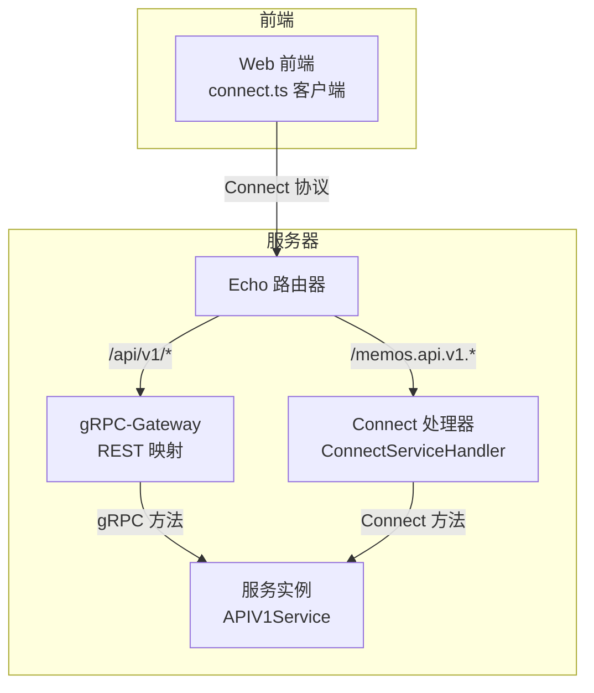
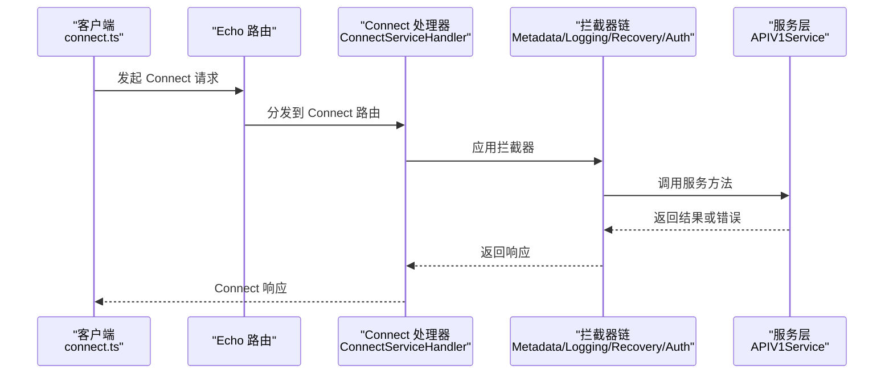
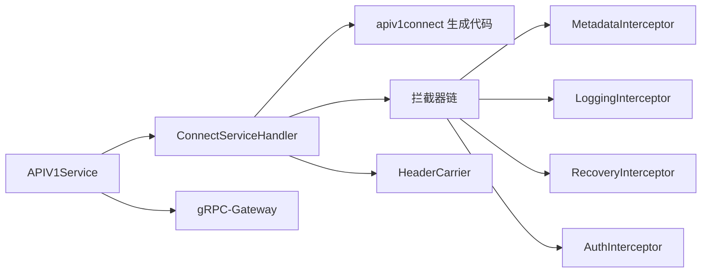

# Connect RPC 服务

<cite>
**本文档引用的文件**
- [connect_handler.go](file://server/router/api/v1/connect_handler.go)
- [connect_interceptors.go](file://server/router/api/v1/connect_interceptors.go)
- [connect_services.go](file://server/router/api/v1/connect_services.go)
- [header_carrier.go](file://server/router/api/v1/header_carrier.go)
- [v1.go](file://server/router/api/v1/v1.go)
- [common.go](file://server/router/api/v1/common.go)
- [activity_service.connect.go](file://proto/gen/api/v1/apiv1connect/activity_service.connect.go)
- [memo_service.connect.go](file://proto/gen/api/v1/apiv1connect/memo_service.connect.go)
- [memo_service.proto](file://proto/api/v1/memo_service.proto)
- [connect.ts](file://web/src/connect.ts)
</cite>

## 目录
1. [简介](#简介)
2. [项目结构](#项目结构)
3. [核心组件](#核心组件)
4. [架构总览](#架构总览)
5. [详细组件分析](#详细组件分析)
6. [依赖关系分析](#依赖关系分析)
7. [性能考虑](#性能考虑)
8. [故障排查指南](#故障排查指南)
9. [结论](#结论)
10. [附录](#附录)

## 简介
本文件系统性阐述 Memos 中 Connect RPC 服务的实现机制，涵盖服务注册流程、处理器配置、拦截器链设计、与 gRPC 的差异与优势、在 RESTful 场景下的应用、连接管理、错误处理与性能优化策略，并提供可复用的最佳实践与实现示例路径。

## 项目结构
Connect RPC 在 Memos 中采用“协议无关”的服务层设计：业务逻辑集中在统一的服务结构体中，Connect 与 gRPC-Gateway 通过适配器与包装器分别接入，既支持浏览器直连 Connect 协议，也兼容传统 gRPC/REST 调用。

图表来源
- [v1.go](file://server/router/api/v1/v1.go#L120-L237)
- [connect_handler.go](file://server/router/api/v1/connect_handler.go#L36-L69)
- [connect_interceptors.go](file://server/router/api/v1/connect_interceptors.go#L19-L87)

章节来源
- [v1.go](file://server/router/api/v1/v1.go#L120-L237)

## 核心组件
- APIV1Service：统一的服务入口，承载各领域服务（用户、备忘录、附件、快捷方式、活动、身份提供商、AI、日程等），并负责注册 gRPC-Gateway 与 Connect 处理器。
- ConnectServiceHandler：将 APIV1Service 的方法映射为 Connect 协议处理器，统一错误转换与响应封装。
- 拦截器链：元数据注入、日志、恢复（panic）、认证，按顺序执行，确保请求生命周期内的一致行为。
- HeaderCarrier：协议无关的响应头设置机制，兼容 gRPC 与 Connect 的头部写入差异。
- 生成的 Connect 客户端/处理器：基于 proto 文件生成，提供标准的 Connect 接口与路由。

章节来源
- [v1.go](file://server/router/api/v1/v1.go#L23-L118)
- [connect_handler.go](file://server/router/api/v1/connect_handler.go#L19-L34)
- [connect_interceptors.go](file://server/router/api/v1/connect_interceptors.go#L19-L87)
- [header_carrier.go](file://server/router/api/v1/header_carrier.go#L11-L86)

## 架构总览
Connect RPC 在 Memos 中的运行时交互如下：

图表来源
- [v1.go](file://server/router/api/v1/v1.go#L212-L234)
- [connect_interceptors.go](file://server/router/api/v1/connect_interceptors.go#L31-L67)
- [connect_handler.go](file://server/router/api/v1/connect_handler.go#L36-L69)

## 详细组件分析

### 服务注册与路由分发
- gRPC-Gateway 注册：通过 v1pb.RegisterXxxHandlerServer 将 APIV1Service 及其子服务注册到 gRPC-Gateway，支持 REST 映射与认证中间件。
- Connect 注册：ConnectServiceHandler.RegisterConnectHandlers 使用 apiv1connect.NewXxxServiceHandler 生成路由，挂载到 http.ServeMux，并通过 Echo Group 提供 /memos.api.v1.* 前缀访问。
- 路由前缀与跨域：Connect 路由使用 CORS 中间件，允许浏览器直接调用；gRPC-Gateway 路由同样启用 CORS。

章节来源
- [v1.go](file://server/router/api/v1/v1.go#L160-L234)
- [connect_handler.go](file://server/router/api/v1/connect_handler.go#L36-L69)

### Connect 处理器与包装器
- ConnectServiceHandler：对 APIV1Service 的每个方法进行包装，统一返回 connect.Response 或 connect.Error，错误通过 convertGRPCError 转换为 Connect 错误码。
- 特殊流式接口：AI Chat 与 ScheduleAgent ChatStream 通过适配器将 Connect ServerStream 转换为 gRPC 流接口，保持服务层实现一致性。
- Parrot 自认知与列表：提供 AI 助手元认知信息查询与枚举，便于前端展示与选择。

章节来源
- [connect_handler.go](file://server/router/api/v1/connect_handler.go#L103-L165)
- [connect_handler.go](file://server/router/api/v1/connect_handler.go#L272-L350)
- [connect_handler.go](file://server/router/api/v1/connect_handler.go#L352-L472)

### 拦截器链设计
- 元数据拦截器（MetadataInterceptor）：将 HTTP 请求头转换为 gRPC metadata，注入到上下文，便于服务层使用 metadata.FromIncomingContext 访问客户端信息；同时设置缓存控制头防止浏览器缓存 API 响应。
- 日志拦截器（LoggingInterceptor）：根据 Connect 错误码分类记录日志级别（INFO/ERROR），区分预期客户端错误与服务端错误。
- 恢复拦截器（RecoveryInterceptor）：捕获 panic 并返回内部错误，必要时输出堆栈信息。
- 认证拦截器（AuthInterceptor）：从 Authorization 头提取凭据，支持访问令牌与个人访问令牌两种模式，将用户信息注入上下文；对非公开方法强制鉴权。

章节来源
- [connect_interceptors.go](file://server/router/api/v1/connect_interceptors.go#L19-L87)
- [connect_interceptors.go](file://server/router/api/v1/connect_interceptors.go#L89-L158)
- [connect_interceptors.go](file://server/router/api/v1/connect_interceptors.go#L160-L199)
- [connect_interceptors.go](file://server/router/api/v1/connect_interceptors.go#L201-L274)

### 协议无关的响应头设置
- HeaderCarrier：在服务方法中通过 SetResponseHeader 设置响应头，Connect 侧自动检测并写入 connect.Response.Header，gRPC 侧则通过 grpc.SetHeader 写入 metadata。
- connectWithHeaderCarrier：Connect 包装器在调用服务方法前后注入 HeaderCarrier，将设置的头应用到最终响应。

章节来源
- [header_carrier.go](file://server/router/api/v1/header_carrier.go#L11-L86)
- [header_carrier.go](file://server/router/api/v1/header_carrier.go#L88-L124)

### Connect 与 gRPC 的差异与优势
- 协议差异：gRPC 使用二进制 Protobuf，Connect 支持 JSON 与二进制编码，且原生支持 HTTP/1.1 与现代浏览器；gRPC-Gateway 通过注解将 gRPC 映射为 REST。
- 优势：
  - 浏览器直连：无需额外代理即可在 Web 环境使用二进制 Protobuf，减少网关复杂度。
  - 多编码支持：JSON 编码便于调试与第三方集成。
  - 统一错误模型：Connect 错误码与 gRPC 对齐，便于跨协议一致处理。
- 在 Memos 中的应用：gRPC-Gateway 用于 REST 场景，Connect 用于浏览器直连场景，两者共享同一服务层，降低维护成本。

章节来源
- [activity_service.connect.go](file://proto/gen/api/v1/apiv1connect/activity_service.connect.go#L102-L131)
- [memo_service.connect.go](file://proto/gen/api/v1/apiv1connect/memo_service.connect.go#L326-L451)

### RESTful API 场景下的应用
- gRPC-Gateway：通过 google.api.http 注解将 gRPC 方法映射为 REST 路径，支持 GET/POST/PATCH/DELETE 等 HTTP 方法与查询参数、请求体映射。
- 在 Memos 中：/api/v1/* 路由由 gRPC-Gateway 处理，实现与传统 REST 客户端的无缝对接；Connect 路由 /memos.api.v1.* 专用于浏览器直连。

章节来源
- [memo_service.proto](file://proto/api/v1/memo_service.proto#L17-L106)
- [v1.go](file://server/router/api/v1/v1.go#L160-L209)

### 连接管理与流式处理
- 连接管理：Connect 通过 http.ServeMux 与 Echo Group 管理路由，结合 CORS 中间件支持跨域访问。
- 流式处理：Connect 支持双向流式通信，Memos 在 AI Chat 与 ScheduleAgent ChatStream 中通过适配器桥接 Connect ServerStream 与 gRPC 流接口，保持服务层实现一致。

章节来源
- [connect_handler.go](file://server/router/api/v1/connect_handler.go#L147-L165)
- [connect_handler.go](file://server/router/api/v1/connect_handler.go#L296-L310)

### 错误处理策略
- 错误转换：convertGRPCError 将 gRPC 状态码转换为 Connect 错误码，确保跨协议一致性。
- 分类记录：LoggingInterceptor 根据错误码将客户端错误与服务端错误分别记录为 INFO/WARN 与 ERROR，便于运维观察。
- 恢复保护：RecoveryInterceptor 捕获 panic 并返回内部错误，避免服务崩溃影响客户端体验。

章节来源
- [connect_handler.go](file://server/router/api/v1/connect_handler.go#L82-L99)
- [connect_interceptors.go](file://server/router/api/v1/connect_interceptors.go#L119-L158)
- [connect_interceptors.go](file://server/router/api/v1/connect_interceptors.go#L170-L199)

### 性能优化策略
- 并发限制：APIV1Service 内置信号量限制缩略图并发生成数量，避免内存与 CPU 泄漏。
- 缓存控制：MetadataInterceptor 在成功响应上设置 no-cache/no-store/must-revalidate，防止浏览器缓存导致的数据陈旧。
- 限流与超时：前端 connect.ts 提供请求级超时拦截器与 AbortSignal 支持，结合后端超时策略提升用户体验。

章节来源
- [v1.go](file://server/router/api/v1/v1.go#L44-L58)
- [connect_interceptors.go](file://server/router/api/v1/connect_interceptors.go#L58-L64)
- [connect.ts](file://web/src/connect.ts#L97-L146)

## 依赖关系分析

图表来源
- [v1.go](file://server/router/api/v1/v1.go#L23-L118)
- [connect_handler.go](file://server/router/api/v1/connect_handler.go#L19-L34)
- [connect_interceptors.go](file://server/router/api/v1/connect_interceptors.go#L19-L87)
- [header_carrier.go](file://server/router/api/v1/header_carrier.go#L11-L86)

## 性能考虑
- 传输开销：Connect 默认使用二进制 Protobuf，相比 JSON 更小更快；在需要人类可读调试时可切换 JSON。
- 并发控制：服务层与资源生成处设置并发上限，避免突发流量导致资源耗尽。
- 缓存策略：API 响应禁用缓存，确保数据一致性；静态资源与前端构建产物由 CDN/浏览器缓存管理。
- 超时与重试：前端提供请求超时与重试拦截器，后端结合服务层超时控制，平衡可靠性与用户体验。

## 故障排查指南
- 认证失败：检查 Authorization 头是否正确传递，确认 Token 类型与权限范围；非公开方法必须通过认证。
- 浏览器跨域：确认 Echo CORS 配置已启用，允许来自前端域名的请求与凭证。
- 响应头问题：若使用 SetResponseHeader 设置 Cookie 等头部，请确认通过 HeaderCarrier 机制在 Connect 包装器中正确应用。
- 日志定位：关注拦截器日志输出，区分客户端错误与服务端错误，快速定位问题类型。

章节来源
- [connect_interceptors.go](file://server/router/api/v1/connect_interceptors.go#L216-L241)
- [header_carrier.go](file://server/router/api/v1/header_carrier.go#L88-L124)
- [connect_interceptors.go](file://server/router/api/v1/connect_interceptors.go#L119-L158)

## 结论
Memos 的 Connect RPC 实现通过“协议无关”的服务层与完善的拦截器链，实现了与 gRPC-Gateway 的统一接入，既满足浏览器直连需求，又兼容传统 REST 场景。配合 HeaderCarrier、错误转换与日志/恢复拦截器，整体具备良好的可维护性与可观测性。建议在生产环境启用严格的 CORS 与认证策略，并结合前端超时与重试机制，持续优化性能与稳定性。

## 附录

### Connect 服务方法映射示例路径
- 实例服务：GetInstanceProfile、GetInstanceSetting、UpdateInstanceSetting
- 用户服务：ListUsers、GetUser、CreateUser、UpdateUser、DeleteUser、User 设置与 Webhook 管理
- 备忘录服务：CreateMemo、ListMemos、GetMemo、UpdateMemo、DeleteMemo、附件与关系管理、评论与反应
- 附件服务：CreateAttachment、ListAttachments、GetAttachment、UpdateAttachment、DeleteAttachment
- 快捷方式服务：ListShortcuts、GetShortcut、CreateShortcut、UpdateShortcut、DeleteShortcut
- 活动服务：ListActivities、GetActivity
- 身份提供商服务：ListIdentityProviders、GetIdentityProvider、CreateIdentityProvider、UpdateIdentityProvider、DeleteIdentityProvider
- AI 服务：SuggestTags、SemanticSearch、GetRelatedMemos、ListMessages、Chat、对话历史管理、上下文分隔符
- 日程服务：CreateSchedule、ListSchedules、GetSchedule、UpdateSchedule、DeleteSchedule、冲突检查、自然语言解析
- ScheduleAgent 服务：Chat、ChatStream

章节来源
- [connect_services.go](file://server/router/api/v1/connect_services.go#L16-L491)
- [connect_handler.go](file://server/router/api/v1/connect_handler.go#L103-L541)

### 前端 Connect 客户端使用要点
- 超时拦截器：提供最小化超时处理，结合 AbortSignal 控制请求生命周期。
- 认证拦截器：自动附加 Bearer Token，处理未认证重试策略。
- 错误处理：区分 ConnectError 与普通错误，针对不同错误码采取相应处理。

章节来源
- [connect.ts](file://web/src/connect.ts#L97-L146)