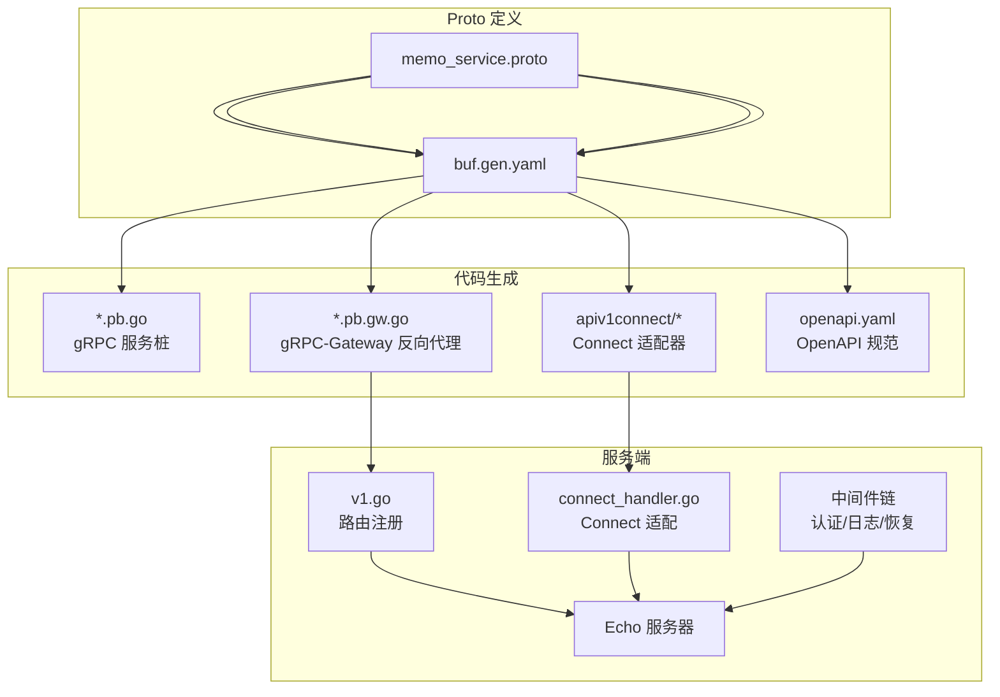
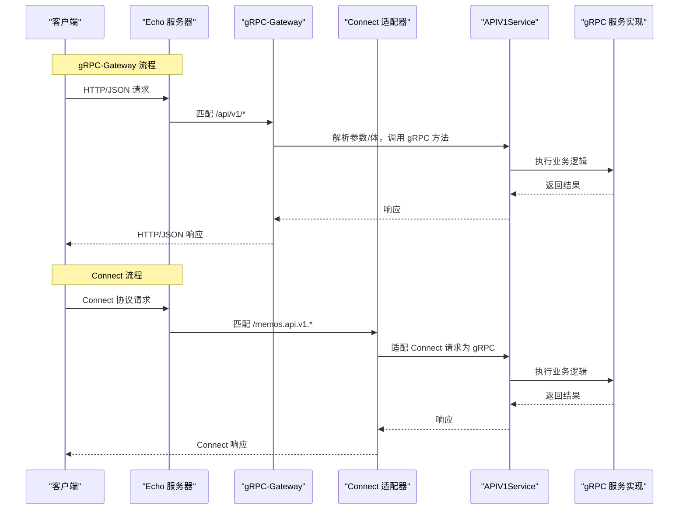
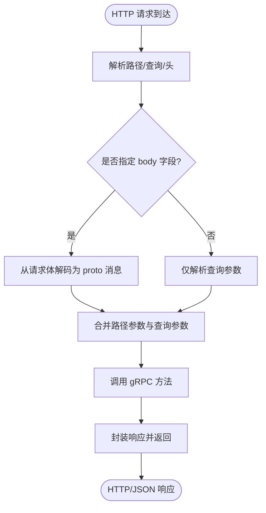
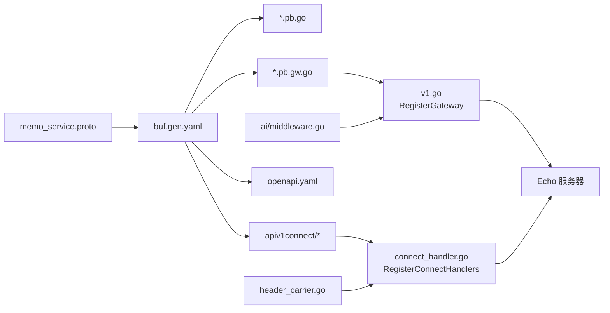

# gRPC 网关集成

<cite>
**本文档引用的文件**
- [proto/api/v1/memo_service.proto](file://proto/api/v1/memo_service.proto)
- [proto/gen/api/v1/memo_service.pb.gw.go](file://proto/gen/api/v1/memo_service.pb.gw.go)
- [proto/buf.gen.yaml](file://proto/buf.gen.yaml)
- [proto/gen/openapi.yaml](file://proto/gen/openapi.yaml)
- [server/router/api/v1/v1.go](file://server/router/api/v1/v1.go)
- [server/router/api/v1/connect_handler.go](file://server/router/api/v1/connect_handler.go)
- [server/router/api/v1/header_carrier.go](file://server/router/api/v1/header_carrier.go)
- [server/router/api/v1/ai/middleware.go](file://server/router/api/v1/ai/middleware.go)
- [server/server.go](file://server/server.go)
- [proto/gen/google/api/http.pb.go](file://proto/gen/google/api/http.pb.go)
- [proto/api/v1/README.md](file://proto/api/v1/README.md)
- [server/router/api/v1/common.go](file://server/router/api/v1/common.go)
</cite>

## 目录
1. [简介](#简介)
2. [项目结构](#项目结构)
3. [核心组件](#核心组件)
4. [架构总览](#架构总览)
5. [详细组件分析](#详细组件分析)
6. [依赖关系分析](#依赖关系分析)
7. [性能考虑](#性能考虑)
8. [故障排除指南](#故障排除指南)
9. [结论](#结论)
10. [附录](#附录)

## 简介
本文件系统性阐述该代码库中 gRPC 网关的集成与实现，重点覆盖以下方面：
- 如何通过 Google API 注解将 gRPC 服务映射为 RESTful HTTP/JSON 接口
- 协议转换机制（gRPC ↔ REST）与请求/响应处理流程
- OpenAPI 规范生成与文档自动化
- 网关配置选项、路由规则与中间件集成
- RESTful API 调用示例与对应 gRPC 服务的对比说明
- 性能优化与安全配置建议

## 项目结构
该项目采用“Proto 定义 → 多目标代码生成 → 服务端路由注册”的分层架构：
- Proto 层：定义服务接口与 HTTP 映射规则
- 生成层：通过 buf 生成 gRPC、Connect、gRPC-Gateway 以及 OpenAPI 文档
- 服务层：Echo 框架承载路由，注册 gRPC-Gateway 与 Connect 处理器，并集成中间件

图表来源
- [proto/api/v1/memo_service.proto](file://proto/api/v1/memo_service.proto#L1-L106)
- [proto/buf.gen.yaml](file://proto/buf.gen.yaml#L1-L31)
- [proto/gen/api/v1/memo_service.pb.gw.go](file://proto/gen/api/v1/memo_service.pb.gw.go#L1-L1332)
- [server/router/api/v1/v1.go](file://server/router/api/v1/v1.go#L120-L237)
- [server/router/api/v1/connect_handler.go](file://server/router/api/v1/connect_handler.go#L1-L100)

章节来源
- [proto/api/v1/memo_service.proto](file://proto/api/v1/memo_service.proto#L1-L106)
- [proto/buf.gen.yaml](file://proto/buf.gen.yaml#L1-L31)
- [server/router/api/v1/v1.go](file://server/router/api/v1/v1.go#L120-L237)

## 核心组件
- gRPC-Gateway 反向代理：将 HTTP/JSON 请求解析为 gRPC 调用，再将响应回传
- Connect 适配器：统一 gRPC 与 Connect 的协议差异，支持浏览器直连
- 中间件体系：认证、日志、恢复、速率限制等
- OpenAPI 文档：基于 proto 注解自动生成 REST API 文档

章节来源
- [proto/gen/api/v1/memo_service.pb.gw.go](file://proto/gen/api/v1/memo_service.pb.gw.go#L1-L1332)
- [server/router/api/v1/v1.go](file://server/router/api/v1/v1.go#L120-L237)
- [server/router/api/v1/connect_handler.go](file://server/router/api/v1/connect_handler.go#L1-L100)
- [proto/gen/openapi.yaml](file://proto/gen/openapi.yaml#L1-L800)

## 架构总览
下图展示了从客户端到 gRPC 服务的完整调用路径，涵盖 gRPC-Gateway 与 Connect 两种接入方式。

图表来源
- [server/router/api/v1/v1.go](file://server/router/api/v1/v1.go#L120-L237)
- [server/router/api/v1/connect_handler.go](file://server/router/api/v1/connect_handler.go#L36-L80)
- [proto/gen/api/v1/memo_service.pb.gw.go](file://proto/gen/api/v1/memo_service.pb.gw.go#L1058-L1296)

## 详细组件分析

### HTTP/JSON 映射与协议转换
- HTTP 映射规则：通过 proto 文件中的 `google.api.http` 选项声明 REST 路径、方法与 body 映射
- 网关转换：gRPC-Gateway 将 HTTP 请求解析为 gRPC 参数，调用相应服务方法并返回 JSON
- 字段掩码与查询参数：支持通过 `body` 与查询参数传递复杂消息字段

图表来源
- [proto/gen/api/v1/memo_service.pb.gw.go](file://proto/gen/api/v1/memo_service.pb.gw.go#L40-L112)
- [proto/gen/google/api/http.pb.go](file://proto/gen/google/api/http.pb.go#L169-L276)

章节来源
- [proto/api/v1/memo_service.proto](file://proto/api/v1/memo_service.proto#L17-L106)
- [proto/gen/api/v1/memo_service.pb.gw.go](file://proto/gen/api/v1/memo_service.pb.gw.go#L40-L112)
- [proto/gen/google/api/http.pb.go](file://proto/gen/google/api/http.pb.go#L169-L276)

### OpenAPI 规范生成与文档自动化
- 生成工具：通过 buf 插件生成 OpenAPI 规范
- 规范内容：包含路径、参数、请求体、响应与错误模型
- 使用场景：前端 SDK 生成、API 文档展示、测试用例编写

章节来源
- [proto/buf.gen.yaml](file://proto/buf.gen.yaml#L20-L26)
- [proto/gen/openapi.yaml](file://proto/gen/openapi.yaml#L1-L800)

### 网关配置与路由规则
- 路由注册：gRPC-Gateway 与 Connect 处理器分别注册到 Echo
- CORS 支持：对 gRPC-Gateway 与 Connect 分别启用跨域
- 路由前缀：
  - gRPC-Gateway：`/api/v1/*`、`/file/*`
  - Connect：`/memos.api.v1.*`

章节来源
- [server/router/api/v1/v1.go](file://server/router/api/v1/v1.go#L205-L234)

### 中间件集成
- 认证中间件：在 gRPC-Gateway 中基于 RPC 方法名与请求头进行鉴权
- Connect 拦截器：元数据转换、日志、恢复、认证等
- Header Carrier：在 Connect 协议下设置响应头

章节来源
- [server/router/api/v1/v1.go](file://server/router/api/v1/v1.go#L120-L237)
- [server/router/api/v1/connect_handler.go](file://server/router/api/v1/connect_handler.go#L82-L99)
- [server/router/api/v1/header_carrier.go](file://server/router/api/v1/header_carrier.go#L43-L124)

### 类型与状态转换
- 状态枚举映射：存储层状态与 API 层状态的双向转换
- 分页令牌：Base64 编码的 proto 消息，用于分页游标

章节来源
- [server/router/api/v1/common.go](file://server/router/api/v1/common.go#L20-L64)

### Connect 适配器与协议兼容
- ConnectServiceHandler：复用现有 gRPC 实现，适配 Connect 的请求/响应包装类型
- 错误码转换：gRPC 与 Connect 错误码语义一致，可直接转换
- 流式传输：Connect 服务器流适配 gRPC 流式接口

章节来源
- [server/router/api/v1/connect_handler.go](file://server/router/api/v1/connect_handler.go#L19-L80)
- [server/router/api/v1/connect_handler.go](file://server/router/api/v1/connect_handler.go#L103-L190)

### 服务器启动与路由装配
- Echo 初始化与中间件注入
- gRPC-Gateway 与 Connect 处理器注册
- 静态文件与 RSS 路由前置，确保 Range 请求正确处理

章节来源
- [server/server.go](file://server/server.go#L44-L86)

## 依赖关系分析

图表来源
- [proto/buf.gen.yaml](file://proto/buf.gen.yaml#L1-L31)
- [server/router/api/v1/v1.go](file://server/router/api/v1/v1.go#L120-L237)
- [server/router/api/v1/connect_handler.go](file://server/router/api/v1/connect_handler.go#L36-L80)
- [server/router/api/v1/header_carrier.go](file://server/router/api/v1/header_carrier.go#L43-L124)
- [server/router/api/v1/ai/middleware.go](file://server/router/api/v1/ai/middleware.go#L54-L108)

章节来源
- [proto/buf.gen.yaml](file://proto/buf.gen.yaml#L1-L31)
- [server/router/api/v1/v1.go](file://server/router/api/v1/v1.go#L120-L237)
- [server/router/api/v1/connect_handler.go](file://server/router/api/v1/connect_handler.go#L36-L80)

## 性能考虑
- 连接池与并发控制：gRPC-Gateway 默认使用标准库连接；可通过 DialOption 配置连接池与超时
- 压缩与序列化：优先使用二进制 Protobuf；在高延迟网络可启用压缩
- 分页与批量：合理设置分页大小，避免一次性返回大量数据
- 缓存策略：对静态资源与只读查询结果进行缓存
- 并发限制：对 CPU 密集或内存占用高的操作（如缩略图生成）设置权重信号量

## 故障排除指南
- 认证失败：检查 Authorization 头与 RPC 方法白名单；确认用户上下文是否正确注入
- 参数解析错误：核对 HTTP 方法、路径模板与 body 映射；验证查询参数命名
- CORS 问题：确认路由前缀与 CORS 配置；浏览器跨域需允许凭据
- 错误码不一致：Connect 与 gRPC 错误码可直接互转，排查拦截器链路
- 响应头丢失：在 Connect 场景下使用 HeaderCarrier 设置响应头

章节来源
- [server/router/api/v1/v1.go](file://server/router/api/v1/v1.go#L120-L237)
- [server/router/api/v1/header_carrier.go](file://server/router/api/v1/header_carrier.go#L43-L124)
- [server/router/api/v1/connect_handler.go](file://server/router/api/v1/connect_handler.go#L82-L99)

## 结论
该系统通过 gRPC-Gateway 与 Connect 的双栈支持，实现了统一的 REST/JSON 与 gRPC 接口，结合 OpenAPI 自动生成文档，既满足浏览器直连需求，又保持了高性能与可维护性。通过中间件与路由配置，系统具备良好的扩展性与安全性。

## 附录

### RESTful API 调用示例与 gRPC 对比
- 创建便签（REST）
  - HTTP: POST /api/v1/memos
  - Body: 便签对象
  - 对应 gRPC: MemoService.CreateMemo
- 获取便签（REST）
  - HTTP: GET /api/v1/memos/{name}
  - 对应 gRPC: MemoService.GetMemo
- 更新便签（REST）
  - HTTP: PATCH /api/v1/{memo.name=memos/*}
  - Body: 便签对象 + FieldMask
  - 对应 gRPC: MemoService.UpdateMemo
- 删除便签（REST）
  - HTTP: DELETE /api/v1/{name=memos/*}
  - 对应 gRPC: MemoService.DeleteMemo

章节来源
- [proto/api/v1/memo_service.proto](file://proto/api/v1/memo_service.proto#L17-L106)
- [proto/gen/api/v1/memo_service.pb.gw.go](file://proto/gen/api/v1/memo_service.pb.gw.go#L1058-L1296)

### OpenAPI 规范关键字段说明
- 路径参数：如 `{name}`、`{user}` 等，需与 proto 路径模板一致
- 查询参数：如 `pageSize`、`pageToken`、`filter`、`orderBy` 等
- 请求体：通过 `body` 指定映射字段，支持嵌套消息与通配符
- 响应模型：统一引用 `#/components/schemas/...`

章节来源
- [proto/gen/openapi.yaml](file://proto/gen/openapi.yaml#L1-L800)

### 安全配置建议
- 强制 HTTPS：生产环境必须启用 TLS
- 认证策略：使用 JWT 或刷新令牌，避免明文密码
- CORS 白名单：仅允许受信域名，谨慎开启凭据
- 速率限制：针对公共接口启用限流，防止滥用
- 输入校验：在网关层与服务层双重校验参数合法性

章节来源
- [server/router/api/v1/v1.go](file://server/router/api/v1/v1.go#L120-L237)
- [server/router/api/v1/ai/middleware.go](file://server/router/api/v1/ai/middleware.go#L54-L108)