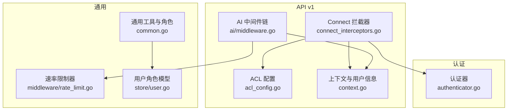
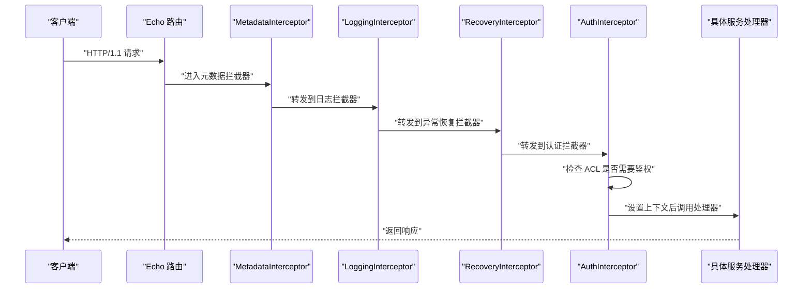
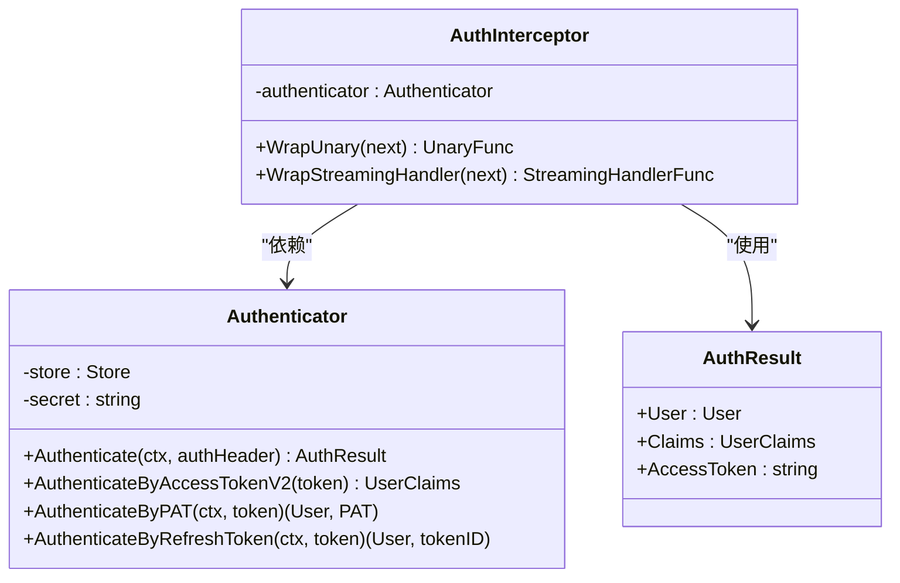
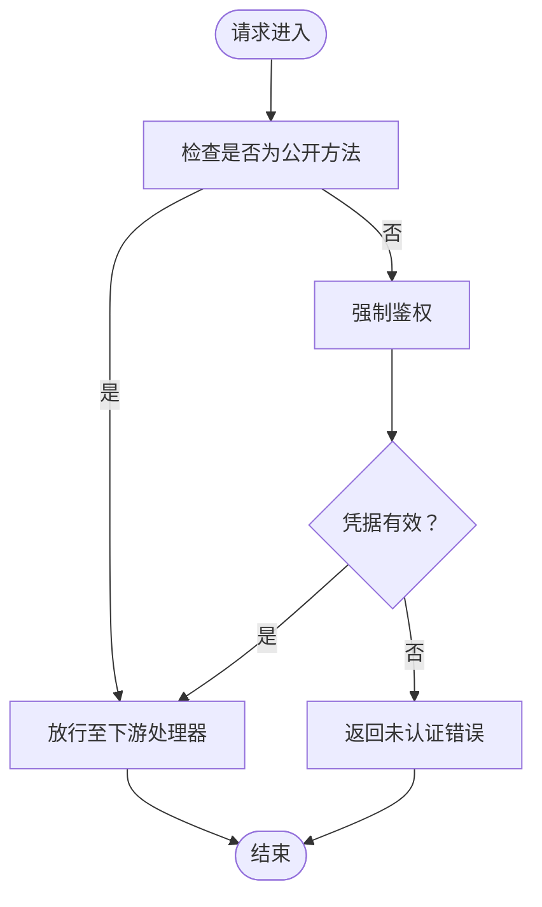
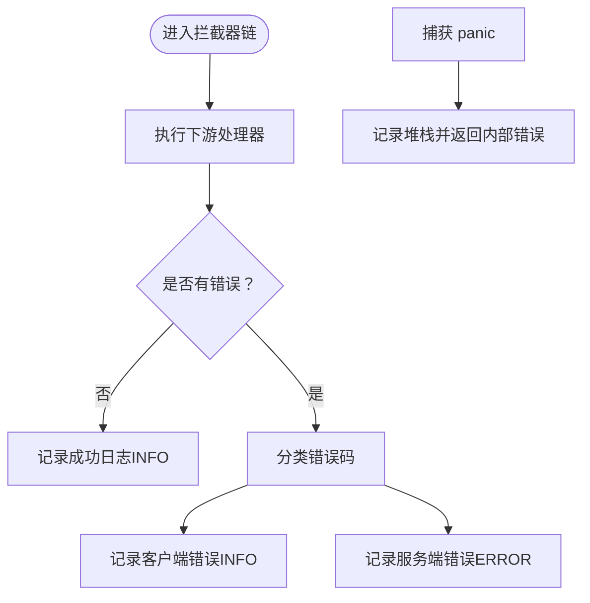
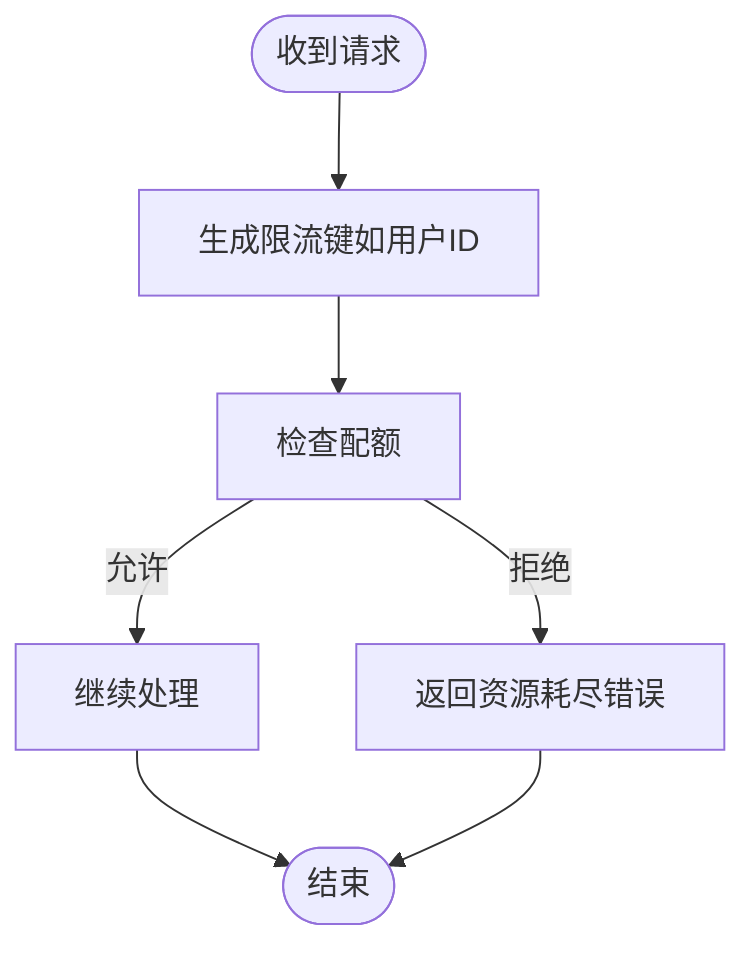
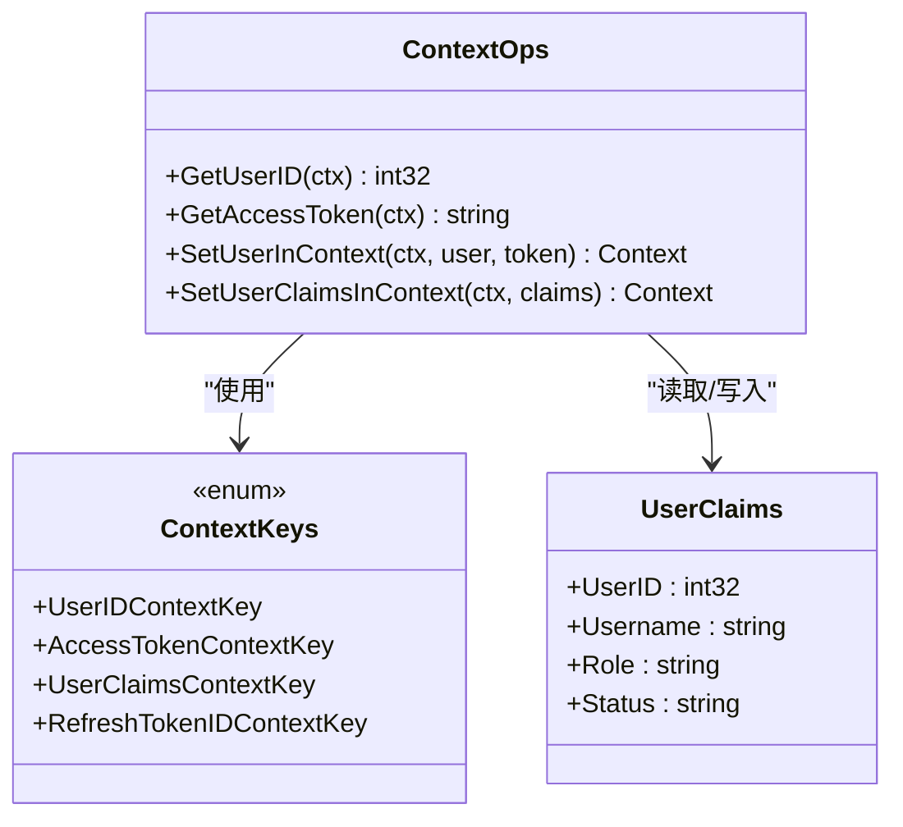
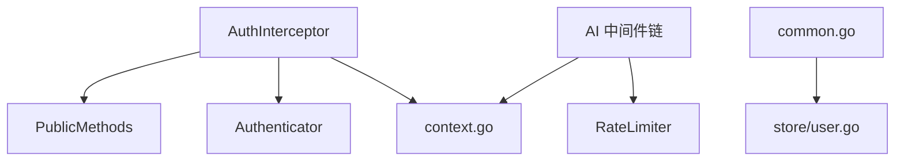

# 中间件与拦截器

<cite>
**本文引用的文件**
- [connect_interceptors.go](file://server/router/api/v1/connect_interceptors.go)
- [acl_config.go](file://server/router/api/v1/acl_config.go)
- [authenticator.go](file://server/auth/authenticator.go)
- [context.go](file://server/auth/context.go)
- [rate_limit.go](file://server/middleware/rate_limit.go)
- [middleware.go](file://server/router/api/v1/ai/middleware.go)
- [server.go](file://server/server.go)
- [common.go](file://server/router/api/v1/common.go)
- [user.go](file://store/user.go)
</cite>

## 目录
1. [简介](#简介)
2. [项目结构](#项目结构)
3. [核心组件](#核心组件)
4. [架构总览](#架构总览)
5. [详细组件分析](#详细组件分析)
6. [依赖关系分析](#依赖关系分析)
7. [性能考量](#性能考量)
8. [故障排除指南](#故障排除指南)
9. [结论](#结论)
10. [附录](#附录)

## 简介
本文件系统性梳理 API 服务层的中间件与拦截器体系，涵盖：
- Connect 协议拦截器：元数据转换、认证、日志、异常恢复
- 速率限制中间件：基于令牌桶的限流
- 访问控制列表（ACL）：公开端点清单与鉴权强制策略
- 权限控制与角色模型：用户角色与超级用户判定
- 自定义中间件开发指南与性能优化建议
- 常见使用场景与故障排除方法

## 项目结构
围绕中间件与拦截器的关键目录与文件如下：
- server/router/api/v1/connect_interceptors.go：Connect 拦截器实现（元数据、日志、恢复、认证）
- server/router/api/v1/acl_config.go：公开端点 ACL 清单与判定函数
- server/auth/authenticator.go：统一认证器（Access Token V2、PAT、刷新令牌）
- server/auth/context.go：上下文键值与用户信息存取
- server/middleware/rate_limit.go：通用速率限制器
- server/router/api/v1/ai/middleware.go：AI 服务聊天请求中间件链（校验、鉴权、限流）
- server/server.go：服务启动与路由注册入口
- server/router/api/v1/common.go：通用工具与角色辅助函数
- store/user.go：用户角色枚举与系统机器人常量

**图表来源**
- [connect_interceptors.go](file://server/router/api/v1/connect_interceptors.go#L1-L275)
- [acl_config.go](file://server/router/api/v1/acl_config.go#L1-L43)
- [authenticator.go](file://server/auth/authenticator.go#L1-L166)
- [context.go](file://server/auth/context.go#L1-L84)
- [rate_limit.go](file://server/middleware/rate_limit.go#L1-L49)
- [middleware.go](file://server/router/api/v1/ai/middleware.go#L1-L216)
- [common.go](file://server/router/api/v1/common.go#L1-L69)
- [user.go](file://store/user.go#L1-L162)

**章节来源**
- [connect_interceptors.go](file://server/router/api/v1/connect_interceptors.go#L1-L275)
- [acl_config.go](file://server/router/api/v1/acl_config.go#L1-L43)
- [authenticator.go](file://server/auth/authenticator.go#L1-L166)
- [context.go](file://server/auth/context.go#L1-L84)
- [rate_limit.go](file://server/middleware/rate_limit.go#L1-L49)
- [middleware.go](file://server/router/api/v1/ai/middleware.go#L1-L216)
- [server.go](file://server/server.go#L1-L203)
- [common.go](file://server/router/api/v1/common.go#L1-L69)
- [user.go](file://store/user.go#L1-L162)

## 核心组件
- 元数据拦截器（MetadataInterceptor）
  - 将 HTTP 请求头转换为 gRPC 元数据，便于服务层统一读取客户端信息；同时设置响应缓存控制头，防止浏览器缓存 API 响应。
- 日志拦截器（LoggingInterceptor）
  - 基于 Connect 错误码分类输出不同级别日志（INFO/ERROR），支持可选堆栈追踪。
- 异常恢复拦截器（RecoveryInterceptor）
  - 捕获处理过程中的 panic，返回内部错误并记录堆栈。
- 认证拦截器（AuthInterceptor）
  - 依据 ACL 判定是否强制鉴权；对 Access Token V2 使用无状态 Claims，对 PAT 设置完整用户上下文。
- 速率限制器（RateLimiter）
  - 基于每秒 10 次、突发 20 的策略，按键（如用户 ID）维度进行限流。
- AI 中间件链（AI Middleware Chain）
  - 校验、鉴权、限流三段式中间件，统一处理聊天请求。

**章节来源**
- [connect_interceptors.go](file://server/router/api/v1/connect_interceptors.go#L19-L87)
- [connect_interceptors.go](file://server/router/api/v1/connect_interceptors.go#L89-L158)
- [connect_interceptors.go](file://server/router/api/v1/connect_interceptors.go#L160-L199)
- [connect_interceptors.go](file://server/router/api/v1/connect_interceptors.go#L201-L275)
- [rate_limit.go](file://server/middleware/rate_limit.go#L11-L49)
- [middleware.go](file://server/router/api/v1/ai/middleware.go#L36-L42)
- [middleware.go](file://server/router/api/v1/ai/middleware.go#L44-L88)
- [middleware.go](file://server/router/api/v1/ai/middleware.go#L90-L116)

## 架构总览
下图展示 Connect 请求在服务端的拦截器链路与认证流程：

**图表来源**
- [connect_interceptors.go](file://server/router/api/v1/connect_interceptors.go#L31-L67)
- [connect_interceptors.go](file://server/router/api/v1/connect_interceptors.go#L103-L117)
- [connect_interceptors.go](file://server/router/api/v1/connect_interceptors.go#L170-L180)
- [connect_interceptors.go](file://server/router/api/v1/connect_interceptors.go#L216-L242)

## 详细组件分析

### 认证拦截器与认证器
- 认证拦截器职责
  - 从 Authorization 头解析凭据，调用认证器进行验证。
  - 非公开端点强制要求有效凭据；公开端点仅校验 ACL。
  - Access Token V2 使用 Claims 无状态注入上下文；PAT 注入完整用户信息。
- 认证器能力
  - 支持 Access Token V2（无状态）、PAT（带过期与撤销检查）、刷新令牌（数据库校验与过期检查）。
  - 提供统一的认证结果封装，便于拦截器设置上下文。

**图表来源**
- [connect_interceptors.go](file://server/router/api/v1/connect_interceptors.go#L201-L275)
- [authenticator.go](file://server/auth/authenticator.go#L17-L166)

**章节来源**
- [connect_interceptors.go](file://server/router/api/v1/connect_interceptors.go#L201-L275)
- [authenticator.go](file://server/auth/authenticator.go#L17-L166)
- [context.go](file://server/auth/context.go#L13-L84)

### ACL 配置与访问控制策略
- 公开端点清单
  - 明确列出无需鉴权即可访问的 gRPC/Connect 方法路径，作为单一事实源。
- 策略说明
  - 未在清单中的端点一律强制鉴权；拦截器在 WrapUnary/WrapStreamingHandler 中统一判定。
- 配置方法
  - 在 ACL 清单中添加或移除路径，确保拦截器与网关拦截器共享同一映射。

**图表来源**
- [acl_config.go](file://server/router/api/v1/acl_config.go#L37-L43)
- [connect_interceptors.go](file://server/router/api/v1/connect_interceptors.go#L224-L226)

**章节来源**
- [acl_config.go](file://server/router/api/v1/acl_config.go#L1-L43)
- [connect_interceptors.go](file://server/router/api/v1/connect_interceptors.go#L224-L226)

### 日志与异常恢复拦截器
- 日志拦截器
  - 将 Connect 错误码映射为日志级别：客户端错误（INFO）、服务端错误（ERROR）。
  - 可选输出堆栈追踪，便于定位问题。
- 异常恢复拦截器
  - 捕获 panic，记录堆栈并返回内部错误，避免进程崩溃。

**图表来源**
- [connect_interceptors.go](file://server/router/api/v1/connect_interceptors.go#L103-L129)
- [connect_interceptors.go](file://server/router/api/v1/connect_interceptors.go#L170-L199)

**章节来源**
- [connect_interceptors.go](file://server/router/api/v1/connect_interceptors.go#L89-L158)
- [connect_interceptors.go](file://server/router/api/v1/connect_interceptors.go#L160-L199)

### 速率限制中间件
- 通用速率限制器
  - 每键一个限流器，默认 10 QPS、突发 20。
  - 支持 Allow 与 Wait 两种模式，Wait 可阻塞等待配额。
- AI 中间件链中的限流
  - 以用户 ID 为键进行限流，超过阈值返回资源耗尽错误。

**图表来源**
- [rate_limit.go](file://server/middleware/rate_limit.go#L24-L48)
- [middleware.go](file://server/router/api/v1/ai/middleware.go#L110-L116)

**章节来源**
- [rate_limit.go](file://server/middleware/rate_limit.go#L1-L49)
- [middleware.go](file://server/router/api/v1/ai/middleware.go#L90-L116)

### 上下文与用户信息
- 上下文键值
  - 用户 ID、访问令牌、用户 Claims、刷新令牌 ID 等键值用于跨层传递。
- 用户 Claims
  - Access Token V2 的无状态用户信息，拦截器注入到上下文。
- 获取用户信息
  - 提供便捷函数从上下文读取用户 ID、访问令牌等。

**图表来源**
- [context.go](file://server/auth/context.go#L9-L84)

**章节来源**
- [context.go](file://server/auth/context.go#L1-L84)

### 权限控制与角色模型
- 角色枚举
  - 支持 HOST、ADMIN、USER 三种角色；系统机器人固定为 ADMIN。
- 超级用户判定
  - 通过角色判断是否为超级用户，用于部分操作的授权边界。
- 服务层权限
  - ACL 仅负责“是否需要鉴权”，具体 RBAC（基于角色的访问控制）在服务层实现。

**章节来源**
- [user.go](file://store/user.go#L10-L42)
- [common.go](file://server/router/api/v1/common.go#L66-L69)

## 依赖关系分析
- 拦截器依赖
  - AuthInterceptor 依赖 Authenticator 与 ACL 清单。
  - LoggingInterceptor 与 RecoveryInterceptor 作为通用横切关注点。
- 速率限制依赖
  - AI 中间件链依赖通用 RateLimiter。
- 上下文依赖
  - 所有中间件与服务层通过 context.go 提供的键值进行用户信息传递。

**图表来源**
- [connect_interceptors.go](file://server/router/api/v1/connect_interceptors.go#L201-L275)
- [acl_config.go](file://server/router/api/v1/acl_config.go#L37-L43)
- [authenticator.go](file://server/auth/authenticator.go#L17-L166)
- [context.go](file://server/auth/context.go#L1-L84)
- [rate_limit.go](file://server/middleware/rate_limit.go#L1-L49)
- [middleware.go](file://server/router/api/v1/ai/middleware.go#L1-L216)
- [common.go](file://server/router/api/v1/common.go#L66-L69)
- [user.go](file://store/user.go#L10-L42)

**章节来源**
- [connect_interceptors.go](file://server/router/api/v1/connect_interceptors.go#L1-L275)
- [acl_config.go](file://server/router/api/v1/acl_config.go#L1-L43)
- [authenticator.go](file://server/auth/authenticator.go#L1-L166)
- [context.go](file://server/auth/context.go#L1-L84)
- [rate_limit.go](file://server/middleware/rate_limit.go#L1-L49)
- [middleware.go](file://server/router/api/v1/ai/middleware.go#L1-L216)
- [common.go](file://server/router/api/v1/common.go#L1-L69)
- [user.go](file://store/user.go#L1-L162)

## 性能考量
- 限流参数
  - 默认 10 QPS、突发 20，适合一般聊天类接口；可根据业务峰值调整。
- 并发与锁
  - 限流器内部使用互斥锁保护限流器映射，高并发下建议评估键空间规模与热点键。
- 日志开销
  - 开启堆栈追踪会增加日志体积与序列化成本，生产环境建议谨慎启用。
- 缓存控制
  - 元数据拦截器为响应设置缓存禁用头，避免浏览器缓存导致的数据陈旧。

**章节来源**
- [rate_limit.go](file://server/middleware/rate_limit.go#L33-L36)
- [connect_interceptors.go](file://server/router/api/v1/connect_interceptors.go#L58-L64)

## 故障排除指南
- 未认证错误
  - 现象：返回未认证错误。
  - 排查：确认请求头 Authorization 是否正确；确认方法是否在 ACL 公开清单中。
- 资源耗尽错误
  - 现象：返回速率限制错误。
  - 排查：检查用户 ID 键是否正确；适当提高限流阈值或在上游增加重试退避。
- 服务端错误与堆栈
  - 现象：日志出现 ERROR 级别与堆栈。
  - 排查：检查 RecoveryInterceptor 是否捕获到 panic；定位具体处理器逻辑。
- 客户端错误
  - 现象：日志出现 INFO 级别，通常为参数错误或权限不足。
  - 排查：根据错误码细化到具体业务分支。

**章节来源**
- [connect_interceptors.go](file://server/router/api/v1/connect_interceptors.go#L131-L158)
- [connect_interceptors.go](file://server/router/api/v1/connect_interceptors.go#L190-L199)
- [middleware.go](file://server/router/api/v1/ai/middleware.go#L110-L116)

## 结论
本项目在 Connect 协议之上构建了完善的拦截器体系：统一的元数据转换、日志与异常恢复、严格的认证与 ACL 控制，并在 AI 服务中引入可组合的中间件链实现校验、鉴权与限流。配合通用速率限制器与上下文用户信息传递机制，形成了可扩展、可观测且安全的 API 中间件基础设施。

## 附录

### 拦截器链执行顺序与配置方法
- 执行顺序
  - 元数据 -> 日志 -> 异常恢复 -> 认证 -> 业务处理器
- 配置方法
  - 在服务初始化阶段注册拦截器；ACL 清单集中维护，拦截器与网关共享。

**章节来源**
- [connect_interceptors.go](file://server/router/api/v1/connect_interceptors.go#L31-L67)
- [connect_interceptors.go](file://server/router/api/v1/connect_interceptors.go#L103-L117)
- [connect_interceptors.go](file://server/router/api/v1/connect_interceptors.go#L170-L180)
- [connect_interceptors.go](file://server/router/api/v1/connect_interceptors.go#L216-L242)

### 自定义中间件开发指南
- 设计原则
  - 单一职责：每个中间件聚焦一个横切关注点。
  - 可组合：遵循函数式包装模式，将 next 作为下一个处理器。
- 示例步骤
  - 定义中间件类型与构造函数。
  - 实现 WrapUnary 或 WrapStreamingHandler。
  - 在业务处理器前/后插入逻辑（如校验、鉴权、限流）。
  - 使用 Chain 将多个中间件按序组合。

**章节来源**
- [middleware.go](file://server/router/api/v1/ai/middleware.go#L36-L42)
- [middleware.go](file://server/router/api/v1/ai/middleware.go#L44-L88)
- [middleware.go](file://server/router/api/v1/ai/middleware.go#L90-L116)