# AI 服务实现

<cite>
**本文档引用的文件**
- [ai_service.proto](file://proto/api/v1/ai_service.proto)
- [ai_service.go](file://server/router/api/v1/ai_service.go)
- [config.go](file://plugin/ai/config.go)
- [embedding.go](file://plugin/ai/embedding.go)
- [llm.go](file://plugin/ai/llm.go)
- [reranker.go](file://plugin/ai/reranker.go)
- [types.go](file://plugin/ai/agent/types.go)
- [base_tool.go](file://plugin/ai/agent/base_tool.go)
- [context.go](file://plugin/ai/agent/context.go)
- [context_builder.go](file://server/router/api/v1/ai/context_builder.go)
- [memo_parrot.go](file://plugin/ai/agent/memo_parrot.go)
- [schedule_parrot_v2.go](file://plugin/ai/agent/schedule_parrot_v2.go)
- [amazing_parrot.go](file://plugin/ai/agent/amazing_parrot.go)
- [memo_search.go](file://plugin/ai/agent/tools/memo_search.go)
- [scheduler.go](file://plugin/ai/agent/tools/scheduler.go)
</cite>

## 目录
1. [简介](#简介)
2. [项目结构](#项目结构)
3. [核心组件](#核心组件)
4. [架构概览](#架构概览)
5. [详细组件分析](#详细组件分析)
6. [依赖关系分析](#依赖关系分析)
7. [性能考虑](#性能考虑)
8. [故障排除指南](#故障排除指南)
9. [结论](#结论)
10. [附录](#附录)

## 简介

本项目实现了完整的 AI 增强服务系统，提供智能聊天、语义搜索、内容生成和对话管理等核心功能。该系统采用模块化设计，支持多种 AI 代理（Parrot）协同工作，包括笔记助手、日程助手和综合助手。

系统的核心特性包括：
- **多代理架构**：支持 Memo Parrot（笔记助手）、Schedule Parrot（日程助手）和 Amazing Parrot（综合助手）
- **智能工具调用**：基于 ReAct 框架的工具链，支持并发检索优化
- **上下文管理**：完善的对话历史管理和会话状态维护
- **嵌入向量处理**：支持多种嵌入模型和相似度计算
- **意图识别**：自动检测用户意图并执行相应操作
- **并发检索优化**：两阶段并发检索策略提升响应速度

## 项目结构

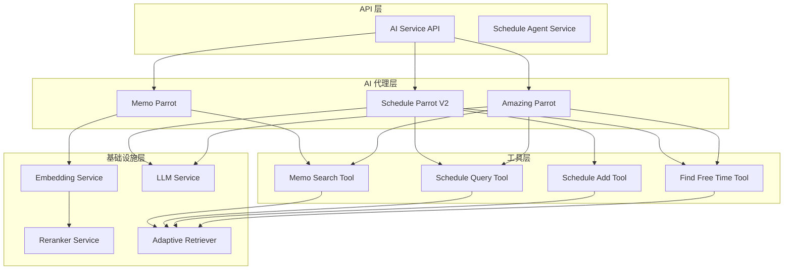

**图表来源**
- [ai_service.go](file://server/router/api/v1/ai_service.go#L21-L43)
- [memo_parrot.go](file://plugin/ai/agent/memo_parrot.go#L28-L34)
- [amazing_parrot.go](file://plugin/ai/agent/amazing_parrot.go#L22-L31)

**章节来源**
- [ai_service.proto](file://proto/api/v1/ai_service.proto#L13-L117)
- [ai_service.go](file://server/router/api/v1/ai_service.go#L21-L55)

## 核心组件

### AI 服务接口

AI 服务提供了完整的 AI 功能接口，包括语义搜索、标签建议、聊天对话、相关笔记查找等功能：

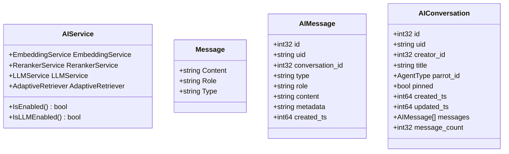

**图表来源**
- [ai_service.go](file://server/router/api/v1/ai_service.go#L21-L43)
- [ai_service.proto](file://proto/api/v1/ai_service.proto#L213-L237)
- [ai_service.proto](file://proto/api/v1/ai_service.proto#L21-L23)

**章节来源**
- [ai_service.go](file://server/router/api/v1/ai_service.go#L21-L74)
- [ai_service.proto](file://proto/api/v1/ai_service.proto#L120-L137)

### AI 配置管理

系统支持灵活的 AI 配置管理，支持多种提供商和模型：

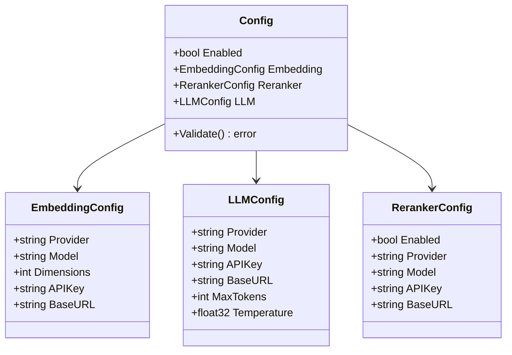

**图表来源**
- [config.go](file://plugin/ai/config.go#L9-L16)
- [config.go](file://plugin/ai/config.go#L18-L44)

**章节来源**
- [config.go](file://plugin/ai/config.go#L46-L129)

## 架构概览

系统采用分层架构设计，各层职责明确，耦合度低：

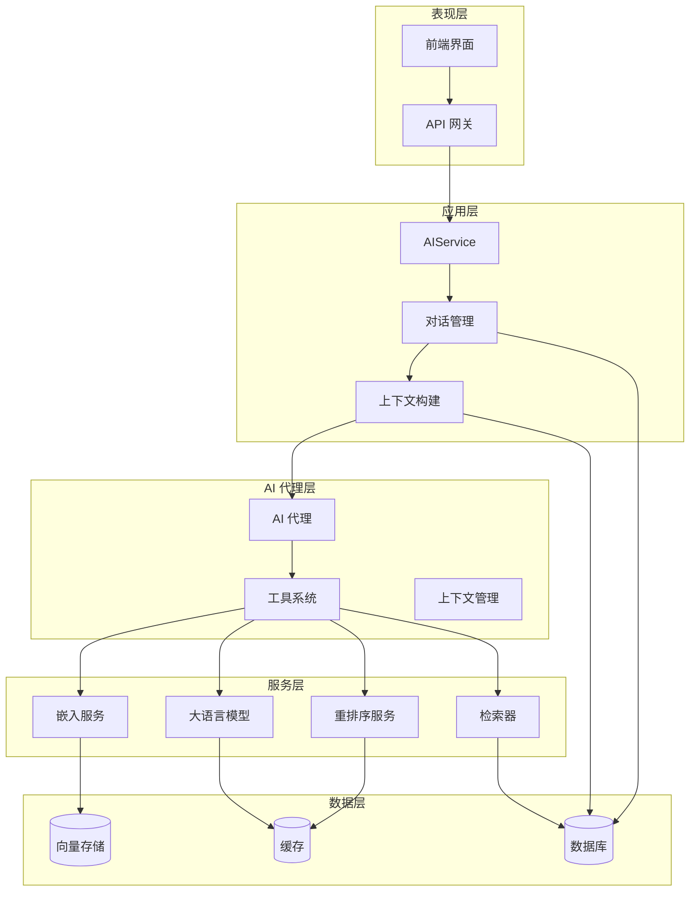

**图表来源**
- [ai_service.go](file://server/router/api/v1/ai_service.go#L21-L43)
- [context_builder.go](file://server/router/api/v1/ai/context_builder.go#L62-L77)

## 详细组件分析

### AI 代理架构

系统实现了三种不同类型的 AI 代理，每种代理都有特定的功能和工作流程：

#### Memo Parrot（笔记助手）

Memo Parrot 专注于笔记搜索和信息检索，采用 ReAct 框架实现：

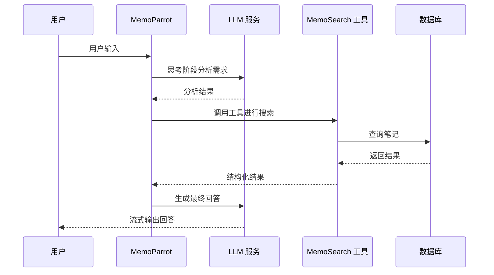

**图表来源**
- [memo_parrot.go](file://plugin/ai/agent/memo_parrot.go#L76-L289)
- [memo_search.go](file://plugin/ai/agent/tools/memo_search.go#L109-L193)

#### Schedule Parrot V2（日程助手）

Schedule Parrot V2 提供高级日程管理功能，支持冲突检测和自动调整：

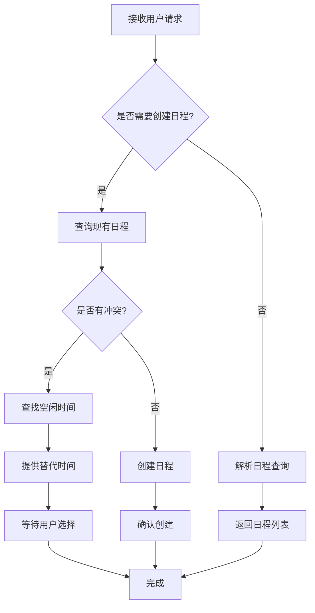

**图表来源**
- [schedule_parrot_v2.go](file://plugin/ai/agent/schedule_parrot_v2.go#L32-L77)
- [scheduler.go](file://plugin/ai/agent/tools/scheduler.go#L459-L614)

#### Amazing Parrot（综合助手）

Amazing Parrot 是最复杂的代理，支持两阶段并发检索：

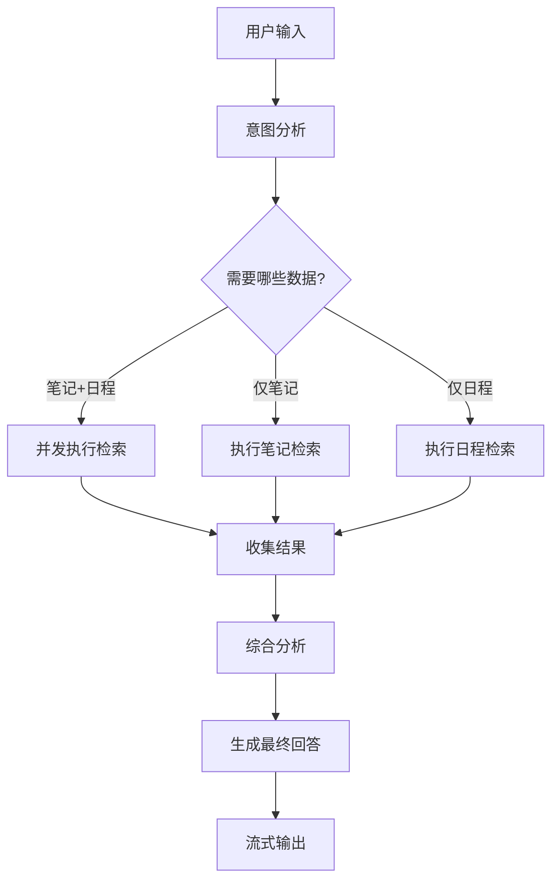

**图表来源**
- [amazing_parrot.go](file://plugin/ai/agent/amazing_parrot.go#L106-L184)
- [amazing_parrot.go](file://plugin/ai/agent/amazing_parrot.go#L228-L387)

**章节来源**
- [memo_parrot.go](file://plugin/ai/agent/memo_parrot.go#L26-L66)
- [schedule_parrot_v2.go](file://plugin/ai/agent/schedule_parrot_v2.go#L9-L24)
- [amazing_parrot.go](file://plugin/ai/agent/amazing_parrot.go#L19-L31)

### 工具调用机制

系统实现了灵活的工具调用框架，支持动态工具注册和执行：

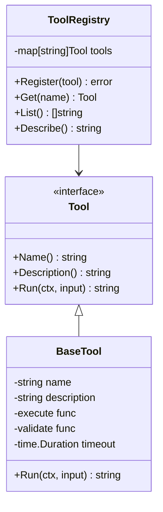

**图表来源**
- [base_tool.go](file://plugin/ai/agent/base_tool.go#L10-L32)
- [base_tool.go](file://plugin/ai/agent/base_tool.go#L147-L151)

**章节来源**
- [base_tool.go](file://plugin/ai/agent/base_tool.go#L54-L93)
- [base_tool.go](file://plugin/ai/agent/base_tool.go#L147-L222)

### 并发检索优化

Amazing Parrot 实现了两阶段并发检索策略，显著提升性能：

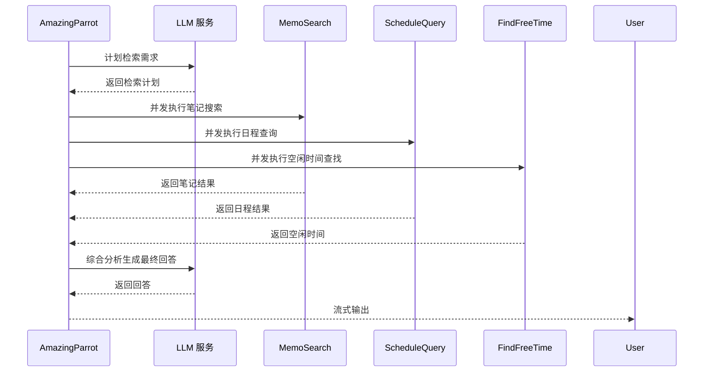

**图表来源**
- [amazing_parrot.go](file://plugin/ai/agent/amazing_parrot.go#L228-L387)
- [amazing_parrot.go](file://plugin/ai/agent/amazing_parrot.go#L390-L451)

**章节来源**
- [amazing_parrot.go](file://plugin/ai/agent/amazing_parrot.go#L186-L225)
- [amazing_parrot.go](file://plugin/ai/agent/amazing_parrot.go#L228-L387)

### 结果整合机制

系统实现了智能的结果整合机制，支持多源数据的统一处理：

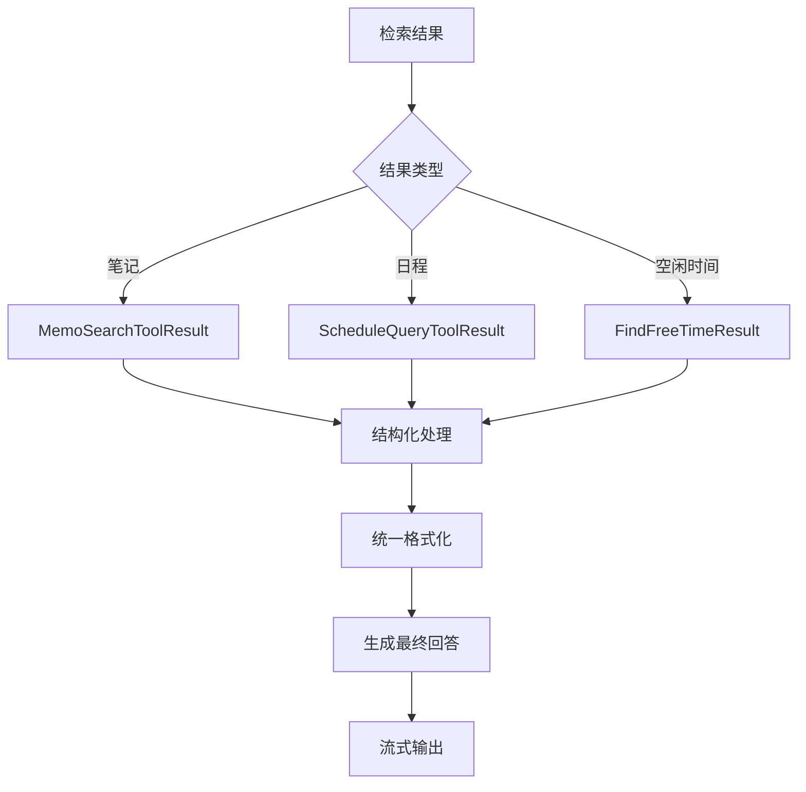

**图表来源**
- [memo_search.go](file://plugin/ai/agent/tools/memo_search.go#L202-L282)
- [scheduler.go](file://plugin/ai/agent/tools/scheduler.go#297-L387)

**章节来源**
- [memo_search.go](file://plugin/ai/agent/tools/memo_search.go#L202-L282)
- [scheduler.go](file://plugin/ai/agent/tools/scheduler.go#L297-L387)

### 嵌入向量处理

系统支持多种嵌入模型，提供高效的向量相似度计算：

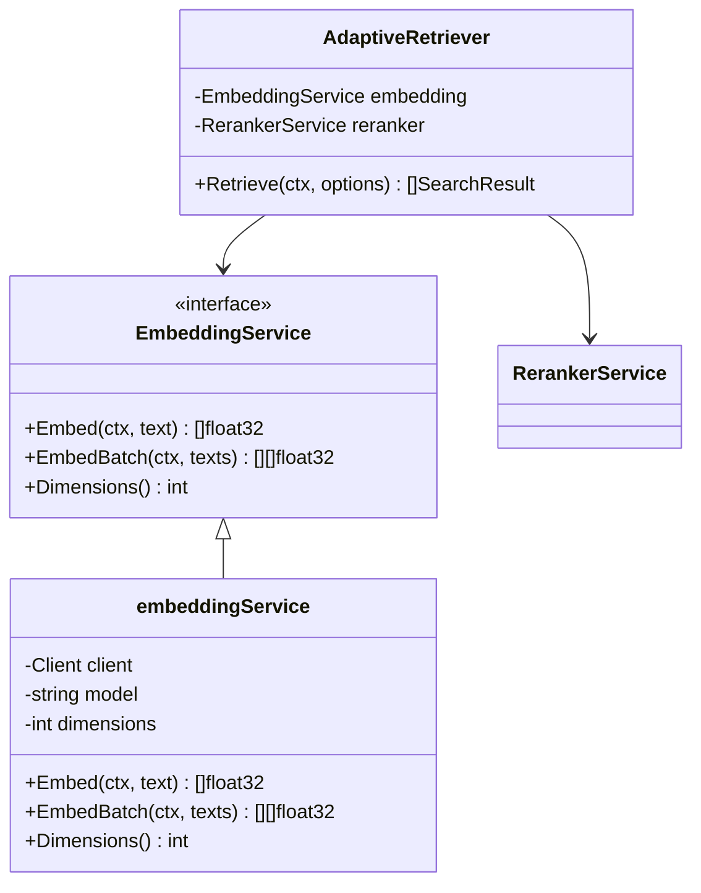

**图表来源**
- [embedding.go](file://plugin/ai/embedding.go#L11-L21)
- [embedding.go](file://plugin/ai/embedding.go#L23-L27)
- [embedding.go](file://plugin/ai/embedding.go#L28-L58)

**章节来源**
- [embedding.go](file://plugin/ai/embedding.go#L29-L58)
- [reranker.go](file://plugin/ai/reranker.go#L20-L27)

### 相似度计算

系统实现了灵活的相似度计算和重排序机制：

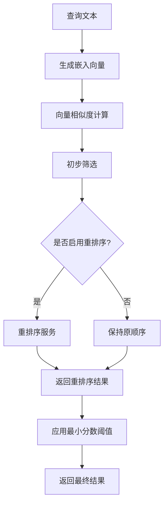

**图表来源**
- [reranker.go](file://plugin/ai/reranker.go#L59-L126)

**章节来源**
- [reranker.go](file://plugin/ai/reranker.go#L37-L53)
- [reranker.go](file://plugin/ai/reranker.go#L59-L126)

### 意图识别

系统实现了智能的用户意图识别机制：

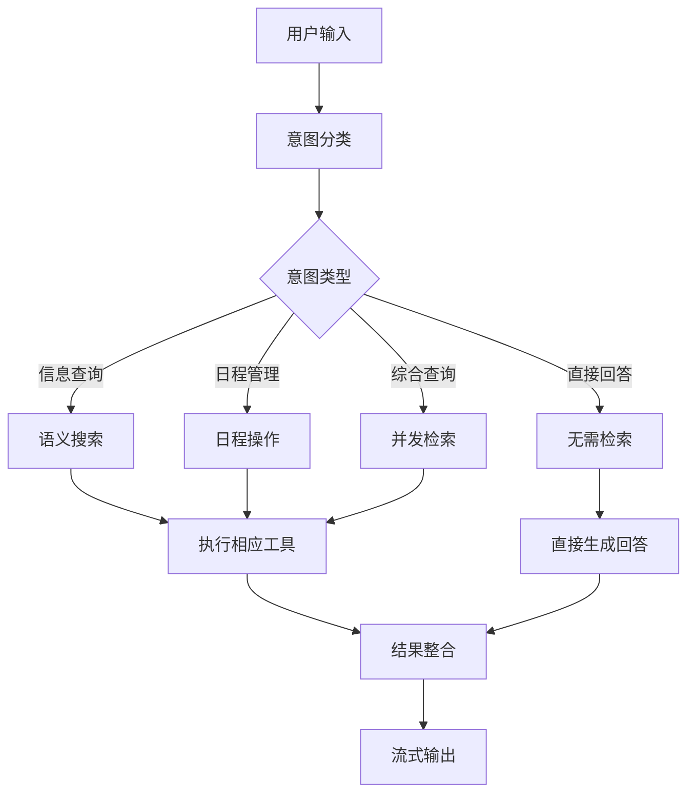

**图表来源**
- [amazing_parrot.go](file://plugin/ai/agent/amazing_parrot.go#L454-L509)

**章节来源**
- [amazing_parrot.go](file://plugin/ai/agent/amazing_parrot.go#L511-L535)
- [amazing_parrot.go](file://plugin/ai/agent/amazing_parrot.go#L537-L587)

### 上下文管理

系统提供了完整的上下文管理机制，支持多轮对话的状态维护：

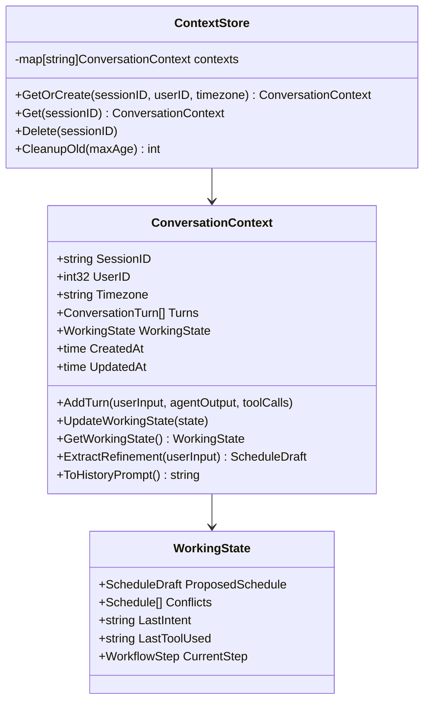

**图表来源**
- [context.go](file://plugin/ai/agent/context.go#L19-L37)
- [context.go](file://plugin/ai/agent/context.go#L57-L73)
- [context.go](file://plugin/ai/agent/context.go#L404-L408)

**章节来源**
- [context.go](file://plugin/ai/agent/context.go#L103-L114)
- [context.go](file://plugin/ai/agent/context.go#L137-L144)
- [context.go](file://plugin/ai/agent/context.go#L234-L306)

### 聊天历史管理

系统实现了高效的聊天历史管理机制：

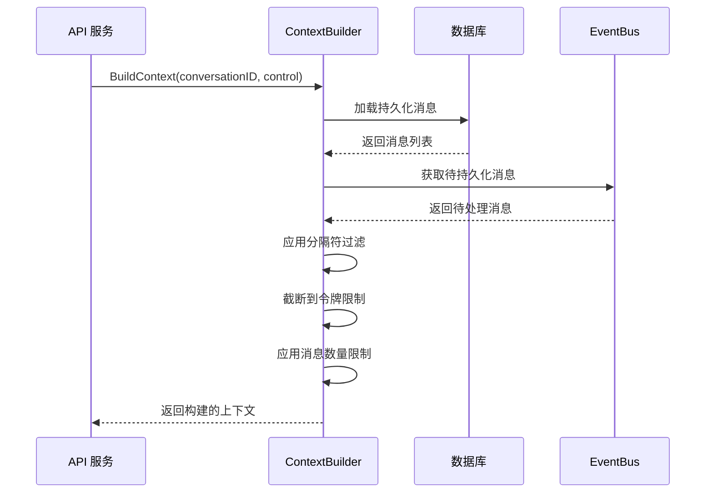

**图表来源**
- [context_builder.go](file://server/router/api/v1/ai/context_builder.go#L95-L224)

**章节来源**
- [context_builder.go](file://server/router/api/v1/ai/context_builder.go#L61-L86)
- [context_builder.go](file://server/router/api/v1/ai/context_builder.go#L95-L224)

## 依赖关系分析

系统采用了清晰的依赖层次结构，各组件之间的耦合度得到有效控制：

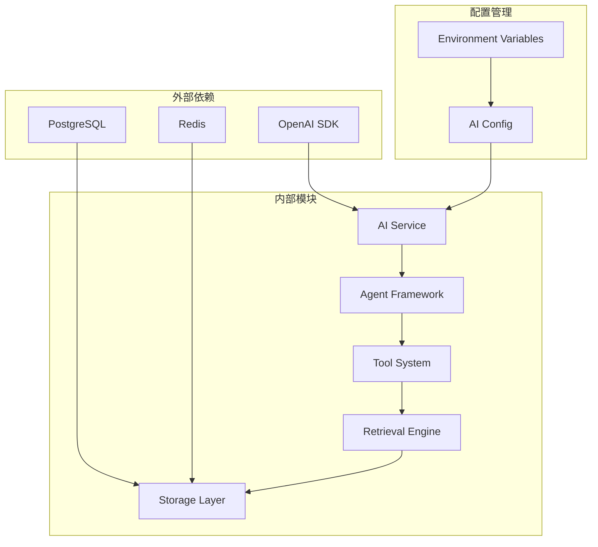

**图表来源**
- [ai_service.go](file://server/router/api/v1/ai_service.go#L3-L15)
- [config.go](file://plugin/ai/config.go#L47-L103)

**章节来源**
- [ai_service.go](file://server/router/api/v1/ai_service.go#L3-L15)
- [config.go](file://plugin/ai/config.go#L47-L103)

## 性能考虑

系统在设计时充分考虑了性能优化，采用了多种策略来提升响应速度和资源利用率：

### 缓存策略
- **LRU 缓存**：Memo Parrot 和 Amazing Parrot 使用 LRU 缓存减少重复计算
- **时间戳缓存**：默认 TTL 为 5 分钟，平衡新鲜度和性能
- **缓存键生成**：使用 SHA256 哈希防止内存泄漏

### 并发优化
- **两阶段并发检索**：Amazing Parrot 采用并发策略减少总响应时间
- **异步持久化**：EventBus 支持异步消息持久化，避免阻塞主流程
- **连接池管理**：HTTP 客户端使用连接池优化网络请求

### 内存管理
- **上下文截断**：ContextBuilder 自动截断过长的对话历史
- **工作状态清理**：定期清理过期的对话上下文
- **令牌计数估算**：使用简单的字符计数估算令牌数量

## 故障排除指南

### 常见问题诊断

#### AI 服务未启用
**症状**：调用 AI API 返回未启用错误
**解决方案**：
1. 检查 AI 配置是否正确设置
2. 验证嵌入服务提供商配置
3. 确认 API 密钥有效

#### LLM 调用超时
**症状**：LLM 调用超时或响应缓慢
**解决方案**：
1. 检查网络连接和 API 端点
2. 调整超时参数
3. 优化提示词长度

#### 工具执行失败
**症状**：工具调用返回错误
**解决方案**：
1. 检查工具输入格式
2. 验证用户权限
3. 查看工具执行日志

#### 缓存问题
**症状**：缓存命中率低或内存占用过高
**解决方案**：
1. 调整缓存大小和 TTL
2. 检查缓存键生成逻辑
3. 监控缓存性能指标

**章节来源**
- [llm.go](file://plugin/ai/llm.go#L106-L128)
- [memo_parrot.go](file://plugin/ai/agent/memo_parrot.go#L93-L106)
- [amazing_parrot.go](file://plugin/ai/agent/amazing_parrot.go#L125-L136)

## 结论

本 AI 服务实现展现了现代 AI 系统的设计理念，通过模块化架构、智能工具调用和并发优化，提供了高效、可扩展的 AI 增强功能。系统的主要优势包括：

1. **灵活的代理架构**：支持多种 AI 代理协同工作
2. **高效的检索机制**：两阶段并发检索显著提升性能
3. **完善的上下文管理**：支持复杂的多轮对话场景
4. **可扩展的工具系统**：支持动态工具注册和执行
5. **健壮的错误处理**：提供完整的故障诊断和恢复机制

该系统为后续的功能扩展和性能优化奠定了坚实的基础，能够满足各种复杂的 AI 应用场景需求。

## 附录

### API 使用示例

#### 语义搜索 API
```javascript
// 请求示例
fetch('/api/v1/ai/search', {
  method: 'POST',
  headers: {'Content-Type': 'application/json'},
  body: JSON.stringify({
    query: '项目管理最佳实践',
    limit: 10
  })
})

// 响应示例
{
  "results": [
    {
      "name": "memos/123",
      "snippet": "项目管理的核心原则...",
      "score": 0.95
    }
  ]
}
```

#### 聊天 API
```javascript
// 请求示例
fetch('/api/v1/ai/chat', {
  method: 'POST',
  headers: {'Content-Type': 'application/json'},
  body: JSON.stringify({
    message: '如何提高团队效率？',
    history: ['上一轮对话历史'],
    agent_type: 'AGENT_TYPE_MEMO'
  })
})

// 响应示例（流式）
{
  "content": "提高团队效率的方法包括...",
  "sources": ["memos/123"],
  "done": false
}
```

#### 会话管理 API
```javascript
// 创建会话
POST /api/v1/ai/conversations
{
  "title": "项目讨论",
  "parrot_id": "AGENT_TYPE_AMAZING"
}

// 获取会话消息
GET /api/v1/ai/conversations/{id}/messages?limit=50

// 添加上下文分隔符
POST /api/v1/ai/conversations/{id}/separator
```

### 性能优化建议

1. **缓存策略优化**：根据业务场景调整缓存大小和 TTL
2. **并发配置**：合理设置工具执行的并发数量
3. **网络优化**：使用连接池和适当的超时设置
4. **监控告警**：建立完善的性能监控和告警机制
5. **资源管理**：定期清理过期数据和缓存

### 扩展开发指南

#### 添加新的 AI 代理
1. 实现 `ParrotAgent` 接口
2. 定义代理的元认知信息
3. 注册到代理工厂
4. 集成到 API 服务

#### 添加新的工具
1. 实现 `Tool` 接口
2. 在工具注册表中注册
3. 更新代理的工具描述
4. 测试工具集成

#### 自定义检索策略
1. 扩展 `RetrievalStrategy` 接口
2. 实现自定义检索逻辑
3. 集成到 AdaptiveRetriever
4. 测试检索效果