# AI 服务实现

<cite>
**本文档引用的文件**
- [ai_service.proto](file://proto/api/v1/ai_service.proto)
- [ai_service.go](file://server/router/api/v1/ai_service.go)
- [handler.go](file://server/router/api/v1/ai/handler.go)
- [ai_service_chat.go](file://server/router/api/v1/ai_service_chat.go)
- [ai_service_conversation.go](file://server/router/api/v1/ai_service_conversation.go)
- [conversation_service.go](file://server/router/api/v1/ai/conversation_service.go)
- [config.go](file://plugin/ai/config.go)
- [embedding.go](file://plugin/ai/embedding.go)
- [llm.go](file://plugin/ai/llm.go)
- [reranker.go](file://plugin/ai/reranker.go)
- [types.go](file://plugin/ai/agent/types.go)
- [base_tool.go](file://plugin/ai/agent/base_tool.go)
- [context.go](file://plugin/ai/agent/context.go)
- [context_builder.go](file://server/router/api/v1/ai/context_builder.go)
- [chat_router.go](file://plugin/ai/agent/chat_router.go)
- [intent_classifier.go](file://plugin/ai/agent/intent_classifier.go)
- [llm_intent_classifier.go](file://plugin/ai/agent/llm_intent_classifier.go)
- [memo_parrot.go](file://plugin/ai/agent/memo_parrot.go)
- [schedule_parrot_v2.go](file://plugin/ai/agent/schedule_parrot_v2.go)
- [amazing_parrot.go](file://plugin/ai/agent/amazing_parrot.go)
- [memo_search.go](file://plugin/ai/agent/tools/memo_search.go)
- [scheduler.go](file://plugin/ai/agent/tools/scheduler.go)
</cite>

## 更新摘要
**所做更改**
- 新增聊天路由和意图分类功能章节，详细介绍智能路由机制
- 更新对话管理章节，增加事件驱动的对话持久化架构
- 改进流式反馈集成章节，说明事件收集器和实时反馈机制
- 新增流式事件处理和对话状态管理的技术细节
- 更新架构图以反映新的路由和事件处理架构

## 目录
1. [简介](#简介)
2. [项目结构](#项目结构)
3. [核心组件](#核心组件)
4. [架构概览](#架构概览)
5. [详细组件分析](#详细组件分析)
6. [依赖关系分析](#依赖关系分析)
7. [性能考虑](#性能考虑)
8. [故障排除指南](#故障排除指南)
9. [结论](#结论)
10. [附录](#附录)

## 简介

本项目实现了完整的 AI 增强服务系统，提供智能聊天、语义搜索、内容生成和对话管理等核心功能。该系统采用模块化设计，支持多种 AI 代理（Parrot）协同工作，包括笔记助手、日程助手和综合助手。

**重大更新**：本次应用变更引入了聊天路由和意图分类功能，改进了对话管理和流式反馈集成，这是核心架构增强的重要里程碑。

系统的核心特性包括：
- **智能聊天路由**：基于规则匹配和 LLM 分类的混合路由机制
- **意图分类系统**：支持简单创建、查询、更新、批量创建等多种意图识别
- **事件驱动对话管理**：基于 EventBus 的异步对话持久化架构
- **实时流式反馈**：支持事件收集器和多轮对话状态管理
- **多代理架构**：支持 Memo Parrot（笔记助手）、Schedule Parrot（日程助手）和 Amazing Parrot（综合助手）
- **智能工具调用**：基于 ReAct 框架的工具链，支持并发检索优化
- **上下文管理**：完善的对话历史管理和会话状态维护
- **嵌入向量处理**：支持多种嵌入模型和相似度计算
- **并发检索优化**：两阶段并发检索策略提升响应速度

## 项目结构

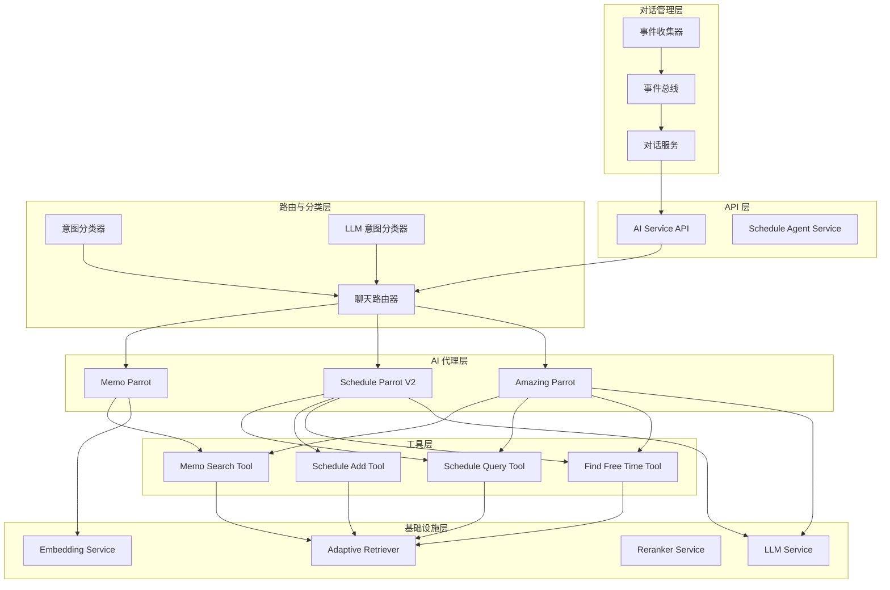
```mermaid
graph TB
subgraph "API 层"
A[AI Service API]
B[Schedule Agent Service]
end
subgraph "AI 代理层"
C[Memo Parrot]
D[Schedule Parrot V2]
E[Amazing Parrot]
end
subgraph "路由与分类层"
F[聊天路由器]
G[意图分类器]
H[LLM 意图分类器]
end
subgraph "工具层"
I[Memo Search Tool]
J[Schedule Query Tool]
K[Schedule Add Tool]
L[Find Free Time Tool]
end
subgraph "对话管理层"
M[事件总线]
N[对话服务]
O[事件收集器]
end
subgraph "基础设施层"
P[Embedding Service]
Q[LLM Service]
R[Reranker Service]
S[Adaptive Retriever]
end
A --> F
F --> C
F --> D
F --> E
G --> F
H --> F
C --> I
D --> J
D --> K
D --> L
E --> I
E --> J
E --> L
C --> P
D --> Q
E --> Q
I --> S
J --> S
K --> S
L --> S
M --> N
O --> M
N --> A
```

**图表来源**
- [handler.go](file://server/router/api/v1/ai/handler.go#L25-L43)
- [chat_router.go](file://plugin/ai/agent/chat_router.go#L42-L68)
- [conversation_service.go](file://server/router/api/v1/ai/conversation_service.go#L74-L104)

**章节来源**
- [ai_service.proto](file://proto/api/v1/ai_service.proto#L13-L117)
- [ai_service.go](file://server/router/api/v1/ai_service.go#L21-L55)

## 核心组件

### AI 服务接口

AI 服务提供了完整的 AI 功能接口，包括语义搜索、标签建议、聊天对话、相关笔记查找等功能：

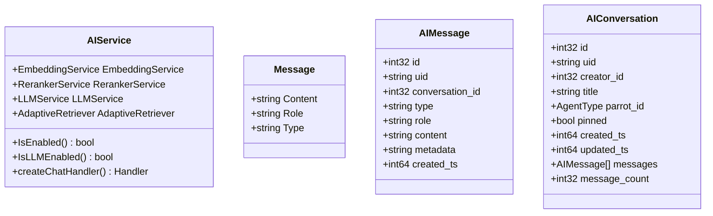
```mermaid
classDiagram
class AIService {
+EmbeddingService EmbeddingService
+RerankerService RerankerService
+LLMService LLMService
+AdaptiveRetriever AdaptiveRetriever
+IsEnabled() bool
+IsLLMEnabled() bool
+createChatHandler() Handler
}
class Message {
+string Content
+string Role
+string Type
}
class AIMessage {
+int32 id
+string uid
+int32 conversation_id
+string type
+string role
+string content
+string metadata
+int64 created_ts
}
class AIConversation {
+int32 id
+string uid
+int32 creator_id
+string title
+AgentType parrot_id
+bool pinned
+int64 created_ts
+int64 updated_ts
+AIMessage[] messages
+int32 message_count
}
```

**图表来源**
- [ai_service.go](file://server/router/api/v1/ai_service.go#L21-L43)
- [ai_service.proto](file://proto/api/v1/ai_service.proto#L213-L237)
- [ai_service.proto](file://proto/api/v1/ai_service.proto#L21-L23)

**章节来源**
- [ai_service.go](file://server/router/api/v1/ai_service.go#L21-L74)
- [ai_service.proto](file://proto/api/v1/ai_service.proto#L120-L137)

### AI 配置管理

系统支持灵活的 AI 配置管理，支持多种提供商和模型：

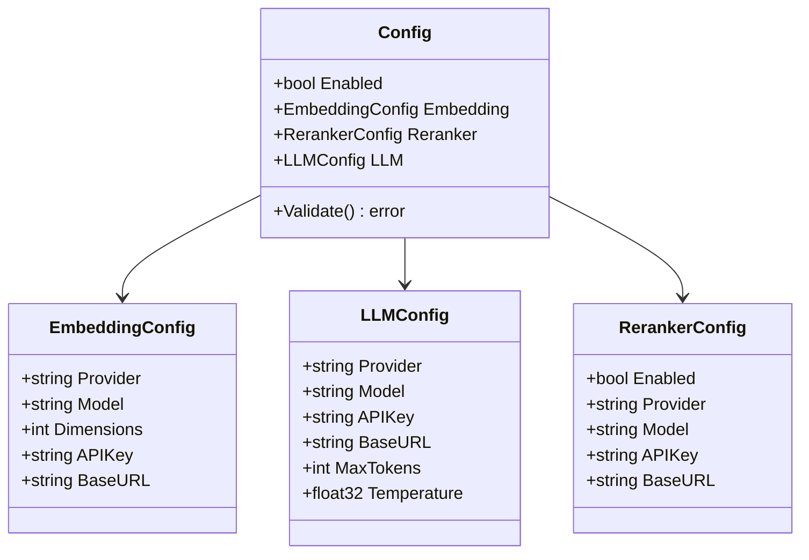
```mermaid
classDiagram
class Config {
+bool Enabled
+EmbeddingConfig Embedding
+RerankerConfig Reranker
+LLMConfig LLM
+Validate() error
}
class EmbeddingConfig {
+string Provider
+string Model
+int Dimensions
+string APIKey
+string BaseURL
}
class LLMConfig {
+string Provider
+string Model
+string APIKey
+string BaseURL
+int MaxTokens
+float32 Temperature
}
class RerankerConfig {
+bool Enabled
+string Provider
+string Model
+string APIKey
+string BaseURL
}
Config --> EmbeddingConfig
Config --> LLMConfig
Config --> RerankerConfig
```

**图表来源**
- [config.go](file://plugin/ai/config.go#L9-L16)
- [config.go](file://plugin/ai/config.go#L18-L44)

**章节来源**
- [config.go](file://plugin/ai/config.go#L46-L129)

## 架构概览

系统采用分层架构设计，各层职责明确，耦合度低。**新增**了智能路由和事件驱动的对话管理架构：

```mermaid
graph TB
subgraph "表现层"
UI[前端界面]
API[API 网关]
end
subgraph "应用层"
SVC[AIService]
CONV[对话管理]
CTX[上下文构建]
END
subgraph "AI 代理层"
PARROT[AI 代理]
TOOL[工具系统]
CONTEXT[上下文管理]
ROUTER[聊天路由器]
INTENT[意图分类器]
END
subgraph "服务层"
EMB[嵌入服务]
LLM[大语言模型]
RERANK[重排序服务]
RET[检索器]
EVENTBUS[事件总线]
END
subgraph "数据层"
DB[(数据库)]
CACHE[(缓存)]
VECTOR[(向量存储)]
END
UI --> API
API --> SVC
SVC --> CONV
CONV --> CTX
CTX --> ROUTER
ROUTER --> PARROT
PARROT --> TOOL
TOOL --> EMB
TOOL --> LLM
TOOL --> RERANK
TOOL --> RET
EMB --> VECTOR
LLM --> CACHE
RERANK --> CACHE
RET --> DB
CONV --> DB
CTX --> DB
EVENTBUS --> DB
EVENTBUS --> CONV
```

**图表来源**
- [handler.go](file://server/router/api/v1/ai/handler.go#L25-L43)
- [context_builder.go](file://server/router/api/v1/ai/context_builder.go#L62-L77)
- [conversation_service.go](file://server/router/api/v1/ai/conversation_service.go#L74-L104)

## 详细组件分析

### 智能聊天路由系统

**新增** 系统实现了智能聊天路由功能，支持规则匹配和 LLM 分类的混合路由机制：

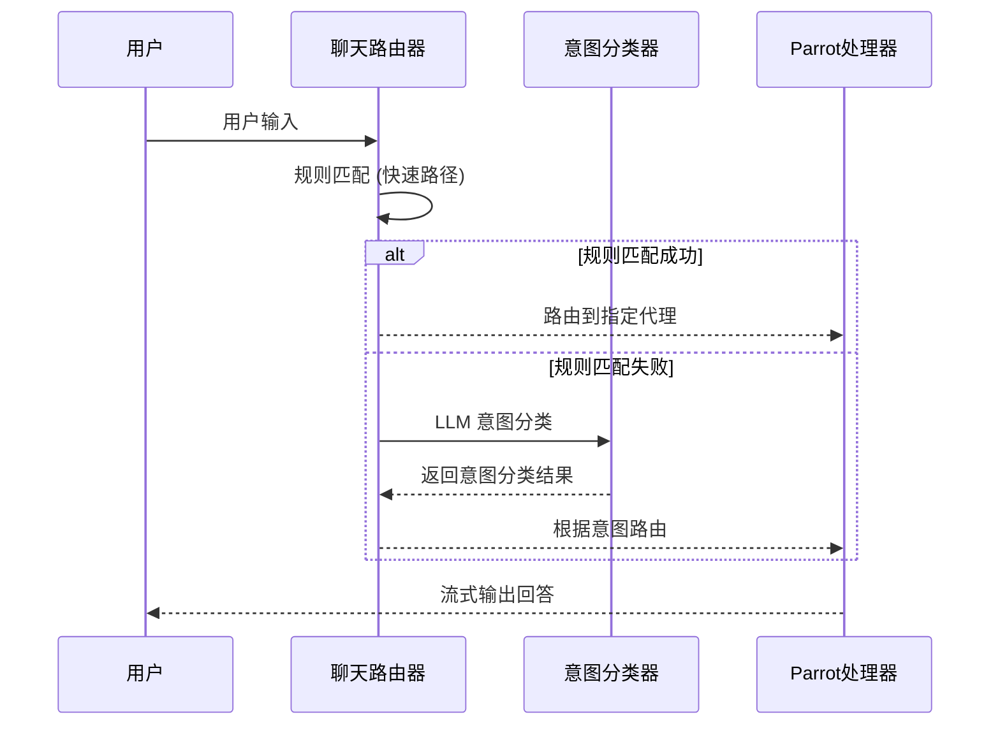
```mermaid
sequenceDiagram
participant U as 用户
participant CR as 聊天路由器
participant IC as 意图分类器
participant PH as Parrot处理器
U->>CR : 用户输入
CR->>CR : 规则匹配 (快速路径)
alt 规则匹配成功
CR-->>PH : 路由到指定代理
else 规则匹配失败
CR->>IC : LLM 意图分类
IC-->>CR : 返回意图分类结果
CR-->>PH : 根据意图路由
end
PH-->>U : 流式输出回答
```

**图表来源**
- [chat_router.go](file://plugin/ai/agent/chat_router.go#L70-L101)
- [intent_classifier.go](file://plugin/ai/agent/intent_classifier.go#L104-L125)

#### 聊天路由器实现

聊天路由器采用混合策略，先进行快速规则匹配，再使用 LLM 进行不确定情况的分类：

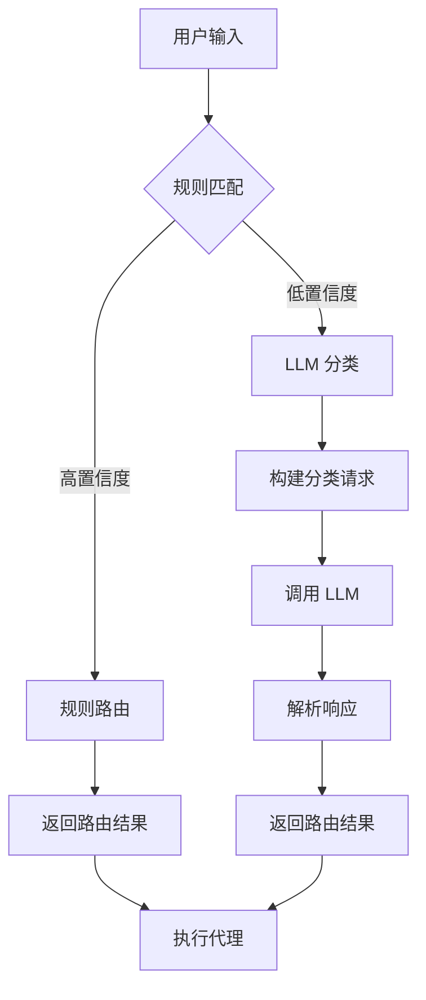
```mermaid
flowchart TD
A[用户输入] --> B{规则匹配}
B --> |高置信度| C[规则路由]
B --> |低置信度| D[LLM 分类]
C --> E[返回路由结果]
D --> F[构建分类请求]
F --> G[调用 LLM]
G --> H[解析响应]
H --> I[返回路由结果]
E --> J[执行代理]
I --> J
```

**图表来源**
- [chat_router.go](file://plugin/ai/agent/chat_router.go#L103-L180)
- [chat_router.go](file://plugin/ai/agent/chat_router.go#L182-L250)

**章节来源**
- [chat_router.go](file://plugin/ai/agent/chat_router.go#L42-L101)
- [handler.go](file://server/router/api/v1/ai/handler.go#L51-L78)

### 意图分类系统

**新增** 系统实现了多层次的意图分类机制，支持规则基础分类和 LLM 辅助分类：

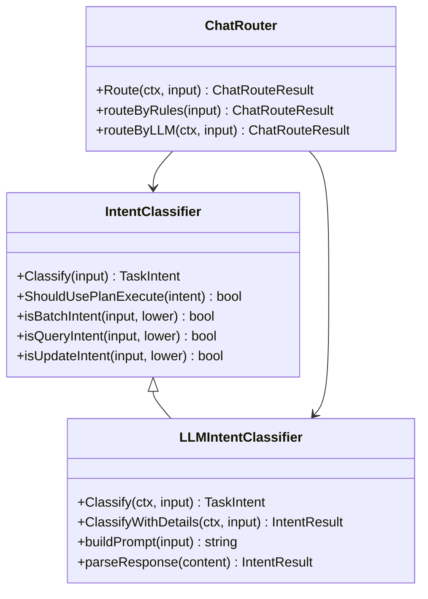
```mermaid
classDiagram
class IntentClassifier {
+Classify(input) TaskIntent
+ShouldUsePlanExecute(intent) bool
+isBatchIntent(input, lower) bool
+isQueryIntent(input, lower) bool
+isUpdateIntent(input, lower) bool
}
class LLMIntentClassifier {
+Classify(ctx, input) TaskIntent
+ClassifyWithDetails(ctx, input) IntentResult
+buildPrompt(input) string
+parseResponse(content) IntentResult
}
class ChatRouter {
+Route(ctx, input) ChatRouteResult
+routeByRules(input) ChatRouteResult
+routeByLLM(ctx, input) ChatRouteResult
}
IntentClassifier <|-- LLMIntentClassifier
ChatRouter --> IntentClassifier
ChatRouter --> LLMIntentClassifier
```

**图表来源**
- [intent_classifier.go](file://plugin/ai/agent/intent_classifier.go#L31-L47)
- [llm_intent_classifier.go](file://plugin/ai/agent/llm_intent_classifier.go#L22-L31)

**章节来源**
- [intent_classifier.go](file://plugin/ai/agent/intent_classifier.go#L104-L125)
- [llm_intent_classifier.go](file://plugin/ai/agent/llm_intent_classifier.go#L64-L140)

### 事件驱动对话管理系统

**新增** 系统采用了事件驱动的对话管理架构，通过 EventBus 实现异步对话持久化：

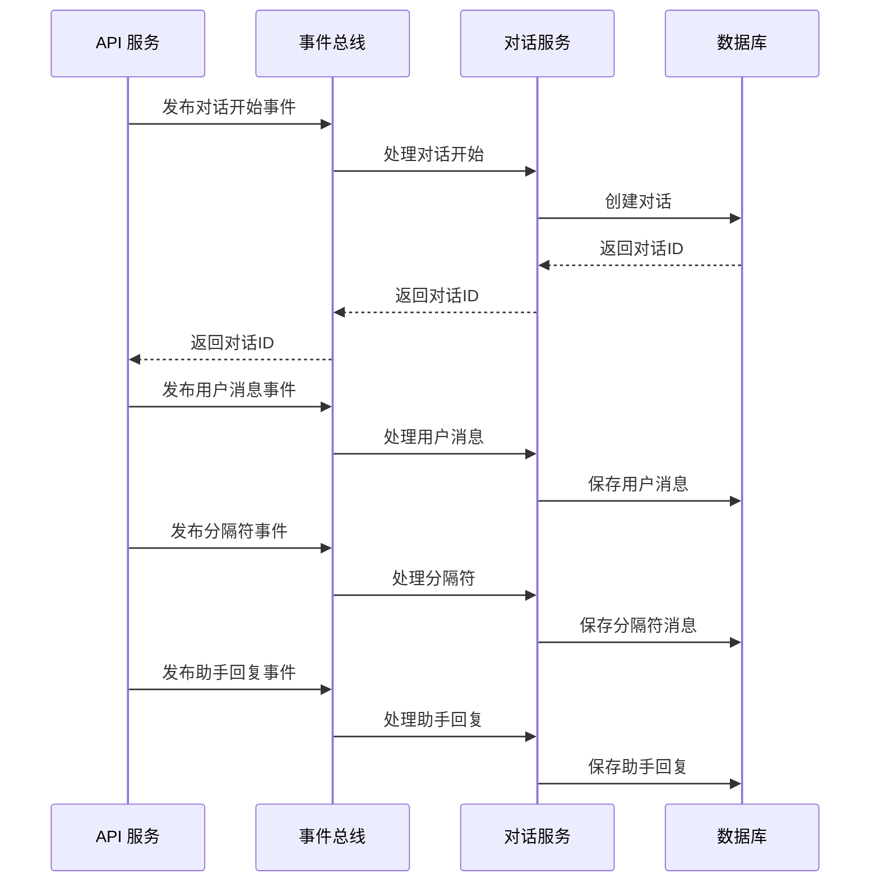
```mermaid
sequenceDiagram
participant API as API 服务
participant BUS as 事件总线
participant CS as 对话服务
participant DB as 数据库
API->>BUS : 发布对话开始事件
BUS->>CS : 处理对话开始
CS->>DB : 创建对话
DB-->>CS : 返回对话ID
CS-->>BUS : 返回对话ID
BUS-->>API : 返回对话ID
API->>BUS : 发布用户消息事件
BUS->>CS : 处理用户消息
CS->>DB : 保存用户消息
API->>BUS : 发布分隔符事件
BUS->>CS : 处理分隔符
CS->>DB : 保存分隔符消息
API->>BUS : 发布助手回复事件
BUS->>CS : 处理助手回复
CS->>DB : 保存助手回复
```

**图表来源**
- [conversation_service.go](file://server/router/api/v1/ai/conversation_service.go#L106-L207)
- [ai_service_chat.go](file://server/router/api/v1/ai_service_chat.go#L88-L138)

#### 事件收集器实现

事件收集器负责收集流式响应并在流结束时触发对话持久化：

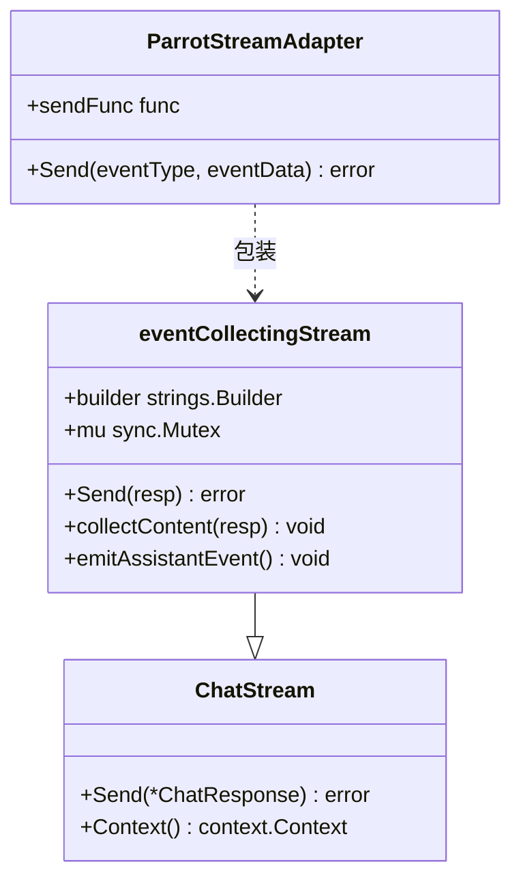
```mermaid
classDiagram
class eventCollectingStream {
+builder strings.Builder
+mu sync.Mutex
+Send(resp) error
+collectContent(resp) void
+emitAssistantEvent() void
}
class ParrotStreamAdapter {
+sendFunc func
+Send(eventType, eventData) error
}
class ChatStream {
+Send(*ChatResponse) error
+Context() context.Context
}
eventCollectingStream --|> ChatStream
ParrotStreamAdapter ..> eventCollectingStream : 包装
```

**图表来源**
- [ai_service_chat.go](file://server/router/api/v1/ai_service_chat.go#L242-L253)
- [types.go](file://plugin/ai/agent/types.go#L191-L220)

**章节来源**
- [conversation_service.go](file://server/router/api/v1/ai/conversation_service.go#L209-L228)
- [ai_service_chat.go](file://server/router/api/v1/ai_service_chat.go#L242-L305)

### AI 代理架构

系统实现了三种不同类型的 AI 代理，每种代理都有特定的功能和工作流程：

#### Memo Parrot（笔记助手）

Memo Parrot 专注于笔记搜索和信息检索，采用 ReAct 框架实现：

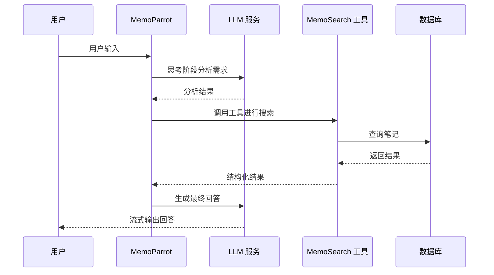
```mermaid
sequenceDiagram
participant U as 用户
participant MP as MemoParrot
participant LLM as LLM 服务
participant MS as MemoSearch 工具
participant DB as 数据库
U->>MP : 用户输入
MP->>LLM : 思考阶段分析需求
LLM-->>MP : 分析结果
MP->>MS : 调用工具进行搜索
MS->>DB : 查询笔记
DB-->>MS : 返回结果
MS-->>MP : 结构化结果
MP->>LLM : 生成最终回答
LLM-->>U : 流式输出回答
```

**图表来源**
- [memo_parrot.go](file://plugin/ai/agent/memo_parrot.go#L76-L289)
- [memo_search.go](file://plugin/ai/agent/tools/memo_search.go#L109-L193)

#### Schedule Parrot V2（日程助手）

Schedule Parrot V2 提供高级日程管理功能，支持冲突检测和自动调整：

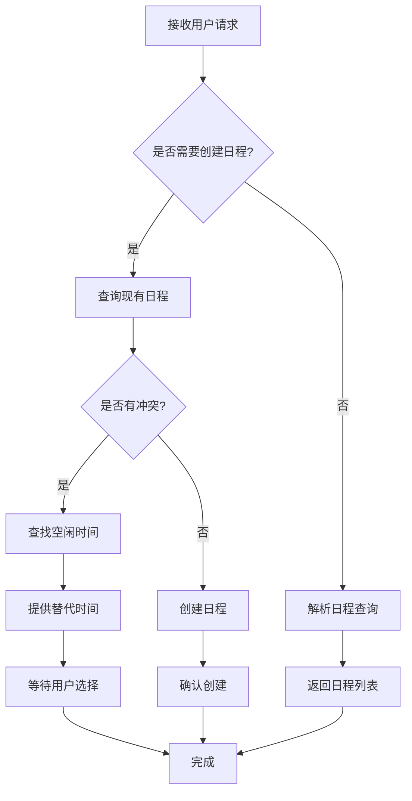
```mermaid
flowchart TD
A[接收用户请求] --> B{是否需要创建日程?}
B --> |是| C[查询现有日程]
B --> |否| D[解析日程查询]
C --> E{是否有冲突?}
E --> |是| F[查找空闲时间]
E --> |否| G[创建日程]
F --> H[提供替代时间]
G --> I[确认创建]
D --> J[返回日程列表]
H --> K[等待用户选择]
I --> L[完成]
J --> L
K --> L
```

**图表来源**
- [schedule_parrot_v2.go](file://plugin/ai/agent/schedule_parrot_v2.go#L32-L77)
- [scheduler.go](file://plugin/ai/agent/tools/scheduler.go#L459-L614)

#### Amazing Parrot（综合助手）

Amazing Parrot 是最复杂的代理，支持两阶段并发检索：

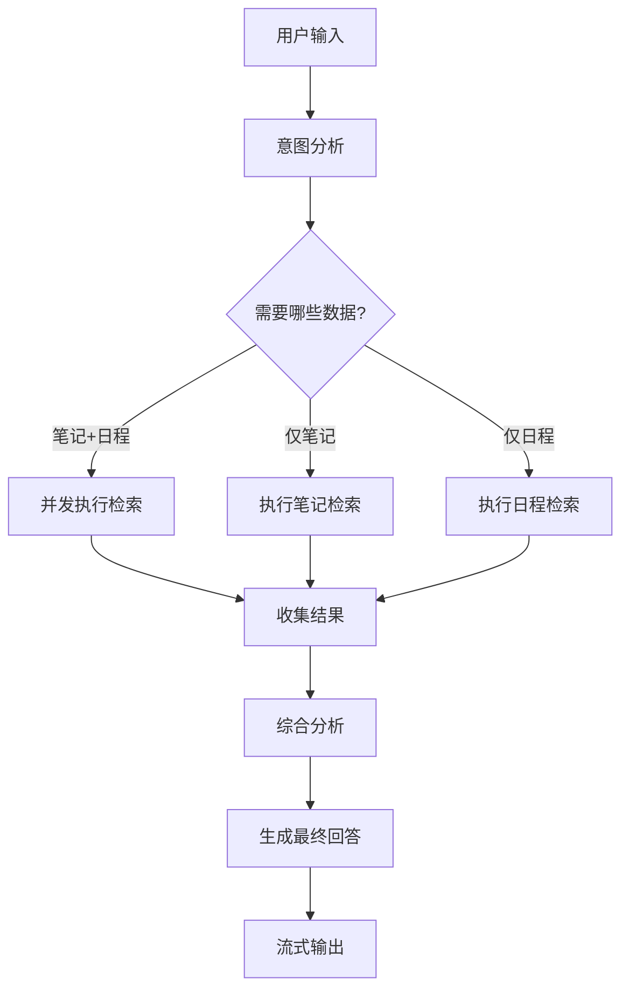
```mermaid
flowchart TD
A[用户输入] --> B[意图分析]
B --> C{需要哪些数据?}
C --> |笔记+日程| D[并发执行检索]
C --> |仅笔记| E[执行笔记检索]
C --> |仅日程| F[执行日程检索]
D --> G[收集结果]
E --> G
F --> G
G --> H[综合分析]
H --> I[生成最终回答]
I --> J[流式输出]
```

**图表来源**
- [amazing_parrot.go](file://plugin/ai/agent/amazing_parrot.go#L106-L184)
- [amazing_parrot.go](file://plugin/ai/agent/amazing_parrot.go#L228-L387)

**章节来源**
- [memo_parrot.go](file://plugin/ai/agent/memo_parrot.go#L26-L66)
- [schedule_parrot_v2.go](file://plugin/ai/agent/schedule_parrot_v2.go#L9-L24)
- [amazing_parrot.go](file://plugin/ai/agent/amazing_parrot.go#L19-L31)

### 工具调用机制

系统实现了灵活的工具调用框架，支持动态工具注册和执行：

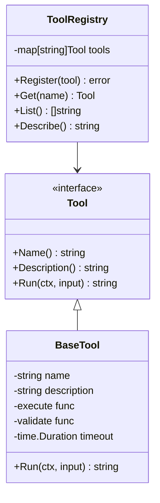
```mermaid
classDiagram
class Tool {
<<interface>>
+Name() string
+Description() string
+Run(ctx, input) string
}
class BaseTool {
-string name
-string description
-execute func
-validate func
-time.Duration timeout
+Run(ctx, input) string
}
class ToolRegistry {
-map[string]Tool tools
+Register(tool) error
+Get(name) Tool
+List() []string
+Describe() string
}
Tool <|-- BaseTool
ToolRegistry --> Tool
```

**图表来源**
- [base_tool.go](file://plugin/ai/agent/base_tool.go#L10-L32)
- [base_tool.go](file://plugin/ai/agent/base_tool.go#L147-L151)

**章节来源**
- [base_tool.go](file://plugin/ai/agent/base_tool.go#L54-L93)
- [base_tool.go](file://plugin/ai/agent/base_tool.go#L147-L222)

### 并发检索优化

Amazing Parrot 实现了两阶段并发检索策略，显著提升性能：

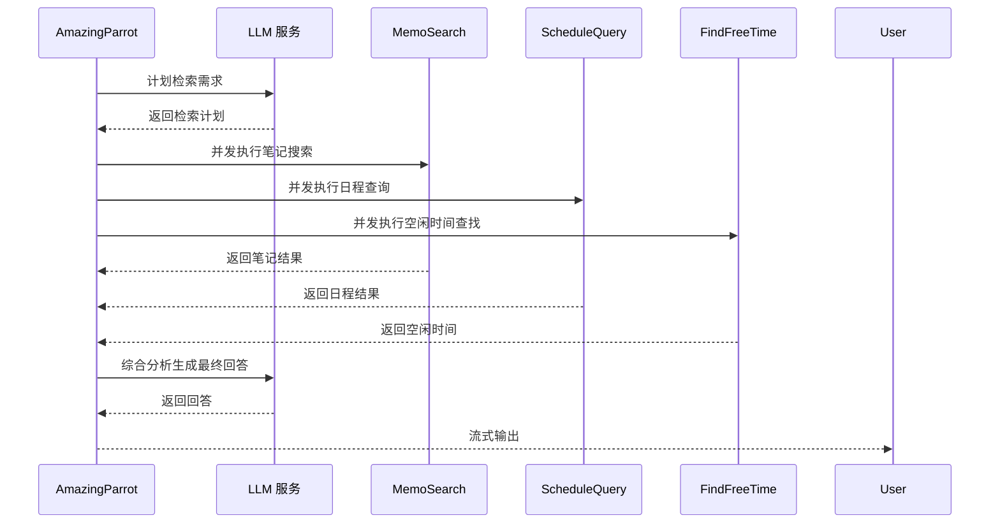
```mermaid
sequenceDiagram
participant AP as AmazingParrot
participant LLM as LLM 服务
participant MR as MemoSearch
participant SR as ScheduleQuery
participant FR as FindFreeTime
AP->>LLM : 计划检索需求
LLM-->>AP : 返回检索计划
AP->>MR : 并发执行笔记搜索
AP->>SR : 并发执行日程查询
AP->>FR : 并发执行空闲时间查找
MR-->>AP : 返回笔记结果
SR-->>AP : 返回日程结果
FR-->>AP : 返回空闲时间
AP->>LLM : 综合分析生成最终回答
LLM-->>AP : 返回回答
AP-->>User : 流式输出
```

**图表来源**
- [amazing_parrot.go](file://plugin/ai/agent/amazing_parrot.go#L228-L387)
- [amazing_parrot.go](file://plugin/ai/agent/amazing_parrot.go#L390-L451)

**章节来源**
- [amazing_parrot.go](file://plugin/ai/agent/amazing_parrot.go#L186-L225)
- [amazing_parrot.go](file://plugin/ai/agent/amazing_parrot.go#L228-L387)

### 结果整合机制

系统实现了智能的结果整合机制，支持多源数据的统一处理：

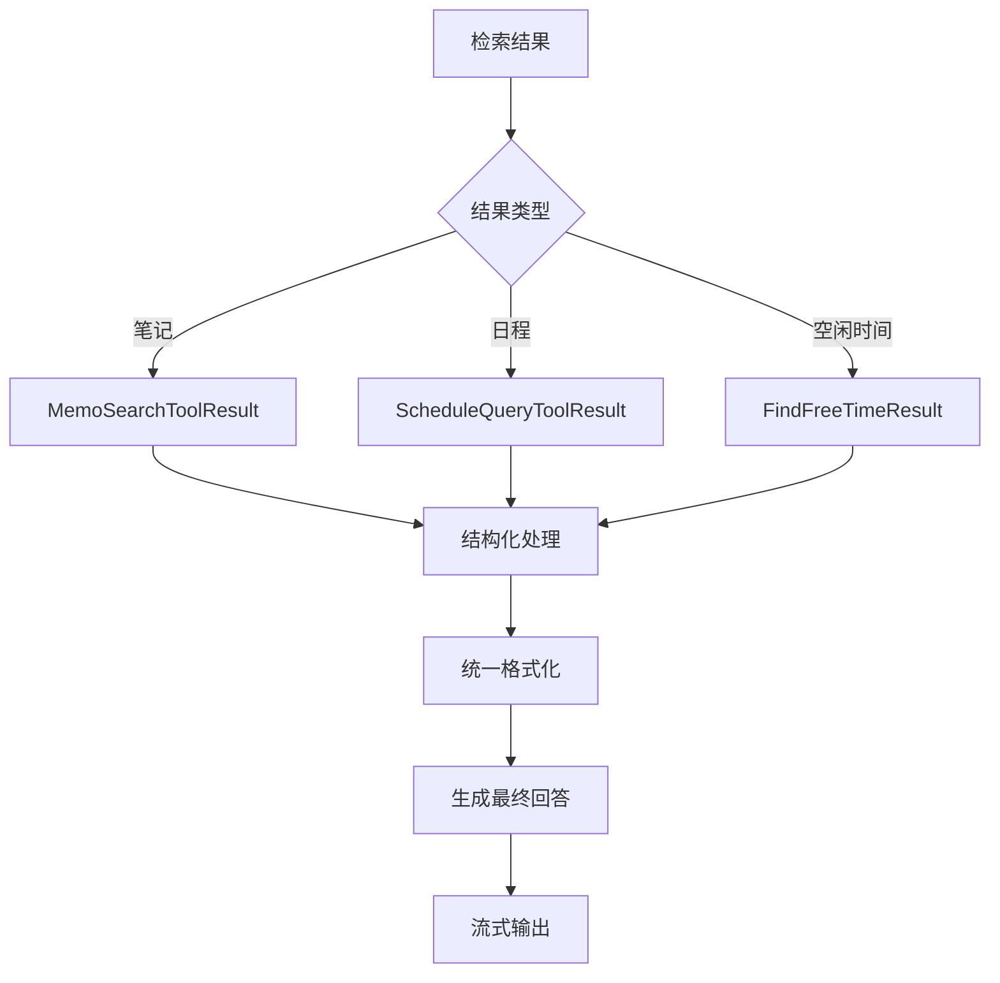
```mermaid
flowchart TD
A[检索结果] --> B{结果类型}
B --> |笔记| C[MemoSearchToolResult]
B --> |日程| D[ScheduleQueryToolResult]
B --> |空闲时间| E[FindFreeTimeResult]
C --> F[结构化处理]
D --> F
E --> F
F --> G[统一格式化]
G --> H[生成最终回答]
H --> I[流式输出]
```

**图表来源**
- [memo_search.go](file://plugin/ai/agent/tools/memo_search.go#L202-L282)
- [scheduler.go](file://plugin/ai/agent/tools/scheduler.go#297-L387)

**章节来源**
- [memo_search.go](file://plugin/ai/agent/tools/memo_search.go#L202-L282)
- [scheduler.go](file://plugin/ai/agent/tools/scheduler.go#L297-L387)

### 嵌入向量处理

系统支持多种嵌入模型，提供高效的向量相似度计算：

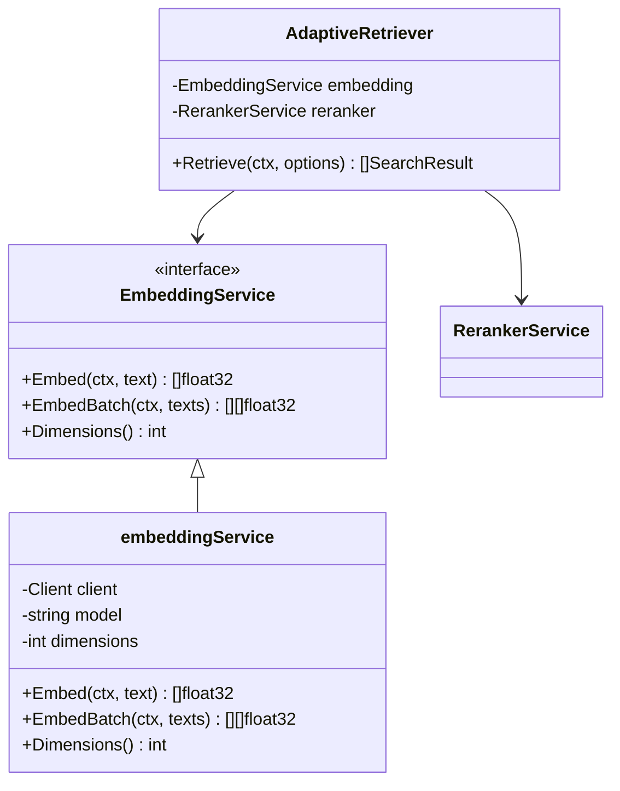
```mermaid
classDiagram
class EmbeddingService {
<<interface>>
+Embed(ctx, text) []float32
+EmbedBatch(ctx, texts) [][]float32
+Dimensions() int
}
class embeddingService {
-Client client
-string model
-int dimensions
+Embed(ctx, text) []float32
+EmbedBatch(ctx, texts) [][]float32
+Dimensions() int
}
class AdaptiveRetriever {
-EmbeddingService embedding
-RerankerService reranker
+Retrieve(ctx, options) []SearchResult
}
EmbeddingService <|-- embeddingService
AdaptiveRetriever --> EmbeddingService
AdaptiveRetriever --> RerankerService
```

**图表来源**
- [embedding.go](file://plugin/ai/embedding.go#L11-L21)
- [embedding.go](file://plugin/ai/embedding.go#L23-L27)
- [embedding.go](file://plugin/ai/embedding.go#L28-L58)

**章节来源**
- [embedding.go](file://plugin/ai/embedding.go#L29-L58)
- [reranker.go](file://plugin/ai/reranker.go#L20-L27)

### 相似度计算

系统实现了灵活的相似度计算和重排序机制：

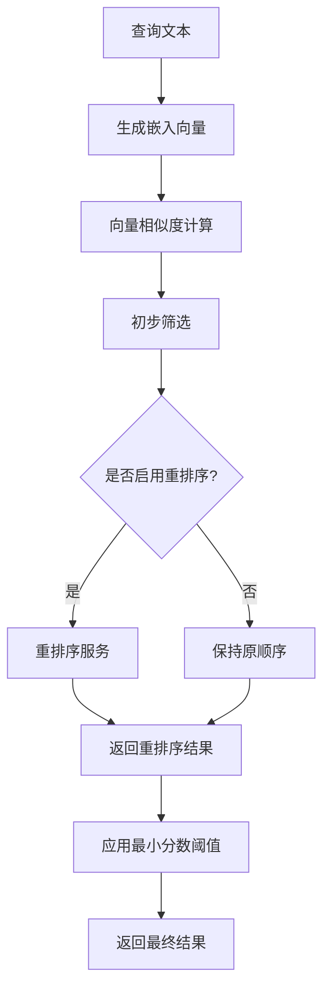
```mermaid
flowchart TD
A[查询文本] --> B[生成嵌入向量]
B --> C[向量相似度计算]
C --> D[初步筛选]
D --> E{是否启用重排序?}
E --> |是| F[重排序服务]
E --> |否| G[保持原顺序]
F --> H[返回重排序结果]
G --> H
H --> I[应用最小分数阈值]
I --> J[返回最终结果]
```

**图表来源**
- [reranker.go](file://plugin/ai/reranker.go#L59-L126)

**章节来源**
- [reranker.go](file://plugin/ai/reranker.go#L37-L53)
- [reranker.go](file://plugin/ai/reranker.go#L59-L126)

### 上下文管理

系统提供了完整的上下文管理机制，支持多轮对话的状态维护：

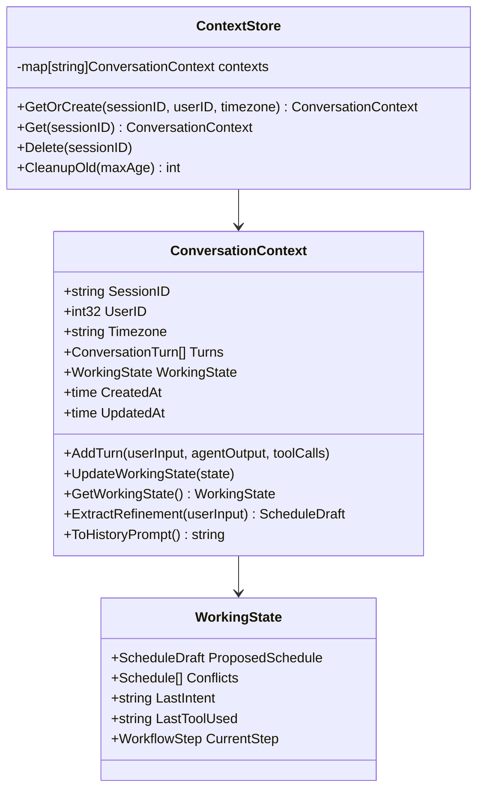
```mermaid
classDiagram
class ConversationContext {
+string SessionID
+int32 UserID
+string Timezone
+ConversationTurn[] Turns
+WorkingState WorkingState
+time CreatedAt
+time UpdatedAt
+AddTurn(userInput, agentOutput, toolCalls)
+UpdateWorkingState(state)
+GetWorkingState() WorkingState
+ExtractRefinement(userInput) ScheduleDraft
+ToHistoryPrompt() string
}
class WorkingState {
+ScheduleDraft ProposedSchedule
+Schedule[] Conflicts
+string LastIntent
+string LastToolUsed
+WorkflowStep CurrentStep
}
class ContextStore {
-map[string]ConversationContext contexts
+GetOrCreate(sessionID, userID, timezone) ConversationContext
+Get(sessionID) ConversationContext
+Delete(sessionID)
+CleanupOld(maxAge) int
}
ConversationContext --> WorkingState
ContextStore --> ConversationContext
```

**图表来源**
- [context.go](file://plugin/ai/agent/context.go#L19-L37)
- [context.go](file://plugin/ai/agent/context.go#L57-L73)
- [context.go](file://plugin/ai/agent/context.go#L404-L408)

**章节来源**
- [context.go](file://plugin/ai/agent/context.go#L103-L114)
- [context.go](file://plugin/ai/agent/context.go#L137-L144)
- [context.go](file://plugin/ai/agent/context.go#L234-L306)

### 聊天历史管理

系统实现了高效的聊天历史管理机制：

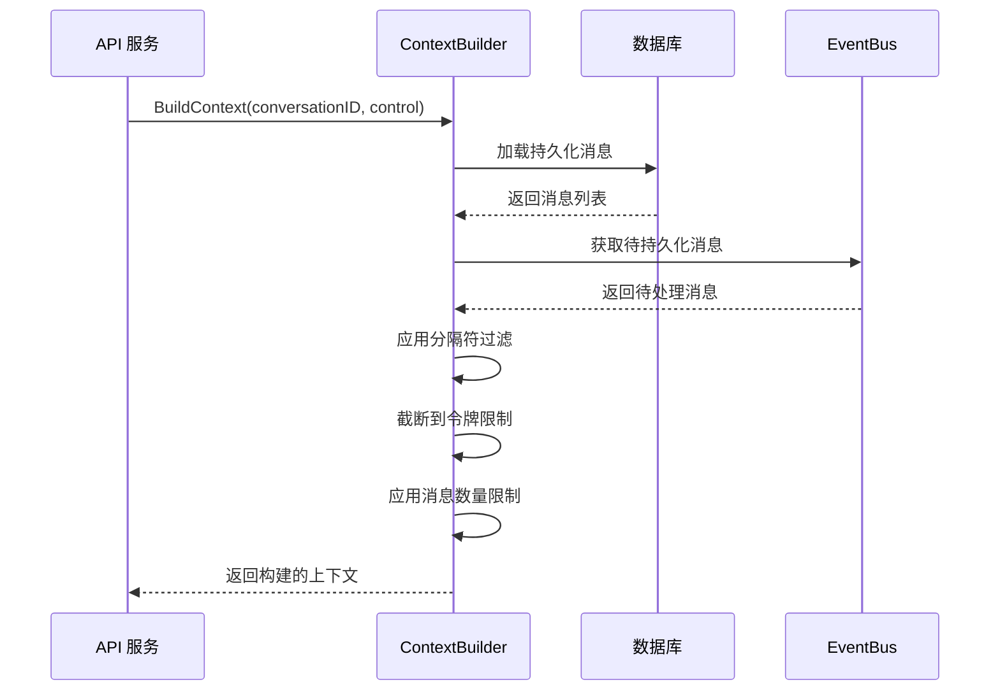
```mermaid
sequenceDiagram
participant API as API 服务
participant CB as ContextBuilder
participant DB as 数据库
participant EB as EventBus
API->>CB : BuildContext(conversationID, control)
CB->>DB : 加载持久化消息
DB-->>CB : 返回消息列表
CB->>EB : 获取待持久化消息
EB-->>CB : 返回待处理消息
CB->>CB : 应用分隔符过滤
CB->>CB : 截断到令牌限制
CB->>CB : 应用消息数量限制
CB-->>API : 返回构建的上下文
```

**图表来源**
- [context_builder.go](file://server/router/api/v1/ai/context_builder.go#L95-L224)

**章节来源**
- [context_builder.go](file://server/router/api/v1/ai/context_builder.go#L61-L86)
- [context_builder.go](file://server/router/api/v1/ai/context_builder.go#L95-L224)

## 依赖关系分析

系统采用了清晰的依赖层次结构，各组件之间的耦合度得到有效控制：

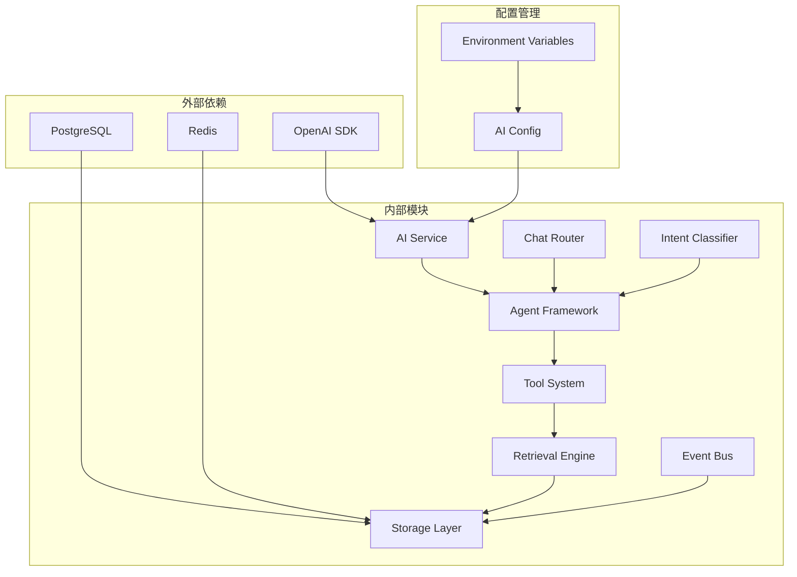
```mermaid
graph TB
subgraph "外部依赖"
A[OpenAI SDK]
B[PostgreSQL]
C[Redis]
end
subgraph "内部模块"
D[AI Service]
E[Agent Framework]
F[Tool System]
G[Retrieval Engine]
H[Storage Layer]
I[Event Bus]
J[Chat Router]
K[Intent Classifier]
end
subgraph "配置管理"
L[AI Config]
M[Environment Variables]
end
A --> D
B --> H
C --> H
D --> E
E --> F
F --> G
G --> H
I --> H
J --> E
K --> E
L --> D
M --> L
```

**图表来源**
- [ai_service.go](file://server/router/api/v1/ai_service.go#L3-L15)
- [config.go](file://plugin/ai/config.go#L47-L103)

**章节来源**
- [ai_service.go](file://server/router/api/v1/ai_service.go#L3-L15)
- [config.go](file://plugin/ai/config.go#L47-L103)

## 性能考虑

系统在设计时充分考虑了性能优化，采用了多种策略来提升响应速度和资源利用率：

### 缓存策略
- **LRU 缓存**：Memo Parrot 和 Amazing Parrot 使用 LRU 缓存减少重复计算
- **时间戳缓存**：默认 TTL 为 5 分钟，平衡新鲜度和性能
- **缓存键生成**：使用 SHA256 哈希防止内存泄漏

### 并发优化
- **两阶段并发检索**：Amazing Parrot 采用并发策略减少总响应时间
- **异步持久化**：EventBus 支持异步消息持久化，避免阻塞主流程
- **连接池管理**：HTTP 客户端使用连接池优化网络请求
- **事件驱动架构**：对话持久化采用异步处理，不阻塞主响应流程

### 内存管理
- **上下文截断**：ContextBuilder 自动截断过长的对话历史
- **工作状态清理**：定期清理过期的对话上下文
- **令牌计数估算**：使用简单的字符计数估算令牌数量
- **流式响应收集**：事件收集器使用字符串构建器按需收集响应

### 路由优化
- **快速规则匹配**：聊天路由器优先使用规则匹配，0ms 延迟
- **LLM 路由降级**：当 LLM 失败时自动降级到默认路由
- **置信度阈值**：使用置信度阈值避免错误路由

## 故障排除指南

### 常见问题诊断

#### AI 服务未启用
**症状**：调用 AI API 返回未启用错误
**解决方案**：
1. 检查 AI 配置是否正确设置
2. 验证嵌入服务提供商配置
3. 确认 API 密钥有效

#### LLM 调用超时
**症状**：LLM 调用超时或响应缓慢
**解决方案**：
1. 检查网络连接和 API 端点
2. 调整超时参数
3. 优化提示词长度

#### 工具执行失败
**症状**：工具调用返回错误
**解决方案**：
1. 检查工具输入格式
2. 验证用户权限
3. 查看工具执行日志

#### 缓存问题
**症状**：缓存命中率低或内存占用过高
**解决方案**：
1. 调整缓存大小和 TTL
2. 检查缓存键生成逻辑
3. 监控缓存性能指标

#### 路由失败
**症状**：聊天路由无法正确分类
**解决方案**：
1. 检查路由配置（API Key、BaseURL、Model）
2. 验证 LLM 可用性
3. 查看路由日志
4. 调整规则匹配逻辑

#### 对话持久化失败
**症状**：对话消息无法保存
**解决方案**：
1. 检查数据库连接
2. 验证事件总线配置
3. 查看对话服务日志
4. 检查权限设置

**章节来源**
- [llm.go](file://plugin/ai/llm.go#L106-L128)
- [memo_parrot.go](file://plugin/ai/agent/memo_parrot.go#L93-L106)
- [amazing_parrot.go](file://plugin/ai/agent/amazing_parrot.go#L125-L136)
- [chat_router.go](file://plugin/ai/agent/chat_router.go#L82-L93)
- [conversation_service.go](file://server/router/api/v1/ai/conversation_service.go#L156-L172)

## 结论

本 AI 服务实现展现了现代 AI 系统的设计理念，通过模块化架构、智能工具调用、并发优化和**新增的智能路由与事件驱动对话管理**，提供了高效、可扩展的 AI 增强功能。

**核心架构增强**：
1. **智能聊天路由**：混合规则+LLM 的路由机制，支持快速和精确的代理选择
2. **事件驱动对话管理**：基于 EventBus 的异步持久化架构，提升系统可靠性
3. **实时流式反馈**：事件收集器确保对话状态的完整性和一致性
4. **多层次意图分类**：支持简单和复杂任务的智能识别和处理

系统的主要优势包括：

1. **灵活的代理架构**：支持多种 AI 代理协同工作
2. **高效的检索机制**：两阶段并发检索显著提升性能
3. **完善的上下文管理**：支持复杂的多轮对话场景
4. **可扩展的工具系统**：支持动态工具注册和执行
5. **健壮的错误处理**：提供完整的故障诊断和恢复机制
6. **智能路由系统**：基于规则和 LLM 的混合路由机制
7. **事件驱动架构**：异步对话持久化，提升系统稳定性

该系统为后续的功能扩展和性能优化奠定了坚实的基础，能够满足各种复杂的 AI 应用场景需求。

## 附录

### API 使用示例

#### 语义搜索 API
```javascript
// 请求示例
fetch('/api/v1/ai/search', {
  method: 'POST',
  headers: {'Content-Type': 'application/json'},
  body: JSON.stringify({
    query: '项目管理最佳实践',
    limit: 10
  })
})

// 响应示例
{
  "results": [
    {
      "name": "memos/123",
      "snippet": "项目管理的核心原则...",
      "score": 0.95
    }
  ]
}
```

#### 聊天 API
```javascript
// 请求示例
fetch('/api/v1/ai/chat', {
  method: 'POST',
  headers: {'Content-Type': 'application/json'},
  body: JSON.stringify({
    message: '如何提高团队效率？',
    history: ['上一轮对话历史'],
    agent_type: 'AGENT_TYPE_MEMO'
  })
})

// 响应示例（流式）
{
  "content": "提高团队效率的方法包括...",
  "sources": ["memos/123"],
  "done": false
}
```

#### 会话管理 API
```javascript
// 创建会话
POST /api/v1/ai/conversations
{
  "title": "项目讨论",
  "parrot_id": "AGENT_TYPE_AMAZING"
}

// 获取会话消息
GET /api/v1/ai/conversations/{id}/messages?limit=50

// 添加上下文分隔符
POST /api/v1/ai/conversations/{id}/separator
```

### 性能优化建议

1. **缓存策略优化**：根据业务场景调整缓存大小和 TTL
2. **并发配置**：合理设置工具执行的并发数量
3. **网络优化**：使用连接池和适当的超时设置
4. **监控告警**：建立完善的性能监控和告警机制
5. **资源管理**：定期清理过期数据和缓存
6. **路由优化**：根据使用模式调整规则匹配权重
7. **事件总线调优**：合理设置监听器超时和并发数

### 扩展开发指南

#### 添加新的 AI 代理
1. 实现 `ParrotAgent` 接口
2. 定义代理的元认知信息
3. 注册到代理工厂
4. 集成到 API 服务

#### 添加新的工具
1. 实现 `Tool` 接口
2. 在工具注册表中注册
3. 更新代理的工具描述
4. 测试工具集成

#### 自定义检索策略
1. 扩展 `RetrievalStrategy` 接口
2. 实现自定义检索逻辑
3. 集成到 AdaptiveRetriever
4. 测试检索效果

#### 扩展聊天路由
1. 修改 `ChatRouterConfig` 配置
2. 更新路由规则逻辑
3. 集成新的 LLM 模型
4. 测试路由准确性

#### 自定义对话持久化
1. 实现 `ConversationStore` 接口
2. 扩展事件处理器
3. 集成新的存储后端
4. 测试持久化可靠性