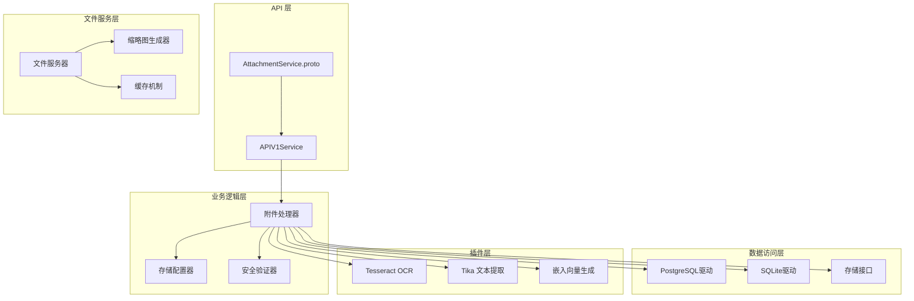
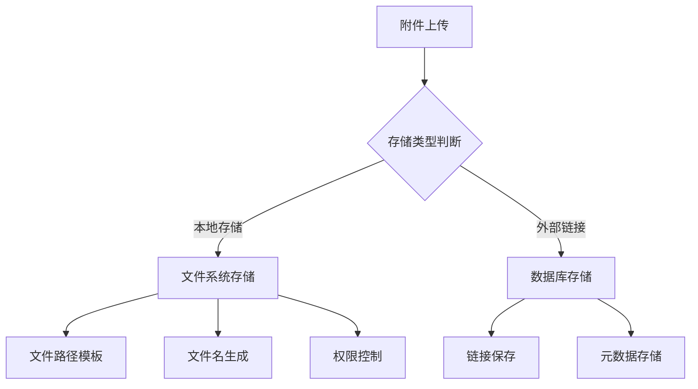
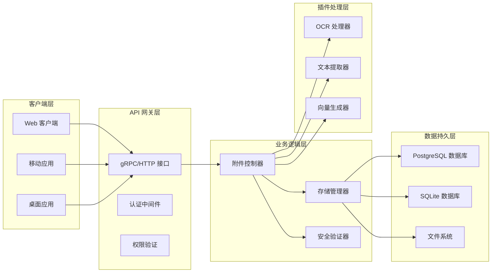
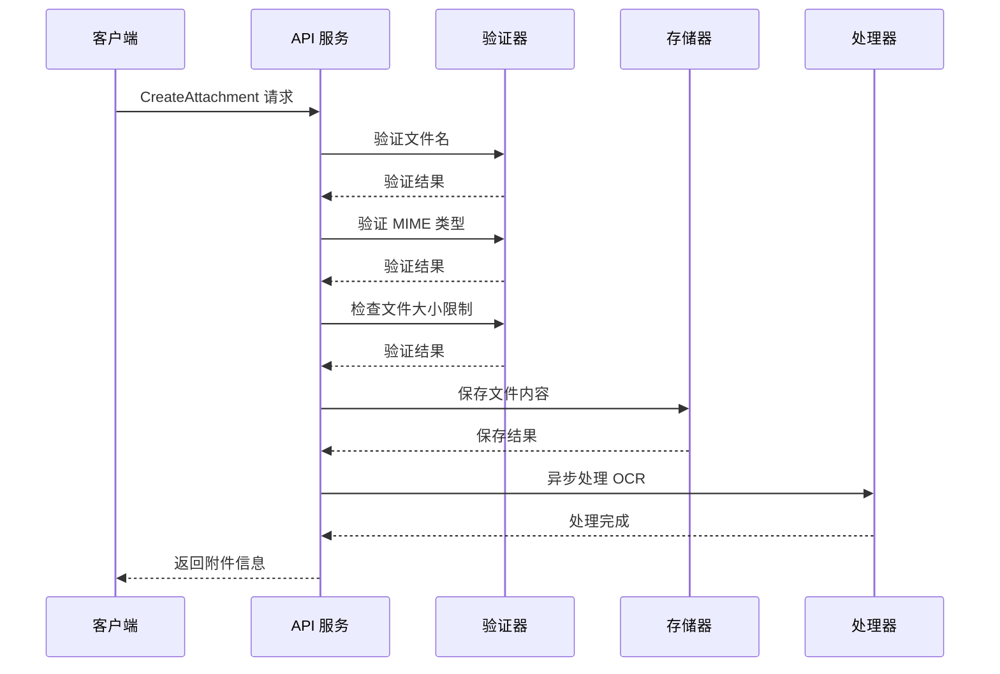
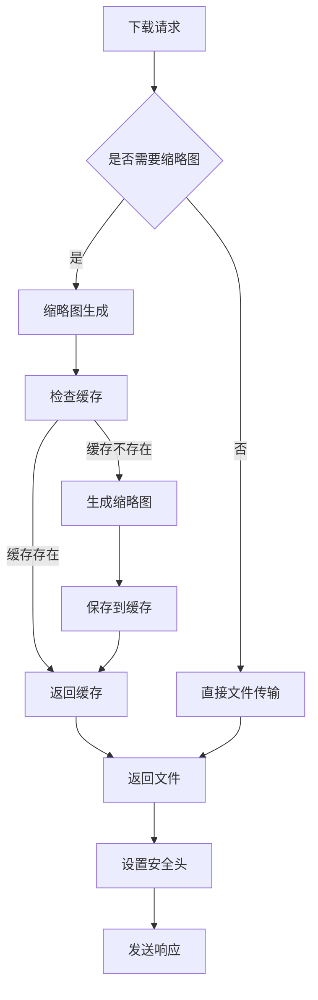
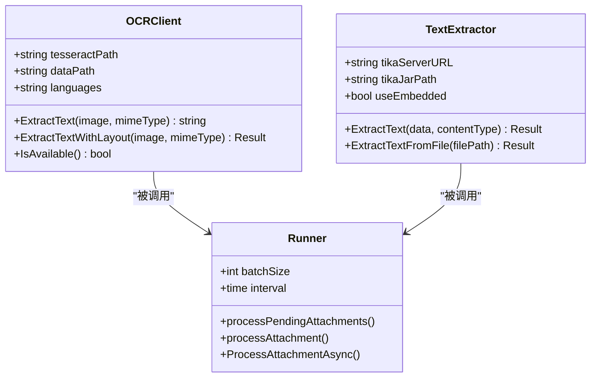
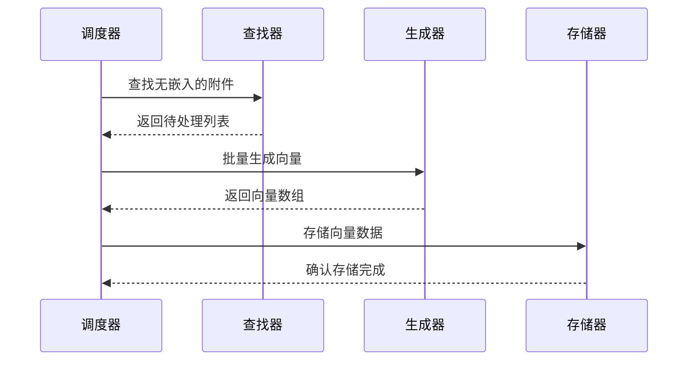
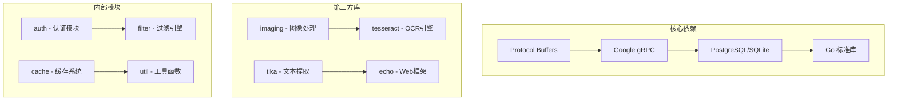
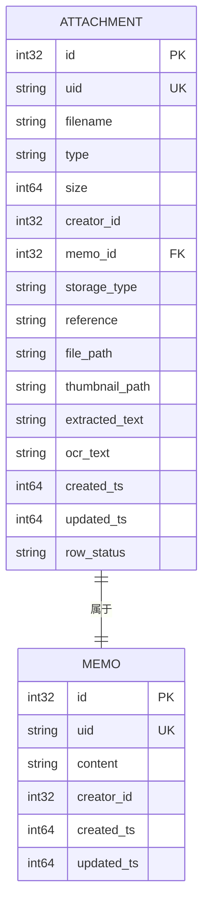

# 附件服务实现

<cite>
**本文档引用的文件**
- [attachment_service.proto](file://proto/api/v1/attachment_service.proto)
- [attachment_service.go](file://server/router/api/v1/attachment_service.go)
- [attachment.go](file://store/attachment.go)
- [tesseract.go](file://plugin/ocr/tesseract.go)
- [tika.go](file://plugin/textextract/tika.go)
- [runner.go](file://server/runner/ocr/runner.go)
- [runner.go](file://server/runner/embedding/runner.go)
- [attachment.go](file://store/db/postgres/attachment.go)
- [attachment.go](file://store/db/sqlite/attachment.go)
- [fileserver.go](file://server/router/fileserver/fileserver.go)
</cite>

## 目录
1. [简介](#简介)
2. [项目结构](#项目结构)
3. [核心组件](#核心组件)
4. [架构概览](#架构概览)
5. [详细组件分析](#详细组件分析)
6. [依赖关系分析](#依赖关系分析)
7. [性能考虑](#性能考虑)
8. [故障排除指南](#故障排除指南)
9. [结论](#结论)

## 简介

附件服务是 Memos 系统中的核心功能模块，负责管理用户上传的各种文件资源。该服务实现了完整的附件生命周期管理，包括文件上传、下载、预览和删除操作。系统支持多种存储策略，具备智能的文件类型识别能力，并集成了 OCR 文字识别、嵌入向量生成、缩略图创建等高级功能。

## 项目结构

附件服务的实现采用分层架构设计，主要包含以下层次：

**图表来源**
- [attachment_service.proto](file://proto/api/v1/attachment_service.proto#L15-L46)
- [attachment_service.go](file://server/router/api/v1/attachment_service.go#L47-L141)

**章节来源**
- [attachment_service.proto](file://proto/api/v1/attachment_service.proto#L1-L151)
- [attachment_service.go](file://server/router/api/v1/attachment_service.go#L1-L465)

## 核心组件

### 1. 附件服务接口定义

附件服务通过 Protocol Buffers 定义了完整的 API 接口，支持标准的 CRUD 操作：

- **CreateAttachment**: 创建新附件
- **ListAttachments**: 列出所有附件
- **GetAttachment**: 根据名称获取附件
- **UpdateAttachment**: 更新附件信息
- **DeleteAttachment**: 删除附件

每个接口都包含了完整的请求响应结构体定义，确保了类型安全和跨语言兼容性。

### 2. 存储策略实现

系统支持多种存储策略，主要分为本地存储和外部链接存储两种模式：

**图表来源**
- [attachment_service.go](file://server/router/api/v1/attachment_service.go#L318-L356)

### 3. 文件类型识别系统

系统具备智能的文件类型识别能力，支持多种验证机制：

- **扩展名检测**: 基于文件扩展名推断 MIME 类型
- **内容嗅探**: 使用 HTTP 检测算法分析文件内容
- **格式解析**: 解析 MIME 类型参数，去除多余信息

**章节来源**
- [attachment_service.go](file://server/router/api/v1/attachment_service.go#L67-L84)
- [attachment_service.go](file://server/router/api/v1/attachment_service.go#L430-L440)

## 架构概览

附件服务的整体架构采用微服务设计理念，各组件职责明确，耦合度低：

**图表来源**
- [attachment_service.go](file://server/router/api/v1/attachment_service.go#L47-L295)
- [runner.go](file://server/runner/ocr/runner.go#L18-L70)

## 详细组件分析

### 附件上传流程

附件上传是整个系统最复杂的流程之一，涉及多个验证步骤和处理阶段：

**图表来源**
- [attachment_service.go](file://server/router/api/v1/attachment_service.go#L47-L141)
- [runner.go](file://server/runner/ocr/runner.go#L258-L292)

#### 1. 文件验证机制

系统实施了多层次的文件验证策略：

- **文件名验证**: 防止路径遍历攻击，确保文件名安全
- **MIME 类型验证**: 验证 MIME 类型格式的有效性
- **大小限制检查**: 基于系统设置的上传大小限制
- **内容类型检测**: 自动推断文件的真实类型

#### 2. 存储配置管理

存储配置采用灵活的模板系统：

- **路径模板**: 支持 `{filename}`, `{timestamp}`, `{uuid}` 等占位符
- **目录结构**: 自动生成多级目录结构，避免单目录文件过多
- **文件命名**: 结合时间戳和随机标识符确保唯一性

**章节来源**
- [attachment_service.go](file://server/router/api/v1/attachment_service.go#L318-L413)

### 附件下载与预览

附件下载服务提供了完整的文件访问控制和预览功能：

**图表来源**
- [fileserver.go](file://server/router/fileserver/fileserver.go#L409-L518)

#### 1. 缩略图生成系统

系统实现了高效的缩略图生成机制：

- **并发控制**: 使用信号量限制同时生成的缩略图数量
- **缓存策略**: 将生成的缩略图缓存到本地磁盘
- **内存优化**: 严格控制内存使用，防止内存泄漏
- **尺寸适配**: 智能调整缩略图尺寸，保持纵横比

#### 2. 安全防护机制

下载服务实施了多重安全防护：

- **XSS 防护**: 对潜在危险的文件类型强制下载
- **MIME 类型嗅探**: 防止 MIME 类型欺骗攻击
- **内容安全策略**: 限制内容加载和嵌入
- **范围请求支持**: 完整支持视频音频的流式播放

**章节来源**
- [fileserver.go](file://server/router/fileserver/fileserver.go#L76-L176)

### OCR 文字识别集成

系统集成了先进的 OCR 文字识别功能，支持多种图像格式：

**图表来源**
- [tesseract.go](file://plugin/ocr/tesseract.go#L49-L122)
- [tika.go](file://plugin/textextract/tika.go#L88-L132)
- [runner.go](file://server/runner/ocr/runner.go#L18-L70)

#### 1. OCR 处理流程

OCR 处理采用异步批处理模式：

- **任务发现**: 定期扫描需要处理的附件
- **并发控制**: 限制同时处理的任务数量
- **错误恢复**: 单个任务失败不影响整体进程
- **进度跟踪**: 实时监控处理进度

#### 2. 文本提取功能

系统支持多种文档格式的文本提取：

- **PDF 文档**: 提取纯文本和元数据
- **Office 文档**: 支持 Word、Excel、PowerPoint
- **富文本格式**: RTF 和其他富文本格式
- **纯文本文件**: 自动统计字符数和词数

**章节来源**
- [runner.go](file://server/runner/ocr/runner.go#L112-L254)

### 嵌入向量生成

系统实现了智能的嵌入向量生成功能，用于支持语义搜索：

**图表来源**
- [runner.go](file://server/runner/embedding/runner.go#L58-L138)

#### 1. 向量生成策略

嵌入向量生成采用优化的批处理策略：

- **批量大小优化**: 在内存使用和处理效率间平衡
- **间隔调度**: 避免 CPU 资源过度占用
- **模型选择**: 使用高效的 BAAI/bge-m3 模型
- **增量处理**: 只处理新增或修改的内容

#### 2. 性能优化措施

系统实施了多项性能优化：

- **内存池管理**: 减少内存分配开销
- **并发控制**: 限制同时进行的向量化操作
- **缓存机制**: 避免重复计算相同的向量
- **超时控制**: 防止长时间阻塞

**章节来源**
- [runner.go](file://server/runner/embedding/runner.go#L21-L51)

## 依赖关系分析

附件服务的依赖关系复杂但结构清晰，主要依赖关系如下：

**图表来源**
- [attachment_service.go](file://server/router/api/v1/attachment_service.go#L3-L30)
- [fileserver.go](file://server/router/fileserver/fileserver.go#L3-L26)

### 数据模型设计

附件服务的数据模型设计体现了良好的数据库规范化原则：

**图表来源**
- [attachment.go](file://store/attachment.go#L15-L49)

**章节来源**
- [attachment.go](file://store/attachment.go#L1-L154)
- [attachment.go](file://store/db/postgres/attachment.go#L17-L44)

## 性能考虑

### 内存管理优化

系统在内存管理方面实施了多项优化策略：

- **上传缓冲区限制**: 32MB 的内存缓冲区上限，防止内存溢出
- **流式处理**: 大文件采用流式读写，避免一次性加载到内存
- **并发控制**: 使用信号量限制同时进行的处理任务数量
- **垃圾回收**: 合理的内存释放时机，减少 GC 压力

### 存储优化策略

- **文件系统分片**: 自动生成多级目录结构，避免单目录文件过多
- **压缩存储**: 对大文件采用适当的压缩策略
- **缓存机制**: 缩略图和处理结果的本地缓存
- **清理策略**: 定期清理过期的临时文件和缓存

### 网络传输优化

- **范围请求支持**: 完整支持 HTTP Range 请求，提高大文件传输效率
- **断点续传**: 基于 Range 请求的断点续传支持
- **并发下载**: 多连接并发下载提升速度
- **智能重试**: 网络异常时的自动重试机制

## 故障排除指南

### 常见问题诊断

#### 1. 上传失败问题

**症状**: 附件上传后返回错误

**可能原因**:
- 文件大小超过限制
- MIME 类型不支持
- 权限不足
- 存储空间不足

**解决方案**:
- 检查系统配置的上传大小限制
- 验证文件格式是否在支持列表中
- 确认用户权限和配额
- 检查磁盘空间和权限

#### 2. OCR 处理失败

**症状**: 图片附件无法提取文字

**可能原因**:
- Tesseract 引擎未正确安装
- 语言包缺失
- 图像质量过低
- 内存不足

**解决方案**:
- 验证 Tesseract 可执行文件路径
- 检查语言包配置
- 提高图像分辨率
- 增加系统内存

#### 3. 下载权限问题

**症状**: 用户无法下载附件

**可能原因**:
- 附件权限设置错误
- 用户身份验证失败
- 附件属于其他用户的私有内容
- 访问令牌过期

**解决方案**:
- 检查附件的可见性设置
- 验证用户登录状态
- 确认附件的所有权关系
- 重新生成访问令牌

**章节来源**
- [attachment_service.go](file://server/router/api/v1/attachment_service.go#L48-L55)
- [runner.go](file://server/runner/ocr/runner.go#L112-L178)

### 日志分析

系统提供了详细的日志记录机制，便于问题诊断：

- **错误级别日志**: 记录所有错误和异常情况
- **调试级别日志**: 详细的处理流程跟踪
- **性能指标日志**: 关键操作的耗时统计
- **安全审计日志**: 所有访问和修改操作记录

## 结论

附件服务实现了功能完整、性能优异的文件管理解决方案。通过采用模块化设计、异步处理和智能缓存等技术手段，系统在保证功能完整性的同时，也兼顾了性能和可维护性。

主要优势包括：

1. **完整的功能覆盖**: 从基础的 CRUD 操作到高级的 OCR 和向量生成
2. **灵活的存储策略**: 支持本地存储和外部链接等多种模式
3. **强大的扩展性**: 插件化的架构设计便于功能扩展
4. **完善的性能优化**: 多层次的性能优化策略确保系统高效运行
5. **全面的安全保障**: 多层安全防护机制保护系统和数据安全

未来可以进一步优化的方向包括分布式存储支持、更智能的文件分类算法、以及更丰富的预览功能等。