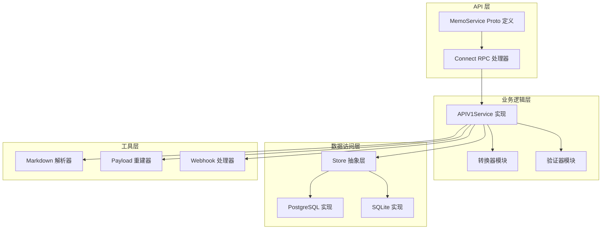
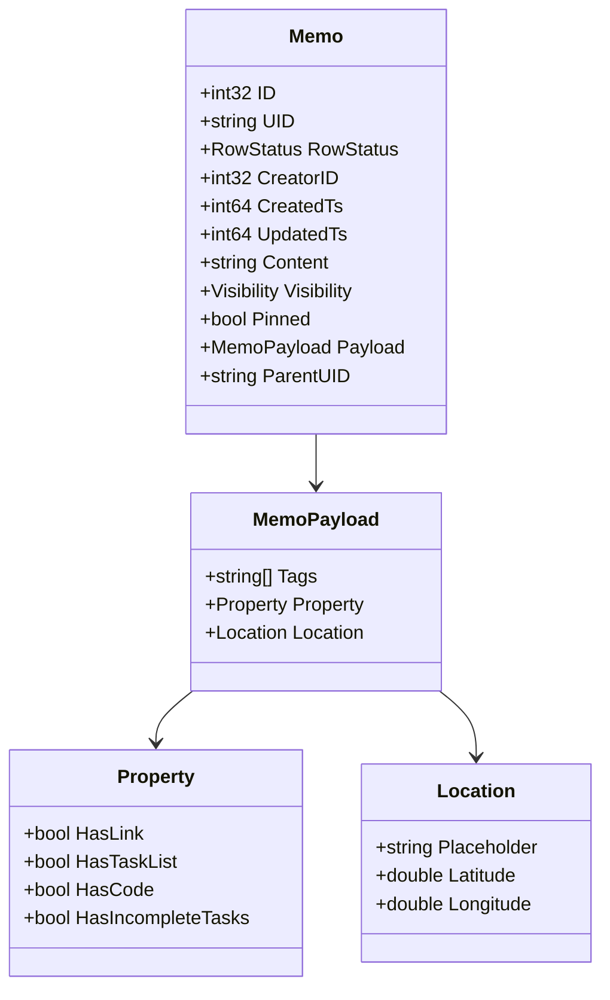
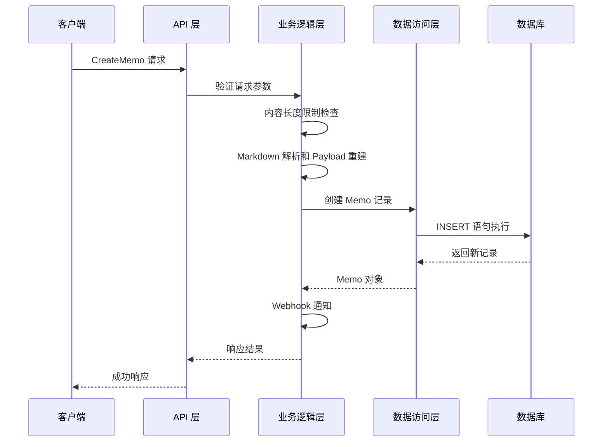
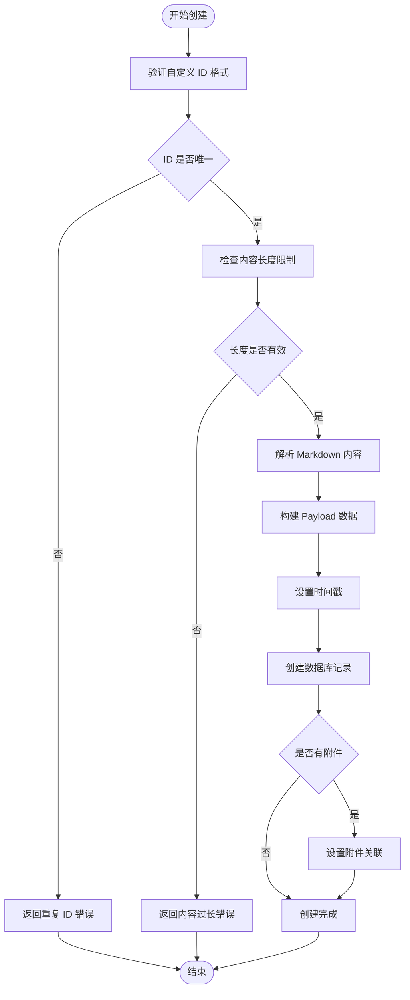
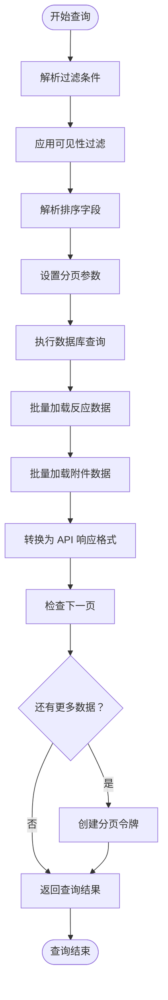
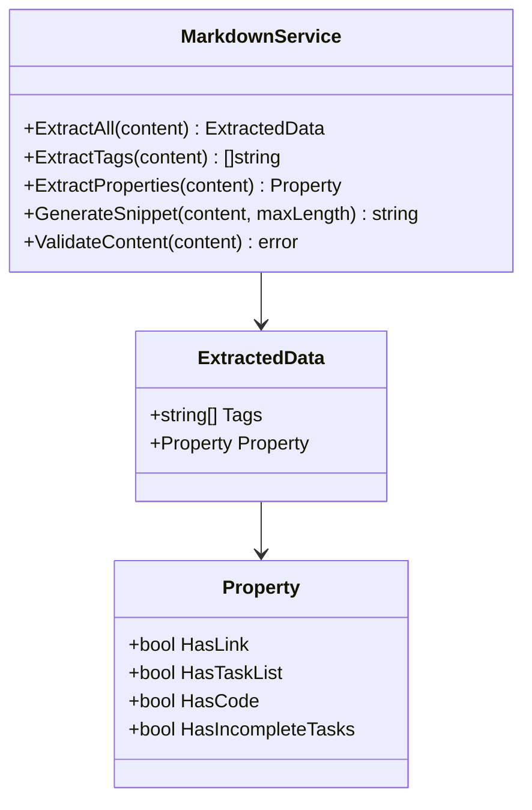
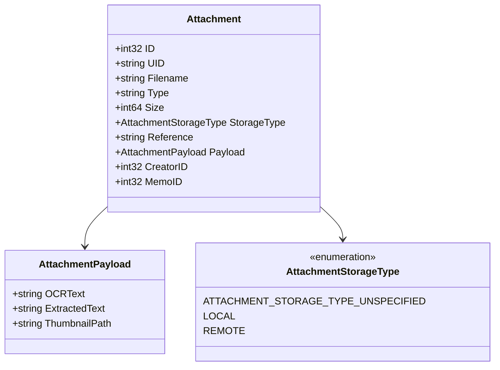
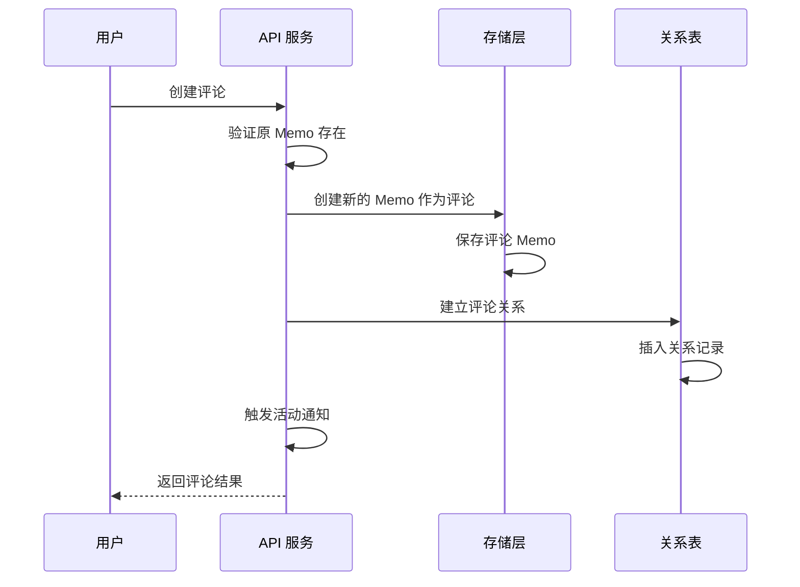
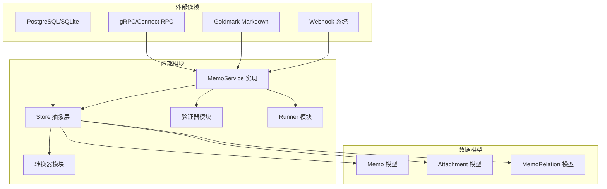
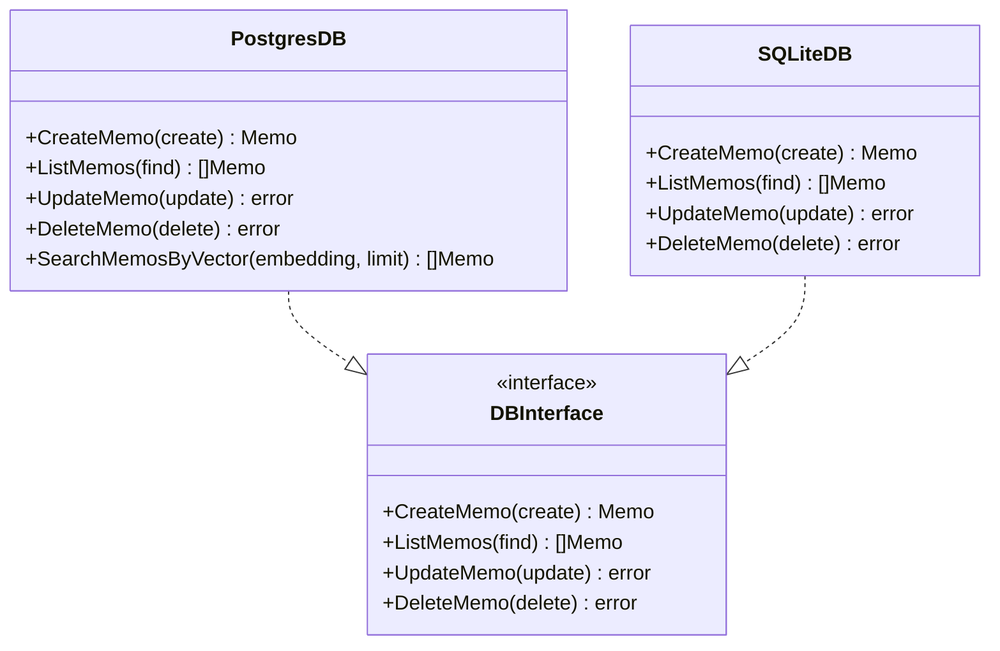

# Memo 服务实现

<cite>
**本文档引用的文件**
- [proto/api/v1/memo_service.proto](file://proto/api/v1/memo_service.proto)
- [server/router/api/v1/memo_service.go](file://server/router/api/v1/memo_service.go)
- [server/router/api/v1/memo_service_converter.go](file://server/router/api/v1/memo_service_converter.go)
- [store/memo.go](file://store/memo.go)
- [store/db/postgres/memo.go](file://store/db/postgres/memo.go)
- [server/runner/memopayload/runner.go](file://server/runner/memopayload/runner.go)
- [plugin/markdown/markdown.go](file://plugin/markdown/markdown.go)
- [store/memo_relation.go](file://store/memo_relation.go)
- [store/db/postgres/memo_relation.go](file://store/db/postgres/memo_relation.go)
- [store/attachment.go](file://store/attachment.go)
- [store/db/postgres/attachment.go](file://store/db/postgres/attachment.go)
</cite>

## 目录
1. [简介](#简介)
2. [项目结构](#项目结构)
3. [核心组件](#核心组件)
4. [架构概览](#架构概览)
5. [详细组件分析](#详细组件分析)
6. [依赖关系分析](#依赖关系分析)
7. [性能考虑](#性能考虑)
8. [故障排除指南](#故障排除指南)
9. [结论](#结论)

## 简介

Memo 服务是 Memos 应用程序的核心数据服务，负责管理用户的笔记（Memo）生命周期。该服务实现了完整的 CRUD 操作，包括笔记的创建、读取、更新、删除，并提供了高级功能如内容验证、可见性控制、附件管理、评论系统和关系管理。

Memo 服务基于 Connect RPC 协议构建，支持 HTTP/2 和 gRPC 兼容的 API 接口。服务采用分层架构设计，通过 Store 抽象层与数据库交互，使用 Markdown 解析器进行内容处理，并集成了位置信息处理和 Webhook 通知功能。

## 项目结构

Memo 服务的实现分布在多个层次中：

**图表来源**
- [proto/api/v1/memo_service.proto](file://proto/api/v1/memo_service.proto#L17-L106)
- [server/router/api/v1/memo_service.go](file://server/router/api/v1/memo_service.go#L24-L145)

**章节来源**
- [proto/api/v1/memo_service.proto](file://proto/api/v1/memo_service.proto#L1-L512)
- [server/router/api/v1/memo_service.go](file://server/router/api/v1/memo_service.go#L1-L831)

## 核心组件

### Memo 数据模型

Memo 服务的核心数据模型定义了笔记的基本属性和元数据：

**图表来源**
- [store/memo.go](file://store/memo.go#L35-L55)
- [proto/api/v1/memo_service.proto](file://proto/api/v1/memo_service.proto#L224-L242)

### 可见性控制系统

Memo 服务支持三种可见性级别：

- **PRIVATE（私有）**：仅创建者可查看
- **PROTECTED（受保护）**：已认证用户可查看
- **PUBLIC（公开）**：所有用户可查看

系统还支持实例级别的可见性限制配置，管理员可以禁用公共笔记功能。

**章节来源**
- [store/memo.go](file://store/memo.go#L12-L33)
- [server/router/api/v1/memo_service.go](file://server/router/api/v1/memo_service.go#L77-L79)

## 架构概览

Memo 服务采用分层架构设计，确保关注点分离和代码可维护性：

**图表来源**
- [server/router/api/v1/memo_service.go](file://server/router/api/v1/memo_service.go#L24-L145)
- [server/runner/memopayload/runner.go](file://server/runner/memopayload/runner.go#L74-L88)

## 详细组件分析

### CRUD 操作实现

#### 创建 Memo

创建操作包含完整的输入验证和数据处理流程：

**图表来源**
- [server/router/api/v1/memo_service.go](file://server/router/api/v1/memo_service.go#L24-L145)
- [server/runner/memopayload/runner.go](file://server/runner/memopayload/runner.go#L74-L88)

#### 列表查询与过滤

Memo 列表查询支持复杂的过滤、排序和分页机制：

**图表来源**
- [server/router/api/v1/memo_service.go](file://server/router/api/v1/memo_service.go#L147-L287)

#### 更新操作

更新操作支持部分字段更新，使用 FieldMask 指定要修改的字段：

**章节来源**
- [server/router/api/v1/memo_service.go](file://server/router/api/v1/memo_service.go#L337-L476)

### 内容验证与处理

#### Markdown 解析器

Memo 服务使用专门的 Markdown 解析器提取内容元数据：

**图表来源**
- [plugin/markdown/markdown.go](file://plugin/markdown/markdown.go#L20-L54)
- [plugin/markdown/markdown.go](file://plugin/markdown/markdown.go#L288-L341)

#### Payload 重建机制

Payload 重建器负责从 Markdown 内容中提取标签、属性和摘要信息：

**章节来源**
- [server/runner/memopayload/runner.go](file://server/runner/memopayload/runner.go#L74-L88)
- [plugin/markdown/markdown.go](file://plugin/markdown/markdown.go#L141-L181)

### 附件管理系统

Memo 服务支持多种类型的附件管理：

**图表来源**
- [store/attachment.go](file://store/attachment.go#L15-L49)
- [store/attachment.go](file://store/attachment.go#L67-L79)

### 评论系统实现

Memo 服务支持嵌套的评论功能，评论本身也是特殊的 Memo：

**图表来源**
- [server/router/api/v1/memo_service.go](file://server/router/api/v1/memo_service.go#L546-L615)

**章节来源**
- [store/memo_relation.go](file://store/memo_relation.go#L9-L14)
- [server/router/api/v1/memo_service.go](file://server/router/api/v1/memo_service.go#L546-L615)

### 关系管理

Memo 服务支持多种类型的关系：

- **REFERENCE（引用）**：普通引用关系
- **COMMENT（评论）**：嵌套评论关系

**章节来源**
- [store/memo_relation.go](file://store/memo_relation.go#L16-L27)
- [store/db/postgres/memo_relation.go](file://store/db/postgres/memo_relation.go#L41-L114)

## 依赖关系分析

Memo 服务的依赖关系展现了清晰的分层架构：

**图表来源**
- [server/router/api/v1/memo_service.go](file://server/router/api/v1/memo_service.go#L1-L22)
- [store/memo.go](file://store/memo.go#L1-L10)

### 数据库层实现

Memo 服务支持 PostgreSQL 和 SQLite 两种数据库后端：

**图表来源**
- [store/db/postgres/memo.go](file://store/db/postgres/memo.go#L16-L49)
- [store/db/postgres/memo.go](file://store/db/postgres/memo.go#L51-L197)

**章节来源**
- [store/db/postgres/memo.go](file://store/db/postgres/memo.go#L1-L357)
- [store/db/postgres/attachment.go](file://store/db/postgres/attachment.go#L1-L290)

## 性能考虑

### 查询优化

Memo 服务在查询层面采用了多项优化策略：

1. **批量数据加载**：使用映射表批量加载反应和附件数据
2. **分页机制**：支持高效的分页查询，避免一次性加载大量数据
3. **索引优化**：数据库层使用适当的索引提高查询性能
4. **缓存策略**：结合 Redis 缓存提升热点数据访问速度

### 内存管理

Payload 重建器采用批处理模式避免内存溢出：

- **批量大小**：默认 100 条记录一批
- **增量处理**：逐批处理，减少内存峰值
- **错误恢复**：单条记录失败不影响整体进程

### 并发控制

服务实现了完善的并发控制机制：

- **连接池管理**：合理配置数据库连接池
- **超时控制**：设置合理的请求超时时间
- **资源清理**：确保资源正确释放

## 故障排除指南

### 常见错误类型

1. **认证错误**：未登录或会话失效
2. **权限错误**：无权访问目标资源
3. **数据验证错误**：输入数据格式不正确
4. **数据库错误**：约束冲突或连接问题

### 调试建议

1. **启用详细日志**：检查服务端日志获取错误详情
2. **验证输入数据**：确认请求参数符合 API 规范
3. **检查数据库状态**：验证数据库连接和表结构
4. **监控资源使用**：观察内存和 CPU 使用情况

### 性能诊断

1. **慢查询分析**：使用数据库慢查询日志
2. **内存泄漏检测**：使用 Go 的 pprof 工具
3. **网络延迟测试**：测量 API 响应时间
4. **并发压力测试**：模拟高并发场景

**章节来源**
- [server/router/api/v1/memo_service.go](file://server/router/api/v1/memo_service.go#L24-L145)
- [server/router/api/v1/memo_service.go](file://server/router/api/v1/memo_service.go#L337-L476)

## 结论

Memo 服务是一个功能完整、架构清晰的笔记管理服务。它成功地实现了以下关键特性：

1. **完整的 CRUD 支持**：提供标准的笔记生命周期管理
2. **智能内容处理**：集成 Markdown 解析和自动元数据提取
3. **灵活的权限控制**：支持多级可见性和细粒度访问控制
4. **丰富的扩展功能**：包括附件管理、评论系统和关系管理
5. **高性能设计**：采用批处理、缓存和优化查询策略

该服务的设计充分考虑了可扩展性和可维护性，为 Memos 应用提供了坚实的技术基础。通过合理的分层架构和模块化设计，服务能够轻松适应未来的需求变化和技术演进。