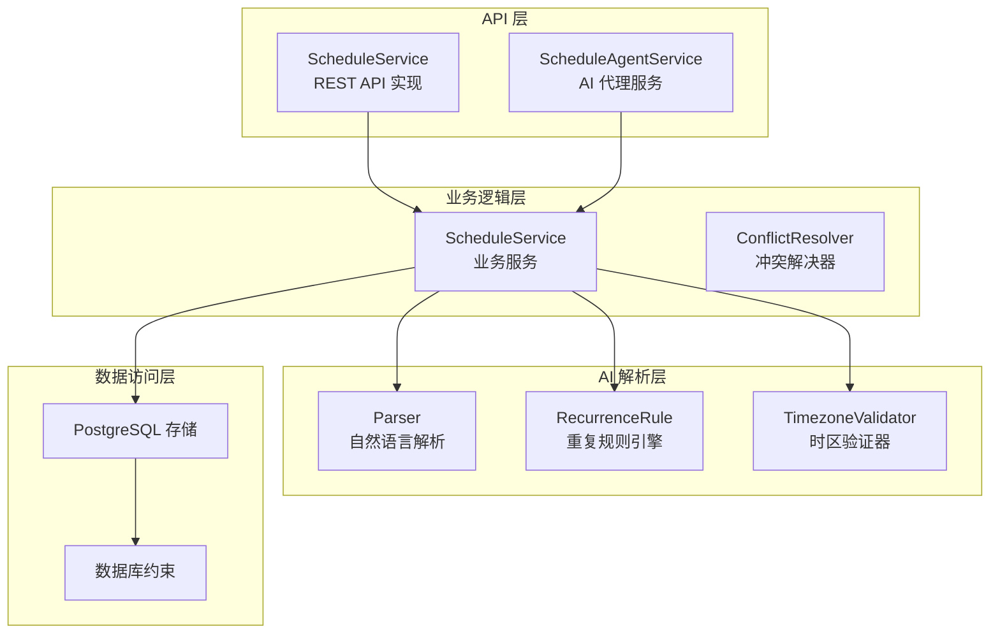
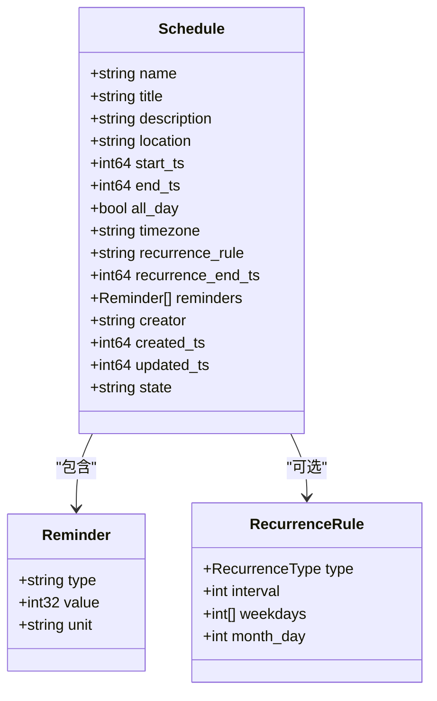
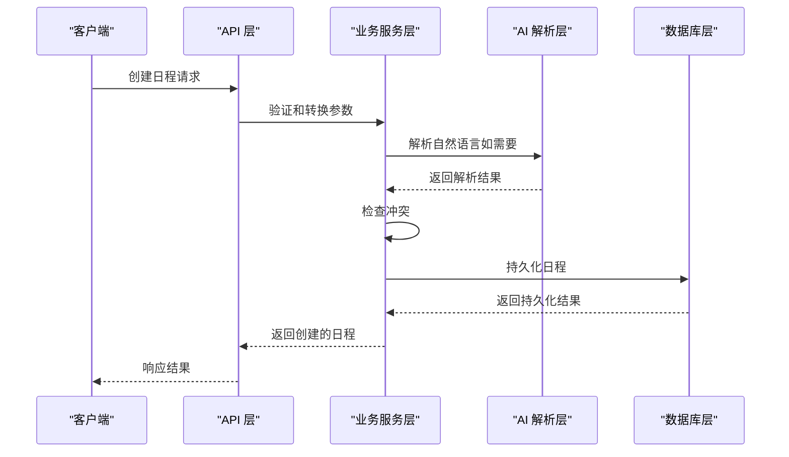
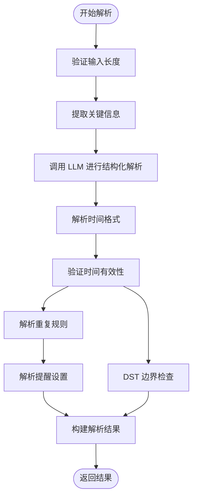
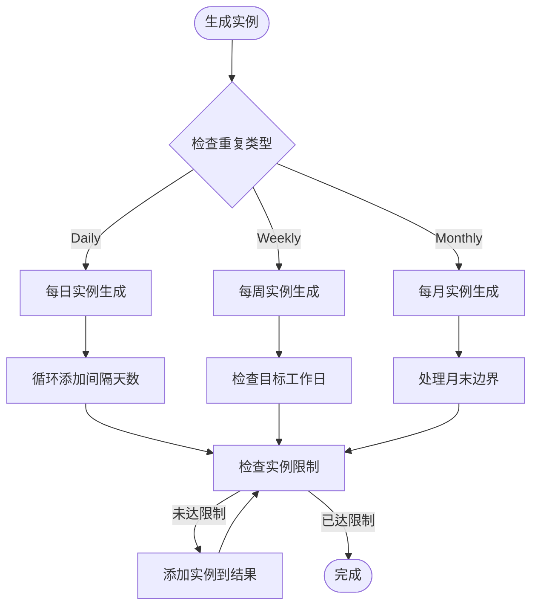
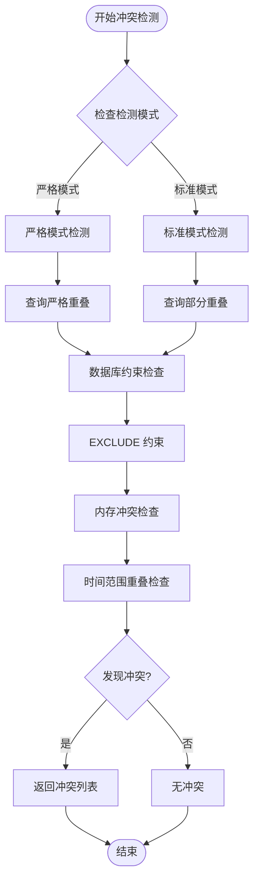
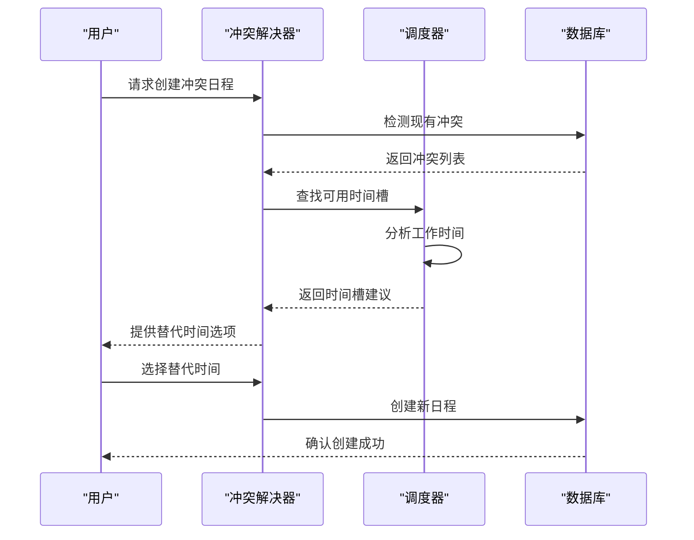
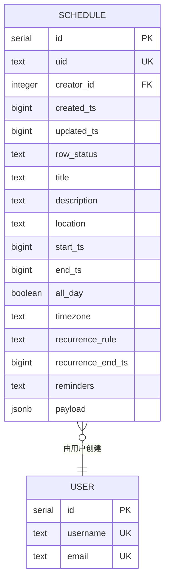
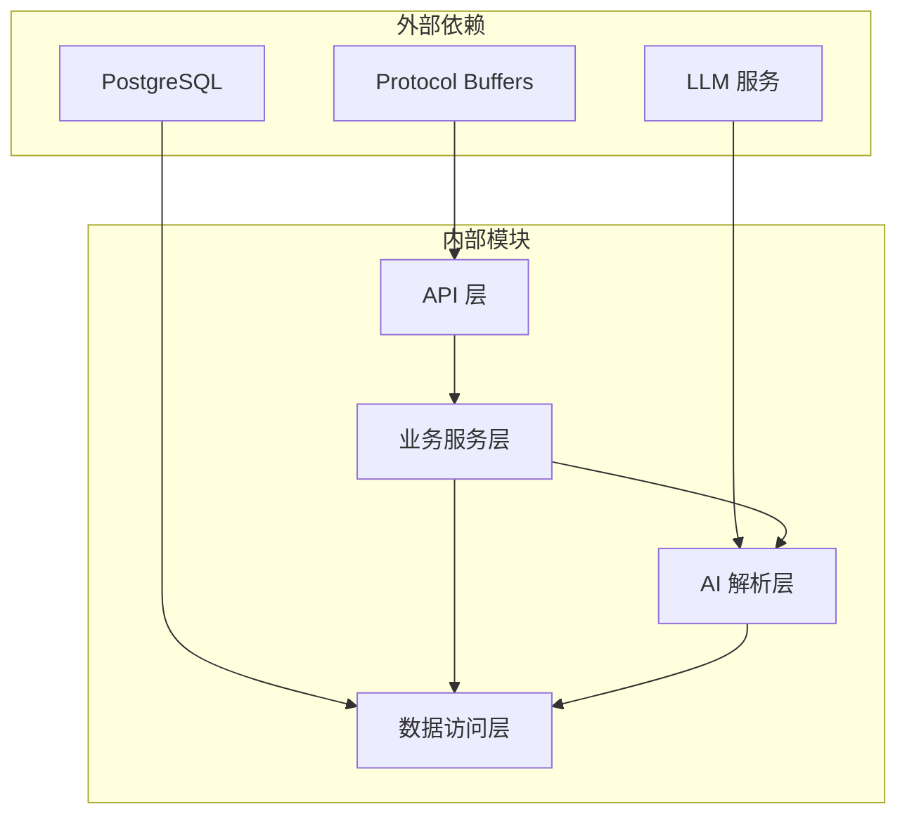
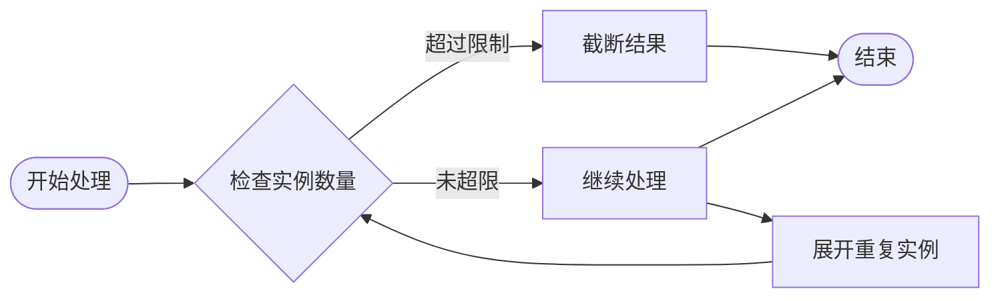

# Schedule 服务实现

<cite>
**本文档引用的文件**
- [schedule_service.proto](file://proto/api/v1/schedule_service.proto)
- [schedule_service.go](file://server/router/api/v1/schedule_service.go)
- [service.go](file://server/service/schedule/service.go)
- [parser.go](file://plugin/ai/schedule/parser.go)
- [recurrence.go](file://plugin/ai/schedule/recurrence.go)
- [helpers.go](file://plugin/ai/schedule/helpers.go)
- [conflict_resolver.go](file://server/service/schedule/conflict_resolver.go)
- [schedule.go](file://store/db/postgres/schedule.go)
- [timezone_validator.go](file://plugin/ai/schedule/timezone_validator.go)
- [schedule_agent_service.go](file://server/router/api/v1/schedule_agent_service.go)
- [LATEST.sql](file://store/migration/postgres/LATEST.sql)
</cite>

## 目录
1. [简介](#简介)
2. [项目结构](#项目结构)
3. [核心组件](#核心组件)
4. [架构概览](#架构概览)
5. [详细组件分析](#详细组件分析)
6. [依赖关系分析](#依赖关系分析)
7. [性能考虑](#性能考虑)
8. [故障排除指南](#故障排除指南)
9. [结论](#结论)

## 简介

Schedule 服务是 Memos 系统中的核心日程管理模块，提供了完整的日程生命周期管理功能。该服务实现了从自然语言解析、日程创建、查询、更新、删除到冲突检测的完整流程，支持复杂的重复规则、提醒机制和时区处理。

该服务采用分层架构设计，通过 Protocol Buffers 定义清晰的 API 接口，结合 PostgreSQL 的原子约束确保数据一致性，并利用 AI 能力提供智能的日程解析和冲突解决建议。

## 项目结构

Schedule 服务的实现分布在多个层次中，形成了清晰的分层架构：



**图表来源**
- [schedule_service.go](file://server/router/api/v1/schedule_service.go#L24-L30)
- [service.go](file://server/service/schedule/service.go#L70-L86)
- [parser.go](file://plugin/ai/schedule/parser.go#L22-L26)

**章节来源**
- [schedule_service.proto](file://proto/api/v1/schedule_service.proto#L13-L66)
- [schedule_service.go](file://server/router/api/v1/schedule_service.go#L1-L800)

## 核心组件

### API 接口定义

Schedule 服务通过 Protocol Buffers 定义了完整的 API 接口，包括：

- **CRUD 操作**：创建、查询、更新、删除日程
- **冲突检测**：检查时间冲突
- **自然语言解析**：将自然语言转换为结构化日程
- **批量操作**：支持分页查询和实例展开

### 数据模型



**图表来源**
- [schedule_service.proto](file://proto/api/v1/schedule_service.proto#L69-L86)
- [schedule_service.proto](file://proto/api/v1/schedule_service.proto#L88-L93)

### 业务服务层

业务服务层提供了核心的业务逻辑实现，包括：

- **日程创建**：验证输入、检查冲突、持久化存储
- **日程查询**：支持时间范围查询、重复规则展开
- **冲突检测**：基于数据库约束和内存算法的双重检测
- **冲突解决**：提供智能的时间槽建议

**章节来源**
- [service.go](file://server/service/schedule/service.go#L194-L302)
- [service.go](file://server/service/schedule/service.go#L304-L401)

## 架构概览

Schedule 服务采用了典型的三层架构设计，确保了良好的关注点分离和可维护性：



**图表来源**
- [schedule_service.go](file://server/router/api/v1/schedule_service.go#L178-L212)
- [parser.go](file://plugin/ai/schedule/parser.go#L63-L76)

## 详细组件分析

### 自然语言解析器

自然语言解析器是 Schedule 服务的核心创新之一，它能够将用户的自然语言描述转换为结构化的日程数据：

#### 解析流程



**图表来源**
- [parser.go](file://plugin/ai/schedule/parser.go#L63-L76)
- [parser.go](file://plugin/ai/schedule/parser.go#L91-L348)

#### 时间处理策略

解析器采用了严格的 UTC 时间处理策略，确保跨时区的一致性：

- **统一时间基准**：所有时间都转换为 UTC 存储
- **时区验证**：使用 `TimezoneValidator` 处理 DST 边界情况
- **相对时间计算**：基于用户本地时间进行相对日期计算

**章节来源**
- [parser.go](file://plugin/ai/schedule/parser.go#L95-L254)
- [timezone_validator.go](file://plugin/ai/schedule/timezone_validator.go#L57-L96)

### 重复规则引擎

重复规则引擎支持三种基本的重复类型：

#### 支持的重复类型

| 类型 | 描述 | 示例 |
|------|------|------|
| daily | 每日重复 | "每天"、"每3天" |
| weekly | 每周重复 | "每周"、"每周一"、"每2周" |
| monthly | 每月重复 | "每月15号" |

#### 实例生成算法



**图表来源**
- [recurrence.go](file://plugin/ai/schedule/recurrence.go#L165-L193)
- [recurrence.go](file://plugin/ai/schedule/recurrence.go#L196-L215)

**章节来源**
- [recurrence.go](file://plugin/ai/schedule/recurrence.go#L77-L149)
- [recurrence.go](file://plugin/ai/schedule/recurrence.go#L151-L282)

### 冲突检测与解决

冲突检测是 Schedule 服务的关键特性，确保用户不会创建重叠的日程安排。

#### 冲突检测策略



**图表来源**
- [schedule_service.go](file://server/router/api/v1/schedule_service.go#L752-L793)
- [service.go](file://server/service/schedule/service.go#L426-L480)

#### 智能冲突解决

当检测到冲突时，系统会提供智能的时间槽建议：



**图表来源**
- [conflict_resolver.go](file://server/service/schedule/conflict_resolver.go#L46-L97)
- [conflict_resolver.go](file://server/service/schedule/conflict_resolver.go#L114-L165)

**章节来源**
- [conflict_resolver.go](file://server/service/schedule/conflict_resolver.go#L13-L44)
- [conflict_resolver.go](file://server/service/schedule/conflict_resolver.go#L254-L326)

### 数据持久化层

数据库层采用了 PostgreSQL 的高级特性来确保数据一致性和性能：

#### 数据库约束



**图表来源**
- [LATEST.sql](file://store/migration/postgres/LATEST.sql#L165-L192)

#### 原子冲突检测

系统使用 PostgreSQL 的 EXCLUDE 约束实现原子级别的冲突检测：

```sql
-- 原子冲突检测约束
EXCLUDE USING gist (
    creator_id WITH =,
    tsrange(start_ts, end_ts, '[]') WITH &&
) WHERE (row_status = 'NORMAL');
```

**章节来源**
- [schedule.go](file://store/db/postgres/schedule.go#L199-L327)

## 依赖关系分析

Schedule 服务的依赖关系体现了清晰的分层架构：



**图表来源**
- [schedule_service.go](file://server/router/api/v1/schedule_service.go#L3-L22)
- [service.go](file://server/service/schedule/service.go#L13-L26)

### 关键依赖关系

| 组件 | 主要依赖 | 用途 |
|------|----------|------|
| API 层 | Protocol Buffers, LLM 服务 | 提供 REST API 接口 |
| 业务服务层 | 存储接口, AI 解析器 | 实现核心业务逻辑 |
| AI 解析层 | LLM 服务, 时区验证器 | 处理自然语言解析 |
| 数据访问层 | PostgreSQL, 数据库约束 | 持久化数据和约束 |

**章节来源**
- [schedule_service.go](file://server/router/api/v1/schedule_service.go#L1-L30)
- [service.go](file://server/service/schedule/service.go#L70-L86)

## 性能考虑

### 查询优化

Schedule 服务采用了多种查询优化策略：

1. **索引优化**：为常用查询字段建立复合索引
2. **分页查询**：限制单次查询返回的数据量
3. **实例展开限制**：防止重复日程展开导致的性能问题

### 内存管理



**图表来源**
- [schedule_service.go](file://server/router/api/v1/schedule_service.go#L277-L285)

### 缓存策略

系统采用了多级缓存策略：

- **内存缓存**：用于频繁访问的配置和元数据
- **数据库缓存**：利用 PostgreSQL 的查询缓存机制
- **应用层缓存**：对热点数据进行缓存

## 故障排除指南

### 常见问题及解决方案

#### 冲突检测失败

**问题**：创建日程时出现冲突错误
**解决方案**：
1. 检查是否存在重复的日程
2. 验证时间范围是否正确
3. 确认时区设置是否正确

#### 自然语言解析错误

**问题**：AI 解析器无法正确解析用户输入
**解决方案**：
1. 检查输入格式是否符合预期
2. 验证时区设置
3. 简化自然语言表达

#### 性能问题

**问题**：查询响应缓慢
**解决方案**：
1. 检查数据库索引是否完整
2. 优化查询条件
3. 减少查询范围

**章节来源**
- [schedule_service.go](file://server/router/api/v1/schedule_service.go#L752-L793)
- [service.go](file://server/service/schedule/service.go#L548-L639)

## 结论

Schedule 服务实现了完整的日程管理功能，具有以下特点：

### 技术优势

1. **完整的 API 生态**：基于 Protocol Buffers 的标准化接口
2. **智能解析能力**：利用 AI 技术处理自然语言输入
3. **强一致性保证**：通过数据库约束确保数据完整性
4. **灵活的扩展性**：支持重复规则、提醒机制等高级功能

### 架构特色

1. **分层设计**：清晰的关注点分离
2. **模块化组件**：独立的功能模块便于维护
3. **性能优化**：多级缓存和查询优化
4. **错误处理**：完善的异常处理和恢复机制

### 应用场景

- **个人日程管理**：简单的日程创建和提醒
- **团队协作**：共享日历和会议安排
- **智能助手**：通过自然语言快速创建日程
- **冲突解决**：智能推荐替代时间槽

该服务为 Memos 系统提供了强大的日程管理能力，为用户提供了流畅的日程体验。