# User 服务实现

<cite>
**本文档引用的文件**
- [user_service.proto](file://proto/api/v1/user_service.proto)
- [user_service.go](file://server/router/api/v1/user_service.go)
- [user_service_stats.go](file://server/router/api/v1/user_service_stats.go)
- [authenticator.go](file://server/auth/authenticator.go)
- [token.go](file://server/auth/token.go)
- [auth_service.go](file://server/router/api/v1/auth_service.go)
- [connect_interceptors.go](file://server/router/api/v1/connect_interceptors.go)
- [user.go](file://store/user.go)
- [user_setting.go](file://store/user_setting.go)
- [postgres_user.go](file://store/db/postgres/user.go)
- [sqlite_user.go](file://store/db/sqlite/user.go)
</cite>

## 目录
1. [简介](#简介)
2. [项目结构](#项目结构)
3. [核心组件](#核心组件)
4. [架构概览](#架构概览)
5. [详细组件分析](#详细组件分析)
6. [依赖关系分析](#依赖关系分析)
7. [性能考虑](#性能考虑)
8. [故障排除指南](#故障排除指南)
9. [结论](#结论)

## 简介

User 服务是 Memos 应用程序中的核心用户管理服务，负责处理用户注册、登录、个人信息管理、角色权限控制等所有用户相关功能。该服务实现了完整的用户生命周期管理，包括用户认证、会话管理、密码处理和安全机制。

本服务基于 gRPC 和 Connect 协议构建，提供了 RESTful 风格的 API 接口，支持多种认证方式（JWT 访问令牌、刷新令牌、个人访问令牌）和细粒度的权限控制。

## 项目结构

User 服务在代码库中采用分层架构设计，主要分布在以下目录：

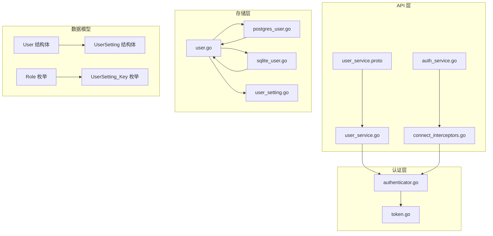

**图表来源**
- [user_service.proto](file://proto/api/v1/user_service.proto#L1-L677)
- [user_service.go](file://server/router/api/v1/user_service.go#L1-L1443)
- [authenticator.go](file://server/auth/authenticator.go#L1-L166)

**章节来源**
- [user_service.proto](file://proto/api/v1/user_service.proto#L1-L677)
- [user_service.go](file://server/router/api/v1/user_service.go#L1-L1443)

## 核心组件

### 用户实体模型

User 服务的核心数据模型定义了用户的基本属性和状态：

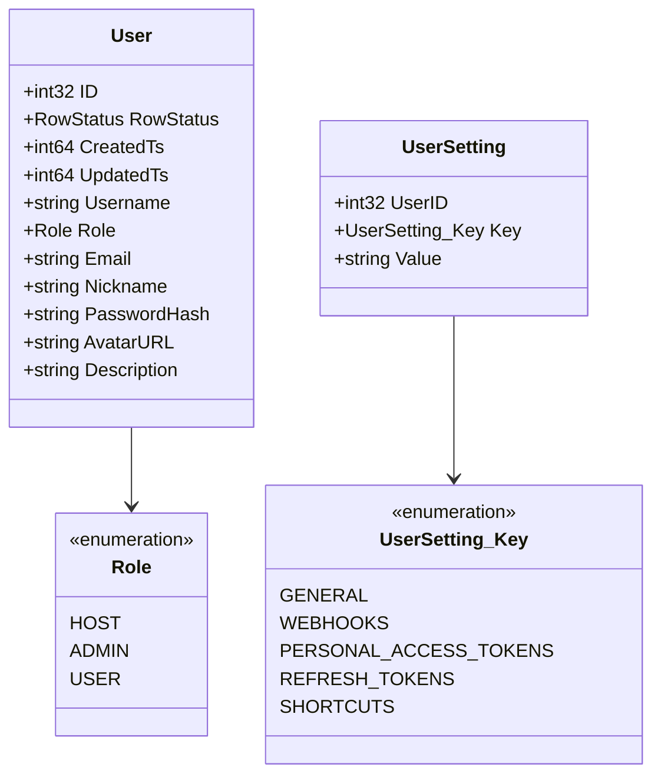

**图表来源**
- [user.go](file://store/user.go#L44-L60)
- [user_setting.go](file://store/user_setting.go#L13-L17)

### 认证与授权机制

系统支持三种主要的认证方式：

1. **JWT 访问令牌**：短期有效的令牌（15 分钟），用于 API 访问
2. **刷新令牌**：长期有效的令牌（30 天），用于获取新的访问令牌
3. **个人访问令牌（PAT）**：用于程序化访问的长期令牌

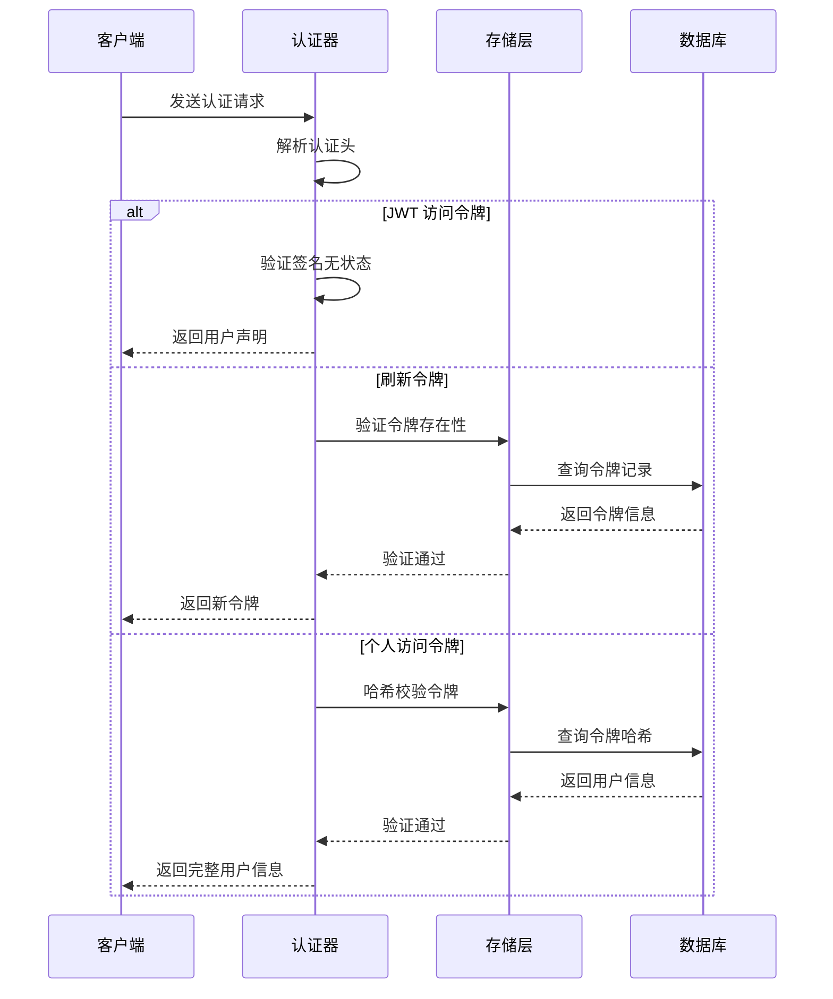

**图表来源**
- [authenticator.go](file://server/auth/authenticator.go#L136-L165)
- [token.go](file://server/auth/token.go#L133-L187)

**章节来源**
- [user.go](file://store/user.go#L1-L162)
- [user_setting.go](file://store/user_setting.go#L1-L487)
- [authenticator.go](file://server/auth/authenticator.go#L1-L166)
- [token.go](file://server/auth/token.go#L1-L250)

## 架构概览

User 服务采用分层架构，确保关注点分离和模块化设计：

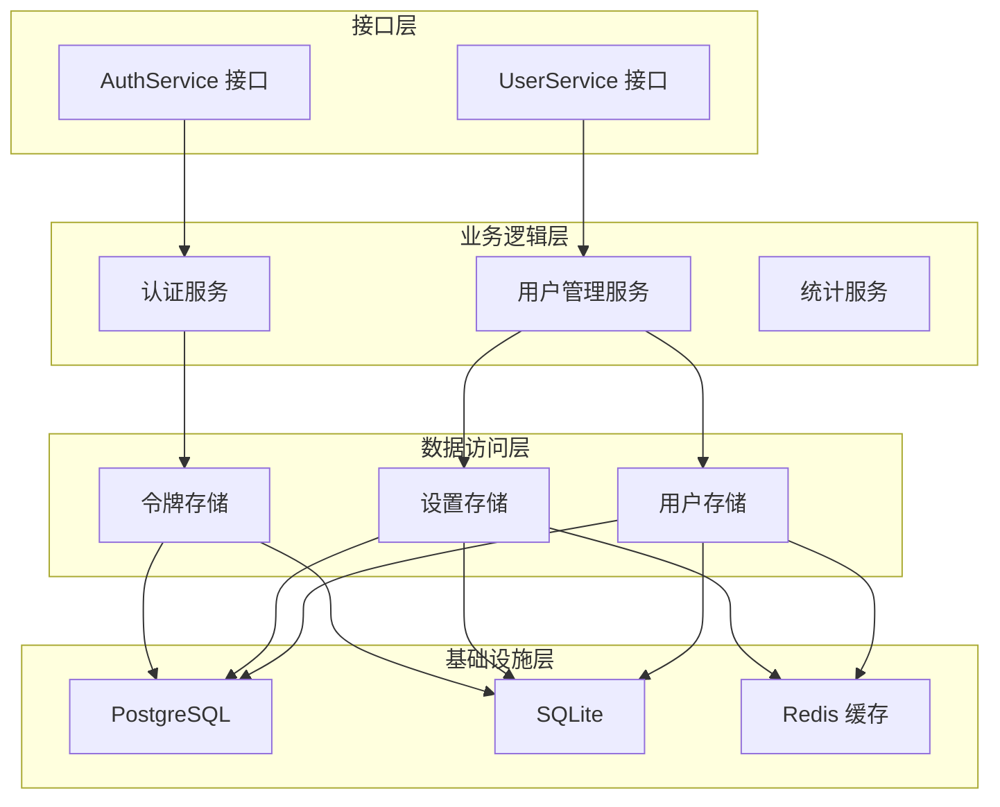

**图表来源**
- [user_service.proto](file://proto/api/v1/user_service.proto#L16-L159)
- [user_service.go](file://server/router/api/v1/user_service.go#L32-L323)

## 详细组件分析

### 用户管理功能

#### 用户注册流程

用户注册流程支持多种场景：

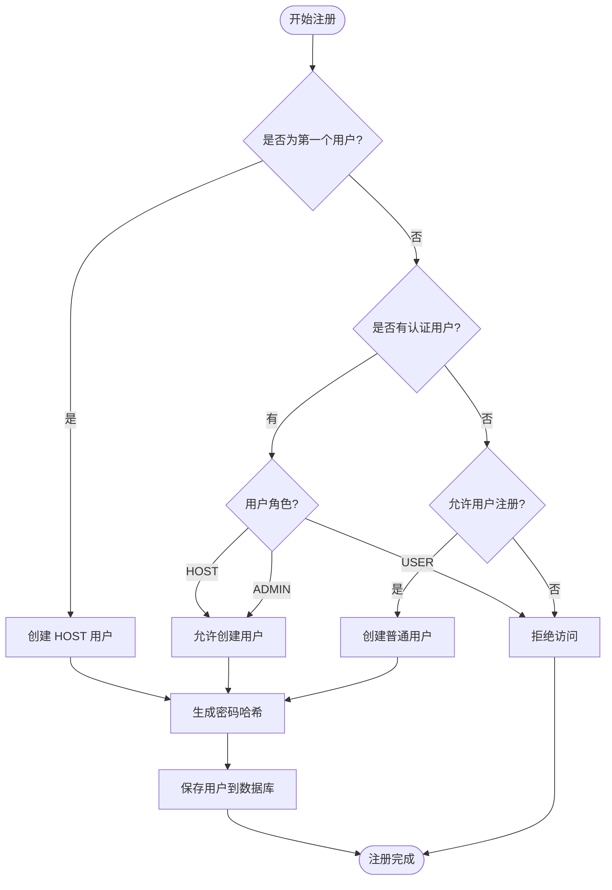

**图表来源**
- [user_service.go](file://server/router/api/v1/user_service.go#L106-L181)

#### 用户信息管理

用户信息更新支持字段级更新和权限控制：

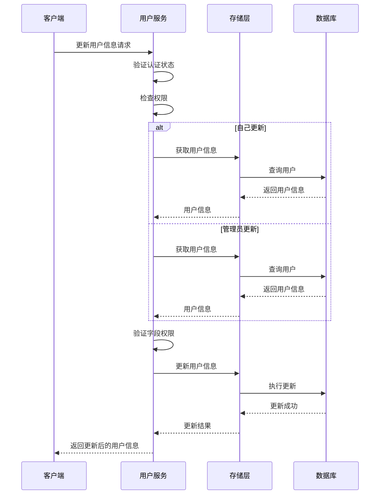

**图表来源**
- [user_service.go](file://server/router/api/v1/user_service.go#L183-L293)

**章节来源**
- [user_service.go](file://server/router/api/v1/user_service.go#L106-L293)

### 权限控制系统

系统实现了多层级的权限控制机制：

| 权限级别 | 角色 | 可执行操作 |
|---------|------|-----------|
| 系统管理员 | HOST | 所有操作，包括删除用户 |
| 管理员 | ADMIN | 用户管理，除删除外的所有操作 |
| 普通用户 | USER | 个人信息管理，仅能修改自己的信息 |

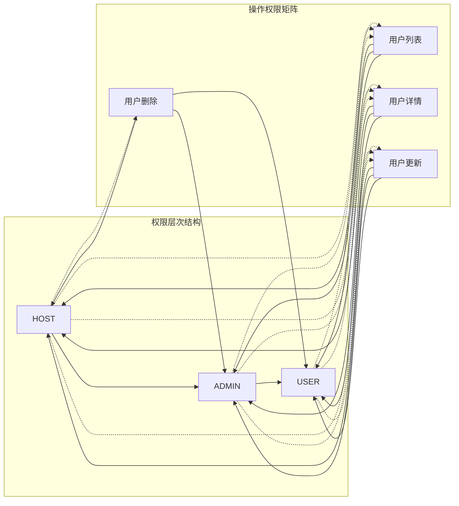

**图表来源**
- [user_service.go](file://server/router/api/v1/user_service.go#L32-L71)
- [user_service.go](file://server/router/api/v1/user_service.go#L183-L293)

**章节来源**
- [user_service.go](file://server/router/api/v1/user_service.go#L32-L71)
- [user_service.go](file://server/router/api/v1/user_service.go#L183-L293)

### 用户设置管理

用户设置系统支持多种配置选项：

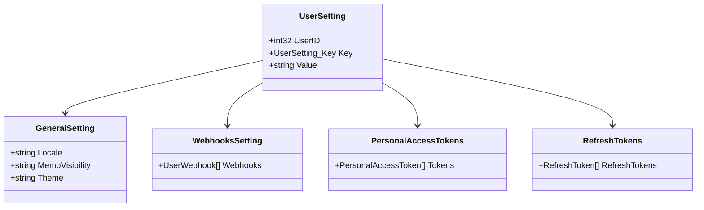

**图表来源**
- [user_setting.go](file://store/user_setting.go#L397-L438)
- [user_service.proto](file://proto/api/v1/user_service.proto#L364-L409)

**章节来源**
- [user_setting.go](file://store/user_setting.go#L1-L487)
- [user_service.proto](file://proto/api/v1/user_service.proto#L364-L409)

### 统计信息收集

系统提供全面的用户统计功能：

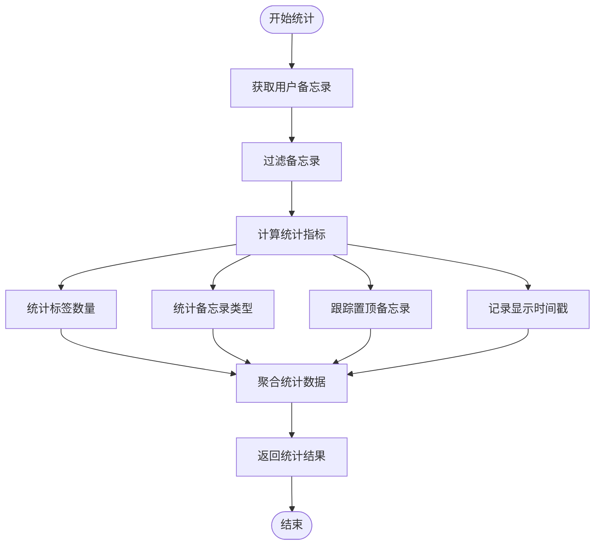

**图表来源**
- [user_service_stats.go](file://server/router/api/v1/user_service_stats.go#L17-L129)

**章节来源**
- [user_service_stats.go](file://server/router/api/v1/user_service_stats.go#L1-L237)

### 通知系统

用户通知系统基于收件箱模式实现：

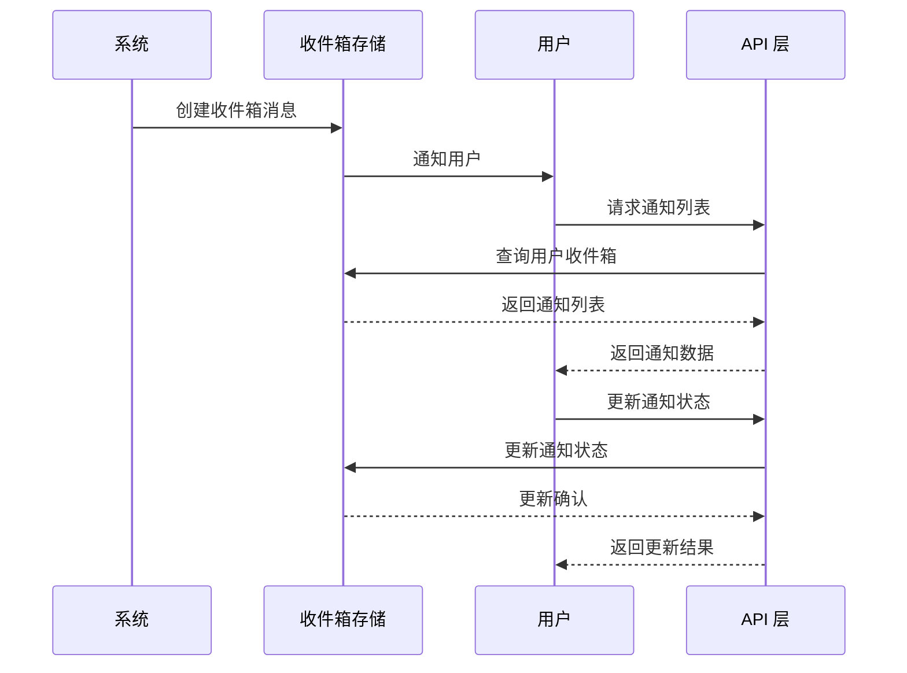

**图表来源**
- [user_service.go](file://server/router/api/v1/user_service.go#L1232-L1389)

**章节来源**
- [user_service.go](file://server/router/api/v1/user_service.go#L1232-L1389)

## 依赖关系分析

### 外部依赖

User 服务依赖以下关键外部组件：

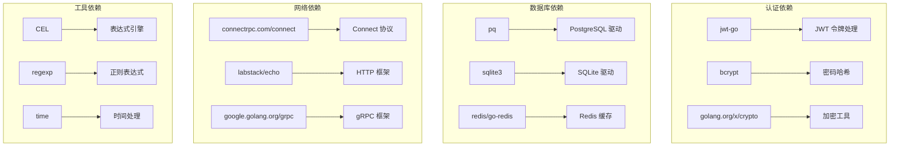

**图表来源**
- [user_service.go](file://server/router/api/v1/user_service.go#L14-L30)
- [authenticator.go](file://server/auth/authenticator.go#L3-L15)

### 内部依赖关系

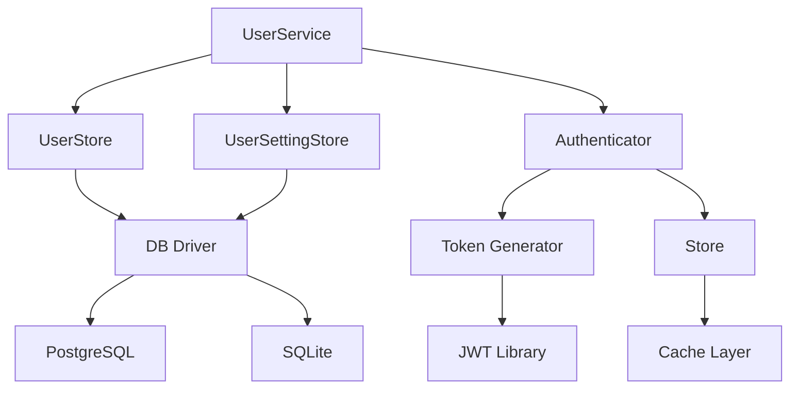

**图表来源**
- [user_service.go](file://server/router/api/v1/user_service.go#L32-L323)
- [authenticator.go](file://server/auth/authenticator.go#L26-L37)

**章节来源**
- [user_service.go](file://server/router/api/v1/user_service.go#L1-L1443)
- [authenticator.go](file://server/auth/authenticator.go#L1-L166)

## 性能考虑

### 缓存策略

系统实现了多层次缓存机制以提升性能：

1. **用户信息缓存**：使用 Redis 缓存用户信息，减少数据库查询
2. **设置缓存**：缓存用户设置，避免重复解析 JSON
3. **令牌缓存**：缓存令牌验证结果，减少重复计算

### 查询优化

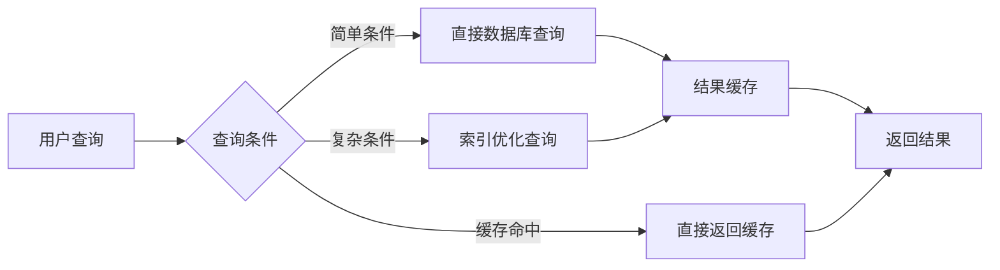

### 并发处理

系统支持高并发访问：
- 使用连接池管理数据库连接
- 实现读写分离
- 提供乐观锁机制防止数据竞争

## 故障排除指南

### 常见问题及解决方案

| 问题类型 | 症状 | 可能原因 | 解决方案 |
|---------|------|---------|---------|
| 认证失败 | 401 未认证错误 | 令牌过期或无效 | 重新登录获取新令牌 |
| 权限不足 | 403 权限拒绝 | 用户角色不匹配 | 检查用户权限或联系管理员 |
| 数据库连接 | 连接超时 | 数据库负载过高 | 检查数据库连接池配置 |
| 密码错误 | 密码验证失败 | 密码哈希不匹配 | 确认密码输入正确 |

### 调试工具

1. **日志分析**：查看认证拦截器的日志输出
2. **性能监控**：监控数据库查询时间和缓存命中率
3. **令牌调试**：使用 JWT 解码工具检查令牌内容

**章节来源**
- [connect_interceptors.go](file://server/router/api/v1/connect_interceptors.go#L119-L158)
- [authenticator.go](file://server/auth/authenticator.go#L136-L165)

## 结论

User 服务实现了完整的用户管理功能，具有以下特点：

1. **安全性**：支持多种认证方式，实现细粒度权限控制
2. **可扩展性**：模块化设计，易于添加新功能
3. **性能**：多层缓存和优化查询，支持高并发访问
4. **可靠性**：完善的错误处理和恢复机制

该服务为 Memos 应用提供了坚实的基础，支持从个人使用到企业级部署的各种场景需求。