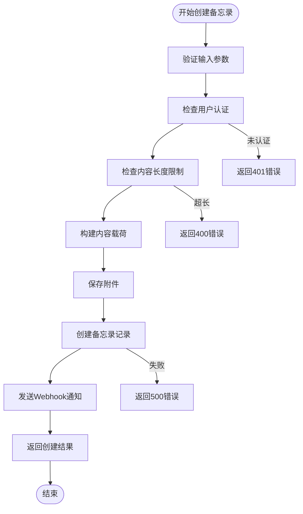

# 具体服务实现

<cite>
**本文档引用的文件**
- [memo_service.proto](file://proto/api/v1/memo_service.proto)
- [user_service.proto](file://proto/api/v1/user_service.proto)
- [schedule_service.proto](file://proto/api/v1/schedule_service.proto)
- [ai_service.proto](file://proto/api/v1/ai_service.proto)
- [attachment_service.proto](file://proto/api/v1/attachment_service.proto)
- [memo_service.go](file://server/router/api/v1/memo_service.go)
- [user_service.go](file://server/router/api/v1/user_service.go)
- [schedule_service.go](file://server/router/api/v1/schedule_service.go)
- [ai_service.go](file://server/router/api/v1/ai_service.go)
- [attachment_service.go](file://server/router/api/v1/attachment_service.go)
</cite>

## 目录
1. [简介](#简介)
2. [项目结构](#项目结构)
3. [核心组件](#核心组件)
4. [架构概览](#架构概览)
5. [详细组件分析](#详细组件分析)
6. [依赖分析](#依赖分析)
7. [性能考虑](#性能考虑)
8. [故障排除指南](#故障排除指南)
9. [结论](#结论)

## 简介

本文档深入分析 Memos 项目中五个核心服务的具体实现：Memo 服务、User 服务、Schedule 服务、AI 服务和 Attachment 服务。这些服务构成了系统的主要功能模块，提供了笔记管理、用户管理、日程安排、人工智能辅助和附件处理等核心能力。

每个服务都遵循统一的架构模式，采用 Protocol Buffers 定义接口规范，通过 Connect RPC 提供 RESTful 风格的 API 接口。服务层负责业务逻辑处理、权限验证、数据转换和错误处理，确保系统的可维护性和可扩展性。

## 项目结构

项目采用分层架构设计，主要包含以下层次：

**图表来源**
- [memo_service.go](file://server/router/api/v1/memo_service.go#L1-L831)
- [user_service.go](file://server/router/api/v1/user_service.go#L1-L1443)
- [schedule_service.go](file://server/router/api/v1/schedule_service.go#L1-L826)

**章节来源**
- [memo_service.proto](file://proto/api/v1/memo_service.proto#L1-L512)
- [user_service.proto](file://proto/api/v1/user_service.proto#L1-L677)
- [schedule_service.proto](file://proto/api/v1/schedule_service.proto#L1-L166)
- [ai_service.proto](file://proto/api/v1/ai_service.proto#L1-L371)
- [attachment_service.proto](file://proto/api/v1/attachment_service.proto#L1-L151)

## 核心组件

### 服务接口定义

每个服务都通过 Protocol Buffers 定义了完整的接口规范，包括：

**Memo 服务接口**
- 创建、查询、更新、删除备忘录
- 附件管理和关系管理
- 评论和反应功能
- 可见性控制和标签提取

**User 服务接口**
- 用户账户管理
- 设置和配置管理
- 个人访问令牌管理
- Webhook 和通知管理

**Schedule 服务接口**
- 日程事件创建和管理
- 冲突检测和解决
- 递归规则解析
- 自然语言处理

**AI 服务接口**
- 语义搜索和相关性排序
- 标签建议和内容分析
- 对话式 AI 聊天
- 记忆关联检索

**Attachment 服务接口**
- 文件上传和管理
- 存储策略配置
- 缩略图生成
- 外部链接支持

### 数据模型设计

服务使用标准化的数据模型确保数据一致性和完整性：

**图表来源**
- [memo_service.proto](file://proto/api/v1/memo_service.proto#L153-L231)
- [user_service.proto](file://proto/api/v1/user_service.proto#L161-L215)
- [schedule_service.proto](file://proto/api/v1/schedule_service.proto#L69-L86)
- [attachment_service.proto](file://proto/api/v1/attachment_service.proto#L48-L81)

**章节来源**
- [memo_service.proto](file://proto/api/v1/memo_service.proto#L108-L231)
- [user_service.proto](file://proto/api/v1/user_service.proto#L161-L215)
- [schedule_service.proto](file://proto/api/v1/schedule_service.proto#L69-L86)
- [ai_service.proto](file://proto/api/v1/ai_service.proto#L150-L177)
- [attachment_service.proto](file://proto/api/v1/attachment_service.proto#L48-L81)

## 架构概览

系统采用微服务架构，每个服务都有独立的职责边界和接口定义：

**图表来源**
- [memo_service.go](file://server/router/api/v1/memo_service.go#L24-L145)
- [user_service.go](file://server/router/api/v1/user_service.go#L106-L181)
- [schedule_service.go](file://server/router/api/v1/schedule_service.go#L179-L212)

### 服务间通信模式

服务间采用异步消息传递和同步 RPC 调用相结合的方式：

**图表来源**
- [memo_service.go](file://server/router/api/v1/memo_service.go#L139-L144)
- [user_service.go](file://server/router/api/v1/user_service.go#L73-L104)

**章节来源**
- [memo_service.go](file://server/router/api/v1/memo_service.go#L1-L831)
- [user_service.go](file://server/router/api/v1/user_service.go#L1-L1443)

## 详细组件分析

### Memo 服务实现

Memo 服务是系统的核心功能模块，负责备忘录的全生命周期管理。

#### 核心功能实现

**创建备忘录流程**

**图表来源**
- [memo_service.go](file://server/router/api/v1/memo_service.go#L24-L145)

**数据访问模式**
- 使用事务确保数据一致性
- 支持软删除和状态管理
- 实现级联操作处理附件和关系

**权限控制机制**
- 基于角色的访问控制 (RBAC)
- 私有、受保护、公开三种可见性级别
- 创作者和管理员特殊权限

#### 业务逻辑处理

**可见性管理**

**图表来源**
- [memo_service.go](file://server/router/api/v1/memo_service.go#L303-L314)

**章节来源**
- [memo_service.go](file://server/router/api/v1/memo_service.go#L24-L544)
- [memo_service.proto](file://proto/api/v1/memo_service.proto#L17-L106)

### User 服务实现

User 服务提供完整的用户账户管理系统，支持多租户和权限控制。

#### 用户管理功能

**用户注册流程**

**图表来源**
- [user_service.go](file://server/router/api/v1/user_service.go#L106-L181)

**设置管理机制**
- 支持通用设置和特定设置类型
- 动态设置值验证和转换
- 默认设置回退机制

**章节来源**
- [user_service.go](file://server/router/api/v1/user_service.go#L106-L518)
- [user_service.proto](file://proto/api/v1/user_service.proto#L16-L159)

### Schedule 服务实现

Schedule 服务专注于日程管理，提供智能的日程解析和冲突检测功能。

#### 日程解析算法

**自然语言解析流程**

**图表来源**
- [schedule_service.go](file://server/router/api/v1/schedule_service.go#L655-L723)

**冲突检测机制**
- 时间范围重叠检测
- 递归日程实例展开
- 冲突优先级排序
- 用户友好的冲突报告

#### 递归日程处理

**递归规则解析**

**图表来源**
- [schedule_service.go](file://server/router/api/v1/schedule_service.go#L32-L85)

**章节来源**
- [schedule_service.go](file://server/router/api/v1/schedule_service.go#L179-L723)
- [schedule_service.proto](file://proto/api/v1/schedule_service.proto#L13-L66)

### AI 服务实现

AI 服务提供智能化的备忘录管理和内容分析功能。

#### 搜索和检索

**语义搜索流程**

**图表来源**
- [ai_service.go](file://server/router/api/v1/ai_service.go#L21-L55)

**对话式AI集成**
- 支持多种AI代理类型（Memo、Schedule、Amazing、Creative）
- 流式响应处理
- 会话上下文管理
- 工具调用和外部API集成

#### 代理架构

**AI代理模式**

**图表来源**
- [ai_service.go](file://server/router/api/v1/ai_service.go#L21-L74)
- [ai_service.proto](file://proto/api/v1/ai_service.proto#L187-L204)

**章节来源**
- [ai_service.go](file://server/router/api/v1/ai_service.go#L1-L74)
- [ai_service.proto](file://proto/api/v1/ai_service.proto#L13-L110)

### Attachment 服务实现

Attachment 服务提供灵活的文件管理和存储解决方案。

#### 存储策略

**多存储后端支持**

**图表来源**
- [attachment_service.go](file://server/router/api/v1/attachment_service.go#L318-L356)

**文件处理流程**
- 支持本地文件系统和外部存储
- 自动缩略图生成
- MIME类型检测和验证
- 文件名安全验证

#### 性能优化

**缓存策略**
- 缩略图缓存
- 元数据缓存
- 预加载机制

**章节来源**
- [attachment_service.go](file://server/router/api/v1/attachment_service.go#L47-L295)
- [attachment_service.proto](file://proto/api/v1/attachment_service.proto#L15-L46)

## 依赖分析

### 组件耦合关系

**图表来源**
- [memo_service.go](file://server/router/api/v1/memo_service.go#L1-L831)
- [user_service.go](file://server/router/api/v1/user_service.go#L1-L1443)
- [schedule_service.go](file://server/router/api/v1/schedule_service.go#L1-L826)

### 数据流依赖

**跨服务数据流**

**图表来源**
- [memo_service.go](file://server/router/api/v1/memo_service.go#L587-L612)
- [schedule_service.go](file://server/router/api/v1/schedule_service.go#L754-L793)

**章节来源**
- [memo_service.go](file://server/router/api/v1/memo_service.go#L587-L612)
- [schedule_service.go](file://server/router/api/v1/schedule_service.go#L754-L793)

## 性能考虑

### 缓存策略

**多层缓存架构**
- Redis 缓存热点数据
- 本地内存缓存频繁访问数据
- 数据库查询结果缓存
- 响应缓存和ETag支持

**缓存失效策略**
- 基于时间的TTL过期
- 基于操作的主动失效
- 渐进式缓存更新
- 缓存预热机制

### 查询优化

**索引策略**
- 常用查询字段建立复合索引
- 分页查询优化
- 过滤条件索引优化
- 排序字段索引优化

**批量操作**
- 批量插入和更新
- 连接池优化
- 查询合并
- 结果集分批处理

### 并发控制

**限流机制**
- 全局AI请求限流
- 用户级API限流
- IP地址限流
- 动态限流调整

**锁策略**
- 乐观锁用于并发更新
- 分布式锁防止竞态条件
- 读写分离优化
- 事务隔离级别

## 故障排除指南

### 常见错误处理

**认证和授权错误**
- 401 未认证：检查访问令牌和会话状态
- 403 权限不足：验证用户角色和资源所有权
- 404 资源不存在：确认资源ID和命名规范

**数据验证错误**
- 400 参数无效：检查请求格式和数据类型
- 413 请求实体过大：调整文件大小限制
- 422 业务逻辑错误：查看具体业务约束

**系统错误**
- 500 服务器内部错误：检查服务日志和依赖状态
- 503 服务不可用：验证服务健康检查和资源状态

### 调试技巧

**日志分析**
- 启用详细的请求跟踪日志
- 分析慢查询和性能瓶颈
- 监控错误率和异常模式
- 跟踪跨服务调用链

**监控指标**
- 请求延迟分布
- 错误率趋势
- 资源使用率
- 缓存命中率

**章节来源**
- [memo_service.go](file://server/router/api/v1/memo_service.go#L96-L104)
- [user_service.go](file://server/router/api/v1/user_service.go#L118-L130)
- [schedule_service.go](file://server/router/api/v1/schedule_service.go#L195-L204)

## 结论

本文档详细分析了 Memos 项目中五个核心服务的具体实现，展示了现代微服务架构的最佳实践。每个服务都具有清晰的职责边界、完善的接口定义和健壮的业务逻辑实现。

**关键特性总结**：
- **模块化设计**：服务间松耦合，职责明确
- **数据一致性**：事务处理和级联操作确保数据完整
- **安全性**：多层次的认证授权机制
- **可扩展性**：插件化架构支持功能扩展
- **性能优化**：缓存策略和查询优化提升响应速度

**最佳实践建议**：
- 遵循AIP-132标准的API设计原则
- 实施适当的错误处理和重试机制
- 使用连接池和批量操作优化数据库性能
- 建立完善的监控和日志体系
- 定期进行性能测试和容量规划

这些服务实现为构建企业级应用提供了坚实的基础，通过合理的架构设计和工程实践，能够支持高并发、高可用的应用场景。