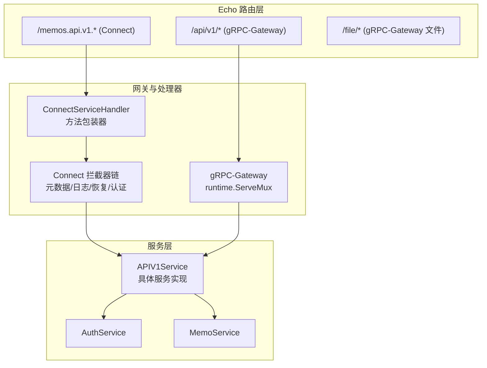
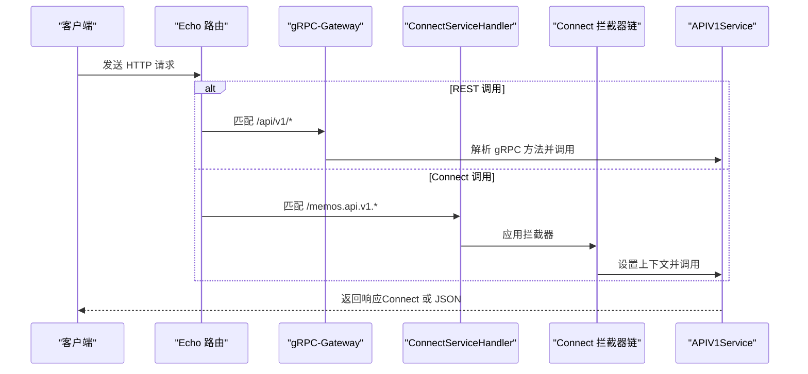
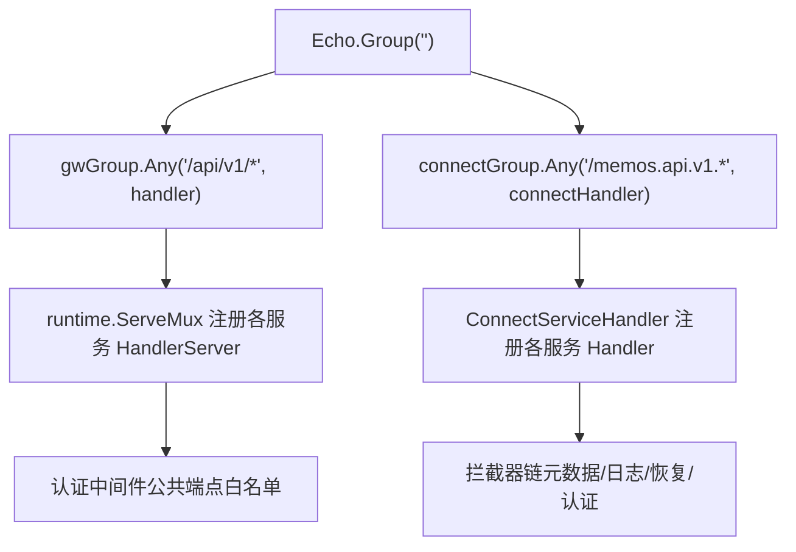
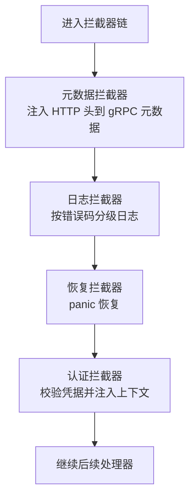
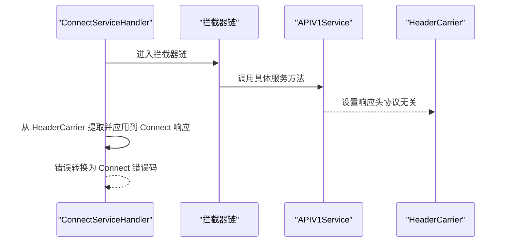
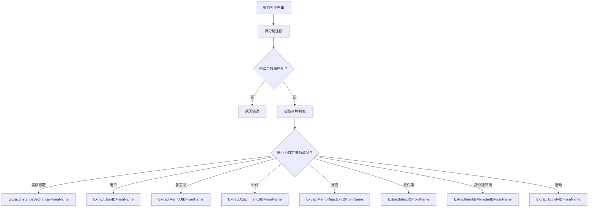
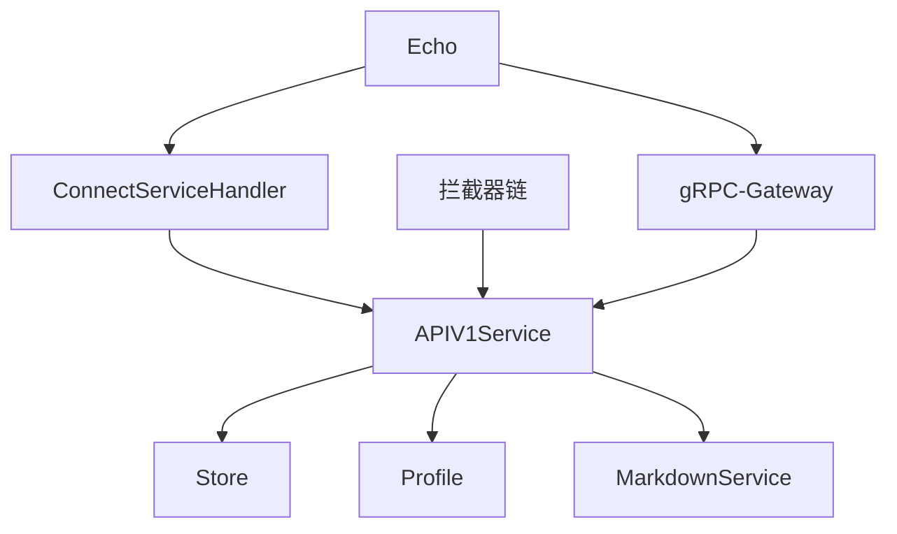

# 路由与分发机制

<cite>
**本文引用的文件**
- [server/router/api/v1/v1.go](file://server/router/api/v1/v1.go)
- [server/router/api/v1/connect_services.go](file://server/router/api/v1/connect_services.go)
- [server/router/api/v1/connect_handler.go](file://server/router/api/v1/connect_handler.go)
- [server/router/api/v1/connect_interceptors.go](file://server/router/api/v1/connect_interceptors.go)
- [server/router/api/v1/acl_config.go](file://server/router/api/v1/acl_config.go)
- [server/router/api/v1/header_carrier.go](file://server/router/api/v1/header_carrier.go)
- [server/router/api/v1/resource_name.go](file://server/router/api/v1/resource_name.go)
- [server/router/api/v1/common.go](file://server/router/api/v1/common.go)
- [server/router/api/v1/auth_service.go](file://server/router/api/v1/auth_service.go)
- [server/router/api/v1/memo_service.go](file://server/router/api/v1/memo_service.go)
- [proto/gen/openapi.yaml](file://proto/gen/openapi.yaml)
- [server/router/frontend/frontend.go](file://server/router/frontend/frontend.go)
</cite>

## 目录
1. [简介](#简介)
2. [项目结构](#项目结构)
3. [核心组件](#核心组件)
4. [架构总览](#架构总览)
5. [详细组件分析](#详细组件分析)
6. [依赖关系分析](#依赖关系分析)
7. [性能考量](#性能考量)
8. [故障排查指南](#故障排查指南)
9. [结论](#结论)
10. [附录](#附录)

## 简介
本文件系统性阐述 Memos 后端的路由与分发机制，重点覆盖：
- URL 路径匹配与路由注册：基于 Echo 的路由组与通配符匹配，以及 gRPC-Gateway 与 Connect 的双协议支持。
- 资源名称解析：统一的资源名前缀与令牌解析规则，用于 REST 风格路径参数与资源标识符。
- 请求分发策略：拦截器链（元数据转换、认证、日志、恢复）与服务层适配器（Connect 包装器）。
- 版本化路由设计与向后兼容：通过版本化的 API 命名空间与 OpenAPI 描述，确保接口演进的稳定性。
- 资源命名规范与 URL 结构设计原则：REST 风格与 Connect 协议的路径约定。
- 路由配置示例与自定义路由开发指南：如何扩展新服务或端点。
- 路由性能优化与调试技巧：并发限制、缓存控制、日志分级与错误恢复。

## 项目结构
API 路由与分发主要集中在 server/router/api/v1 目录，采用“按协议分层 + 按服务聚合”的组织方式：
- v1.go：APIV1Service 的注册入口，负责将 gRPC-Gateway 与 Connect 处理器挂载到 Echo 路由树。
- connect_handler.go：Connect 协议处理器包装器，统一将 gRPC 实现适配为 Connect 接口。
- connect_services.go：Connect 方法到 gRPC 实现的映射，集中处理响应封装与错误转换。
- connect_interceptors.go：Connect 协议的拦截器链，包括元数据注入、日志、恢复与认证。
- acl_config.go：公开端点白名单，确保认证策略的一致性。
- header_carrier.go：协议无关的响应头设置机制，兼容 gRPC 与 Connect。
- resource_name.go：资源名解析工具，支持多层级资源路径解析。
- common.go：分页、状态转换等通用逻辑。
- auth_service.go、memo_service.go：典型服务端点的实现示例，展示鉴权与业务流程。
- proto/gen/openapi.yaml：OpenAPI 描述，定义了 REST 风格的路径与方法。
- server/router/frontend/frontend.go：前端静态资源与 SPA 回退，避免与 API 路由冲突。

图表来源
- [server/router/api/v1/v1.go](file://server/router/api/v1/v1.go#L205-L234)
- [server/router/api/v1/connect_handler.go](file://server/router/api/v1/connect_handler.go#L36-L68)
- [server/router/api/v1/connect_interceptors.go](file://server/router/api/v1/connect_interceptors.go#L19-L274)
- [server/router/api/v1/auth_service.go](file://server/router/api/v1/auth_service.go#L32-L53)
- [server/router/api/v1/memo_service.go](file://server/router/api/v1/memo_service.go#L24-L31)

章节来源
- [server/router/api/v1/v1.go](file://server/router/api/v1/v1.go#L1-L238)
- [server/router/api/v1/connect_handler.go](file://server/router/api/v1/connect_handler.go#L1-L552)
- [server/router/api/v1/connect_interceptors.go](file://server/router/api/v1/connect_interceptors.go#L1-L275)
- [server/router/api/v1/acl_config.go](file://server/router/api/v1/acl_config.go#L1-L43)
- [server/router/api/v1/header_carrier.go](file://server/router/api/v1/header_carrier.go#L1-L125)
- [proto/gen/openapi.yaml](file://proto/gen/openapi.yaml#L1-L200)
- [server/router/frontend/frontend.go](file://server/router/frontend/frontend.go#L32-L69)

## 核心组件
- APIV1Service：API 版本 1 的核心服务容器，负责注册 gRPC-Gateway 与 Connect 处理器，并维护会话与并发控制。
- ConnectServiceHandler：将 gRPC 服务实现适配为 Connect 协议，统一响应封装与错误码转换。
- Connect 拦截器链：元数据拦截器（HTTP 头转 gRPC 元数据）、日志拦截器（分级日志）、恢复拦截器（panic 恢复）、认证拦截器（鉴权与上下文注入）。
- ACL 白名单：PublicMethods 映射，确保认证策略在 Connect 与 gRPC-Gateway 中一致。
- HeaderCarrier：协议无关的响应头设置机制，兼容 gRPC 与 Connect。
- 资源名解析：资源前缀常量与解析函数，支持从资源名提取 ID 或组合层级路径。
- OpenAPI 描述：REST 风格路径与方法定义，作为 API 文档与客户端生成依据。

章节来源
- [server/router/api/v1/v1.go](file://server/router/api/v1/v1.go#L23-L118)
- [server/router/api/v1/connect_services.go](file://server/router/api/v1/connect_services.go#L1-L491)
- [server/router/api/v1/connect_interceptors.go](file://server/router/api/v1/connect_interceptors.go#L19-L275)
- [server/router/api/v1/acl_config.go](file://server/router/api/v1/acl_config.go#L11-L42)
- [server/router/api/v1/header_carrier.go](file://server/router/api/v1/header_carrier.go#L11-L86)
- [server/router/api/v1/resource_name.go](file://server/router/api/v1/resource_name.go#L12-L159)

## 架构总览
下图展示了从客户端请求到服务实现的完整分发链路，涵盖 Echo 路由、gRPC-Gateway、Connect 协议与拦截器链：

图表来源
- [server/router/api/v1/v1.go](file://server/router/api/v1/v1.go#L205-L234)
- [server/router/api/v1/connect_handler.go](file://server/router/api/v1/connect_handler.go#L36-L68)
- [server/router/api/v1/connect_interceptors.go](file://server/router/api/v1/connect_interceptors.go#L19-L275)

## 详细组件分析

### 路由注册与协议分发
- Echo 路由组：
  - /api/v1/*：绑定 gRPC-Gateway，支持 REST 风格调用。
  - /memos.api.v1.*：绑定 Connect 处理器，支持 Connect 协议。
  - /file/*：绑定 gRPC-Gateway，处理文件相关请求。
- gRPC-Gateway 注册：将各服务的 HandlerServer 注册到 runtime.ServeMux，并应用认证中间件。
- Connect 注册：通过 ConnectServiceHandler 将各服务的 Connect Handler 注册到 http.ServeMux，并应用拦截器链。

图表来源
- [server/router/api/v1/v1.go](file://server/router/api/v1/v1.go#L205-L234)

章节来源
- [server/router/api/v1/v1.go](file://server/router/api/v1/v1.go#L120-L237)

### 认证与拦截器链
- 公开端点白名单：PublicMethods 映射定义了无需认证即可访问的端点，Connect 与 gRPC-Gateway 使用同一份清单。
- 元数据拦截器：将 HTTP 头（如 User-Agent、X-Forwarded-For、Cookie）转换为 gRPC 元数据，便于服务层获取客户端信息。
- 日志拦截器：根据 Connect 错误码对日志进行分级（INFO/WARN/ERROR），支持可选堆栈跟踪。
- 恢复拦截器：捕获 panic 并返回内部错误，记录堆栈信息。
- 认证拦截器：校验 Authorization 头，非公开端点缺失凭据将被拒绝；成功后将用户信息注入上下文。

图表来源
- [server/router/api/v1/connect_interceptors.go](file://server/router/api/v1/connect_interceptors.go#L19-L275)
- [server/router/api/v1/acl_config.go](file://server/router/api/v1/acl_config.go#L11-L42)

章节来源
- [server/router/api/v1/connect_interceptors.go](file://server/router/api/v1/connect_interceptors.go#L19-L275)
- [server/router/api/v1/acl_config.go](file://server/router/api/v1/acl_config.go#L1-L43)

### Connect 包装器与错误转换
- ConnectServiceHandler：将 gRPC 服务实现适配为 Connect 接口，统一响应封装与错误码转换。
- 错误转换：将 gRPC 状态码映射为 Connect 错误码，保持跨协议一致性。
- 协议无关响应头：通过 HeaderCarrier 在 Connect 场景下收集响应头，再由包装器应用到 Connect 响应。

图表来源
- [server/router/api/v1/connect_services.go](file://server/router/api/v1/connect_services.go#L18-L40)
- [server/router/api/v1/connect_handler.go](file://server/router/api/v1/connect_handler.go#L82-L99)
- [server/router/api/v1/header_carrier.go](file://server/router/api/v1/header_carrier.go#L67-L86)

章节来源
- [server/router/api/v1/connect_services.go](file://server/router/api/v1/connect_services.go#L1-L491)
- [server/router/api/v1/connect_handler.go](file://server/router/api/v1/connect_handler.go#L82-L99)
- [server/router/api/v1/header_carrier.go](file://server/router/api/v1/header_carrier.go#L67-L124)

### 资源名称解析与 URL 结构
- 资源前缀常量：定义了实例设置、用户、备忘录、附件、反应、收件箱、身份提供商、活动、Webhook 等资源的前缀。
- 解析函数族：支持从资源名中提取 ID、键或组合层级路径，确保 REST 风格路径与资源标识符的一致性。
- URL 结构设计原则：
  - REST 风格：/api/v1/<resource> 与 /api/v1/<resource>/<id>。
  - OpenAPI 描述：/api/v1/ai/chat、/api/v1/ai/conversations 等，体现语义化路径。
  - 文件访问：/file/* 由 gRPC-Gateway 处理，支持文件下载与预览。

图表来源
- [server/router/api/v1/resource_name.go](file://server/router/api/v1/resource_name.go#L24-L159)

章节来源
- [server/router/api/v1/resource_name.go](file://server/router/api/v1/resource_name.go#L12-L159)
- [proto/gen/openapi.yaml](file://proto/gen/openapi.yaml#L9-L200)

### 版本化路由设计与向后兼容
- 版本命名空间：/api/v1/* 与 /memos.api.v1.* 明确区分 REST 与 Connect 的版本化路径。
- OpenAPI 描述：通过 openapi.yaml 定义 REST 端点，确保客户端与文档同步。
- 向后兼容策略：
  - 新增端点：在现有版本命名空间内扩展，不破坏既有客户端。
  - 错误码一致性：Connect 与 gRPC 错误码映射，避免客户端因协议差异而失败。
  - 公开端点白名单：确保登录、实例信息等关键端点在版本升级后仍可用。

章节来源
- [server/router/api/v1/v1.go](file://server/router/api/v1/v1.go#L205-L234)
- [server/router/api/v1/connect_handler.go](file://server/router/api/v1/connect_handler.go#L94-L99)
- [proto/gen/openapi.yaml](file://proto/gen/openapi.yaml#L1-L200)

### 自定义路由开发指南
- 扩展服务端点：
  - 在 APIV1Service 中添加服务实现方法。
  - 在 connect_handler.go 中为该服务添加 Connect 包装器方法。
  - 在 connect_services.go 中注册 Connect 处理器。
  - 在 v1.go 中将服务的 HandlerServer 注册到 gRPC-Gateway。
- 配置认证与公开端点：
  - 如需公开访问，请在 acl_config.go 的 PublicMethods 中添加对应 gRPC 方法路径。
- 设置响应头：
  - 对需要设置响应头的方法，使用 HeaderCarrier 机制，确保 Connect 与 gRPC 场景一致。
- 分页与状态转换：
  - 使用 common.go 中的分页与状态转换工具，保持行为一致。

章节来源
- [server/router/api/v1/v1.go](file://server/router/api/v1/v1.go#L160-L204)
- [server/router/api/v1/connect_handler.go](file://server/router/api/v1/connect_handler.go#L36-L68)
- [server/router/api/v1/connect_services.go](file://server/router/api/v1/connect_services.go#L36-L68)
- [server/router/api/v1/acl_config.go](file://server/router/api/v1/acl_config.go#L11-L42)
- [server/router/api/v1/header_carrier.go](file://server/router/api/v1/header_carrier.go#L67-L86)
- [server/router/api/v1/common.go](file://server/router/api/v1/common.go#L40-L64)

## 依赖关系分析
- 组件耦合：
  - APIV1Service 依赖 Store、Profile、MarkdownService 等基础设施。
  - ConnectServiceHandler 依赖 APIV1Service，形成“包装器-实现”关系。
  - 拦截器链独立于具体服务，通过接口注入上下文与元数据。
- 外部依赖：
  - Echo：路由与中间件。
  - gRPC-Gateway：REST 到 gRPC 的桥接。
  - Connect：二进制 RPC 协议，提供流式与非流式调用。
  - OpenAPI：REST 端点描述，驱动客户端生成与文档。

图表来源
- [server/router/api/v1/v1.go](file://server/router/api/v1/v1.go#L48-L118)
- [server/router/api/v1/connect_handler.go](file://server/router/api/v1/connect_handler.go#L27-L34)
- [server/router/api/v1/connect_interceptors.go](file://server/router/api/v1/connect_interceptors.go#L19-L275)

章节来源
- [server/router/api/v1/v1.go](file://server/router/api/v1/v1.go#L23-L118)
- [server/router/api/v1/connect_handler.go](file://server/router/api/v1/connect_handler.go#L19-L34)
- [server/router/api/v1/connect_interceptors.go](file://server/router/api/v1/connect_interceptors.go#L19-L275)

## 性能考量
- 并发控制：APIV1Service 内置权重信号量限制缩略图生成并发，防止内存耗尽。
- 缓存控制：Connect 拦截器在成功响应上设置 no-cache、no-store、must-revalidate，避免浏览器缓存导致的数据陈旧。
- 日志分级：日志拦截器根据错误码选择日志级别，减少不必要的错误日志输出。
- 前端缓存：前端静态资源设置合理的 Cache-Control，根页面与 index.html 设置 no-cache，防止登出后缓存敏感数据。

章节来源
- [server/router/api/v1/v1.go](file://server/router/api/v1/v1.go#L44-L57)
- [server/router/api/v1/connect_interceptors.go](file://server/router/api/v1/connect_interceptors.go#L58-L64)
- [server/router/frontend/frontend.go](file://server/router/frontend/frontend.go#L38-L52)

## 故障排查指南
- 认证失败：
  - 检查 PublicMethods 是否包含目标端点；确认 Authorization 头格式正确。
  - 查看拦截器日志中的错误码与堆栈信息。
- 响应头问题：
  - 确认使用 HeaderCarrier 设置响应头；检查 Connect 包装器是否正确应用 HeaderCarrier。
- REST 与 Connect 行为不一致：
  - 对比 gRPC-Gateway 与 Connect 的错误码映射；确保拦截器顺序正确。
- 前端路由冲突：
  - 确保前端静态资源路由在 API 路由之前，避免 API 路由覆盖静态文件。

章节来源
- [server/router/api/v1/acl_config.go](file://server/router/api/v1/acl_config.go#L11-L42)
- [server/router/api/v1/connect_interceptors.go](file://server/router/api/v1/connect_interceptors.go#L119-L158)
- [server/router/api/v1/header_carrier.go](file://server/router/api/v1/header_carrier.go#L67-L124)
- [server/router/frontend/frontend.go](file://server/router/frontend/frontend.go#L32-L69)

## 结论
本路由与分发机制通过 Echo 路由层、gRPC-Gateway 与 Connect 协议的协同，实现了 REST 与二进制 RPC 的统一接入。借助拦截器链、资源名解析与协议无关的响应头机制，系统在功能扩展、版本演进与兼容性方面具备良好弹性。遵循本文的命名规范与开发指南，可高效扩展新的服务端点并保持稳定的用户体验。

## 附录
- 资源命名规范速查：
  - 实例设置：instance/settings/<key>
  - 用户：users/<id 或用户名>
  - 备忘录：memos/<uid>
  - 附件：attachments/<uid>
  - 反应：memos/<uid>/reactions/<id>
  - 收件箱：inboxes/<id>
  - 身份提供商：identity-providers/<id>
  - 活动：activities/<id>
  - Webhook：webhooks/<id>
- OpenAPI 路径参考：参见 proto/gen/openapi.yaml 中的 paths 字段，了解 REST 端点与参数定义。

章节来源
- [server/router/api/v1/resource_name.go](file://server/router/api/v1/resource_name.go#L12-L22)
- [proto/gen/openapi.yaml](file://proto/gen/openapi.yaml#L9-L200)