# 业务逻辑层

<cite>
**本文引用的文件**
- [README.md](file://README.md)
- [server/service/schedule/service.go](file://server/service/schedule/service.go)
- [server/service/schedule/interface.go](file://server/service/schedule/interface.go)
- [server/service/schedule/conflict_resolver.go](file://server/service/schedule/conflict_resolver.go)
- [server/queryengine/query_router.go](file://server/queryengine/query_router.go)
- [server/queryengine/config.go](file://server/queryengine/config.go)
- [server/retrieval/adaptive_retrieval.go](file://server/retrieval/adaptive_retrieval.go)
- [plugin/ai/embedding.go](file://plugin/ai/embedding.go)
- [plugin/ai/reranker.go](file://plugin/ai/reranker.go)
- [store/schedule.go](file://store/schedule.go)
- [store/memo.go](file://store/memo.go)
- [store/db/postgres/schedule.go](file://store/db/postgres/schedule.go)
- [store/db/postgres/memo.go](file://store/db/postgres/memo.go)
- [store/store.go](file://store/store.go)
</cite>

## 目录
1. [引言](#引言)
2. [项目结构](#项目结构)
3. [核心组件](#核心组件)
4. [架构总览](#架构总览)
5. [详细组件分析](#详细组件分析)
6. [依赖分析](#依赖分析)
7. [性能考虑](#性能考虑)
8. [故障排查指南](#故障排查指南)
9. [结论](#结论)
10. [附录](#附录)

## 引言
本文件聚焦于业务逻辑层（Business Logic Layer），系统性梳理 Memos 的业务能力组织方式与服务接口设计，涵盖：
- 业务逻辑层的职责边界与模块划分
- 核心业务服务（日程管理、检索系统）的协作关系
- 查询引擎（QueryRouter）的设计模式与优化策略
- 检索系统（AdaptiveRetriever）的实现原理与性能优化
- 业务规则验证、冲突检测与一致性保障
- 事务管理与数据一致性策略
- 扩展与自定义服务开发指南
- 典型业务场景的实现思路与最佳实践

## 项目结构
业务逻辑层位于 server/service 与 server/retrieval、server/queryengine 下，围绕“服务接口 + 数据访问 + 检索编排”的三层设计展开：
- 服务接口层：面向上层调用（API/Agent）暴露稳定的业务契约
- 业务服务层：封装领域规则、冲突检测、时区处理、实例展开等
- 检索编排层：QueryRouter 路由意图，AdaptiveRetriever 编排 BM25/向量/Rerank
- 数据访问层：Store 抽象 + Postgres/SQLite 实现，提供 ACID 与约束保证

图示来源
- [server/service/schedule/service.go](file://server/service/schedule/service.go#L1-L737)
- [server/service/schedule/interface.go](file://server/service/schedule/interface.go#L1-L85)
- [server/service/schedule/conflict_resolver.go](file://server/service/schedule/conflict_resolver.go#L1-L358)
- [server/queryengine/query_router.go](file://server/queryengine/query_router.go#L1-L800)
- [server/retrieval/adaptive_retrieval.go](file://server/retrieval/adaptive_retrieval.go#L1-L762)
- [plugin/ai/embedding.go](file://plugin/ai/embedding.go#L1-L103)
- [plugin/ai/reranker.go](file://plugin/ai/reranker.go#L1-L127)
- [store/store.go](file://store/store.go#L1-L87)
- [store/db/postgres/schedule.go](file://store/db/postgres/schedule.go#L1-L327)
- [store/db/postgres/memo.go](file://store/db/postgres/memo.go#L1-L357)

章节来源
- [README.md](file://README.md#L157-L198)

## 核心组件
- 日程服务（Schedule Service）
  - 职责：创建/查询/更新/删除日程；自然语言解析与实例展开；冲突检测与建议
  - 关键能力：RRule 展开、时区处理、冲突索引、推荐空闲时间段
- 查询路由（QueryRouter）
  - 职责：识别查询意图，自动选择检索策略（纯日程、语义、混合、重排）
  - 关键能力：时间关键词解析、相对/绝对时间、严格/标准模式
- 自适应检索（AdaptiveRetriever）
  - 职责：并行执行 BM25 与向量检索，RRF 融合，必要时重排
  - 关键能力：质量评估、结果合并、内存优化、请求追踪
- AI 能力
  - 嵌入服务：OpenAI 兼容客户端，批量向量化
  - 重排序服务：SiliconFlow Rerank API，降级策略

章节来源
- [server/service/schedule/service.go](file://server/service/schedule/service.go#L1-L737)
- [server/service/schedule/interface.go](file://server/service/schedule/interface.go#L1-L85)
- [server/queryengine/query_router.go](file://server/queryengine/query_router.go#L1-L800)
- [server/retrieval/adaptive_retrieval.go](file://server/retrieval/adaptive_retrieval.go#L1-L762)
- [plugin/ai/embedding.go](file://plugin/ai/embedding.go#L1-L103)
- [plugin/ai/reranker.go](file://plugin/ai/reranker.go#L1-L127)

## 架构总览
业务逻辑层通过“服务接口 + 业务服务 + 检索编排 + 数据访问 + AI 能力”协同工作，形成端到端的智能检索与日程管理闭环。

图示来源
- [server/queryengine/query_router.go](file://server/queryengine/query_router.go#L449-L552)
- [server/retrieval/adaptive_retrieval.go](file://server/retrieval/adaptive_retrieval.go#L68-L115)
- [plugin/ai/embedding.go](file://plugin/ai/embedding.go#L60-L98)
- [plugin/ai/reranker.go](file://plugin/ai/reranker.go#L59-L126)

## 详细组件分析

### 日程服务（Schedule Service）
- 服务接口
  - FindSchedules：按时间窗口查询日程，支持递归日程实例展开
  - Create/Update/Delete：带校验与冲突检测
  - CheckConflicts：基于时间窗的冲突判定
- 关键设计
  - 冲突检测采用“先业务校验，再数据库原子约束”的双重保障
  - 递归日程使用 RRule 解析与迭代器，限制实例数量防止过度计算
  - 时间范围比较遵循 [start,end) 左闭右开区间约定，避免边界问题
  - 提供结构化冲突错误（含替代时间槽），便于前端 i18n 展示
- 性能优化
  - 冲突索引按小时桶构建，O(1) 查询潜在冲突
  - 递归冲突检查使用迭代器与上限控制，避免无限循环
- 时区与展示
  - 统一使用用户时区解析时间关键词，避免 UTC 混淆
  - 冲突提示格式化输出，包含人类可读的时间信息

图示来源
- [server/service/schedule/interface.go](file://server/service/schedule/interface.go#L10-L31)
- [server/service/schedule/service.go](file://server/service/schedule/service.go#L70-L86)
- [store/schedule.go](file://store/schedule.go#L8-L51)

章节来源
- [server/service/schedule/service.go](file://server/service/schedule/service.go#L88-L192)
- [server/service/schedule/service.go](file://server/service/schedule/service.go#L194-L302)
- [server/service/schedule/service.go](file://server/service/schedule/service.go#L426-L480)
- [server/service/schedule/service.go](file://server/service/schedule/service.go#L548-L737)
- [server/service/schedule/conflict_resolver.go](file://server/service/schedule/conflict_resolver.go#L45-L97)

### 冲突解析器（ConflictResolver）
- 职责：在存在冲突时，提供替代时间槽与自动解决建议
- 策略
  - 同日优先，相邻日次之，按“就近、同时段、工作日、黄金时段”打分
  - 对非相邻日提供 i18n 友好的原因标签（days_before/days_after）
- 输出
  - ConflictResolution：包含原始时间、冲突列表、替代时间槽、自动推荐

图示来源
- [server/service/schedule/conflict_resolver.go](file://server/service/schedule/conflict_resolver.go#L45-L97)
- [server/service/schedule/conflict_resolver.go](file://server/service/schedule/conflict_resolver.go#L114-L165)
- [server/service/schedule/conflict_resolver.go](file://server/service/schedule/conflict_resolver.go#L254-L326)

章节来源
- [server/service/schedule/conflict_resolver.go](file://server/service/schedule/conflict_resolver.go#L1-L358)

### 查询路由（QueryRouter）
- 设计模式
  - 快速规则匹配（95% 场景）：优先匹配时间关键词、笔记关键词、疑问词
  - 默认策略：混合检索（含时间过滤）
- 时间解析
  - 支持相对时间（今天/明天/本周/上周/季度/年）与绝对日期（YYYY-MM-DD、MM-DD、MM月DD日）
  - 统一使用 UTC 初始化关键词映射，调用时可传入用户时区
- 路由决策
  - ScheduleQueryMode：标准模式（任意部分在范围内）、严格模式（完全在范围内）
  - Confidence：置信度（0.0-1.0），用于后续策略选择

图示来源
- [server/queryengine/query_router.go](file://server/queryengine/query_router.go#L449-L552)
- [server/queryengine/query_router.go](file://server/queryengine/query_router.go#L554-L675)
- [server/queryengine/query_router.go](file://server/queryengine/query_router.go#L677-L800)
- [server/queryengine/config.go](file://server/queryengine/config.go#L74-L104)

章节来源
- [server/queryengine/query_router.go](file://server/queryengine/query_router.go#L1-L800)
- [server/queryengine/config.go](file://server/queryengine/config.go#L1-L170)

### 自适应检索（AdaptiveRetriever）
- 检索策略
  - schedule_bm25_only：纯日程 BM25（带时间过滤）
  - memo_semantic_only：语义向量（质量评估后可扩展）
  - hybrid_bm25_weighted：BM25 权重大于向量
  - hybrid_with_time_filter：混合 + 时间过滤
  - hybrid_standard：BM25 与向量权重相等
  - full_pipeline_with_reranker：混合 + Reranker
- 质量评估与降级
  - 通过前两名分数差距、最高分阈值、查询复杂度判断是否需要重排
  - Reranker 不可用或不满足条件时，直接返回混合结果
- 性能优化
  - 并行执行 BM25 与向量检索，RRF 融合
  - 内存优化：预分配切片、截断长内容、及时清空临时数组
  - 结果去重与 TopK 截断

```mermaid
sequenceDiagram
participant R as "AdaptiveRetriever"
participant E as "EmbeddingService"
participant D as "Store(BM25/Vector)"
participant RR as "RerankerService"
R->>E : "Embed(query)"
E-->>R : "向量"
R->>D : "并行执行 BM25/Vector 检索"
D-->>R : "结果集"
R->>R : "RRF 融合/质量评估"
alt 需要重排
R->>RR : "Rerank(query, documents, topN)"
RR-->>R : "重排结果"
end
R-->>Caller : "SearchResult 列表"
```

图示来源
- [server/retrieval/adaptive_retrieval.go](file://server/retrieval/adaptive_retrieval.go#L409-L491)
- [server/retrieval/adaptive_retrieval.go](file://server/retrieval/adaptive_retrieval.go#L330-L407)
- [plugin/ai/embedding.go](file://plugin/ai/embedding.go#L60-L98)
- [plugin/ai/reranker.go](file://plugin/ai/reranker.go#L59-L126)

章节来源
- [server/retrieval/adaptive_retrieval.go](file://server/retrieval/adaptive_retrieval.go#L68-L115)
- [server/retrieval/adaptive_retrieval.go](file://server/retrieval/adaptive_retrieval.go#L117-L192)
- [server/retrieval/adaptive_retrieval.go](file://server/retrieval/adaptive_retrieval.go#L194-L269)
- [server/retrieval/adaptive_retrieval.go](file://server/retrieval/adaptive_retrieval.go#L271-L316)
- [server/retrieval/adaptive_retrieval.go](file://server/retrieval/adaptive_retrieval.go#L318-L328)
- [server/retrieval/adaptive_retrieval.go](file://server/retrieval/adaptive_retrieval.go#L330-L407)
- [server/retrieval/adaptive_retrieval.go](file://server/retrieval/adaptive_retrieval.go#L409-L491)

### 数据模型与一致性
- 实体模型
  - Memo：内容、可见性、置顶、负载、父子关系
  - Schedule：标题、描述、地点、起止时间、全天、时区、重复规则、提醒、负载
- 数据访问
  - Store 抽象 + Postgres/SQLite 实现
  - Schedule 使用 EXCLUDE 约束确保时间区间无重叠，冲突检测双保险
- 事务与一致性
  - 数据库层面通过约束与事务保证 ACID
  - 业务层通过“先业务校验 + 再数据库原子约束”降低异常成本

图示来源
- [store/memo.go](file://store/memo.go#L35-L55)
- [store/schedule.go](file://store/schedule.go#L8-L27)
- [store/db/postgres/memo.go](file://store/db/postgres/memo.go#L16-L49)
- [store/db/postgres/schedule.go](file://store/db/postgres/schedule.go#L14-L57)

章节来源
- [store/memo.go](file://store/memo.go#L1-L160)
- [store/schedule.go](file://store/schedule.go#L1-L176)
- [store/db/postgres/memo.go](file://store/db/postgres/memo.go#L1-L357)
- [store/db/postgres/schedule.go](file://store/db/postgres/schedule.go#L1-L327)

## 依赖分析
- 服务耦合
  - 日程服务依赖 Store 接口，解耦具体驱动
  - 检索器依赖 EmbeddingService 与 RerankerService 接口，便于替换实现
- 外部依赖
  - OpenAI 兼容嵌入服务、SiliconFlow Rerank API
  - PostgreSQL + pgvector（生产环境）
- 循环依赖
  - 未发现直接循环依赖；服务层通过接口隔离，避免相互引用

图示来源
- [server/service/schedule/service.go](file://server/service/schedule/service.go#L70-L86)
- [server/retrieval/adaptive_retrieval.go](file://server/retrieval/adaptive_retrieval.go#L55-L66)
- [plugin/ai/embedding.go](file://plugin/ai/embedding.go#L23-L58)
- [plugin/ai/reranker.go](file://plugin/ai/reranker.go#L29-L53)

章节来源
- [server/service/schedule/service.go](file://server/service/schedule/service.go#L1-L737)
- [server/retrieval/adaptive_retrieval.go](file://server/retrieval/adaptive_retrieval.go#L1-L762)
- [plugin/ai/embedding.go](file://plugin/ai/embedding.go#L1-L103)
- [plugin/ai/reranker.go](file://plugin/ai/reranker.go#L1-L127)

## 性能考虑
- 查询路由
  - 快速规则匹配覆盖 95% 场景，显著降低复杂度
  - 时间关键词映射集中初始化，调用时仅做选择与构造
- 检索编排
  - 并行执行 BM25 与向量检索，缩短 RTT
  - RRF 融合兼顾关键词与语义，减少重排成本
  - 内存优化：预分配、截断长文本、及时释放临时对象
- 日程冲突
  - 小时桶索引 O(1) 查找潜在冲突，避免全表扫描
  - 递归冲突检查限制实例数量，防止超时
- 数据层
  - PostgreSQL + pgvector，结合 GIN/B-tree 索引与 HNSW，提升检索效率

## 故障排查指南
- 冲突检测
  - 业务层冲突：返回结构化错误，包含替代时间槽
  - 数据库冲突：捕获 EXCLUSION 约束错误，转为用户友好提示
- 查询路由
  - 时间解析失败：检查用户时区与关键词匹配顺序
  - 策略误判：调整配置或扩展关键词库
- 检索失败
  - 向量服务不可用：回退至 BM25 或纯语义检索
  - Reranker 失败：降级返回混合结果
- 日志与追踪
  - 每个请求携带 RequestID，便于链路追踪与问题定位

章节来源
- [server/service/schedule/service.go](file://server/service/schedule/service.go#L287-L299)
- [server/service/schedule/service.go](file://server/service/schedule/service.go#L548-L639)
- [server/retrieval/adaptive_retrieval.go](file://server/retrieval/adaptive_retrieval.go#L330-L407)
- [server/retrieval/adaptive_retrieval.go](file://server/retrieval/adaptive_retrieval.go#L756-L762)

## 结论
业务逻辑层通过清晰的服务接口、严谨的冲突检测与一致性的数据约束、以及高效的检索编排，实现了“自然语言日程管理 + 智能检索”的核心能力。其设计强调：
- 可扩展：接口抽象 + 配置化 + 外部服务可插拔
- 可靠：业务校验 + 数据库约束 + 降级策略
- 可观测：请求追踪 + 置信度 + 质量评估
- 可维护：模块职责清晰、依赖方向单一

## 附录

### 业务规则与事务管理
- 业务规则
  - 时间范围：[start, end) 左闭右开，避免边界重叠
  - 冲突检测：业务层 + 数据库约束双保险
  - 递归日程：限制实例数量，使用迭代器逐个检查
- 事务管理
  - 数据库事务保证 ACID；冲突检测通过 EXCLUSION 约束实现原子性
  - 业务层尽量在单次操作中完成校验与持久化，减少跨事务协调

章节来源
- [server/service/schedule/service.go](file://server/service/schedule/service.go#L426-L480)
- [server/service/schedule/service.go](file://server/service/schedule/service.go#L548-L639)
- [store/db/postgres/schedule.go](file://store/db/postgres/schedule.go#L286-L327)

### 扩展与自定义指南
- 新增业务服务
  - 定义 Service 接口与实现，依赖 Store 接口
  - 在 router/api/v1 中注册服务，暴露 Connect RPC
- 自定义检索策略
  - 在 AdaptiveRetriever 中新增策略分支，复用现有 Embedding/Reranker
  - 通过配置控制策略开关与参数
- 自定义查询路由
  - 扩展 QueryRouter 的关键词库与规则，支持多语言与方言
  - 使用 Config 管理策略阈值与限制

章节来源
- [server/service/schedule/interface.go](file://server/service/schedule/interface.go#L10-L31)
- [server/retrieval/adaptive_retrieval.go](file://server/retrieval/adaptive_retrieval.go#L55-L66)
- [server/queryengine/config.go](file://server/queryengine/config.go#L74-L104)

### 典型业务场景与最佳实践
- 场景一：自然语言创建日程
  - 步骤：QueryRouter 识别时间关键词 → ScheduleService 创建（含冲突检测）→ 返回实例
  - 最佳实践：提供 i18n 冲突提示与替代时间槽
- 场景二：混合检索（时间 + 内容）
  - 步骤：QueryRouter 路由到 hybrid_with_time_filter → AdaptiveRetriever 并行检索 → RRF 融合
  - 最佳实践：合理设置时间过滤与阈值，避免过度重排
- 场景三：复杂问答（RAG）
  - 步骤：QueryRouter 路由到 full_pipeline_with_reranker → AdaptiveRetriever 调用 Reranker
  - 最佳实践：控制文档长度，启用降级策略

章节来源
- [server/queryengine/query_router.go](file://server/queryengine/query_router.go#L449-L552)
- [server/retrieval/adaptive_retrieval.go](file://server/retrieval/adaptive_retrieval.go#L330-L407)
- [server/service/schedule/service.go](file://server/service/schedule/service.go#L194-L302)