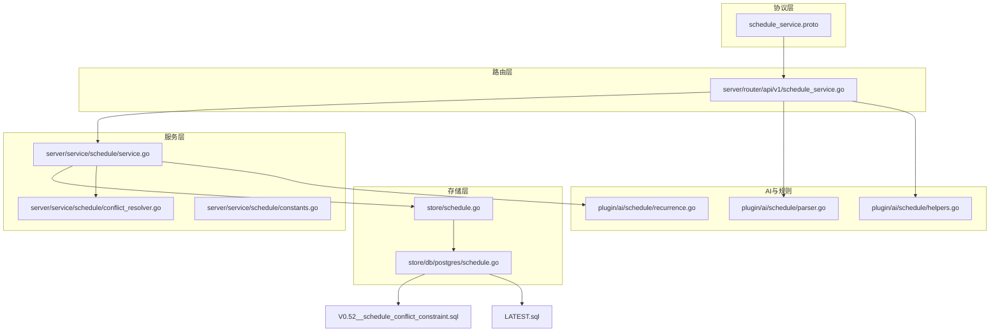
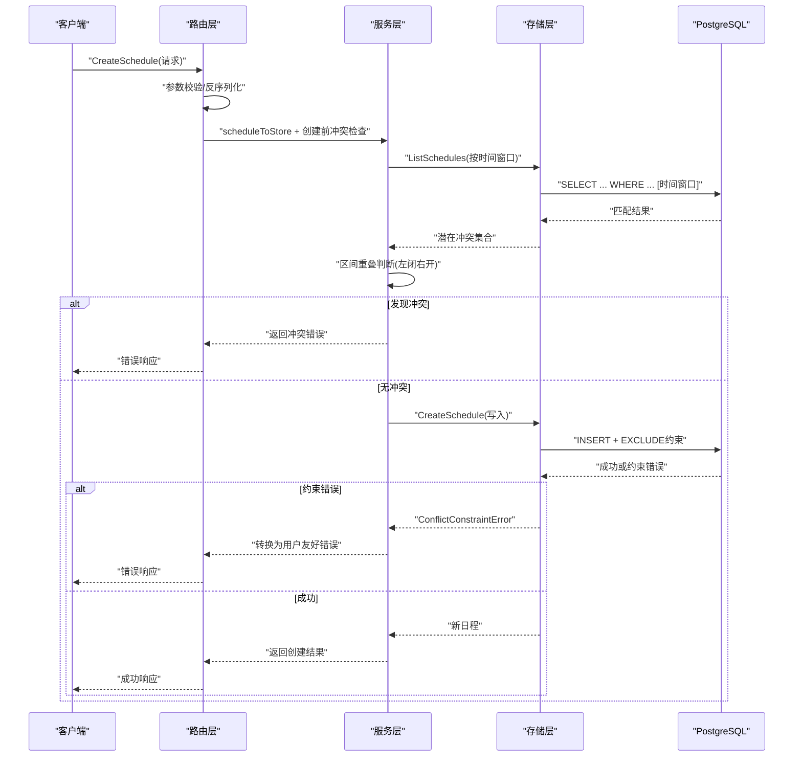
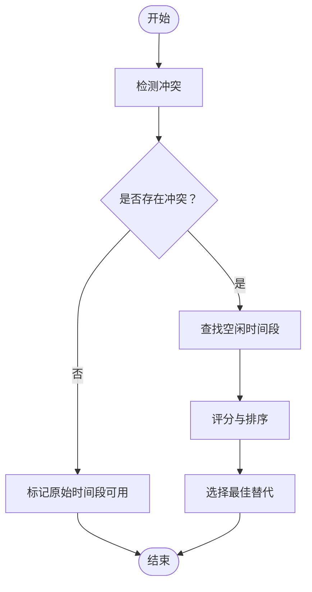
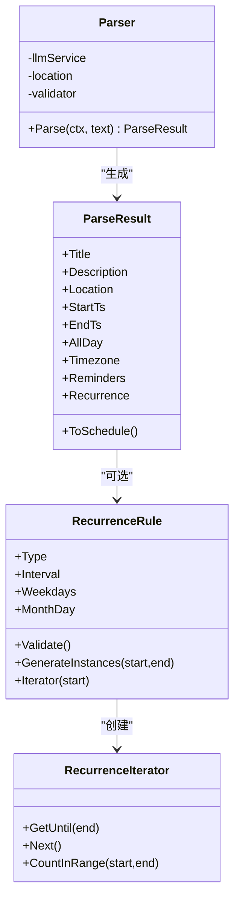
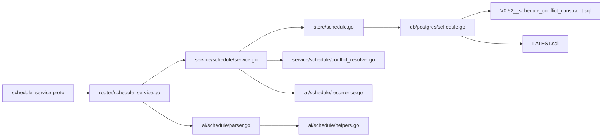

# 日程服务

<cite>
**本文引用的文件**
- [schedule_service.proto](file://proto/api/v1/schedule_service.proto)
- [service.go](file://server/service/schedule/service.go)
- [conflict_resolver.go](file://server/service/schedule/conflict_resolver.go)
- [constants.go](file://server/service/schedule/constants.go)
- [schedule.go](file://store/schedule.go)
- [schedule.go](file://store/db/postgres/schedule.go)
- [schedule_service.go](file://server/router/api/v1/schedule_service.go)
- [recurrence.go](file://plugin/ai/schedule/recurrence.go)
- [parser.go](file://plugin/ai/schedule/parser.go)
- [helpers.go](file://plugin/ai/schedule/helpers.go)
- [V0.52__schedule_conflict_constraint.sql](file://store/migration/postgres/V0.52__schedule_conflict_constraint.sql)
- [LATEST.sql](file://store/migration/postgres/LATEST.sql)
- [service_test.go](file://server/service/schedule/service_test.go)
</cite>

## 目录
1. [简介](#简介)
2. [项目结构](#项目结构)
3. [核心组件](#核心组件)
4. [架构总览](#架构总览)
5. [详细组件分析](#详细组件分析)
6. [依赖关系分析](#依赖关系分析)
7. [性能考量](#性能考量)
8. [故障排查指南](#故障排查指南)
9. [结论](#结论)
10. [附录](#附录)

## 简介
本文件系统化梳理了日程服务的业务逻辑与技术实现，覆盖以下主题：
- 核心业务：日程的创建、查询、更新、删除与冲突检测
- 冲突检测与解决：原子级数据库约束 + 智能替代时间槽推荐
- 复杂特性：重复规则解析与实例展开、时区处理、提醒机制
- 扩展与定制：如何扩展日程类型与接入新的解析器
- 实操示例：常见操作流程与冲突解决策略
- 性能优化：索引、限制与缓存策略

## 项目结构
日程服务由“协议层 → 路由层 → 服务层 → 存储层 → 数据库”构成，配合 AI 解析与重复规则引擎，形成完整的日程生命周期管理。

图示来源
- [schedule_service.proto](file://proto/api/v1/schedule_service.proto#L1-L166)
- [schedule_service.go](file://server/router/api/v1/schedule_service.go#L1-L826)
- [service.go](file://server/service/schedule/service.go#L1-L737)
- [conflict_resolver.go](file://server/service/schedule/conflict_resolver.go#L1-L358)
- [constants.go](file://server/service/schedule/constants.go#L1-L18)
- [schedule.go](file://store/schedule.go#L1-L176)
- [schedule.go](file://store/db/postgres/schedule.go#L1-L327)
- [recurrence.go](file://plugin/ai/schedule/recurrence.go#L1-L557)
- [parser.go](file://plugin/ai/schedule/parser.go#L1-L378)
- [helpers.go](file://plugin/ai/schedule/helpers.go#L1-L33)
- [V0.52__schedule_conflict_constraint.sql](file://store/migration/postgres/V0.52__schedule_conflict_constraint.sql#L1-L35)
- [LATEST.sql](file://store/migration/postgres/LATEST.sql#L165-L198)

章节来源
- [schedule_service.proto](file://proto/api/v1/schedule_service.proto#L1-L166)
- [schedule_service.go](file://server/router/api/v1/schedule_service.go#L1-L826)
- [service.go](file://server/service/schedule/service.go#L1-L737)
- [conflict_resolver.go](file://server/service/schedule/conflict_resolver.go#L1-L358)
- [constants.go](file://server/service/schedule/constants.go#L1-L18)
- [schedule.go](file://store/schedule.go#L1-L176)
- [schedule.go](file://store/db/postgres/schedule.go#L1-L327)
- [recurrence.go](file://plugin/ai/schedule/recurrence.go#L1-L557)
- [parser.go](file://plugin/ai/schedule/parser.go#L1-L378)
- [helpers.go](file://plugin/ai/schedule/helpers.go#L1-L33)
- [V0.52__schedule_conflict_constraint.sql](file://store/migration/postgres/V0.52__schedule_conflict_constraint.sql#L1-L35)
- [LATEST.sql](file://store/migration/postgres/LATEST.sql#L165-L198)

## 核心组件
- 协议与模型
  - 原型定义了日程实体、请求/响应消息与 API 方法集，涵盖创建、列表、获取、更新、删除、冲突检查与自然语言解析创建。
- 路由层
  - 将 gRPC/HTTP 请求映射为服务层调用，负责鉴权、参数校验、分页与实例展开。
- 服务层
  - 实现业务逻辑：创建/更新/删除/查询、冲突检测、重复规则展开、时区格式化、提醒序列化。
- 存储层
  - 定义数据模型与 CRUD 接口；PostgreSQL 驱动实现具体查询、更新、删除，并暴露冲突约束错误类型。
- AI 与规则
  - 自然语言解析器：从文本提取标题、时间、地点、提醒与重复规则。
  - 重复规则引擎：生成实例、迭代器与计数，支持日/周/月三种模式。
- 冲突解决器
  - 在存在冲突时，基于工作日与时间段偏好，智能推荐替代时间槽。

章节来源
- [schedule_service.proto](file://proto/api/v1/schedule_service.proto#L68-L166)
- [schedule_service.go](file://server/router/api/v1/schedule_service.go#L178-L723)
- [service.go](file://server/service/schedule/service.go#L70-L86)
- [schedule.go](file://store/schedule.go#L8-L76)
- [schedule.go](file://store/db/postgres/schedule.go#L14-L57)
- [parser.go](file://plugin/ai/schedule/parser.go#L21-L47)
- [recurrence.go](file://plugin/ai/schedule/recurrence.go#L40-L75)
- [conflict_resolver.go](file://server/service/schedule/conflict_resolver.go#L13-L24)

## 架构总览
下面的时序图展示了“创建日程”的端到端流程，包括冲突检测与数据库原子约束。

图示来源
- [schedule_service.go](file://server/router/api/v1/schedule_service.go#L178-L212)
- [service.go](file://server/service/schedule/service.go#L194-L302)
- [schedule.go](file://store/db/postgres/schedule.go#L14-L57)
- [V0.52__schedule_conflict_constraint.sql](file://store/migration/postgres/V0.52__schedule_conflict_constraint.sql#L8-L17)

## 详细组件分析

### 协议与模型
- 日程实体字段覆盖标题、描述、位置、起止时间戳、全天标记、时区、重复规则、重复结束时间、提醒数组、创建者、状态等。
- API 方法包括：创建、列表、获取、更新、删除、冲突检查、自然语言解析创建。
- 提醒结构包含类型（提前/按时）、数值与单位（分钟/小时/天）。

章节来源
- [schedule_service.proto](file://proto/api/v1/schedule_service.proto#L68-L166)

### 路由层（API 入口）
- 负责鉴权、参数校验、分页、默认时间窗口与实例展开。
- 列表查询时，若存在重复规则，会先查询模板，再通过规则引擎展开实例，同时受最大实例数限制。
- 冲突检查采用左闭右开区间约定，支持排除特定名称。

章节来源
- [schedule_service.go](file://server/router/api/v1/schedule_service.go#L214-L370)
- [schedule_service.go](file://server/router/api/v1/schedule_service.go#L595-L652)
- [schedule_service.go](file://server/router/api/v1/schedule_service.go#L752-L793)

### 服务层（业务核心）
- 创建流程
  - 必填校验、默认时区、提醒序列化、首次实例冲突检查、可选的重复规则未来实例冲突检查、最终数据库写入。
  - 数据库层面通过 EXCLUDE 约束提供原子冲突检测，避免竞态。
- 更新流程
  - 获取并校验所有权，构建更新体，计算新时间值，冲突检查（排除自身），写入数据库并返回最新记录。
- 删除流程
  - 校验所有权后删除。
- 查询流程
  - 支持按创建者、时间范围、状态与分页查询；对重复日程进行实例展开，受全局实例上限控制。
- 冲突检测
  - 时间窗口内按 creator_id 与时间区间检索，使用左闭右开区间判断是否重叠。
- 重复规则展开
  - 使用规则引擎生成实例时间戳，按查询窗口筛选并调整结束时间。
- 时区与提醒
  - 时区格式化与默认时区常量；提醒序列化/反序列化。

章节来源
- [service.go](file://server/service/schedule/service.go#L194-L302)
- [service.go](file://server/service/schedule/service.go#L304-L424)
- [service.go](file://server/service/schedule/service.go#L426-L480)
- [service.go](file://server/service/schedule/service.go#L88-L192)
- [service.go](file://server/service/schedule/service.go#L548-L639)
- [constants.go](file://server/service/schedule/constants.go#L5-L17)

### 存储层与数据库
- 数据模型包含所有日程字段，含外键与检查约束。
- PostgreSQL 驱动实现 CRUD，暴露冲突约束错误类型，便于上层统一处理。
- 数据库迁移添加 EXCLUDE 约束与 GIST 索引，确保原子冲突检测与高效查询。

章节来源
- [schedule.go](file://store/schedule.go#L8-L76)
- [schedule.go](file://store/db/postgres/schedule.go#L14-L57)
- [schedule.go](file://store/db/postgres/schedule.go#L207-L284)
- [V0.52__schedule_conflict_constraint.sql](file://store/migration/postgres/V0.52__schedule_conflict_constraint.sql#L8-L30)
- [LATEST.sql](file://store/migration/postgres/LATEST.sql#L165-L198)

### 冲突解决器（替代时间推荐）
- 输入：请求的起止时间、持续时长与用户偏好。
- 策略：同日优先、邻近日期次之、工作日偏好、业务高峰时段偏好、相邻日期轻微惩罚。
- 输出：冲突清单与替代时间槽，按评分排序，自动选择最佳替代。

图示来源
- [conflict_resolver.go](file://server/service/schedule/conflict_resolver.go#L45-L97)
- [conflict_resolver.go](file://server/service/schedule/conflict_resolver.go#L114-L165)
- [conflict_resolver.go](file://server/service/schedule/conflict_resolver.go#L264-L326)

章节来源
- [conflict_resolver.go](file://server/service/schedule/conflict_resolver.go#L1-L358)

### 重复规则与自然语言解析
- 重复规则
  - 支持每日、每周（可指定工作日）、每月（按月内某日）三种类型，提供生成实例、迭代器与计数能力。
  - 迭代器采用惰性加载与缓存，提升大周期场景性能。
- 自然语言解析
  - 通过 LLM 提取标题、时间、地点、提醒与重复规则，输出 UTC 时间戳，结合时区验证器规避夏令时边界问题。

图示来源
- [parser.go](file://plugin/ai/schedule/parser.go#L21-L47)
- [parser.go](file://plugin/ai/schedule/parser.go#L49-L61)
- [parser.go](file://plugin/ai/schedule/parser.go#L350-L377)
- [recurrence.go](file://plugin/ai/schedule/recurrence.go#L40-L75)
- [recurrence.go](file://plugin/ai/schedule/recurrence.go#L341-L363)

章节来源
- [recurrence.go](file://plugin/ai/schedule/recurrence.go#L1-L557)
- [parser.go](file://plugin/ai/schedule/parser.go#L1-L378)
- [helpers.go](file://plugin/ai/schedule/helpers.go#L1-L33)

### 时区转换与提醒机制
- 时区
  - 默认时区常量；格式化显示时解析时区，无效则回退至 UTC；解析器使用 LLM 输出 UTC 时间戳。
- 提醒
  - 提醒数组以 JSON 字符串持久化，支持 marshaling/unmarshaling；路由层限制最大数量。

章节来源
- [constants.go](file://server/service/schedule/constants.go#L5-L8)
- [service.go](file://server/service/schedule/service.go#L525-L546)
- [schedule_service.go](file://server/router/api/v1/schedule_service.go#L106-L116)
- [helpers.go](file://plugin/ai/schedule/helpers.go#L10-L32)

### 扩展与自定义日程类型
- 新增字段
  - 在协议层与存储层增加字段，迁移中添加约束与索引。
- 自定义解析器
  - 参考现有解析器接口，实现新的自然语言解析策略。
- 自定义重复规则
  - 在规则引擎中扩展类型与生成逻辑，保持与服务层一致的时间语义（UTC 时间戳）。

章节来源
- [schedule_service.proto](file://proto/api/v1/schedule_service.proto#L68-L86)
- [schedule.go](file://store/schedule.go#L8-L27)
- [parser.go](file://plugin/ai/schedule/parser.go#L21-L47)
- [recurrence.go](file://plugin/ai/schedule/recurrence.go#L40-L75)

## 依赖关系分析

图示来源
- [schedule_service.proto](file://proto/api/v1/schedule_service.proto#L1-L166)
- [schedule_service.go](file://server/router/api/v1/schedule_service.go#L1-L826)
- [service.go](file://server/service/schedule/service.go#L1-L737)
- [schedule.go](file://store/schedule.go#L1-L176)
- [schedule.go](file://store/db/postgres/schedule.go#L1-L327)
- [conflict_resolver.go](file://server/service/schedule/conflict_resolver.go#L1-L358)
- [recurrence.go](file://plugin/ai/schedule/recurrence.go#L1-L557)
- [parser.go](file://plugin/ai/schedule/parser.go#L1-L378)
- [helpers.go](file://plugin/ai/schedule/helpers.go#L1-L33)
- [V0.52__schedule_conflict_constraint.sql](file://store/migration/postgres/V0.52__schedule_conflict_constraint.sql#L1-L35)
- [LATEST.sql](file://store/migration/postgres/LATEST.sql#L165-L198)

章节来源
- [schedule_service.go](file://server/router/api/v1/schedule_service.go#L1-L826)
- [service.go](file://server/service/schedule/service.go#L1-L737)
- [schedule.go](file://store/schedule.go#L1-L176)
- [schedule.go](file://store/db/postgres/schedule.go#L1-L327)
- [conflict_resolver.go](file://server/service/schedule/conflict_resolver.go#L1-L358)
- [recurrence.go](file://plugin/ai/schedule/recurrence.go#L1-L557)
- [parser.go](file://plugin/ai/schedule/parser.go#L1-L378)
- [helpers.go](file://plugin/ai/schedule/helpers.go#L1-L33)
- [V0.52__schedule_conflict_constraint.sql](file://store/migration/postgres/V0.52__schedule_conflict_constraint.sql#L1-L35)
- [LATEST.sql](file://store/migration/postgres/LATEST.sql#L165-L198)

## 性能考量
- 数据库约束与索引
  - EXCLUDE 约束 + GIST 索引保障原子冲突检测与高效查询。
- 实例展开限制
  - 服务层与路由层均设置最大实例数，防止超大规模展开导致内存与 CPU 压力。
- 时间窗口与批量查询
  - 冲突检查与重复展开采用时间窗口与批量查询，减少不必要的全表扫描。
- 迭代器与缓存
  - 重复规则迭代器惰性生成与缓存，降低无限期展开的成本。
- 分页与默认范围
  - 列表默认查询 30 天范围与分页限制，避免一次性返回过多数据。

章节来源
- [V0.52__schedule_conflict_constraint.sql](file://store/migration/postgres/V0.52__schedule_conflict_constraint.sql#L19-L30)
- [service.go](file://server/service/schedule/service.go#L28-L35)
- [service.go](file://server/service/schedule/service.go#L88-L192)
- [schedule_service.go](file://server/router/api/v1/schedule_service.go#L277-L286)
- [recurrence.go](file://plugin/ai/schedule/recurrence.go#L341-L363)

## 故障排查指南
- 冲突错误
  - 现象：创建/更新返回冲突。
  - 排查：确认时间窗口、排除自身、检查重复规则未来实例；数据库约束错误会明确提示重叠。
- 时区异常
  - 现象：显示时间与预期不符。
  - 排查：确认时区字符串有效；解析器默认时区与用户设置差异；格式化时区解析失败将回退 UTC。
- 提醒序列化失败
  - 现象：保存提醒时报错。
  - 排查：确认提醒数组 JSON 结构正确；路由层对数量有限制。
- 列表为空或截断
  - 现象：返回 truncated=true。
  - 排查：实例总数超过上限；调整查询范围或分页大小。

章节来源
- [service.go](file://server/service/schedule/service.go#L288-L299)
- [service.go](file://server/service/schedule/service.go#L525-L546)
- [schedule_service.go](file://server/router/api/v1/schedule_service.go#L106-L116)
- [schedule_service.go](file://server/router/api/v1/schedule_service.go#L358-L369)

## 结论
该日程服务以“数据库原子约束 + 服务层业务逻辑 + AI 解析与规则引擎”为核心，实现了高可靠、可扩展的日程管理能力。通过严格的区间约定、重复规则展开与智能替代推荐，兼顾了易用性与性能。建议在生产环境中：
- 严格遵循时间窗口与实例上限策略
- 使用默认时区与 UTC 时间戳，避免时区歧义
- 对重复规则与自然语言解析进行充分测试
- 结合监控与日志定位性能瓶颈

## 附录

### 常见操作示例（步骤说明）
- 创建日程
  - 步骤：构造 Schedule 请求，调用 CreateSchedule；服务层执行必填校验、默认时区、提醒序列化、冲突检查与数据库写入。
  - 参考：[schedule_service.go](file://server/router/api/v1/schedule_service.go#L178-L212)，[service.go](file://server/service/schedule/service.go#L194-L302)
- 更新日程
  - 步骤：构造 UpdateSchedule 请求，调用 UpdateSchedule；服务层获取旧记录、构建更新体、冲突检查（排除自身）、写入并返回最新。
  - 参考：[schedule_service.go](file://server/router/api/v1/schedule_service.go#L400-L561)，[service.go](file://server/service/schedule/service.go#L304-L401)
- 删除日程
  - 步骤：构造 DeleteSchedule 请求，调用 DeleteSchedule；服务层校验所有权后删除。
  - 参考：[schedule_service.go](file://server/router/api/v1/schedule_service.go#L563-L593)，[service.go](file://server/service/schedule/service.go#L403-L424)
- 查询日程
  - 步骤：构造 ListSchedules 请求，调用 ListSchedules；服务层/路由层按时间窗口与分页查询，必要时展开重复实例。
  - 参考：[schedule_service.go](file://server/router/api/v1/schedule_service.go#L214-L370)，[service.go](file://server/service/schedule/service.go#L88-L192)
- 冲突检查
  - 步骤：构造 CheckConflict 请求，调用 CheckConflict；服务层按时间窗口检索并判断区间重叠。
  - 参考：[schedule_service.go](file://server/router/api/v1/schedule_service.go#L595-L652)，[service.go](file://server/service/schedule/service.go#L426-L480)
- 自然语言解析创建
  - 步骤：构造 ParseAndCreateSchedule 请求，调用 ParseAndCreateSchedule；解析器提取信息，必要时自动确认创建。
  - 参考：[schedule_service.go](file://server/router/api/v1/schedule_service.go#L654-L723)，[parser.go](file://plugin/ai/schedule/parser.go#L63-L76)

### 冲突解决策略
- 服务层预检：单次实例与重复规则未来实例冲突检查。
- 数据库约束：EXCLUDE 约束提供最终原子保证。
- 冲突解决器：在存在冲突时，提供替代时间槽与自动推荐。

章节来源
- [service.go](file://server/service/schedule/service.go#L267-L285)
- [service.go](file://server/service/schedule/service.go#L548-L639)
- [conflict_resolver.go](file://server/service/schedule/conflict_resolver.go#L45-L97)

### 测试参考
- 冲突检测与排除 ID、归档日程不触发冲突、区间约定测试等。
- 参考：[service_test.go](file://server/service/schedule/service_test.go#L238-L516)