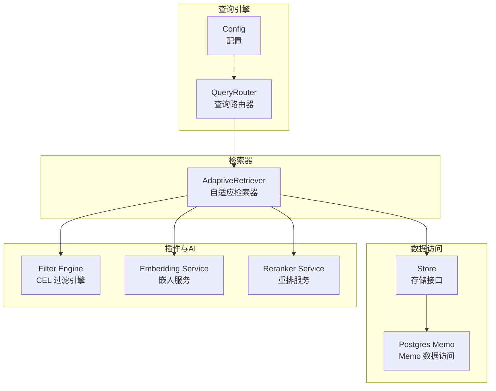
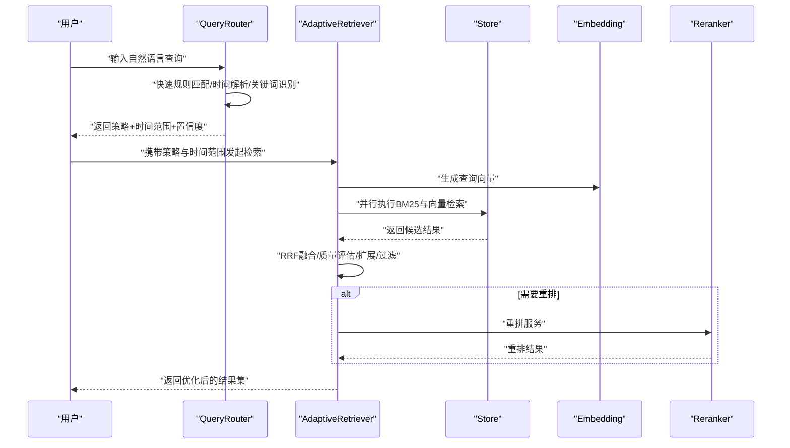
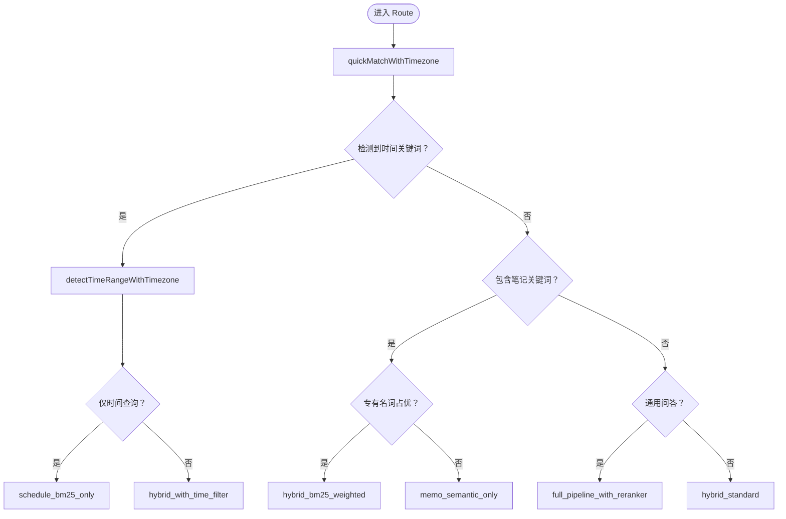
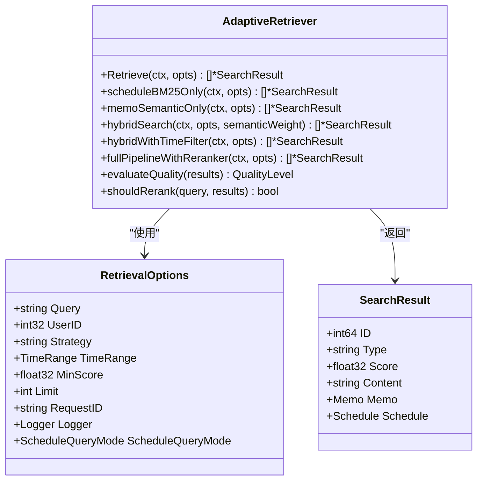
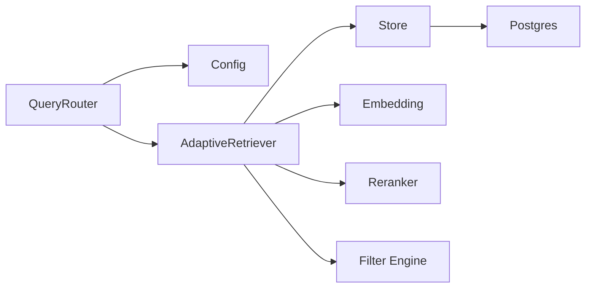

# 查询引擎

<cite>
**本文引用的文件**
- [query_router.go](file://server/queryengine/query_router.go)
- [config.go](file://server/queryengine/config.go)
- [query_router_test.go](file://server/queryengine/query_router_test.go)
- [query_router_benchmark_test.go](file://server/queryengine/query_router_benchmark_test.go)
- [query_router_date_parsing_test.go](file://server/queryengine/query_router_date_parsing_test.go)
- [query_router_today_test.go](file://server/queryengine/query_router_today_test.go)
- [query_router_extended_test.go](file://server/queryengine/query_router_extended_test.go)
- [adaptive_retrieval.go](file://server/retrieval/adaptive_retrieval.go)
- [memo.go](file://store/db/postgres/memo.go)
- [engine.go](file://plugin/filter/engine.go)
</cite>

## 目录
1. [简介](#简介)
2. [项目结构](#项目结构)
3. [核心组件](#核心组件)
4. [架构总览](#架构总览)
5. [详细组件分析](#详细组件分析)
6. [依赖关系分析](#依赖关系分析)
7. [性能考量](#性能考量)
8. [故障排除指南](#故障排除指南)
9. [结论](#结论)
10. [附录](#附录)

## 简介
本文件系统性阐述查询引擎的设计与实现，聚焦以下主题：
- 查询路由的设计原理与实现机制
- 日期解析算法与时间范围过滤
- 查询优化策略与性能基准测试
- 查询路由器如何处理不同记忆查询请求（日程、笔记、通用问答）
- 查询参数解析、时间范围过滤与结果集优化
- 查询引擎扩展与自定义查询处理器的开发指南
- 提供查询示例、性能优化技巧与故障排除方法

## 项目结构
查询引擎位于 server/queryengine 目录，核心由“查询路由器”和“自适应检索器”组成，并通过 store 层与数据库交互，配合插件层的过滤引擎与 AI 能力（嵌入、重排）协同工作。

图表来源
- [query_router.go](file://server/queryengine/query_router.go#L1-L120)
- [config.go](file://server/queryengine/config.go#L1-L120)
- [adaptive_retrieval.go](file://server/retrieval/adaptive_retrieval.go#L1-L120)
- [memo.go](file://store/db/postgres/memo.go#L50-L120)
- [engine.go](file://plugin/filter/engine.go#L1-L120)

章节来源
- [query_router.go](file://server/queryengine/query_router.go#L1-L120)
- [config.go](file://server/queryengine/config.go#L1-L120)
- [adaptive_retrieval.go](file://server/retrieval/adaptive_retrieval.go#L1-L120)
- [memo.go](file://store/db/postgres/memo.go#L50-L120)
- [engine.go](file://plugin/filter/engine.go#L1-L120)

## 核心组件
- 查询路由器（QueryRouter）：负责根据自然语言查询自动判定最佳检索策略、提取语义查询、解析时间范围、确定日程查询模式与置信度。
- 自适应检索器（AdaptiveRetriever）：依据路由决策执行具体检索，包括纯日程、纯笔记语义、混合检索、时间过滤、重排等策略，并进行结果质量评估与优化。
- 配置（Config）：集中管理时间范围、查询限制、检索限制、评分阈值等参数，支持运行时安全更新。
- 存储层（Store/DB）：提供向量检索、BM25 检索、日程过滤等能力；与 CEL 过滤引擎协作生成 SQL 条件。
- 插件与AI：嵌入服务与重排服务作为检索增强手段，提升语义相关性与排序质量。

章节来源
- [query_router.go](file://server/queryengine/query_router.go#L18-L106)
- [config.go](file://server/queryengine/config.go#L7-L120)
- [adaptive_retrieval.go](file://server/retrieval/adaptive_retrieval.go#L24-L115)
- [memo.go](file://store/db/postgres/memo.go#L50-L120)
- [engine.go](file://plugin/filter/engine.go#L13-L120)

## 架构总览
查询引擎采用“路由-检索-优化”的三层架构：
- 路由层：快速规则匹配，优先识别时间关键词与笔记关键词，推导策略与时间范围。
- 检索层：并行执行 BM25 与向量检索，使用 RRF 融合，支持时间过滤、日程模式切换与结果扩展。
- 优化层：质量评估驱动扩展与截断，必要时启用重排服务，最终输出带置信度与时间范围的检索结果。

图表来源
- [query_router.go](file://server/queryengine/query_router.go#L449-L552)
- [adaptive_retrieval.go](file://server/retrieval/adaptive_retrieval.go#L68-L115)
- [adaptive_retrieval.go](file://server/retrieval/adaptive_retrieval.go#L409-L491)

章节来源
- [query_router.go](file://server/queryengine/query_router.go#L449-L552)
- [adaptive_retrieval.go](file://server/retrieval/adaptive_retrieval.go#L68-L115)
- [adaptive_retrieval.go](file://server/retrieval/adaptive_retrieval.go#L409-L491)

## 详细组件分析

### 查询路由器（QueryRouter）
- 设计要点
  - 快速规则匹配：优先检测时间关键词与笔记关键词，95% 场景在 <10ms 内完成。
  - 时间解析：支持相对时间（今天/明天/本周/季度/年）、绝对日期（1月21日、1-21、YYYY-MM-DD）、时段（上午/下午/晚上/中午/凌晨）。
  - 内容提取：去除停用词与时间词，保留语义关键词；对专有名词多的情况采用加权混合策略。
  - 日程查询模式：相对时间（今天/明天/本周等）走标准模式，绝对日期走严格模式。
  - 置信度：不同策略赋予不同置信度，便于上层决策与可视化展示。
- 关键方法
  - Route：对外入口，支持用户时区。
  - quickMatchWithTimezone：快速规则匹配与时间解析。
  - detectTimeRangeWithTimezone/detectTimeRange：解析时间范围。
  - extractContentQuery：提取语义查询。
  - CheckMostlyProperNouns：判断是否主要为专有名词。
  - determineScheduleQueryMode：日程查询模式判定。
- 时间关键词库
  - 相对时间：今天/明天/后天/大后天/昨天/前天/前年/后年/大前年/大后年
  - 周相关：本周/下周/上周/这周
  - 星期：周一至周日及“星期一”等同义词
  - 时段：上午/下午/晚上/中午/凌晨/早上
  - 模糊时间：近期/最近/这几天/这个月/本月/这月/月内/下个月/上个月
  - 年份：今年/明年/去年
  - 季度：一季度/第二季度/第三季度/第四季度
- 时区处理
  - 默认使用 UTC，支持用户时区传入，确保时间解析与日程过滤准确。

图表来源
- [query_router.go](file://server/queryengine/query_router.go#L467-L552)
- [query_router.go](file://server/queryengine/query_router.go#L554-L640)
- [query_router.go](file://server/queryengine/query_router.go#L642-L675)

章节来源
- [query_router.go](file://server/queryengine/query_router.go#L449-L552)
- [query_router.go](file://server/queryengine/query_router.go#L554-L640)
- [query_router.go](file://server/queryengine/query_router.go#L642-L675)

### 自适应检索器（AdaptiveRetriever）
- 设计要点
  - 策略路由：根据 QueryRouter 的策略选择对应检索路径（纯日程、纯笔记、混合、时间过滤、完整管线）。
  - 并行检索：BM25 与向量检索并行执行，使用 RRF 融合，平衡关键词匹配与语义相关性。
  - 质量评估：根据首名分数、分数差距与阈值判断质量等级，决定是否扩展检索或截断结果。
  - 时间过滤：对混合检索结果进行日程时间过滤，支持标准/严格模式。
  - 重排：当查询复杂且结果较多时，启用重排服务进行二次排序。
- 关键方法
  - Retrieve：主入口，接收策略、时间范围、最小分数、限制数量等。
  - scheduleBM25Only：纯日程检索，支持时间范围与查询模式。
  - memoSemanticOnly：纯笔记语义检索，分阶段扩展与过滤。
  - hybridSearch：并行 BM25 与向量检索，RRF 融合。
  - hybridWithTimeFilter：混合检索 + 时间过滤。
  - fullPipelineWithReranker：完整管线（混合 + 重排）。
  - evaluateQuality/shouldRerank：质量评估与重排决策。
- 结果模型
  - SearchResult：包含 ID、类型（memo/schedule）、分数、内容与实体引用。

图表来源
- [adaptive_retrieval.go](file://server/retrieval/adaptive_retrieval.go#L24-L115)
- [adaptive_retrieval.go](file://server/retrieval/adaptive_retrieval.go#L117-L192)
- [adaptive_retrieval.go](file://server/retrieval/adaptive_retrieval.go#L194-L269)
- [adaptive_retrieval.go](file://server/retrieval/adaptive_retrieval.go#L409-L491)

章节来源
- [adaptive_retrieval.go](file://server/retrieval/adaptive_retrieval.go#L68-L115)
- [adaptive_retrieval.go](file://server/retrieval/adaptive_retrieval.go#L117-L192)
- [adaptive_retrieval.go](file://server/retrieval/adaptive_retrieval.go#L194-L269)
- [adaptive_retrieval.go](file://server/retrieval/adaptive_retrieval.go#L409-L491)

### 配置（Config）
- 时间范围配置：最大未来天数、最大时间范围、时区（默认 UTC）。
- 查询限制：最大查询长度、最大结果数、最小分数阈值。
- 检索配置：向量/混合/扩展限制、是否启用重排、最大文档长度。
- 评分配置：BM25 权重范围、语义权重、高质量/中等质量阈值、分数差距阈值、最小重排结果数。
- 运行时安全更新：ApplyConfig/GetConfig 带锁，支持并发读写。

章节来源
- [config.go](file://server/queryengine/config.go#L7-L170)

### 存储与过滤（Store/DB 与 Filter Engine）
- 存储层提供：
  - 向量检索（VectorSearch）
  - BM25 检索（BM25Search）
  - 列表与过滤（ListMemos/ListSchedules）
- 过滤引擎（CEL）：
  - 将过滤表达式编译为条件树，渲染为方言特定 SQL 片段。
  - 与存储层结合，生成 WHERE 条件与参数。

章节来源
- [memo.go](file://store/db/postgres/memo.go#L50-L120)
- [engine.go](file://plugin/filter/engine.go#L13-L120)

## 依赖关系分析
- QueryRouter 依赖 Config 与时间关键词库，输出策略与时间范围。
- AdaptiveRetriever 依赖 Store、Embedding、Reranker 与 Filter 引擎，执行具体检索与优化。
- Store 依赖 DB 实现与 CEL 过滤引擎，生成 SQL 条件与查询结果。
- 配置通过 ApplyConfig/GetConfig 在运行时被 QueryRouter/AdaptiveRetriever 使用。

图表来源
- [query_router.go](file://server/queryengine/query_router.go#L70-L106)
- [config.go](file://server/queryengine/config.go#L106-L119)
- [adaptive_retrieval.go](file://server/retrieval/adaptive_retrieval.go#L55-L66)
- [memo.go](file://store/db/postgres/memo.go#L50-L120)
- [engine.go](file://plugin/filter/engine.go#L13-L120)

章节来源
- [query_router.go](file://server/queryengine/query_router.go#L70-L106)
- [config.go](file://server/queryengine/config.go#L106-L119)
- [adaptive_retrieval.go](file://server/retrieval/adaptive_retrieval.go#L55-L66)
- [memo.go](file://store/db/postgres/memo.go#L50-L120)
- [engine.go](file://plugin/filter/engine.go#L13-L120)

## 性能考量
- 路由性能
  - 快速规则匹配：95% 场景 <10ms；基准测试覆盖路由、时间解析、内容提取、专有名词检测、时间范围验证与并发配置读写。
  - 并发安全：配置读写使用互斥锁，读多写少场景下性能稳定。
- 检索性能
  - 并行检索：BM25 与向量检索并行执行，减少总体延迟。
  - RRF 融合：平衡两类信号，避免重复扫描。
  - 质量评估与扩展：仅在必要时扩大检索规模，避免过度 IO。
  - 内存优化：预分配切片、截断长内容、及时释放大对象引用。
- 基准测试
  - 路由基准：批量查询与并发路由性能测试。
  - 时间解析基准：针对不同日期格式的解析性能。
  - 内容提取与专有名词检测基准：评估高频调用开销。
  - 时间范围验证基准：验证时间范围有效性检查成本。
  - 并发配置基准：80% 读、20% 写场景下的吞吐表现。

章节来源
- [query_router_benchmark_test.go](file://server/queryengine/query_router_benchmark_test.go#L9-L150)
- [query_router_test.go](file://server/queryengine/query_router_test.go#L260-L298)
- [adaptive_retrieval.go](file://server/retrieval/adaptive_retrieval.go#L117-L192)
- [adaptive_retrieval.go](file://server/retrieval/adaptive_retrieval.go#L194-L269)
- [adaptive_retrieval.go](file://server/retrieval/adaptive_retrieval.go#L409-L491)

## 故障排除指南
- 路由策略不符合预期
  - 检查查询中是否包含时间关键词或笔记关键词，确认停用词与时间词是否被正确剔除。
  - 使用测试用例验证路由策略与置信度。
- 时间范围解析异常
  - 确认输入格式是否受支持（相对时间、绝对日期、时段、模糊时间）。
  - 检查时区设置，确保用户时区传入正确。
  - 使用基准测试与单元测试定位解析问题。
- 结果质量不佳
  - 调整最小分数阈值与限制数量。
  - 观察质量评估逻辑，必要时扩展检索或启用重排。
- 性能瓶颈
  - 检查是否频繁更新配置导致锁竞争。
  - 优化查询长度与复杂度，避免不必要的重排。
  - 确保向量与 BM25 检索的限制参数合理。

章节来源
- [query_router_test.go](file://server/queryengine/query_router_test.go#L9-L353)
- [query_router_date_parsing_test.go](file://server/queryengine/query_router_date_parsing_test.go#L9-L209)
- [query_router_today_test.go](file://server/queryengine/query_router_today_test.go#L9-L150)
- [query_router_extended_test.go](file://server/queryengine/query_router_extended_test.go#L9-L474)
- [adaptive_retrieval.go](file://server/retrieval/adaptive_retrieval.go#L68-L115)

## 结论
查询引擎通过“快速规则匹配 + 自适应检索 + 质量评估”的设计，在保证响应速度的同时兼顾检索质量。其模块化结构便于扩展与定制，支持多种查询场景与时间表达，并提供完善的性能基准与故障排除指引。

## 附录

### 查询示例与处理流程
- 纯日程查询（今天/明天/本周）
  - 路由策略：schedule_bm25_only
  - 日程模式：标准模式（相对时间）
  - 示例：输入“今天下午的会议”，解析出“下午”时间段，返回该时间段内的日程。
- 混合查询（带时间 + 内容）
  - 路由策略：hybrid_with_time_filter
  - 示例：输入“1月21日的项目进度”，解析绝对日期“1月21日”，提取“项目进度”作为语义查询，先做混合检索再按时间过滤。
- 笔记查询（包含专有名词）
  - 路由策略：hybrid_bm25_weighted
  - 示例：输入“查找关于React和Vue的笔记”，识别专有名词“React/Vue”，采用加权混合策略。
- 通用问答
  - 路由策略：full_pipeline_with_reranker
  - 示例：输入“总结一下我的工作计划”，启用重排服务进行二次排序。

章节来源
- [query_router_test.go](file://server/queryengine/query_router_test.go#L9-L93)
- [query_router_date_parsing_test.go](file://server/queryengine/query_router_date_parsing_test.go#L111-L156)
- [query_router_extended_test.go](file://server/queryengine/query_router_extended_test.go#L272-L327)

### 查询参数解析与时间范围过滤
- 参数解析
  - 停用词：去除“的”、“有什么”、“查询”、“搜索”、“查找”、“关于”、“安排”、“呢”、“吗”、“啊”、“呀”、“内容”、“笔记”、“备忘”、“记录”等。
  - 时间词：优先匹配最长关键词，避免短词误匹配。
  - 专有名词：使用正则识别大写字母开头的单词，占比高时采用加权混合策略。
- 时间范围过滤
  - 相对时间：本周/下周/上周、周一/周二等，使用标准模式。
  - 绝对日期：1月21日、1-21、YYYY-MM-DD 等，使用严格模式。
  - 时段：上午/下午/晚上/中午/凌晨，按当日时段计算。
  - 模糊时间：近期/最近/这几天、这个月/本月/这月/月内、下个月/上个月、今年/明年/去年、季度等。

章节来源
- [query_router.go](file://server/queryengine/query_router.go#L86-L100)
- [query_router.go](file://server/queryengine/query_router.go#L554-L640)
- [query_router.go](file://server/queryengine/query_router.go#L642-L675)
- [query_router_extended_test.go](file://server/queryengine/query_router_extended_test.go#L329-L399)

### 结果集优化策略
- 质量评估：根据首名分数、分数差距与阈值判断质量等级，决定是否扩展检索。
- 分数过滤：按最小分数阈值过滤低质量结果。
- 截断：按限制数量截断结果，避免超限。
- 重排：当查询复杂且结果较多时，启用重排服务进行二次排序。

章节来源
- [adaptive_retrieval.go](file://server/retrieval/adaptive_retrieval.go#L627-L655)
- [adaptive_retrieval.go](file://server/retrieval/adaptive_retrieval.go#L733-L754)
- [adaptive_retrieval.go](file://server/retrieval/adaptive_retrieval.go#L686-L712)

### 查询引擎扩展与自定义查询处理器开发指南
- 扩展步骤
  - 定义新策略：在 QueryRouter 中增加新规则与时间解析分支，返回相应策略名称与置信度。
  - 注册策略：在 AdaptiveRetriever 的 Retrieve 中新增 case 分支，实现对应检索逻辑。
  - 配置参数：在 Config 中新增相关配置项，通过 ApplyConfig/GetConfig 注入运行时。
  - 性能与测试：编写基准测试与单元测试，覆盖新策略的路由、解析与检索路径。
- 自定义处理器建议
  - 保持快速规则匹配优先，避免阻塞。
  - 对复杂查询启用重排服务，提升排序质量。
  - 控制检索规模与内存占用，避免 OOM。
  - 提供清晰的置信度与时间范围标注，便于前端展示与用户理解。

章节来源
- [query_router.go](file://server/queryengine/query_router.go#L449-L552)
- [adaptive_retrieval.go](file://server/retrieval/adaptive_retrieval.go#L68-L115)
- [config.go](file://server/queryengine/config.go#L106-L119)