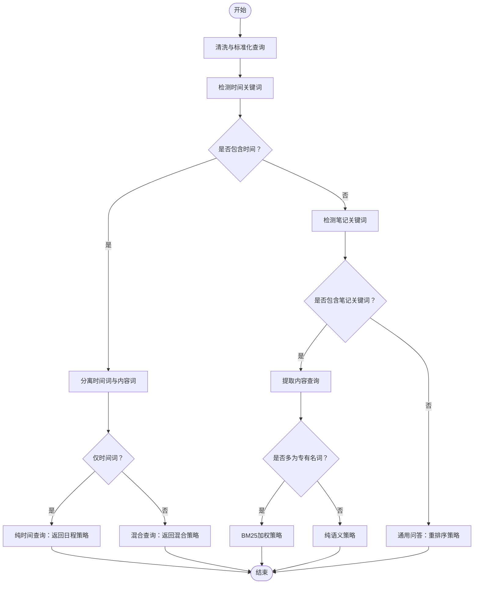

# 检索系统

<cite>
**本文档引用的文件**
- [adaptive_retrieval.go](file://server/retrieval/adaptive_retrieval.go)
- [adaptive_retrieval_test.go](file://server/retrieval/adaptive_retrieval_test.go)
- [query_router.go](file://server/queryengine/query_router.go)
- [query_router_test.go](file://server/queryengine/query_router_test.go)
- [memo_embedding.go](file://store/memo_embedding.go)
- [embedding.go](file://plugin/ai/embedding.go)
- [reranker.go](file://plugin/ai/reranker.go)
- [tiered.go](file://store/cache/tiered.go)
- [cache.go](file://store/cache/cache.go)
- [logger.go](file://server/internal/observability/logger.go)
- [RAG系统研究报告.md](file://docs/archived/cleanup_20260123/RAG_SYSTEM_RESEARCH_REPORT.md)
- [MEMOS重构计划.md](file://docs/MEMOS_REFACTOR_PLAN.md)
</cite>

## 目录
1. [简介](#简介)
2. [项目结构](#项目结构)
3. [核心组件](#核心组件)
4. [架构总览](#架构总览)
5. [详细组件分析](#详细组件分析)
6. [依赖关系分析](#依赖关系分析)
7. [性能考虑](#性能考虑)
8. [故障排查指南](#故障排查指南)
9. [结论](#结论)
10. [附录](#附录)

## 简介
本文件面向检索系统的使用者与维护者，系统性阐述自适应检索算法的实现原理、融合机制与优化策略，覆盖向量检索、语义搜索与传统搜索的协同，以及排序、重排序与去重算法。同时提供性能监控、缓存策略与负载均衡建议，并给出扩展与自定义检索器的开发指南、典型检索场景示例、性能调优方法与错误处理策略。

## 项目结构
检索系统主要由以下模块构成：
- 查询路由与意图识别：根据用户输入自动选择最优检索策略
- 自适应检索器：融合多种检索方式，动态调整策略与参数
- 向量与BM25检索：底层存储层提供向量相似度与全文检索能力
- 重排序服务：对混合检索结果进行细粒度重排
- 缓存与可观测性：三层缓存与结构化日志、指标监控

图表来源
- [query_router.go](file://server/queryengine/query_router.go#L452-L465)
- [adaptive_retrieval.go](file://server/retrieval/adaptive_retrieval.go#L68-L115)
- [memo_embedding.go](file://store/memo_embedding.go#L140-L154)
- [tiered.go](file://store/cache/tiered.go#L93-L132)

章节来源
- [query_router.go](file://server/queryengine/query_router.go#L1-L106)
- [adaptive_retrieval.go](file://server/retrieval/adaptive_retrieval.go#L1-L762)
- [memo_embedding.go](file://store/memo_embedding.go#L1-L155)
- [tiered.go](file://store/cache/tiered.go#L1-L200)

## 核心组件
- 查询路由器：基于关键词、时间表达与停用词规则，快速判定日程、笔记或通用问答场景，输出路由决策与置信度。
- 自适应检索器：根据路由策略并行执行BM25与向量检索，采用RRF融合，支持质量评估、结果扩展、过滤与截断；在需要时调用重排序服务。
- 存储接口：提供向量检索与BM25检索的统一入口，包含参数校验与限制。
- 重排序服务：对外部重排序API进行封装，支持开关与降级。
- 缓存体系：三层缓存（L1内存/L2 Redis/L3数据库回调），支持统计与失效。
- 可观测性：结构化日志与请求上下文，便于追踪与性能分析。

章节来源
- [query_router.go](file://server/queryengine/query_router.go#L452-L552)
- [adaptive_retrieval.go](file://server/retrieval/adaptive_retrieval.go#L68-L407)
- [memo_embedding.go](file://store/memo_embedding.go#L36-L97)
- [reranker.go](file://plugin/ai/reranker.go#L20-L57)
- [tiered.go](file://store/cache/tiered.go#L17-L91)
- [logger.go](file://server/internal/observability/logger.go#L30-L72)

## 架构总览
检索系统采用“路由-并行检索-融合-重排”的流水线式设计。查询路由器负责意图识别与策略选择，自适应检索器负责执行与优化，存储层提供高效检索能力，缓存与可观测性贯穿全链路。

图表来源
- [query_router.go](file://server/queryengine/query_router.go#L452-L552)
- [adaptive_retrieval.go](file://server/retrieval/adaptive_retrieval.go#L410-L491)
- [memo_embedding.go](file://store/memo_embedding.go#L140-L154)
- [reranker.go](file://plugin/ai/reranker.go#L59-L126)

## 详细组件分析

### 查询路由器（QueryRouter）
- 快速规则匹配：优先检测时间关键词、笔记关键词与疑问词，快速输出路由决策与置信度。
- 时间范围解析：支持相对时间（今天/下周）、绝对日期（YYYY-MM-DD/MM-DD）与时段解析，统一使用UTC或用户时区。
- 内容查询提取：去除停用词与时间词，保留语义关键词作为后续语义检索输入。
- 日程查询模式：根据时间表达类型自动选择标准/严格模式，提升日程查询准确性。

图表来源
- [query_router.go](file://server/queryengine/query_router.go#L467-L552)
- [query_router.go](file://server/queryengine/query_router.go#L554-L800)

章节来源
- [query_router.go](file://server/queryengine/query_router.go#L452-L552)
- [query_router_test.go](file://server/queryengine/query_router_test.go#L9-L93)

### 自适应检索器（AdaptiveRetriever）
- 策略路由：支持日程BM25、笔记语义、混合加权、混合+时间过滤、标准混合、完整流水线（含重排）等策略。
- 并行检索：向量与BM25检索并行执行，降低端到端延迟。
- RRF融合：Reciprocal Rank Fusion对两路结果进行融合，支持可调节的语义权重。
- 质量评估与扩展：根据置信度与分数分布动态扩展检索规模，避免过拟合。
- 过滤与截断：按最小分数阈值过滤，按Top-K截断，保证结果质量与性能。
- 重排序：当满足条件时调用重排序服务，否则直接返回融合结果。

图表来源
- [adaptive_retrieval.go](file://server/retrieval/adaptive_retrieval.go#L24-L66)
- [adaptive_retrieval.go](file://server/retrieval/adaptive_retrieval.go#L410-L491)
- [adaptive_retrieval.go](file://server/retrieval/adaptive_retrieval.go#L523-L602)

章节来源
- [adaptive_retrieval.go](file://server/retrieval/adaptive_retrieval.go#L68-L407)
- [adaptive_retrieval_test.go](file://server/retrieval/adaptive_retrieval_test.go#L86-L142)
- [adaptive_retrieval_test.go](file://server/retrieval/adaptive_retrieval_test.go#L469-L560)

### 向量检索与BM25检索
- 参数校验：限制查询长度、结果上限与评分阈值，防止DoS与性能问题。
- 向量检索：基于用户ID与查询向量进行相似度检索，返回带分数的结果。
- BM25检索：基于全文索引与相关性评分，返回带分数的结果。

图表来源
- [memo_embedding.go](file://store/memo_embedding.go#L36-L97)
- [memo_embedding.go](file://store/memo_embedding.go#L140-L154)

章节来源
- [memo_embedding.go](file://store/memo_embedding.go#L36-L97)

### 重排序服务（Reranker）
- 接口抽象：支持启用状态检查与禁用时的降级行为。
- 外部API：封装重排序服务调用，设置超时与连接池参数。
- 结果排序：按重排序分数降序排列，支持Top-N裁剪。

图表来源
- [reranker.go](file://plugin/ai/reranker.go#L20-L57)
- [reranker.go](file://plugin/ai/reranker.go#L59-L126)

章节来源
- [reranker.go](file://plugin/ai/reranker.go#L20-L127)

### 缓存策略与统计
- 三层缓存：L1内存缓存（默认开启）、L2 Redis缓存（可选）、L3数据库回调。
- 命中与失效：优先L1，其次L2，最后L3回源；支持主动失效与刷新。
- 统计信息：提供各层启用状态与大小信息，便于运维监控。

图表来源
- [tiered.go](file://store/cache/tiered.go#L93-L132)
- [cache.go](file://store/cache/cache.go#L66-L120)

章节来源
- [tiered.go](file://store/cache/tiered.go#L17-L200)
- [cache.go](file://store/cache/cache.go#L1-L328)

### 可观测性与日志
- 结构化日志：统一字段包括请求ID、用户ID、代理类型、耗时、消息长度等。
- 请求上下文：在请求生命周期内传递上下文，便于跨模块追踪。
- 指标监控：建议采集检索延迟、缓存命中率、API成本与重排序调用频率等指标。

章节来源
- [logger.go](file://server/internal/observability/logger.go#L11-L72)
- [RAG系统研究报告.md](file://docs/archived/cleanup_20260123/RAG_SYSTEM_RESEARCH_REPORT.md#L1101-L1204)
- [MEMOS重构计划.md](file://docs/MEMOS_REFACTOR_PLAN.md#L1029-L1071)

## 依赖关系分析
- 查询路由器依赖语言规则库（时间关键词、停用词、专有名词正则）与用户时区。
- 自适应检索器依赖嵌入服务与重排序服务接口，内部协调BM25与向量检索。
- 存储层提供向量与BM25检索接口，参数校验确保安全性与性能。
- 缓存层为存储与检索提供透明加速，支持统计与清理。

图表来源
- [query_router.go](file://server/queryengine/query_router.go#L70-L106)
- [adaptive_retrieval.go](file://server/retrieval/adaptive_retrieval.go#L55-L66)
- [memo_embedding.go](file://store/memo_embedding.go#L140-L154)
- [tiered.go](file://store/cache/tiered.go#L93-L132)

章节来源
- [query_router.go](file://server/queryengine/query_router.go#L1-L106)
- [adaptive_retrieval.go](file://server/retrieval/adaptive_retrieval.go#L24-L66)
- [memo_embedding.go](file://store/memo_embedding.go#L140-L154)
- [tiered.go](file://store/cache/tiered.go#L17-L91)

## 性能考虑
- 并行检索：向量与BM25检索并行执行，显著降低端到端延迟。
- RRF融合：在不牺牲语义一致性的情况下，提升召回多样性。
- 动态扩展：在中等质量结果时适度扩大检索规模，提高召回。
- 缓存策略：合理配置L1/L2容量与TTL，结合热点数据特征提升命中率。
- 参数限制：严格限制查询长度与结果上限，避免资源滥用。
- 监控告警：建立延迟、成本、命中率与错误率的监控与告警。

## 故障排查指南
- 查询路由异常
  - 症状：策略选择不符合预期
  - 排查：检查时间关键词库、停用词列表与专有名词正则配置
  - 参考
    - [query_router.go](file://server/queryengine/query_router.go#L108-L447)
    - [query_router_test.go](file://server/queryengine/query_router_test.go#L9-L93)
- 检索性能下降
  - 症状：延迟升高、QPS下降
  - 排查：检查缓存命中率、重排序调用频率与API成本
  - 参考
    - [tiered.go](file://store/cache/tiered.go#L189-L208)
    - [RAG系统研究报告.md](file://docs/archived/cleanup_20260123/RAG_SYSTEM_RESEARCH_REPORT.md#L1101-L1204)
- 重排序失败降级
  - 症状：重排序服务不可用导致检索变慢
  - 排查：确认服务开关、超时与连接池配置
  - 参考
    - [reranker.go](file://plugin/ai/reranker.go#L59-L126)
- 结果质量不佳
  - 症状：相关性差、重复多
  - 排查：调整RRF权重、最小分数阈值与Top-K；检查去重逻辑
  - 参考
    - [adaptive_retrieval.go](file://server/retrieval/adaptive_retrieval.go#L523-L602)
    - [adaptive_retrieval.go](file://server/retrieval/adaptive_retrieval.go#L657-L684)

章节来源
- [query_router.go](file://server/queryengine/query_router.go#L108-L447)
- [query_router_test.go](file://server/queryengine/query_router_test.go#L9-L93)
- [tiered.go](file://store/cache/tiered.go#L189-L208)
- [reranker.go](file://plugin/ai/reranker.go#L59-L126)
- [adaptive_retrieval.go](file://server/retrieval/adaptive_retrieval.go#L523-L684)

## 结论
该检索系统通过“路由-并行检索-融合-重排”的架构实现了对日程、笔记与通用问答的自适应支持。RRF融合、质量评估与动态扩展提升了召回与相关性，缓存与可观测性保障了性能与稳定性。建议在生产环境中结合监控指标持续优化策略参数与缓存配置，以获得最佳的成本与性能平衡。

## 附录

### 检索场景示例
- 纯日程查询：如“今天有什么安排”，路由到日程BM25策略，自动选择标准模式。
- 混合查询：如“今天下午关于AI项目的会议”，同时包含时间与内容，路由到混合+时间过滤策略。
- 笔记语义：如“总结Python学习计划”，路由到纯语义策略，进行向量检索。
- 通用问答：如“如何提高检索准确率”，路由到完整流水线策略，必要时进行重排。

章节来源
- [query_router_test.go](file://server/queryengine/query_router_test.go#L14-L93)

### 性能调优方法
- 调整RRF权重：根据业务侧重调整语义与BM25权重（0.5为平衡）。
- 设置合理阈值：最小分数阈值与Top-K限制需结合业务与SLA。
- 缓存优化：增大L1容量、缩短TTL以提升命中率；在多实例部署中启用L2 Redis。
- 监控驱动：基于延迟、成本与命中率指标进行A/B对比实验。

章节来源
- [adaptive_retrieval.go](file://server/retrieval/adaptive_retrieval.go#L523-L602)
- [tiered.go](file://store/cache/tiered.go#L49-L59)
- [RAG系统研究报告.md](file://docs/archived/cleanup_20260123/RAG_SYSTEM_RESEARCH_REPORT.md#L1101-L1204)

### 错误处理策略
- 输入校验：查询长度、时间范围合法性检查与日志记录。
- 服务降级：重排序服务不可用时返回原始融合结果。
- 并发保护：并行检索通道的错误聚合与优雅降级。
- 可观测性：统一日志字段与请求追踪ID，便于定位问题。

章节来源
- [adaptive_retrieval.go](file://server/retrieval/adaptive_retrieval.go#L78-L81)
- [adaptive_retrieval.go](file://server/retrieval/adaptive_retrieval.go#L466-L485)
- [logger.go](file://server/internal/observability/logger.go#L11-L72)

### 扩展与自定义检索器开发指南
- 新增策略：在路由层定义新策略与置信度，在自适应检索器中实现对应分支。
- 自定义融合：实现新的融合算法（如学习排序）替代RRF，保持统一的SearchResult接口。
- 自定义重排序：实现RerankerService接口，接入新的重排模型或服务。
- 自定义缓存：实现RedisCacheInterface或替换为其他缓存后端，统一TieredCache接口。

章节来源
- [query_router.go](file://server/queryengine/query_router.go#L452-L552)
- [adaptive_retrieval.go](file://server/retrieval/adaptive_retrieval.go#L410-L491)
- [reranker.go](file://plugin/ai/reranker.go#L20-L57)
- [tiered.go](file://store/cache/tiered.go#L17-L91)