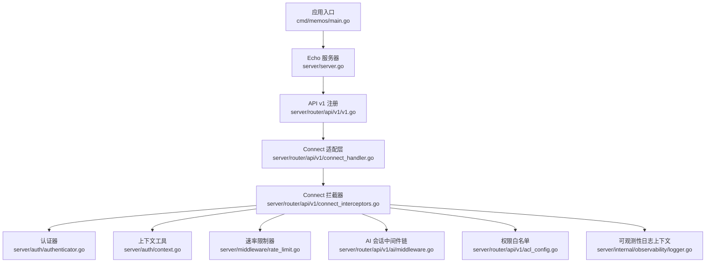
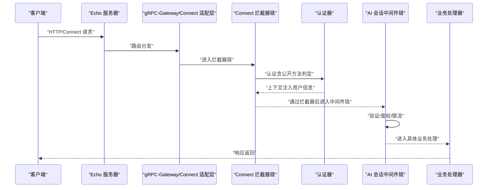
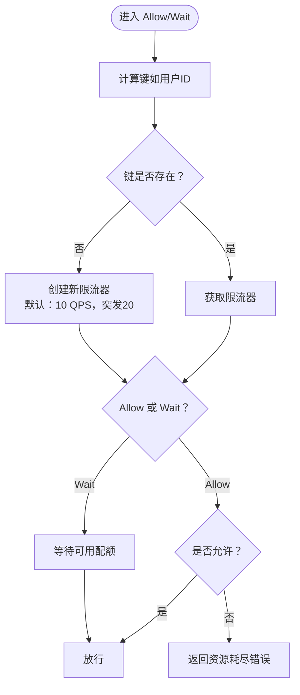
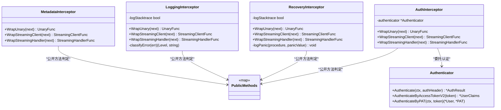
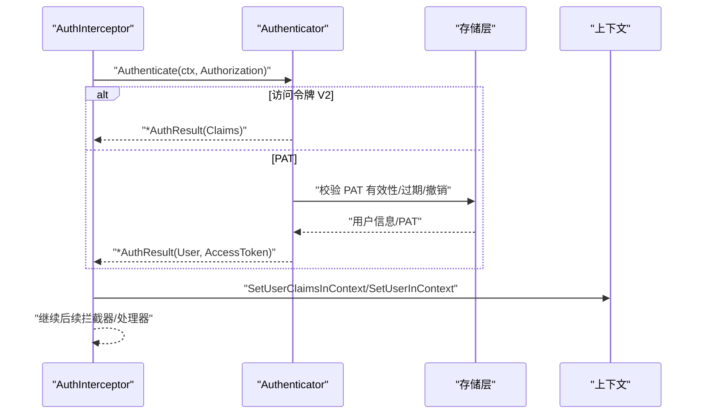
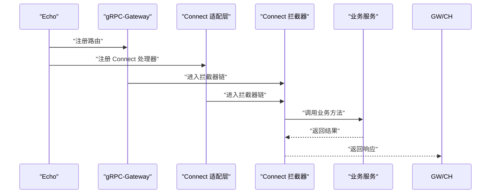
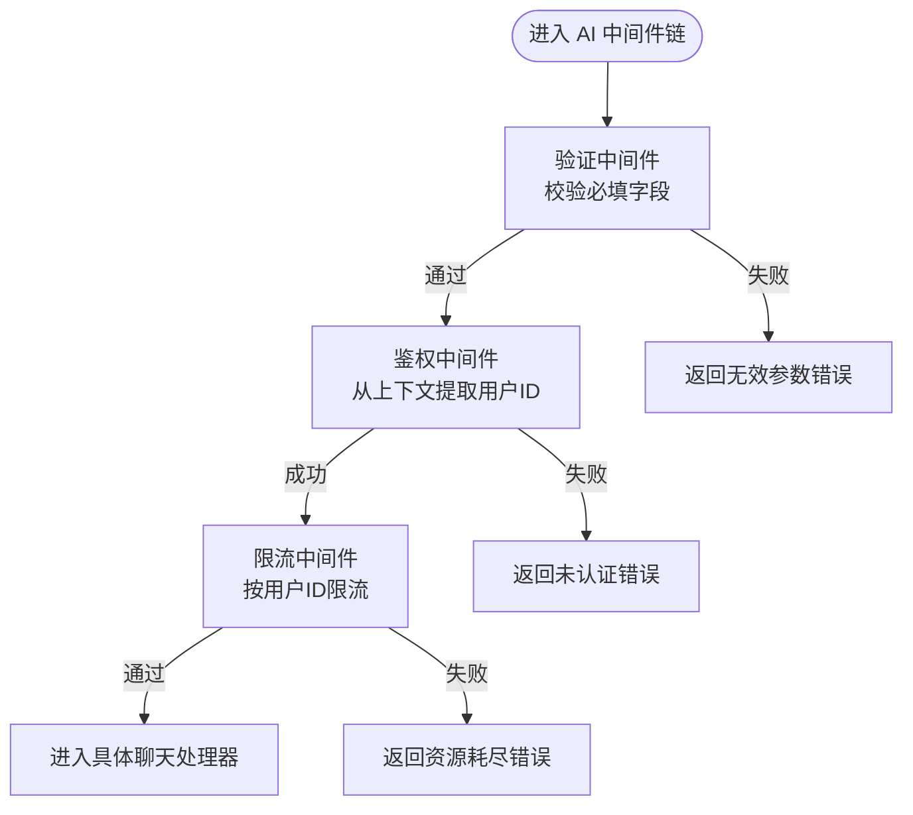
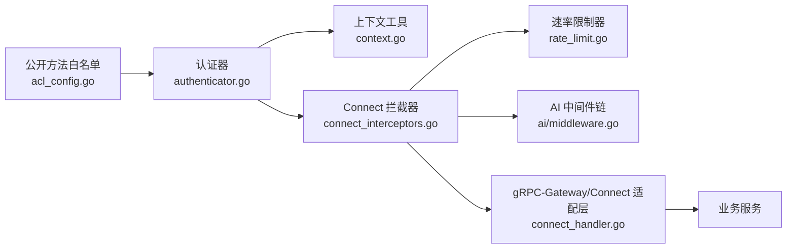

# 中间件与拦截器

<cite>
**本文引用的文件**
- [server/middleware/rate_limit.go](file://server/middleware/rate_limit.go)
- [server/router/api/v1/connect_interceptors.go](file://server/router/api/v1/connect_interceptors.go)
- [server/router/api/v1/connect_handler.go](file://server/router/api/v1/connect_handler.go)
- [server/router/api/v1/ai/middleware.go](file://server/router/api/v1/ai/middleware.go)
- [server/auth/authenticator.go](file://server/auth/authenticator.go)
- [server/auth/context.go](file://server/auth/context.go)
- [server/router/api/v1/acl_config.go](file://server/router/api/v1/acl_config.go)
- [server/router/api/v1/v1.go](file://server/router/api/v1/v1.go)
- [server/internal/observability/logger.go](file://server/internal/observability/logger.go)
- [server/server.go](file://server/server.go)
- [cmd/memos/main.go](file://cmd/memos/main.go)
</cite>

## 目录
1. [简介](#简介)
2. [项目结构](#项目结构)
3. [核心组件](#核心组件)
4. [架构总览](#架构总览)
5. [详细组件分析](#详细组件分析)
6. [依赖关系分析](#依赖关系分析)
7. [性能考量](#性能考量)
8. [故障排查指南](#故障排查指南)
9. [结论](#结论)
10. [附录](#附录)

## 简介
本文件系统化梳理了本项目的中间件与拦截器体系，覆盖以下方面：
- 中间件系统架构与执行顺序
- 内置中间件功能：认证、授权、日志、错误恢复、速率限制
- 自定义中间件开发与集成方法（gRPC 与 Connect）
- 拦截器在 gRPC 与 HTTP（Connect）请求中的作用与实现
- 性能监控、追踪与可观测性配置思路
- 最佳实践与常见问题解决方案

## 项目结构
围绕中间件与拦截器的关键目录与文件如下：
- 服务端入口与 HTTP 路由：server/server.go、cmd/memos/main.go
- Connect 协议拦截器：server/router/api/v1/connect_interceptors.go
- Connect 适配层与 gRPC-Gateway 集成：server/router/api/v1/connect_handler.go、server/router/api/v1/v1.go
- 认证与上下文：server/auth/authenticator.go、server/auth/context.go
- 权限白名单配置：server/router/api/v1/acl_config.go
- AI 会话链式中间件：server/router/api/v1/ai/middleware.go
- 速率限制中间件：server/middleware/rate_limit.go
- 可观测性日志上下文：server/internal/observability/logger.go

图表来源
- [cmd/memos/main.go](file://cmd/memos/main.go#L1-L184)
- [server/server.go](file://server/server.go#L1-L203)
- [server/router/api/v1/v1.go](file://server/router/api/v1/v1.go#L120-L159)
- [server/router/api/v1/connect_handler.go](file://server/router/api/v1/connect_handler.go#L1-L541)
- [server/router/api/v1/connect_interceptors.go](file://server/router/api/v1/connect_interceptors.go#L1-L275)
- [server/auth/authenticator.go](file://server/auth/authenticator.go#L1-L166)
- [server/auth/context.go](file://server/auth/context.go#L1-L84)
- [server/middleware/rate_limit.go](file://server/middleware/rate_limit.go#L1-L49)
- [server/router/api/v1/ai/middleware.go](file://server/router/api/v1/ai/middleware.go#L1-L216)
- [server/router/api/v1/acl_config.go](file://server/router/api/v1/acl_config.go#L1-L42)
- [server/internal/observability/logger.go](file://server/internal/observability/logger.go#L1-L152)

章节来源
- [server/server.go](file://server/server.go#L1-L203)
- [cmd/memos/main.go](file://cmd/memos/main.go#L1-L184)

## 核心组件
- 速率限制中间件：基于令牌桶算法，按用户维度进行限流，支持阻塞等待与非阻塞检查。
- Connect 拦截器：统一处理元数据转换、日志分级、错误恢复与认证。
- 认证器与上下文：支持访问令牌 V2（无状态）、个人访问令牌（PAT）与刷新令牌校验，并在上下文中注入用户信息。
- 权限白名单：集中维护无需认证的公开接口，确保 gRPC-Gateway 与 Connect 拦截器一致行为。
- AI 会话中间件链：验证输入、鉴权、限流等职责分离，便于扩展与组合。
- 可观测性日志上下文：为每次请求生成唯一标识、附加用户与代理类型信息，便于追踪。

章节来源
- [server/middleware/rate_limit.go](file://server/middleware/rate_limit.go#L1-L49)
- [server/router/api/v1/connect_interceptors.go](file://server/router/api/v1/connect_interceptors.go#L1-L275)
- [server/auth/authenticator.go](file://server/auth/authenticator.go#L1-L166)
- [server/auth/context.go](file://server/auth/context.go#L1-L84)
- [server/router/api/v1/acl_config.go](file://server/router/api/v1/acl_config.go#L1-L42)
- [server/router/api/v1/ai/middleware.go](file://server/router/api/v1/ai/middleware.go#L1-L216)
- [server/internal/observability/logger.go](file://server/internal/observability/logger.go#L1-L152)

## 架构总览
下图展示从客户端到服务端的请求路径与各层中间件/拦截器的调用顺序：

图表来源
- [server/server.go](file://server/server.go#L1-L203)
- [server/router/api/v1/v1.go](file://server/router/api/v1/v1.go#L120-L159)
- [server/router/api/v1/connect_handler.go](file://server/router/api/v1/connect_handler.go#L1-L541)
- [server/router/api/v1/connect_interceptors.go](file://server/router/api/v1/connect_interceptors.go#L1-L275)
- [server/router/api/v1/ai/middleware.go](file://server/router/api/v1/ai/middleware.go#L1-L216)

## 详细组件分析

### 速率限制中间件
- 设计要点
  - 基于并发安全的映射表保存每个键对应的限流器
  - 默认策略：每秒 10 次请求，突发 20 次
  - 提供 Allow 与 Wait 两种模式，满足不同场景
- 使用方式
  - 在 Connect 拦截器或 AI 中间件链中按用户 ID 作为键进行限流
- 复杂度
  - 查询/创建限流器为 O(1)，加锁粒度为单个键
- 注意事项
  - 键选择需确保区分度（如按用户 ID），避免跨用户串扰
  - 对高 QPS 场景可考虑共享全局限流器或引入分布式缓存

图表来源
- [server/middleware/rate_limit.go](file://server/middleware/rate_limit.go#L1-L49)

章节来源
- [server/middleware/rate_limit.go](file://server/middleware/rate_limit.go#L1-L49)

### Connect 拦截器（认证、日志、错误恢复、元数据）
- 元数据拦截器
  - 将 HTTP 头转换为 gRPC 元数据，便于服务层统一读取
  - 设置防浏览器缓存响应头
- 日志拦截器
  - 基于 Connect 错误码分类日志级别（INFO/ERROR）
  - 可选输出堆栈信息
- 错误恢复拦截器
  - 捕获 panic 并返回内部错误，必要时输出堆栈
- 认证拦截器
  - 支持访问令牌 V2（无状态）与 PAT
  - 结合公开方法白名单强制鉴权
  - 将用户信息写入上下文（用户 ID、访问令牌、声明）

图表来源
- [server/router/api/v1/connect_interceptors.go](file://server/router/api/v1/connect_interceptors.go#L1-L275)
- [server/auth/authenticator.go](file://server/auth/authenticator.go#L1-L166)
- [server/router/api/v1/acl_config.go](file://server/router/api/v1/acl_config.go#L1-L42)

章节来源
- [server/router/api/v1/connect_interceptors.go](file://server/router/api/v1/connect_interceptors.go#L1-L275)
- [server/auth/authenticator.go](file://server/auth/authenticator.go#L1-L166)
- [server/router/api/v1/acl_config.go](file://server/router/api/v1/acl_config.go#L1-L42)

### 认证器与上下文
- 认证流程
  - 优先尝试访问令牌 V2（无状态）
  - 其次尝试 PAT（带过期与撤销检查）
  - 刷新令牌用于换取新访问令牌（数据库校验）
- 上下文注入
  - 用户 ID、访问令牌、用户声明分别注入到上下文
  - 服务层通过工具函数读取

图表来源
- [server/router/api/v1/connect_interceptors.go](file://server/router/api/v1/connect_interceptors.go#L201-L275)
- [server/auth/authenticator.go](file://server/auth/authenticator.go#L133-L166)
- [server/auth/context.go](file://server/auth/context.go#L1-L84)

章节来源
- [server/auth/authenticator.go](file://server/auth/authenticator.go#L1-L166)
- [server/auth/context.go](file://server/auth/context.go#L1-L84)

### gRPC-Gateway 与 Connect 的统一接入
- gRPC-Gateway 注册时附加认证中间件，行为与 Connect 拦截器一致（基于公开方法白名单）
- Connect 适配层将 gRPC 服务包装为 Connect 接口，保持协议无关的业务逻辑

图表来源
- [server/router/api/v1/v1.go](file://server/router/api/v1/v1.go#L120-L159)
- [server/router/api/v1/connect_handler.go](file://server/router/api/v1/connect_handler.go#L1-L541)

章节来源
- [server/router/api/v1/v1.go](file://server/router/api/v1/v1.go#L120-L159)
- [server/router/api/v1/connect_handler.go](file://server/router/api/v1/connect_handler.go#L1-L541)

### AI 会话中间件链
- 中间件职责分离：验证、鉴权、限流
- 通过链式组合实现可插拔扩展
- 将用户 ID 注入请求对象，便于后续处理

图表来源
- [server/router/api/v1/ai/middleware.go](file://server/router/api/v1/ai/middleware.go#L1-L216)

章节来源
- [server/router/api/v1/ai/middleware.go](file://server/router/api/v1/ai/middleware.go#L1-L216)

### 可观测性与追踪
- 请求上下文
  - 自动生成请求 ID，记录用户 ID、代理类型、开始时间
  - 提供 Info/Warn/Error 等便捷日志方法
- 字段约定
  - request_id、user_id、agent_type、duration_ms、error_code 等
- 使用建议
  - 在拦截器与业务处理中统一使用 WithFields 扩展日志字段
  - 在关键路径记录事件类型与迭代次数，便于性能分析

章节来源
- [server/internal/observability/logger.go](file://server/internal/observability/logger.go#L1-L152)

## 依赖关系分析
- 拦截器依赖认证器与公开方法白名单，确保鉴权一致性
- Connect 适配层与 gRPC-Gateway 共享同一套拦截器链，降低重复逻辑
- AI 中间件链复用速率限制器，形成统一的限流策略
- 服务端入口负责启动 Echo 服务器并注册路由，拦截器在路由层生效

图表来源
- [server/router/api/v1/acl_config.go](file://server/router/api/v1/acl_config.go#L1-L42)
- [server/auth/authenticator.go](file://server/auth/authenticator.go#L1-L166)
- [server/auth/context.go](file://server/auth/context.go#L1-L84)
- [server/router/api/v1/connect_interceptors.go](file://server/router/api/v1/connect_interceptors.go#L1-L275)
- [server/middleware/rate_limit.go](file://server/middleware/rate_limit.go#L1-L49)
- [server/router/api/v1/ai/middleware.go](file://server/router/api/v1/ai/middleware.go#L1-L216)
- [server/router/api/v1/connect_handler.go](file://server/router/api/v1/connect_handler.go#L1-L541)

章节来源
- [server/router/api/v1/acl_config.go](file://server/router/api/v1/acl_config.go#L1-L42)
- [server/router/api/v1/connect_interceptors.go](file://server/router/api/v1/connect_interceptors.go#L1-L275)
- [server/router/api/v1/ai/middleware.go](file://server/router/api/v1/ai/middleware.go#L1-L216)

## 性能考量
- 速率限制
  - 合理设置每用户 QPS 与突发值，避免突发流量导致排队过长
  - 对长尾请求可采用 Wait 模式，平衡吞吐与延迟
- 日志与追踪
  - 控制日志量级，避免高频错误日志影响性能
  - 使用请求 ID 串联日志，定位热点路径
- 中间件顺序
  - 将轻量中间件（如元数据转换）置于前部，尽早短路失败请求
  - 将昂贵操作（如数据库查询）延后至鉴权之后

## 故障排查指南
- 认证失败
  - 检查 Authorization 头格式与有效期
  - 确认公开方法白名单是否正确匹配
- 未登录访问受保护接口
  - 确认拦截器已启用且公开方法配置一致
- 速率限制触发
  - 检查用户键是否正确（如按用户 ID）
  - 调整 QPS 与突发值，或引入多级限流
- Panic 导致 5xx
  - 查看错误恢复拦截器日志中的堆栈信息
  - 定位异常抛出点并修复

章节来源
- [server/router/api/v1/connect_interceptors.go](file://server/router/api/v1/connect_interceptors.go#L160-L200)
- [server/router/api/v1/acl_config.go](file://server/router/api/v1/acl_config.go#L1-L42)
- [server/middleware/rate_limit.go](file://server/middleware/rate_limit.go#L1-L49)

## 结论
本项目通过 Connect 拦截器与 gRPC-Gateway 的统一接入，实现了认证、日志、错误恢复与速率限制等横切关注点的一致化处理；结合公开方法白名单与上下文工具，确保了鉴权策略的可维护性与可扩展性。AI 会话中间件链进一步将职责拆分，便于按需组合与演进。配合可观测性日志上下文，整体具备良好的可追踪性与运维体验。

## 附录

### 自定义中间件开发与集成方法
- 开发步骤
  - 明确职责边界（如鉴权、限流、审计）
  - 实现 WrapUnary/WrapStreamingHandler 等方法
  - 在 Connect 适配层或 gRPC-Gateway 注册阶段插入
- 集成方式
  - Connect：在构建拦截器链时追加自定义拦截器
  - gRPC-Gateway：在注册路由时附加认证中间件（与公开方法白名单保持一致）

章节来源
- [server/router/api/v1/connect_interceptors.go](file://server/router/api/v1/connect_interceptors.go#L1-L275)
- [server/router/api/v1/v1.go](file://server/router/api/v1/v1.go#L120-L159)