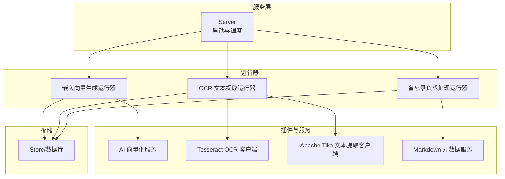
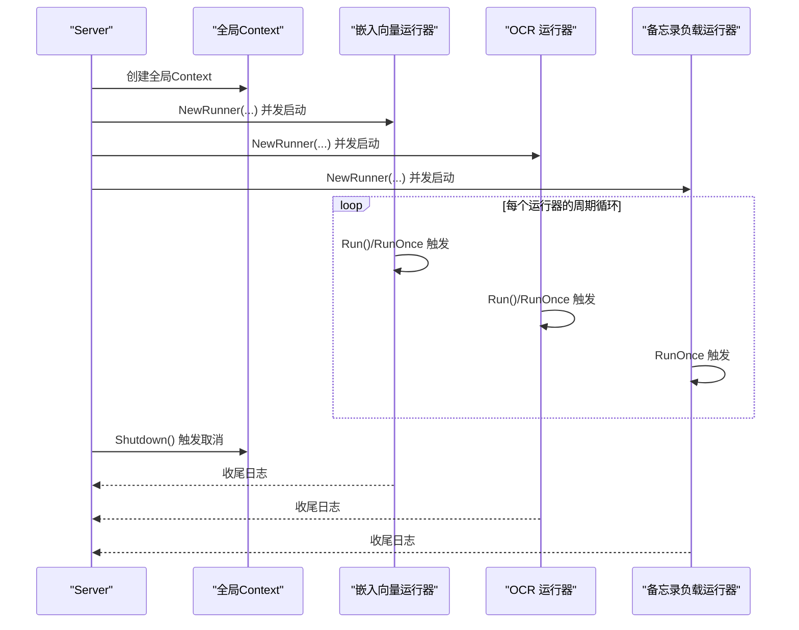
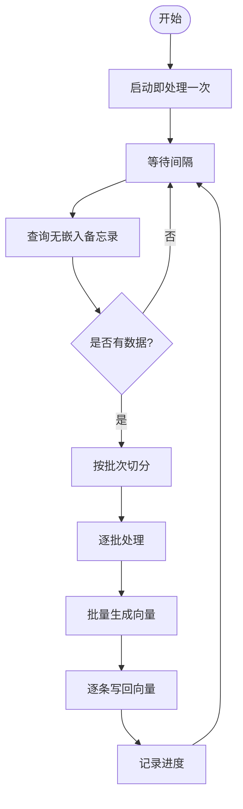
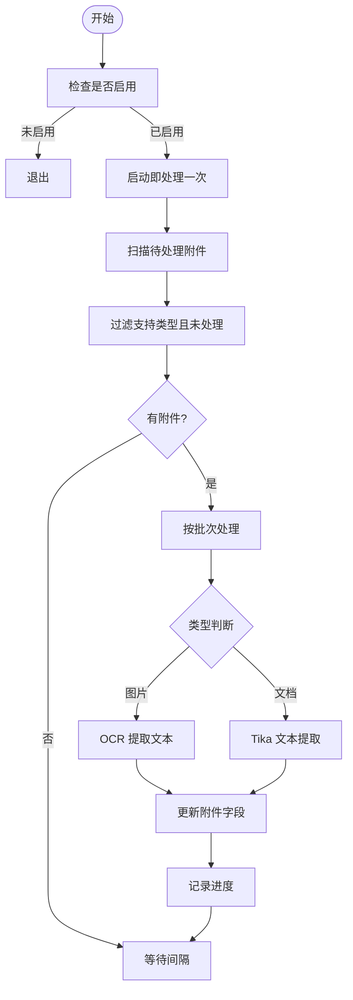
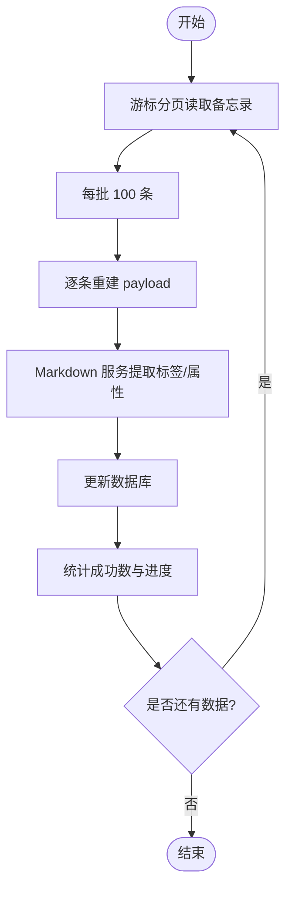
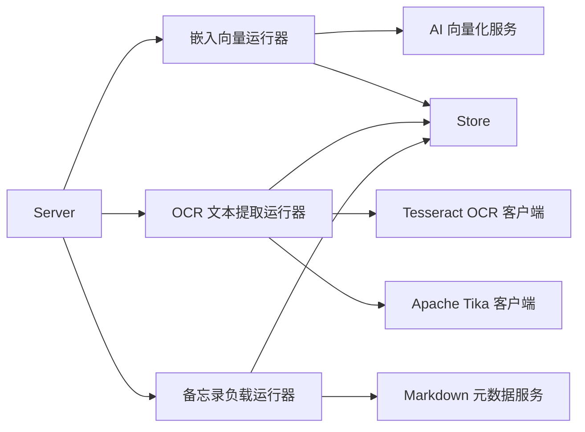

# 后台运行器

<cite>
**本文档引用的文件**
- [server/server.go](file://server/server.go)
- [internal/profile/profile.go](file://internal/profile/profile.go)
- [server/runner/embedding/runner.go](file://server/runner/embedding/runner.go)
- [plugin/ai/embedding.go](file://plugin/ai/embedding.go)
- [server/runner/ocr/runner.go](file://server/runner/ocr/runner.go)
- [plugin/ocr/tesseract.go](file://plugin/ocr/tesseract.go)
- [plugin/textextract/tika.go](file://plugin/textextract/tika.go)
- [server/runner/memopayload/runner.go](file://server/runner/memopayload/runner.go)
- [plugin/markdown/markdown.go](file://plugin/markdown/markdown.go)
- [store/memo.go](file://store/memo.go)
- [.env.example](file://.env.example)
- [deploy/aliyun/.env.prod.example](file://deploy/aliyun/.env.prod.example)
</cite>

## 目录
1. [简介](#简介)
2. [项目结构](#项目结构)
3. [核心组件](#核心组件)
4. [架构总览](#架构总览)
5. [详细组件分析](#详细组件分析)
6. [依赖关系分析](#依赖关系分析)
7. [性能考量与调优](#性能考量与调优)
8. [故障排除指南](#故障排除指南)
9. [结论](#结论)
10. [附录](#附录)

## 简介
本文件系统性阐述后台运行器的设计理念与架构模式，覆盖以下三类运行器：
- 嵌入向量生成运行器：基于 AI 向量化服务，周期性为备忘录内容生成向量并写入数据库。
- OCR 文本提取运行器：周期性扫描附件，对图片进行 OCR 文字识别、对文档进行文本抽取，并更新附件元数据。
- 备忘录负载处理运行器：重建备忘录的负载（payload），包括标签与属性等元信息。

文档还涵盖运行器生命周期管理、错误处理与资源清理、性能监控与调优、配置示例与故障排除方法。

## 项目结构
后台运行器位于 server/runner 下，分别对应三个子包：
- embedding：向量嵌入生成
- ocr：OCR 与文本提取
- memopayload：备忘录负载重建

运行器由服务启动时统一注册并并发执行，通过上下文控制生命周期，支持优雅关停与资源回收。

图表来源
- [server/server.go](file://server/server.go#L141-L179)
- [server/runner/embedding/runner.go](file://server/runner/embedding/runner.go#L1-L139)
- [server/runner/ocr/runner.go](file://server/runner/ocr/runner.go#L1-L303)
- [server/runner/memopayload/runner.go](file://server/runner/memopayload/runner.go#L1-L89)

章节来源
- [server/server.go](file://server/server.go#L141-L179)

## 核心组件
- 嵌入向量生成运行器：定时扫描未生成向量的备忘录，按批次调用 AI 向量化服务生成向量并写回数据库。
- OCR 文本提取运行器：定时扫描待处理的附件，根据类型选择 OCR 或文本提取，异步限制并发，更新附件的 OCR 文本与抽取文本。
- 备忘录负载处理运行器：遍历所有备忘录，使用 Markdown 服务一次性提取标签与属性，批量更新数据库。

章节来源
- [server/runner/embedding/runner.go](file://server/runner/embedding/runner.go#L1-L139)
- [server/runner/ocr/runner.go](file://server/runner/ocr/runner.go#L1-L303)
- [server/runner/memopayload/runner.go](file://server/runner/memopayload/runner.go#L1-L89)

## 架构总览
运行器在服务启动时被创建并并发运行，各自通过时间轮询（ticker）驱动周期任务；同时支持手动触发一次性的处理流程。运行器均以 context 控制生命周期，服务关停时统一取消。

图表来源
- [server/server.go](file://server/server.go#L141-L179)
- [server/runner/embedding/runner.go](file://server/runner/embedding/runner.go#L34-L56)
- [server/runner/ocr/runner.go](file://server/runner/ocr/runner.go#L72-L109)
- [server/runner/memopayload/runner.go](file://server/runner/memopayload/runner.go#L26-L72)

## 详细组件分析

### 嵌入向量生成运行器
- 设计理念
  - 周期性批处理：通过间隔与批次参数平衡吞吐与资源占用。
  - 上下文感知：在批处理与查询阶段均检查取消信号，确保可中断。
  - 模型解耦：通过接口抽象向量化服务，便于替换提供商与模型。
- 关键流程
  - 启动即执行一次处理，随后按间隔循环。
  - 查询“无嵌入”的备忘录，按批次调用 EmbedBatch，逐条写回数据库。
- 错误处理
  - 查询失败、批次处理失败均记录错误并继续后续批次。
  - 单条写回失败记录日志但不影响整体流程。
- 性能要点
  - 小批次降低内存峰值，长间隔减少 CPU 竞争。
  - 批量接口优于逐条调用，减少网络/服务往返。

图表来源
- [server/runner/embedding/runner.go](file://server/runner/embedding/runner.go#L34-L95)

章节来源
- [server/runner/embedding/runner.go](file://server/runner/embedding/runner.go#L1-L139)
- [plugin/ai/embedding.go](file://plugin/ai/embedding.go)

### OCR 文本提取运行器
- 设计理念
  - 条件启用：仅当任一 OCR 或文本提取功能启用时才启动。
  - 类型判定：根据 MIME 类型决定走 OCR（图片）或文本提取（文档）。
  - 并发控制：通过信号量限制异步处理并发度，避免资源耗尽。
  - 异步处理：上传附件时可触发异步处理，带超时上下文。
- 关键流程
  - 启动即处理一次，随后按间隔扫描附件。
  - 过滤“未处理且支持类型”的附件，按批次处理。
  - 对图片调用 OCR，对文档调用 Tika 文本提取，更新附件字段。
- 错误处理
  - 单附件处理失败仅记录警告，不影响其他附件。
  - 异步处理失败记录错误并释放并发槽位。
- 性能要点
  - 并发上限默认 10，可根据资源调整。
  - 批次大小与间隔可调，兼顾吞吐与延迟。

图表来源
- [server/runner/ocr/runner.go](file://server/runner/ocr/runner.go#L72-L148)
- [plugin/ocr/tesseract.go](file://plugin/ocr/tesseract.go#L19-L27)
- [plugin/textextract/tika.go](file://plugin/textextract/tika.go#L23-L35)

章节来源
- [server/runner/ocr/runner.go](file://server/runner/ocr/runner.go#L1-L303)
- [plugin/ocr/tesseract.go](file://plugin/ocr/tesseract.go#L1-L410)
- [plugin/textextract/tika.go](file://plugin/textextract/tika.go#L1-L452)

### 备忘录负载处理运行器
- 设计理念
  - 一次性重建：通过游标分页批量读取备忘录，避免一次性加载过多数据。
  - 一次解析：使用 Markdown 服务一次性提取标签与属性，减少重复解析成本。
  - 原子更新：将生成的 payload 写回数据库。
- 关键流程
  - RunOnce 循环读取，每批处理成功数统计与日志输出。
  - 使用 Markdown 服务的 ExtractAll 获取标签与属性。
  - 更新数据库中的 Memo.Payload 字段。
- 错误处理
  - 单条失败记录错误并继续，保证整体流程可持续推进。
- 性能要点
  - 批大小固定为 100，兼顾内存与吞吐。
  - 通过单次解析减少 CPU 开销。

图表来源
- [server/runner/memopayload/runner.go](file://server/runner/memopayload/runner.go#L26-L72)
- [plugin/markdown/markdown.go](file://plugin/markdown/markdown.go#L288-L341)

章节来源
- [server/runner/memopayload/runner.go](file://server/runner/memopayload/runner.go#L1-L89)
- [plugin/markdown/markdown.go](file://plugin/markdown/markdown.go#L1-L411)
- [store/memo.go](file://store/memo.go#L35-L55)

## 依赖关系分析
- 服务启动与运行器注册
  - Server 在启动时根据配置决定是否启用 AI 与附件处理能力，并创建相应运行器。
  - 运行器通过独立 goroutine 并发执行，统一保存取消函数以便关停。
- 插件与服务
  - 嵌入向量运行器依赖 AI 向量化服务接口与具体实现。
  - OCR 运行器依赖 Tesseract 与 Tika 两个插件客户端。
  - 备忘录负载运行器依赖 Markdown 元数据服务。
- 存储交互
  - 三类运行器均通过 Store 访问数据库，涉及查询、更新等操作。

图表来源
- [server/server.go](file://server/server.go#L141-L179)
- [server/runner/embedding/runner.go](file://server/runner/embedding/runner.go#L1-L139)
- [server/runner/ocr/runner.go](file://server/runner/ocr/runner.go#L1-L303)
- [server/runner/memopayload/runner.go](file://server/runner/memopayload/runner.go#L1-L89)

章节来源
- [server/server.go](file://server/server.go#L141-L179)

## 性能考量与调优
- 嵌入向量生成运行器
  - 批大小与间隔：在 2C2G 环境下建议较小批大小与较长间隔，以降低内存峰值与 CPU 竞争。
  - 模型选择：不同模型维度与服务延迟不同，需结合硬件与 SLA 评估。
  - 上下文取消：在高负载或关停时能快速中断，避免资源浪费。
- OCR 文本提取运行器
  - 并发上限：默认 10，可根据 CPU/IO 资源适当上调或下调。
  - 批次大小：根据附件数量与类型分布调整，避免单批过大导致延迟。
  - 超时控制：异步处理设置超时上下文，防止长时间阻塞。
- 备忘录负载处理运行器
  - 批大小固定为 100，适合大多数场景；如内存紧张可考虑更小批次。
  - 单次解析：避免重复解析，显著降低 CPU 开销。
- 监控建议
  - 日志级别：INFO 记录进度，ERROR/WARN 记录异常，便于定位问题。
  - 资源指标：观察 goroutine 数量、CPU/内存使用、数据库 QPS。
  - 延迟指标：各运行器批次处理耗时、单次查询耗时。

[本节为通用指导，不直接分析具体文件]

## 故障排除指南
- 嵌入向量生成运行器
  - 症状：长时间无进度或报错频繁
  - 排查：确认 AI 配置有效、服务可用；检查批次大小与间隔设置；查看日志中“查询失败/批次处理失败”等错误。
  - 处理：缩小批次、延长间隔；验证向量化服务连通性与配额。
- OCR 文本提取运行器
  - 症状：附件长时间未处理或异步处理被跳过
  - 排查：确认 OCR/Tika 已启用且路径正确；检查并发上限是否达到；查看“并发限制达到”相关日志。
  - 处理：提升并发上限或增加资源；确认 Tesseract/Tika 服务可用。
- 备忘录负载处理运行器
  - 症状：重建过程卡住或失败
  - 排查：检查数据库连接与权限；查看单条更新失败的日志。
  - 处理：分批重试；检查 Markdown 解析扩展配置。
- 通用排查
  - 配置检查：核对环境变量与配置文件；确认 AI/OCR/Tika 的开关与路径。
  - 日志：关注 ERROR/WARN 级别日志，定位具体失败点。
  - 资源：观察 CPU/内存/磁盘 IO，必要时扩容或限流。

章节来源
- [server/runner/embedding/runner.go](file://server/runner/embedding/runner.go#L58-L95)
- [server/runner/ocr/runner.go](file://server/runner/ocr/runner.go#L111-L148)
- [server/runner/memopayload/runner.go](file://server/runner/memopayload/runner.go#L26-L72)

## 结论
后台运行器通过模块化设计与统一的生命周期管理，实现了对向量嵌入、OCR 文本提取与备忘录负载重建的自动化处理。通过合理的批处理、并发控制与上下文取消机制，能够在资源受限环境下稳定运行。配合完善的日志与监控，可实现高效的问题定位与性能优化。

[本节为总结性内容，不直接分析具体文件]

## 附录

### 运行器生命周期与关停
- 启动：服务启动时根据配置创建运行器并并发执行。
- 周期：每个运行器内部使用时间轮询驱动，支持手动触发一次处理。
- 关停：服务 Shutdown 时统一取消所有运行器上下文，等待收尾并关闭数据库连接。

章节来源
- [server/server.go](file://server/server.go#L89-L139)
- [server/server.go](file://server/server.go#L141-L179)

### 配置示例与环境变量
- AI 向量嵌入
  - 开关与提供商：MEMOS_AI_ENABLED、MEMOS_AI_EMBEDDING_PROVIDER
  - 模型与密钥：MEMOS_AI_EMBEDDING_MODEL、MEMOS_AI_SILICONFLOW_API_KEY 等
- OCR 与文本提取
  - 开关与路径：MEMOS_OCR_ENABLED、MEMOS_TEXTEXTRACT_ENABLED、MEMOS_OCR_TESSERACT_PATH、MEMOS_TEXTEXTRACT_TIKA_URL
  - 语言与数据目录：MEMOS_OCR_LANGUAGES、MEMOS_OCR_TESSDATA_PATH
- 示例文件
  - 开发示例：.env.example
  - 生产示例：deploy/aliyun/.env.prod.example

章节来源
- [.env.example](file://.env.example#L20-L58)
- [deploy/aliyun/.env.prod.example](file://deploy/aliyun/.env.prod.example#L64-L86)
- [internal/profile/profile.go](file://internal/profile/profile.go#L35-L99)