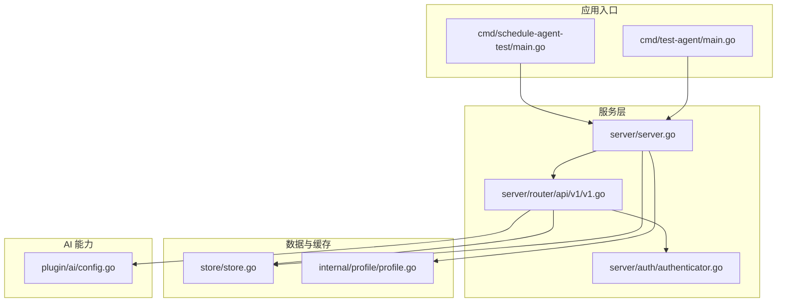
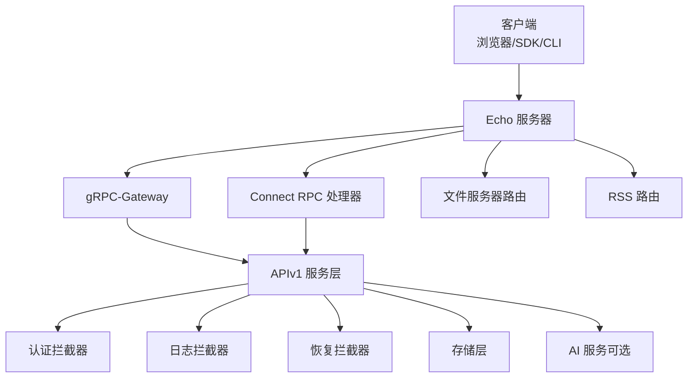
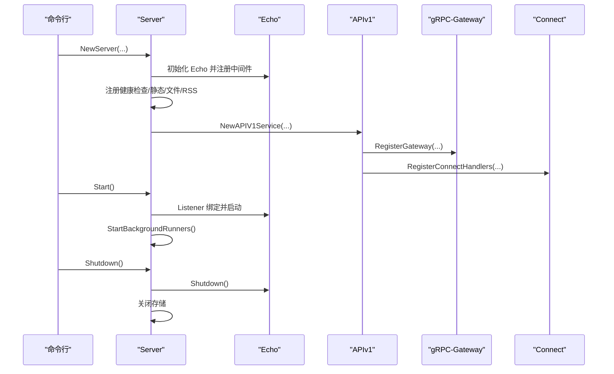
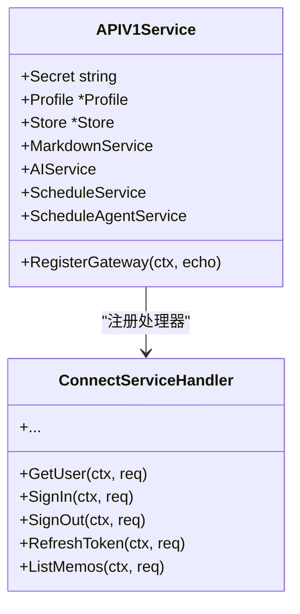
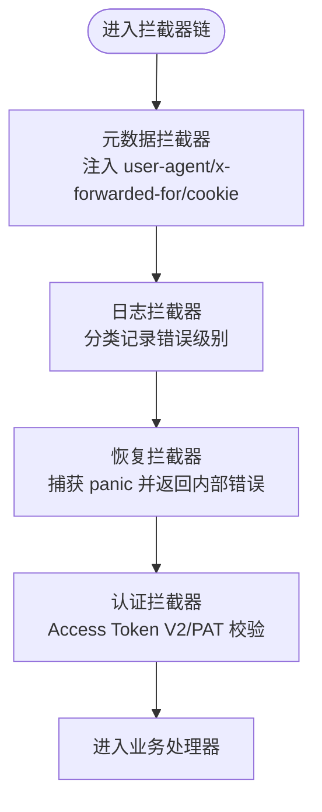
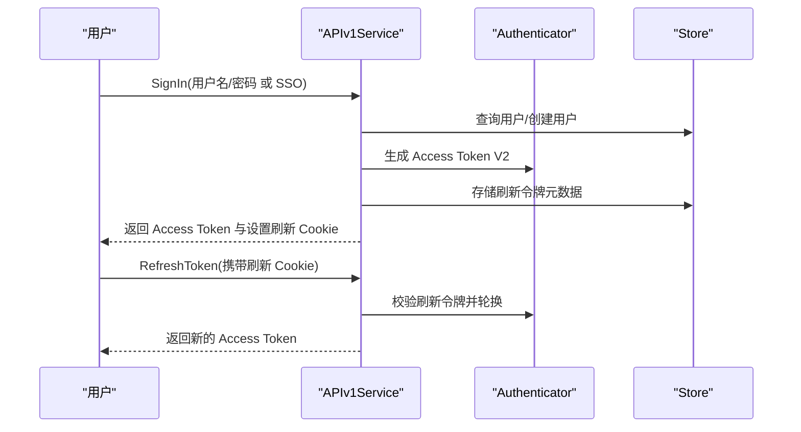
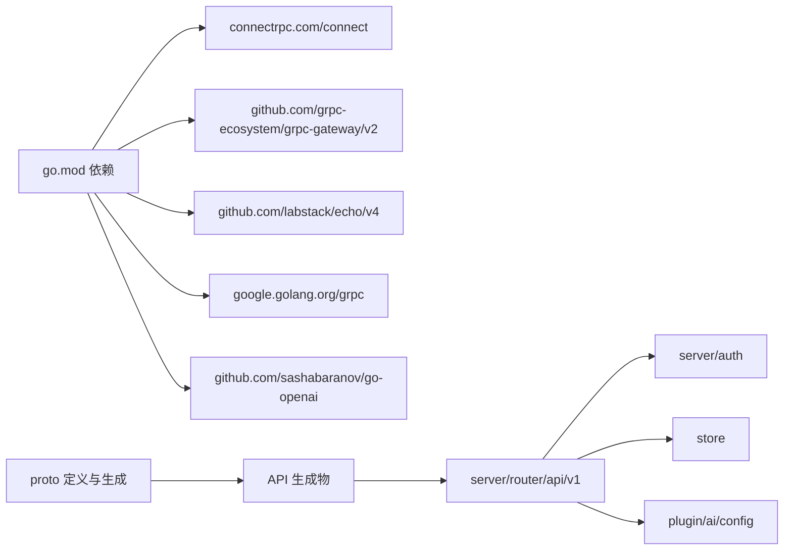

# 后端服务架构

<cite>
**本文引用的文件**
- [go.mod](file://go.mod)
- [server/server.go](file://server/server.go)
- [server/router/api/v1/v1.go](file://server/router/api/v1/v1.go)
- [server/router/api/v1/connect_interceptors.go](file://server/router/api/v1/connect_interceptors.go)
- [server/router/api/v1/connect_services.go](file://server/router/api/v1/connect_services.go)
- [server/router/api/v1/auth_service.go](file://server/router/api/v1/auth_service.go)
- [server/auth/authenticator.go](file://server/auth/authenticator.go)
- [internal/profile/profile.go](file://internal/profile/profile.go)
- [store/store.go](file://store/store.go)
- [plugin/ai/config.go](file://plugin/ai/config.go)
- [cmd/test-agent/main.go](file://cmd/test-agent/main.go)
- [cmd/schedule-agent-test/main.go](file://cmd/schedule-agent-test/main.go)
- [proto/buf.yaml](file://proto/buf.yaml)
</cite>

## 目录
1. [简介](#简介)
2. [项目结构](#项目结构)
3. [核心组件](#核心组件)
4. [架构总览](#架构总览)
5. [详细组件分析](#详细组件分析)
6. [依赖关系分析](#依赖关系分析)
7. [性能考量](#性能考量)
8. [故障排查指南](#故障排查指南)
9. [结论](#结论)
10. [附录](#附录)

## 简介
本文件面向后端服务架构，系统性梳理 Go 后端服务的启动流程、服务器配置与路由体系；解释 API 服务层的设计模式（Connect RPC、gRPC-Gateway 与 RESTful API 的统一处理）；阐述中间件与拦截器在认证、授权、日志与错误处理中的实现；说明业务逻辑层的组织结构与服务接口设计；并覆盖服务器启动参数、环境配置与运行时监控要点，提供可操作的最佳实践。

## 项目结构
该仓库采用多模块分层组织：核心服务位于 server 包，API 层在 server/router/api/v1，认证与鉴权在 server/auth，数据访问在 store，AI 能力在 plugin/ai，命令行入口在 cmd，协议定义在 proto。

**图表来源**
- [server/server.go](file://server/server.go#L1-L203)
- [server/router/api/v1/v1.go](file://server/router/api/v1/v1.go#L1-L238)
- [server/auth/authenticator.go](file://server/auth/authenticator.go#L1-L166)
- [store/store.go](file://store/store.go#L1-L87)
- [internal/profile/profile.go](file://internal/profile/profile.go#L1-L153)
- [plugin/ai/config.go](file://plugin/ai/config.go#L1-L129)
- [cmd/test-agent/main.go](file://cmd/test-agent/main.go#L1-L144)
- [cmd/schedule-agent-test/main.go](file://cmd/schedule-agent-test/main.go#L1-L66)

**章节来源**
- [server/server.go](file://server/server.go#L1-L203)
- [server/router/api/v1/v1.go](file://server/router/api/v1/v1.go#L1-L238)
- [internal/profile/profile.go](file://internal/profile/profile.go#L1-L153)

## 核心组件
- 服务器实例与生命周期管理：负责 Echo 服务器初始化、监听地址选择、健康检查端点、静态资源与 RSS 路由注册、gRPC-Gateway 与 Connect 处理器注册、后台任务启动与关闭。
- API 服务层：统一承载 gRPC、gRPC-Gateway 与 Connect 三类客户端的 API，集中注入认证、日志与恢复拦截器，并按需启用 AI 服务与调度服务。
- 认证与授权：支持短时效访问令牌（Access Token V2）与个人访问令牌（PAT），并提供刷新令牌轮换机制，确保会话安全与滑动窗口。
- 存储与缓存：抽象出 Driver 接口，内置多级缓存以降低数据库压力。
- 配置与环境：Profile 统一管理运行模式、网络绑定、数据目录、数据库连接、AI 与附件处理等配置项，并从环境变量加载。

**章节来源**
- [server/server.go](file://server/server.go#L29-L87)
- [server/router/api/v1/v1.go](file://server/router/api/v1/v1.go#L23-L118)
- [server/auth/authenticator.go](file://server/auth/authenticator.go#L17-L166)
- [store/store.go](file://store/store.go#L11-L58)
- [internal/profile/profile.go](file://internal/profile/profile.go#L14-L153)

## 架构总览
后端采用单进程 Echo 服务器，统一处理 HTTP/1.1 请求，通过 gRPC-Gateway 将 gRPC 方法映射为 RESTful 接口，同时使用 Connect RPC 提供浏览器友好的 RPC 通道。认证与拦截器贯穿所有请求路径，保证一致的安全策略与可观测性。

**图表来源**
- [server/server.go](file://server/server.go#L67-L86)
- [server/router/api/v1/v1.go](file://server/router/api/v1/v1.go#L120-L237)

**章节来源**
- [server/server.go](file://server/server.go#L67-L86)
- [server/router/api/v1/v1.go](file://server/router/api/v1/v1.go#L120-L237)

## 详细组件分析

### 服务器启动与生命周期
- 初始化：创建 Echo 实例，设置调试与隐藏端口标志，注册 Recover 中间件；读取或生成实例密钥；注册健康检查、前端静态资源、文件服务器、RSS 路由。
- 注册 API：构建 APIv1 服务，注册 gRPC-Gateway 与 Connect 处理器，统一暴露 /api/v1/* 与 /memos.api.v1.*。
- 启动：根据配置选择 TCP 或 UNIX 套接字监听，直接启动 Echo；随后启动嵌入向量与 OCR 等后台任务。
- 关闭：取消后台任务、优雅关闭 Echo、关闭存储连接。

**图表来源**
- [server/server.go](file://server/server.go#L38-L139)
- [server/router/api/v1/v1.go](file://server/router/api/v1/v1.go#L120-L237)

**章节来源**
- [server/server.go](file://server/server.go#L38-L139)

### API 服务层与统一处理
- APIv1Service 负责：
  - 构造 Markdown 服务与并发缩略图信号量；
  - 条件初始化 AI 服务（嵌入、重排序、LLM）、调度服务与调度代理服务；
  - 注册 gRPC-Gateway 与 Connect 处理器，统一暴露 REST 与 RPC 接口。
- gRPC-Gateway 中间件：基于 RPC 方法名进行公开/私有判断，提取认证头并注入上下文。
- Connect 处理器：将 Connect 请求转换为 gRPC 语义，再委派到具体服务方法。

**图表来源**
- [server/router/api/v1/v1.go](file://server/router/api/v1/v1.go#L23-L118)
- [server/router/api/v1/connect_services.go](file://server/router/api/v1/connect_services.go#L1-L491)

**章节来源**
- [server/router/api/v1/v1.go](file://server/router/api/v1/v1.go#L48-L118)
- [server/router/api/v1/connect_services.go](file://server/router/api/v1/connect_services.go#L1-L491)

### 中间件与拦截器
- 元数据拦截器：将 HTTP 头转换为 gRPC 元数据，便于服务层统一读取客户端信息；同时禁止浏览器缓存 API 响应。
- 日志拦截器：区分客户端错误与服务端错误，按级别记录；可选输出堆栈。
- 恢复拦截器：捕获 panic，返回内部错误，避免服务崩溃。
- 认证拦截器：优先尝试 Access Token V2（无状态），其次 PAT；对非公开方法强制认证；将用户信息注入上下文。

**图表来源**
- [server/router/api/v1/connect_interceptors.go](file://server/router/api/v1/connect_interceptors.go#L19-L275)

**章节来源**
- [server/router/api/v1/connect_interceptors.go](file://server/router/api/v1/connect_interceptors.go#L19-L275)

### 认证与授权
- 支持两种令牌：
  - Access Token V2：短时效（15 分钟），无数据库查询，基于签名验证。
  - Personal Access Token（PAT）：长期令牌，用于程序化访问，数据库校验有效期与撤销。
- 刷新令牌轮换：滑动窗口会话模型，每次刷新生成新刷新令牌并替换旧令牌，提升安全性。
- 客户端信息：解析 UA、IP、设备类型、操作系统、浏览器版本，用于会话可视化与风控。

**图表来源**
- [server/router/api/v1/auth_service.go](file://server/router/api/v1/auth_service.go#L64-L357)
- [server/auth/authenticator.go](file://server/auth/authenticator.go#L39-L165)

**章节来源**
- [server/router/api/v1/auth_service.go](file://server/router/api/v1/auth_service.go#L64-L357)
- [server/auth/authenticator.go](file://server/auth/authenticator.go#L17-L166)

### 业务逻辑层与服务接口
- 服务接口设计：围绕领域对象（用户、备忘、附件、活动、身份提供商、AI 对话、日程等）定义清晰的服务方法，统一通过 Connect/gRPC-Gateway 暴露。
- 权限控制：公开方法与私有方法分离，拦截器仅做基础认证判定，更细粒度的 RBAC 在服务层实现。
- AI 能力：当配置启用且驱动为 PostgreSQL 时，初始化嵌入、重排序与 LLM 服务，并注入到 AI 与调度服务中。

**章节来源**
- [server/router/api/v1/v1.go](file://server/router/api/v1/v1.go#L61-L115)

### 存储与缓存
- 抽象驱动：通过 Driver 接口屏蔽底层数据库差异，当前支持 SQLite 与 Postgres。
- 缓存策略：实例设置、用户、用户设置分别维护独立缓存，统一默认 TTL 与清理周期，减少热点查询压力。

**章节来源**
- [store/store.go](file://store/store.go#L11-L58)

### 配置与环境
- Profile 提供统一配置入口，涵盖运行模式、网络绑定、数据目录、数据库驱动与 DSN、实例 URL、AI 与附件处理开关及参数。
- 环境变量：通过 FromEnv 从环境变量加载配置，支持多 Provider 的 AI 参数与 OCR/Tika 配置。
- 校验与默认值：Validate 负责模式校正、数据目录存在性检查、SQLite 默认 DSN 生成等。

**章节来源**
- [internal/profile/profile.go](file://internal/profile/profile.go#L14-L153)

### 启动参数与运行时监控
- 启动参数：支持模式（dev/prod/demo）、绑定地址与端口、UNIX 套接字、数据目录、数据库驱动与 DSN、实例 URL。
- 运行时监控：健康检查端点 /healthz；日志拦截器按错误类别输出；后台任务 goroutine 数统计；AI 与 OCR 后台 Runner 自动启停。

**章节来源**
- [server/server.go](file://server/server.go#L89-L179)
- [server/router/api/v1/v1.go](file://server/router/api/v1/v1.go#L120-L237)

## 依赖关系分析
- 依赖管理：go.mod 明确引入 Connect RPC、gRPC-Gateway、Echo、pgvector、OpenAI SDK、OAuth2 等关键依赖。
- 协议与生成：proto 目录包含 API 定义与生成产物，buf.yaml 规范 lint 与 breaking 规则。
- 组件耦合：APIv1Service 与认证、存储、AI、Markdown 等模块松耦合，通过接口与上下文传递用户信息。

**图表来源**
- [go.mod](file://go.mod#L5-L29)
- [proto/buf.yaml](file://proto/buf.yaml#L1-L20)
- [server/router/api/v1/v1.go](file://server/router/api/v1/v1.go#L1-L238)

**章节来源**
- [go.mod](file://go.mod#L5-L29)
- [proto/buf.yaml](file://proto/buf.yaml#L1-L20)

## 性能考量
- 并发控制：APIv1Service 为缩略图生成设置权重信号量，限制并发以避免内存峰值。
- 缓存策略：Store 内置多级缓存，合理设置 TTL 与清理间隔，降低数据库负载。
- 后台任务：嵌入向量与 OCR Runner 仅在配置允许时启动，避免不必要的资源占用。
- 网络与监听：优先使用 UNIX 套接字减少网络开销；Echo 直接启动，避免额外的多路复用器开销。

**章节来源**
- [server/router/api/v1/v1.go](file://server/router/api/v1/v1.go#L44-L57)
- [store/store.go](file://store/store.go#L27-L42)
- [server/server.go](file://server/server.go#L141-L179)

## 故障排查指南
- 认证失败：
  - 检查 Authorization 头是否正确传递 Access Token V2 或 PAT。
  - 若使用刷新令牌，确认 Cookie 是否包含 memos_refresh 且未过期/被撤销。
- gRPC-Gateway 401：
  - 确认 RPC 方法是否为公开方法；非公开方法需要有效认证。
- Panic 导致 500：
  - 恢复拦截器会捕获并返回内部错误；开启堆栈日志有助于定位问题。
- 健康检查失败：
  - 检查 /healthz 是否返回就绪文本；确认监听地址与端口配置正确。
- AI 功能异常：
  - 校验 AI 配置是否通过 Validate；确认 Provider 与 API Key/BaseURL 设置正确；仅在 PostgreSQL 驱动下启用嵌入向量 Runner。

**章节来源**
- [server/router/api/v1/connect_interceptors.go](file://server/router/api/v1/connect_interceptors.go#L160-L275)
- [server/router/api/v1/v1.go](file://server/router/api/v1/v1.go#L120-L237)
- [plugin/ai/config.go](file://plugin/ai/config.go#L105-L129)

## 结论
该后端服务采用“单进程 Echo + Connect + gRPC-Gateway”的统一 API 设计，结合拦截器实现一致的认证、日志与错误处理；通过 Profile 与 Store 抽象实现灵活的配置与数据访问；在生产模式下具备完善的健康检查、会话管理与可观测性能力。建议在生产部署中启用严格的日志与监控，合理配置缓存与并发限制，并定期校验 AI 与外部服务可用性。

## 附录

### 启动与运行示例
- 开发模式启动：通过 Profile 设置 Mode=dev、Driver=postgres、DSN 指向本地数据库，启动后可通过 /healthz 检查就绪。
- 嵌入向量与 OCR：当 AI 启用且驱动为 postgres 时，自动启动嵌入向量 Runner；OCR Runner 在启用时启动一次并持续运行。

**章节来源**
- [cmd/test-agent/main.go](file://cmd/test-agent/main.go#L20-L72)
- [cmd/schedule-agent-test/main.go](file://cmd/schedule-agent-test/main.go#L9-L65)
- [server/server.go](file://server/server.go#L141-L179)