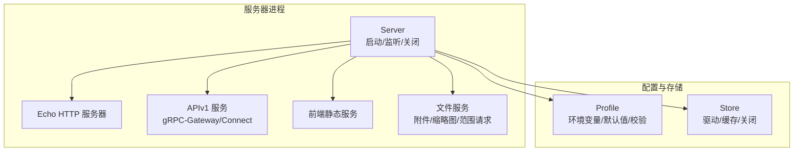
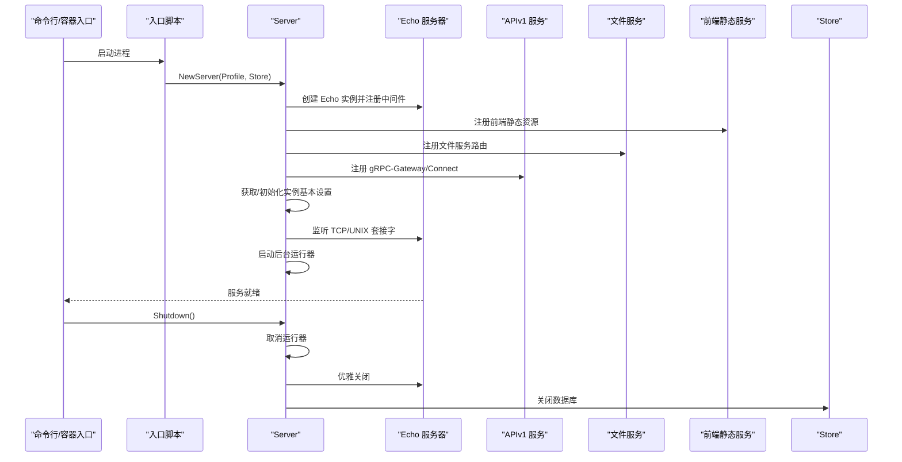
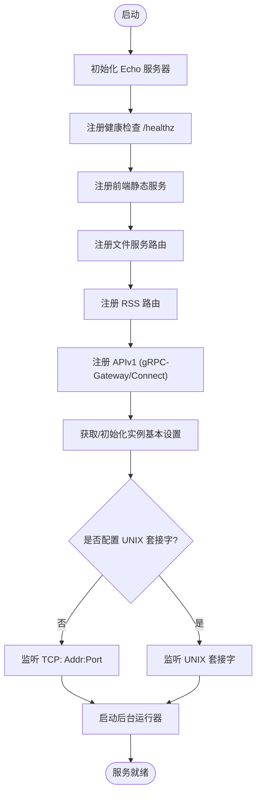
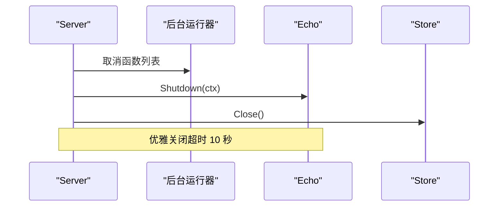
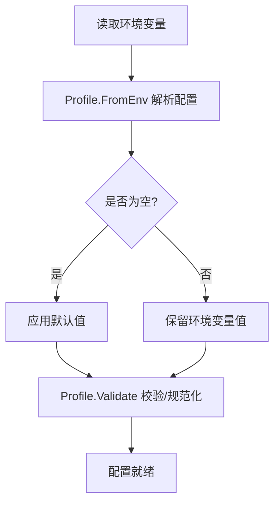
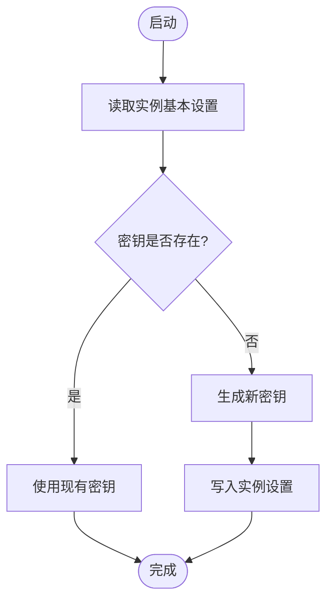
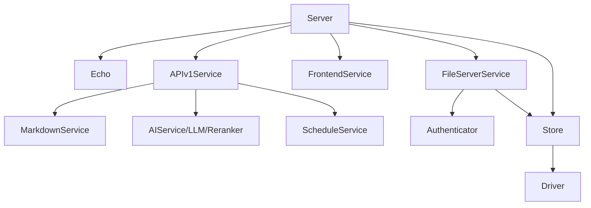

# 服务器启动与初始化

<cite>
**本文档引用的文件**
- [server/server.go](file://server/server.go)
- [internal/profile/profile.go](file://internal/profile/profile.go)
- [.env.example](file://.env.example)
- [deploy/aliyun/.env.prod.example](file://deploy/aliyun/.env.prod.example)
- [server/router/api/v1/v1.go](file://server/router/api/v1/v1.go)
- [server/router/frontend/frontend.go](file://server/router/frontend/frontend.go)
- [server/router/fileserver/fileserver.go](file://server/router/fileserver/fileserver.go)
- [store/store.go](file://store/store.go)
- [scripts/entrypoint.sh](file://scripts/entrypoint.sh)
- [docker/Dockerfile](file://docker/Dockerfile)
- [Makefile](file://Makefile)
- [go.mod](file://go.mod)
</cite>

## 目录
1. [简介](#简介)
2. [项目结构](#项目结构)
3. [核心组件](#核心组件)
4. [架构总览](#架构总览)
5. [详细组件分析](#详细组件分析)
6. [依赖关系分析](#依赖关系分析)
7. [性能考量](#性能考量)
8. [故障排除指南](#故障排除指南)
9. [结论](#结论)
10. [附录](#附录)

## 简介
本文件聚焦于服务器启动与初始化流程，涵盖以下主题：
- Echo HTTP 服务器的初始化、路由注册与监听设置
- 服务器生命周期管理（启动、运行、优雅关闭）
- 配置系统（环境变量、配置文件与默认值）
- 实例基本设置的获取与更新机制
- 启动参数、监听地址配置与网络协议支持
- 具体启动示例与常见问题排查

## 项目结构
围绕服务器启动的关键模块与职责如下：
- 服务器核心：负责 Echo 实例创建、中间件、路由注册、监听与生命周期管理
- 配置系统：封装环境变量解析、默认值处理与数据目录校验
- API 层：注册 gRPC-Gateway 与 Connect 处理器，提供 REST/HTTP 接口
- 前端静态资源：内嵌前端产物，SPA 路由回退与缓存策略
- 文件服务：原生 HTTP 服务附件与缩略图，支持范围请求（视频/音频）
- 存储层：数据库驱动与缓存配置，提供优雅关闭时的资源回收

图表来源
- [server/server.go](file://server/server.go#L29-L87)
- [internal/profile/profile.go](file://internal/profile/profile.go#L14-L57)
- [server/router/api/v1/v1.go](file://server/router/api/v1/v1.go#L48-L118)
- [server/router/frontend/frontend.go](file://server/router/frontend/frontend.go#L25-L61)
- [server/router/fileserver/fileserver.go](file://server/router/fileserver/fileserver.go#L55-L74)
- [store/store.go](file://store/store.go#L25-L58)

章节来源
- [server/server.go](file://server/server.go#L29-L87)
- [internal/profile/profile.go](file://internal/profile/profile.go#L14-L57)

## 核心组件
- Server 结构体：持有 Echo 实例、Profile、Store，并管理后台运行器的取消函数
- Profile 结构体：集中管理运行模式、监听地址、端口、UNIX 套接字、数据目录、数据库 DSN、驱动、实例 URL，以及 AI 与附件处理相关配置
- APIV1Service：注册 gRPC-Gateway 与 Connect 处理器，按需启用 AI 服务与调度服务
- FrontendService：内嵌前端静态资源，提供 SPA 回退与缓存头
- FileServerService：原生 HTTP 提供附件与缩略图，支持范围请求以满足 Safari 的视频/音频播放需求
- Store：封装数据库驱动与缓存配置，提供优雅关闭时的资源回收

章节来源
- [server/server.go](file://server/server.go#L29-L36)
- [internal/profile/profile.go](file://internal/profile/profile.go#L14-L57)
- [server/router/api/v1/v1.go](file://server/router/api/v1/v1.go#L23-L46)
- [server/router/frontend/frontend.go](file://server/router/frontend/frontend.go#L20-L30)
- [server/router/fileserver/fileserver.go](file://server/router/fileserver/fileserver.go#L43-L53)
- [store/store.go](file://store/store.go#L11-L23)

## 架构总览
服务器启动流程概览：
- 初始化 Profile（环境变量解析与默认值处理）
- 创建 Echo 实例并注册中间件
- 注册健康检查、前端静态资源、文件服务、RSS、APIv1（gRPC-Gateway/Connect）
- 根据 Profile 选择 TCP 或 UNIX 套接字进行监听
- 启动后台运行器（向量嵌入、OCR 文本提取等）
- 优雅关闭时取消运行器、关闭 Echo、关闭数据库

图表来源
- [server/server.go](file://server/server.go#L38-L87)
- [server/server.go](file://server/server.go#L89-L139)
- [server/router/api/v1/v1.go](file://server/router/api/v1/v1.go#L120-L237)
- [server/router/frontend/frontend.go](file://server/router/frontend/frontend.go#L32-L61)
- [server/router/fileserver/fileserver.go](file://server/router/fileserver/fileserver.go#L65-L74)
- [store/store.go](file://store/store.go#L51-L58)

## 详细组件分析

### 服务器启动与监听
- Echo 初始化：创建实例、关闭横幅与端口打印、启用 Recover 中间件
- 健康检查：注册 /healthz 路由
- 前端静态资源：内嵌前端 dist，SPA 回退与缓存头设置
- API 注册：先注册文件服务（确保 Safari 范围请求），再注册 RSS 与 APIv1（gRPC-Gateway/Connect）
- 监听选择：若未配置 UNIX 套接字，则使用 TCP 地址；否则使用 UNIX 套接字
- 后台运行器：根据配置启动向量嵌入与 OCR 文本提取任务

图表来源
- [server/server.go](file://server/server.go#L44-L86)
- [server/server.go](file://server/server.go#L89-L113)
- [server/router/frontend/frontend.go](file://server/router/frontend/frontend.go#L32-L61)
- [server/router/fileserver/fileserver.go](file://server/router/fileserver/fileserver.go#L65-L74)
- [server/router/api/v1/v1.go](file://server/router/api/v1/v1.go#L120-L237)

章节来源
- [server/server.go](file://server/server.go#L44-L113)

### 服务器生命周期管理
- 启动：创建监听器并启动 Echo；随后启动后台运行器
- 关闭：按序取消运行器、优雅关闭 Echo、关闭数据库连接；记录日志

图表来源
- [server/server.go](file://server/server.go#L115-L139)
- [store/store.go](file://store/store.go#L51-L58)

章节来源
- [server/server.go](file://server/server.go#L115-L139)
- [store/store.go](file://store/store.go#L51-L58)

### 配置系统工作原理
- 环境变量：Profile.FromEnv 解析 AI、OCR、文本提取等配置项
- 默认值：未设置时采用默认值（如提供商、模型、基础 URL、语言等）
- 数据目录校验：Validate 校验并规范化数据目录，必要时创建目录
- Docker 环境变量：Dockerfile 设置默认运行模式与端口，入口脚本处理敏感配置文件路径

图表来源
- [internal/profile/profile.go](file://internal/profile/profile.go#L76-L99)
- [internal/profile/profile.go](file://internal/profile/profile.go#L120-L152)
- [scripts/entrypoint.sh](file://scripts/entrypoint.sh#L3-L27)
- [docker/Dockerfile](file://docker/Dockerfile#L51-L55)

章节来源
- [internal/profile/profile.go](file://internal/profile/profile.go#L76-L152)
- [scripts/entrypoint.sh](file://scripts/entrypoint.sh#L3-L31)
- [docker/Dockerfile](file://docker/Dockerfile#L51-L55)

### 实例基本设置的获取与更新
- 启动时尝试读取实例基本设置（含密钥）
- 若密钥为空则生成新密钥并持久化保存
- 密钥用于签名与鉴权相关功能

图表来源
- [server/server.go](file://server/server.go#L181-L202)

章节来源
- [server/server.go](file://server/server.go#L181-L202)

### 启动参数、监听地址与网络协议
- 监听地址：Profile.Addr 与 Profile.Port 组合为 "地址:端口"
- UNIX 套接字：当 Profile.UNIXSock 非空时优先使用
- 网络协议：TCP 或 UNIX 套接字二选一
- 端口暴露：Dockerfile 暴露默认端口

章节来源
- [server/server.go](file://server/server.go#L89-L97)
- [docker/Dockerfile](file://docker/Dockerfile#L55-L55)

### API 与路由注册顺序
- 文件服务优先：确保范围请求（Safari 视频/音频）正确处理
- RSS 服务：基于 Markdown 服务注册
- APIv1：注册 gRPC-Gateway 与 Connect 处理器，按需启用 AI/调度服务

章节来源
- [server/server.go](file://server/server.go#L74-L84)
- [server/router/api/v1/v1.go](file://server/router/api/v1/v1.go#L120-L237)

## 依赖关系分析
- 服务器依赖 Echo、中间件、APIv1、前端静态、文件服务、Store
- APIv1 依赖 Markdown、AI 服务（可选）、调度服务
- 文件服务依赖鉴权器与存储层
- Store 依赖驱动与缓存层

图表来源
- [server/server.go](file://server/server.go#L38-L86)
- [server/router/api/v1/v1.go](file://server/router/api/v1/v1.go#L48-L118)
- [server/router/fileserver/fileserver.go](file://server/router/fileserver/fileserver.go#L55-L62)
- [store/store.go](file://store/store.go#L25-L44)

章节来源
- [server/server.go](file://server/server.go#L38-L86)
- [server/router/api/v1/v1.go](file://server/router/api/v1/v1.go#L48-L118)
- [server/router/fileserver/fileserver.go](file://server/router/fileserver/fileserver.go#L55-L62)
- [store/store.go](file://store/store.go#L25-L44)

## 性能考量
- 并发限制：缩略图生成使用信号量限制并发，避免内存压力
- 缓存头：前端静态资源与文件服务设置合理的缓存策略
- 资源回收：优雅关闭时统一释放运行器与数据库连接

章节来源
- [server/router/fileserver/fileserver.go](file://server/router/fileserver/fileserver.go#L51-L62)
- [server/router/frontend/frontend.go](file://server/router/frontend/frontend.go#L32-L61)
- [server/server.go](file://server/server.go#L115-L139)

## 故障排除指南
- 监听失败
  - 检查监听地址与端口是否被占用
  - 若使用 UNIX 套接字，确认路径存在且权限正确
- 环境变量未生效
  - 确认 .env 或系统环境变量已正确导出
  - Docker 环境下检查 ENTRYPOINT 是否加载了入口脚本
- AI 功能异常
  - 确认 AI 开关与至少一个 API Key 或 Base URL 已配置
  - 检查数据库驱动为 postgres 且配置有效
- 健康检查失败
  - 访问 /healthz 确认服务已就绪
- 前端静态资源缓存问题
  - 检查缓存头设置与 SPA 回退逻辑
- 文件服务范围请求
  - Safari 视频/音频需范围请求支持，确认使用原生 HTTP 服务

章节来源
- [server/server.go](file://server/server.go#L89-L113)
- [internal/profile/profile.go](file://internal/profile/profile.go#L76-L99)
- [internal/profile/profile.go](file://internal/profile/profile.go#L63-L66)
- [server/router/api/v1/v1.go](file://server/router/api/v1/v1.go#L62-L115)
- [server/router/frontend/frontend.go](file://server/router/frontend/frontend.go#L32-L61)
- [server/router/fileserver/fileserver.go](file://server/router/fileserver/fileserver.go#L161-L176)

## 结论
该服务器实现以 Echo 为核心，结合配置系统、API 网关与静态资源服务，提供了清晰的启动与关闭流程。通过环境变量与默认值的组合，实现了灵活的部署适配；通过后台运行器与优雅关闭，保障了长期运行的稳定性与可维护性。

## 附录

### 启动示例
- 本地开发（Makefile）
  - 使用 make run 启动后端，自动注入数据库与 AI 相关环境变量
  - 访问 http://localhost:28081
- Docker 生产
  - 使用 docker-compose 启动生产环境
  - 端口映射与实例 URL 需在 .env.prod 中配置
- 直接运行
  - 通过命令行参数指定模式与端口，配合 .env 或系统环境变量

章节来源
- [Makefile](file://Makefile#L38-L52)
- [deploy/aliyun/.env.prod.example](file://deploy/aliyun/.env.prod.example#L59-L59)
- [docker/Dockerfile](file://docker/Dockerfile#L55-L55)

### 配置参考
- 环境变量示例：数据库驱动、DSN、AI 开关与提供商、OCR/文本提取开关与路径
- Docker 默认运行模式与端口
- 入口脚本对敏感配置文件的支持

章节来源
- [.env.example](file://.env.example#L22-L57)
- [deploy/aliyun/.env.prod.example](file://deploy/aliyun/.env.prod.example#L29-L82)
- [docker/Dockerfile](file://docker/Dockerfile#L51-L55)
- [scripts/entrypoint.sh](file://scripts/entrypoint.sh#L29-L31)