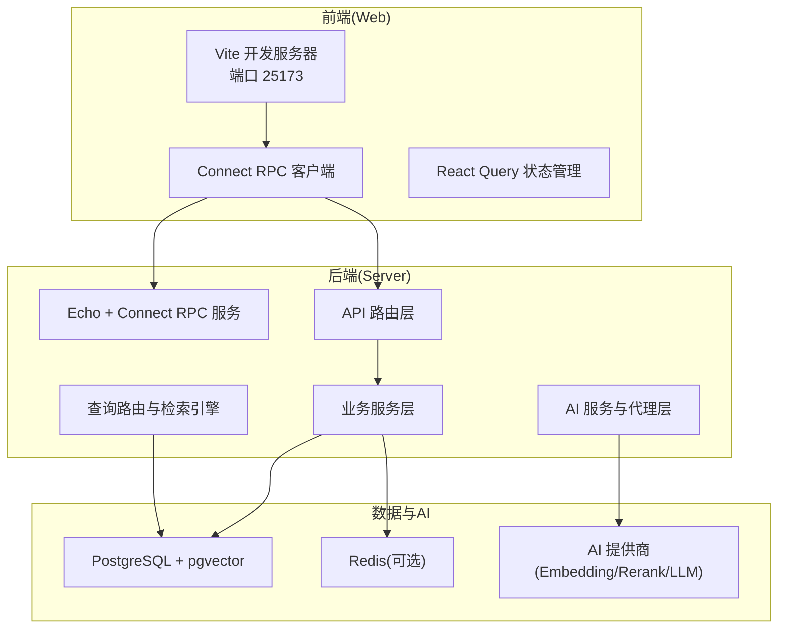
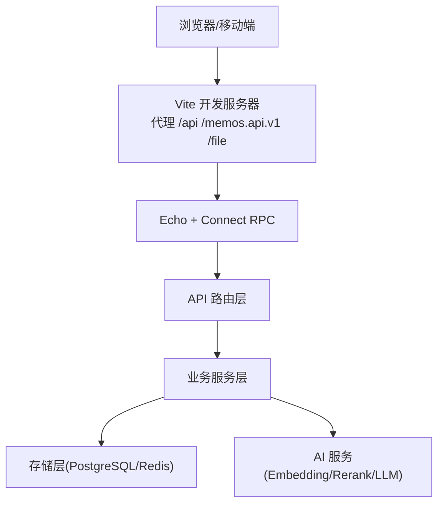
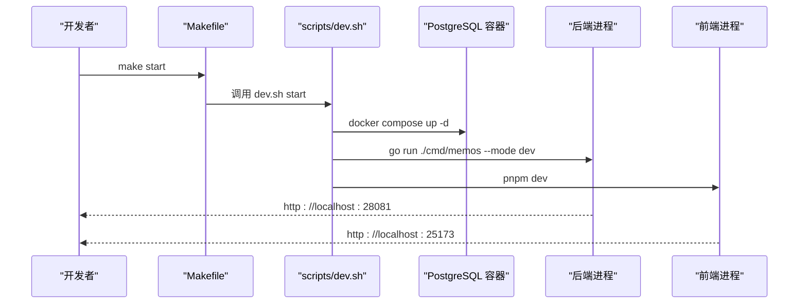
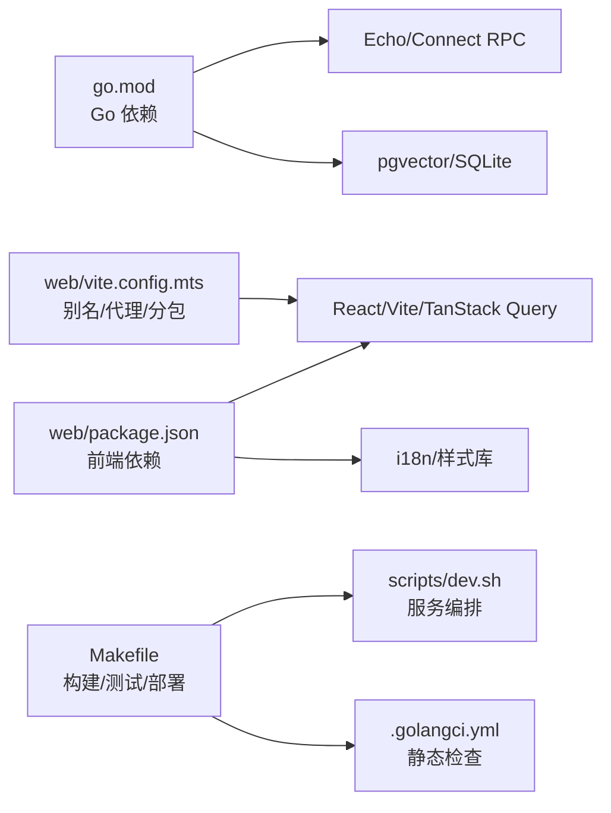

# 开发指南

<cite>
**本文引用的文件**   
- [README.md](file://README.md)
- [CONTRIBUTING.md](file://CONTRIBUTING.md)
- [go.mod](file://go.mod)
- [Makefile](file://Makefile)
- [scripts/dev.sh](file://scripts/dev.sh)
- [.golangci.yml](file://.golangci.yml)
- [web/package.json](file://web/package.json)
- [web/tsconfig.json](file://web/tsconfig.json)
- [web/vite.config.mts](file://web/vite.config.mts)
- [scripts/check-i18n.sh](file://scripts/check-i18n.sh)
- [web/src/utils/i18n.ts](file://web/src/utils/i18n.ts)
- [web/src/hooks/useAIQueries.ts](file://web/src/hooks/useAIQueries.ts)
- [plugin/ai/config_test.go](file://plugin/ai/config_test.go)
</cite>

## 目录
1. [简介](#简介)
2. [项目结构](#项目结构)
3. [核心组件](#核心组件)
4. [架构总览](#架构总览)
5. [详细组件分析](#详细组件分析)
6. [依赖关系分析](#依赖关系分析)
7. [性能考虑](#性能考虑)
8. [故障排查指南](#故障排查指南)
9. [结论](#结论)
10. [附录](#附录)

## 简介
本开发指南面向希望参与 Memos 项目的开发者，覆盖从环境搭建、依赖安装、数据库与 AI 配置、IDE 设置，到代码规范、测试策略、调试与性能分析、以及贡献流程与协作最佳实践。项目采用前后端分离架构：后端为 Go 语言实现，基于 Echo 与 Connect RPC；前端为 React + Vite，通过 Connect RPC 与后端交互；存储层以 PostgreSQL 为主，结合 Redis 作为可选缓存，并内置 pgvector 支持向量检索。

## 项目结构
- 后端入口与服务：cmd/memos、server/router、server/service、plugin/ai、store/db、proto
- 前端工程：web/src、hooks、components、pages、themes、locales
- 开发与部署：Makefile、scripts/dev.sh、docker/compose、deploy/aliyun
- 文档与规范：docs/dev-guides、docs/specs、.golangci.yml、web/.biome 配置等

图表来源
- [Makefile](file://Makefile#L38-L52)
- [scripts/dev.sh](file://scripts/dev.sh#L149-L248)
- [web/vite.config.mts](file://web/vite.config.mts#L15-L32)

章节来源
- [README.md](file://README.md#L296-L339)
- [Makefile](file://Makefile#L38-L52)
- [scripts/dev.sh](file://scripts/dev.sh#L149-L248)

## 核心组件
- 后端服务与路由：提供 Memo、Schedule、AI、用户、实例设置等 API，统一通过 Connect RPC 暴露，支持 gRPC-HTTP 转码与 OpenAPI 导出。
- 查询与检索：QueryRouter 基于意图识别选择检索策略，AdaptiveRetriever 融合 BM25、向量与重排序，提升检索精度。
- AI 代理系统：多代理（MEMO、SCHEDULE、AMAZING、CREATIVE）协同，支持 ReAct 思维链、工具调用与并发检索。
- 存储层：PostgreSQL 为主，SQLite 用于开发；支持迁移与种子数据；缓存可选 Redis。
- 前端：React + Vite，TanStack Query 管理服务端状态，i18n 支持多语言，组件化 UI 基于 Radix UI 与 Tailwind CSS。

章节来源
- [README.md](file://README.md#L109-L198)
- [go.mod](file://go.mod#L5-L30)

## 架构总览
下图展示从前端到后端、再到数据库与 AI 服务的整体交互：

图表来源
- [web/vite.config.mts](file://web/vite.config.mts#L15-L32)
- [web/package.json](file://web/package.json#L4-L11)
- [go.mod](file://go.mod#L6-L29)

## 详细组件分析

### 开发环境搭建与一键启动
- 克隆仓库后，使用 Makefile 提供的一键命令快速启动：先拉起 PostgreSQL，再启动后端与前端。
- 开发脚本 scripts/dev.sh 提供更细粒度的服务启停、状态查询与日志查看能力。
- Docker Compose 用于本地开发数据库容器管理。

图表来源
- [Makefile](file://Makefile#L59-L61)
- [scripts/dev.sh](file://scripts/dev.sh#L536-L566)

章节来源
- [README.md](file://README.md#L202-L228)
- [Makefile](file://Makefile#L38-L91)
- [scripts/dev.sh](file://scripts/dev.sh#L149-L248)

### 依赖安装与数据库配置
- 后端依赖：Go 1.25+，使用 go.mod 管理模块依赖。
- 前端依赖：Node.js 22+ 与 pnpm，使用 package.json 管理依赖与脚本。
- 数据库：PostgreSQL 16+（推荐），SQLite 仅限开发；Makefile 提供 docker-up/down/logs/reset 与 db-reset、db-vector 等命令。
- AI 配置：通过环境变量或 Makefile 变量设置提供商与模型，支持 SiliconFlow、OpenAI、Ollama 等。

章节来源
- [README.md](file://README.md#L206-L209)
- [go.mod](file://go.mod#L3-L30)
- [web/package.json](file://web/package.json#L1-L101)
- [Makefile](file://Makefile#L20-L31)
- [Makefile](file://Makefile#L115-L131)
- [Makefile](file://Makefile#L150-L160)

### IDE 设置与编辑器配置
- Go：启用 gofmt、golangci-lint，建议在 IDE 中配置保存时自动格式化与静态检查。
- TypeScript/React：启用严格模式、TS 检查与 Biome 格式化/检查；Vite 别名 @/ 指向 src。
- EditorConfig：统一缩进与换行风格。

章节来源
- [.golangci.yml](file://.golangci.yml#L4-L25)
- [web/tsconfig.json](file://web/tsconfig.json#L10-L19)
- [web/vite.config.mts](file://web/vite.config.mts#L33-L37)

### 代码规范与最佳实践
- Go 语言：遵循 Effective Go，使用 gofmt、golangci-lint；单元测试覆盖率目标 > 80%。
- TypeScript/React：严格模式、React Hooks 规则；使用 Biome 进行格式化与检查。
- 国际化(i18n)：强制要求新增 UI 文本同时提供英文与中文翻译，使用 en.json 与 zh-Hans.json；提供检查脚本与提交前校验。
- Git 工作流：分支策略 feature/*、fix/*、refactor/*；提交信息格式 <type>(<scope>): <subject>；PR 流程清晰。

章节来源
- [CONTRIBUTING.md](file://CONTRIBUTING.md#L68-L82)
- [CONTRIBUTING.md](file://CONTRIBUTING.md#L85-L171)
- [CONTRIBUTING.md](file://CONTRIBUTING.md#L197-L206)
- [.golangci.yml](file://.golangci.yml#L82-L86)

### 测试策略与质量保证
- 后端测试：使用 go test，Makefile 提供 test、test-ai、test-embedding、test-runner 等子集测试；CI/CD 中可通过 golangci-lint 与测试命令保障质量。
- 前端测试：前端使用 pnpm test（若存在测试脚本），配合 Biome 检查与 TypeScript 严格模式；i18n 关键字一致性通过脚本校验。
- 提交前检查：check-i18n 与 check-i18n-hardcode 用于确保翻译完整性与避免硬编码文本。

章节来源
- [CONTRIBUTING.md](file://CONTRIBUTING.md#L182-L194)
- [Makefile](file://Makefile#L167-L182)
- [scripts/check-i18n.sh](file://scripts/check-i18n.sh#L1-L98)
- [web/package.json](file://web/package.json#L4-L11)

### 调试技巧与性能分析
- 断点调试：后端使用 Delve 或 IDE 内置调试器；前端使用浏览器 DevTools 与 React DevTools。
- 日志与可观测性：Makefile 与 dev.sh 提供 logs、logs-backend、logs-frontend、logs-postgres 等命令；后端内部提供日志组件。
- 性能剖析：Go 支持 pprof，可在本地或 CI 中生成火焰图；前端使用浏览器性能面板与 React Profiler。
- 内存泄漏检测：前端关注事件监听器与定时器清理；后端关注 goroutine 泄漏与连接池资源释放。

章节来源
- [scripts/dev.sh](file://scripts/dev.sh#L485-L530)
- [Makefile](file://Makefile#L71-L91)

### 贡献指南与开源协作
- 分支策略与提交规范：feature/*、fix/*、refactor/*；提交信息包含 type、scope、subject 与正文/页脚。
- PR 流程：创建分支、开发与原子化提交、推送、创建 PR、等待 Code Review、根据反馈修改、合并。
- 数据库变更：迁移文件放置于 store/migration/postgres/<version>/，包含 up/down 脚本并更新 LATEST.sql。

章节来源
- [CONTRIBUTING.md](file://CONTRIBUTING.md#L9-L16)
- [CONTRIBUTING.md](file://CONTRIBUTING.md#L30-L64)
- [CONTRIBUTING.md](file://CONTRIBUTING.md#L197-L215)

## 依赖关系分析

图表来源
- [go.mod](file://go.mod#L5-L30)
- [web/package.json](file://web/package.json#L12-L94)
- [Makefile](file://Makefile#L94-L107)
- [scripts/dev.sh](file://scripts/dev.sh#L1-L682)
- [.golangci.yml](file://.golangci.yml#L1-L94)
- [web/vite.config.mts](file://web/vite.config.mts#L1-L65)

章节来源
- [go.mod](file://go.mod#L1-L75)
- [web/package.json](file://web/package.json#L1-L101)
- [Makefile](file://Makefile#L94-L107)

## 性能考虑
- 后端：合理使用连接池、缓存（Redis）、异步任务与限流中间件；避免大事务与阻塞 IO。
- 前端：利用 Vite 的动态导入与手动分包策略，减少首屏体积；合理使用 React Query 缓存与去重。
- 检索：在 QueryRouter 中根据意图选择合适策略，减少不必要的向量计算与网络往返。
- 数据库：为向量与全文检索建立合适索引，定期维护统计信息。

## 故障排查指南
- 启动失败
  - 检查 Docker 是否运行：docker info
  - 查看各服务状态与日志：make status、make logs、make logs-backend、make logs-frontend、make logs-postgres
  - 端口占用：后端默认 28081，前端 25173；脚本会尝试等待端口可用
- 数据库问题
  - 重置 schema：make db-reset；验证 pgvector：make db-vector
  - 直接进入容器：make db-connect
- i18n 校验失败
  - 使用脚本检查：make check-i18n；检查硬编码文本：make check-i18n-hardcode
- 测试失败
  - 运行全量测试：make test；或针对子模块：make test-ai、make test-embedding、make test-runner

章节来源
- [scripts/dev.sh](file://scripts/dev.sh#L88-L94)
- [scripts/dev.sh](file://scripts/dev.sh#L429-L479)
- [Makefile](file://Makefile#L150-L160)
- [Makefile](file://Makefile#L255-L264)
- [Makefile](file://Makefile#L167-L182)

## 结论
本指南提供了从环境搭建到日常开发、测试与协作的完整路径。建议团队在本地统一使用 Makefile 与 dev.sh 脚本进行服务编排，严格遵守代码规范与 i18n 强制要求，并在提交前执行检查命令，确保代码质量与国际化一致性。

## 附录

### 常用命令速查
- 启动：make start；停止：make stop；重启：make restart
- 日志：make logs[-backend|-frontend|-postgres]；状态：make status
- 依赖：make deps（后端）、make deps-web（前端）、make deps-ai（AI）
- 数据库：make docker-up/down/logs/reset；make db-reset；make db-vector
- 测试：make test；make test-ai；make test-embedding；make test-runner
- 检查：make check-build；make check-test；make check-i18n；make check-i18n-hardcode

章节来源
- [Makefile](file://Makefile#L38-L384)

### 前端开发要点
- 代理配置：Vite 将 /api、/memos.api.v1、/file 代理至后端地址，默认 http://localhost:28081
- 路径别名：@/ 指向 src，便于模块导入
- i18n 使用：通过 useTranslate 获取翻译函数；新增文案需同步更新 en.json 与 zh-Hans.json，并通过脚本校验

章节来源
- [web/vite.config.mts](file://web/vite.config.mts#L15-L32)
- [web/vite.config.mts](file://web/vite.config.mts#L33-L37)
- [web/tsconfig.json](file://web/tsconfig.json#L20-L22)
- [web/src/utils/i18n.ts](file://web/src/utils/i18n.ts#L68-L71)
- [scripts/check-i18n.sh](file://scripts/check-i18n.sh#L14-L23)

### AI 服务与测试参考
- AI 配置加载与校验：从 Profile 读取提供商与模型，支持 SiliconFlow、OpenAI、Ollama；提供 Validate 逻辑
- 单元测试：覆盖不同提供商配置与校验场景

章节来源
- [plugin/ai/config_test.go](file://plugin/ai/config_test.go#L9-L73)
- [plugin/ai/config_test.go](file://plugin/ai/config_test.go#L75-L105)
- [plugin/ai/config_test.go](file://plugin/ai/config_test.go#L107-L130)
- [plugin/ai/config_test.go](file://plugin/ai/config_test.go#L132-L143)
- [plugin/ai/config_test.go](file://plugin/ai/config_test.go#L145-L239)