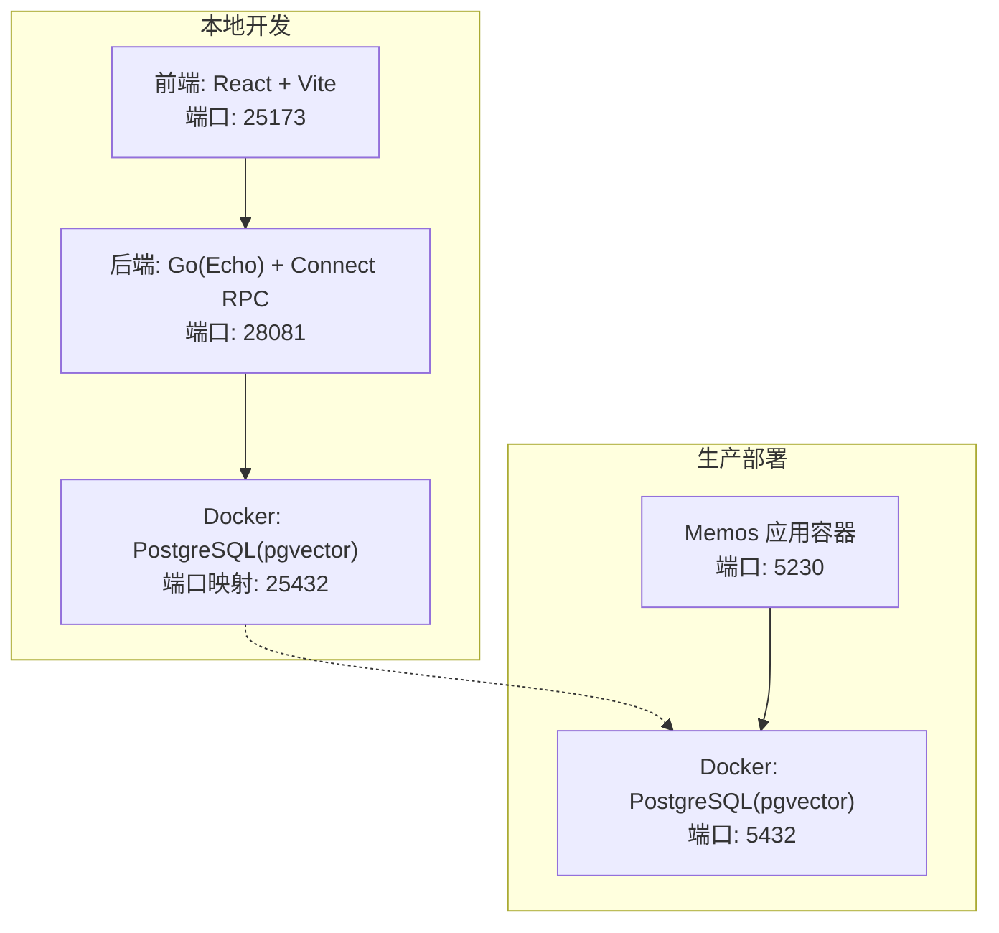
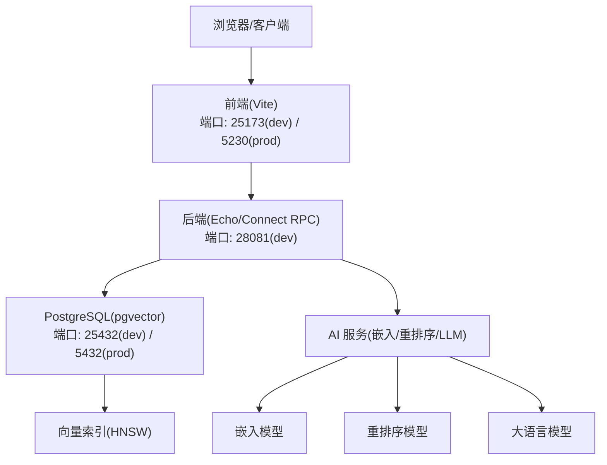
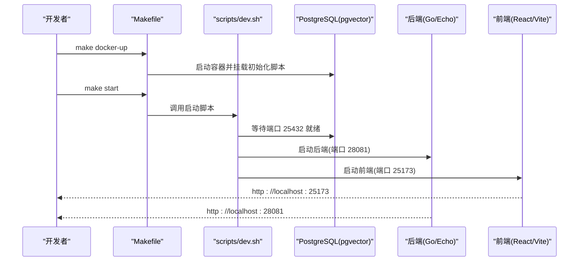
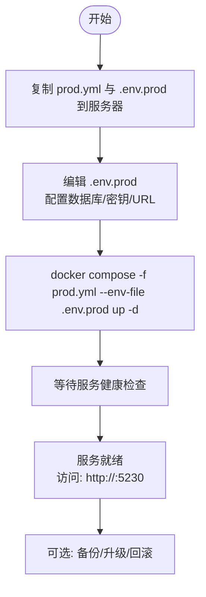
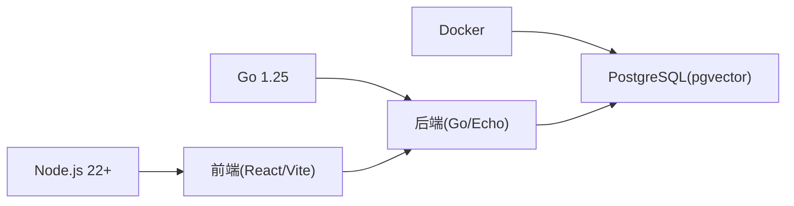

# 快速开始

<cite>
**本文引用的文件**
- [README.md](file://README.md)
- [Makefile](file://Makefile)
- [scripts/dev.sh](file://scripts/dev.sh)
- [scripts/build.sh](file://scripts/build.sh)
- [docker/README.md](file://docker/README.md)
- [docker/compose/dev.yml](file://docker/compose/dev.yml)
- [docker/compose/prod.yml](file://docker/compose/prod.yml)
- [.env.example](file://.env.example)
- [go.mod](file://go.mod)
- [web/package.json](file://web/package.json)
- [web/vite.config.mts](file://web/vite.config.mts)
- [docs/dev-guides/BACKEND_DB.md](file://docs/dev-guides/BACKEND_DB.md)
- [docs/dev-guides/FRONTEND.md](file://docs/dev-guides/FRONTEND.md)
- [deploy/aliyun/README.md](file://deploy/aliyun/README.md)
- [deploy/aliyun/deploy.sh](file://deploy/aliyun/deploy.sh)
- [store/migration/postgres/LATEST.sql](file://store/migration/postgres/LATEST.sql)
</cite>

## 目录
1. [简介](#简介)
2. [项目结构](#项目结构)
3. [核心组件](#核心组件)
4. [架构总览](#架构总览)
5. [详细组件分析](#详细组件分析)
6. [依赖关系分析](#依赖关系分析)
7. [性能注意事项](#性能注意事项)
8. [故障排除指南](#故障排除指南)
9. [结论](#结论)
10. [附录](#附录)

## 简介
本指南面向首次接触 Memos 的开发者与运维人员，目标是在最短时间内完成本地开发环境搭建与生产部署。内容涵盖系统要求、前置条件、本地开发一键启动流程、开发环境自动配置（Docker 容器、PostgreSQL 初始化、pgvector 扩展）、生产部署步骤与 Docker 示例，以及常见问题与排错建议。

## 项目结构
Memos 采用前后端分离架构，后端基于 Go/Echo + Connect RPC，前端基于 React + Vite，数据库使用 PostgreSQL（生产环境），并内置 pgvector 扩展以支持向量检索与 RAG 能力。项目提供多套一键化脚本与 Makefile 命令，便于本地与生产环境快速部署。

图示来源
- [docker/compose/dev.yml](file://docker/compose/dev.yml#L1-L49)
- [docker/compose/prod.yml](file://docker/compose/prod.yml#L1-L119)
- [Makefile](file://Makefile#L38-L91)
- [web/vite.config.mts](file://web/vite.config.mts#L15-L32)

章节来源
- [README.md](file://README.md#L202-L248)
- [Makefile](file://Makefile#L38-L91)
- [docker/README.md](file://docker/README.md#L1-L64)

## 核心组件
- 后端（Go/Echo + Connect RPC）：提供 REST/gRPC-HTTP 转码接口，负责业务逻辑与存储层交互。
- 前端（React + Vite）：提供笔记、日程、AI 聊天等页面，开发时通过代理转发到后端。
- 数据库（PostgreSQL + pgvector）：生产环境使用，支持向量检索、全文检索与混合搜索。
- AI 能力：嵌入模型、重排序模型与 LLM 提供商配置，可通过环境变量启用。

章节来源
- [README.md](file://README.md#L251-L280)
- [go.mod](file://go.mod#L1-L75)
- [web/package.json](file://web/package.json#L1-L101)

## 架构总览
下图展示从浏览器到后端、再到数据库与 AI 服务的整体链路，以及开发与生产的差异点。

图示来源
- [README.md](file://README.md#L157-L198)
- [docker/compose/dev.yml](file://docker/compose/dev.yml#L1-L49)
- [docker/compose/prod.yml](file://docker/compose/prod.yml#L1-L119)
- [web/vite.config.mts](file://web/vite.config.mts#L15-L32)

## 详细组件分析

### 系统要求与前置条件
- 后端：Go 1.25+
- 前端：Node.js 22+ 与 pnpm
- 容器：Docker（用于 PostgreSQL 容器）
- 数据库：PostgreSQL 16+（生产环境），开发环境使用 pgvector 镜像
- 可选：Redis（用于缓存，非必需）

章节来源
- [README.md](file://README.md#L204-L209)
- [go.mod](file://go.mod#L3-L3)
- [web/package.json](file://web/package.json#L1-L101)
- [docker/README.md](file://docker/README.md#L1-L64)

### 本地开发环境搭建（一键启动）
推荐使用 Makefile 与脚本组合实现“一键启动”：
1) 启动 PostgreSQL（开发容器，自动加载 pgvector 扩展与初始化脚本）
2) 启动后端（Go/Echo，监听 28081）
3) 启动前端（React/Vite，监听 25173）

图示来源
- [Makefile](file://Makefile#L59-L91)
- [scripts/dev.sh](file://scripts/dev.sh#L536-L566)
- [docker/compose/dev.yml](file://docker/compose/dev.yml#L1-L49)

章节来源
- [README.md](file://README.md#L210-L228)
- [Makefile](file://Makefile#L38-L91)
- [scripts/dev.sh](file://scripts/dev.sh#L1-L682)

### 开发环境自动配置流程
- Docker 容器启动：使用 docker/compose/dev.yml，镜像为 pgvector/pgvector:pg16，开启 healthcheck 与内存参数，并预加载 vector 扩展。
- 数据库初始化：首次启动时自动执行 LATEST.sql，创建表结构、索引与扩展；后续版本通过增量迁移脚本升级。
- pgvector 扩展：在初始化脚本中显式创建 vector 扩展与 HNSW 向量索引，确保向量检索可用。
- 环境变量：.env.example 提供数据库 DSN、AI 供应商与模型配置示例，支持通过系统环境变量注入（如使用 direnv）。

章节来源
- [docker/compose/dev.yml](file://docker/compose/dev.yml#L1-L49)
- [store/migration/postgres/LATEST.sql](file://store/migration/postgres/LATEST.sql#L127-L147)
- [.env.example](file://.env.example#L1-L58)
- [docs/dev-guides/BACKEND_DB.md](file://docs/dev-guides/BACKEND_DB.md#L83-L108)

### 前端开发代理与端口
- 前端开发服务器默认端口 25173，通过代理将 /api、/memos.api.v1、/file 请求转发至后端 28081。
- 可通过环境变量 DEV_PROXY_SERVER 覆盖代理目标地址，便于联调。

章节来源
- [web/vite.config.mts](file://web/vite.config.mts#L15-L32)
- [web/package.json](file://web/package.json#L4-L11)

### 构建与运行
- 后端构建：go build 输出二进制到 bin/memos，或使用 make build。
- 前端构建：pnpm build 生成静态资源，Makefile 提供 build-web。
- 一键启动：make start 会先构建再启动脚本，脚本顺序启动 PostgreSQL、后端与前端。

章节来源
- [scripts/build.sh](file://scripts/build.sh#L1-L33)
- [Makefile](file://Makefile#L189-L197)
- [web/package.json](file://web/package.json#L4-L11)
- [scripts/dev.sh](file://scripts/dev.sh#L536-L566)

### 生产环境部署（Docker Compose）
- 使用 docker/compose/prod.yml 启动 PostgreSQL 与 Memos 服务，PostgreSQL 挂载初始化脚本目录，首次启动执行 LATEST.sql。
- Memos 容器通过环境变量配置驱动类型、DSN、实例 URL、AI 功能与提供商等。
- 端口映射：Memos 默认 5230，PostgreSQL 默认 5432（可选映射到宿主机）。

图示来源
- [docker/compose/prod.yml](file://docker/compose/prod.yml#L1-L119)
- [deploy/aliyun/README.md](file://deploy/aliyun/README.md#L38-L84)

章节来源
- [README.md](file://README.md#L239-L248)
- [docker/compose/prod.yml](file://docker/compose/prod.yml#L60-L110)
- [deploy/aliyun/README.md](file://deploy/aliyun/README.md#L38-L84)

### 阿里云单机部署脚本（可选）
- 提供 deploy.sh 脚本，支持 build、deploy、upgrade、logs、status、backup、restore 等命令。
- 支持使用预构建镜像（USER_IMAGE）跳过本地构建，适合国内网络环境。
- 自动备份与版本管理：升级前自动备份，按 VERSION 文件与 V*.sql 脚本执行增量迁移。

章节来源
- [deploy/aliyun/deploy.sh](file://deploy/aliyun/deploy.sh#L1-L601)
- [deploy/aliyun/README.md](file://deploy/aliyun/README.md#L1-L331)

## 依赖关系分析
- 后端依赖 Go 1.25，使用 Echo + Connect RPC，数据库驱动为 lib/pq，向量库为 pgvector-go。
- 前端依赖 React 18、Vite 7、TanStack Query、TailwindCSS、Radix UI 等。
- Docker Compose 依赖 docker 或 docker-compose 命令。

图示来源
- [go.mod](file://go.mod#L1-L75)
- [web/package.json](file://web/package.json#L1-L101)
- [docker/README.md](file://docker/README.md#L1-L64)

章节来源
- [go.mod](file://go.mod#L1-L75)
- [web/package.json](file://web/package.json#L1-L101)
- [docker/README.md](file://docker/README.md#L1-L64)

## 性能注意事项
- 开发环境：PostgreSQL 使用较小内存参数（shared_buffers、effective_cache_size 等）以适配 2C2G 资源。
- 生产环境：容器资源限制与健康检查保障稳定性；前端打包分包策略减少首屏体积。
- 向量检索：HNSW 索引参数（m、ef_construction）影响检索精度与性能，建议根据数据规模调整。

章节来源
- [docker/compose/dev.yml](file://docker/compose/dev.yml#L12-L43)
- [store/migration/postgres/LATEST.sql](file://store/migration/postgres/LATEST.sql#L46-L49)

## 故障排除指南
- Docker 未运行或 Compose 未安装：先安装并启动 Docker，再执行相关命令。
- 端口冲突：后端 28081、前端 25173、数据库 25432/5432，检查占用并释放。
- 数据库未初始化：确认 PostgreSQL 容器已健康，LATEST.sql 已执行；必要时重置容器数据并重建。
- pgvector 扩展缺失：执行 db-vector 命令验证，或在初始化脚本中显式创建。
- 前端代理异常：检查 DEV_PROXY_SERVER 环境变量与代理配置，确保后端端口正确。
- 生产部署失败：查看 deploy.sh logs，确认 .env.prod 配置、镜像拉取与健康检查。

章节来源
- [scripts/dev.sh](file://scripts/dev.sh#L88-L94)
- [Makefile](file://Makefile#L115-L142)
- [Makefile](file://Makefile#L158-L159)
- [web/vite.config.mts](file://web/vite.config.mts#L6-L10)
- [deploy/aliyun/deploy.sh](file://deploy/aliyun/deploy.sh#L72-L91)
- [deploy/aliyun/README.md](file://deploy/aliyun/README.md#L284-L309)

## 结论
通过本快速开始指南，您可以在本地快速搭建 Memos 开发环境并完成生产部署。建议优先使用一键命令与脚本，遇到问题时结合日志与健康检查进行定位。生产环境推荐使用 Docker Compose 并配合自动化备份与升级流程，确保稳定与可维护性。

## 附录

### 常用命令速查
- 本地开发
  - make docker-up / make docker-down：启动/停止 PostgreSQL
  - make start / make stop / make restart：启动/停止/重启全部服务
  - make logs / make logs-backend / make logs-frontend / make logs-postgres：查看日志
  - make db-connect / make db-reset / make db-vector：数据库连接/重置/校验扩展
- 构建与测试
  - make build / make build-web / make build-all：构建后端/前端/全部
  - make test / make test-ai / make test-embedding / make test-runner：运行测试
- 生产部署
  - deploy.sh deploy / upgrade / restart / stop / status / logs / backup / restore

章节来源
- [Makefile](file://Makefile#L38-L383)
- [deploy/aliyun/deploy.sh](file://deploy/aliyun/deploy.sh#L519-L598)