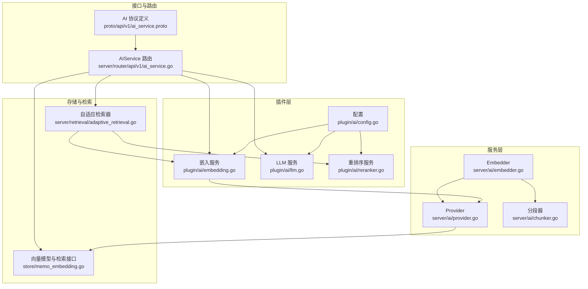
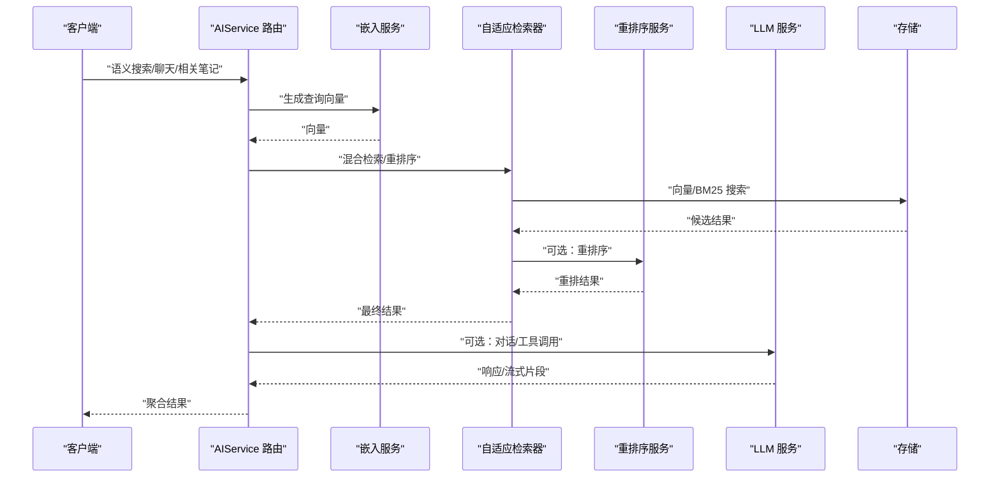
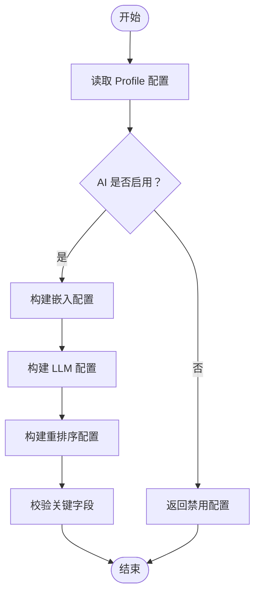
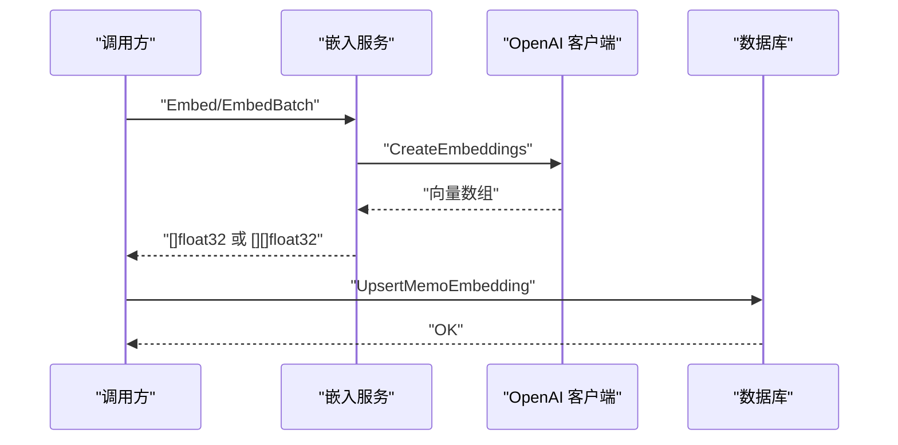
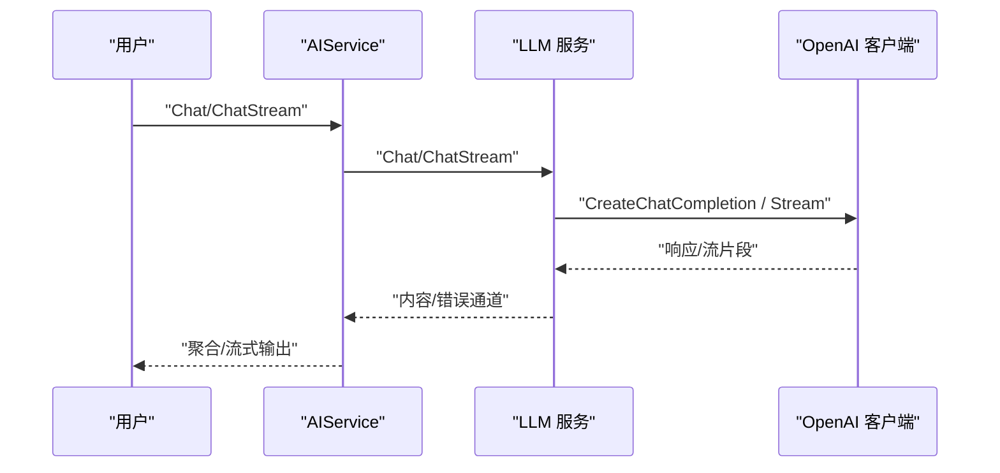
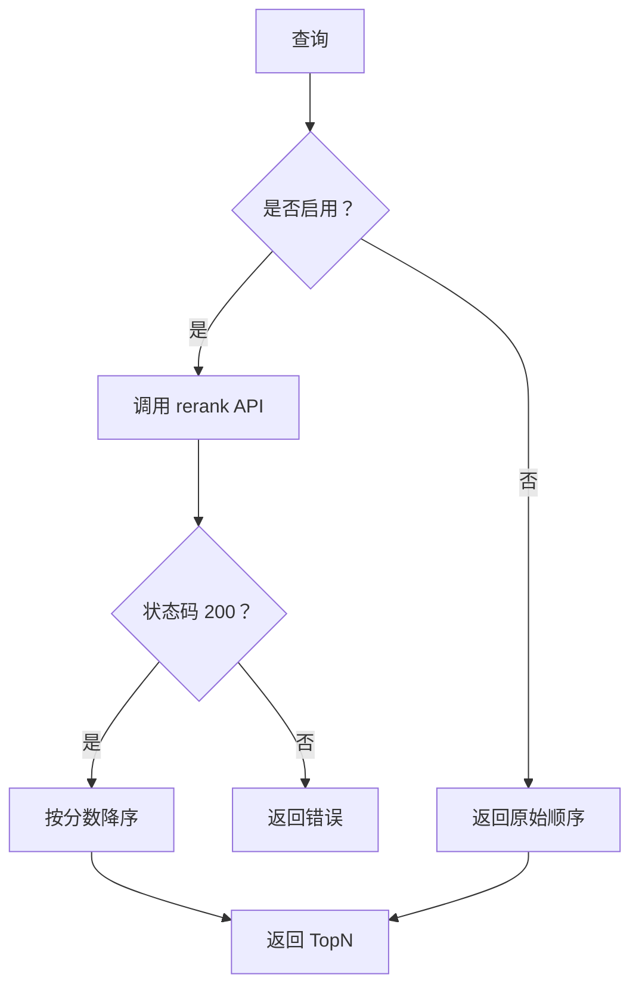
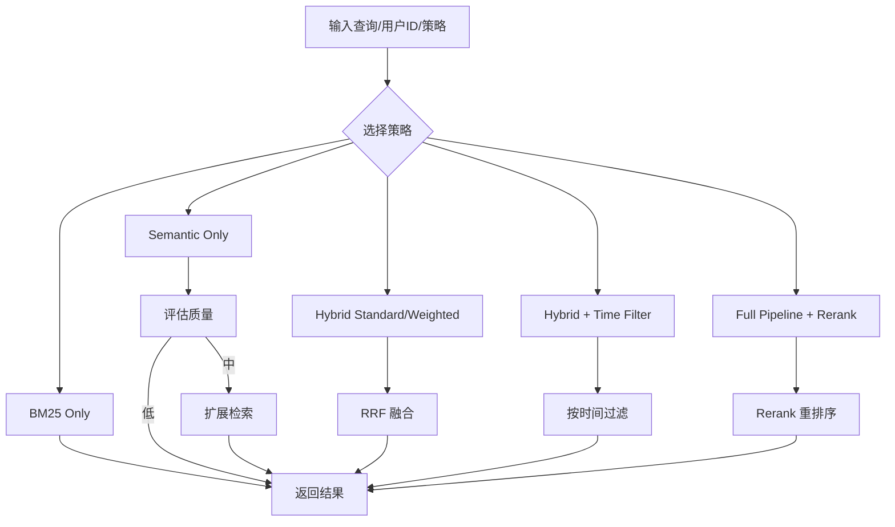
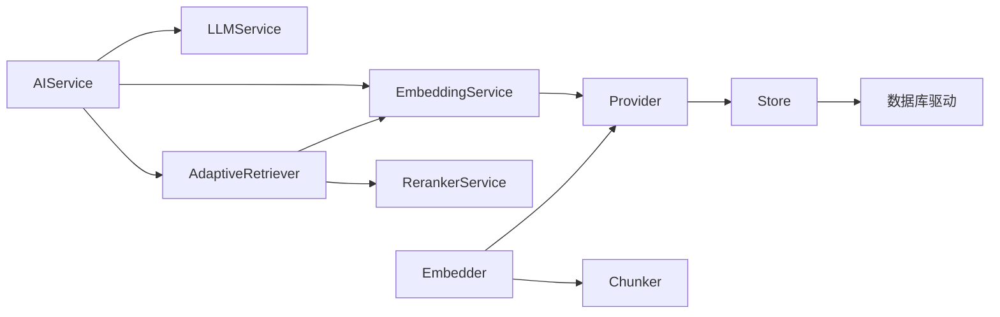

# AI 插件

<cite>
**本文档引用的文件**
- [plugin/ai/config.go](file://plugin/ai/config.go)
- [plugin/ai/embedding.go](file://plugin/ai/embedding.go)
- [plugin/ai/llm.go](file://plugin/ai/llm.go)
- [plugin/ai/reranker.go](file://plugin/ai/reranker.go)
- [server/ai/provider.go](file://server/ai/provider.go)
- [server/ai/embedder.go](file://server/ai/embedder.go)
- [server/ai/chunker.go](file://server/ai/chunker.go)
- [store/memo_embedding.go](file://store/memo_embedding.go)
- [server/retrieval/adaptive_retrieval.go](file://server/retrieval/adaptive_retrieval.go)
- [server/router/api/v1/ai_service.go](file://server/router/api/v1/ai_service.go)
- [proto/api/v1/ai_service.proto](file://proto/api/v1/ai_service.proto)
- [docs/specs/AI-007-ai-plugin-config.md](file://docs/specs/AI-007-ai-plugin-config.md)
- [docs/specs/AI-008-embedding-service.md](file://docs/specs/AI-008-embedding-service.md)
- [docs/specs/AI-009-reranker-service.md](file://docs/specs/AI-009-reranker-service.md)
- [docs/specs/AI-010-llm-service.md](file://docs/specs/AI-010-llm-service.md)
</cite>

## 目录
1. [简介](#简介)
2. [项目结构](#项目结构)
3. [核心组件](#核心组件)
4. [架构总览](#架构总览)
5. [详细组件分析](#详细组件分析)
6. [依赖关系分析](#依赖关系分析)
7. [性能考虑](#性能考虑)
8. [故障排查指南](#故障排查指南)
9. [结论](#结论)
10. [附录](#附录)

## 简介
本文件系统性梳理 AI 插件的设计与实现，覆盖嵌入服务、大语言模型服务（LLM）、重排序服务以及检索与代理体系。文档重点阐述：
- 配置管理与模型选择
- 向量嵌入生成、相似度计算与语义搜索
- LLM 接口设计、响应处理与错误恢复
- 性能优化、缓存策略与并发控制
- 集成示例与使用指南

## 项目结构
AI 插件位于 plugin/ai 目录，围绕“配置-服务-检索-代理”四层构建；同时 server/ai 提供底层 Provider 与 Embedder 能力；store/memo_embedding.go 定义向量检索的数据模型；server/retrieval/adaptive_retrieval.go 实现混合检索与重排序；server/router/api/v1/ai_service.go 暴露 AIService 的服务端实现；proto/api/v1/ai_service.proto 定义前端交互协议。

图表来源
- [plugin/ai/config.go](file://plugin/ai/config.go#L1-L129)
- [plugin/ai/embedding.go](file://plugin/ai/embedding.go#L1-L103)
- [plugin/ai/llm.go](file://plugin/ai/llm.go#L1-L326)
- [plugin/ai/reranker.go](file://plugin/ai/reranker.go#L1-L127)
- [server/ai/provider.go](file://server/ai/provider.go#L1-L221)
- [server/ai/embedder.go](file://server/ai/embedder.go#L1-L123)
- [server/ai/chunker.go](file://server/ai/chunker.go#L1-L151)
- [store/memo_embedding.go](file://store/memo_embedding.go#L1-L155)
- [server/retrieval/adaptive_retrieval.go](file://server/retrieval/adaptive_retrieval.go#L1-L762)
- [server/router/api/v1/ai_service.go](file://server/router/api/v1/ai_service.go#L1-L74)
- [proto/api/v1/ai_service.proto](file://proto/api/v1/ai_service.proto#L1-L371)

章节来源
- [plugin/ai/config.go](file://plugin/ai/config.go#L1-L129)
- [plugin/ai/embedding.go](file://plugin/ai/embedding.go#L1-L103)
- [plugin/ai/llm.go](file://plugin/ai/llm.go#L1-L326)
- [plugin/ai/reranker.go](file://plugin/ai/reranker.go#L1-L127)
- [server/ai/provider.go](file://server/ai/provider.go#L1-L221)
- [server/ai/embedder.go](file://server/ai/embedder.go#L1-L123)
- [server/ai/chunker.go](file://server/ai/chunker.go#L1-L151)
- [store/memo_embedding.go](file://store/memo_embedding.go#L1-L155)
- [server/retrieval/adaptive_retrieval.go](file://server/retrieval/adaptive_retrieval.go#L1-L762)
- [server/router/api/v1/ai_service.go](file://server/router/api/v1/ai_service.go#L1-L74)
- [proto/api/v1/ai_service.proto](file://proto/api/v1/ai_service.proto#L1-L371)

## 核心组件
- 配置模块：集中解析与校验 AI 插件配置，支持多供应商（SiliconFlow、OpenAI、DeepSeek、Ollama）与参数（模型、维度、温度、最大令牌数等）。
- 嵌入服务：封装第三方 Embedding API，提供单条与批量向量生成，统一维度输出。
- LLM 服务：封装第三方 LLM API，支持同步与流式对话，具备工具调用能力。
- 重排序服务：基于 SiliconFlow rerank API 的重排序能力，支持禁用时的降级逻辑。
- Provider 与 Embedder：底层封装 OpenAI 兼容客户端，负责嵌入生成与持久化。
- 分段器：将长文本按段落与句边界切分为固定大小的片段，保证上下文连续性。
- 存储与检索：定义向量与 BM25 检索接口，提供向量搜索、分页与评分。
- 自适应检索器：混合 BM25 与向量检索，采用 RRF 融合，支持重排序与时间过滤。
- AIService 路由：对外暴露语义搜索、聊天、相关笔记等接口，协调嵌入、检索与 LLM。

章节来源
- [plugin/ai/config.go](file://plugin/ai/config.go#L1-L129)
- [plugin/ai/embedding.go](file://plugin/ai/embedding.go#L1-L103)
- [plugin/ai/llm.go](file://plugin/ai/llm.go#L1-L326)
- [plugin/ai/reranker.go](file://plugin/ai/reranker.go#L1-L127)
- [server/ai/provider.go](file://server/ai/provider.go#L1-L221)
- [server/ai/embedder.go](file://server/ai/embedder.go#L1-L123)
- [server/ai/chunker.go](file://server/ai/chunker.go#L1-L151)
- [store/memo_embedding.go](file://store/memo_embedding.go#L1-L155)
- [server/retrieval/adaptive_retrieval.go](file://server/retrieval/adaptive_retrieval.go#L1-L762)
- [server/router/api/v1/ai_service.go](file://server/router/api/v1/ai_service.go#L1-L74)

## 架构总览
AI 插件采用“配置驱动 + 服务抽象 + 检索融合 + 代理扩展”的架构。前端通过 AIService 协议发起请求，后端根据策略选择嵌入、检索或 LLM 能力，并在必要时结合重排序提升相关性。

图表来源
- [server/router/api/v1/ai_service.go](file://server/router/api/v1/ai_service.go#L1-L74)
- [plugin/ai/embedding.go](file://plugin/ai/embedding.go#L1-L103)
- [plugin/ai/reranker.go](file://plugin/ai/reranker.go#L1-L127)
- [plugin/ai/llm.go](file://plugin/ai/llm.go#L1-L326)
- [server/retrieval/adaptive_retrieval.go](file://server/retrieval/adaptive_retrieval.go#L1-L762)
- [store/memo_embedding.go](file://store/memo_embedding.go#L1-L155)

## 详细组件分析

### 配置管理与模型选择
- 配置结构：包含嵌入、重排序与 LLM 三部分，支持多供应商与基础 URL、API Key、模型、维度、温度、最大令牌数等参数。
- 解析与校验：从 Profile 读取配置，按供应商设置默认 BaseURL 与 API Key，禁用时跳过关键校验。
- 用途：驱动嵌入、LLM 与重排序服务初始化。

图表来源
- [plugin/ai/config.go](file://plugin/ai/config.go#L46-L128)
- [docs/specs/AI-007-ai-plugin-config.md](file://docs/specs/AI-007-ai-plugin-config.md#L1-L186)

章节来源
- [plugin/ai/config.go](file://plugin/ai/config.go#L1-L129)
- [docs/specs/AI-007-ai-plugin-config.md](file://docs/specs/AI-007-ai-plugin-config.md#L1-L186)

### 嵌入服务与向量生成
- 接口：提供单条与批量向量生成，返回维度信息。
- 实现：兼容 OpenAI API 的 SiliconFlow 与 OpenAI，支持 Ollama；内部使用 go-openai 客户端。
- 数据流：文本 → 分段（可选）→ 向量 → 存储（平均池化后的单一向量）。

图表来源
- [plugin/ai/embedding.go](file://plugin/ai/embedding.go#L29-L98)
- [server/ai/embedder.go](file://server/ai/embedder.go#L25-L62)
- [server/ai/chunker.go](file://server/ai/chunker.go#L15-L74)
- [store/memo_embedding.go](file://store/memo_embedding.go#L105-L108)

章节来源
- [plugin/ai/embedding.go](file://plugin/ai/embedding.go#L1-L103)
- [server/ai/embedder.go](file://server/ai/embedder.go#L1-L123)
- [server/ai/chunker.go](file://server/ai/chunker.go#L1-L151)
- [store/memo_embedding.go](file://store/memo_embedding.go#L1-L155)
- [docs/specs/AI-008-embedding-service.md](file://docs/specs/AI-008-embedding-service.md#L1-L189)

### LLM 服务与对话处理
- 接口：同步对话与流式对话；支持工具调用（函数式工具描述）。
- 实现：兼容 OpenAI API 的 DeepSeek 与 OpenAI，支持 Ollama；内置超时保护与日志。
- 错误恢复：统一包装错误，区分空响应、网络异常与流中断。

图表来源
- [plugin/ai/llm.go](file://plugin/ai/llm.go#L106-L196)
- [plugin/ai/llm.go](file://plugin/ai/llm.go#L198-L269)
- [server/router/api/v1/ai_service.go](file://server/router/api/v1/ai_service.go#L1-L74)

章节来源
- [plugin/ai/llm.go](file://plugin/ai/llm.go#L1-L326)
- [docs/specs/AI-010-llm-service.md](file://docs/specs/AI-010-llm-service.md#L1-L216)

### 重排序服务与降级策略
- 接口：接收查询、候选文档与 topN，返回重排序结果。
- 实现：调用 SiliconFlow rerank API；禁用时按原始顺序返回，带轻微递减分数以维持顺序。
- 错误处理：非 200 状态码返回明确错误信息；网络异常捕获并上抛。

图表来源
- [plugin/ai/reranker.go](file://plugin/ai/reranker.go#L59-L126)

章节来源
- [plugin/ai/reranker.go](file://plugin/ai/reranker.go#L1-L127)
- [docs/specs/AI-009-reranker-service.md](file://docs/specs/AI-009-reranker-service.md#L1-L184)

### 语义搜索与混合检索
- 检索策略：支持纯 BM25、纯语义、标准混合（RRF）、加权混合、带时间过滤、完整管线（混合+重排序）。
- 质量评估：根据最高分与分差判断质量等级，决定是否扩展检索或重排序。
- 内存优化：预分配切片、截断长文档、及时释放大对象引用。
- 时间过滤：对日程结果按时间范围过滤。

图表来源
- [server/retrieval/adaptive_retrieval.go](file://server/retrieval/adaptive_retrieval.go#L68-L115)
- [server/retrieval/adaptive_retrieval.go](file://server/retrieval/adaptive_retrieval.go#L330-L407)
- [server/retrieval/adaptive_retrieval.go](file://server/retrieval/adaptive_retrieval.go#L409-L491)

章节来源
- [server/retrieval/adaptive_retrieval.go](file://server/retrieval/adaptive_retrieval.go#L1-L762)
- [store/memo_embedding.go](file://store/memo_embedding.go#L36-L61)

### AIService 接口与路由
- 能力开关：IsEnabled/IsLLMEnabled 依据嵌入与 LLM 服务能力判定。
- 会话与事件：延迟初始化事件总线与对话服务，支持上下文构建与摘要。
- 用户鉴权：从上下文提取当前用户，确保按用户隔离检索与会话。

章节来源
- [server/router/api/v1/ai_service.go](file://server/router/api/v1/ai_service.go#L1-L74)
- [proto/api/v1/ai_service.proto](file://proto/api/v1/ai_service.proto#L12-L110)

## 依赖关系分析
- 组件耦合：AIService 依赖嵌入、重排序与 LLM 服务；检索器依赖嵌入与重排序；Provider/Embedder 依赖存储驱动。
- 外部依赖：OpenAI 兼容 API（SiliconFlow、OpenAI、DeepSeek）、HTTP 客户端（重排序）、go-openai 客户端（嵌入与 LLM）。
- 循环依赖：未见循环导入；各层职责清晰，接口抽象良好。

图表来源
- [server/router/api/v1/ai_service.go](file://server/router/api/v1/ai_service.go#L21-L43)
- [server/retrieval/adaptive_retrieval.go](file://server/retrieval/adaptive_retrieval.go#L24-L66)
- [server/ai/provider.go](file://server/ai/provider.go#L36-L73)
- [server/ai/embedder.go](file://server/ai/embedder.go#L11-L23)

章节来源
- [server/router/api/v1/ai_service.go](file://server/router/api/v1/ai_service.go#L1-L74)
- [server/retrieval/adaptive_retrieval.go](file://server/retrieval/adaptive_retrieval.go#L1-L762)
- [server/ai/provider.go](file://server/ai/provider.go#L1-L221)
- [server/ai/embedder.go](file://server/ai/embedder.go#L1-L123)

## 性能考虑
- 并发与限流
  - 嵌入批处理：Embedder 使用信号量限制并发（默认 3），避免外部 API 限流与抖动。
  - 全局 AI 速率限制：AIService 持有全局速率限制器，统一控制请求频率。
- 超时与重试
  - LLM 与流式对话：统一 5 分钟超时保护，避免长时间阻塞。
  - Provider：指数回退重试（最大重试次数、等待时间随尝试递增）。
- 内存与 I/O
  - 检索器：预分配切片容量、截断长文档、释放不再使用的对象引用。
  - 分段器：按段落与句边界切分，保留上下文连续性，避免跨句丢失语义。
- 检索策略
  - RRF 融合：平衡 BM25 与向量检索，减少噪声；仅在必要时启用重排序，降低 API 成本。
  - 质量评估：根据分差与最高分自动决策是否扩展或重排，提高命中质量。

章节来源
- [server/ai/embedder.go](file://server/ai/embedder.go#L64-L92)
- [server/router/api/v1/ai_service.go](file://server/router/api/v1/ai_service.go#L17-L18)
- [plugin/ai/llm.go](file://plugin/ai/llm.go#L106-L128)
- [plugin/ai/llm.go](file://plugin/ai/llm.go#L198-L269)
- [server/ai/provider.go](file://server/ai/provider.go#L177-L200)
- [server/retrieval/adaptive_retrieval.go](file://server/retrieval/adaptive_retrieval.go#L330-L407)
- [server/ai/chunker.go](file://server/ai/chunker.go#L15-L74)

## 故障排查指南
- 配置问题
  - 缺少 API Key：当供应商非 Ollama 时必须提供 API Key，否则校验失败。
  - BaseURL 错误：确认供应商 BaseURL 与模型名称正确。
- 嵌入服务
  - 空响应：检查输入文本是否为空，确认外部 API 返回非空向量。
  - 维度不匹配：确保嵌入维度与存储一致。
- LLM 服务
  - 超时：检查网络与供应商限流；适当缩短提示词或分段。
  - 流式中断：关注 EOF 与通道关闭时机，确保客户端正确处理 done 标记。
- 重排序服务
  - 非 200：查看返回体中的错误信息；确认 API Key 有效且额度充足。
  - 降级行为：未启用时返回原始顺序，属预期。
- 检索与存储
  - 查询过长：输入长度限制为 1000 字符；BM25 查询长度限制为 500。
  - 分数异常：检查最小分数阈值与评分范围；确认向量维度与存储一致。

章节来源
- [plugin/ai/config.go](file://plugin/ai/config.go#L105-L128)
- [plugin/ai/embedding.go](file://plugin/ai/embedding.go#L71-L98)
- [plugin/ai/llm.go](file://plugin/ai/llm.go#L217-L243)
- [plugin/ai/reranker.go](file://plugin/ai/reranker.go#L99-L102)
- [server/retrieval/adaptive_retrieval.go](file://server/retrieval/adaptive_retrieval.go#L78-L81)
- [store/memo_embedding.go](file://store/memo_embedding.go#L43-L61)

## 结论
该 AI 插件体系以清晰的分层与接口抽象实现了从配置、嵌入、检索到 LLM 的完整链路。通过混合检索与可选重排序，兼顾召回质量与成本；通过并发限制、超时与重试机制保障稳定性；通过分段与内存优化降低资源消耗。整体设计具备良好的扩展性与可维护性，适合在生产环境中持续演进。

## 附录

### 配置项与参数调优建议
- 嵌入服务
  - 维度：保持与模型一致（如 1024），避免后续向量比较失败。
  - 批量大小：结合外部 API 限额与延迟，合理设置批量大小。
- LLM 服务
  - 温度：0.7 为默认值，创意场景可适度提高，严谨场景可降低。
  - 最大令牌数：根据任务复杂度调整，避免截断重要信息。
- 重排序服务
  - 启用条件：结果数量较多、查询较复杂、前两名分差较小。
  - topN：平衡相关性与性能，避免过大导致 API 成本上升。

章节来源
- [plugin/ai/config.go](file://plugin/ai/config.go#L18-L44)
- [plugin/ai/llm.go](file://plugin/ai/llm.go#L36-L44)
- [server/retrieval/adaptive_retrieval.go](file://server/retrieval/adaptive_retrieval.go#L686-L712)

### 集成示例与使用指南
- 启用 AI 功能
  - 在 Profile 中开启 AI，并配置嵌入与 LLM 供应商、模型与 API Key。
  - 若启用重排序，需提供 SiliconFlow API Key 与 BaseURL。
- 语义搜索
  - 调用 AIService 的语义搜索接口，传入查询与限制数量；服务端将生成查询向量并执行混合检索。
- 对话与工具调用
  - 使用 Chat/ChatStream 接口发起对话；若需要工具调用，提供工具描述（JSON Schema）。
- 相关笔记
  - 获取与某笔记相关的其他笔记，便于知识关联与续写。

章节来源
- [server/router/api/v1/ai_service.go](file://server/router/api/v1/ai_service.go#L45-L55)
- [proto/api/v1/ai_service.proto](file://proto/api/v1/ai_service.proto#L14-L43)
- [plugin/ai/llm.go](file://plugin/ai/llm.go#L130-L196)