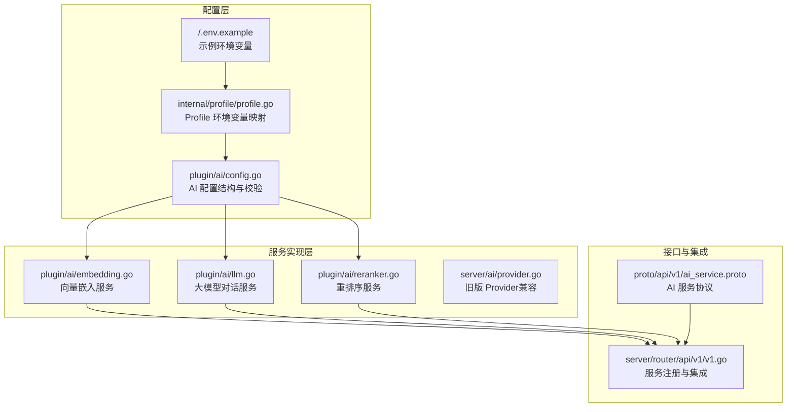
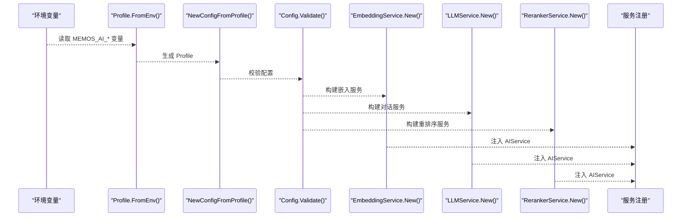
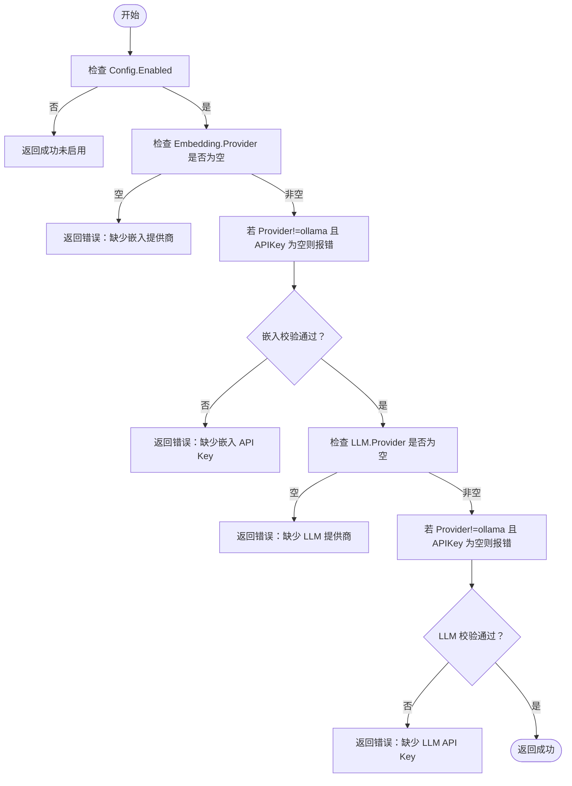
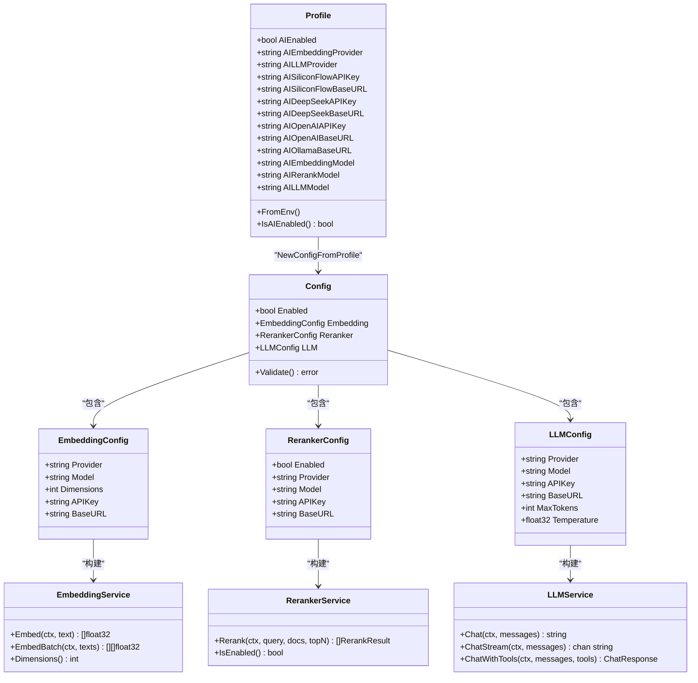

# AI 配置管理

<cite>
**本文档引用的文件**
- [plugin/ai/config.go](file://plugin/ai/config.go)
- [plugin/ai/config_test.go](file://plugin/ai/config_test.go)
- [internal/profile/profile.go](file://internal/profile/profile.go)
- [.env.example](file://.env.example)
- [plugin/ai/embedding.go](file://plugin/ai/embedding.go)
- [plugin/ai/llm.go](file://plugin/ai/llm.go)
- [plugin/ai/reranker.go](file://plugin/ai/reranker.go)
- [server/ai/provider.go](file://server/ai/provider.go)
- [proto/api/v1/ai_service.proto](file://proto/api/v1/ai_service.proto)
- [server/router/api/v1/v1.go](file://server/router/api/v1/v1.go)
- [plugin/ai/embedding_test.go](file://plugin/ai/embedding_test.go)
- [plugin/ai/llm_test.go](file://plugin/ai/llm_test.go)
- [plugin/ai/reranker_test.go](file://plugin/ai/reranker_test.go)
</cite>

## 目录
1. [简介](#简介)
2. [项目结构](#项目结构)
3. [核心组件](#核心组件)
4. [架构总览](#架构总览)
5. [详细组件分析](#详细组件分析)
6. [依赖关系分析](#依赖关系分析)
7. [性能考量](#性能考量)
8. [故障排除指南](#故障排除指南)
9. [结论](#结论)
10. [附录](#附录)

## 简介
本文件系统化梳理了 Memos 项目中 AI 配置管理的设计与实现，覆盖配置结构、参数设置、验证机制、提供商差异、API 密钥与基础 URL 管理、配置加载流程、默认值处理、运行时验证、环境变量支持、动态更新策略、安全与性能影响以及常见问题排查。目标是帮助开发者与运维人员快速理解并正确配置 AI 能力。

## 项目结构
围绕 AI 配置管理的关键模块分布如下：
- 配置定义与加载：plugin/ai/config.go、internal/profile/profile.go
- 服务实现：plugin/ai/embedding.go、plugin/ai/llm.go、plugin/ai/reranker.go
- 旧版 Provider（兼容层）：server/ai/provider.go
- API 协议：proto/api/v1/ai_service.proto
- 服务注册与集成：server/router/api/v1/v1.go
- 示例与测试：.env.example、各组件的 *_test.go 文件

**图表来源**
- [plugin/ai/config.go](file://plugin/ai/config.go#L9-L44)
- [internal/profile/profile.go](file://internal/profile/profile.go#L35-L99)
- [.env.example](file://.env.example#L26-L57)
- [plugin/ai/embedding.go](file://plugin/ai/embedding.go#L11-L58)
- [plugin/ai/llm.go](file://plugin/ai/llm.go#L20-L104)
- [plugin/ai/reranker.go](file://plugin/ai/reranker.go#L20-L53)
- [server/ai/provider.go](file://server/ai/provider.go#L14-L73)
- [proto/api/v1/ai_service.proto](file://proto/api/v1/ai_service.proto#L12-L117)
- [server/router/api/v1/v1.go](file://server/router/api/v1/v1.go#L80-L118)

**章节来源**
- [plugin/ai/config.go](file://plugin/ai/config.go#L9-L128)
- [internal/profile/profile.go](file://internal/profile/profile.go#L35-L99)
- [.env.example](file://.env.example#L26-L57)
- [plugin/ai/embedding.go](file://plugin/ai/embedding.go#L11-L103)
- [plugin/ai/llm.go](file://plugin/ai/llm.go#L20-L326)
- [plugin/ai/reranker.go](file://plugin/ai/reranker.go#L20-L127)
- [server/ai/provider.go](file://server/ai/provider.go#L14-L221)
- [proto/api/v1/ai_service.proto](file://proto/api/v1/ai_service.proto#L12-L117)
- [server/router/api/v1/v1.go](file://server/router/api/v1/v1.go#L80-L118)

## 核心组件
- 配置结构与验证
  - Config：聚合 Enabled、Embedding、Reranker、LLM 四部分配置，并提供 Validate 校验。
  - EmbeddingConfig：Provider、Model、Dimensions、APIKey、BaseURL。
  - RerankerConfig：Enabled、Provider、Model、APIKey、BaseURL。
  - LLMConfig：Provider、Model、APIKey、BaseURL、MaxTokens、Temperature。
- Profile 环境变量映射
  - 提供 MEMOS_AI_* 系列环境变量到 Profile 字段的映射，默认值与启用判断。
- 服务实现
  - EmbeddingService：基于 EmbeddingConfig 构建，支持 SiliconFlow/OpenAI；Ollama 不再作为嵌入提供商。
  - LLMService：基于 LLMConfig 构建，支持 DeepSeek/OpenAI/SiliconFlow；内置超时保护与流式输出。
  - RerankerService：基于 RerankerConfig 构建，支持禁用模式与排序返回。
- 旧版 Provider（兼容）
  - server/ai/provider.go 提供统一的 Config、默认值、重试与验证能力，便于从旧实现迁移。

**章节来源**
- [plugin/ai/config.go](file://plugin/ai/config.go#L9-L44)
- [plugin/ai/config.go](file://plugin/ai/config.go#L105-L128)
- [internal/profile/profile.go](file://internal/profile/profile.go#L35-L99)
- [plugin/ai/embedding.go](file://plugin/ai/embedding.go#L11-L58)
- [plugin/ai/llm.go](file://plugin/ai/llm.go#L20-L104)
- [plugin/ai/reranker.go](file://plugin/ai/reranker.go#L20-L53)
- [server/ai/provider.go](file://server/ai/provider.go#L14-L73)

## 架构总览
AI 配置管理贯穿“配置加载—服务构建—API 注册”的主干流程。Profile 从环境变量加载 AI 配置，plugin/ai/config.go 将其转换为内部 Config 并进行运行时校验；随后根据 Config 分别构建 EmbeddingService、LLMService、RerankerService，并注入到 AIService 与 ScheduleAgentService 中。

**图表来源**
- [internal/profile/profile.go](file://internal/profile/profile.go#L76-L99)
- [plugin/ai/config.go](file://plugin/ai/config.go#L46-L103)
- [plugin/ai/config.go](file://plugin/ai/config.go#L105-L128)
- [plugin/ai/embedding.go](file://plugin/ai/embedding.go#L29-L58)
- [plugin/ai/llm.go](file://plugin/ai/llm.go#L65-L104)
- [plugin/ai/reranker.go](file://plugin/ai/reranker.go#L37-L53)
- [server/router/api/v1/v1.go](file://server/router/api/v1/v1.go#L80-L118)

**章节来源**
- [internal/profile/profile.go](file://internal/profile/profile.go#L76-L99)
- [plugin/ai/config.go](file://plugin/ai/config.go#L46-L128)
- [plugin/ai/embedding.go](file://plugin/ai/embedding.go#L29-L58)
- [plugin/ai/llm.go](file://plugin/ai/llm.go#L65-L104)
- [plugin/ai/reranker.go](file://plugin/ai/reranker.go#L37-L53)
- [server/router/api/v1/v1.go](file://server/router/api/v1/v1.go#L80-L118)

## 详细组件分析

### 配置结构与参数
- Config.Enabled 控制是否启用 AI 功能。
- EmbeddingConfig
  - Provider：支持 siliconflow、openai、ollama（注：嵌入服务不再支持 ollama）。
  - Model：如 BAAI/bge-m3、text-embedding-3-small。
  - Dimensions：默认 1024（嵌入服务按配置传入）。
  - APIKey/BaseURL：按提供商填充。
- RerankerConfig
  - Enabled：当存在 SiliconFlow API Key 时自动启用。
  - Provider：siliconflow。
  - Model：默认 BAAI/bge-reranker-v2-m3。
  - APIKey/BaseURL：来自 SiliconFlow 配置。
- LLMConfig
  - Provider：支持 deepseek、openai、ollama。
  - Model：如 deepseek-chat、gpt-4、llama2 等。
  - APIKey/BaseURL：按提供商填充。
  - MaxTokens：默认 2048。
  - Temperature：默认 0.7。

**章节来源**
- [plugin/ai/config.go](file://plugin/ai/config.go#L9-L44)
- [plugin/ai/config.go](file://plugin/ai/config.go#L46-L103)

### 配置加载与默认值
- Profile 从环境变量加载 AI 配置，未设置时采用默认值：
  - MEMOS_AI_EMBEDDING_PROVIDER：siliconflow
  - MEMOS_AI_LLM_PROVIDER：deepseek
  - MEMOS_AI_SILICONFLOW_BASE_URL：https://api.siliconflow.cn/v1
  - MEMOS_AI_DEEPSEEK_BASE_URL：https://api.deepseek.com
  - MEMOS_AI_OPENAI_BASE_URL：https://api.openai.com/v1
  - MEMOS_AI_OLLAMA_BASE_URL：http://localhost:11434
  - MEMOS_AI_EMBEDDING_MODEL：BAAI/bge-m3
  - MEMOS_AI_RERANK_MODEL：BAAI/bge-reranker-v2-m3
  - MEMOS_AI_LLM_MODEL：deepseek-chat
- IsAIEnabled 仅在 AIEnabled 为真且至少存在一个有效密钥或本地 Ollama Base URL 时才视为启用。

**章节来源**
- [internal/profile/profile.go](file://internal/profile/profile.go#L76-L99)
- [internal/profile/profile.go](file://internal/profile/profile.go#L63-L66)
- [.env.example](file://.env.example#L26-L57)

### 运行时验证与错误处理
- Config.Validate：确保启用状态下，嵌入与 LLM 的 Provider 存在；非 ollama 时要求 APIKey 存在。
- EmbeddingService.New：仅支持 siliconflow/openai；对 ollama 抛出错误。
- LLMService.New：支持 deepseek/openai/siliconflow；对未知提供商抛错。
- RerankerService.New：根据 Enabled 字段决定是否启用；禁用时返回原始顺序并限制数量。
- 旧版 Provider.Validate：要求 API Key 存在并尝试一次嵌入请求以验证连通性。

**图表来源**
- [plugin/ai/config.go](file://plugin/ai/config.go#L105-L128)

**章节来源**
- [plugin/ai/config.go](file://plugin/ai/config.go#L105-L128)
- [plugin/ai/embedding.go](file://plugin/ai/embedding.go#L29-L58)
- [plugin/ai/llm.go](file://plugin/ai/llm.go#L65-L104)
- [plugin/ai/reranker.go](file://plugin/ai/reranker.go#L37-L53)
- [server/ai/provider.go](file://server/ai/provider.go#L158-L175)

### 不同提供商配置差异
- 嵌入服务（Embedding）
  - siliconflow：兼容 OpenAI API，需 API Key 与 Base URL。
  - openai：需 API Key 与 Base URL。
  - ollama：嵌入服务不再支持。
- 对话服务（LLM）
  - deepseek：需 API Key 与 Base URL。
  - openai：需 API Key 与 Base URL。
  - siliconflow：需 API Key 与 Base URL。
  - ollama：可在本地部署，无需 API Key，但需 Base URL。
- 重排序服务（Reranker）
  - 仅 siliconflow；当存在 SiliconFlow API Key 时自动启用。

**章节来源**
- [plugin/ai/embedding.go](file://plugin/ai/embedding.go#L33-L49)
- [plugin/ai/llm.go](file://plugin/ai/llm.go#L69-L94)
- [plugin/ai/config.go](file://plugin/ai/config.go#L63-L100)
- [plugin/ai/reranker.go](file://plugin/ai/reranker.go#L72-L102)

### API 密钥管理与基础 URL 设置
- API Key 支持三种来源：
  - 环境变量：MEMOS_AI_SILICONFLOW_API_KEY、MEMOS_AI_DEEPSEEK_API_KEY、MEMOS_AI_OPENAI_API_KEY。
  - .env 文件：示例文件提供引用系统环境变量的方式（结合 direnv）。
  - 旧版 Provider：MEMOS_AI_API_KEY（兼容）。
- Base URL 支持：
  - SiliconFlow：MEMOS_AI_SILICONFLOW_BASE_URL（默认 https://api.siliconflow.cn/v1）。
  - DeepSeek：MEMOS_AI_DEEPSEEK_BASE_URL（默认 https://api.deepseek.com）。
  - OpenAI：MEMOS_AI_OPENAI_BASE_URL（默认 https://api.openai.com/v1）。
  - Ollama：MEMOS_AI_OLLAMA_BASE_URL（默认 http://localhost:11434）。
- 旧版 Provider：MEMOS_AI_BASE_URL（默认 https://api.openai.com/v1）。

**章节来源**
- [.env.example](file://.env.example#L42-L57)
- [internal/profile/profile.go](file://internal/profile/profile.go#L76-L90)
- [server/ai/provider.go](file://server/ai/provider.go#L202-L212)

### 配置加载流程与集成点
- Profile.FromEnv 从环境变量加载 AI 配置并设置默认值。
- NewConfigFromProfile 将 Profile 转换为内部 Config，并按提供商填充 API Key 与 Base URL。
- Config.Validate 在服务初始化前执行，失败则记录警告并跳过 AI 功能。
- 服务注册：在 server/router/api/v1/v1.go 中，若 AI 配置有效，则创建 AIService、ScheduleService、ScheduleAgentService 并注册到网关与 Connect。

**章节来源**
- [internal/profile/profile.go](file://internal/profile/profile.go#L76-L99)
- [plugin/ai/config.go](file://plugin/ai/config.go#L46-L103)
- [plugin/ai/config.go](file://plugin/ai/config.go#L105-L128)
- [server/router/api/v1/v1.go](file://server/router/api/v1/v1.go#L80-L118)

### 环境变量支持与动态更新
- 环境变量映射：MEMOS_AI_* 系列变量用于控制 AI 功能开关与提供商参数。
- 动态更新策略：当前实现为一次性加载（Profile.FromEnv），未见运行时热重载逻辑。建议通过重启进程或引入外部配置中心实现动态更新。

**章节来源**
- [internal/profile/profile.go](file://internal/profile/profile.go#L76-L99)
- [.env.example](file://.env.example#L1-L57)

### 配置示例与最佳实践
- 示例文件 .env.example 展示了如何设置 MEMOS_AI_ENABLED、提供商、模型与 API Key 引用方式。
- 最佳实践
  - 优先使用 .env + direnv 管理敏感信息，避免硬编码。
  - 明确区分嵌入与对话提供商，确保 API Key 与 Base URL 与提供商匹配。
  - 对于本地部署（Ollama），仅在需要时启用，避免不必要的网络调用。
  - 在生产环境设置合理的 MaxTokens 与 Temperature，平衡质量与成本。

**章节来源**
- [.env.example](file://.env.example#L26-L57)

### 安全与合规
- API Key 管理：通过环境变量或 .env 管理，避免提交至版本库。
- Provider 选择：优先使用受信任的提供商，确保 Base URL 正确与 TLS 安全。
- 旧版 Provider：MEMOS_AI_API_KEY 与 MEMOS_AI_BASE_URL 仍可使用，但建议逐步迁移到新的插件体系。

**章节来源**
- [.env.example](file://.env.example#L42-L57)
- [server/ai/provider.go](file://server/ai/provider.go#L202-L212)

## 依赖关系分析

**图表来源**
- [internal/profile/profile.go](file://internal/profile/profile.go#L14-L99)
- [plugin/ai/config.go](file://plugin/ai/config.go#L9-L44)
- [plugin/ai/embedding.go](file://plugin/ai/embedding.go#L11-L58)
- [plugin/ai/llm.go](file://plugin/ai/llm.go#L20-L104)
- [plugin/ai/reranker.go](file://plugin/ai/reranker.go#L20-L53)

**章节来源**
- [internal/profile/profile.go](file://internal/profile/profile.go#L14-L99)
- [plugin/ai/config.go](file://plugin/ai/config.go#L9-L44)
- [plugin/ai/embedding.go](file://plugin/ai/embedding.go#L11-L58)
- [plugin/ai/llm.go](file://plugin/ai/llm.go#L20-L104)
- [plugin/ai/reranker.go](file://plugin/ai/reranker.go#L20-L53)

## 性能考量
- 嵌入与对话服务均基于 OpenAI 兼容客户端，性能取决于提供商响应时间与网络延迟。
- 重排序服务在启用时增加一次 HTTP 请求与排序开销，建议在召回结果较多时启用。
- 旧版 Provider 提供指数退避重试与超时控制，有助于提升稳定性但可能增加端到端延迟。
- 建议：
  - 合理设置 MaxTokens 与 Temperature，避免过长上下文导致延迟。
  - 对高频查询启用缓存（如语义缓存）以减少重复请求。
  - 在高并发场景下评估提供商配额与限流策略。

**章节来源**
- [plugin/ai/reranker.go](file://plugin/ai/reranker.go#L59-L126)
- [server/ai/provider.go](file://server/ai/provider.go#L177-L200)

## 故障排除指南
- 常见错误与定位
  - 缺少嵌入或 LLM API Key：检查 MEMOS_AI_* 环境变量是否正确设置。
  - 嵌入提供商不支持：确认使用 siliconflow/openai；Ollama 不再支持嵌入。
  - 重排序服务未生效：确认 MEMOS_AI_SILICONFLOW_API_KEY 已设置。
  - 旧版 Provider 校验失败：确认 MEMOS_AI_API_KEY 已设置且可访问 Base URL。
- 单元测试参考
  - 配置构造与校验：plugin/ai/config_test.go
  - 嵌入服务：plugin/ai/embedding_test.go
  - 对话服务：plugin/ai/llm_test.go
  - 重排序服务：plugin/ai/reranker_test.go
- 日志与调试
  - Profile 与 Config 初始化过程会输出日志，便于定位配置问题。
  - 旧版 Provider.Validate 会在验证失败时输出详细错误信息。

**章节来源**
- [plugin/ai/config_test.go](file://plugin/ai/config_test.go#L145-L239)
- [plugin/ai/embedding_test.go](file://plugin/ai/embedding_test.go#L8-L64)
- [plugin/ai/llm_test.go](file://plugin/ai/llm_test.go#L9-L69)
- [plugin/ai/reranker_test.go](file://plugin/ai/reranker_test.go#L8-L26)
- [server/ai/provider.go](file://server/ai/provider.go#L158-L175)

## 结论
本配置管理体系以 Profile 为中心，通过 NewConfigFromProfile 将环境变量映射为内部配置，并在服务初始化前进行严格校验。插件化的 Embedding/LLM/Reranker 服务分别针对不同提供商提供一致的接口与默认值策略，配合 API 协议与服务注册形成完整的 AI 能力闭环。建议在生产环境中遵循安全与性能最佳实践，并通过测试用例与日志持续验证配置有效性。

## 附录
- API 协议要点
  - AIService 提供语义搜索、标签建议、聊天、相关记忆检索等能力。
  - ScheduleAgentService 提供日程代理的聊天与流式聊天能力。
- 关键字段与默认值
  - Provider 默认值：嵌入 siliconflow、LLM deepseek。
  - Base URL 默认值：SiliconFlow、DeepSeek、OpenAI、Ollama。
  - 模型默认值：嵌入 BAAI/bge-m3、重排序 BAAI/bge-reranker-v2-m3、LLM deepseek-chat。

**章节来源**
- [proto/api/v1/ai_service.proto](file://proto/api/v1/ai_service.proto#L12-L117)
- [internal/profile/profile.go](file://internal/profile/profile.go#L76-L99)