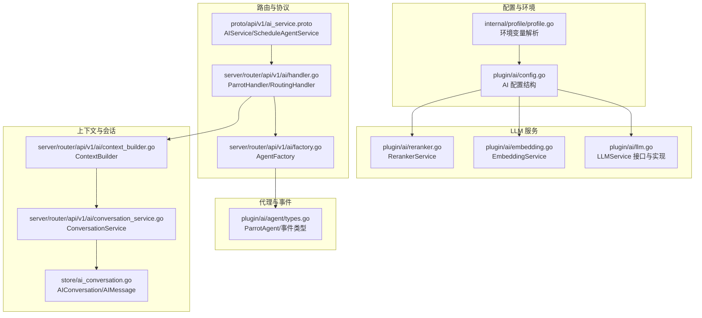
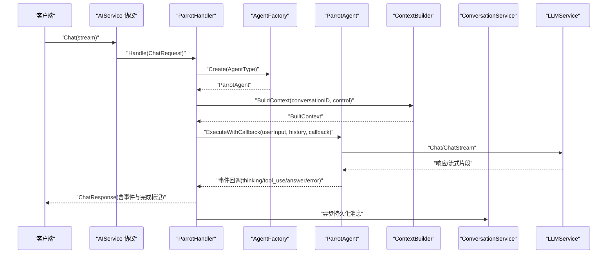
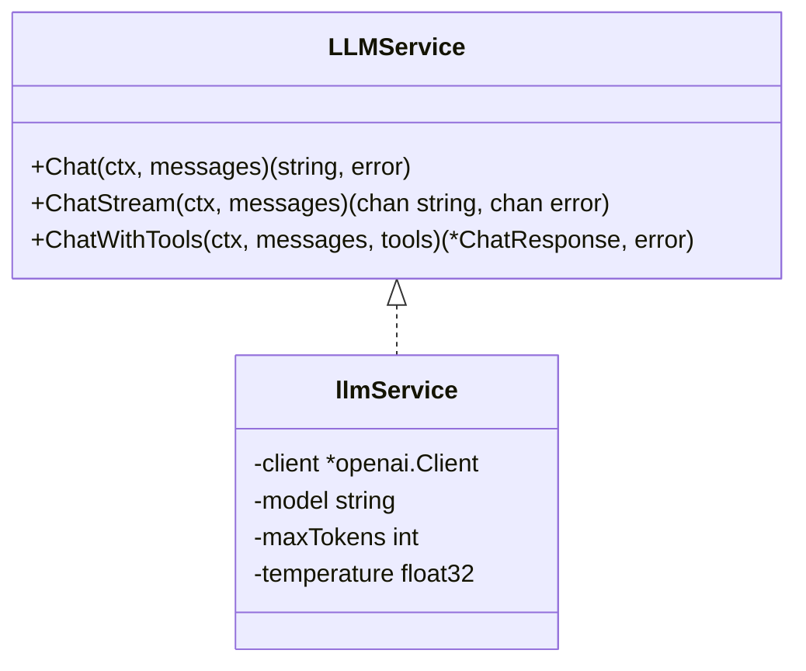
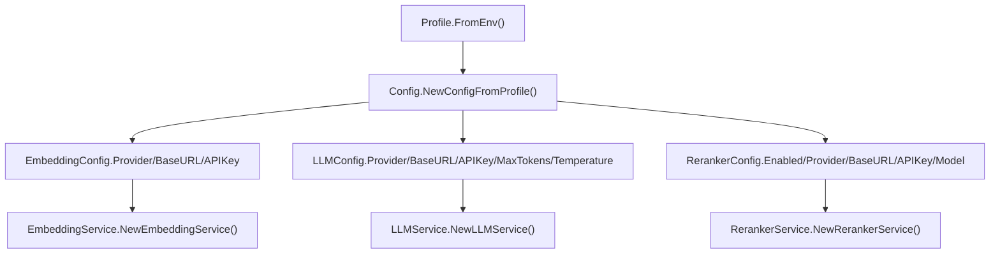
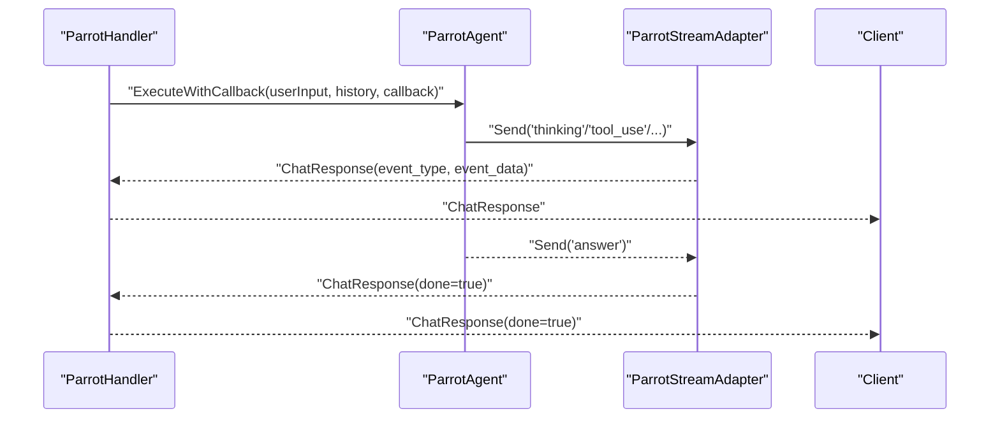
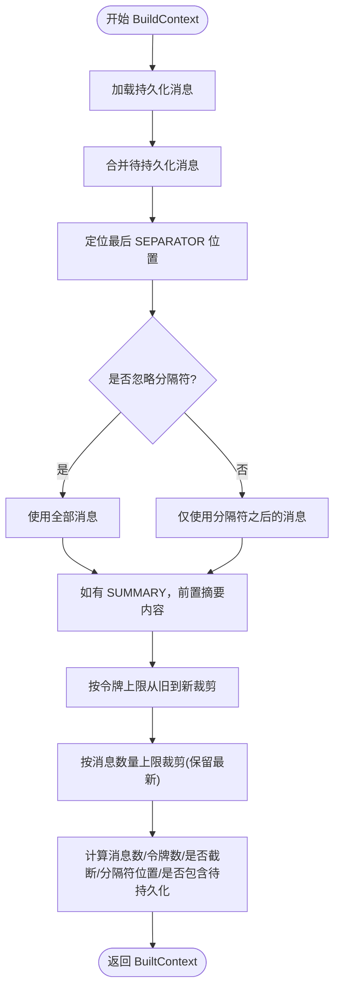
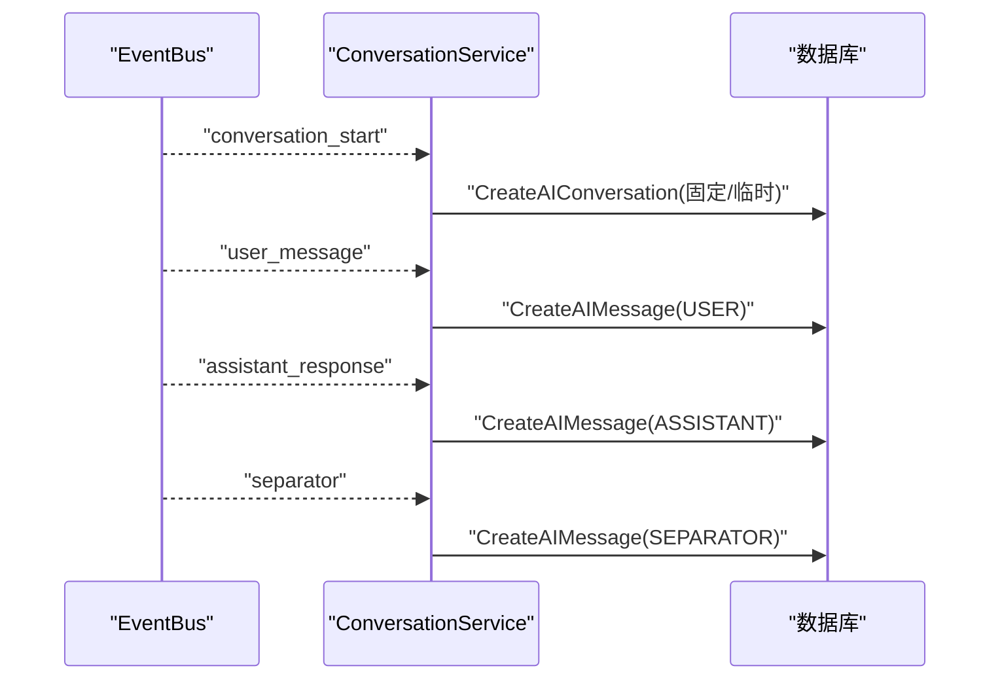
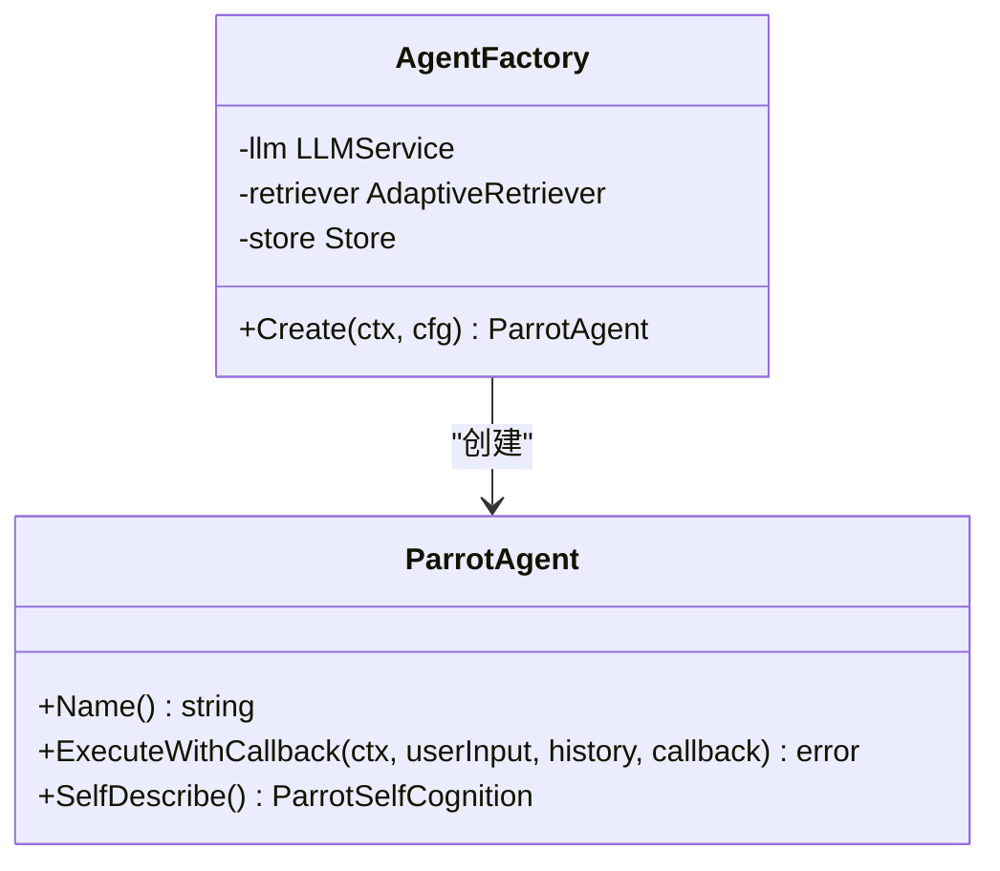
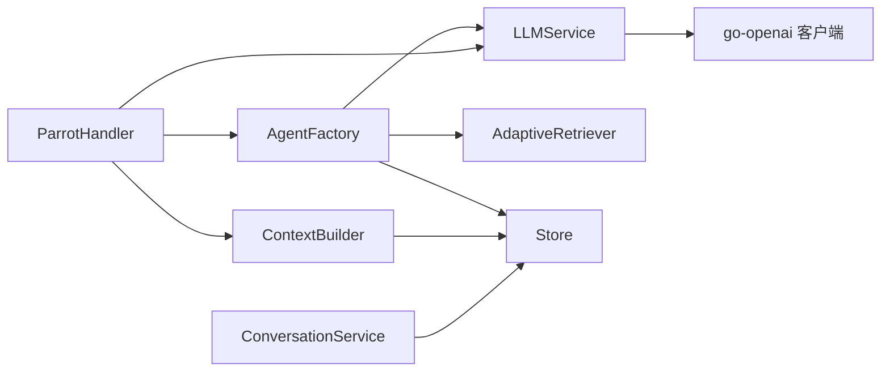

# 大语言模型服务

<cite>
**本文引用的文件**
- [plugin/ai/llm.go](file://plugin/ai/llm.go)
- [plugin/ai/config.go](file://plugin/ai/config.go)
- [plugin/ai/embedding.go](file://plugin/ai/embedding.go)
- [plugin/ai/reranker.go](file://plugin/ai/reranker.go)
- [server/router/api/v1/ai/handler.go](file://server/router/api/v1/ai/handler.go)
- [server/router/api/v1/ai/conversation_service.go](file://server/router/api/v1/ai/conversation_service.go)
- [server/router/api/v1/ai/context_builder.go](file://server/router/api/v1/ai/context_builder.go)
- [server/router/api/v1/ai/factory.go](file://server/router/api/v1/ai/factory.go)
- [proto/api/v1/ai_service.proto](file://proto/api/v1/ai_service.proto)
- [internal/profile/profile.go](file://internal/profile/profile.go)
- [store/ai_conversation.go](file://store/ai_conversation.go)
- [plugin/ai/agent/types.go](file://plugin/ai/agent/types.go)
</cite>

## 目录
1. [简介](#简介)
2. [项目结构](#项目结构)
3. [核心组件](#核心组件)
4. [架构总览](#架构总览)
5. [详细组件分析](#详细组件分析)
6. [依赖关系分析](#依赖关系分析)
7. [性能考量](#性能考量)
8. [故障排除指南](#故障排除指南)
9. [结论](#结论)
10. [附录](#附录)

## 简介
本文件面向“大语言模型服务”的技术文档，覆盖架构设计、模型接口与响应处理机制，以及对不同 LLM 提供商（DeepSeek、OpenAI、Ollama）的集成与配置差异；解释温度、最大令牌数等关键配置对模型行为的影响；阐述流式响应处理、错误恢复与超时管理；提供调用示例、性能监控与故障排除指南，并总结提示工程、上下文管理与对话状态管理的最佳实践。

## 项目结构
围绕 LLM 服务的关键模块分布如下：
- 配置与提供商：通过配置对象与环境变量驱动，支持多提供商切换与校验
- LLM 服务层：统一接口封装，兼容 OpenAI 兼容 API 的提供商（DeepSeek、OpenAI、SiliconFlow）
- 上下文构建：基于消息历史与分隔符的上下文裁剪与令牌限制
- 会话持久化：事件总线驱动的消息持久化与固定/临时会话管理
- 代理工厂：根据代理类型创建不同能力的智能体（备忘录、日程、综合）
- 协议与路由：Connect/HTTP 协议定义与服务端路由处理
- 向量化与重排序：嵌入与重排序服务，支撑语义检索与相关性排序
- 数据模型：AI 会话与消息的数据结构

**图表来源**
- [internal/profile/profile.go](file://internal/profile/profile.go#L35-L99)
- [plugin/ai/config.go](file://plugin/ai/config.go#L9-L103)
- [plugin/ai/llm.go](file://plugin/ai/llm.go#L66-L104)
- [plugin/ai/embedding.go](file://plugin/ai/embedding.go#L30-L58)
- [plugin/ai/reranker.go](file://plugin/ai/reranker.go#L37-L53)
- [proto/api/v1/ai_service.proto](file://proto/api/v1/ai_service.proto#L13-L130)
- [server/router/api/v1/ai/handler.go](file://server/router/api/v1/ai/handler.go#L25-L78)
- [server/router/api/v1/ai/factory.go](file://server/router/api/v1/ai/factory.go#L62-L99)
- [server/router/api/v1/ai/context_builder.go](file://server/router/api/v1/ai/context_builder.go#L61-L224)
- [server/router/api/v1/ai/conversation_service.go](file://server/router/api/v1/ai/conversation_service.go#L209-L330)
- [store/ai_conversation.go](file://store/ai_conversation.go#L3-L61)
- [plugin/ai/agent/types.go](file://plugin/ai/agent/types.go#L10-L23)

**章节来源**
- [plugin/ai/llm.go](file://plugin/ai/llm.go#L1-L326)
- [plugin/ai/config.go](file://plugin/ai/config.go#L1-L129)
- [server/router/api/v1/ai/context_builder.go](file://server/router/api/v1/ai/context_builder.go#L1-L285)
- [server/router/api/v1/ai/conversation_service.go](file://server/router/api/v1/ai/conversation_service.go#L1-L465)
- [server/router/api/v1/ai/handler.go](file://server/router/api/v1/ai/handler.go#L1-L208)
- [server/router/api/v1/ai/factory.go](file://server/router/api/v1/ai/factory.go#L1-L176)
- [proto/api/v1/ai_service.proto](file://proto/api/v1/ai_service.proto#L1-L371)
- [internal/profile/profile.go](file://internal/profile/profile.go#L1-L153)
- [store/ai_conversation.go](file://store/ai_conversation.go#L1-L73)
- [plugin/ai/embedding.go](file://plugin/ai/embedding.go#L1-L103)
- [plugin/ai/reranker.go](file://plugin/ai/reranker.go#L1-L127)
- [plugin/ai/agent/types.go](file://plugin/ai/agent/types.go#L1-L353)

## 核心组件
- LLMService 接口与实现：统一同步与流式对话接口，支持 DeepSeek、OpenAI、SiliconFlow 的 OpenAI 兼容 API；内置超时保护与消息角色转换
- 配置体系：Config/LLMConfig/EmbeddingConfig/RerankerConfig，支持从 Profile 解析环境变量并进行必填项校验
- 上下文构建：ContextBuilder 基于 SEPARATOR 分隔与令牌上限裁剪，支持摘要前置与待持久化消息合并
- 会话持久化：ConversationService 通过事件总线异步写入消息，支持固定/临时会话与并发安全
- 代理工厂：AgentFactory 根据 AgentType 创建 Memo/Schedule/Amazing 代理，注入 LLM、检索器与存储
- 协议与路由：AIService/ScheduleAgentService 定义聊天与会话管理接口，ParrotHandler 统一路由与事件回调
- 向量化与重排序：EmbeddingService 与 RerankerService 支撑语义检索与相关性重排
- 数据模型：AIConversation/AIMessage 定义会话与消息的持久化结构

**章节来源**
- [plugin/ai/llm.go](file://plugin/ai/llm.go#L20-L104)
- [plugin/ai/config.go](file://plugin/ai/config.go#L9-L103)
- [server/router/api/v1/ai/context_builder.go](file://server/router/api/v1/ai/context_builder.go#L61-L224)
- [server/router/api/v1/ai/conversation_service.go](file://server/router/api/v1/ai/conversation_service.go#L209-L330)
- [server/router/api/v1/ai/factory.go](file://server/router/api/v1/ai/factory.go#L62-L176)
- [proto/api/v1/ai_service.proto](file://proto/api/v1/ai_service.proto#L13-L130)
- [plugin/ai/embedding.go](file://plugin/ai/embedding.go#L11-L58)
- [plugin/ai/reranker.go](file://plugin/ai/reranker.go#L20-L53)
- [store/ai_conversation.go](file://store/ai_conversation.go#L3-L61)

## 架构总览
整体架构采用“协议定义—路由处理—代理执行—上下文与会话—外部服务”的分层设计。请求经由 AIService/ScheduleAgentService 进入，ParrotHandler 统一调度，AgentFactory 选择具体代理，ContextBuilder 构建上下文，ConversationService 异步持久化，LLMService 调用外部提供商，最终通过流式事件返回前端。

**图表来源**
- [proto/api/v1/ai_service.proto](file://proto/api/v1/ai_service.proto#L30-L36)
- [server/router/api/v1/ai/handler.go](file://server/router/api/v1/ai/handler.go#L40-L78)
- [server/router/api/v1/ai/factory.go](file://server/router/api/v1/ai/factory.go#L82-L99)
- [server/router/api/v1/ai/context_builder.go](file://server/router/api/v1/ai/context_builder.go#L101-L224)
- [server/router/api/v1/ai/conversation_service.go](file://server/router/api/v1/ai/conversation_service.go#L222-L330)
- [plugin/ai/llm.go](file://plugin/ai/llm.go#L106-L128)

## 详细组件分析

### LLM 服务与提供商集成
- 统一接口：LLMService 定义同步 Chat、流式 ChatStream、带工具调用的 ChatWithTools
- 提供商支持：DeepSeek、OpenAI、SiliconFlow 通过 go-openai 客户端配置 BaseURL/APIKey；Ollama 在配置中预留 BaseURL，当前 LLM 实现未直接使用 go-openai 的 Ollama 客户端
- 配置差异：BaseURL 默认值与 APIKey 必填约束因提供商而异；Validate 校验确保非 Ollama 场景下 APIKey 存在
- 超时保护：所有 LLM 调用均包裹 5 分钟上下文超时
- 角色映射：内部 Message 到 OpenAI 消息格式转换，支持 system/user/assistant

**图表来源**
- [plugin/ai/llm.go](file://plugin/ai/llm.go#L20-L63)

**章节来源**
- [plugin/ai/llm.go](file://plugin/ai/llm.go#L66-L104)
- [plugin/ai/llm.go](file://plugin/ai/llm.go#L106-L128)
- [plugin/ai/llm.go](file://plugin/ai/llm.go#L198-L269)
- [plugin/ai/llm.go](file://plugin/ai/llm.go#L271-L299)
- [plugin/ai/config.go](file://plugin/ai/config.go#L105-L129)

### 配置与环境变量
- Profile 定义 AI 相关环境变量键名与默认值，支持多提供商与模型名
- Config 从 Profile 生成 Embedding/LLM/Reranker 配置，区分 SiliconFlow/OpenAI/Ollama 的 APIKey/BaseURL
- Validate 校验：Embedding/LLM Provider 必填；除 Ollama 外需提供 APIKey

**图表来源**
- [internal/profile/profile.go](file://internal/profile/profile.go#L77-L99)
- [plugin/ai/config.go](file://plugin/ai/config.go#L46-L103)
- [plugin/ai/config.go](file://plugin/ai/config.go#L105-L129)

**章节来源**
- [internal/profile/profile.go](file://internal/profile/profile.go#L35-L99)
- [plugin/ai/config.go](file://plugin/ai/config.go#L46-L103)
- [plugin/ai/config.go](file://plugin/ai/config.go#L105-L129)

### 流式响应处理与事件回调
- ParrotHandler.Handle 统一入口，创建代理并执行
- executeAgent 中通过 ParrotStreamAdapter 将代理事件转换为 ChatResponse 并发送
- 最终发送 Done 标记，记录事件统计与耗时

**图表来源**
- [server/router/api/v1/ai/handler.go](file://server/router/api/v1/ai/handler.go#L80-L155)
- [plugin/ai/agent/types.go](file://plugin/ai/agent/types.go#L179-L220)

**章节来源**
- [server/router/api/v1/ai/handler.go](file://server/router/api/v1/ai/handler.go#L40-L78)
- [server/router/api/v1/ai/handler.go](file://server/router/api/v1/ai/handler.go#L80-L155)
- [plugin/ai/agent/types.go](file://plugin/ai/agent/types.go#L107-L139)

### 上下文构建与令牌控制
- ContextBuilder 支持：最大消息数、最大令牌数、忽略分隔符、待持久化消息合并
- 逻辑要点：查找最后分隔符，仅保留分隔符后的 MESSAGE 类型内容；可前置 SUMMARY；按令牌上限从旧到新裁剪；可再按消息数量裁剪
- 估算器：简单字符计数估算令牌数，便于快速限流

**图表来源**
- [server/router/api/v1/ai/context_builder.go](file://server/router/api/v1/ai/context_builder.go#L101-L224)

**章节来源**
- [server/router/api/v1/ai/context_builder.go](file://server/router/api/v1/ai/context_builder.go#L61-L224)

### 会话持久化与固定/临时会话
- ConversationService 通过事件总线订阅 conversation_start/user_message/assistant_response/separator 事件，异步写入数据库
- 固定会话：按用户 ID 与代理类型计算固定 ID，支持并发创建时的唯一约束回退
- 临时会话：自动生成标题，适合一次性对话场景

**图表来源**
- [server/router/api/v1/ai/conversation_service.go](file://server/router/api/v1/ai/conversation_service.go#L222-L330)

**章节来源**
- [server/router/api/v1/ai/conversation_service.go](file://server/router/api/v1/ai/conversation_service.go#L209-L330)
- [store/ai_conversation.go](file://store/ai_conversation.go#L3-L61)

### 代理工厂与多代理类型
- AgentFactory.Create 根据 AgentType 创建 Memo/Schedule/Amazing 代理，注入 LLM、检索器与存储
- ScheduleAgentService 提供独立的非流式与流式日程代理接口，便于前端集成

**图表来源**
- [server/router/api/v1/ai/factory.go](file://server/router/api/v1/ai/factory.go#L62-L176)
- [plugin/ai/agent/types.go](file://plugin/ai/agent/types.go#L10-L23)

**章节来源**
- [server/router/api/v1/ai/factory.go](file://server/router/api/v1/ai/factory.go#L82-L176)
- [proto/api/v1/ai_service.proto](file://proto/api/v1/ai_service.proto#L114-L130)

### 向量化与重排序服务
- EmbeddingService：兼容 OpenAI/SiliconFlow 的 Embedding API，支持批量向量化与维度声明
- RerankerService：调用 SiliconFlow Rerank API，支持禁用时返回原始顺序，按相关性分数降序排序

**章节来源**
- [plugin/ai/embedding.go](file://plugin/ai/embedding.go#L29-L98)
- [plugin/ai/reranker.go](file://plugin/ai/reranker.go#L37-L126)

## 依赖关系分析
- LLMService 依赖 go-openai 客户端，通过 Provider/BaseURL/APIKey 初始化
- AgentFactory 依赖 LLMService、检索器与存储，用于创建不同类型的 ParrotAgent
- Handler 依赖 Factory 与 ContextBuilder，负责路由与事件回调
- ConversationService 依赖存储接口，实现消息持久化
- 协议层由 proto 定义，服务端路由将其映射到 Handler

**图表来源**
- [plugin/ai/llm.go](file://plugin/ai/llm.go#L66-L104)
- [server/router/api/v1/ai/factory.go](file://server/router/api/v1/ai/factory.go#L62-L80)
- [server/router/api/v1/ai/handler.go](file://server/router/api/v1/ai/handler.go#L25-L37)
- [server/router/api/v1/ai/context_builder.go](file://server/router/api/v1/ai/context_builder.go#L72-L86)
- [server/router/api/v1/ai/conversation_service.go](file://server/router/api/v1/ai/conversation_service.go#L211-L220)

**章节来源**
- [plugin/ai/llm.go](file://plugin/ai/llm.go#L66-L104)
- [server/router/api/v1/ai/factory.go](file://server/router/api/v1/ai/factory.go#L62-L80)
- [server/router/api/v1/ai/handler.go](file://server/router/api/v1/ai/handler.go#L25-L37)
- [server/router/api/v1/ai/context_builder.go](file://server/router/api/v1/ai/context_builder.go#L72-L86)
- [server/router/api/v1/ai/conversation_service.go](file://server/router/api/v1/ai/conversation_service.go#L211-L220)

## 性能考量
- 上下文窗口控制：通过 ContextBuilder 的令牌上限与消息数量上限裁剪，避免超出模型上下文长度
- 待持久化消息合并：缓解异步持久化导致的上下文不一致问题
- 超时保护：LLM 调用与事件监听均设置超时，防止资源泄漏
- 重排序与向量化：在检索阶段使用 Reranker 与 EmbeddingService，减少无关内容进入上下文
- 并发与异步：事件总线并发执行监听器，每个监听器拥有独立超时上下文

[本节为通用指导，无需特定文件分析]

## 故障排除指南
- LLM 服务不可用：检查 LLMService 初始化与 Provider/BaseURL/APIKey 配置
- 超时错误：确认上下文超时设置与网络延迟；必要时调整 Provider 端速率限制
- 事件监听超时：EventBus 为每个监听器设置默认 5 秒超时，需在监听器中及时检查 ctx.Done()
- 会话持久化异常：关注 ConversationService 写入错误日志与并发创建的唯一约束回退
- 重排序/向量化失败：检查 RerankerService 的启用状态、BaseURL 与 APIKey，以及 EmbeddingService 的模型与维度

**章节来源**
- [server/router/api/v1/ai/handler.go](file://server/router/api/v1/ai/handler.go#L40-L78)
- [server/router/api/v1/ai/conversation_service.go](file://server/router/api/v1/ai/conversation_service.go#L114-L207)
- [plugin/ai/reranker.go](file://plugin/ai/reranker.go#L59-L126)
- [plugin/ai/embedding.go](file://plugin/ai/embedding.go#L71-L98)

## 结论
该 LLM 服务通过统一接口与灵活配置，实现了对多家提供商的兼容与扩展；结合上下文构建、会话持久化与事件驱动的异步写入，提供了稳定可靠的对话体验；配合向量化与重排序能力，进一步提升了检索与相关性质量。建议在生产环境中严格配置 APIKey 与 BaseURL，合理设置上下文窗口与超时策略，并持续优化提示工程与上下文管理以提升用户体验。

[本节为总结性内容，无需特定文件分析]

## 附录

### 关键配置与行为影响
- 温度（Temperature）：控制输出随机性与创造性；数值越高越随机，越低越确定
- 最大令牌数（MaxTokens）：限制单次生成长度，影响上下文可用空间与成本
- 提供商差异：DeepSeek/OpenAI/SiliconFlow 的 BaseURL/APIKey 不同；Ollama 当前通过 BaseURL 配置但未在 LLM 实现中直接使用 go-openai 的 Ollama 客户端

**章节来源**
- [plugin/ai/llm.go](file://plugin/ai/llm.go#L106-L128)
- [plugin/ai/config.go](file://plugin/ai/config.go#L36-L44)
- [internal/profile/profile.go](file://internal/profile/profile.go#L35-L99)

### 调用示例（概念性）
- 同步对话：构造消息数组，调用 LLMService.Chat 获取完整响应
- 流式对话：调用 LLMService.ChatStream，循环读取内容通道，直到完成
- 带工具调用：准备工具描述（名称、描述、JSON Schema 参数），调用 ChatWithTools 获取内容与工具调用列表

**章节来源**
- [plugin/ai/llm.go](file://plugin/ai/llm.go#L20-L30)
- [plugin/ai/llm.go](file://plugin/ai/llm.go#L130-L196)
- [plugin/ai/llm.go](file://plugin/ai/llm.go#L198-L269)

### 性能监控与可观测性
- 请求级日志：ParrotHandler 记录消息长度、历史数量、事件计数与耗时
- 事件追踪：通过事件类型与数据进行端到端追踪
- 会话统计：ConversationService 记录消息写入与时间戳更新

**章节来源**
- [server/router/api/v1/ai/handler.go](file://server/router/api/v1/ai/handler.go#L45-L76)
- [server/router/api/v1/ai/conversation_service.go](file://server/router/api/v1/ai/conversation_service.go#L232-L270)

### 提示工程、上下文管理与对话状态最佳实践
- 提示工程：明确角色与任务，使用系统提示引导模型行为
- 上下文管理：合理设置上下文窗口与分隔符，避免过长上下文导致性能与准确性下降
- 对话状态：利用固定/临时会话与分隔符标记，清晰划分不同话题与阶段
- 工具调用：为工具提供准确的 JSON Schema 参数定义，确保模型正确调用

[本节为通用指导，无需特定文件分析]