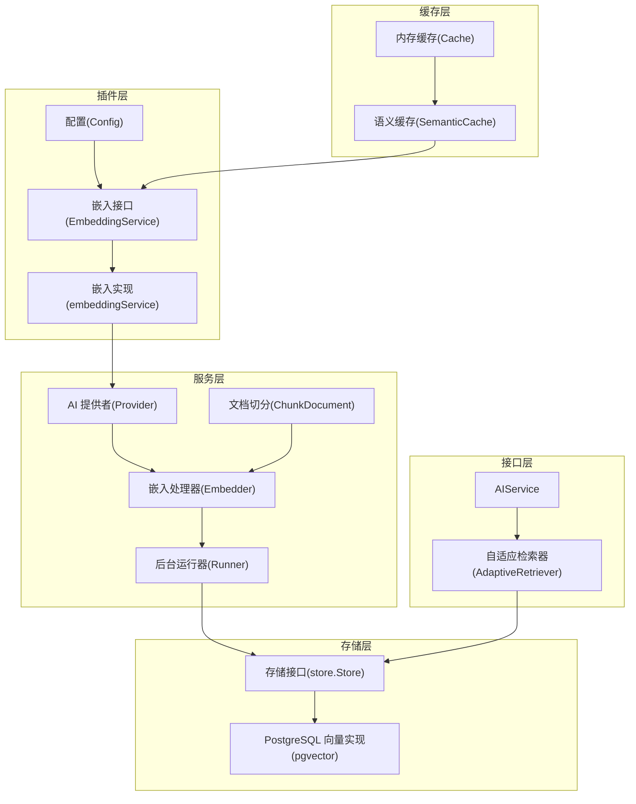
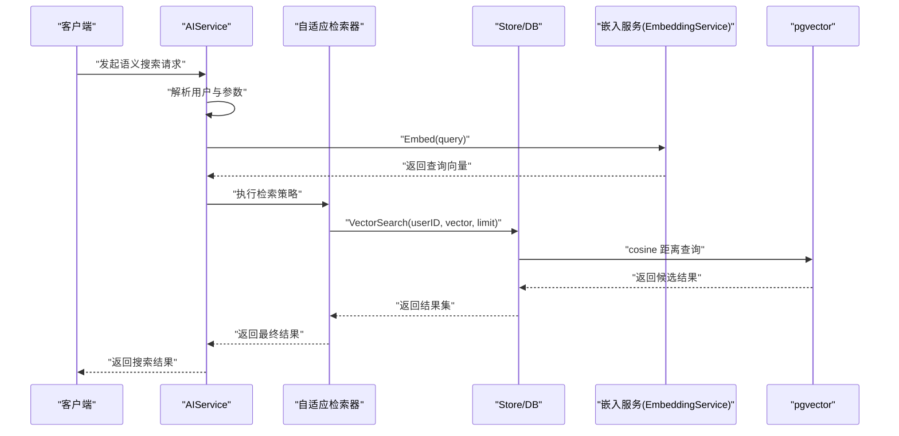
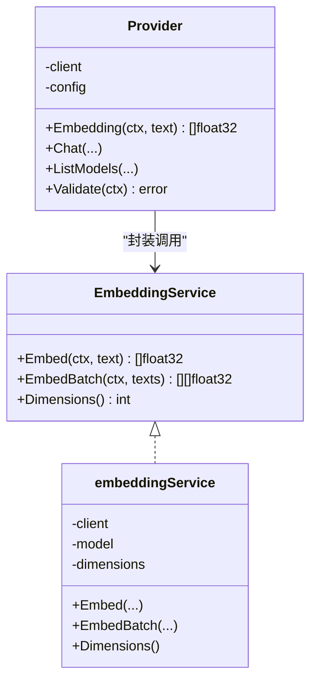
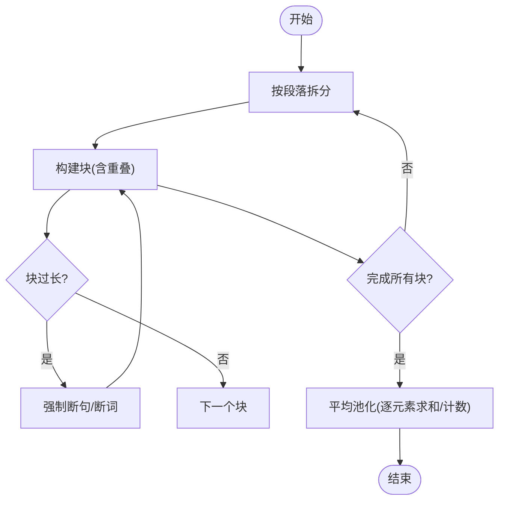
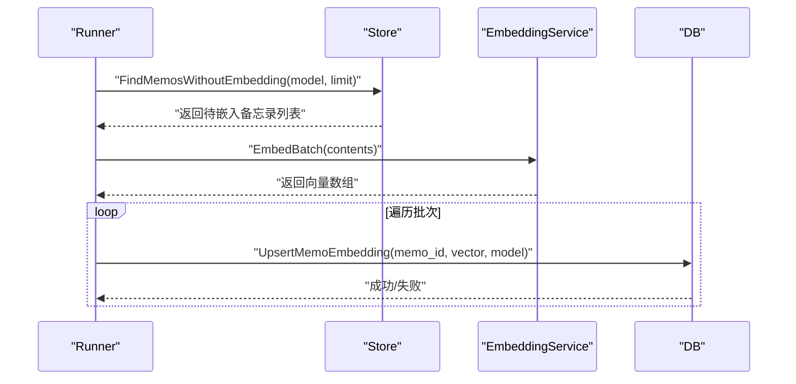
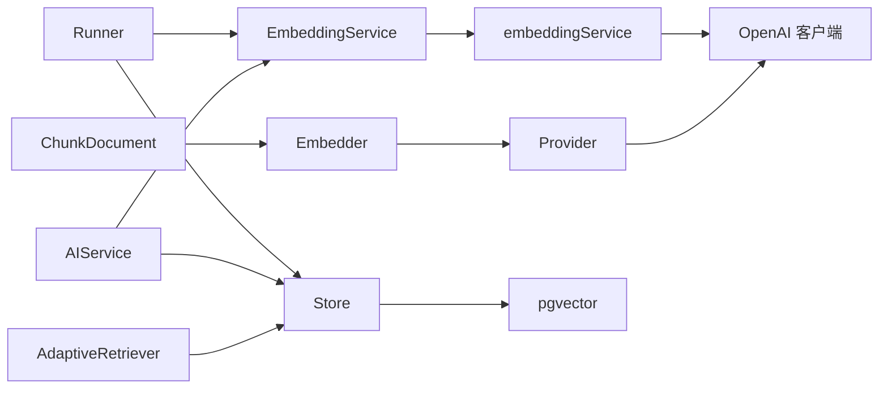

# 嵌入服务

<cite>
**本文引用的文件**
- [plugin/ai/embedding.go](file://plugin/ai/embedding.go)
- [plugin/ai/config.go](file://plugin/ai/config.go)
- [server/ai/provider.go](file://server/ai/provider.go)
- [server/ai/embedder.go](file://server/ai/embedder.go)
- [server/ai/chunker.go](file://server/ai/chunker.go)
- [server/runner/embedding/runner.go](file://server/runner/embedding/runner.go)
- [store/memo_embedding.go](file://store/memo_embedding.go)
- [store/db/postgres/memo_embedding.go](file://store/db/postgres/memo_embedding.go)
- [store/cache/tiered.go](file://store/cache/tiered.go)
- [store/cache/cache.go](file://store/cache/cache.go)
- [server/router/api/v1/ai_service.go](file://server/router/api/v1/ai_service.go)
- [server/retrieval/adaptive_retrieval.go](file://server/retrieval/adaptive_retrieval.go)
- [docs/specs/AI-008-embedding-service.md](file://docs/specs/AI-008-embedding-service.md)
- [docs/specs/AI-006-postgres-vector-search.md](file://docs/specs/AI-006-postgres-vector-search.md)
- [docs/specs/AI-012-semantic-search-api.md](file://docs/specs/AI-012-semantic-search-api.md)
</cite>

## 目录
1. [简介](#简介)
2. [项目结构](#项目结构)
3. [核心组件](#核心组件)
4. [架构总览](#架构总览)
5. [详细组件分析](#详细组件分析)
6. [依赖关系分析](#依赖关系分析)
7. [性能考量](#性能考量)
8. [故障排查指南](#故障排查指南)
9. [结论](#结论)
10. [附录](#附录)

## 简介
本文件系统化梳理嵌入服务的设计与实现，覆盖向量嵌入的生成原理、模型与配置管理、接口设计、数据处理流程、性能优化策略，以及与不同提供商（SiliconFlow、OpenAI、Ollama）的集成差异。同时阐述嵌入维度设置、批量处理与缓存机制，并给出嵌入服务在语义搜索中的应用与最佳实践。

## 项目结构
嵌入服务横跨插件层、服务层、存储层与缓存层，形成“配置 → 服务 → 处理器 → 存储”的清晰链路；同时通过检索器与API对外提供语义搜索能力。

图表来源
- [plugin/ai/config.go](file://plugin/ai/config.go#L1-L129)
- [plugin/ai/embedding.go](file://plugin/ai/embedding.go#L1-L103)
- [server/ai/provider.go](file://server/ai/provider.go#L1-L221)
- [server/ai/embedder.go](file://server/ai/embedder.go#L1-L123)
- [server/ai/chunker.go](file://server/ai/chunker.go#L1-L151)
- [server/runner/embedding/runner.go](file://server/runner/embedding/runner.go#L1-L139)
- [store/memo_embedding.go](file://store/memo_embedding.go#L1-L155)
- [store/db/postgres/memo_embedding.go](file://store/db/postgres/memo_embedding.go#L1-L333)
- [store/cache/tiered.go](file://store/cache/tiered.go#L233-L396)
- [server/router/api/v1/ai_service.go](file://server/router/api/v1/ai_service.go#L1-L74)
- [server/retrieval/adaptive_retrieval.go](file://server/retrieval/adaptive_retrieval.go#L191-L281)

章节来源
- [plugin/ai/config.go](file://plugin/ai/config.go#L1-L129)
- [plugin/ai/embedding.go](file://plugin/ai/embedding.go#L1-L103)
- [server/ai/provider.go](file://server/ai/provider.go#L1-L221)
- [server/ai/embedder.go](file://server/ai/embedder.go#L1-L123)
- [server/ai/chunker.go](file://server/ai/chunker.go#L1-L151)
- [server/runner/embedding/runner.go](file://server/runner/embedding/runner.go#L1-L139)
- [store/memo_embedding.go](file://store/memo_embedding.go#L1-L155)
- [store/db/postgres/memo_embedding.go](file://store/db/postgres/memo_embedding.go#L1-L333)
- [store/cache/tiered.go](file://store/cache/tiered.go#L233-L396)
- [server/router/api/v1/ai_service.go](file://server/router/api/v1/ai_service.go#L1-L74)
- [server/retrieval/adaptive_retrieval.go](file://server/retrieval/adaptive_retrieval.go#L191-L281)

## 核心组件
- 配置与提供商
  - 配置对象包含嵌入、重排序与LLM三类配置，支持SiliconFlow、OpenAI、Ollama等提供商，以及BaseURL、APIKey、模型名与维度等参数。
  - 提供者封装OpenAI客户端，负责重试、超时、连通性校验与模型列举。
- 嵌入服务接口与实现
  - 接口定义Embed、EmbedBatch与Dimensions方法；实现兼容SiliconFlow与OpenAI，Ollama当前不直接作为嵌入服务提供商。
- 文档切分与平均池化
  - 将长文本按段落切分为固定长度且带重叠的块，再对块向量进行平均池化得到单一向量。
- 后台批处理与持久化
  - 定时扫描未嵌入的备忘录，按批次调用嵌入服务生成向量并写入数据库。
- 存储与检索
  - 使用pgvector存储向量，提供向量相似度搜索与无嵌入备忘录查询；支持BM25全文检索作为补充。
- 缓存与语义缓存
  - 内存缓存与语义缓存结合，基于查询向量的余弦相似度进行语义命中，提升重复查询性能。
- API与检索器
  - AIService提供语义搜索入口；自适应检索器根据初检结果质量动态扩展召回与重排。

章节来源
- [plugin/ai/config.go](file://plugin/ai/config.go#L1-L129)
- [plugin/ai/embedding.go](file://plugin/ai/embedding.go#L1-L103)
- [server/ai/provider.go](file://server/ai/provider.go#L1-L221)
- [server/ai/chunker.go](file://server/ai/chunker.go#L1-L151)
- [server/runner/embedding/runner.go](file://server/runner/embedding/runner.go#L1-L139)
- [store/memo_embedding.go](file://store/memo_embedding.go#L1-L155)
- [store/db/postgres/memo_embedding.go](file://store/db/postgres/memo_embedding.go#L1-L333)
- [store/cache/tiered.go](file://store/cache/tiered.go#L233-L396)
- [server/router/api/v1/ai_service.go](file://server/router/api/v1/ai_service.go#L1-L74)
- [server/retrieval/adaptive_retrieval.go](file://server/retrieval/adaptive_retrieval.go#L191-L281)

## 架构总览
下图展示从“请求到向量”到“持久化与检索”的端到端流程。

图表来源
- [server/router/api/v1/ai_service.go](file://server/router/api/v1/ai_service.go#L1-L74)
- [server/retrieval/adaptive_retrieval.go](file://server/retrieval/adaptive_retrieval.go#L191-L281)
- [store/memo_embedding.go](file://store/memo_embedding.go#L140-L155)
- [store/db/postgres/memo_embedding.go](file://store/db/postgres/memo_embedding.go#L111-L192)
- [plugin/ai/embedding.go](file://plugin/ai/embedding.go#L60-L98)

## 详细组件分析

### 嵌入服务接口与实现
- 接口职责
  - 单条嵌入：Embed
  - 批量嵌入：EmbedBatch
  - 维度查询：Dimensions
- 实现要点
  - SiliconFlow与OpenAI：通过OpenAI兼容客户端创建，统一使用EmbeddingRequest，支持指定维度。
  - Ollama：当前嵌入服务实现不支持Ollama作为提供商。
- 错误处理
  - 输入为空、响应为空、API调用失败均返回明确错误。

图表来源
- [plugin/ai/embedding.go](file://plugin/ai/embedding.go#L11-L21)
- [plugin/ai/embedding.go](file://plugin/ai/embedding.go#L23-L27)
- [server/ai/provider.go](file://server/ai/provider.go#L36-L40)

章节来源
- [plugin/ai/embedding.go](file://plugin/ai/embedding.go#L1-L103)
- [plugin/ai/embedding_test.go](file://plugin/ai/embedding_test.go#L1-L64)

### 配置管理与提供商适配
- 配置项
  - 嵌入：Provider、Model、Dimensions、APIKey、BaseURL
  - 重排序：Enabled、Provider、Model、APIKey、BaseURL
  - LLM：Provider、Model、APIKey、BaseURL、MaxTokens、Temperature
- 提供商差异
  - SiliconFlow：兼容OpenAI API，需APIKey与BaseURL
  - OpenAI：需APIKey与可选BaseURL
  - Ollama：当前不作为嵌入服务提供商；可在本地离线部署模型
- 校验规则
  - 若未启用AI，则跳过校验
  - 非Ollama提供商必须提供APIKey
  - Provider字段必填

章节来源
- [plugin/ai/config.go](file://plugin/ai/config.go#L1-L129)
- [plugin/ai/config_test.go](file://plugin/ai/config_test.go#L127-L217)

### 文档切分与平均池化
- 切分策略
  - 按段落优先切分，超过阈值则强制断句/断词；保留固定长度重叠以保持上下文连续性
- 平均池化
  - 对多个块向量做逐元素求和后除以块数，得到单一向量，用于后续存储与检索

图表来源
- [server/ai/chunker.go](file://server/ai/chunker.go#L15-L74)
- [server/ai/chunker.go](file://server/ai/chunker.go#L129-L150)
- [server/ai/embedder.go](file://server/ai/embedder.go#L94-L122)

章节来源
- [server/ai/chunker.go](file://server/ai/chunker.go#L1-L151)
- [server/ai/embedder.go](file://server/ai/embedder.go#L1-L123)

### 后台批处理与持久化
- 触发与周期
  - 启动即执行一次，随后按固定间隔轮询
- 扫描与批处理
  - 查询无嵌入备忘录，按批次调用EmbeddingService批量生成向量
  - 将向量写入数据库，记录模型标识
- 并发与容错
  - 批内并发受控，遇到错误继续处理后续批次

图表来源
- [server/runner/embedding/runner.go](file://server/runner/embedding/runner.go#L34-L139)
- [store/memo_embedding.go](file://store/memo_embedding.go#L135-L138)
- [store/db/postgres/memo_embedding.go](file://store/db/postgres/memo_embedding.go#L15-L42)

章节来源
- [server/runner/embedding/runner.go](file://server/runner/embedding/runner.go#L1-L139)
- [store/memo_embedding.go](file://store/memo_embedding.go#L1-L155)
- [store/db/postgres/memo_embedding.go](file://store/db/postgres/memo_embedding.go#L1-L333)

### 存储与检索（PostgreSQL + pgvector）
- 数据模型
  - MemoEmbedding：包含memo_id、向量、模型名、时间戳
- 操作接口
  - UpsertMemoEmbedding：插入或更新
  - VectorSearch：基于cosine距离的相似度检索
  - FindMemosWithoutEmbedding：查询未嵌入的备忘录
- 检索策略
  - 仅语义：先快速TopK，再根据质量阈值决定是否扩展
  - 混合BM25加权：在高质量场景优先BM25，低质量场景混合检索

章节来源
- [store/memo_embedding.go](file://store/memo_embedding.go#L1-L155)
- [store/db/postgres/memo_embedding.go](file://store/db/postgres/memo_embedding.go#L111-L192)
- [server/retrieval/adaptive_retrieval.go](file://server/retrieval/adaptive_retrieval.go#L191-L281)

### 缓存与语义缓存
- 内存缓存
  - 支持TTL、淘汰、清理循环，保证内存占用可控
- 语义缓存
  - 在命中不到精确键时，基于查询向量与缓存项向量的余弦相似度进行语义匹配
  - 可配置相似度阈值与最大项数

章节来源
- [store/cache/cache.go](file://store/cache/cache.go#L1-L328)
- [store/cache/tiered.go](file://store/cache/tiered.go#L233-L396)

### API与语义搜索
- AIService
  - 提供语义搜索入口，依赖EmbeddingService与Store
- 检索流程
  - 解析用户与参数，向量化查询，向量检索，过滤低分，必要时重排序，截断输出

章节来源
- [server/router/api/v1/ai_service.go](file://server/router/api/v1/ai_service.go#L1-L74)
- [docs/specs/AI-012-semantic-search-api.md](file://docs/specs/AI-012-semantic-search-api.md#L15-L142)

## 依赖关系分析
- 组件耦合
  - EmbeddingService被Provider封装，Provider被Embedder复用，Runner与API通过Store间接依赖DB实现
- 外部依赖
  - OpenAI兼容客户端、pgvector扩展、语言模型（如Ollama）
- 循环依赖
  - 当前结构清晰，未见循环导入

图表来源
- [plugin/ai/embedding.go](file://plugin/ai/embedding.go#L1-L103)
- [server/ai/provider.go](file://server/ai/provider.go#L1-L221)
- [server/ai/embedder.go](file://server/ai/embedder.go#L1-L123)
- [server/runner/embedding/runner.go](file://server/runner/embedding/runner.go#L1-L139)
- [store/db/postgres/memo_embedding.go](file://store/db/postgres/memo_embedding.go#L1-L333)
- [server/router/api/v1/ai_service.go](file://server/router/api/v1/ai_service.go#L1-L74)
- [server/retrieval/adaptive_retrieval.go](file://server/retrieval/adaptive_retrieval.go#L191-L281)

## 性能考量
- 批处理与并发
  - Runner采用小批次与固定间隔，避免内存峰值与CPU争用
  - Embedder对单条嵌入采用有限并发，防止外部API过载
- 向量维度与存储
  - 显式设置维度，确保向量一致性；pgvector提供高效相似度计算
- 检索策略
  - 自适应检索：初检TopK，依据质量阈值决定是否扩展，减少不必要的重排序
- 缓存策略
  - 内存缓存与语义缓存双层保护，显著降低重复查询开销

章节来源
- [server/runner/embedding/runner.go](file://server/runner/embedding/runner.go#L21-L32)
- [server/ai/embedder.go](file://server/ai/embedder.go#L64-L92)
- [server/retrieval/adaptive_retrieval.go](file://server/retrieval/adaptive_retrieval.go#L191-L281)
- [store/cache/tiered.go](file://store/cache/tiered.go#L233-L396)

## 故障排查指南
- 常见错误与定位
  - 提供商不支持：检查配置Provider是否为siliconflow或openai
  - API Key缺失：非Ollama提供商必须提供API Key
  - 响应为空：确认输入文本非空，检查外部API可用性
  - 向量维度不一致：确保EmbeddingService与数据库模型一致
- 调试建议
  - 开启日志，观察Runner批处理进度与错误
  - 使用Provider.Validate进行连通性测试
  - 对比语义缓存命中率与相似度阈值

章节来源
- [plugin/ai/embedding.go](file://plugin/ai/embedding.go#L47-L49)
- [plugin/ai/config.go](file://plugin/ai/config.go#L105-L129)
- [server/ai/provider.go](file://server/ai/provider.go#L158-L175)
- [store/cache/tiered.go](file://store/cache/tiered.go#L263-L304)

## 结论
嵌入服务通过清晰的接口抽象、严谨的配置管理与完善的批处理/缓存机制，实现了从文本到向量的稳定转换，并在存储层与检索层提供了高效的语义搜索能力。针对不同提供商的差异化适配与自适应检索策略，使得系统在准确性与性能之间取得良好平衡。

## 附录

### 使用示例（步骤说明）
- 初始化配置
  - 从Profile生成Config，设置Provider、Model、Dimensions、BaseURL与APIKey
- 创建嵌入服务
  - 根据配置创建EmbeddingService实例
- 生成向量
  - 单条：Embed；批量：EmbedBatch
- 存储向量
  - Runner自动扫描并写入数据库；也可手动调用UpsertMemoEmbedding
- 语义搜索
  - 通过AIService发起请求，内部完成向量化、检索、过滤与重排

章节来源
- [plugin/ai/config.go](file://plugin/ai/config.go#L46-L103)
- [plugin/ai/embedding.go](file://plugin/ai/embedding.go#L29-L58)
- [server/runner/embedding/runner.go](file://server/runner/embedding/runner.go#L58-L139)
- [server/router/api/v1/ai_service.go](file://server/router/api/v1/ai_service.go#L45-L55)
- [docs/specs/AI-012-semantic-search-api.md](file://docs/specs/AI-012-semantic-search-api.md#L15-L142)

### 最佳实践
- 模型与维度
  - 选择与业务匹配的嵌入模型，并显式设置维度
- 批处理参数
  - 根据资源情况调整Runner批次大小与间隔
- 检索阈值
  - 结合业务设定最小相似度阈值，过滤低质量结果
- 缓存策略
  - 合理设置语义缓存阈值与最大项数，兼顾命中率与内存占用

章节来源
- [docs/specs/AI-006-postgres-vector-search.md](file://docs/specs/AI-006-postgres-vector-search.md#L1-L124)
- [docs/specs/AI-012-semantic-search-api.md](file://docs/specs/AI-012-semantic-search-api.md#L15-L142)
- [store/cache/tiered.go](file://store/cache/tiered.go#L250-L261)