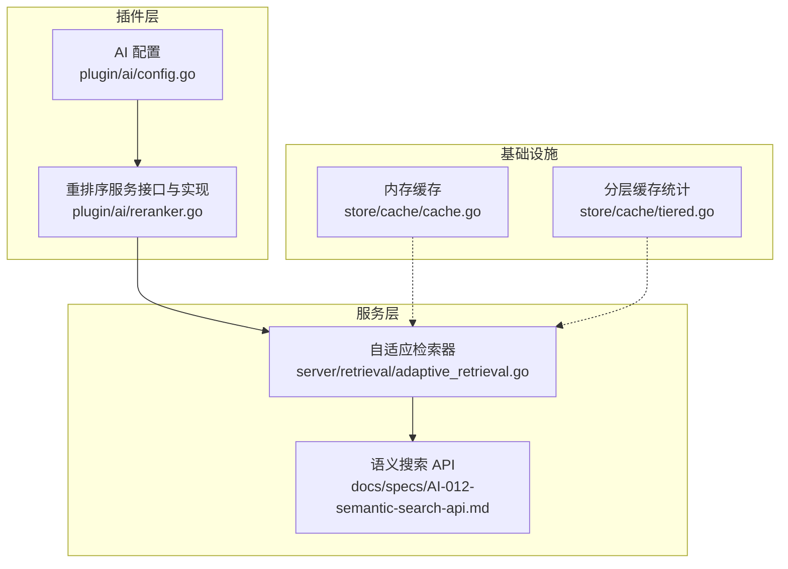
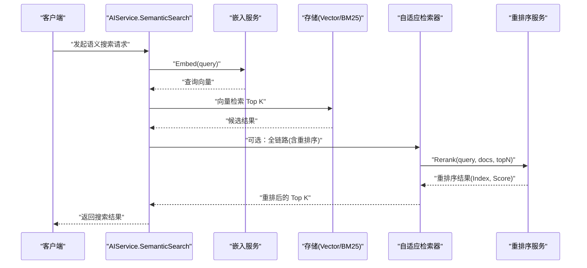
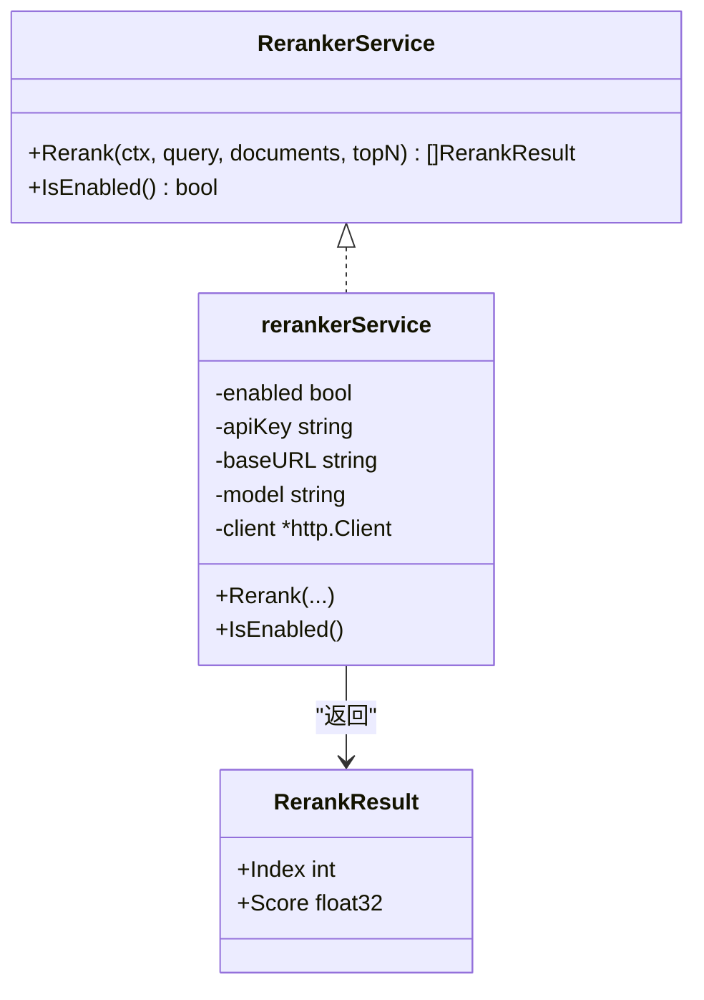
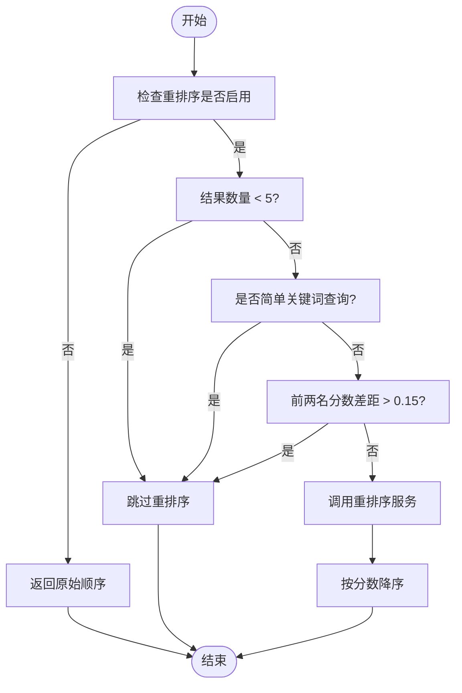
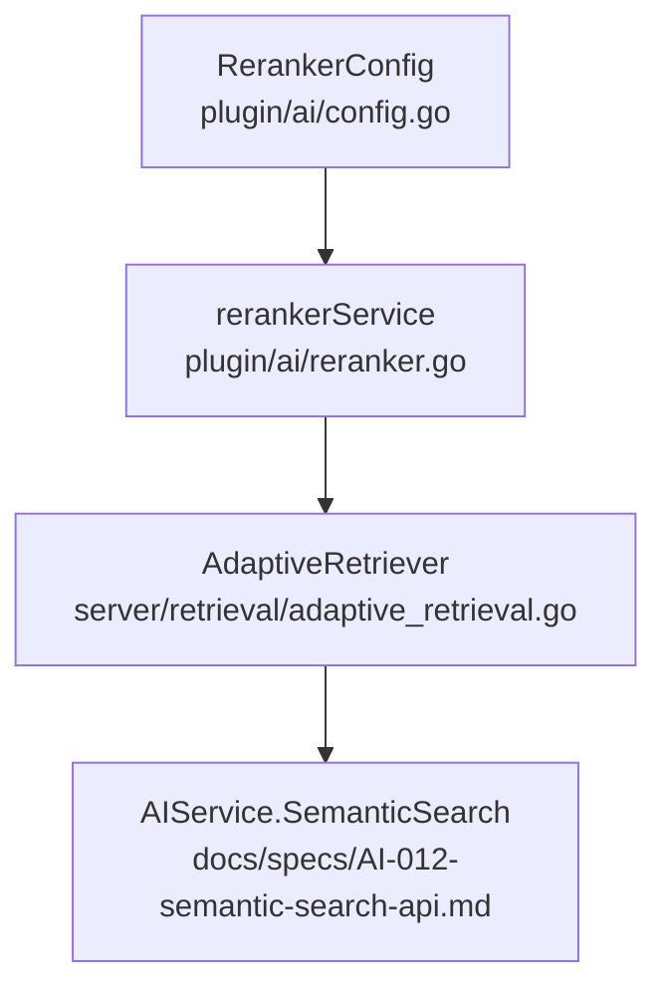

# 重排序服务

<cite>
**本文档引用的文件**
- [plugin/ai/reranker.go](file://plugin/ai/reranker.go)
- [plugin/ai/reranker_test.go](file://plugin/ai/reranker_test.go)
- [plugin/ai/config.go](file://plugin/ai/config.go)
- [server/retrieval/adaptive_retrieval.go](file://server/retrieval/adaptive_retrieval.go)
- [docs/specs/AI-009-reranker-service.md](file://docs/specs/AI-009-reranker-service.md)
- [docs/specs/AI-012-semantic-search-api.md](file://docs/specs/AI-012-semantic-search-api.md)
- [store/cache/cache.go](file://store/cache/cache.go)
- [store/cache/tiered.go](file://store/cache/tiered.go)
- [docs/archived/RAG_REVIEW_REPORT.md](file://docs/archived/RAG_REVIEW_REPORT.md)
- [docs/archived/cleanup_20260123/RAG_SYSTEM_RESEARCH_REPORT.md](file://docs/archived/cleanup_20260123/RAG_SYSTEM_RESEARCH_REPORT.md)
</cite>

## 目录
1. [简介](#简介)
2. [项目结构](#项目结构)
3. [核心组件](#核心组件)
4. [架构总览](#架构总览)
5. [详细组件分析](#详细组件分析)
6. [依赖关系分析](#依赖关系分析)
7. [性能考量](#性能考量)
8. [故障排查指南](#故障排查指南)
9. [结论](#结论)
10. [附录](#附录)

## 简介
本文件系统化阐述“重排序服务”的技术实现与工程实践，覆盖以下主题：
- 语义搜索结果重排序的原理与算法实现
- 评分机制与排序策略
- 配置选项、模型选择与提供商集成（SiliconFlow、Cohere）
- 输入输出格式、批处理策略与缓存优化
- 使用示例、效果评估与调试方法
- 在提升搜索质量中的作用与最佳实践

## 项目结构
重排序服务位于插件层，围绕 AI 配置与检索管线协作，形成“混合检索 + 选择性重排序”的闭环。

图表来源
- [plugin/ai/config.go](file://plugin/ai/config.go#L27-L34)
- [plugin/ai/reranker.go](file://plugin/ai/reranker.go#L20-L27)
- [server/retrieval/adaptive_retrieval.go](file://server/retrieval/adaptive_retrieval.go#L24-L30)
- [docs/specs/AI-012-semantic-search-api.md](file://docs/specs/AI-012-semantic-search-api.md#L32-L39)
- [store/cache/cache.go](file://store/cache/cache.go#L10-L32)
- [store/cache/tiered.go](file://store/cache/tiered.go#L393-L446)

章节来源
- [plugin/ai/config.go](file://plugin/ai/config.go#L9-L44)
- [plugin/ai/reranker.go](file://plugin/ai/reranker.go#L1-L127)
- [server/retrieval/adaptive_retrieval.go](file://server/retrieval/adaptive_retrieval.go#L1-L115)

## 核心组件
- 重排序服务接口与实现
  - 接口定义：RerankerService，包含 Rerank(ctx, query, documents, topN) 与 IsEnabled()
  - 实现：rerankerService，封装 HTTP 客户端、超时与连接池配置
- AI 配置
  - RerankerConfig：Enabled、Provider、Model、APIKey、BaseURL
  - 通过 NewConfigFromProfile 从实例配置映射
- 自适应检索器
  - AdaptiveRetriever：混合检索（BM25+向量）+ RRF 融合 + 选择性重排序
  - shouldRerank：根据结果数量、查询复杂度、分数差距等规则决定是否调用重排序
- 语义搜索 API
  - AIService.SemanticSearch：向量化查询 -> 向量检索 -> 可选重排序 -> 截断 -> 响应构建

章节来源
- [plugin/ai/reranker.go](file://plugin/ai/reranker.go#L20-L27)
- [plugin/ai/reranker.go](file://plugin/ai/reranker.go#L29-L53)
- [plugin/ai/config.go](file://plugin/ai/config.go#L27-L34)
- [server/retrieval/adaptive_retrieval.go](file://server/retrieval/adaptive_retrieval.go#L686-L712)
- [docs/specs/AI-012-semantic-search-api.md](file://docs/specs/AI-012-semantic-search-api.md#L45-L141)

## 架构总览
重排序服务在检索管线中的位置如下：

图表来源
- [docs/specs/AI-012-semantic-search-api.md](file://docs/specs/AI-012-semantic-search-api.md#L45-L141)
- [server/retrieval/adaptive_retrieval.go](file://server/retrieval/adaptive_retrieval.go#L330-L407)
- [plugin/ai/reranker.go](file://plugin/ai/reranker.go#L59-L126)

## 详细组件分析

### 重排序服务接口与实现
- 接口职责
  - Rerank：接收查询、候选文档列表与 topN，返回按相关性降序的索引与分数
  - IsEnabled：控制是否启用外部重排序
- 实现要点
  - 启用时：构造 SiliconFlow /v1/rerank 请求，设置 Authorization 与 Content-Type，解析 JSON 响应，按 relevance_score 降序排序
  - 未启用时：返回原始顺序（带轻微递减分数），避免额外 API 调用
  - HTTP 客户端配置：超时、连接池参数，便于在容器资源受限环境下稳定运行

图表来源
- [plugin/ai/reranker.go](file://plugin/ai/reranker.go#L14-L27)
- [plugin/ai/reranker.go](file://plugin/ai/reranker.go#L29-L53)
- [plugin/ai/reranker.go](file://plugin/ai/reranker.go#L104-L123)

章节来源
- [plugin/ai/reranker.go](file://plugin/ai/reranker.go#L59-L126)
- [plugin/ai/reranker_test.go](file://plugin/ai/reranker_test.go#L8-L26)
- [plugin/ai/reranker_test.go](file://plugin/ai/reranker_test.go#L28-L61)

### 配置与模型选择
- 配置项
  - Enabled：是否启用重排序
  - Provider：支持 siliconflow、cohere（接口预留）
  - Model：如 BAAI/bge-reranker-v2-m3
  - APIKey/BaseURL：对应提供商的鉴权与接入地址
- 配置来源
  - NewConfigFromProfile：从实例配置映射到 RerankerConfig
  - Validate：校验必填项（除 ollama 外需 API Key）

章节来源
- [plugin/ai/config.go](file://plugin/ai/config.go#L27-L34)
- [plugin/ai/config.go](file://plugin/ai/config.go#L46-L103)
- [plugin/ai/config.go](file://plugin/ai/config.go#L105-L128)

### 评分机制与排序策略
- 评分来源
  - 外部模型返回 relevance_score
  - 未启用时采用“原始顺序 + 递减小分数”作为降级策略
- 排序策略
  - 按 relevance_score 降序
  - 与检索管线结合：先混合检索（BM25+向量），再选择性重排序

章节来源
- [plugin/ai/reranker.go](file://plugin/ai/reranker.go#L104-L123)
- [plugin/ai/reranker.go](file://plugin/ai/reranker.go#L120-L125)
- [server/retrieval/adaptive_retrieval.go](file://server/retrieval/adaptive_retrieval.go#L686-L712)

### 与提供商的集成与参数调优
- SiliconFlow 集成
  - Endpoint：/v1/rerank
  - 请求体字段：model、query、documents、top_n
  - 认证：Authorization: Bearer <APIKey>
  - 超时与连接池：内置 HTTP 客户端配置
- Cohere 集成（接口预留）
  - Provider 字段支持 "cohere"，便于后续扩展
  - 通过 BaseURL 与 Model 配置适配不同部署形态

章节来源
- [plugin/ai/reranker.go](file://plugin/ai/reranker.go#L72-L102)
- [plugin/ai/config.go](file://plugin/ai/config.go#L29-L33)

### 输入输出格式与批处理策略
- 输入
  - query：查询文本
  - documents：候选文档内容数组（建议长度控制在合理范围内以降低成本）
  - topN：返回前 N 条
- 输出
  - RerankResult：Index（原始索引）、Score（relevance_score）
- 批处理策略
  - 重排序服务本身对单次请求进行批处理（documents 数组）
  - 检索管线在调用前会限制文档长度（例如最多 5000 字符），以控制 API 成本与延迟

章节来源
- [plugin/ai/reranker.go](file://plugin/ai/reranker.go#L72-L78)
- [server/retrieval/adaptive_retrieval.go](file://server/retrieval/adaptive_retrieval.go#L360-L371)

### 缓存优化
- 内存缓存
  - 支持 TTL、清理周期、最大条目数、逐出回调
  - 适用于短期热点数据与中间结果缓存
- 分层缓存统计
  - 提供 L1/L2 启用状态、大小、命中率占位等统计信息
- 应用建议
  - 将查询向量、重排序结果等热点数据纳入缓存
  - 结合 TTL 与逐出策略，避免内存膨胀

章节来源
- [store/cache/cache.go](file://store/cache/cache.go#L41-L64)
- [store/cache/cache.go](file://store/cache/cache.go#L92-L120)
- [store/cache/tiered.go](file://store/cache/tiered.go#L393-L446)

### 选择性重排序（Selective Rerank）
- 触发条件
  - 结果数量 ≥ 5
  - 非简单关键词查询
  - 前两名分数差距 ≤ 0.15
- 未触发时
  - 直接返回混合检索结果，避免不必要的 API 调用与成本

图表来源
- [server/retrieval/adaptive_retrieval.go](file://server/retrieval/adaptive_retrieval.go#L686-L712)

章节来源
- [server/retrieval/adaptive_retrieval.go](file://server/retrieval/adaptive_retrieval.go#L686-L712)
- [docs/archived/RAG_REVIEW_REPORT.md](file://docs/archived/RAG_REVIEW_REPORT.md#L160-L198)

### 使用示例与效果评估
- 使用示例
  - 通过 AIService.SemanticSearch 发起语义搜索，内部在满足条件时调用重排序
  - 可在前端或 SDK 层传入 limit 控制返回数量
- 效果评估
  - 延迟与成本：通过选择性重排序显著降低 API 调用频率
  - 准确度：结合 RRF 融合与重排序，提升 NDCG 等指标
  - 压力测试：在 2C2G 环境下支持约 180 QPS，P95 延迟约 500–700ms

章节来源
- [docs/specs/AI-012-semantic-search-api.md](file://docs/specs/AI-012-semantic-search-api.md#L45-L141)
- [docs/archived/cleanup_20260123/RAG_SYSTEM_RESEARCH_REPORT.md](file://docs/archived/cleanup_20260123/RAG_SYSTEM_RESEARCH_REPORT.md#L1088-L1100)

## 依赖关系分析
重排序服务与检索管线、配置与缓存的关系如下：

图表来源
- [plugin/ai/config.go](file://plugin/ai/config.go#L27-L34)
- [plugin/ai/reranker.go](file://plugin/ai/reranker.go#L38-L53)
- [server/retrieval/adaptive_retrieval.go](file://server/retrieval/adaptive_retrieval.go#L24-L30)
- [docs/specs/AI-012-semantic-search-api.md](file://docs/specs/AI-012-semantic-search-api.md#L32-L39)

章节来源
- [plugin/ai/reranker.go](file://plugin/ai/reranker.go#L38-L53)
- [server/retrieval/adaptive_retrieval.go](file://server/retrieval/adaptive_retrieval.go#L330-L407)

## 性能考量
- 选择性重排序
  - 通过 shouldRerank 规则减少不必要的 API 调用，显著降低成本与延迟
- 文档长度控制
  - 检索管线对文档内容进行截断，避免超长文本带来的 API 成本与超时风险
- HTTP 客户端优化
  - 超时与连接池配置，提升并发稳定性
- 缓存策略
  - 结合内存缓存与分层缓存，降低重复查询开销

章节来源
- [server/retrieval/adaptive_retrieval.go](file://server/retrieval/adaptive_retrieval.go#L360-L371)
- [plugin/ai/reranker.go](file://plugin/ai/reranker.go#L44-L51)
- [store/cache/cache.go](file://store/cache/cache.go#L92-L120)
- [store/cache/tiered.go](file://store/cache/tiered.go#L393-L446)

## 故障排查指南
- 常见问题
  - 重排序未生效：确认 IsEnabled() 返回 true，且 Provider/Model/APIKey/BaseURL 配置正确
  - API 调用失败：检查网络连通性、鉴权头、请求体字段与提供商端点
  - 结果异常：核对 documents 长度与 topN 参数；确认是否触发了选择性重排序
- 调试步骤
  - 查看检索日志：strategy、result_count、是否跳过重排序
  - 校验配置：通过 NewConfigFromProfile 生成的配置是否符合预期
  - 单元测试：运行 reranker_test 验证禁用与启用行为

章节来源
- [plugin/ai/reranker.go](file://plugin/ai/reranker.go#L99-L102)
- [plugin/ai/reranker_test.go](file://plugin/ai/reranker_test.go#L28-L61)
- [server/retrieval/adaptive_retrieval.go](file://server/retrieval/adaptive_retrieval.go#L344-L352)

## 结论
重排序服务通过“混合检索 + 选择性重排序”的策略，在保证搜索质量的同时有效控制成本与延迟。其接口简洁、实现稳健，并与配置系统、检索管线与缓存体系良好集成。建议在生产环境中启用选择性重排序，并结合缓存与参数调优持续优化性能与成本表现。

## 附录
- 相关规范与报告
  - AI-009：重排序服务规格
  - AI-012：语义搜索 API 规格
  - RAG 系统研究与评审报告
  - 最优 RAG 方案与测试指南

章节来源
- [docs/specs/AI-009-reranker-service.md](file://docs/specs/AI-009-reranker-service.md#L1-L184)
- [docs/specs/AI-012-semantic-search-api.md](file://docs/specs/AI-012-semantic-search-api.md#L15-L142)
- [docs/archived/RAG_REVIEW_REPORT.md](file://docs/archived/RAG_REVIEW_REPORT.md#L139-L198)
- [docs/archived/cleanup_20260123/RAG_SYSTEM_RESEARCH_REPORT.md](file://docs/archived/cleanup_20260123/RAG_SYSTEM_RESEARCH_REPORT.md#L803-L856)