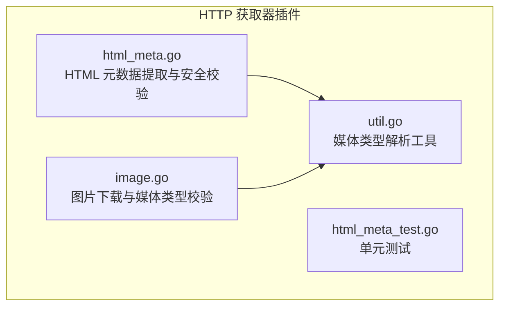
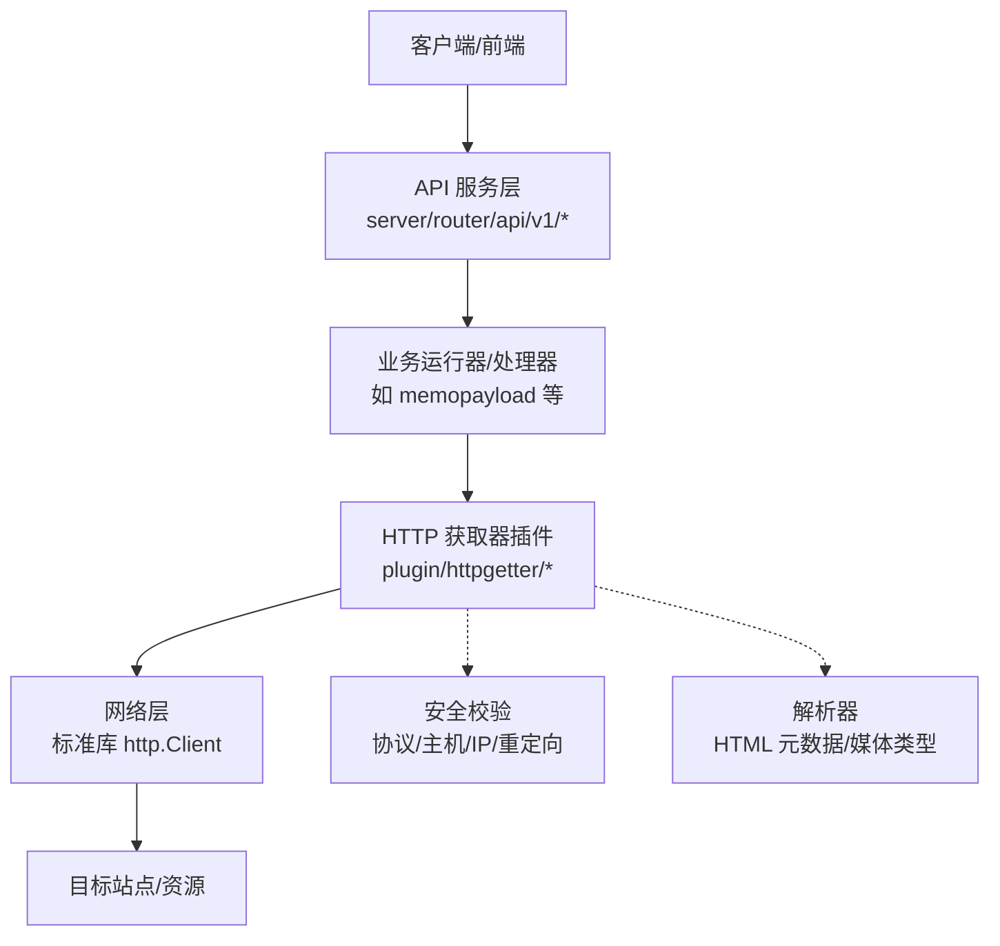
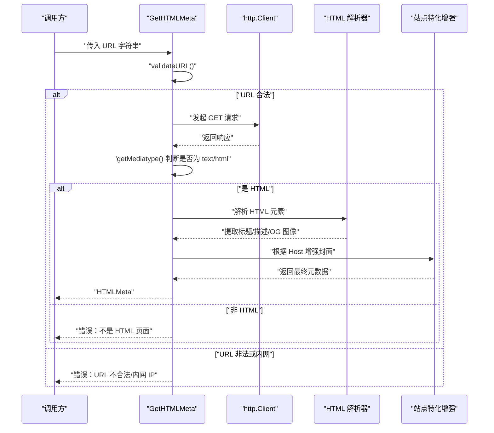
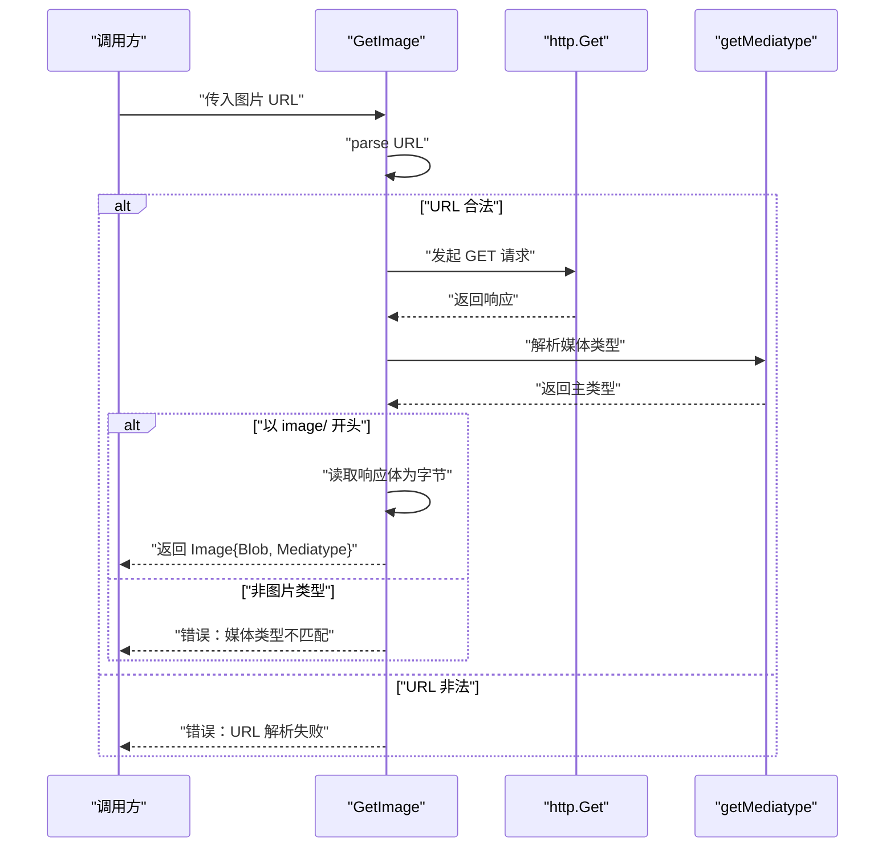
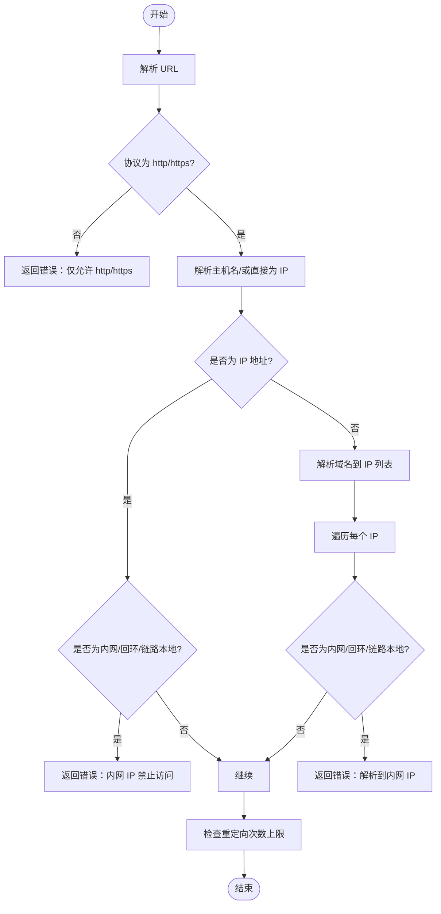
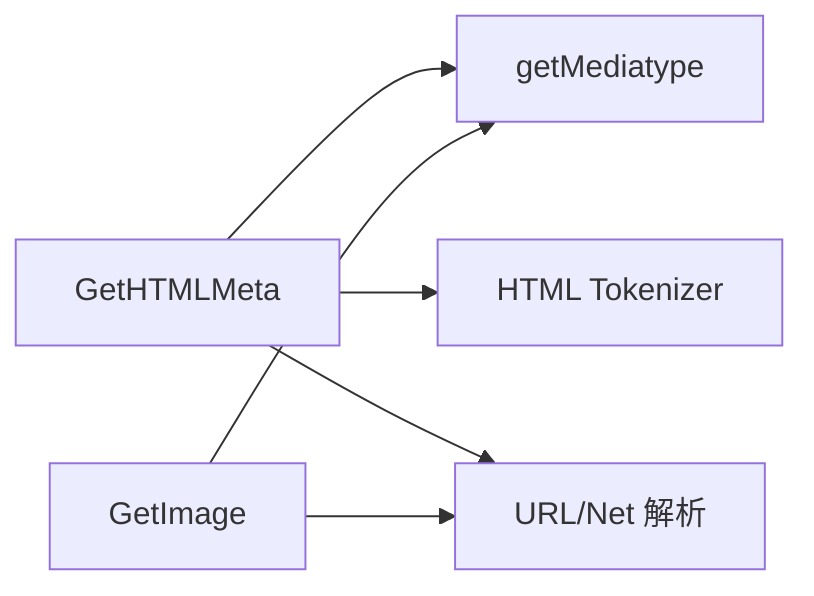

# HTTP 获取器插件

<cite>
**本文引用的文件**
- [plugin/httpgetter/html_meta.go](file://plugin/httpgetter/html_meta.go)
- [plugin/httpgetter/image.go](file://plugin/httpgetter/image.go)
- [plugin/httpgetter/util.go](file://plugin/httpgetter/util.go)
- [plugin/httpgetter/html_meta_test.go](file://plugin/httpgetter/html_meta_test.go)
- [server/router/api/v1/memo_service.go](file://server/router/api/v1/memo_service.go)
- [plugin/ai/agent/error_class.go](file://plugin/ai/agent/error_class.go)
</cite>

## 目录
1. [简介](#简介)
2. [项目结构](#项目结构)
3. [核心组件](#核心组件)
4. [架构总览](#架构总览)
5. [组件详解](#组件详解)
6. [依赖关系分析](#依赖关系分析)
7. [性能与可靠性](#性能与可靠性)
8. [故障排查指南](#故障排查指南)
9. [结论](#结论)
10. [附录：使用示例与配置建议](#附录使用示例与配置建议)

## 简介
本文件系统性地介绍 HTTP 获取器插件的设计与实现，覆盖以下能力：
- HTTP 请求处理与网页抓取
- 内容解析：HTML 元数据提取（标题、描述、图像）
- 图片下载与媒体类型校验
- 安全与反爬策略：协议限制、主机名/IP 校验、重定向限制
- 并发、超时与重试的工程化建议
- 内容过滤与恶意链接防护思路
- 使用示例、配置参数与性能优化技巧
- 扩展开发与自定义解析规则集成指引

该插件以 Go 语言实现，位于 plugin/httpgetter 目录，提供两个核心函数：获取网页元数据与获取图片资源。

## 项目结构
HTTP 获取器插件位于 plugin/httpgetter 目录，包含三个源文件：
- html_meta.go：HTML 元数据提取与安全校验
- image.go：图片下载与媒体类型校验
- util.go：通用的媒体类型解析工具

图表来源
- [plugin/httpgetter/html_meta.go](file://plugin/httpgetter/html_meta.go#L1-L167)
- [plugin/httpgetter/image.go](file://plugin/httpgetter/image.go#L1-L46)
- [plugin/httpgetter/util.go](file://plugin/httpgetter/util.go#L1-L16)
- [plugin/httpgetter/html_meta_test.go](file://plugin/httpgetter/html_meta_test.go#L1-L33)

章节来源
- [plugin/httpgetter/html_meta.go](file://plugin/httpgetter/html_meta.go#L1-L167)
- [plugin/httpgetter/image.go](file://plugin/httpgetter/image.go#L1-L46)
- [plugin/httpgetter/util.go](file://plugin/httpgetter/util.go#L1-L16)
- [plugin/httpgetter/html_meta_test.go](file://plugin/httpgetter/html_meta_test.go#L1-L33)

## 核心组件
- HTMLMeta 结构体：封装网页标题、描述、封面图等元数据
- GetHTMLMeta(urlStr)：抓取网页并解析元数据，内置安全校验与重定向限制
- GetImage(urlStr)：下载图片并校验媒体类型
- getMediatype(response)：解析响应的 Content-Type，提取主类型
- validateURL(urlStr)：URL 协议与目标地址合法性校验（仅允许 http/https；禁止内网 IP）

章节来源
- [plugin/httpgetter/html_meta.go](file://plugin/httpgetter/html_meta.go#L29-L33)
- [plugin/httpgetter/html_meta.go](file://plugin/httpgetter/html_meta.go#L35-L59)
- [plugin/httpgetter/image.go](file://plugin/httpgetter/image.go#L16-L45)
- [plugin/httpgetter/util.go](file://plugin/httpgetter/util.go#L8-L15)
- [plugin/httpgetter/html_meta.go](file://plugin/httpgetter/html_meta.go#L119-L155)

## 架构总览
下图展示了 HTTP 获取器在服务端调用链中的位置与职责边界：

图表来源
- [server/router/api/v1/memo_service.go](file://server/router/api/v1/memo_service.go#L1-L200)
- [plugin/httpgetter/html_meta.go](file://plugin/httpgetter/html_meta.go#L17-L27)
- [plugin/httpgetter/util.go](file://plugin/httpgetter/util.go#L8-L15)

## 组件详解

### HTML 元数据提取模块
- 职责
  - 抓取网页并解析标题、描述、Open Graph 图像等关键元信息
  - 对 YouTube 等站点进行特定封面增强
  - 进行安全校验：仅允许 http/https；禁止内网 IP；限制重定向次数
- 关键流程
  - URL 校验 → 发起 HTTP 请求 → 媒体类型判断 → HTML 解析 → 元数据提取 → 站点特化增强

图表来源
- [plugin/httpgetter/html_meta.go](file://plugin/httpgetter/html_meta.go#L35-L59)
- [plugin/httpgetter/html_meta.go](file://plugin/httpgetter/html_meta.go#L61-L104)
- [plugin/httpgetter/html_meta.go](file://plugin/httpgetter/html_meta.go#L157-L166)
- [plugin/httpgetter/util.go](file://plugin/httpgetter/util.go#L8-L15)

章节来源
- [plugin/httpgetter/html_meta.go](file://plugin/httpgetter/html_meta.go#L29-L59)
- [plugin/httpgetter/html_meta.go](file://plugin/httpgetter/html_meta.go#L61-L104)
- [plugin/httpgetter/html_meta.go](file://plugin/httpgetter/html_meta.go#L119-L155)
- [plugin/httpgetter/html_meta.go](file://plugin/httpgetter/html_meta.go#L157-L166)

### 图片下载模块
- 职责
  - 下载指定 URL 的图片资源
  - 校验响应媒体类型是否为 image/*
- 关键流程
  - URL 校验 → 发起 HTTP 请求 → 媒体类型判断 → 读取二进制内容 → 返回 Image 结构体

图表来源
- [plugin/httpgetter/image.go](file://plugin/httpgetter/image.go#L16-L45)
- [plugin/httpgetter/util.go](file://plugin/httpgetter/util.go#L8-L15)

章节来源
- [plugin/httpgetter/image.go](file://plugin/httpgetter/image.go#L11-L45)

### 工具模块
- getMediatype(response)：从响应头 Content-Type 中解析出媒体主类型，用于后续分支判断

章节来源
- [plugin/httpgetter/util.go](file://plugin/httpgetter/util.go#L8-L15)

### 安全与反爬策略
- 协议限制：仅允许 http/https
- 主机/IP 校验：禁止回环、私网、链路本地等内网地址；对域名解析后逐一校验
- 重定向限制：限制最大重定向次数，防止死链或钓鱼陷阱
- 站点特化：针对 YouTube 等站点生成默认封面图，避免抓取不到图像的情况

图表来源
- [plugin/httpgetter/html_meta.go](file://plugin/httpgetter/html_meta.go#L119-L155)
- [plugin/httpgetter/html_meta.go](file://plugin/httpgetter/html_meta.go#L17-L27)

章节来源
- [plugin/httpgetter/html_meta.go](file://plugin/httpgetter/html_meta.go#L15-L27)
- [plugin/httpgetter/html_meta.go](file://plugin/httpgetter/html_meta.go#L119-L155)

## 依赖关系分析
- 模块内依赖
  - html_meta.go 依赖 util.go 提供的媒体类型解析
  - image.go 依赖 util.go 提供的媒体类型解析
- 外部依赖
  - 标准库 net/http、net/url、mime
  - 第三方库 golang.org/x/net/html 用于 HTML 解析
  - 错误包装与处理使用 github.com/pkg/errors

图表来源
- [plugin/httpgetter/html_meta.go](file://plugin/httpgetter/html_meta.go#L3-L13)
- [plugin/httpgetter/image.go](file://plugin/httpgetter/image.go#L3-L9)
- [plugin/httpgetter/util.go](file://plugin/httpgetter/util.go#L3-L6)

章节来源
- [plugin/httpgetter/html_meta.go](file://plugin/httpgetter/html_meta.go#L3-L13)
- [plugin/httpgetter/image.go](file://plugin/httpgetter/image.go#L3-L9)
- [plugin/httpgetter/util.go](file://plugin/httpgetter/util.go#L3-L6)

## 性能与可靠性
- 并发请求管理
  - 当前实现未显式设置并发上限或连接池参数，建议在生产环境结合业务场景引入连接复用与并发控制
- 超时控制
  - 当前实现未设置请求超时；建议在 http.Client 层面配置 Timeout，避免阻塞
- 重试机制
  - 当前实现未内置重试；可参考插件中对“网络错误/超时”的分类与重试判定逻辑，结合业务需求设计指数退避或固定间隔重试
- 资源大小限制
  - HTML 解析注释提示应限制响应体大小，避免内存膨胀；建议在读取响应体前设置最大缓冲大小
- 反爬虫应对
  - 可通过设置合理的 User-Agent、随机延时、代理池等方式缓解；当前实现未包含这些细节，可在上层业务或配置中补充

章节来源
- [plugin/httpgetter/html_meta.go](file://plugin/httpgetter/html_meta.go#L54-L58)
- [plugin/ai/agent/error_class.go](file://plugin/ai/agent/error_class.go#L151-L213)

## 故障排查指南
- 常见错误与定位
  - “不是 HTML 页面”：确认目标 URL 返回的是 text/html；检查重定向链与实际内容类型
  - “URL 不合法/内网 IP”：检查协议、主机名与解析结果；确保不指向内网地址
  - “重定向过多”：检查目标站点是否存在循环重定向
  - “非图片媒体类型”：确认 URL 指向真实图片资源
- 单元测试参考
  - 测试用例覆盖了内网 IP 与解析后内网 IP 的拒绝行为，可用于回归验证

章节来源
- [plugin/httpgetter/html_meta_test.go](file://plugin/httpgetter/html_meta_test.go#L22-L32)
- [plugin/httpgetter/html_meta.go](file://plugin/httpgetter/html_meta.go#L15-L27)
- [plugin/httpgetter/html_meta.go](file://plugin/httpgetter/html_meta.go#L46-L52)

## 结论
HTTP 获取器插件提供了简洁而稳健的网页元数据提取与图片下载能力，并内置了必要的安全校验与重定向限制。在生产环境中，建议结合业务需求完善超时、并发、重试与资源大小限制等工程化措施，并在上层业务中补充反爬虫策略与用户代理设置，以获得更稳定与合规的服务体验。

## 附录：使用示例与配置建议

### 使用示例（概念性步骤）
- 获取网页元数据
  - 输入：一个公开可访问的网页 URL
  - 输出：标题、描述、封面图等元数据
  - 注意：确保 URL 为 http/https，且不指向内网地址
- 获取图片
  - 输入：一个公开可访问的图片 URL
  - 输出：图片二进制内容与媒体类型
  - 注意：确保响应为 image/* 类型

### 配置参数建议（概念性）
- 超时设置：在 http.Client 层面配置 Timeout
- 并发控制：通过外部并发池或限流器控制同时请求数
- User-Agent：在请求头中设置合理的 UA，降低被反爬策略拦截的概率
- 重试策略：基于网络错误与超时错误进行有限次重试，采用指数退避
- 资源大小限制：限制响应体最大长度，避免内存占用过高

### 性能优化技巧（概念性）
- 连接复用：复用 http.Client，减少 TCP/TLS 握手开销
- 缓存策略：对热点 URL 的元数据与图片增加缓存，降低重复抓取成本
- 分页与批量：在需要抓取多个 URL 时，采用分批与并发控制，避免瞬时洪峰
- 压缩传输：启用 gzip/deflate 等压缩，减少带宽占用（需服务端支持）

### 扩展开发与自定义解析规则
- 新增站点特化规则
  - 在现有站点增强逻辑基础上，新增对特定站点的封面图生成或元数据补全
- 自定义媒体类型解析
  - 如需支持更多媒体类型，可在工具函数中扩展媒体类型判断逻辑
- 安全加固
  - 引入代理池、IP 白名单/黑名单、速率限制与风控策略
- 重试与可观测性
  - 基于错误分类与重试判定逻辑，完善重试策略与日志埋点

章节来源
- [plugin/httpgetter/html_meta.go](file://plugin/httpgetter/html_meta.go#L157-L166)
- [plugin/ai/agent/error_class.go](file://plugin/ai/agent/error_class.go#L151-L213)