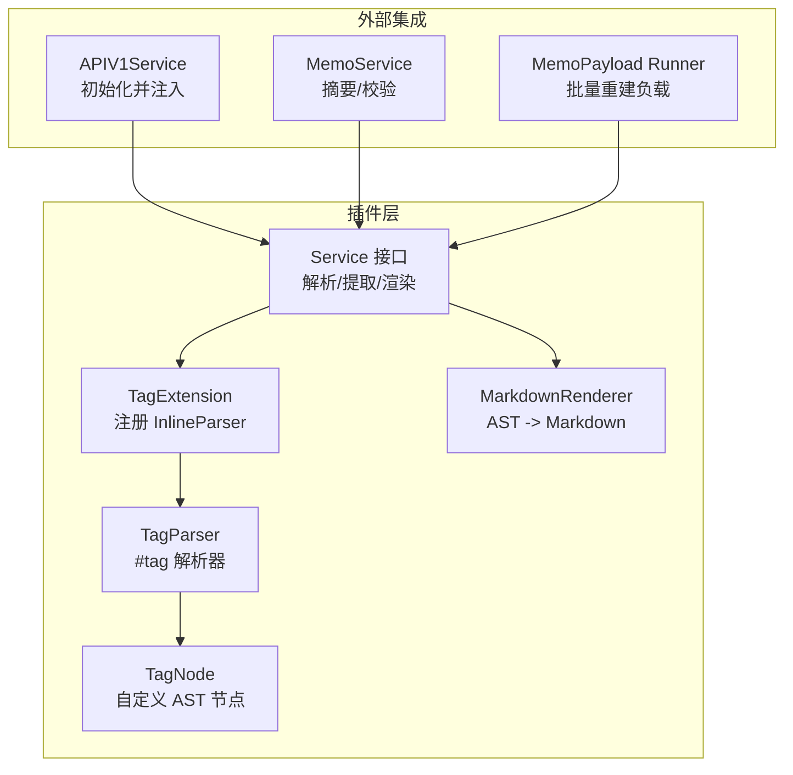
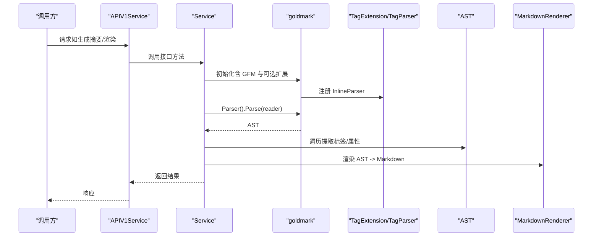
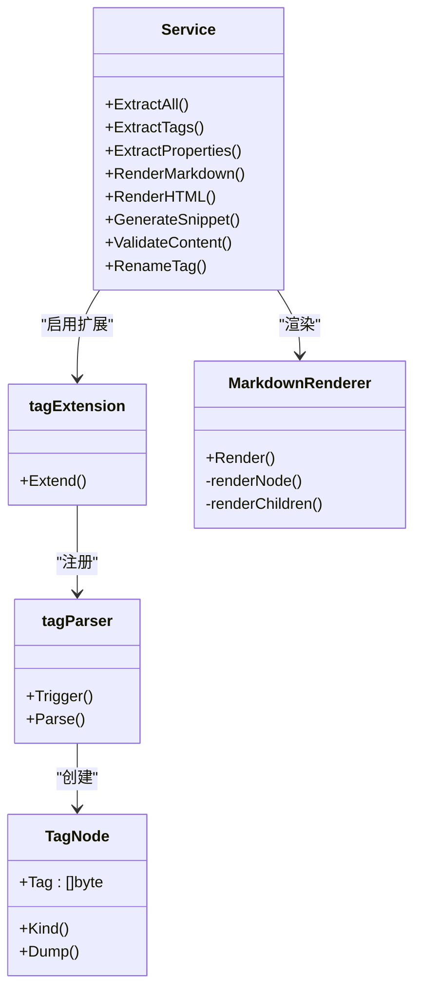
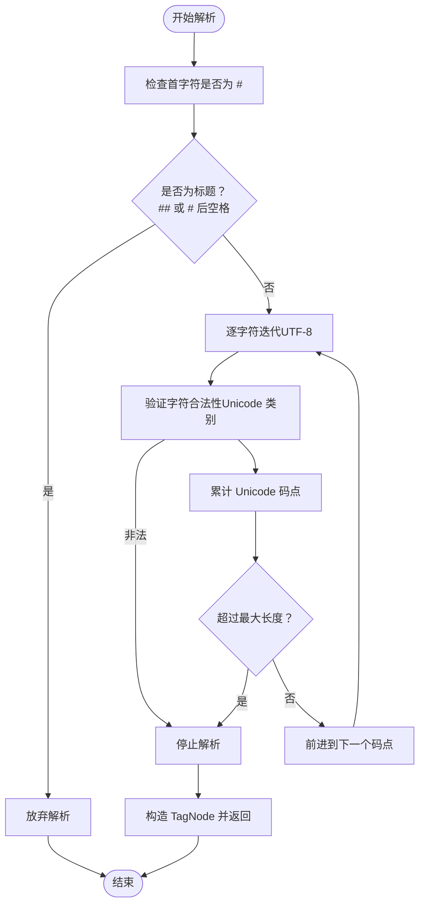
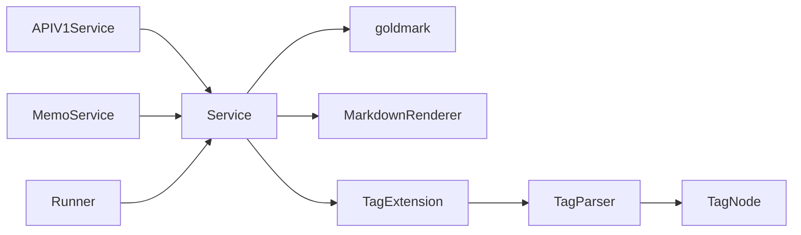

# Markdown 处理插件

<cite>
**本文档引用的文件**
- [markdown.go](file://plugin/markdown/markdown.go)
- [tag.go（AST）](file://plugin/markdown/ast/tag.go)
- [tag.go（扩展）](file://plugin/markdown/extensions/tag.go)
- [tag.go（解析器）](file://plugin/markdown/parser/tag.go)
- [markdown_renderer.go](file://plugin/markdown/renderer/markdown_renderer.go)
- [markdown_test.go](file://plugin/markdown/markdown_test.go)
- [tag_test.go](file://plugin/markdown/parser/tag_test.go)
- [markdown_renderer_test.go](file://plugin/markdown/renderer/markdown_renderer_test.go)
- [v1.go](file://server/router/api/v1/v1.go)
- [memo_service.go](file://server/router/api/v1/memo_service.go)
- [runner.go](file://server/runner/memopayload/runner.go)
</cite>

## 目录
1. [简介](#简介)
2. [项目结构](#项目结构)
3. [核心组件](#核心组件)
4. [架构总览](#架构总览)
5. [组件详解](#组件详解)
6. [依赖关系分析](#依赖关系分析)
7. [性能与优化](#性能与优化)
8. [故障排查指南](#故障排查指南)
9. [结论](#结论)
10. [附录：使用示例与扩展开发](#附录使用示例与扩展开发)

## 简介
本插件基于 goldmark 实现 Markdown 解析、AST 扩展与渲染，提供以下能力：
- 解析 Markdown 并构建 AST
- 自定义标签扩展（#tag），支持多语言字符、层级分隔符与长度限制
- 提取元数据：标签、属性（链接/代码/任务列表/未完成任务）
- 生成纯文本摘要（按块元素分隔、跳过代码、按词边界截断）
- 将 AST 渲染回 Markdown 文本
- 基于 goldmark 的 HTML 渲染（用于 RSS 等服务端场景）

## 项目结构
Markdown 插件采用分层设计：
- 插件入口与服务接口：plugin/markdown/markdown.go
- AST 节点定义：plugin/markdown/ast/tag.go
- 扩展注册：plugin/markdown/extensions/tag.go
- 标签解析器：plugin/markdown/parser/tag.go
- Markdown 渲染器：plugin/markdown/renderer/markdown_renderer.go
- 单元测试与基准测试：plugin/markdown/*.go
- 业务集成：server/router/api/v1/* 与 server/runner/memopayload/*

图表来源
- [markdown.go](file://plugin/markdown/markdown.go#L30-L101)
- [tag.go（AST）](file://plugin/markdown/ast/tag.go#L7-L21)
- [tag.go（扩展）](file://plugin/markdown/extensions/tag.go#L11-L24)
- [tag.go（解析器）](file://plugin/markdown/parser/tag.go#L19-L29)
- [markdown_renderer.go](file://plugin/markdown/renderer/markdown_renderer.go#L14-L31)
- [v1.go](file://server/router/api/v1/v1.go#L48-L60)
- [memo_service.go](file://server/router/api/v1/memo_service.go#L768-L775)
- [runner.go](file://server/runner/memopayload/runner.go#L74-L88)

章节来源
- [markdown.go](file://plugin/markdown/markdown.go#L1-L101)
- [v1.go](file://server/router/api/v1/v1.go#L48-L60)

## 核心组件
- Service 接口：统一的 Markdown 处理能力入口，包括解析、提取、渲染、校验、重命名标签等。
- TagNode：自定义 AST 节点，承载 #tag 语义。
- TagExtension：goldmark 扩展，注册 InlineParser。
- TagParser：#tag 语法解析器，支持 Unicode 字母/数字/符号/下划线/连字符/斜杠，最大长度限制。
- MarkdownRenderer：将 AST 渲染回 Markdown 文本，保留结构与格式。
- 集成点：APIV1Service 注入 Service；MemoService 使用摘要与校验；Runner 批量重建 MemoPayload。

章节来源
- [markdown.go](file://plugin/markdown/markdown.go#L30-L101)
- [tag.go（AST）](file://plugin/markdown/ast/tag.go#L7-L21)
- [tag.go（扩展）](file://plugin/markdown/extensions/tag.go#L11-L24)
- [tag.go（解析器）](file://plugin/markdown/parser/tag.go#L19-L29)
- [markdown_renderer.go](file://plugin/markdown/renderer/markdown_renderer.go#L14-L31)

## 架构总览
Markdown 处理流程分为“解析-提取-渲染”三个阶段，贯穿服务端与前端：
- 解析阶段：使用 goldmark 解析输入为 AST，并在启用标签扩展时插入自定义节点。
- 提取阶段：遍历 AST，收集标签与布尔属性；或一次性提取所有元数据。
- 渲染阶段：将 AST 渲染回 Markdown 文本；或使用 goldmark 内置 HTML 渲染器输出 HTML。

图表来源
- [markdown.go](file://plugin/markdown/markdown.go#L75-L101)
- [tag.go（扩展）](file://plugin/markdown/extensions/tag.go#L17-L24)
- [tag.go（解析器）](file://plugin/markdown/parser/tag.go#L67-L138)
- [markdown_renderer.go](file://plugin/markdown/renderer/markdown_renderer.go#L26-L31)

## 组件详解

### Service 接口与实现
- 能力清单：ExtractAll、ExtractTags、ExtractProperties、RenderMarkdown、RenderHTML、GenerateSnippet、ValidateContent、RenameTag。
- 实现要点：
  - 使用 goldmark.New 启用 GFM 扩展与自动标题 ID。
  - 可通过 WithTagExtension 开启 #tag 解析。
  - 提供单次解析提取所有元数据的能力，避免重复遍历。
  - RenderHTML 使用 goldmark 内置转换器；RenderMarkdown 使用自定义渲染器。

章节来源
- [markdown.go](file://plugin/markdown/markdown.go#L30-L101)
- [markdown.go](file://plugin/markdown/markdown.go#L183-L201)
- [markdown.go](file://plugin/markdown/markdown.go#L288-L341)

### AST 与扩展
- TagNode：自定义内联节点，存储标签名（不含 # 前缀），Kind 为自定义类型。
- TagExtension：向 goldmark 注册 InlineParser，优先级高于标准链接解析器。
- TagParser：触发字符为 #，支持 Unicode 字母/数字/符号及特定标点，最大长度限制，排除标题场景（## 或 # 后空格）。

图表来源
- [markdown.go](file://plugin/markdown/markdown.go#L30-L101)
- [tag.go（AST）](file://plugin/markdown/ast/tag.go#L7-L21)
- [tag.go（扩展）](file://plugin/markdown/extensions/tag.go#L11-L24)
- [tag.go（解析器）](file://plugin/markdown/parser/tag.go#L19-L29)
- [markdown_renderer.go](file://plugin/markdown/renderer/markdown_renderer.go#L14-L31)

章节来源
- [tag.go（AST）](file://plugin/markdown/ast/tag.go#L7-L21)
- [tag.go（扩展）](file://plugin/markdown/extensions/tag.go#L11-L24)
- [tag.go（解析器）](file://plugin/markdown/parser/tag.go#L67-L138)

### 解析器算法与验证
- 触发与排除：仅当 # 后非 ## 且非空格时才解析为标签。
- 字符验证：使用 Unicode 分类判断字母、数字、符号，允许下划线、连字符、斜杠。
- 长度控制：以 Unicode 码点计数，超过上限则停止。
- 截断策略：摘要生成中先双倍长度预截断，再按词边界裁剪，确保不切单词。

图表来源
- [tag.go（解析器）](file://plugin/markdown/parser/tag.go#L67-L138)

章节来源
- [tag.go（解析器）](file://plugin/markdown/parser/tag.go#L31-L59)
- [markdown.go](file://plugin/markdown/markdown.go#L391-L410)

### 渲染引擎
- MarkdownRenderer 支持段落、文本、强调、链接、图片、标题、代码块/代码行、引用、列表、分割线、删除线、任务列表、表格以及自定义 TagNode。
- 渲染策略：
  - 段落末尾添加空行分隔；
  - 强调根据层级输出 * 或 **；
  - 代码块区分围栏与缩进两种形式；
  - 列表项根据嵌套深度缩进；
  - 表格简化渲染（可扩展）；
  - 自定义 TagNode 输出 #tag 形式。

章节来源
- [markdown_renderer.go](file://plugin/markdown/renderer/markdown_renderer.go#L33-L163)
- [markdown_renderer.go](file://plugin/markdown/renderer/markdown_renderer.go#L174-L266)

### 元数据提取与摘要
- ExtractTags：遍历 AST，收集自定义 TagNode，去重并转小写。
- ExtractProperties：统计是否存在链接、代码、任务列表、未完成任务。
- GenerateSnippet：跳过代码节点，按块元素插入空格，按词边界截断，保证 UTF-8 安全。

章节来源
- [markdown.go](file://plugin/markdown/markdown.go#L110-L139)
- [markdown.go](file://plugin/markdown/markdown.go#L141-L181)
- [markdown.go](file://plugin/markdown/markdown.go#L203-L279)

### 错误处理与语法验证
- ValidateContent：尝试解析内容，返回错误即表示语法无效。
- 测试覆盖：单元测试对各种边界条件（空内容、复杂 Markdown、多语言标签、任务列表、代码块等）进行验证。

章节来源
- [markdown.go](file://plugin/markdown/markdown.go#L281-L286)
- [markdown_test.go](file://plugin/markdown/markdown_test.go#L15-L50)
- [markdown_test.go](file://plugin/markdown/markdown_test.go#L108-L195)

## 依赖关系分析
- 插件内部依赖：
  - Service 依赖 goldmark（解析/渲染）、自定义 AST 与扩展、自定义渲染器。
  - TagExtension 依赖 TagParser；TagParser 依赖 AST。
- 外部集成：
  - APIV1Service 初始化并注入 Service；
  - MemoService 使用 GenerateSnippet 与 ValidateContent；
  - Runner 使用 ExtractAll 批量重建 MemoPayload。

图表来源
- [v1.go](file://server/router/api/v1/v1.go#L48-L60)
- [memo_service.go](file://server/router/api/v1/memo_service.go#L768-L775)
- [runner.go](file://server/runner/memopayload/runner.go#L74-L88)
- [markdown.go](file://plugin/markdown/markdown.go#L75-L101)

章节来源
- [v1.go](file://server/router/api/v1/v1.go#L48-L60)
- [memo_service.go](file://server/router/api/v1/memo_service.go#L768-L775)
- [runner.go](file://server/runner/memopayload/runner.go#L74-L88)

## 性能与优化
- 单次解析提取：ExtractAll 在一次 AST 遍历中同时收集标签与属性，减少开销。
- 摘要生成优化：预估两倍长度后截断，避免多次分配；按词边界截断，提升可读性。
- 渲染器优化：针对常见节点类型直接输出，减少字符串拼接；列表嵌套按深度缩进。
- 集成侧优化：APIV1Service 中并发生成缩略图受信号量限制，避免内存压力。

章节来源
- [markdown.go](file://plugin/markdown/markdown.go#L288-L341)
- [markdown.go](file://plugin/markdown/markdown.go#L203-L279)
- [markdown_renderer.go](file://plugin/markdown/renderer/markdown_renderer.go#L228-L259)
- [v1.go](file://server/router/api/v1/v1.go#L44-L58)

## 故障排查指南
- 标签未被识别
  - 确认已启用 WithTagExtension。
  - 检查是否处于标题场景（## 或 # 后空格）。
  - 确认标签字符符合 Unicode 规则且不超过最大长度。
- 摘要异常
  - 确保输入包含有效文本；代码块会被跳过。
  - 检查 maxLength 是否合理，避免过短导致截断过度。
- 渲染结果不一致
  - 确认 goldmark 扩展配置一致（GFM、TagExtension）。
  - 自定义节点（如 TagNode）需在渲染器中显式处理。
- 集成问题
  - 确认 APIV1Service 正确注入 Service。
  - Runner 批处理时注意数据库事务与错误日志。

章节来源
- [markdown_test.go](file://plugin/markdown/markdown_test.go#L197-L316)
- [tag_test.go](file://plugin/markdown/parser/tag_test.go#L14-L193)
- [markdown_renderer_test.go](file://plugin/markdown/renderer/markdown_renderer_test.go#L16-L142)

## 结论
该 Markdown 处理插件以 goldmark 为核心，结合自定义 AST 与解析器，提供了完整的解析、提取与渲染能力。通过单次遍历提取元数据、合理的摘要截断策略与结构化渲染，满足服务端与前端的多样化需求。扩展开发可通过新增扩展与渲染规则进一步增强功能。

## 附录：使用示例与扩展开发

### 使用示例
- 初始化与注入
  - 在 APIV1Service 中创建带标签扩展的 Service，并注入到路由层。
  - 参考路径：[v1.go](file://server/router/api/v1/v1.go#L48-L60)
- 生成摘要
  - 在 MemoService 中调用 GenerateSnippet 获取纯文本摘要。
  - 参考路径：[memo_service.go](file://server/router/api/v1/memo_service.go#L768-L775)
- 批量重建负载
  - 在 Runner 中使用 ExtractAll 一次性提取标签与属性，更新 MemoPayload。
  - 参考路径：[runner.go](file://server/runner/memopayload/runner.go#L74-L88)

章节来源
- [v1.go](file://server/router/api/v1/v1.go#L48-L60)
- [memo_service.go](file://server/router/api/v1/memo_service.go#L768-L775)
- [runner.go](file://server/runner/memopayload/runner.go#L74-L88)

### 扩展开发指南
- 新增自定义节点
  - 定义新的 AST 节点类型，设置唯一 Kind，并实现 Dump 辅助调试。
  - 参考路径：[tag.go（AST）](file://plugin/markdown/ast/tag.go#L7-L21)
- 注册扩展
  - 实现 goldmark.Extender，向 Parser 添加 InlineParser 或 BlockParser。
  - 参考路径：[tag.go（扩展）](file://plugin/markdown/extensions/tag.go#L11-L24)
- 解析器实现
  - 实现 parser.InlineParser/BlockParser，定义 Trigger 与 Parse。
  - 注意字符集与长度限制，避免标题场景。
  - 参考路径：[tag.go（解析器）](file://plugin/markdown/parser/tag.go#L19-L29), [tag.go（解析器）](file://plugin/markdown/parser/tag.go#L67-L138)
- 渲染器适配
  - 在 MarkdownRenderer 中增加对新节点类型的渲染分支。
  - 参考路径：[markdown_renderer.go](file://plugin/markdown/renderer/markdown_renderer.go#L33-L163)

章节来源
- [tag.go（AST）](file://plugin/markdown/ast/tag.go#L7-L21)
- [tag.go（扩展）](file://plugin/markdown/extensions/tag.go#L11-L24)
- [tag.go（解析器）](file://plugin/markdown/parser/tag.go#L19-L29)
- [markdown_renderer.go](file://plugin/markdown/renderer/markdown_renderer.go#L33-L163)

### 渲染优化技巧
- 保持结构一致性：段落、列表、标题之间使用空行分隔，提升可读性。
- 代码块渲染：优先使用围栏代码块并保留语言标识。
- 列表嵌套：根据深度缩进，确保子项对齐。
- 自定义节点：在渲染器中显式处理，避免降级为未知节点。

章节来源
- [markdown_renderer.go](file://plugin/markdown/renderer/markdown_renderer.go#L174-L266)