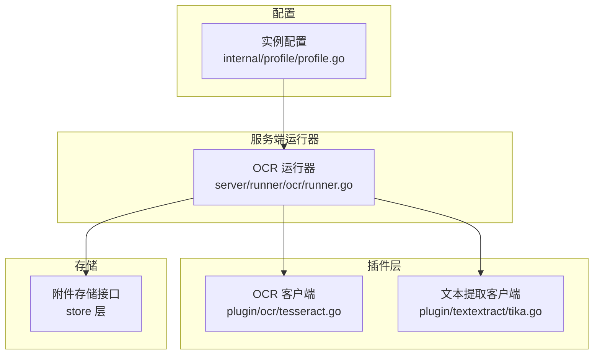
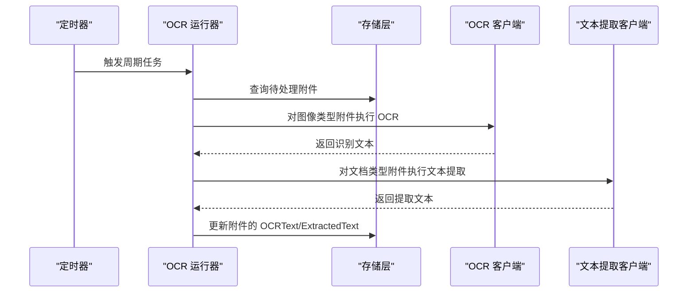
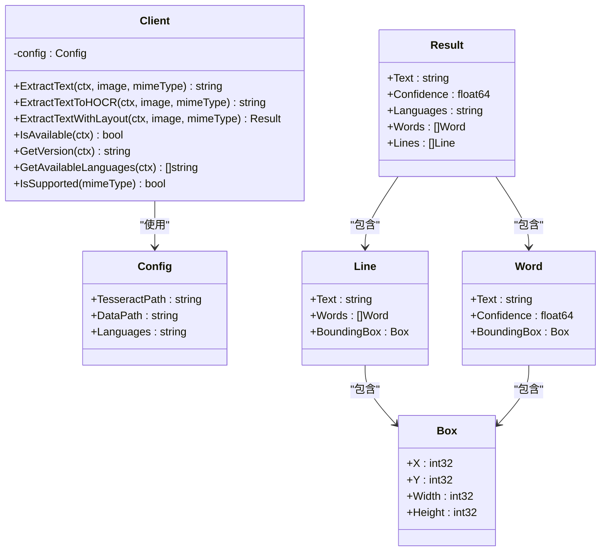
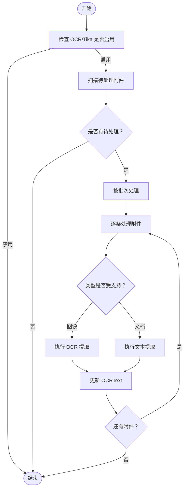
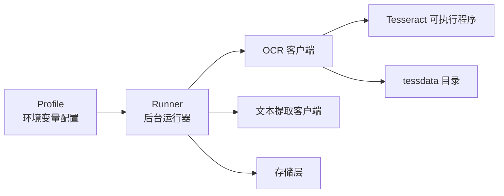

# OCR 识别插件

<cite>
**本文引用的文件**
- [plugin/ocr/tesseract.go](file://plugin/ocr/tesseract.go)
- [plugin/ocr/tesseract_test.go](file://plugin/ocr/tesseract_test.go)
- [server/runner/ocr/runner.go](file://server/runner/ocr/runner.go)
- [internal/profile/profile.go](file://internal/profile/profile.go)
- [plugin/textextract/tika.go](file://plugin/textextract/tika.go)
</cite>

## 目录
1. [简介](#简介)
2. [项目结构](#项目结构)
3. [核心组件](#核心组件)
4. [架构总览](#架构总览)
5. [详细组件分析](#详细组件分析)
6. [依赖关系分析](#依赖关系分析)
7. [性能与资源管理](#性能与资源管理)
8. [使用示例与配置指南](#使用示例与配置指南)
9. [故障排查](#故障排查)
10. [扩展开发与自定义模型集成](#扩展开发与自定义模型集成)
11. [结论](#结论)

## 简介
本文件面向 OCR 识别插件的使用者与开发者，系统性说明基于 Tesseract 引擎的 OCR 集成与配置，涵盖图像预处理、文字识别、结果后处理、参数调优、语言包配置、识别精度优化、图像格式支持、批量处理与并发识别、性能监控与资源管理、使用示例、配置指南以及常见问题与扩展开发指导。该插件通过后台运行器对附件进行 OCR 文字提取，并将结果持久化到数据库，同时支持异步处理与限流控制。

## 项目结构
OCR 插件位于 plugin/ocr，配套有服务端后台运行器 server/runner/ocr，配置来源于 internal/profile/profile.go，同时与文档全文提取插件 plugin/textextract 协同工作，共同实现附件的 OCR 与文本提取能力。

图表来源
- [plugin/ocr/tesseract.go](file://plugin/ocr/tesseract.go#L1-L410)
- [plugin/textextract/tika.go](file://plugin/textextract/tika.go#L1-L452)
- [server/runner/ocr/runner.go](file://server/runner/ocr/runner.go#L1-L303)
- [internal/profile/profile.go](file://internal/profile/profile.go#L1-L153)

章节来源
- [plugin/ocr/tesseract.go](file://plugin/ocr/tesseract.go#L1-L410)
- [server/runner/ocr/runner.go](file://server/runner/ocr/runner.go#L1-L303)
- [internal/profile/profile.go](file://internal/profile/profile.go#L50-L99)

## 核心组件
- OCR 客户端：封装 Tesseract 命令调用、临时文件管理、输出解析与结果结构化。
- OCR 运行器：定时扫描待处理附件、批量处理、并发控制、异步处理与更新存储。
- 配置系统：从环境变量加载 OCR/Tika 相关参数，支持开关与路径配置。
- 文档提取客户端：与 OCR 协同处理非图像类文档的文本提取。

章节来源
- [plugin/ocr/tesseract.go](file://plugin/ocr/tesseract.go#L29-L122)
- [server/runner/ocr/runner.go](file://server/runner/ocr/runner.go#L17-L70)
- [internal/profile/profile.go](file://internal/profile/profile.go#L50-L99)
- [plugin/textextract/tika.go](file://plugin/textextract/tika.go#L37-L105)

## 架构总览
OCR 插件采用“插件 + 运行器”的分层设计：
- 插件层负责具体识别逻辑与结果处理；
- 运行器负责任务调度、批处理、并发控制与持久化；
- 配置层统一从环境变量注入参数；
- 存储层提供附件查询与更新能力。

图表来源
- [server/runner/ocr/runner.go](file://server/runner/ocr/runner.go#L72-L148)
- [plugin/ocr/tesseract.go](file://plugin/ocr/tesseract.go#L61-L122)
- [plugin/textextract/tika.go](file://plugin/textextract/tika.go#L121-L132)

## 详细组件分析

### OCR 客户端（Tesseract）
- 支持的图像格式：PNG、JPEG/JPG、GIF、BMP、WEBP。
- 关键方法：
  - ExtractText：执行 OCR，返回纯文本。
  - ExtractTextToHOCR：生成 hOCR 输出（HTML + 位置信息），便于布局分析。
  - ExtractTextWithLayout：返回带语言信息的结果对象（当前不包含整体置信度）。
  - IsAvailable/GetVersion/GetAvailableLanguages：检查可用性与列出可用语言。
  - IsSupported：判断 MIME 类型是否受支持。
  - ParseHOCR：解析 hOCR 字符串为结构化结果（简化版）。
  - ConfigFromEnv：从环境变量构建配置。
  - Result/Word/Line/Box：结果与结构化数据模型。
  - Merge/FormatOutput/Validate：结果合并、格式化与校验。
- 临时文件与资源清理：所有中间文件在函数退出时自动删除，避免磁盘泄漏。
- 上下文超时：命令执行使用上下文，支持超时控制。

图表来源
- [plugin/ocr/tesseract.go](file://plugin/ocr/tesseract.go#L29-L280)

章节来源
- [plugin/ocr/tesseract.go](file://plugin/ocr/tesseract.go#L19-L122)
- [plugin/ocr/tesseract.go](file://plugin/ocr/tesseract.go#L138-L185)
- [plugin/ocr/tesseract.go](file://plugin/ocr/tesseract.go#L237-L280)
- [plugin/ocr/tesseract.go](file://plugin/ocr/tesseract.go#L282-L310)
- [plugin/ocr/tesseract.go](file://plugin/ocr/tesseract.go#L333-L348)
- [plugin/ocr/tesseract.go](file://plugin/ocr/tesseract.go#L370-L409)

### OCR 运行器
- 功能职责：
  - 启动时与周期性扫描附件，筛选出未处理且类型受支持的附件。
  - 批量处理，支持批次大小与间隔配置。
  - 并发控制：通过信号量限制异步处理并发数。
  - 异步处理：上传新附件时触发异步处理，带超时保护。
  - 结果回写：将 OCR 文本或提取文本更新到附件记录。
- 关键流程：
  - 查找待处理附件 → 获取二进制数据 → 调用 OCR/Tika → 更新存储。

图表来源
- [server/runner/ocr/runner.go](file://server/runner/ocr/runner.go#L111-L148)
- [server/runner/ocr/runner.go](file://server/runner/ocr/runner.go#L203-L254)

章节来源
- [server/runner/ocr/runner.go](file://server/runner/ocr/runner.go#L17-L70)
- [server/runner/ocr/runner.go](file://server/runner/ocr/runner.go#L72-L109)
- [server/runner/ocr/runner.go](file://server/runner/ocr/runner.go#L111-L148)
- [server/runner/ocr/runner.go](file://server/runner/ocr/runner.go#L203-L254)
- [server/runner/ocr/runner.go](file://server/runner/ocr/runner.go#L256-L292)

### 配置系统
- 环境变量映射：
  - MEMOS_OCR_ENABLED：是否启用 OCR（默认 false）
  - MEMOS_TEXTEXTRACT_ENABLED：是否启用文档文本提取（默认 false）
  - MEMOS_OCR_TESSERACT_PATH：Tesseract 可执行路径（默认 tesseract）
  - MEMOS_OCR_TESSDATA_PATH：tessdata 目录路径（可选）
  - MEMOS_OCR_LANGUAGES：语言组合（默认 chi_sim+eng）
  - MEMOS_TEXTEXTRACT_TIKA_URL：Tika 服务器地址（默认 http://localhost:9998）
- Profile.FromEnv 负责从环境变量加载上述配置，并提供默认值。

章节来源
- [internal/profile/profile.go](file://internal/profile/profile.go#L50-L99)

### 文档提取客户端（协同）
- 支持的文档类型：PDF、Word、Excel、PowerPoint、RTF、纯文本等。
- 支持两种模式：Tika 服务器模式与嵌入式 Java 模式。
- 提供元数据提取、统计信息计算与结果合并能力。

章节来源
- [plugin/textextract/tika.go](file://plugin/textextract/tika.go#L23-L35)
- [plugin/textextract/tika.go](file://plugin/textextract/tika.go#L37-L105)
- [plugin/textextract/tika.go](file://plugin/textextract/tika.go#L121-L195)
- [plugin/textextract/tika.go](file://plugin/textextract/tika.go#L197-L246)

## 依赖关系分析
- OCR 客户端依赖 Tesseract 可执行程序与 tessdata 目录（可选）。
- 运行器依赖存储层以查询与更新附件状态。
- 配置来自 Profile，支持环境变量注入。
- 运行器同时依赖 OCR 客户端与文本提取客户端，形成“图像 OCR + 文档提取”的双通道处理。

图表来源
- [internal/profile/profile.go](file://internal/profile/profile.go#L50-L99)
- [server/runner/ocr/runner.go](file://server/runner/ocr/runner.go#L29-L70)
- [plugin/ocr/tesseract.go](file://plugin/ocr/tesseract.go#L30-L37)
- [plugin/textextract/tika.go](file://plugin/textextract/tika.go#L37-L49)

章节来源
- [internal/profile/profile.go](file://internal/profile/profile.go#L50-L99)
- [server/runner/ocr/runner.go](file://server/runner/ocr/runner.go#L29-L70)
- [plugin/ocr/tesseract.go](file://plugin/ocr/tesseract.go#L30-L37)
- [plugin/textextract/tika.go](file://plugin/textextract/tika.go#L37-L49)

## 性能与资源管理
- 并发控制：运行器内部使用信号量限制异步处理并发数，避免资源争用。
- 批量处理：按批次扫描与处理，减少频繁查询与 IO。
- 超时控制：命令执行与异步处理均设置超时，防止长时间阻塞。
- 临时文件清理：所有中间文件在函数退出时自动删除，避免磁盘占用。
- 日志与可观测性：运行器在关键节点记录日志，便于定位问题。

章节来源
- [server/runner/ocr/runner.go](file://server/runner/ocr/runner.go#L26-L26)
- [server/runner/ocr/runner.go](file://server/runner/ocr/runner.go#L64-L69)
- [server/runner/ocr/runner.go](file://server/runner/ocr/runner.go#L256-L292)
- [plugin/ocr/tesseract.go](file://plugin/ocr/tesseract.go#L67-L74)
- [plugin/ocr/tesseract.go](file://plugin/ocr/tesseract.go#L107-L108)
- [plugin/ocr/tesseract.go](file://plugin/ocr/tesseract.go#L176-L177)

## 使用示例与配置指南

### 环境变量配置
- OCR 开关与参数：
  - MEMOS_OCR_ENABLED=true/false
  - MEMOS_OCR_TESSERACT_PATH=/usr/local/bin/tesseract
  - MEMOS_OCR_TESSDATA_PATH=/usr/share/tessdata
  - MEMOS_OCR_LANGUAGES=chi_sim+eng
- 文档提取开关与参数：
  - MEMOS_TEXTEXTRACT_ENABLED=true/false
  - MEMOS_TEXTEXTRACT_TIKA_URL=http://localhost:9998

章节来源
- [internal/profile/profile.go](file://internal/profile/profile.go#L92-L99)

### 图像格式支持
- 支持的图像 MIME 类型：image/png、image/jpeg、image/jpg、image/gif、image/bmp、image/webp。
- 不支持的类型会直接返回错误。

章节来源
- [plugin/ocr/tesseract.go](file://plugin/ocr/tesseract.go#L19-L27)
- [plugin/ocr/tesseract.go](file://plugin/ocr/tesseract.go#L268-L280)

### OCR 参数调优与语言包配置
- 语言包：通过 Languages 参数指定，如多语种组合；可通过 GetAvailableLanguages 获取可用语言列表。
- tessdata 目录：通过 DataPath 指定，用于加载语言数据。
- 版本与可用性：通过 IsAvailable/GetVersion 检查 Tesseract 是否可用。

章节来源
- [plugin/ocr/tesseract.go](file://plugin/ocr/tesseract.go#L29-L37)
- [plugin/ocr/tesseract.go](file://plugin/ocr/tesseract.go#L207-L235)
- [plugin/ocr/tesseract.go](file://plugin/ocr/tesseract.go#L187-L205)

### 识别精度优化建议
- 语言选择：根据目标文本语言选择合适语言包，必要时使用多语言组合。
- 输入图像质量：尽量使用高分辨率、清晰、无畸变的图像。
- 预处理：可结合外部工具进行去噪、二值化、缩放等处理（不在本插件内实现）。
- hOCR 使用：若需要布局信息，可使用 ExtractTextToHOCR 并结合 ParseHOCR 解析。

章节来源
- [plugin/ocr/tesseract.go](file://plugin/ocr/tesseract.go#L138-L185)
- [plugin/ocr/tesseract.go](file://plugin/ocr/tesseract.go#L282-L310)

### 批量处理与并发识别
- 批次大小：Runner 中默认批次大小为 5，可根据系统资源调整。
- 处理间隔：默认 5 分钟扫描一次，可在 Profile 初始化时覆盖。
- 并发限制：异步处理使用信号量限制最大并发数，默认 10。

章节来源
- [server/runner/ocr/runner.go](file://server/runner/ocr/runner.go#L23-L26)
- [server/runner/ocr/runner.go](file://server/runner/ocr/runner.go#L64-L69)

### 结果后处理与格式化
- 文本清洗：返回文本会去除首尾空白。
- 结果合并：支持将多个 OCR 结果合并为一个结果。
- 输出格式：支持文本与 JSON 格式输出。

章节来源
- [plugin/ocr/tesseract.go](file://plugin/ocr/tesseract.go#L115-L121)
- [plugin/ocr/tesseract.go](file://plugin/ocr/tesseract.go#L370-L393)
- [plugin/ocr/tesseract.go](file://plugin/ocr/tesseract.go#L395-L409)

## 故障排查
- Tesseract 不可用：检查 MEMOS_OCR_TESSERACT_PATH 与 MEMOS_OCR_TESSDATA_PATH，确认可执行文件与语言数据目录存在。
- 语言包缺失：使用 GetAvailableLanguages 获取可用语言列表，确保安装对应语言包。
- 不支持的 MIME 类型：确认附件类型是否在支持列表中。
- OCR 失败：查看运行器日志中的警告信息，确认上下文是否超时或命令执行失败。
- 并发限制：当并发达到上限时，异步处理会被跳过，可通过降低并发或增加上限解决。

章节来源
- [plugin/ocr/tesseract.go](file://plugin/ocr/tesseract.go#L187-L205)
- [plugin/ocr/tesseract.go](file://plugin/ocr/tesseract.go#L207-L235)
- [plugin/ocr/tesseract.go](file://plugin/ocr/tesseract.go#L63-L65)
- [server/runner/ocr/runner.go](file://server/runner/ocr/runner.go#L226-L232)
- [server/runner/ocr/runner.go](file://server/runner/ocr/runner.go#L264-L271)

## 扩展开发与自定义模型集成
- 新增识别后端：可仿照 OCR 客户端的结构新增一个 Client，实现相同的方法签名（如 ExtractText、IsSupported 等），并在 Runner 中注册使用。
- 自定义预处理：可在调用 OCR 前对图像进行预处理（如缩放、去噪、二值化），并将处理后的图像传入 OCR 客户端。
- 结果融合：利用 Merge 方法将多源识别结果（OCR + 文档提取）融合，统一写入附件。
- 配置扩展：在 Profile 中新增环境变量，通过 ConfigFromEnv 或 Runner 初始化时注入。

章节来源
- [plugin/ocr/tesseract.go](file://plugin/ocr/tesseract.go#L29-L51)
- [plugin/ocr/tesseract.go](file://plugin/ocr/tesseract.go#L333-L348)
- [server/runner/ocr/runner.go](file://server/runner/ocr/runner.go#L44-L50)
- [plugin/ocr/tesseract.go](file://plugin/ocr/tesseract.go#L370-L393)

## 结论
本 OCR 插件通过简洁的客户端与运行器设计，提供了稳定、可配置的图像文字识别能力，并与文档提取能力协同工作，满足附件的全量文本化需求。通过合理的参数配置、并发控制与资源清理，能够在保证性能的同时维持系统的稳定性。对于更高阶的定制需求，可基于现有结构进行扩展与集成。