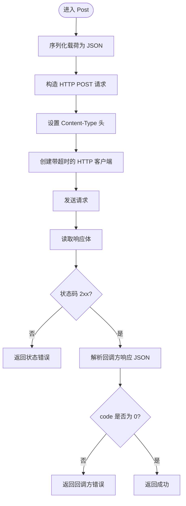

# Webhook 插件

<cite>
**本文档引用的文件**
- [plugin/webhook/webhook.go](file://plugin/webhook/webhook.go)
- [server/router/api/v1/memo_service.go](file://server/router/api/v1/memo_service.go)
- [server/router/api/v1/user_service.go](file://server/router/api/v1/user_service.go)
- [store/user_setting.go](file://store/user_setting.go)
- [proto/api/v1/user_service.proto](file://proto/api/v1/user_service.proto)
- [proto/store/user_setting.proto](file://proto/store/user_setting.proto)
- [web/src/components/Settings/WebhookSection.tsx](file://web/src/components/Settings/WebhookSection.tsx)
- [web/src/components/CreateWebhookDialog.tsx](file://web/src/components/CreateWebhookDialog.tsx)
</cite>

## 目录
1. [简介](#简介)
2. [项目结构](#项目结构)
3. [核心组件](#核心组件)
4. [架构总览](#架构总览)
5. [详细组件分析](#详细组件分析)
6. [依赖关系分析](#依赖关系分析)
7. [性能考虑](#性能考虑)
8. [故障排除指南](#故障排除指南)
9. [结论](#结论)
10. [附录](#附录)

## 简介
本文件系统性地阐述 Memos 中的 Webhook 插件：从事件触发到 HTTP 请求发送与响应处理，从配置管理到事件类型定义与回调地址设置，再到请求超时与错误处理策略，并补充安全机制（签名与防重放）的现状说明与改进建议。同时提供使用示例、配置参数、集成指南以及扩展开发与自定义事件处理器的集成指导。

## 项目结构
Webhook 功能由后端插件、服务层、存储层与前端界面协同实现：
- 后端插件负责构造请求负载并通过 HTTP 发送，支持同步与异步两种模式
- 服务层在特定业务事件发生时触发 Webhook 分发
- 存储层持久化用户级 Webhook 配置
- 前端提供 Webhook 列表、创建与删除的交互界面

图表来源
- [plugin/webhook/webhook.go](file://plugin/webhook/webhook.go#L1-L91)
- [server/router/api/v1/memo_service.go](file://server/router/api/v1/memo_service.go#L720-L766)
- [server/router/api/v1/user_service.go](file://server/router/api/v1/user_service.go#L700-L899)
- [store/user_setting.go](file://store/user_setting.go#L289-L401)
- [proto/api/v1/user_service.proto](file://proto/api/v1/user_service.proto#L109-L137)
- [proto/store/user_setting.proto](file://proto/store/user_setting.proto#L103-L114)
- [web/src/components/Settings/WebhookSection.tsx](file://web/src/components/Settings/WebhookSection.tsx#L1-L128)
- [web/src/components/CreateWebhookDialog.tsx](file://web/src/components/CreateWebhookDialog.tsx#L1-L169)

章节来源
- [plugin/webhook/webhook.go](file://plugin/webhook/webhook.go#L1-L91)
- [server/router/api/v1/memo_service.go](file://server/router/api/v1/memo_service.go#L720-L766)
- [server/router/api/v1/user_service.go](file://server/router/api/v1/user_service.go#L700-L899)
- [store/user_setting.go](file://store/user_setting.go#L289-L401)
- [proto/api/v1/user_service.proto](file://proto/api/v1/user_service.proto#L109-L137)
- [proto/store/user_setting.proto](file://proto/store/user_setting.proto#L103-L114)
- [web/src/components/Settings/WebhookSection.tsx](file://web/src/components/Settings/WebhookSection.tsx#L1-L128)
- [web/src/components/CreateWebhookDialog.tsx](file://web/src/components/CreateWebhookDialog.tsx#L1-L169)

## 核心组件
- WebhookRequestPayload：Webhook 请求载荷，包含目标 URL、活动类型、创建者资源名与可选的 Memo 对象
- Post：同步发送 Webhook 并校验响应格式与状态码
- PostAsync：异步发送 Webhook（在独立 goroutine 中执行）
- 事件分发：Memo 创建/更新/删除事件触发对应活动类型
- 配置管理：用户级 Webhook 列表、创建、更新、删除
- 前端界面：Webhook 设置页与创建/编辑对话框

章节来源
- [plugin/webhook/webhook.go](file://plugin/webhook/webhook.go#L21-L30)
- [plugin/webhook/webhook.go](file://plugin/webhook/webhook.go#L32-L76)
- [plugin/webhook/webhook.go](file://plugin/webhook/webhook.go#L78-L90)
- [server/router/api/v1/memo_service.go](file://server/router/api/v1/memo_service.go#L720-L732)
- [server/router/api/v1/user_service.go](file://server/router/api/v1/user_service.go#L711-L744)
- [web/src/components/Settings/WebhookSection.tsx](file://web/src/components/Settings/WebhookSection.tsx#L21-L27)
- [web/src/components/CreateWebhookDialog.tsx](file://web/src/components/CreateWebhookDialog.tsx#L88-L117)

## 架构总览
Webhook 事件流从业务事件出发，经服务层转换为 Webhook 载荷，再通过插件异步发送至用户配置的回调地址。后端对响应进行严格校验，确保回调方返回约定的 JSON 结构与状态码。

图表来源
- [server/router/api/v1/memo_service.go](file://server/router/api/v1/memo_service.go#L734-L755)
- [plugin/webhook/webhook.go](file://plugin/webhook/webhook.go#L32-L76)
- [store/user_setting.go](file://store/user_setting.go#L289-L304)

## 详细组件分析

### Webhook 插件（发送与响应处理）
- 请求构建：序列化载荷为 JSON，设置 Content-Type，使用带超时的 HTTP 客户端
- 响应处理：读取响应体，校验状态码范围，解析回调方返回的 JSON，要求 code 字段为 0 才视为成功
- 异步发送：PostAsync 在独立 goroutine 中调用 Post，失败仅记录警告日志

图表来源
- [plugin/webhook/webhook.go](file://plugin/webhook/webhook.go#L32-L76)

章节来源
- [plugin/webhook/webhook.go](file://plugin/webhook/webhook.go#L32-L76)
- [plugin/webhook/webhook.go](file://plugin/webhook/webhook.go#L78-L90)

### 事件触发与活动类型
- Memo 创建/更新/删除分别触发对应的活动类型字符串
- 服务层根据 Memo 的创建者提取用户 ID，查询该用户的 Webhooks 列表
- 将每个 Webhook 的 URL 注入载荷并异步发送

图表来源
- [server/router/api/v1/memo_service.go](file://server/router/api/v1/memo_service.go#L720-L732)
- [server/router/api/v1/memo_service.go](file://server/router/api/v1/memo_service.go#L734-L755)

章节来源
- [server/router/api/v1/memo_service.go](file://server/router/api/v1/memo_service.go#L720-L732)
- [server/router/api/v1/memo_service.go](file://server/router/api/v1/memo_service.go#L734-L755)

### 配置管理（用户级 Webhook）
- 用户可通过 API 列出、创建、更新、删除自己的 Webhooks
- Webhook 包含显示名称与回调 URL；ID 由服务端生成
- 存储采用用户设置中的 Webhooks 字段，支持增删改查

图表来源
- [proto/api/v1/user_service.proto](file://proto/api/v1/user_service.proto#L547-L564)
- [proto/store/user_setting.proto](file://proto/store/user_setting.proto#L103-L114)

章节来源
- [server/router/api/v1/user_service.go](file://server/router/api/v1/user_service.go#L700-L709)
- [server/router/api/v1/user_service.go](file://server/router/api/v1/user_service.go#L711-L744)
- [server/router/api/v1/user_service.go](file://server/router/api/v1/user_service.go#L747-L821)
- [server/router/api/v1/user_service.go](file://server/router/api/v1/user_service.go#L823-L865)
- [store/user_setting.go](file://store/user_setting.go#L289-L401)
- [proto/api/v1/user_service.proto](file://proto/api/v1/user_service.proto#L109-L137)
- [proto/store/user_setting.proto](file://proto/store/user_setting.proto#L103-L114)

### 前端集成与使用示例
- Webhook 设置页列出当前用户的 Webhooks，支持创建与删除
- 创建/编辑对话框提交显示名称与回调 URL
- 成功后刷新列表并提示用户

章节来源
- [web/src/components/Settings/WebhookSection.tsx](file://web/src/components/Settings/WebhookSection.tsx#L21-L27)
- [web/src/components/Settings/WebhookSection.tsx](file://web/src/components/Settings/WebhookSection.tsx#L43-L53)
- [web/src/components/CreateWebhookDialog.tsx](file://web/src/components/CreateWebhookDialog.tsx#L88-L117)

## 依赖关系分析
- 服务层依赖存储层获取用户 Webhooks
- 服务层依赖 Webhook 插件进行异步发送
- 协议层定义了用户 Webhook 的数据模型与 API 接口
- 前端通过用户服务客户端与后端交互

图表来源
- [server/router/api/v1/memo_service.go](file://server/router/api/v1/memo_service.go#L734-L755)
- [plugin/webhook/webhook.go](file://plugin/webhook/webhook.go#L78-L90)
- [store/user_setting.go](file://store/user_setting.go#L289-L401)
- [server/router/api/v1/user_service.go](file://server/router/api/v1/user_service.go#L700-L899)
- [proto/api/v1/user_service.proto](file://proto/api/v1/user_service.proto#L109-L137)
- [proto/store/user_setting.proto](file://proto/store/user_setting.proto#L103-L114)
- [web/src/components/Settings/WebhookSection.tsx](file://web/src/components/Settings/WebhookSection.tsx#L1-L128)
- [web/src/components/CreateWebhookDialog.tsx](file://web/src/components/CreateWebhookDialog.tsx#L1-L169)

## 性能考虑
- 异步发送：PostAsync 使用 goroutine 避免阻塞主流程，提升吞吐
- 超时控制：HTTP 客户端设置统一超时，防止长时间挂起
- 响应短路：状态码非 2xx 或回调方 code 非 0 即刻返回错误，减少无效处理
- 批量分发：同一事件可能触发多个 Webhook，建议在回调方做好幂等与限流

## 故障排除指南
- 回调地址不可达或超时
  - 检查网络连通性与防火墙设置
  - 关注 PostAsync 中的日志警告
- 回调方响应不符合规范
  - 确保返回 JSON 包含 code 字段且值为 0
  - 若状态码不在 2xx，将返回状态错误
- 权限问题
  - 确认当前用户身份与操作对象一致，或具备管理员权限
- 配置错误
  - 确认 Webhook URL 正确且可访问
  - 更新时使用 FieldMask 指定变更字段

章节来源
- [plugin/webhook/webhook.go](file://plugin/webhook/webhook.go#L48-L76)
- [plugin/webhook/webhook.go](file://plugin/webhook/webhook.go#L80-L90)
- [server/router/api/v1/user_service.go](file://server/router/api/v1/user_service.go#L717-L726)
- [server/router/api/v1/user_service.go](file://server/router/api/v1/user_service.go#L747-L821)

## 结论
Memos 的 Webhook 插件以简洁的载荷结构与严格的响应校验为核心，结合异步发送与统一超时控制，满足基础的事件通知需求。当前未内置签名验证与防重放机制，建议在回调方实现签名校验与去重逻辑，以增强安全性与可靠性。

## 附录

### Webhook 配置参数
- 显示名称（display_name）：用于识别的友好名称
- 回调 URL（url）：接收 Webhook 的 HTTP(S) 地址
- ID：由服务端生成的唯一标识符

章节来源
- [proto/api/v1/user_service.proto](file://proto/api/v1/user_service.proto#L547-L564)
- [proto/store/user_setting.proto](file://proto/store/user_setting.proto#L103-L114)

### 事件类型定义
- memos.memo.created：Memo 创建
- memos.memo.updated：Memo 更新
- memos.memo.deleted：Memo 删除

章节来源
- [server/router/api/v1/memo_service.go](file://server/router/api/v1/memo_service.go#L720-L732)

### 回调响应规范
- 必须返回 JSON，包含 code 与 message 字段
- code 为 0 表示成功，非 0 视作错误
- HTTP 状态码应在 2xx 范围内

章节来源
- [plugin/webhook/webhook.go](file://plugin/webhook/webhook.go#L59-L76)

### 安全机制与建议
- 当前实现未包含签名验证与防重放
- 建议在回调方：
  - 校验请求签名（如基于共享密钥与请求体摘要）
  - 维护已处理事件 ID 的去重表，拒绝重复事件
  - 限制回调速率，避免被滥用

章节来源
- [plugin/webhook/webhook.go](file://plugin/webhook/webhook.go#L32-L76)

### 扩展开发与自定义事件处理器
- 新增事件类型
  - 在服务层新增事件分发方法，设置新的 activityType
  - 在存储层保留 Webhooks 列表，无需改动
- 自定义事件处理器
  - 在回调方实现签名验证与幂等处理
  - 支持批量事件聚合与错误重试策略
- 集成指南
  - 前端通过用户服务 API 管理 Webhooks
  - 后端保持 PostAsync 的异步特性，避免阻塞

章节来源
- [server/router/api/v1/memo_service.go](file://server/router/api/v1/memo_service.go#L720-L732)
- [server/router/api/v1/user_service.go](file://server/router/api/v1/user_service.go#L711-L744)
- [web/src/components/Settings/WebhookSection.tsx](file://web/src/components/Settings/WebhookSection.tsx#L21-L27)
- [web/src/components/CreateWebhookDialog.tsx](file://web/src/components/CreateWebhookDialog.tsx#L88-L117)