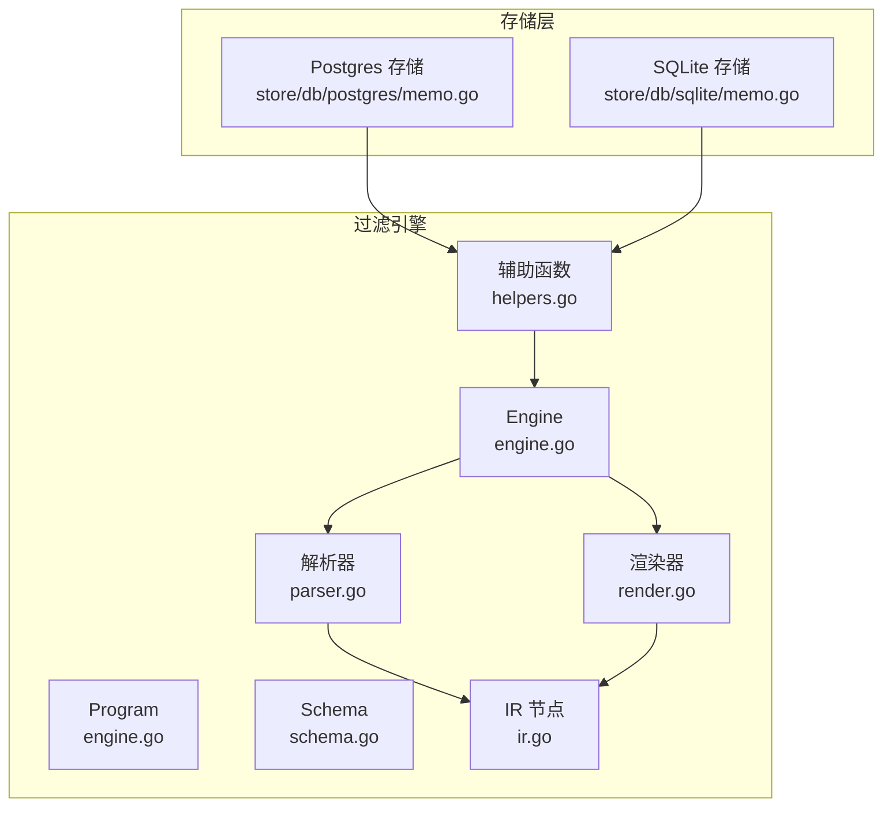
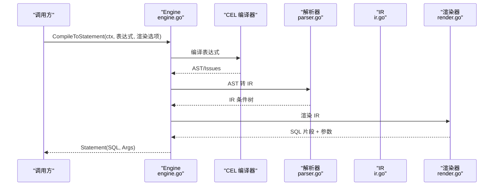
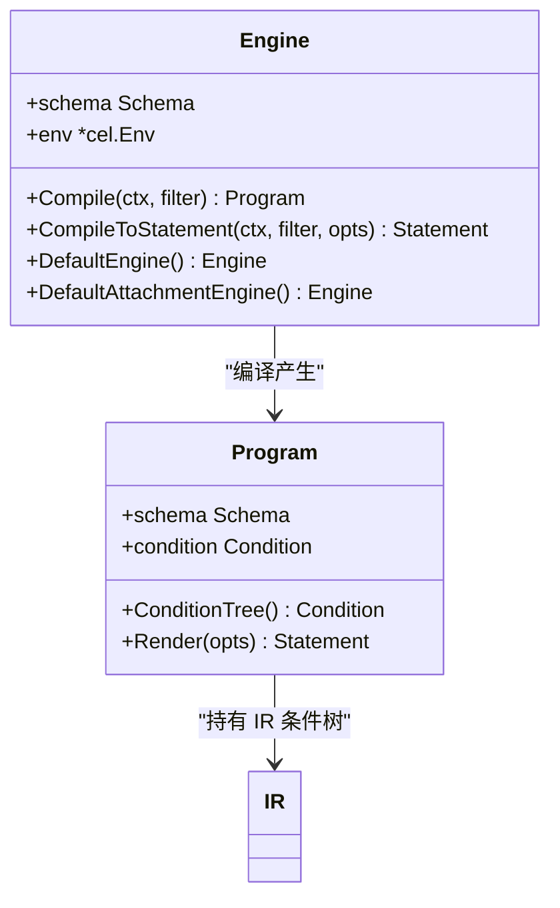
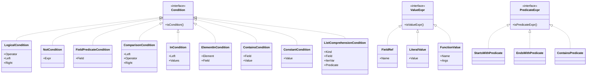
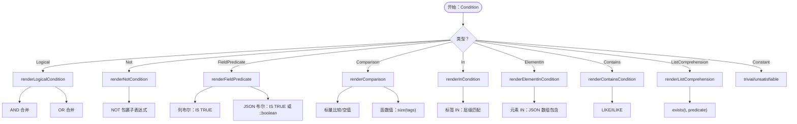
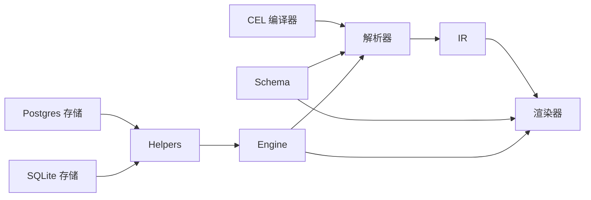

# 内容过滤引擎插件

<cite>
**本文引用的文件列表**
- [engine.go](file://plugin/filter/engine.go)
- [parser.go](file://plugin/filter/parser.go)
- [ir.go](file://plugin/filter/ir.go)
- [render.go](file://plugin/filter/render.go)
- [schema.go](file://plugin/filter/schema.go)
- [helpers.go](file://plugin/filter/helpers.go)
- [README.md](file://plugin/filter/README.md)
- [MAINTENANCE.md](file://plugin/filter/MAINTENANCE.md)
- [memo_filter_test.go（Postgres）](file://store/db/postgres/memo_filter_test.go)
- [memo_filter_test.go（SQLite）](file://store/db/sqlite/memo_filter_test.go)
- [memo.go（Postgres）](file://store/db/postgres/memo.go)
- [memo.go（SQLite）](file://store/db/sqlite/memo.go)
</cite>

## 目录
1. [简介](#简介)
2. [项目结构](#项目结构)
3. [核心组件](#核心组件)
4. [架构总览](#架构总览)
5. [详细组件分析](#详细组件分析)
6. [依赖关系分析](#依赖关系分析)
7. [性能与并发](#性能与并发)
8. [故障排查指南](#故障排查指南)
9. [结论](#结论)
10. [附录：使用示例与规则编写指南](#附录使用示例与规则编写指南)

## 简介
本插件为“内容过滤引擎”，负责将基于 CEL（Common Expression Language）的过滤表达式解析为可执行的中间表示（IR），再渲染为目标数据库方言（如 SQLite、Postgres）的 SQL 片段与参数，最终由存储层拼接到查询中执行。该引擎遵循三阶段流水线：解析（Parsing）、归一化（Normalization）、渲染（Rendering）。其设计目标是：
- 以统一的表达式语言描述过滤规则；
- 将表达式转换为与方言无关的 IR，再按方言差异进行精确渲染；
- 提供默认单例引擎，减少重复初始化成本；
- 支持标签集合、布尔 JSON 字段、时间戳等复杂类型与操作。

## 项目结构
- 核心文件
  - schema.go：定义字段元数据、类型、后端列映射、CEL 变量与环境选项
  - ir.go：中间表示（IR）节点类型定义
  - parser.go：将 CEL AST 转换为 IR，并进行类型与操作符校验
  - render.go：将 IR 渲染为 SQL 片段与参数，处理方言差异
  - engine.go：引擎入口、编译流程、默认单例
  - helpers.go：存储层集成辅助函数（批量追加条件）
- 测试与使用
  - store/db/postgres/memo_filter_test.go 与 store/db/sqlite/memo_filter_test.go：覆盖多种表达式与方言输出
  - store/db/postgres/memo.go 与 store/db/sqlite/memo.go：在存储层调用引擎并拼接 WHERE 条件
- 文档
  - README.md：概述、核心文件职责、典型集成步骤
  - MAINTENANCE.md：维护指南、新增字段流程、调试要点



图表来源
- [engine.go](file://plugin/filter/engine.go#L1-L192)
- [parser.go](file://plugin/filter/parser.go#L1-L587)
- [ir.go](file://plugin/filter/ir.go#L1-L160)
- [render.go](file://plugin/filter/render.go#L1-L721)
- [schema.go](file://plugin/filter/schema.go#L1-L313)
- [helpers.go](file://plugin/filter/helpers.go#L1-L26)
- [memo.go（Postgres）](file://store/db/postgres/memo.go#L51-L197)
- [memo.go（SQLite）](file://store/db/sqlite/memo.go#L54-L192)

章节来源
- [README.md](file://plugin/filter/README.md#L1-L64)
- [engine.go](file://plugin/filter/engine.go#L1-L192)
- [schema.go](file://plugin/filter/schema.go#L1-L313)

## 核心组件
- 引擎 Engine
  - 负责创建 CEL 环境、编译表达式、构建 IR、渲染 SQL
  - 提供默认单例（默认 Memo 引擎与附件引擎）
- 中间表示 IR
  - 逻辑运算、比较、IN、元素存在性、字符串包含、函数值、JSON 列表遍历谓词等
- 解析器 Parser
  - 将 CEL AST 转换为 IR，执行类型与操作符校验
- 渲染器 Renderer
  - 将 IR 渲染为 SQL 片段与参数，封装方言差异（JSON 访问、布尔语义、占位符、LIKE/ILIKE）
- 模式 Schema
  - 定义字段名、类型、后端列、JSON 路径、允许的操作符、CEL 变量与环境选项
- 辅助函数 Helpers
  - 在存储层批量追加多个过滤条件，自动处理占位符偏移

章节来源
- [engine.go](file://plugin/filter/engine.go#L1-L192)
- [ir.go](file://plugin/filter/ir.go#L1-L160)
- [parser.go](file://plugin/filter/parser.go#L1-L587)
- [render.go](file://plugin/filter/render.go#L1-L721)
- [schema.go](file://plugin/filter/schema.go#L1-L313)
- [helpers.go](file://plugin/filter/helpers.go#L1-L26)

## 架构总览
过滤引擎采用“解析-归一化-渲染”的三阶段流水线，结合 CEL AST 与自定义 IR，确保表达式合法性与方言兼容性。



图表来源
- [engine.go](file://plugin/filter/engine.go#L42-L77)
- [parser.go](file://plugin/filter/parser.go#L10-L44)
- [render.go](file://plugin/filter/render.go#L32-L59)

## 详细组件分析

### 引擎 Engine 与程序 Program
- Engine
  - 创建 CEL 环境（基于 Schema 的 EnvOptions）
  - 编译表达式并转换为 IR
  - 提供 Compile、CompileToStatement、默认单例（Memo 与附件）
- Program
  - 保存 IR 条件树与 Schema
  - 提供 ConditionTree 访问 IR
  - Render 将 IR 渲染为 SQL 片段与参数



图表来源
- [engine.go](file://plugin/filter/engine.go#L14-L96)
- [ir.go](file://plugin/filter/ir.go#L3-L6)

章节来源
- [engine.go](file://plugin/filter/engine.go#L1-L192)

### 中间表示 IR
- 逻辑运算：AND/OR
- 布尔谓词：字段作为布尔值
- 比较运算：支持 =、!=、<、<=、>、>=（受字段允许操作符限制）
- IN 与元素存在：支持 "值 in 字段" 与 "字段 in [值列表]"
- 字符串包含：字段.contains("子串")
- 函数值：如 size(tags)
- JSON 列表遍历：exists(t, predicate(t))



图表来源
- [ir.go](file://plugin/filter/ir.go#L3-L160)

章节来源
- [ir.go](file://plugin/filter/ir.go#L1-L160)

### 解析器 Parser：从 CEL AST 到 IR
- buildCondition：顶层入口，分发到不同表达式类型
- buildCallCondition：处理逻辑运算、比较、IN、contains、函数等
- buildComparisonCondition：校验字段类型与允许的操作符
- buildInCondition：支持 "标识 in [值]" 与 "值 in 标识"
- buildContainsCondition：仅支持字面量参数
- buildValueExpr：解析字段引用、字面量、函数（size、now）、算术表达式
- buildComprehensionCondition：识别 exists() 宏，提取谓词（startsWith/endsWith/contains）

```mermaid
flowchart TD
Start(["开始：CEL Expr"]) --> Type{"表达式类型？"}
Type --> |Call| Call["buildCallCondition"]
Type --> |Const| Const["常量转布尔/数值"]
Type --> |Ident| Ident["字段引用校验"]
Type --> |Comprehension| Comp["buildComprehensionCondition"]
Call --> Op{"函数名？"}
Op --> |"&&"|"||"| LOGIC["逻辑 AND/OR"]
Op --> |"!"| NOT["取反"]
Op --> |"=="|"!="|"<>| COMP["比较"]
Op --> |"@in"| IN["IN"]
Op --> |"contains"| CONT["包含"]
Const --> BOOL{"是否布尔/非零数？"}
BOOL --> |是| RET1["返回 ConstantCondition"]
BOOL --> |否| ERR1["报错：必须为布尔"]
Ident --> FIELD{"字段是否存在且为布尔？"}
FIELD --> |是| RET2["返回 FieldPredicateCondition"]
FIELD --> |否| ERR2["报错：未知或非布尔字段"]
Comp --> EXISTS["识别 exists() 并提取谓词"]
EXISTS --> RET3["返回 ListComprehensionCondition"]
LOGIC --> RET4["返回 LogicalCondition"]
NOT --> RET5["返回 NotCondition"]
COMP --> RET6["返回 ComparisonCondition"]
IN --> RET7["返回 InCondition/ElementInCondition"]
CONT --> RET8["返回 ContainsCondition"]
```

图表来源
- [parser.go](file://plugin/filter/parser.go#L10-L587)

章节来源
- [parser.go](file://plugin/filter/parser.go#L1-L587)

### 渲染器 Renderer：IR 到 SQL
- 统一入口 Render：根据 IR 节点递归渲染，处理 trivial/unsatisfiable 场景
- 逻辑运算：AND/OR 合并，短路处理
- 布尔字段：支持列布尔与 JSON 布尔（IS TRUE 或 ::boolean）
- 比较运算：标量比较、空值比较（IS NULL/IS NOT NULL）
- IN 与元素存在：标签支持层级匹配（前缀/精确），Postgres 使用 @>，SQLite 使用 LIKE
- 字符串包含：Postgres 使用 ILIKE，其他使用 LIKE
- 函数值：size(tags) 渲染为 JSON 数组长度函数
- 列表遍历：exists(t, predicate(t)) 渲染为 JSON 数组匹配



图表来源
- [render.go](file://plugin/filter/render.go#L32-L721)

章节来源
- [render.go](file://plugin/filter/render.go#L1-L721)

### 模式 Schema：字段与环境
- 字段类型与存储形态
  - 标量：字符串、整型、时间戳
  - 布尔：列布尔、JSON 布尔
  - JSON 列表：标签数组等
  - 虚拟别名：如 tag -> tags
- 允许的操作符：每字段可配置允许的比较操作符
- CEL 环境：声明可用变量（content、creator_id、created_ts、updated_ts、pinned、visibility、tags、has_* 等）
- 时间函数：now() 返回 Unix 秒

章节来源
- [schema.go](file://plugin/filter/schema.go#L1-L313)

### 辅助函数 Helpers：存储层集成
- AppendConditions：将一组过滤表达式编译并追加到 WHERE 子句与参数切片，自动计算占位符偏移，避免冲突

章节来源
- [helpers.go](file://plugin/filter/helpers.go#L1-L26)

## 依赖关系分析
- 引擎依赖 CEL 环境进行表达式编译与 AST 转换
- 解析器依赖模式 Schema 进行字段存在性与类型校验
- 渲染器依赖模式 Schema 与方言常量生成 SQL 片段
- 存储层通过默认引擎与辅助函数集成过滤条件



图表来源
- [engine.go](file://plugin/filter/engine.go#L1-L192)
- [parser.go](file://plugin/filter/parser.go#L1-L587)
- [render.go](file://plugin/filter/render.go#L1-L721)
- [schema.go](file://plugin/filter/schema.go#L1-L313)
- [helpers.go](file://plugin/filter/helpers.go#L1-L26)
- [memo.go（Postgres）](file://store/db/postgres/memo.go#L54-L60)
- [memo.go（SQLite）](file://store/db/sqlite/memo.go#L57-L63)

章节来源
- [engine.go](file://plugin/filter/engine.go#L1-L192)
- [parser.go](file://plugin/filter/parser.go#L1-L587)
- [render.go](file://plugin/filter/render.go#L1-L721)
- [schema.go](file://plugin/filter/schema.go#L1-L313)
- [helpers.go](file://plugin/filter/helpers.go#L1-L26)
- [memo.go（Postgres）](file://store/db/postgres/memo.go#L51-L197)
- [memo.go（SQLite）](file://store/db/sqlite/memo.go#L54-L192)

## 性能与并发
- 单例引擎
  - 默认单例缓存已解析的 CEL 环境，避免重复初始化开销
  - 建议每个进程仅创建一次默认引擎实例
- 占位符偏移
  - AppendConditions 自动计算占位符偏移，避免与已有参数冲突
- 渲染优化
  - trivial/unsatisfiable 快路径：直接返回空片段或恒假条件，减少 SQL 复杂度
  - JSON 操作针对 Postgres 与 SQLite 分别优化（@>、ILIKE、LIKE、JSON_EXTRACT、jsonb_array_length 等）
- 并发安全
  - 引擎内部未见显式锁；默认单例通过 once 初始化，适合并发访问
  - 若需要多引擎隔离，可使用 NewEngine 构建独立实例

章节来源
- [engine.go](file://plugin/filter/engine.go#L98-L121)
- [helpers.go](file://plugin/filter/helpers.go#L8-L25)
- [render.go](file://plugin/filter/render.go#L554-L582)

## 故障排查指南
- 解析错误
  - 未知标识符：检查表达式中字段是否在 Schema 中定义
  - 非布尔字段用于谓词：字段类型需为布尔（列布尔或 JSON 布尔）
  - 不支持的操作符：字段允许的操作符集可能限制了比较类型
- 渲染错误
  - JSON 布尔/标量比较：确认字段 Kind 与 Type 是否匹配
  - IN 与元素存在：确保左/右表达式类型正确（字段引用、字面量、函数）
  - 标签层级匹配：确认方言与 JSON 操作符使用正确
- 调试建议
  - 在解析器关键分支打印 AST 节点类型与字段元数据
  - 在渲染器 renderCondition 中临时输出 IR 类型与生成的 SQL 片段
  - 确保存储层只初始化一次默认引擎，避免重复创建

章节来源
- [parser.go](file://plugin/filter/parser.go#L10-L44)
- [render.go](file://plugin/filter/render.go#L61-L87)
- [MAINTENANCE.md](file://plugin/filter/MAINTENANCE.md#L35-L44)

## 结论
内容过滤引擎插件以 CEL 为输入，通过解析-归一化-渲染三阶段，将表达式安全地转换为与方言无关的 IR，并最终渲染为高效、兼容的 SQL 片段。其设计强调：
- 表达式语言的一致性与安全性（Schema 校验）
- 方言差异的集中封装（渲染器）
- 存储层的无缝集成（默认单例 + 辅助函数）
- 易于扩展与维护（新增字段流程清晰）

## 附录：使用示例与规则编写指南

### 使用示例
- 获取默认引擎并编译表达式
  - Postgres：CompileToStatement(ctx, expr, RenderOptions{Dialect: DialectPostgres})
  - SQLite：CompileToStatement(ctx, expr, RenderOptions{Dialect: DialectSQLite})
- 批量追加条件
  - AppendConditions(ctx, engine, filters, dialect, &where, &args)

章节来源
- [README.md](file://plugin/filter/README.md#L20-L30)
- [helpers.go](file://plugin/filter/helpers.go#L8-L25)
- [memo.go（Postgres）](file://store/db/postgres/memo.go#L54-L60)
- [memo.go（SQLite）](file://store/db/sqlite/memo.go#L57-L63)

### 规则编写指南
- 字段与类型
  - 使用 Schema 中声明的字段名（如 content、visibility、tags、has_task_list 等）
  - 布尔字段既可直接作为谓词（如 has_task_list），也可进行比较（如 has_task_list == true/false）
- 比较运算
  - 仅对允许的操作符进行比较（由字段定义决定）
  - 空值比较仅支持 IS NULL/IS NOT NULL
- IN 与元素存在
  - "值 in 字段"：适用于 JSON 列表（如 tags）
  - "字段 in [值列表]"：适用于标量字段（如 visibility）
- 字符串包含
  - 使用字段.contains("子串")，Postgres 使用 ILIKE，其他使用 LIKE
- 函数
  - size(tags)：返回标签数量，支持与数字比较
- 时间
  - 使用 now() 获取当前 Unix 秒，支持与时间戳字段比较
- 列表遍历
  - 仅支持 exists(t, predicate(t))，支持 startsWith/endsWith/contains 谓词

章节来源
- [schema.go](file://plugin/filter/schema.go#L100-L245)
- [parser.go](file://plugin/filter/parser.go#L109-L151)
- [render.go](file://plugin/filter/render.go#L449-L470)

### 性能调优建议
- 复合条件合并
  - 合理组织表达式，利用 trivial/unsatisfiable 快路径减少 SQL 复杂度
- 占位符管理
  - 使用 AppendConditions 自动计算偏移，避免手动拼接导致的参数错位
- 方言选择
  - 在 Postgres 下优先使用 @> 与 ILIKE，提升 JSON 查询效率
- 字段索引
  - 对标量字段（如 visibility、creator_id）建立合适索引，配合 IN/比较条件
- 表达式简化
  - 将常量表达式提前计算（如 now() - 常量秒数），减少运行时计算

章节来源
- [render.go](file://plugin/filter/render.go#L554-L582)
- [memo_filter_test.go（Postgres）](file://store/db/postgres/memo_filter_test.go#L19-L149)
- [memo_filter_test.go（SQLite）](file://store/db/sqlite/memo_filter_test.go#L19-L154)

### 扩展开发与自定义过滤器
- 新增字段流程
  - 在 schema.go 中添加字段定义（类型、后端列、JSON 路径、允许操作符、CEL 变量）
  - 如涉及非标量（JSON 布尔/列表），在 parser.go 或 render.go 中补充处理
  - 编写方言测试用例，验证 SQL 输出
- 维护与调试
  - 将方言差异集中在 render.go，避免泄漏到存储层
  - 使用默认单例，确保进程内共享 CEL 环境
  - 新增 IR 节点或渲染路径时，补充单元测试

章节来源
- [MAINTENANCE.md](file://plugin/filter/MAINTENANCE.md#L7-L23)
- [schema.go](file://plugin/filter/schema.go#L99-L245)
- [parser.go](file://plugin/filter/parser.go#L421-L587)
- [render.go](file://plugin/filter/render.go#L1-L721)