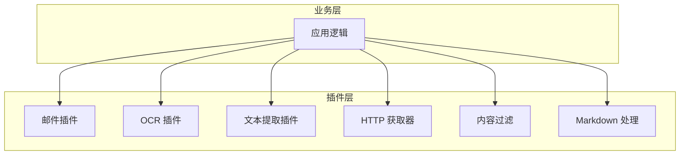
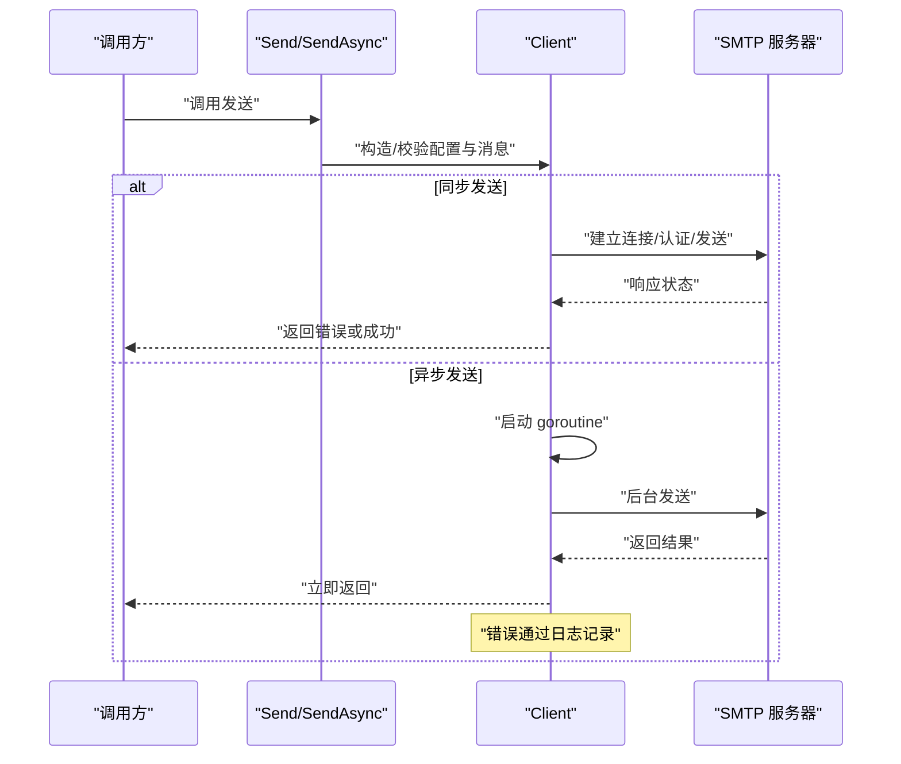
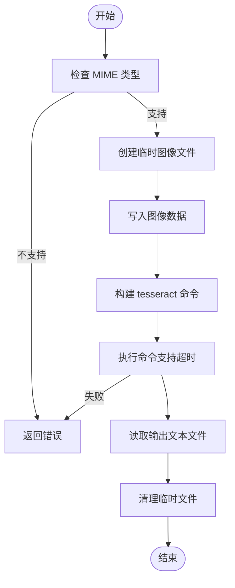
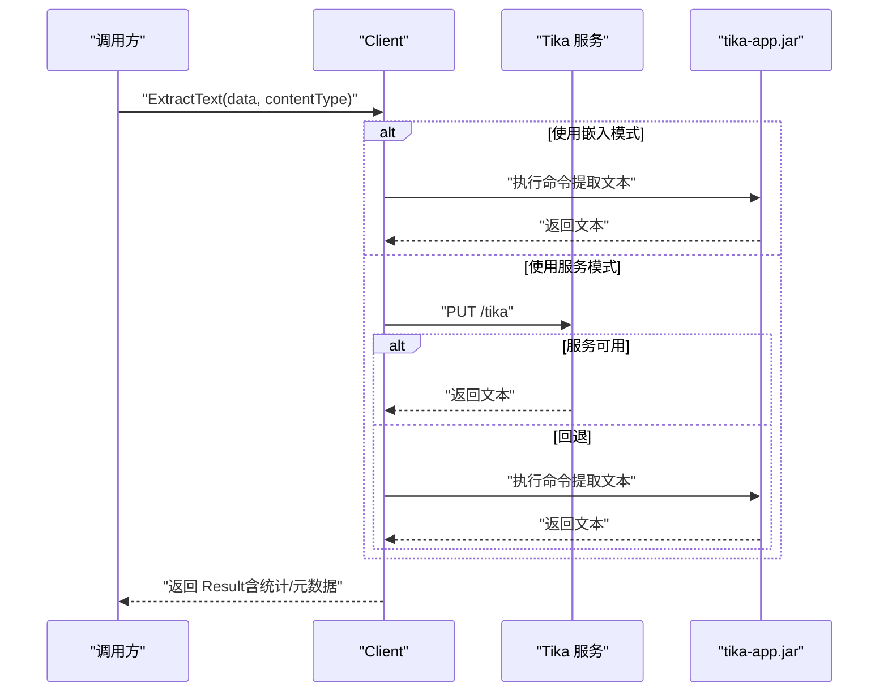
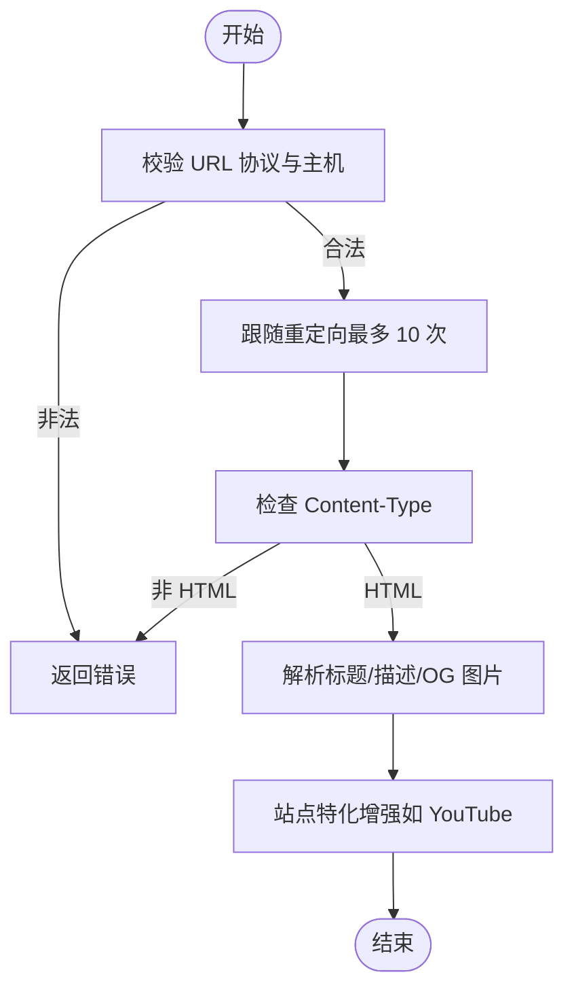
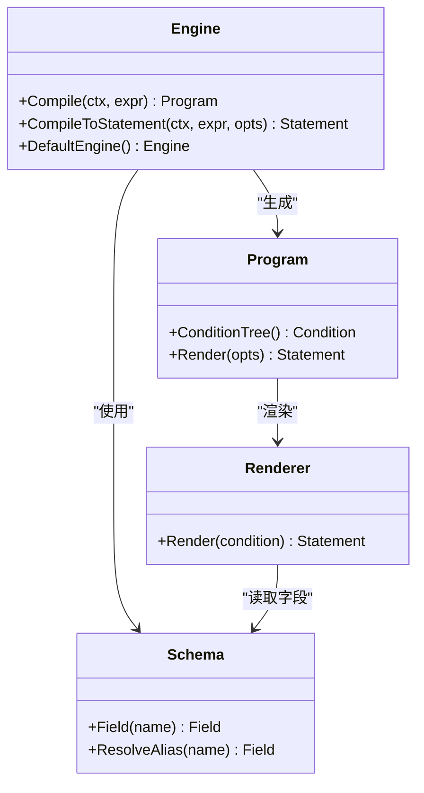
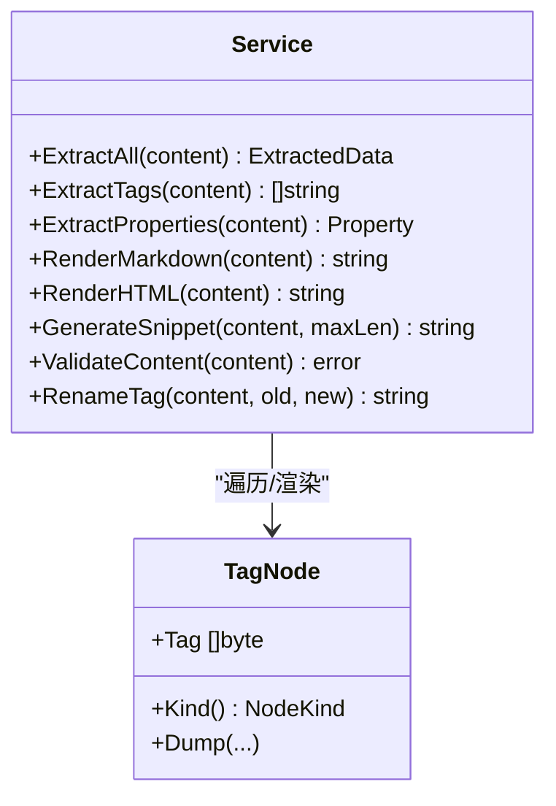
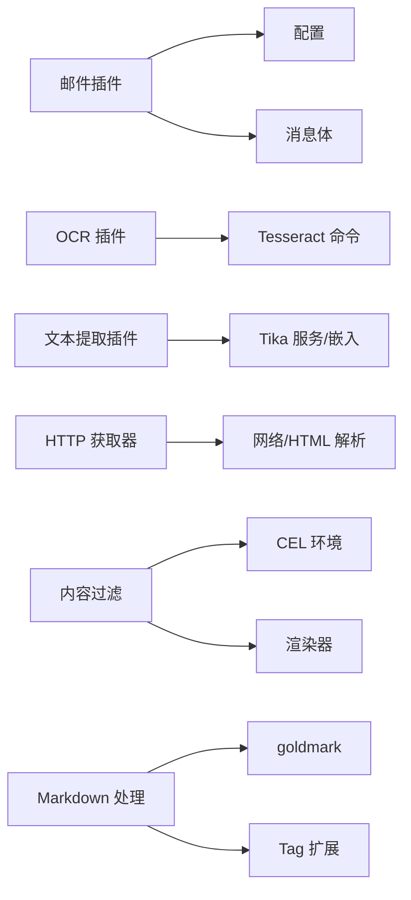

# 实用工具插件

<cite>
**本文引用的文件**
- [plugin/email/email.go](file://plugin/email/email.go)
- [plugin/email/client.go](file://plugin/email/client.go)
- [plugin/email/config.go](file://plugin/email/config.go)
- [plugin/email/message.go](file://plugin/email/message.go)
- [plugin/ocr/tesseract.go](file://plugin/ocr/tesseract.go)
- [plugin/textextract/tika.go](file://plugin/textextract/tika.go)
- [plugin/httpgetter/html_meta.go](file://plugin/httpgetter/html_meta.go)
- [plugin/httpgetter/util.go](file://plugin/httpgetter/util.go)
- [plugin/httpgetter/image.go](file://plugin/httpgetter/image.go)
- [plugin/filter/engine.go](file://plugin/filter/engine.go)
- [plugin/filter/schema.go](file://plugin/filter/schema.go)
- [plugin/filter/render.go](file://plugin/filter/render.go)
- [plugin/markdown/markdown.go](file://plugin/markdown/markdown.go)
- [plugin/markdown/ast/tag.go](file://plugin/markdown/ast/tag.go)
- [plugin/markdown/extensions/tag.go](file://plugin/markdown/extensions/tag.go)
</cite>

## 目录
1. [简介](#简介)
2. [项目结构](#项目结构)
3. [核心组件](#核心组件)
4. [架构总览](#架构总览)
5. [详细组件分析](#详细组件分析)
6. [依赖分析](#依赖分析)
7. [性能考虑](#性能考虑)
8. [故障排除指南](#故障排除指南)
9. [结论](#结论)
10. [附录](#附录)

## 简介
本文件系统性梳理并说明实用工具插件的设计与实现，覆盖以下能力：
- 邮件发送：同步与异步发送、加密方式选择、消息格式化与校验
- OCR 识别：基于 Tesseract 的图像文字提取、布局信息、语言与版本检测
- 文本提取：基于 Apache Tika 的多格式文档文本抽取、元数据解析、统计信息
- HTTP 获取器：HTML 元信息抓取、图片下载、安全 URL 校验与重定向限制
- 内容过滤：基于 CEL 的表达式编译与 SQL 渲染，支持 SQLite/PostgreSQL
- Markdown 处理：标签提取、属性推断、摘要生成、HTML 渲染与内容校验

文档同时阐述接口设计、配置参数、使用方法、错误处理、超时控制、资源管理、性能优化、缓存策略、并发处理、集成示例、配置指南与故障排除，并提供扩展开发指导。

## 项目结构
实用工具插件按功能模块组织在 plugin 目录下，各模块自包含配置、客户端与工具函数，便于独立部署与替换。

```mermaid
graph TB
subgraph "邮件插件"
ECFG["Config<br/>配置"]
EMES["Message<br/>消息体"]
ECLI["Client<br/>SMTP 客户端"]
EAPI["Send/SendAsync<br/>入口"]
end
subgraph "OCR 插件"
OCFG["Config<br/>配置"]
OCLI["Client<br/>Tesseract 客户端"]
OTXT["Result/Word/Line/Box<br/>结果模型"]
end
subgraph "文本提取插件"
TCFG["Config<br/>配置"]
TCLI["Client<br/>Tika 客户端"]
TRES["Result<br/>结果模型"]
end
subgraph "HTTP 获取器"
HMETA["GetHTMLMeta<br/>HTML 元信息"]
IMG["GetImage<br/>图片下载"]
UTIL["getMediatype<br/>媒体类型解析"]
end
subgraph "内容过滤"
ENG["Engine<br/>编译引擎"]
SCH["Schema<br/>字段定义"]
RND["Renderer<br/>SQL 渲染"]
end
subgraph "Markdown 处理"
MSVC["Service 接口/实现"]
TAGAST["TagNode<br/>AST 节点"]
TAGEXT["TagExtension<br/>扩展"]
end
EAPI --> ECLI
ECLI --> ECFG
ECLI --> EMES
OCLI --> OCFG
OCLI --> OTXT
TCLI --> TCFG
TCLI --> TRES
HMETA --> UTIL
IMG --> UTIL
ENG --> SCH
ENG --> RND
RND --> SCH
MSVC --> TAGAST
MSVC --> TAGEXT
```

图示来源
- [plugin/email/email.go](file://plugin/email/email.go#L11-L43)
- [plugin/email/client.go](file://plugin/email/client.go#L47-L143)
- [plugin/email/config.go](file://plugin/email/config.go#L11-L47)
- [plugin/email/message.go](file://plugin/email/message.go#L11-L91)
- [plugin/ocr/tesseract.go](file://plugin/ocr/tesseract.go#L29-L122)
- [plugin/textextract/tika.go](file://plugin/textextract/tika.go#L37-L132)
- [plugin/httpgetter/html_meta.go](file://plugin/httpgetter/html_meta.go#L35-L58)
- [plugin/httpgetter/util.go](file://plugin/httpgetter/util.go#L8-L15)
- [plugin/httpgetter/image.go](file://plugin/httpgetter/image.go#L16-L45)
- [plugin/filter/engine.go](file://plugin/filter/engine.go#L14-L96)
- [plugin/filter/schema.go](file://plugin/filter/schema.go#L61-L244)
- [plugin/filter/render.go](file://plugin/filter/render.go#L32-L59)
- [plugin/markdown/markdown.go](file://plugin/markdown/markdown.go#L30-L101)
- [plugin/markdown/ast/tag.go](file://plugin/markdown/ast/tag.go#L7-L28)
- [plugin/markdown/extensions/tag.go](file://plugin/markdown/extensions/tag.go#L11-L24)

章节来源
- [plugin/email/email.go](file://plugin/email/email.go#L1-L44)
- [plugin/ocr/tesseract.go](file://plugin/ocr/tesseract.go#L1-L410)
- [plugin/textextract/tika.go](file://plugin/textextract/tika.go#L1-L452)
- [plugin/httpgetter/html_meta.go](file://plugin/httpgetter/html_meta.go#L1-L167)
- [plugin/httpgetter/util.go](file://plugin/httpgetter/util.go#L1-L16)
- [plugin/httpgetter/image.go](file://plugin/httpgetter/image.go#L1-L46)
- [plugin/filter/engine.go](file://plugin/filter/engine.go#L1-L192)
- [plugin/filter/schema.go](file://plugin/filter/schema.go#L1-L313)
- [plugin/filter/render.go](file://plugin/filter/render.go#L1-L721)
- [plugin/markdown/markdown.go](file://plugin/markdown/markdown.go#L1-L411)
- [plugin/markdown/ast/tag.go](file://plugin/markdown/ast/tag.go#L1-L29)
- [plugin/markdown/extensions/tag.go](file://plugin/markdown/extensions/tag.go#L1-L25)

## 核心组件
- 邮件插件：提供同步与异步发送接口，支持 STARTTLS/SSL 加密，消息体格式化与校验，配置验证与服务器地址拼装。
- OCR 插件：封装 Tesseract 命令调用，支持多种图像 MIME 类型，提供纯文本、带布局信息与 hOCR 输出，语言列表查询与版本检测，结果合并与格式化。
- 文本提取插件：封装 Tika 服务或嵌入模式（java -jar），支持多格式 MIME 类型，自动回退，元数据提取与统计，文件路径读取与内容类型探测。
- HTTP 获取器：安全 URL 校验（禁止内网/环回/链路本地）、重定向限制、HTML 元信息提取（标题、描述、OG 图片）、图片下载与媒体类型判断。
- 内容过滤：基于 CEL 表达式编译为 SQL，支持 SQLite/PostgreSQL，内置 JSON 字段、布尔字段、时间戳字段与字符串字段映射，渲染器负责占位符与方言差异处理。
- Markdown 处理：服务接口统一提取标签、属性、摘要、HTML 渲染与内容校验；通过扩展注入 #tag 解析，AST 节点用于遍历与渲染。

章节来源
- [plugin/email/email.go](file://plugin/email/email.go#L9-L43)
- [plugin/ocr/tesseract.go](file://plugin/ocr/tesseract.go#L29-L122)
- [plugin/textextract/tika.go](file://plugin/textextract/tika.go#L37-L132)
- [plugin/httpgetter/html_meta.go](file://plugin/httpgetter/html_meta.go#L15-L58)
- [plugin/filter/engine.go](file://plugin/filter/engine.go#L13-L96)
- [plugin/markdown/markdown.go](file://plugin/markdown/markdown.go#L26-L101)

## 架构总览
实用工具插件采用“模块化 + 统一接口”的设计，各模块内部自包含配置与客户端，对外暴露简洁的函数或接口，便于在业务层组合使用。

图示来源
- [plugin/email/email.go](file://plugin/email/email.go#L11-L43)
- [plugin/ocr/tesseract.go](file://plugin/ocr/tesseract.go#L53-L122)
- [plugin/textextract/tika.go](file://plugin/textextract/tika.go#L94-L132)
- [plugin/httpgetter/html_meta.go](file://plugin/httpgetter/html_meta.go#L35-L58)
- [plugin/filter/engine.go](file://plugin/filter/engine.go#L19-L96)
- [plugin/markdown/markdown.go](file://plugin/markdown/markdown.go#L76-L101)

## 详细组件分析

### 邮件插件
- 接口设计
  - 同步发送：Send(config, message) -> error
  - 异步发送：SendAsync(config, message) -> 无返回值（内部 goroutine 执行并记录日志）
- 配置参数
  - SMTPHost、SMTPPort、SMTPUsername、SMTPPassword、FromEmail、FromName、UseTLS、UseSSL
  - 校验规则：主机名必填、端口范围、发件邮箱必填
  - 服务器地址拼装：GetServerAddress()
- 消息体
  - To/Cc/Bcc、Subject、Body、IsHTML、ReplyTo
  - 校验：至少一个收件人、主题与正文必填
  - 格式化：RFC 5322 格式头与正文
- 发送流程
  - 校验配置与消息体
  - 格式化消息体
  - 选择加密方式：UseSSL 使用 SSL/TLS 连接；否则使用 STARTTLS 或明文（不推荐）
  - SSL 模式：TLS 握手、SMTP 认证、设置发件人与收件人、DATA 写入
- 错误处理
  - 配置/消息体非法直接返回错误
  - SSL 模式下连接、认证、命令执行失败均包装错误返回
  - 异步发送捕获错误并记录警告日志（含收件人片段）
- 并发与资源
  - 异步发送使用 goroutine，避免阻塞主流程
  - SSL 模式下显式关闭连接与退出 SMTP 客户端
- 性能与优化
  - 异步发送降低请求延迟
  - 明文传输不建议启用，优先使用 STARTTLS/SSL
- 使用示例
  - 同步发送：传入配置与消息体，等待返回错误
  - 异步发送：传入配置与消息体，立即返回，错误在后台日志中可见

图示来源
- [plugin/email/email.go](file://plugin/email/email.go#L11-L43)
- [plugin/email/client.go](file://plugin/email/client.go#L47-L143)
- [plugin/email/config.go](file://plugin/email/config.go#L30-L47)
- [plugin/email/message.go](file://plugin/email/message.go#L21-L91)

章节来源
- [plugin/email/email.go](file://plugin/email/email.go#L9-L43)
- [plugin/email/client.go](file://plugin/email/client.go#L46-L143)
- [plugin/email/config.go](file://plugin/email/config.go#L9-L47)
- [plugin/email/message.go](file://plugin/email/message.go#L10-L91)

### OCR 插件（Tesseract）
- 接口设计
  - NewClient(Config) -> Client
  - Client.ExtractText(ctx, image, mimeType) -> string, error
  - Client.ExtractTextWithLayout(ctx, image, mimeType) -> Result, error
  - Client.ExtractTextToHOCR(ctx, image, mimeType) -> string, error
  - Client.IsAvailable(ctx) -> bool
  - Client.GetVersion(ctx) -> string, error
  - Client.GetAvailableLanguages(ctx) -> []string, error
  - 支持的 MIME 类型：PNG/JPEG/GIF/BMP/WebP
- 配置参数
  - TesseractPath（默认 tesseract）
  - DataPath（可选 tessdata 目录）
  - Languages（默认 中文简体+英语）
  - 从环境变量加载：MEMOS_OCR_TESSERACT_PATH、MEMOS_OCR_TESSDATA_PATH、MEMOS_OCR_LANGUAGES
- 处理流程
  - 校验 MIME 类型
  - 临时文件写入图像数据
  - 构建命令参数（语言、tessdata 目录）
  - 执行 tesseract 命令（支持 ctx 超时）
  - 读取输出文本文件并清理
  - 可选：生成 hOCR 输出（HTML 带位置信息）
- 结果模型
  - Result：Text、Confidence、Languages、Words、Lines
  - Word/Line/Box：单词与行级边界框
  - 自定义 JSON 序列化：包含词数等派生字段
  - 校验：空结果返回错误
  - 合并：多结果合并为单个 Result
  - 格式化：text/json 输出格式
- 错误处理
  - 不支持的 MIME 类型、临时文件创建/写入失败、命令执行失败、输出读取失败均包装错误
  - hOCR 与版本查询同样进行错误包装
- 性能与优化
  - 通过上下文控制超时，避免长时间阻塞
  - 仅在需要时生成 hOCR，减少 IO
  - 语言配置影响识别速度与准确性
- 使用示例
  - 创建客户端 -> 提取文本 -> 处理结果 -> 可选合并/格式化

图示来源
- [plugin/ocr/tesseract.go](file://plugin/ocr/tesseract.go#L62-L122)
- [plugin/ocr/tesseract.go](file://plugin/ocr/tesseract.go#L138-L185)
- [plugin/ocr/tesseract.go](file://plugin/ocr/tesseract.go#L187-L235)

章节来源
- [plugin/ocr/tesseract.go](file://plugin/ocr/tesseract.go#L19-L410)

### 文本提取插件（Apache Tika）
- 接口设计
  - NewClient(Config) -> Client
  - Client.ExtractText(ctx, data, contentType) -> Result, error
  - Client.ExtractTextFromFile(ctx, filePath) -> Result, error
  - Client.IsAvailable(ctx) -> bool
  - Result：Text、Metadata、ContentType、作者/标题/创建/修改、页数、字词数、字符数
- 配置参数
  - TikaServerURL（默认 http://localhost:9998）
  - TikaJarPath（嵌入模式）
  - JavaPath（默认 java）
  - Timeout（默认 30 秒）
  - UseEmbedded（是否使用嵌入模式）
  - 从环境变量加载：MEMOS_TEXTEXTRACT_TIKA_URL、MEMOS_TEXTEXTRACT_TIKA_JAR、MEMOS_TEXTEXTRACT_JAVA_PATH、MEMOS_TEXTEXTRACT_TIMEOUT、MEMOS_TEXTEXTRACT_EMBEDDED
- 处理流程
  - 优先尝试 Tika 服务（PUT /tika），失败则回退到嵌入模式（java -jar tika-app.jar -t）
  - 成功后读取文本并计算统计（字符数、词数）
  - 可选获取元数据（PUT /meta），填充作者、标题、创建/修改时间、页数等
  - 文件路径场景：先探测内容类型再提取
- 错误处理
  - 不支持的类型、请求创建失败、非 200 响应、读取响应失败、嵌入模式命令失败均包装错误
  - 无法访问服务且未配置嵌入模式时返回明确错误
- 性能与优化
  - 服务优先：网络开销小、并发友好
  - 嵌入模式：适合离线或受限网络环境，但 JVM 启动成本较高
  - 超时控制：通过配置与上下文控制
- 使用示例
  - 传入二进制数据与内容类型 -> 返回 Result（含统计与元数据）

图示来源
- [plugin/textextract/tika.go](file://plugin/textextract/tika.go#L121-L195)
- [plugin/textextract/tika.go](file://plugin/textextract/tika.go#L197-L246)
- [plugin/textextract/tika.go](file://plugin/textextract/tika.go#L248-L287)

章节来源
- [plugin/textextract/tika.go](file://plugin/textextract/tika.go#L37-L452)

### HTTP 获取器
- 接口设计
  - GetHTMLMeta(url) -> *HTMLMeta, error
  - GetImage(url) -> *Image, error
  - getMediatype(response) -> string, error
- HTML 元信息
  - 安全 URL 校验：仅允许 http/https，禁止内网/环回/链路本地 IP；域名解析后逐一校验
  - 重定向限制：最多 10 次
  - 解析：标题、描述、OG 图片；YouTube 特殊增强（根据视频 ID 生成缩略图）
- 图片下载
  - 校验媒体类型前缀为 image/
  - 读取响应体为字节 blob
- 错误处理
  - 非法 URL、协议不符、主机为空、内网 IP、解析失败、媒体类型不符、读取失败等均返回错误
- 性能与优化
  - 限制响应体大小（注释提示后续可加限制）
  - 重定向次数限制避免循环跳转
- 使用示例
  - 传入 URL -> 返回 HTMLMeta/Image 对象

图示来源
- [plugin/httpgetter/html_meta.go](file://plugin/httpgetter/html_meta.go#L35-L58)
- [plugin/httpgetter/html_meta.go](file://plugin/httpgetter/html_meta.go#L119-L154)
- [plugin/httpgetter/util.go](file://plugin/httpgetter/util.go#L8-L15)
- [plugin/httpgetter/image.go](file://plugin/httpgetter/image.go#L16-L45)

章节来源
- [plugin/httpgetter/html_meta.go](file://plugin/httpgetter/html_meta.go#L15-L167)
- [plugin/httpgetter/util.go](file://plugin/httpgetter/util.go#L1-L16)
- [plugin/httpgetter/image.go](file://plugin/httpgetter/image.go#L1-L46)

### 内容过滤（CEL 到 SQL）
- 设计要点
  - Engine：创建 CEL 环境、编译表达式、生成可渲染程序
  - Program：持有条件树，支持渲染为方言特定 SQL
  - Schema：定义字段类型、存储位置、JSON 路径、比较运算符、方言表达式覆盖
  - Renderer：将条件树转换为 SQL 片段，处理占位符、NULL/空数组检查、方言差异
- 字段与方言
  - 支持 memo/attachment 两类 Schema，字段覆盖字符串、整数、布尔、时间戳、JSON 布尔/列表等
  - 方言：SQLite 使用反引号标识符，PostgreSQL 使用双引号与 JSONB 操作符
- 渲染规则
  - 逻辑与/或/非、相等/不等、IN、包含、JSON 布尔谓词、JSON 数组长度、列表存在性谓词（startsWith/endsWith/contains）
  - 自动处理 NULL 与空数组，避免误匹配
- 默认引擎
  - 提供进程级默认引擎实例，避免重复初始化
- 使用示例
  - 编译表达式 -> 渲染为 SQL 与参数 -> 执行数据库查询

图示来源
- [plugin/filter/engine.go](file://plugin/filter/engine.go#L19-L121)
- [plugin/filter/engine.go](file://plugin/filter/engine.go#L42-L96)
- [plugin/filter/schema.go](file://plugin/filter/schema.go#L61-L313)
- [plugin/filter/render.go](file://plugin/filter/render.go#L32-L59)

章节来源
- [plugin/filter/engine.go](file://plugin/filter/engine.go#L13-L192)
- [plugin/filter/schema.go](file://plugin/filter/schema.go#L12-L313)
- [plugin/filter/render.go](file://plugin/filter/render.go#L10-L721)

### Markdown 处理
- 接口设计
  - Service：ExtractAll、ExtractTags、ExtractProperties、RenderMarkdown、RenderHTML、GenerateSnippet、ValidateContent、RenameTag
  - NewService(...Option)：可选启用 #tag 扩展
- 标签与属性
  - 标签：自定义 TagNode，遍历 AST 收集并去重/小写化
  - 属性：链接、代码块/代码行、任务清单与未完成任务
- 摘要生成
  - 遍历 AST，跳过代码块/代码行，按块元素插入空格，最终按词边界截断
- HTML 渲染
  - 使用 goldmark 内置 HTML 渲染器
- 内容校验
  - 尝试解析，失败即报错
- 使用示例
  - 创建服务 -> 提取标签/属性/摘要 -> 渲染 HTML/Markdown -> 校验内容

图示来源
- [plugin/markdown/markdown.go](file://plugin/markdown/markdown.go#L30-L101)
- [plugin/markdown/markdown.go](file://plugin/markdown/markdown.go#L110-L181)
- [plugin/markdown/markdown.go](file://plugin/markdown/markdown.go#L203-L279)
- [plugin/markdown/ast/tag.go](file://plugin/markdown/ast/tag.go#L7-L28)
- [plugin/markdown/extensions/tag.go](file://plugin/markdown/extensions/tag.go#L11-L24)

章节来源
- [plugin/markdown/markdown.go](file://plugin/markdown/markdown.go#L20-L411)
- [plugin/markdown/ast/tag.go](file://plugin/markdown/ast/tag.go#L1-L29)
- [plugin/markdown/extensions/tag.go](file://plugin/markdown/extensions/tag.go#L1-L25)

## 依赖分析
- 组件耦合
  - 邮件插件内部依赖配置与消息体，对外暴露 Send/SendAsync
  - OCR/文本提取插件分别封装外部命令/服务，提供统一 Client 接口
  - HTTP 获取器依赖标准库 HTML 解析与网络库，提供安全校验
  - 内容过滤依赖 CEL 与自定义渲染器，Schema 与 Renderer 解耦
  - Markdown 处理依赖 goldmark 与自定义扩展/AST
- 外部依赖
  - Tesseract（OCR）、Java（Tika 嵌入模式）、SMTP 服务器、HTTP 服务
- 潜在循环依赖
  - 各插件模块间无直接导入循环，通过接口与函数解耦

图示来源
- [plugin/email/client.go](file://plugin/email/client.go#L10-L20)
- [plugin/ocr/tesseract.go](file://plugin/ocr/tesseract.go#L53-L59)
- [plugin/textextract/tika.go](file://plugin/textextract/tika.go#L94-L104)
- [plugin/httpgetter/html_meta.go](file://plugin/httpgetter/html_meta.go#L35-L58)
- [plugin/filter/engine.go](file://plugin/filter/engine.go#L19-L28)
- [plugin/filter/render.go](file://plugin/filter/render.go#L32-L59)
- [plugin/markdown/markdown.go](file://plugin/markdown/markdown.go#L76-L101)

章节来源
- [plugin/email/client.go](file://plugin/email/client.go#L1-L144)
- [plugin/ocr/tesseract.go](file://plugin/ocr/tesseract.go#L1-L410)
- [plugin/textextract/tika.go](file://plugin/textextract/tika.go#L1-L452)
- [plugin/httpgetter/html_meta.go](file://plugin/httpgetter/html_meta.go#L1-L167)
- [plugin/filter/engine.go](file://plugin/filter/engine.go#L1-L192)
- [plugin/filter/render.go](file://plugin/filter/render.go#L1-L721)
- [plugin/markdown/markdown.go](file://plugin/markdown/markdown.go#L1-L411)

## 性能考虑
- 超时控制
  - OCR：命令执行支持上下文超时，避免长时间阻塞
  - 文本提取：HTTP 客户端超时可配置，默认 30 秒
  - 邮件：发送流程无显式超时控制，建议在调用侧通过上下文传递超时
- 并发处理
  - 邮件异步发送：goroutine 避免阻塞主流程
  - 过滤渲染：SQL 参数占位符按方言生成，PostgreSQL 使用 $n 形式，SQLite 使用 ?
- 资源管理
  - OCR/文本提取：临时文件创建与删除、响应体关闭
  - 邮件 SSL：TLS 连接与 SMTP 客户端显式关闭
- 缓存策略
  - 当前实现未见专用缓存层；建议对高频调用（如 OCR 语言列表、Tika 元数据）增加进程内缓存与 TTL 控制
- 优化建议
  - OCR：批量处理时复用客户端，避免频繁创建/销毁
  - 文本提取：优先使用服务模式以减少 JVM 启动开销
  - 过滤：合理拆分复杂表达式，避免一次性渲染巨大 SQL

[本节为通用指导，无需列出具体文件来源]

## 故障排除指南
- 邮件发送
  - 常见错误：配置缺失/非法、消息体缺失/非法、SSL/TLS 握手失败、认证失败、收件人设置失败
  - 排查：核对 SMTP 主机/端口/凭据、确认 UseTLS/UseSSL 与端口匹配、查看异步发送日志中的错误上下文
- OCR 识别
  - 常见错误：不支持的 MIME 类型、临时文件创建/写入失败、tesseract 命令失败、输出读取失败
  - 排查：确认图像 MIME 类型、tesseract 可执行路径与 tessdata 目录、语言配置、上下文超时
- 文本提取
  - 常见错误：不支持的内容类型、Tika 服务不可达、嵌入模式命令失败、元数据解析异常
  - 排查：确认 Tika 服务 URL/端口、嵌入模式路径与 Java 可执行路径、超时配置、文件内容类型探测
- HTTP 获取器
  - 常见错误：URL 非法、协议不被允许、内网 IP、解析失败、媒体类型不符
  - 排查：确认 URL 协议为 http/https、避免内网/环回/链路本地地址、检查重定向次数
- 内容过滤
  - 常见错误：未知字段、不支持的比较/操作、JSON 路径无效、方言不支持
  - 排查：核对 Schema 字段定义、表达式语法、方言选择
- Markdown 处理
  - 常见错误：解析失败、标签/属性提取异常
  - 排查：检查 Markdown 内容合法性、确认启用 #tag 扩展

章节来源
- [plugin/email/client.go](file://plugin/email/client.go#L47-L143)
- [plugin/ocr/tesseract.go](file://plugin/ocr/tesseract.go#L62-L122)
- [plugin/textextract/tika.go](file://plugin/textextract/tika.go#L134-L195)
- [plugin/httpgetter/html_meta.go](file://plugin/httpgetter/html_meta.go#L119-L154)
- [plugin/filter/engine.go](file://plugin/filter/engine.go#L42-L68)
- [plugin/markdown/markdown.go](file://plugin/markdown/markdown.go#L281-L286)

## 结论
实用工具插件围绕“简单易用、可扩展、健壮可靠”设计，提供邮件发送、OCR、文本提取、HTTP 获取、内容过滤与 Markdown 处理六大能力。通过清晰的接口与配置参数、完善的错误处理与超时控制、合理的资源管理与并发策略，满足多样化的业务需求。建议在生产环境中结合缓存与监控，持续优化性能与稳定性。

[本节为总结性内容，无需列出具体文件来源]

## 附录

### 集成示例（步骤指引）
- 邮件发送
  - 初始化配置（SMTP 主机、端口、凭据、发件人信息）
  - 构造消息体（收件人、主题、正文、是否 HTML）
  - 调用同步发送或异步发送
- OCR 识别
  - 配置 Tesseract 路径、语言、tessdata 目录
  - 准备图像字节与 MIME 类型
  - 调用提取文本或 hOCR
- 文本提取
  - 配置 Tika 服务 URL 或嵌入模式参数
  - 准备文件二进制或路径
  - 调用提取文本并获取元数据
- HTTP 获取
  - 调用 HTML 元信息或图片下载
  - 注意 URL 安全校验与重定向限制
- 内容过滤
  - 定义表达式（如 content、tags、has_link 等）
  - 编译为程序并渲染为 SQL
- Markdown 处理
  - 创建服务（可启用 #tag 扩展）
  - 提取标签/属性/摘要，必要时渲染 HTML

[本节为概念性内容，无需列出具体文件来源]

### 配置指南（关键参数）
- 邮件插件
  - SMTPHost、SMTPPort、SMTPUsername、SMTPPassword、FromEmail、FromName、UseTLS、UseSSL
- OCR 插件
  - MEMOS_OCR_TESSERACT_PATH、MEMOS_OCR_TESSDATA_PATH、MEMOS_OCR_LANGUAGES
- 文本提取插件
  - MEMOS_TEXTEXTRACT_TIKA_URL、MEMOS_TEXTEXTRACT_TIKA_JAR、MEMOS_TEXTEXTRACT_JAVA_PATH、MEMOS_TEXTEXTRACT_TIMEOUT、MEMOS_TEXTEXTRACT_EMBEDDED
- HTTP 获取器
  - 无环境变量配置项（URL 由调用方传入）
- 内容过滤
  - 无环境变量配置项（表达式与方言由调用方指定）
- Markdown 处理
  - 无环境变量配置项（扩展通过 NewService 开启）

章节来源
- [plugin/email/config.go](file://plugin/email/config.go#L9-L47)
- [plugin/ocr/tesseract.go](file://plugin/ocr/tesseract.go#L333-L348)
- [plugin/textextract/tika.go](file://plugin/textextract/tika.go#L62-L84)
- [plugin/httpgetter/html_meta.go](file://plugin/httpgetter/html_meta.go#L35-L58)
- [plugin/filter/engine.go](file://plugin/filter/engine.go#L19-L28)
- [plugin/markdown/markdown.go](file://plugin/markdown/markdown.go#L75-L101)

### 扩展开发指导
- 新增插件
  - 定义 Config 结构与默认值，提供 ConfigFromEnv 以便从环境变量加载
  - 实现 Client 与核心处理函数，确保输入校验与错误包装
  - 在公共入口导出简洁 API（如 Send/ExtractText/GetHTMLMeta 等）
  - 添加单元测试覆盖正常与异常路径
- 性能优化
  - 对外部命令/服务调用增加超时控制
  - 对高开销操作（如 JVM 启动、IO）考虑缓存与复用
  - 对并发场景使用 goroutine 与通道，注意错误聚合与日志记录
- 安全与健壮性
  - 输入校验与白名单（如 MIME 类型、URL 协议）
  - 资源清理（临时文件、网络连接、TLS 客户端）
  - 错误包装与日志记录，区分可恢复与致命错误

[本节为通用指导，无需列出具体文件来源]