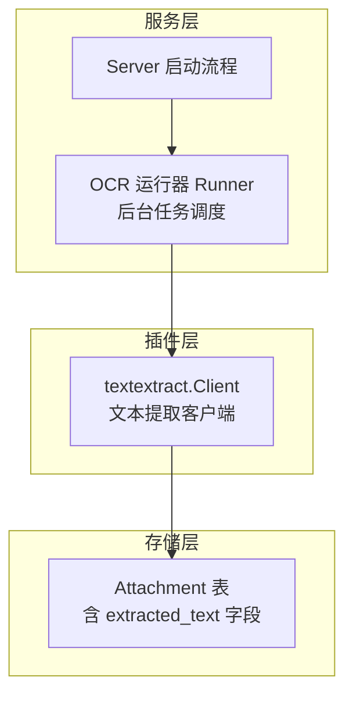
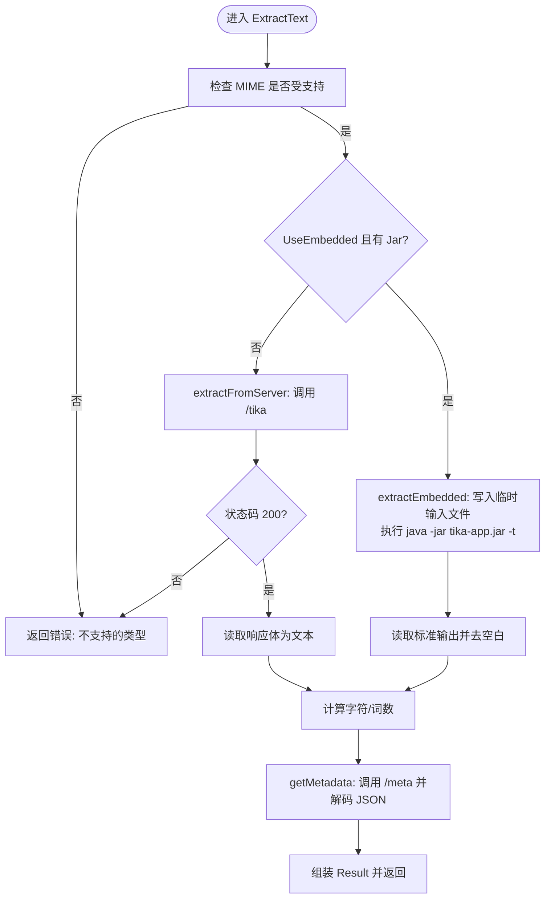
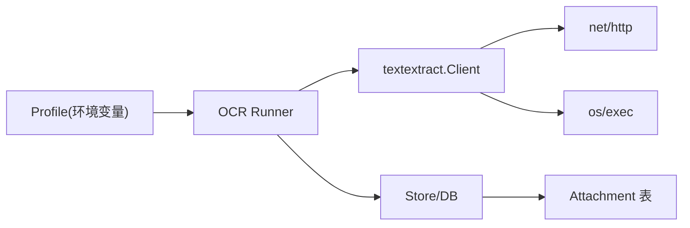

# 文本提取插件

<cite>
**本文引用的文件**
- [plugin/textextract/tika.go](file://plugin/textextract/tika.go)
- [plugin/textextract/tika_test.go](file://plugin/textextract/tika_test.go)
- [internal/profile/profile.go](file://internal/profile/profile.go)
- [server/runner/ocr/runner.go](file://server/runner/ocr/runner.go)
- [server/server.go](file://server/server.go)
- [store/attachment.go](file://store/attachment.go)
- [store/migration/postgres/LATEST.sql](file://store/migration/postgres/LATEST.sql)
- [plugin/ocr/tesseract.go](file://plugin/ocr/tesseract.go)
</cite>

## 目录
1. [简介](#简介)
2. [项目结构](#项目结构)
3. [核心组件](#核心组件)
4. [架构总览](#架构总览)
5. [详细组件分析](#详细组件分析)
6. [依赖关系分析](#依赖关系分析)
7. [性能考虑](#性能考虑)
8. [故障排查指南](#故障排查指南)
9. [结论](#结论)
10. [附录：使用示例与配置](#附录使用示例与配置)

## 简介
本文件系统性介绍 Memos 中的“文本提取插件”，重点说明其基于 Apache Tika 的文档解析能力，涵盖以下方面：
- 多格式支持：PDF、Office 文档、RTF、纯文本等
- 元数据提取与纯文本转换
- 文件类型检测、编码识别与字符集处理
- 大文件处理、流式读取与内存优化策略
- 准确性控制、格式标准化与特殊字符处理
- 使用示例、配置参数与性能优化建议
- 插件扩展与自定义解析器集成指导

## 项目结构
文本提取插件位于 plugin/textextract 包，核心实现为 Tika 客户端；在服务启动阶段由 OCR 运行器统一调度，将提取结果持久化至附件表。



图示来源
- [server/server.go](file://server/server.go#L164-L175)
- [server/runner/ocr/runner.go](file://server/runner/ocr/runner.go#L29-L70)
- [plugin/textextract/tika.go](file://plugin/textextract/tika.go#L87-L105)
- [store/attachment.go](file://store/attachment.go#L39-L49)

章节来源
- [plugin/textextract/tika.go](file://plugin/textextract/tika.go#L1-L120)
- [server/runner/ocr/runner.go](file://server/runner/ocr/runner.go#L1-L70)
- [server/server.go](file://server/server.go#L164-L175)
- [store/attachment.go](file://store/attachment.go#L39-L49)

## 核心组件
- 配置 Config：支持 Tika 服务器地址、嵌入模式（tika-app.jar）、Java 可执行路径、超时、是否启用嵌入模式等
- 客户端 Client：封装 HTTP 请求与嵌入式命令执行，负责文本提取与元数据获取
- 结果 Result：包含纯文本、元数据、统计信息（字数、词数、大小）及常用字段（作者、标题、创建/修改时间、页数）
- 运行器 Runner：周期性扫描附件，按类型分发给 OCR 或文本提取插件，并写回数据库
- 配置加载 Profile：从环境变量读取开关与默认值，如 MEMOS_TEXTEXTRACT_ENABLED、MEMOS_TEXTEXTRACT_TIKA_URL 等

章节来源
- [plugin/textextract/tika.go](file://plugin/textextract/tika.go#L37-L105)
- [plugin/textextract/tika.go](file://plugin/textextract/tika.go#L107-L119)
- [server/runner/ocr/runner.go](file://server/runner/ocr/runner.go#L17-L27)
- [internal/profile/profile.go](file://internal/profile/profile.go#L14-L57)

## 架构总览
文本提取在服务启动后由 OCR 运行器驱动，根据附件 MIME 类型判断是否需要处理；若启用文本提取，则通过 textextract.Client 调用 Tika 服务或嵌入式 Java 进程，完成纯文本与元数据提取，并更新附件表的 extracted_text 字段。

```mermaid
sequenceDiagram
participant S as "Server"
participant R as "OCR Runner"
participant C as "textextract.Client"
participant T as "Tika 服务/嵌入式进程"
participant DB as "Store/DB"
S->>R : 初始化并启动
R->>DB : 查询待处理附件
R->>C : 对文档类型调用 ExtractText
alt 使用 Tika 服务
C->>T : PUT /tika (二进制内容)
T-->>C : text/plain
C->>T : PUT /meta (二进制内容)
T-->>C : application/json(元数据)
else 使用嵌入式模式
C->>T : java -jar tika-app.jar -t <input>
T-->>C : text/plain
end
C-->>R : 返回 Result(文本+元数据)
R->>DB : 更新附件.extraced_text
```



图示来源
- [server/server.go](file://server/server.go#L164-L175)
- [server/runner/ocr/runner.go](file://server/runner/ocr/runner.go#L150-L254)
- [plugin/textextract/tika.go](file://plugin/textextract/tika.go#L121-L195)
- [plugin/textextract/tika.go](file://plugin/textextract/tika.go#L197-L246)
- [plugin/textextract/tika.go](file://plugin/textextract/tika.go#L248-L287)

## 详细组件分析

### 文本提取客户端 Client
- 功能职责
  - 支持服务器模式与嵌入式模式双通道
  - 自动探测 MIME 类型（扩展名优先，其次按内容嗅探）
  - 提取纯文本与元数据（标题、作者、创建/修改时间、页数等）
  - 计算字符数与词数，支持摘要截断
  - 自定义 JSON 序列化，输出 size_bytes
- 关键流程
  - ExtractText：校验支持类型 → 选择嵌入式或服务器 → 提取文本 → 获取元数据 → 统计信息
  - extractEmbedded：临时文件写入 → 调用 java -jar tika-app.jar -t → 读取标准输出
  - getMetadata：向 /meta 发送二进制内容，解码 JSON 并归一化为字符串映射
  - detectContentType：优先 mime.TypeByExtension，否则 http.DetectContentType



图示来源
- [plugin/textextract/tika.go](file://plugin/textextract/tika.go#L121-L195)
- [plugin/textextract/tika.go](file://plugin/textextract/tika.go#L197-L246)
- [plugin/textextract/tika.go](file://plugin/textextract/tika.go#L248-L287)

章节来源
- [plugin/textextract/tika.go](file://plugin/textextract/tika.go#L121-L287)

### 配置与环境变量
- 默认配置
  - TikaServerURL: http://localhost:9998
  - TikaJarPath: 空（禁用嵌入式）
  - JavaPath: java
  - Timeout: 30s
  - UseEmbedded: false
- 环境变量覆盖
  - MEMOS_TEXTEXTRACT_TIKA_URL
  - MEMOS_TEXTEXTRACT_TIKA_JAR
  - MEMOS_TEXTEXTRACT_JAVA_PATH
  - MEMOS_TEXTEXTRACT_TIMEOUT
  - MEMOS_TEXTEXTRACT_EMBEDDED
- 服务侧开关
  - MEMOS_TEXTEXTRACT_ENABLED：控制是否启用文本提取功能

章节来源
- [plugin/textextract/tika.go](file://plugin/textextract/tika.go#L51-L85)
- [internal/profile/profile.go](file://internal/profile/profile.go#L50-L57)
- [internal/profile/profile.go](file://internal/profile/profile.go#L92-L99)

### 运行器 Runner：调度与持久化
- 启动条件：当 OCREnabled 或 TextExtractEnabled 任一为真时启动
- 扫描策略：查找未处理过的附件（extracted_text 与 ocr_text 均为空），并按 MIME 类型判断是否需要处理
- 处理流程：对文档类型调用 textextract.Client.ExtractText，成功则写回附件表的 extracted_text 字段
- 并发控制：异步处理使用信号量限制最大并发，避免资源争用

```mermaid
classDiagram
class Runner {
-store : Store
-ocrClient : ocr.Client
-textExtractClient : textextract.Client
-interval : Duration
-batchSize : int
-ocrEnabled : bool
-textExtractEnabled : bool
-semaphore : chan struct{}
+Run(ctx)
+RunOnce(ctx)
+ProcessAttachmentAsync(ctx, id)
-findPendingAttachments(ctx) []*Attachment
-needsProcessing(mime) bool
-processAttachment(ctx, att) error
}
class Client {
+ExtractText(ctx, data, mime) *Result
+ExtractTextFromFile(ctx, path) *Result
+IsSupported(mime) bool
+IsAvailable(ctx) bool
}
Runner --> Client : "调用文本提取"
```

图示来源
- [server/runner/ocr/runner.go](file://server/runner/ocr/runner.go#L17-L27)
- [server/runner/ocr/runner.go](file://server/runner/ocr/runner.go#L150-L254)
- [plugin/textextract/tika.go](file://plugin/textextract/tika.go#L87-L105)

章节来源
- [server/runner/ocr/runner.go](file://server/runner/ocr/runner.go#L1-L303)

### 存储模型与索引
- 附件表新增字段
  - extracted_text：来自 Tika 的纯文本
  - ocr_text：来自 OCR 的文本
- 全文检索索引
  - 在 PostgreSQL 中对 extracted_text 与 ocr_text 的拼接建立 GIN 索引，便于检索

章节来源
- [store/attachment.go](file://store/attachment.go#L39-L49)
- [store/migration/postgres/LATEST.sql](file://store/migration/postgres/LATEST.sql#L76-L77)
- [store/migration/postgres/LATEST.sql](file://store/migration/postgres/LATEST.sql#L86)

### 测试要点与行为验证
- 默认配置与环境变量覆盖
- MIME 类型支持列表与大小写不敏感匹配
- 文档类型检测（pdf/word/excel/powerpoint/text/unknown）
- 统计计算（字符数、词数）
- 摘要截断（按词边界）
- 多结果合并（文本拼接、元数据去重保留）

章节来源
- [plugin/textextract/tika_test.go](file://plugin/textextract/tika_test.go#L11-L280)

## 依赖关系分析
- 组件耦合
  - Runner 依赖 textextract.Client 与 store 层接口
  - textextract.Client 依赖 net/http、os/exec、mime、encoding/json 等标准库
- 外部依赖
  - Tika 服务（HTTP 接口）或 tika-app.jar（嵌入式）
  - Java 运行时（嵌入式模式）
- 潜在循环依赖
  - 未见直接循环；插件层仅被服务层调用



图示来源
- [internal/profile/profile.go](file://internal/profile/profile.go#L92-L99)
- [server/runner/ocr/runner.go](file://server/runner/ocr/runner.go#L29-L70)
- [plugin/textextract/tika.go](file://plugin/textextract/tika.go#L5-L21)

章节来源
- [internal/profile/profile.go](file://internal/profile/profile.go#L92-L99)
- [server/runner/ocr/runner.go](file://server/runner/ocr/runner.go#L29-L70)
- [plugin/textextract/tika.go](file://plugin/textextract/tika.go#L5-L21)

## 性能考虑
- 大文件与内存优化
  - 服务器模式：直接以二进制流发送到 /tika，避免额外拷贝
  - 嵌入式模式：通过临时文件传递，注意磁盘 IO 与清理
  - 建议：优先使用 Tika 服务，减少本地 JVM 启动开销
- 并发与批处理
  - Runner 使用固定批次大小与并发信号量，避免瞬时高负载
  - 建议：根据硬件资源调整 Runner 的 interval、batchSize 与信号量上限
- 超时控制
  - 客户端 http.Client 超时可由 MEMOS_TEXTEXTRACT_TIMEOUT 设置
  - 建议：对大文档适当提高超时，避免误判失败
- 索引与检索
  - PostgreSQL 已对 extracted_text/ocr_text 建立 GIN 索引，提升检索效率
  - 建议：定期维护索引，监控查询性能

[本节为通用性能建议，无需特定文件引用]

## 故障排查指南
- 无法连接 Tika 服务
  - 现象：extractFromServer 报错或回落到嵌入式模式
  - 排查：确认 MEMOS_TEXTEXTRACT_TIKA_URL 正确；检查网络连通性；查看日志警告
- 嵌入式模式失败
  - 现象：extractEmbedded 返回错误，stderr 日志提示
  - 排查：确认 MEMOS_TEXTEXTRACT_JAVA_PATH 与 MEMOS_TEXTEXTRACT_TIKA_JAR；确保 Java 可执行与 tika-app.jar 存在
- 不支持的 MIME 类型
  - 现象：ExtractText 返回错误
  - 排查：确认 content-type 是否在 SupportedMimeTypes 列表中
- 元数据缺失
  - 现象：Result 中作者/标题/页数等为空
  - 排查：确认 /meta 接口可用；检查 Tika 版本与文档属性
- 并发与超时
  - 现象：异步处理被跳过或超时
  - 排查：检查 Runner 的信号量与上下文超时设置

章节来源
- [plugin/textextract/tika.go](file://plugin/textextract/tika.go#L134-L195)
- [plugin/textextract/tika.go](file://plugin/textextract/tika.go#L197-L246)
- [plugin/textextract/tika.go](file://plugin/textextract/tika.go#L248-L287)
- [server/runner/ocr/runner.go](file://server/runner/ocr/runner.go#L256-L292)

## 结论
该文本提取插件通过统一的 Client 封装，实现了对多格式文档的纯文本与元数据提取，并与 OCR 运行器协同工作，自动将结果持久化到附件表，为全文检索提供基础。通过服务器/嵌入式双通道、合理的并发与批处理策略，以及完善的配置与环境变量支持，能够在不同部署环境下稳定运行。

[本节为总结性内容，无需特定文件引用]

## 附录：使用示例与配置

### 使用示例
- 服务器模式
  - 设置 MEMOS_TEXTEXTRACT_TIKA_URL=http://tika-host:9998
  - 启用 MEMOS_TEXTEXTRACT_ENABLED=true
  - 上传支持的文档类型，等待 OCR 运行器扫描并提取
- 嵌入式模式
  - 设置 MEMOS_TEXTEXTRACT_TIKA_JAR=/path/to/tika-app.jar
  - 设置 MEMOS_TEXTEXTRACT_JAVA_PATH=/path/to/java
  - 可选设置 MEMOS_TEXTEXTRACT_EMBEDDED=true

章节来源
- [internal/profile/profile.go](file://internal/profile/profile.go#L92-L99)
- [server/server.go](file://server/server.go#L164-L175)
- [server/runner/ocr/runner.go](file://server/runner/ocr/runner.go#L52-L58)

### 配置参数一览
- MEMOS_TEXTEXTRACT_ENABLED：是否启用文本提取（默认 false）
- MEMOS_TEXTEXTRACT_TIKA_URL：Tika 服务地址（默认 http://localhost:9998）
- MEMOS_TEXTEXTRACT_TIKA_JAR：tika-app.jar 路径（嵌入式模式）
- MEMOS_TEXTEXTRACT_JAVA_PATH：Java 可执行路径（默认 java）
- MEMOS_TEXTEXTRACT_TIMEOUT：HTTP 超时（如 60s）
- MEMOS_TEXTEXTRACT_EMBEDDED：是否启用嵌入式模式（true/1 开启）

章节来源
- [internal/profile/profile.go](file://internal/profile/profile.go#L50-L57)
- [internal/profile/profile.go](file://internal/profile/profile.go#L92-L99)
- [plugin/textextract/tika.go](file://plugin/textextract/tika.go#L62-L85)

### 支持的 MIME 类型
- application/pdf
- application/msword
- application/vnd.openxmlformats-officedocument.wordprocessingml.document
- application/vnd.ms-excel
- application/vnd.openxmlformats-officedocument.spreadsheetml.sheet
- application/vnd.ms-powerpoint
- application/vnd.openxmlformats-officedocument.presentationml.presentation
- application/rtf
- text/plain
- text/rtf

章节来源
- [plugin/textextract/tika.go](file://plugin/textextract/tika.go#L23-L35)

### 扩展开发与自定义解析器集成
- 新增解析器
  - 在插件层新增一个解析器包，实现与 textextract.Client 类似的接口（如 ExtractText、IsSupported）
  - 在 Runner.needsProcessing 中增加对新类型的判断
  - 在 Runner.processAttachment 中添加分支，调用新解析器并将结果写回附件表
- 元数据标准化
  - 建议统一返回字段（作者、标题、创建/修改时间、页数等），并在 Runner 中进行合并与去重
- 错误处理与日志
  - 对外部调用（HTTP/子进程）增加日志记录与降级策略，避免影响整体流程
- 性能优化
  - 优先使用流式处理与批处理；合理设置超时与并发；对大文档采用服务器模式

章节来源
- [server/runner/ocr/runner.go](file://server/runner/ocr/runner.go#L180-L201)
- [server/runner/ocr/runner.go](file://server/runner/ocr/runner.go#L235-L244)
- [plugin/textextract/tika.go](file://plugin/textextract/tika.go#L107-L119)