# 邮件插件

<cite>
**本文档引用的文件**
- [doc.go](file://plugin/email/doc.go)
- [config.go](file://plugin/email/config.go)
- [client.go](file://plugin/email/client.go)
- [email.go](file://plugin/email/email.go)
- [message.go](file://plugin/email/message.go)
- [config_test.go](file://plugin/email/config_test.go)
- [client_test.go](file://plugin/email/client_test.go)
- [email_test.go](file://plugin/email/email_test.go)
- [message_test.go](file://plugin/email/message_test.go)
- [README.md](file://plugin/email/README.md)
</cite>

## 目录
1. [简介](#简介)
2. [项目结构](#项目结构)
3. [核心组件](#核心组件)
4. [架构概览](#架构概览)
5. [详细组件分析](#详细组件分析)
6. [依赖关系分析](#依赖关系分析)
7. [性能考虑](#性能考虑)
8. [故障排除指南](#故障排除指南)
9. [扩展开发指南](#扩展开发指南)
10. [结论](#结论)

## 简介

邮件插件为自托管的 Memos 实例提供 SMTP 邮件发送功能。该插件遵循行业标准的 SMTP 协议，支持 TLS/STARTTLS 和 SSL/TLS 加密，能够发送纯文本和 HTML 格式的邮件，并支持多个收件人（To、Cc、Bcc）。该插件设计用于自托管环境，由实例管理员配置自己的邮件服务提供商。

## 项目结构

邮件插件采用简洁的分层架构，主要包含以下文件：

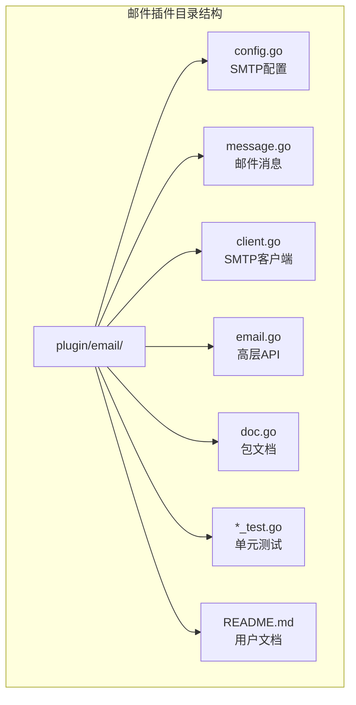

**图表来源**
- [config.go](file://plugin/email/config.go#L1-L48)
- [message.go](file://plugin/email/message.go#L1-L92)
- [client.go](file://plugin/email/client.go#L1-L144)
- [email.go](file://plugin/email/email.go#L1-L44)

**章节来源**
- [README.md](file://plugin/email/README.md#L466-L476)

## 核心组件

邮件插件的核心组件包括配置管理、消息格式化、SMTP 客户端和高层 API 接口。

### 配置管理组件

配置组件负责管理 SMTP 连接参数和验证逻辑：

- **SMTPHost**: SMTP 服务器主机名
- **SMTPPort**: SMTP 服务器端口号
- **SMTPUsername**: SMTP 认证用户名
- **SMTPPassword**: SMTP 认证密码
- **FromEmail**: 发件人邮箱地址
- **FromName**: 发件人显示名称
- **UseTLS**: 启用 STARTTLS 加密
- **UseSSL**: 启用 SSL/TLS 加密

### 消息组件

消息组件负责邮件内容的构建和格式化：

- **To**: 收件人邮箱列表
- **Cc**: 抄送邮箱列表
- **Bcc**: 密送邮箱列表
- **Subject**: 邮件主题
- **Body**: 邮件正文内容
- **IsHTML**: 是否为 HTML 格式
- **ReplyTo**: 回复地址

### 客户端组件

客户端组件封装了 SMTP 连接和发送逻辑，支持两种加密模式：
- **TLS 模式**: 使用 STARTTLS (端口 587)
- **SSL 模式**: 使用 SSL/TLS (端口 465)

**章节来源**
- [config.go](file://plugin/email/config.go#L9-L28)
- [message.go](file://plugin/email/message.go#L10-L19)
- [client.go](file://plugin/email/client.go#L10-L20)

## 架构概览

邮件插件采用分层架构设计，确保了清晰的关注点分离：

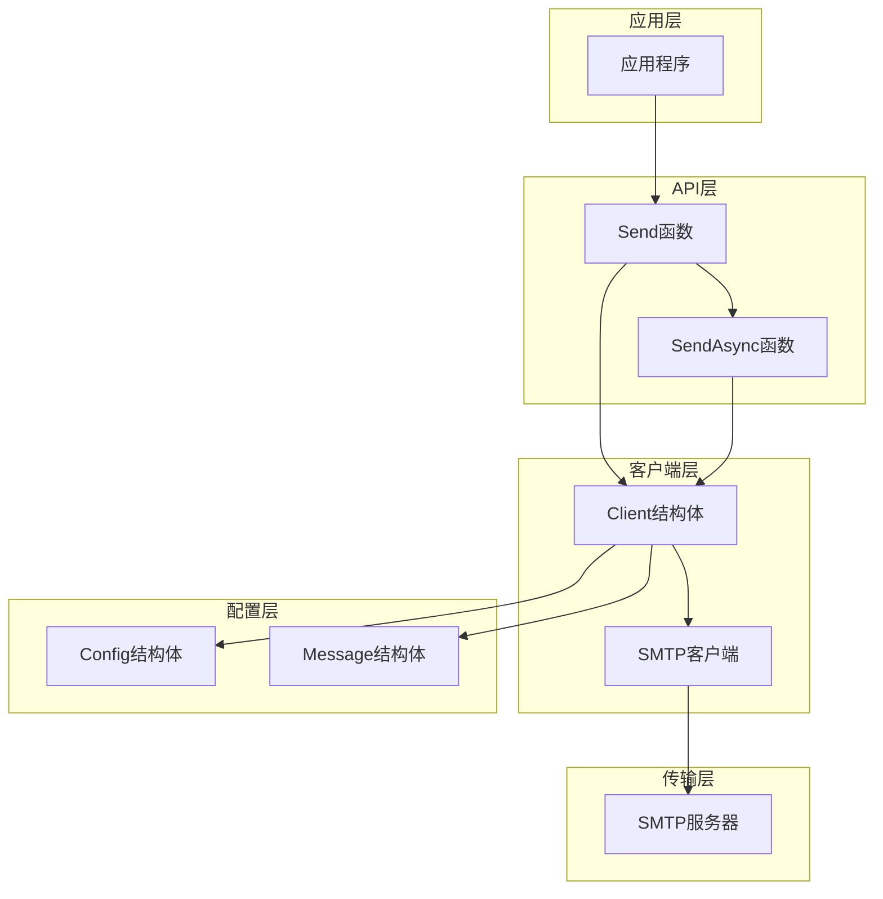

**图表来源**
- [email.go](file://plugin/email/email.go#L9-L21)
- [client.go](file://plugin/email/client.go#L46-L75)
- [config.go](file://plugin/email/config.go#L11-L28)

## 详细组件分析

### 配置验证机制

配置验证确保所有必需的 SMTP 参数都已正确设置：

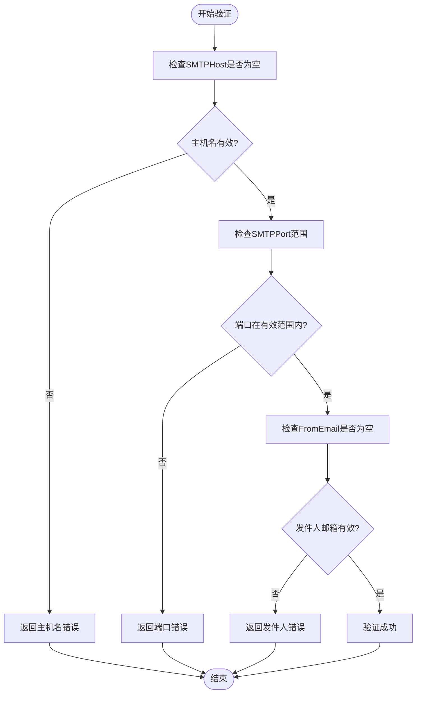

**图表来源**
- [config.go](file://plugin/email/config.go#L31-L42)

配置验证规则：
- SMTP 主机名必须非空
- 端口号必须在 1-65535 范围内
- 发件人邮箱必须非空

**章节来源**
- [config.go](file://plugin/email/config.go#L30-L47)

### 消息格式化系统

消息格式化系统实现了 RFC 5322 标准的邮件格式：

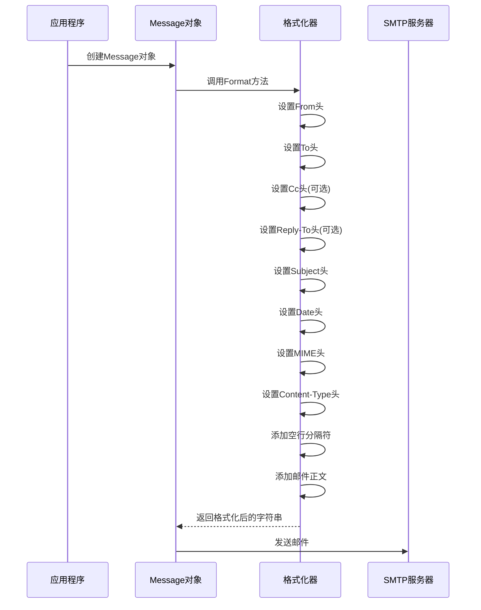

**图表来源**
- [message.go](file://plugin/email/message.go#L35-L82)

格式化特性：
- 支持纯文本和 HTML 格式
- 自动添加必要的 MIME 头部
- 支持多收件人格式化
- 遵循 RFC 5322 标准

**章节来源**
- [message.go](file://plugin/email/message.go#L35-L82)

### SMTP 客户端实现

SMTP 客户端支持两种加密模式：

#### TLS 模式 (推荐)
- 使用端口 587
- 支持 STARTTLS 加密
- 适用于大多数现代邮件服务提供商

#### SSL 模式
- 使用端口 465
- 全链路 SSL/TLS 加密
- 适用于特定的邮件服务提供商

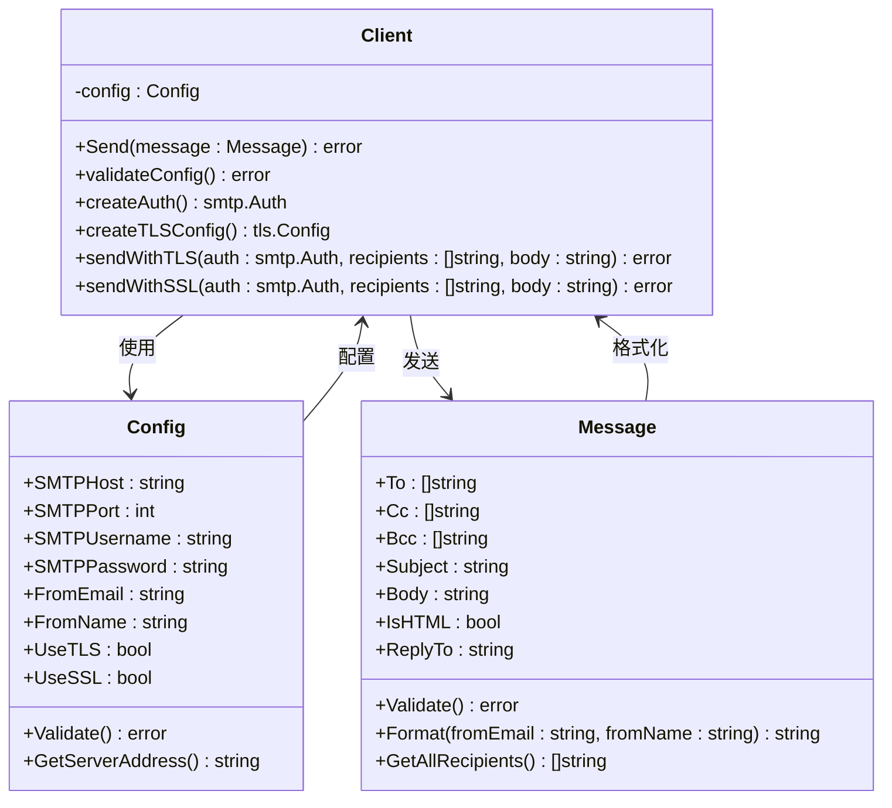

**图表来源**
- [client.go](file://plugin/email/client.go#L10-L20)
- [config.go](file://plugin/email/config.go#L9-L28)
- [message.go](file://plugin/email/message.go#L10-L19)

**章节来源**
- [client.go](file://plugin/email/client.go#L46-L143)

### 异步发送机制

异步发送通过 goroutine 实现非阻塞邮件发送：

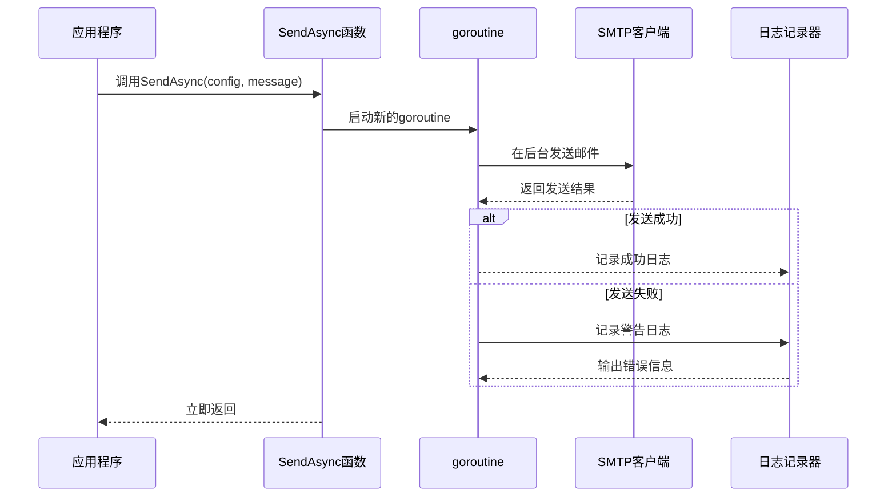

**图表来源**
- [email.go](file://plugin/email/email.go#L23-L43)

异步发送特点：
- 不阻塞主线程执行
- 自动错误处理和日志记录
- 支持高并发场景

**章节来源**
- [email.go](file://plugin/email/email.go#L23-L43)

## 依赖关系分析

邮件插件的依赖关系相对简单，主要依赖于 Go 标准库：

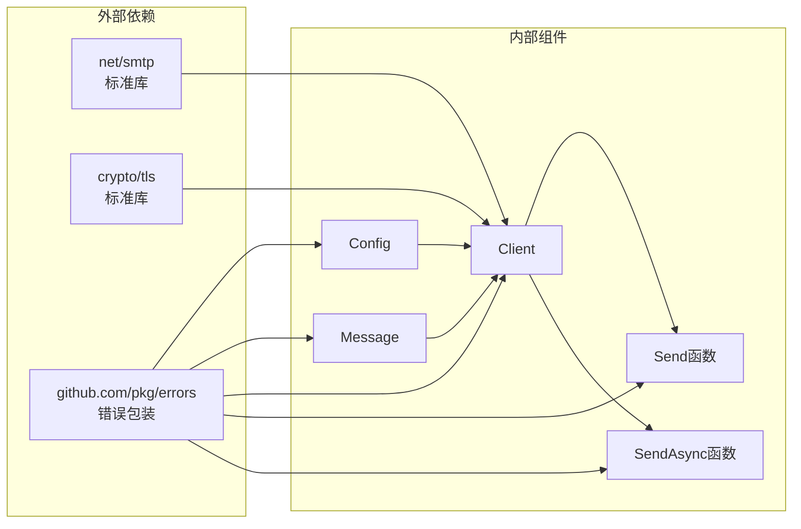

**图表来源**
- [client.go](file://plugin/email/client.go#L3-L8)
- [email.go](file://plugin/email/email.go#L3-L7)

依赖关系特点：
- 最小化外部依赖
- 仅使用 Go 标准库
- 错误处理使用第三方库增强

**章节来源**
- [client.go](file://plugin/email/client.go#L3-L8)
- [email.go](file://plugin/email/email.go#L3-L7)

## 性能考虑

### 连接管理
- 当前实现每次发送都建立新的 SMTP 连接
- 对于高并发场景建议实现连接池
- 可以考虑复用连接减少握手开销

### 内存使用
- 使用 strings.Builder 进行字符串拼接
- 避免不必要的字符串复制
- 合理控制邮件大小限制

### 并发处理
- 异步发送支持高并发
- 建议实现发送速率限制
- 考虑实现背压机制防止过载

## 故障排除指南

### 常见配置错误

| 错误类型 | 错误信息 | 解决方案 |
|---------|---------|---------|
| 配置验证错误 | "SMTP host is required" | 设置正确的 SMTP 主机名 |
| 配置验证错误 | "SMTP port must be between 1 and 65535" | 设置有效的端口号 (587 或 465) |
| 配置验证错误 | "from email is required" | 设置发件人邮箱地址 |
| 消息验证错误 | "at least one recipient is required" | 添加至少一个收件人 |
| 消息验证错误 | "subject is required" | 设置邮件主题 |
| 消息验证错误 | "body is required" | 设置邮件正文 |

### 连接问题诊断

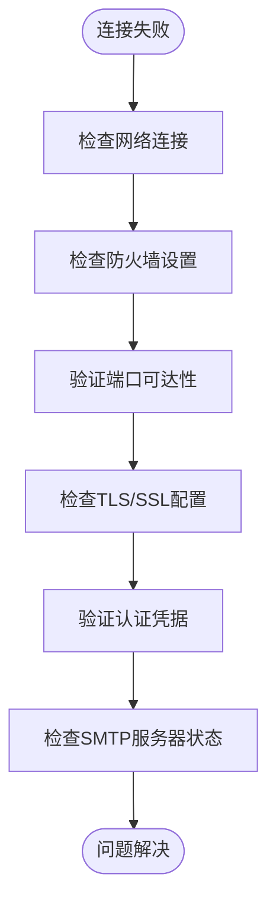

**章节来源**
- [README.md](file://plugin/email/README.md#L371-L397)

### 错误分类和处理

插件提供详细的错误分类：

1. **配置错误**: SMTP 主机、端口、凭据配置问题
2. **消息错误**: 邮件内容格式问题
3. **认证错误**: 用户名密码不正确
4. **连接错误**: 网络连接问题
5. **协议错误**: SMTP 协议交互问题

**章节来源**
- [README.md](file://plugin/email/README.md#L336-L369)

## 扩展开发指南

### 当前限制和未来规划

根据 README 文档，当前版本缺少以下功能，但已在路线图中规划：

#### 已规划功能
- [ ] 邮件模板系统
- [ ] 附件支持
- [ ] 内联图像嵌入
- [ ] 邮件队列系统
- [ ] 交付状态跟踪
- [ ] 退信处理

#### 建议的扩展架构

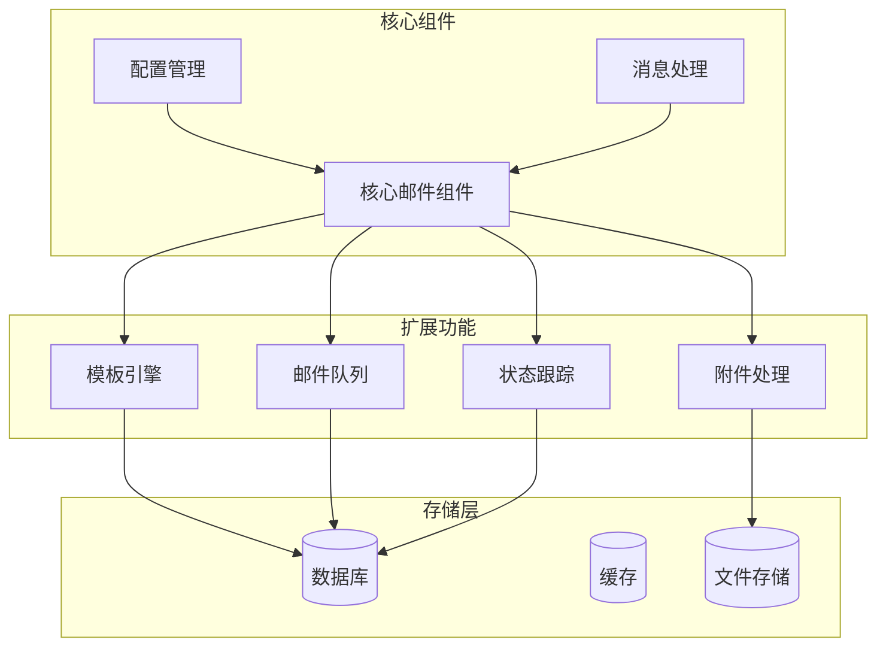

### 模板系统设计

建议的模板系统架构：

```mermaid
classDiagram
class TemplateEngine {
+Render(template : Template, data : map[string]interface{}) string
+LoadTemplate(name : string) Template
+AddTemplate(name : string, content : string)
}
class Template {
+Name : string
+Subject : string
+Body : string
+Type : TemplateType
+Variables : []string
}
class TemplateData {
+Values : map[string]interface{}
+Merge(other : TemplateData) TemplateData
}
TemplateEngine --> Template : 管理
Template --> TemplateData : 使用
```

### 队列系统设计

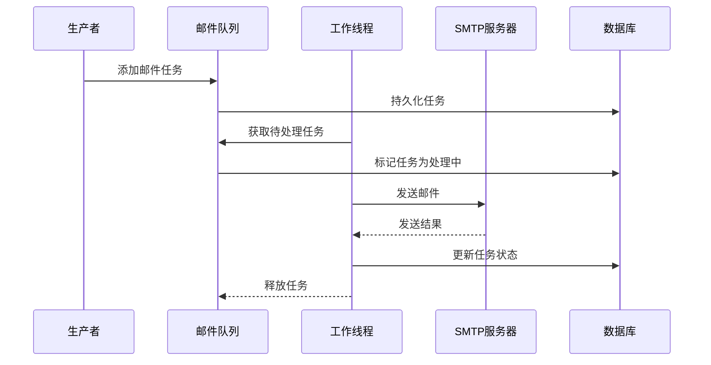

### 附件处理架构

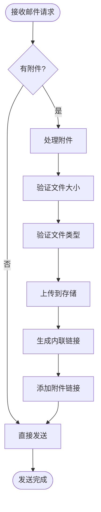

### 扩展开发建议

1. **模块化设计**: 保持现有简洁架构，逐步添加功能模块
2. **向后兼容**: 新功能不影响现有 API
3. **配置驱动**: 通过配置启用/禁用新功能
4. **测试覆盖**: 为每个新功能编写单元测试
5. **性能监控**: 添加性能指标和监控

**章节来源**
- [README.md](file://plugin/email/README.md#L498-L507)

## 结论

邮件插件提供了简洁而强大的 SMTP 邮件发送功能，具有以下优势：

### 现有功能优势
- **简洁设计**: 代码结构清晰，易于理解和维护
- **标准兼容**: 完全符合 SMTP 标准和 RFC 5322
- **安全默认**: 默认使用 TLS 加密，支持多种加密模式
- **错误处理**: 提供详细的错误信息和上下文
- **异步支持**: 支持非阻塞邮件发送

### 技术特点
- **最小依赖**: 仅使用 Go 标准库，减少外部依赖风险
- **类型安全**: 完整的 Go 类型系统支持
- **并发友好**: 支持高并发场景
- **测试完善**: 全面的单元测试覆盖

### 发展方向
虽然当前版本功能相对基础，但其简洁的设计为未来的功能扩展奠定了良好基础。建议按照以下优先级进行扩展：
1. 实现邮件模板系统
2. 添加附件处理能力
3. 构建邮件队列系统
4. 集成状态跟踪和退信处理

该插件为 Memos 提供了可靠的邮件基础设施，能够满足大多数自托管实例的邮件需求，同时为未来的功能扩展预留了充足的空间。