# 插件开发指南

<cite>
**本文档引用的文件**
- [plugin/ai/config.go](file://plugin/ai/config.go)
- [plugin/ai/embedding.go](file://plugin/ai/embedding.go)
- [plugin/ai/llm.go](file://plugin/ai/llm.go)
- [plugin/ai/reranker.go](file://plugin/ai/reranker.go)
- [plugin/cron/cron.go](file://plugin/cron/cron.go)
- [plugin/email/client.go](file://plugin/email/client.go)
- [plugin/filter/engine.go](file://plugin/filter/engine.go)
- [plugin/markdown/markdown.go](file://plugin/markdown/markdown.go)
- [plugin/webhook/webhook.go](file://plugin/webhook/webhook.go)
- [plugin/ocr/tesseract.go](file://plugin/ocr/tesseract.go)
- [plugin/textextract/tika.go](file://plugin/textextract/tika.go)
- [plugin/idp/oauth2/oauth2.go](file://plugin/idp/oauth2/oauth2.go)
- [plugin/scheduler/job.go](file://plugin/scheduler/job.go)
- [internal/profile/profile.go](file://internal/profile/profile.go)
</cite>

## 目录
1. [简介](#简介)
2. [项目结构](#项目结构)
3. [核心组件](#核心组件)
4. [架构总览](#架构总览)
5. [详细组件分析](#详细组件分析)
6. [依赖关系分析](#依赖关系分析)
7. [性能考虑](#性能考虑)
8. [故障排查指南](#故障排查指南)
9. [结论](#结论)
10. [附录](#附录)

## 简介
本指南面向希望在本项目中开发与集成插件的开发者，系统阐述插件开发的完整流程与最佳实践，涵盖接口规范、开发环境搭建、项目结构、生命周期管理、依赖注入与资源配置、测试策略、调试技巧、性能监控、打包发布、版本管理与兼容性保障，并提供常见问题与解决方案、模板代码与示例路径。

## 项目结构
插件以“功能域”组织在 plugin 目录下，每个子模块封装独立能力（如 AI、邮件、过滤器、Markdown、OCR、文本提取、Webhook、OAuth2、调度器等）。核心能力通过 internal/profile 提供统一的配置入口，插件按需读取配置并初始化服务。

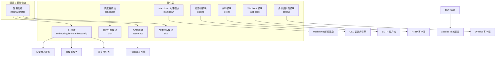

图表来源
- [plugin/ai/config.go](file://plugin/ai/config.go#L1-L129)
- [plugin/ai/embedding.go](file://plugin/ai/embedding.go#L1-L103)
- [plugin/ai/llm.go](file://plugin/ai/llm.go#L1-L326)
- [plugin/ai/reranker.go](file://plugin/ai/reranker.go#L1-L127)
- [plugin/markdown/markdown.go](file://plugin/markdown/markdown.go#L1-L411)
- [plugin/filter/engine.go](file://plugin/filter/engine.go#L1-L192)
- [plugin/email/client.go](file://plugin/email/client.go#L1-L144)
- [plugin/webhook/webhook.go](file://plugin/webhook/webhook.go#L1-L91)
- [plugin/ocr/tesseract.go](file://plugin/ocr/tesseract.go#L1-L410)
- [plugin/textextract/tika.go](file://plugin/textextract/tika.go#L1-L452)
- [plugin/idp/oauth2/oauth2.go](file://plugin/idp/oauth2/oauth2.go#L1-L135)
- [plugin/scheduler/job.go](file://plugin/scheduler/job.go#L1-L59)
- [internal/profile/profile.go](file://internal/profile/profile.go#L1-L153)

章节来源
- [plugin/ai/config.go](file://plugin/ai/config.go#L1-L129)
- [internal/profile/profile.go](file://internal/profile/profile.go#L1-L153)

## 核心组件
- 配置体系：通过 internal/profile 加载环境变量并生成全局配置对象，插件据此初始化各自服务。
- AI 能力：向量嵌入、大模型对话、重排序服务，支持多供应商适配。
- 文档处理：Markdown 解析与渲染、CEL 过滤表达式、OCR 与文本提取。
- 通信与集成：SMTP 邮件发送、Webhook 异步回调、OAuth2 身份交换。
- 定时与调度：基于 cron 的任务调度器，支持作业注册、校验与运行。

章节来源
- [plugin/ai/config.go](file://plugin/ai/config.go#L1-L129)
- [plugin/ai/embedding.go](file://plugin/ai/embedding.go#L1-L103)
- [plugin/ai/llm.go](file://plugin/ai/llm.go#L1-L326)
- [plugin/ai/reranker.go](file://plugin/ai/reranker.go#L1-L127)
- [plugin/markdown/markdown.go](file://plugin/markdown/markdown.go#L1-L411)
- [plugin/filter/engine.go](file://plugin/filter/engine.go#L1-L192)
- [plugin/email/client.go](file://plugin/email/client.go#L1-L144)
- [plugin/webhook/webhook.go](file://plugin/webhook/webhook.go#L1-L91)
- [plugin/ocr/tesseract.go](file://plugin/ocr/tesseract.go#L1-L410)
- [plugin/textextract/tika.go](file://plugin/textextract/tika.go#L1-L452)
- [plugin/idp/oauth2/oauth2.go](file://plugin/idp/oauth2/oauth2.go#L1-L135)
- [plugin/scheduler/job.go](file://plugin/scheduler/job.go#L1-L59)

## 架构总览
插件遵循“配置驱动 + 接口抽象 + 可插拔实现”的设计。插件对外暴露清晰的服务接口，内部通过配置对象决定具体实现（如不同供应商的 API）。典型调用链路如下：

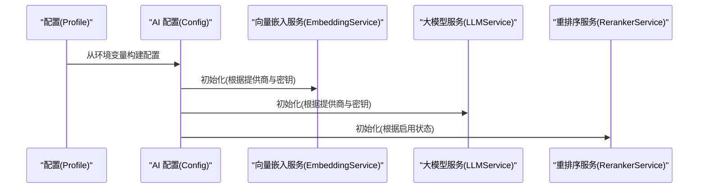

图表来源
- [internal/profile/profile.go](file://internal/profile/profile.go#L1-L153)
- [plugin/ai/config.go](file://plugin/ai/config.go#L1-L129)
- [plugin/ai/embedding.go](file://plugin/ai/embedding.go#L1-L103)
- [plugin/ai/llm.go](file://plugin/ai/llm.go#L1-L326)
- [plugin/ai/reranker.go](file://plugin/ai/reranker.go#L1-L127)

## 详细组件分析

### AI 插件（嵌入、LLM、重排序）
- 配置规范：支持多种提供商（SiliconFlow、OpenAI、DeepSeek、Ollama），包含模型名、API Key、BaseURL、维度、最大 Token、温度等。
- 向量嵌入：批量生成向量，返回固定维度数组；错误处理覆盖空响应与参数缺失。
- 大模型对话：同步与流式对话，支持工具调用（函数式工具描述）；内置超时保护。
- 重排序：可选启用，调用远端 API 返回相关性分数并排序。

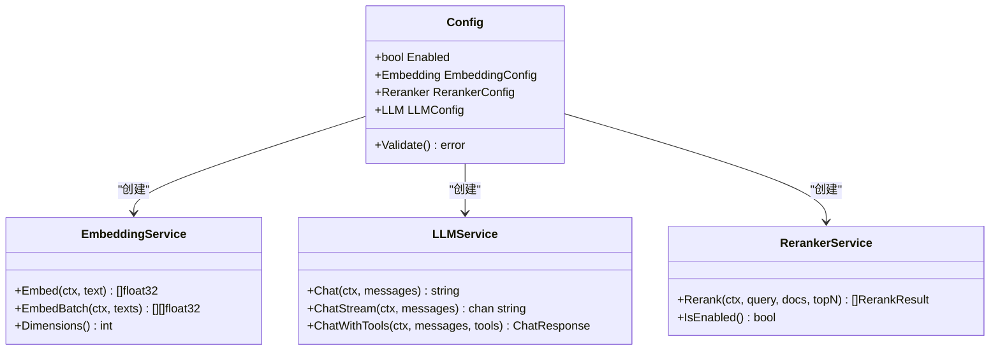

图表来源
- [plugin/ai/config.go](file://plugin/ai/config.go#L1-L129)
- [plugin/ai/embedding.go](file://plugin/ai/embedding.go#L1-L103)
- [plugin/ai/llm.go](file://plugin/ai/llm.go#L1-L326)
- [plugin/ai/reranker.go](file://plugin/ai/reranker.go#L1-L127)

章节来源
- [plugin/ai/config.go](file://plugin/ai/config.go#L1-L129)
- [plugin/ai/embedding.go](file://plugin/ai/embedding.go#L1-L103)
- [plugin/ai/llm.go](file://plugin/ai/llm.go#L1-L326)
- [plugin/ai/reranker.go](file://plugin/ai/reranker.go#L1-L127)

### 定时任务插件（Cron）
- 支持标准 Cron 表达式解析与调度；提供添加、移除、快照查询、启动/停止等操作。
- 内部使用 goroutine 与 channel 协调任务执行，具备 panic 恢复与日志记录。
- 适合周期性批处理、清理、备份等场景。

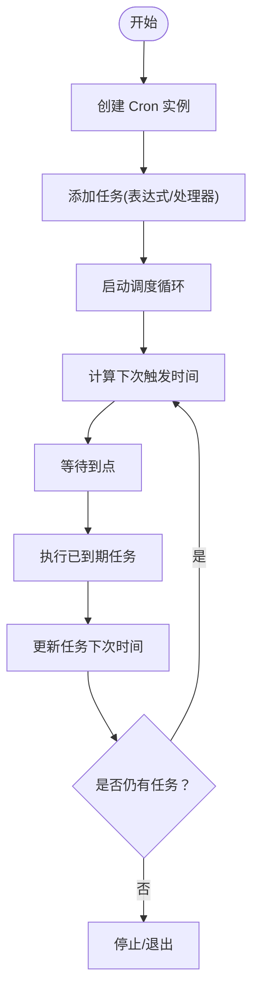

图表来源
- [plugin/cron/cron.go](file://plugin/cron/cron.go#L1-L354)

章节来源
- [plugin/cron/cron.go](file://plugin/cron/cron.go#L1-L354)

### 邮件插件（SMTP）
- 支持 SSL/TLS 与 STARTTLS；可选认证；统一错误包装。
- 发送前进行配置与消息体校验；支持 SSL 与非加密模式（不推荐）。

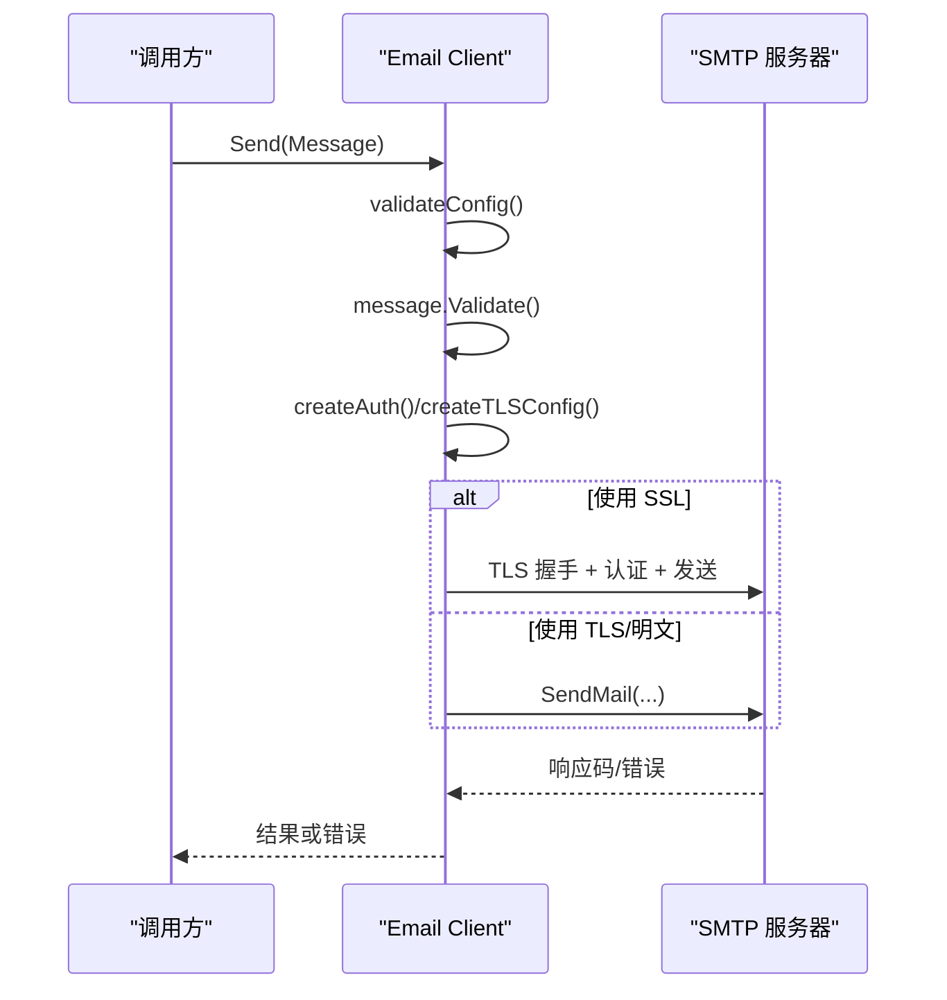

图表来源
- [plugin/email/client.go](file://plugin/email/client.go#L1-L144)

章节来源
- [plugin/email/client.go](file://plugin/email/client.go#L1-L144)

### 过滤器插件（CEL）
- 基于 CEL 将过滤表达式编译为条件树，再渲染为方言特定 SQL 片段。
- 提供默认实例与附件专用实例，支持占位符偏移、禁用空值检查等选项。

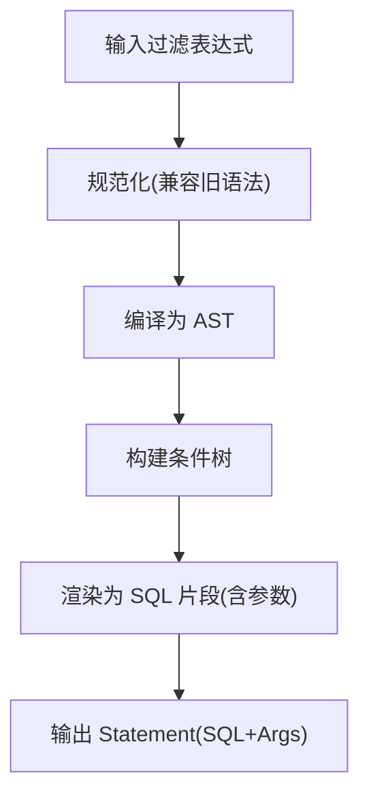

图表来源
- [plugin/filter/engine.go](file://plugin/filter/engine.go#L1-L192)

章节来源
- [plugin/filter/engine.go](file://plugin/filter/engine.go#L1-L192)

### Markdown 处理插件
- 提供标签提取、属性提取（链接/代码/任务列表）、Markdown/HTML 渲染、摘要生成、内容校验、标签重命名等能力。
- 支持可选的 #tag 扩展，单次解析收集多类信息提升效率。

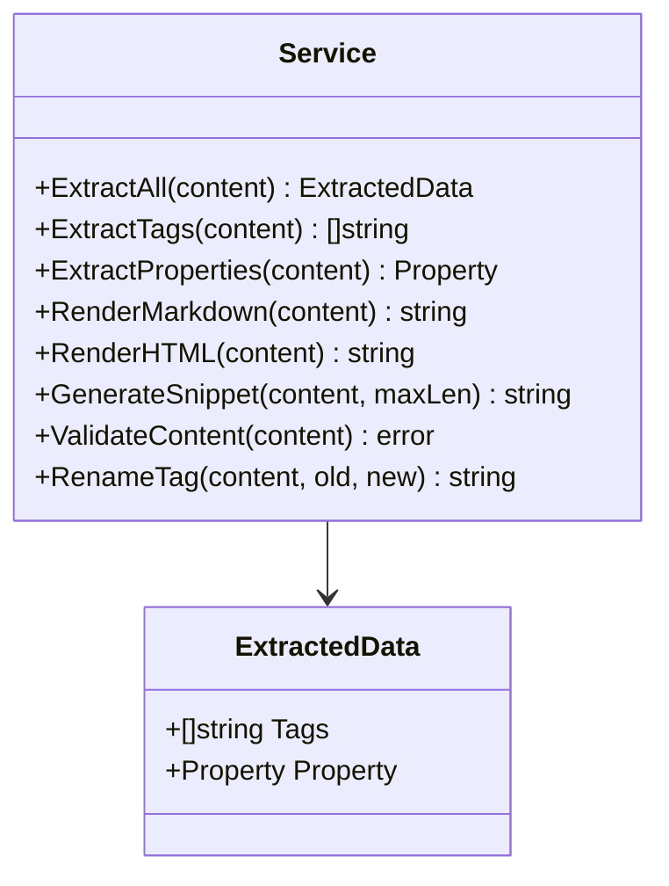

图表来源
- [plugin/markdown/markdown.go](file://plugin/markdown/markdown.go#L1-L411)

章节来源
- [plugin/markdown/markdown.go](file://plugin/markdown/markdown.go#L1-L411)

### Webhook 插件
- 同步与异步两种发送方式；内置超时控制；对响应码与业务返回码进行校验。
- 适用于事件通知、外部系统联动。

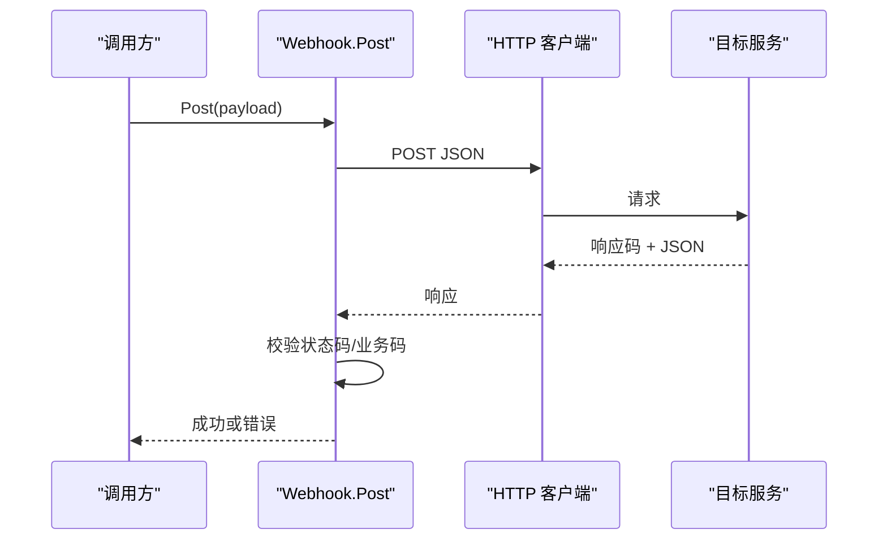

图表来源
- [plugin/webhook/webhook.go](file://plugin/webhook/webhook.go#L1-L91)

章节来源
- [plugin/webhook/webhook.go](file://plugin/webhook/webhook.go#L1-L91)

### OCR 与文本提取插件
- OCR：支持多种图片格式，可配置语言与 tessdata 路径；提供文本与布局信息提取、可用性检测、版本查询、语言列表等。
- 文本提取：支持 PDF/Office/RTF 等，优先使用 Tika 服务，可回退到嵌入式 Java 模式；支持元数据提取与统计。

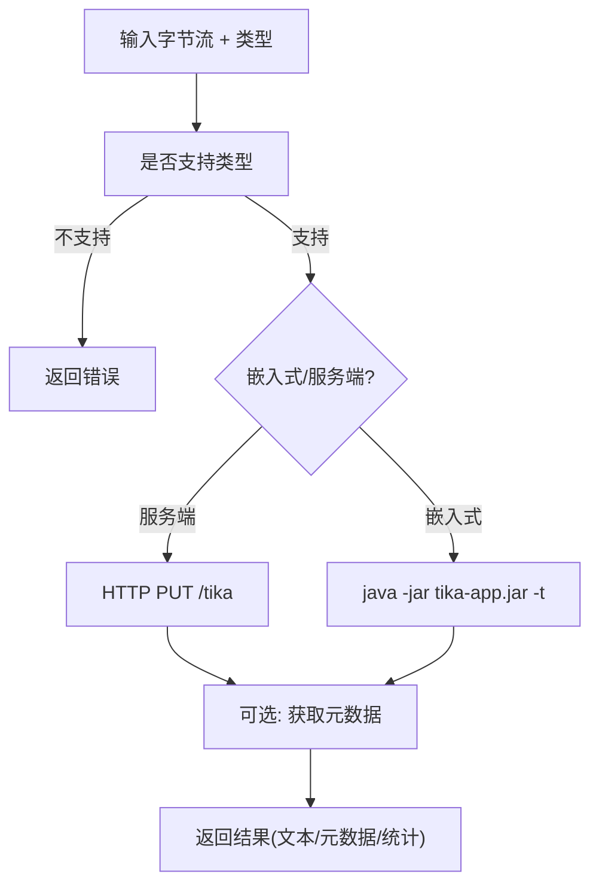

图表来源
- [plugin/ocr/tesseract.go](file://plugin/ocr/tesseract.go#L1-L410)
- [plugin/textextract/tika.go](file://plugin/textextract/tika.go#L1-L452)

章节来源
- [plugin/ocr/tesseract.go](file://plugin/ocr/tesseract.go#L1-L410)
- [plugin/textextract/tika.go](file://plugin/textextract/tika.go#L1-L452)

### 身份提供商插件（OAuth2）
- 校验必填字段；支持 PKCE code_verifier；从用户信息接口映射标识、显示名、邮箱、头像等。

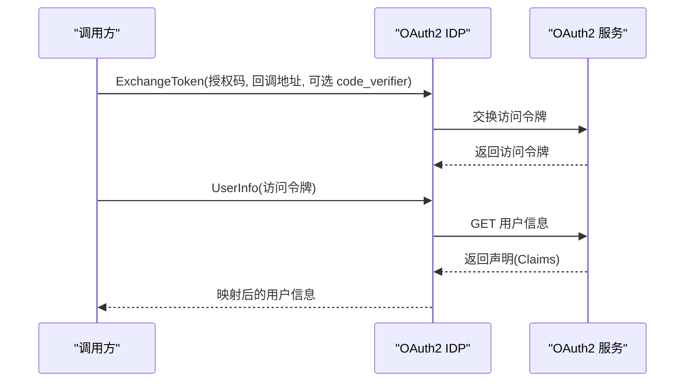

图表来源
- [plugin/idp/oauth2/oauth2.go](file://plugin/idp/oauth2/oauth2.go#L1-L135)

章节来源
- [plugin/idp/oauth2/oauth2.go](file://plugin/idp/oauth2/oauth2.go#L1-L135)

### 调度器插件
- 作业定义包含名称、Cron 表达式、时区、处理器、描述与标签；提供校验确保必要字段有效。
- 与 cron 模块配合，实现稳定的周期性任务管理。

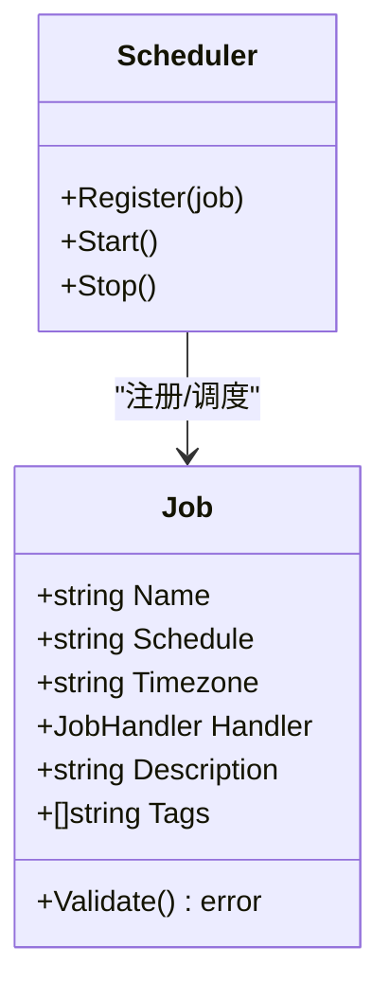

图表来源
- [plugin/scheduler/job.go](file://plugin/scheduler/job.go#L1-L59)
- [plugin/cron/cron.go](file://plugin/cron/cron.go#L1-L354)

章节来源
- [plugin/scheduler/job.go](file://plugin/scheduler/job.go#L1-L59)
- [plugin/cron/cron.go](file://plugin/cron/cron.go#L1-L354)

## 依赖关系分析
- 配置驱动：所有插件均依赖 internal/profile 的配置对象，通过环境变量与默认值组合生成运行时配置。
- 服务接口：AI 插件定义了统一的 EmbeddingService、LLMService、RerankerService 接口，便于替换实现。
- 第三方集成：邮件依赖标准 SMTP 库；OCR/文本提取依赖外部二进制或服务；Webhook 依赖 HTTP 客户端；OAuth2 依赖第三方 OAuth2 服务。
- 并发与资源：定时任务使用 goroutine 与 channel；AI 流式对话使用通道；Webhook 提供异步发送避免阻塞。

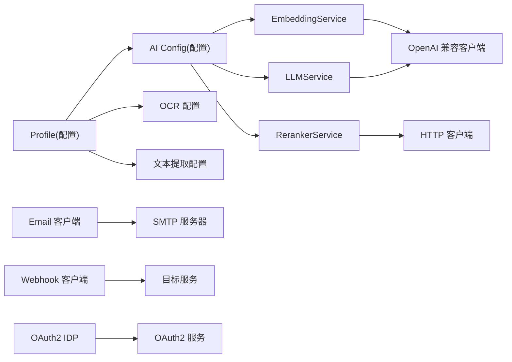

图表来源
- [internal/profile/profile.go](file://internal/profile/profile.go#L1-L153)
- [plugin/ai/config.go](file://plugin/ai/config.go#L1-L129)
- [plugin/ai/embedding.go](file://plugin/ai/embedding.go#L1-L103)
- [plugin/ai/llm.go](file://plugin/ai/llm.go#L1-L326)
- [plugin/ai/reranker.go](file://plugin/ai/reranker.go#L1-L127)
- [plugin/email/client.go](file://plugin/email/client.go#L1-L144)
- [plugin/webhook/webhook.go](file://plugin/webhook/webhook.go#L1-L91)
- [plugin/idp/oauth2/oauth2.go](file://plugin/idp/oauth2/oauth2.go#L1-L135)

章节来源
- [internal/profile/profile.go](file://internal/profile/profile.go#L1-L153)
- [plugin/ai/config.go](file://plugin/ai/config.go#L1-L129)

## 性能考虑
- IO 与网络：AI 与 Webhook 均有超时控制；建议在调用方设置合理的上下文超时，避免阻塞。
- 并发模型：定时任务与流式对话采用 goroutine 与通道，注意背压与资源回收。
- 缓存与批处理：向量嵌入支持批量生成；文本提取与 OCR 可合并多次调用结果。
- 日志与可观测性：各插件均记录关键事件与错误，便于定位性能瓶颈。

## 故障排查指南
- 配置校验失败：检查环境变量是否正确设置，尤其是 API Key 与 BaseURL；AI 配置要求提供商与密钥（除 Ollama 外）。
- 邮件发送失败：确认 SMTP 主机、端口、认证信息与加密方式；查看 SSL/TLS 握手与认证错误。
- OCR/文本提取不可用：检查外部二进制或服务可达性；验证 MIME 类型支持与语言配置。
- Webhook 异步失败：查看异步日志中的错误信息与目标服务返回码。
- OAuth2 交换失败：确认授权码、回调地址、PKCE 参数与声明映射字段。

章节来源
- [plugin/ai/config.go](file://plugin/ai/config.go#L105-L128)
- [plugin/email/client.go](file://plugin/email/client.go#L47-L143)
- [plugin/ocr/tesseract.go](file://plugin/ocr/tesseract.go#L62-L122)
- [plugin/textextract/tika.go](file://plugin/textextract/tika.go#L121-L195)
- [plugin/webhook/webhook.go](file://plugin/webhook/webhook.go#L32-L90)
- [plugin/idp/oauth2/oauth2.go](file://plugin/idp/oauth2/oauth2.go#L43-L78)

## 结论
本项目的插件体系以清晰的接口与配置驱动为核心，既保证了扩展性，又兼顾了易用性与稳定性。遵循本文档的接口规范、生命周期管理与测试策略，可高效地开发与维护各类插件，并确保在生产环境中的可靠运行。

## 附录

### 开发环境搭建与项目结构
- 环境变量：参考配置文件中的键名，设置对应环境变量以启用或配置插件。
- 项目结构：插件位于 plugin/*，配置位于 internal/profile，按功能域划分，便于独立开发与测试。

章节来源
- [internal/profile/profile.go](file://internal/profile/profile.go#L76-L99)

### 生命周期管理与依赖注入
- 初始化：通过配置对象创建插件服务实例。
- 注册：将服务注册到上层模块（如路由、后台任务）。
- 运行：在运行时按需调用服务方法。
- 停止：释放资源，等待未完成任务结束。

章节来源
- [plugin/cron/cron.go](file://plugin/cron/cron.go#L214-L334)
- [plugin/ai/llm.go](file://plugin/ai/llm.go#L198-L269)

### 测试策略与调试技巧
- 单元测试：针对关键函数（如配置校验、消息转换、结果合并）编写测试用例。
- 集成测试：模拟外部服务（如 SMTP、Tika、OAuth2）行为，验证端到端流程。
- 调试：利用日志记录关键步骤与错误；对流式接口使用通道断言；对并发场景使用上下文取消与超时控制。

章节来源
- [plugin/ai/llm.go](file://plugin/ai/llm.go#L106-L128)
- [plugin/webhook/webhook.go](file://plugin/webhook/webhook.go#L78-L90)

### 打包发布、版本管理与兼容性
- 版本管理：通过环境变量控制功能开关与默认值，确保不同部署环境的一致性。
- 兼容性：AI 插件对多家供应商保持 OpenAI 兼容接口；OCR/文本提取支持多种格式与回退机制。
- 发布：遵循 Makefile/脚本进行构建与打包，确保依赖与二进制可用。

章节来源
- [plugin/ai/embedding.go](file://plugin/ai/embedding.go#L33-L49)
- [plugin/ocr/tesseract.go](file://plugin/ocr/tesseract.go#L39-L46)
- [plugin/textextract/tika.go](file://plugin/textextract/tika.go#L51-L60)

### 常见问题与解决方案
- 问题：AI 配置校验失败
  - 方案：检查提供商与密钥是否满足要求；Ollama 可仅配置 BaseURL。
- 问题：邮件发送报错
  - 方案：确认主机、端口、加密方式与认证信息；优先使用 STARTTLS 或 SSL。
- 问题：OCR/文本提取无结果
  - 方案：检查外部二进制或服务可用性；确认 MIME 类型与语言配置。
- 问题：Webhook 未收到响应
  - 方案：检查目标服务返回码与业务码；关注异步日志中的错误。

章节来源
- [plugin/ai/config.go](file://plugin/ai/config.go#L105-L128)
- [plugin/email/client.go](file://plugin/email/client.go#L77-L143)
- [plugin/ocr/tesseract.go](file://plugin/ocr/tesseract.go#L187-L205)
- [plugin/textextract/tika.go](file://plugin/textextract/tika.go#L300-L322)
- [plugin/webhook/webhook.go](file://plugin/webhook/webhook.go#L59-L76)

### 模板代码与示例路径
- AI 配置与服务创建
  - [AI 配置结构与校验](file://plugin/ai/config.go#L9-L128)
  - [向量嵌入服务创建与调用](file://plugin/ai/embedding.go#L29-L98)
  - [大模型服务创建与流式对话](file://plugin/ai/llm.go#L65-L269)
  - [重排序服务创建与调用](file://plugin/ai/reranker.go#L37-L126)
- 定时任务
  - [Cron 实例与任务调度](file://plugin/cron/cron.go#L113-L354)
  - [作业定义与校验](file://plugin/scheduler/job.go#L13-L59)
- 邮件
  - [SMTP 客户端与发送流程](file://plugin/email/client.go#L15-L144)
- 过滤器
  - [CEL 引擎与 SQL 渲染](file://plugin/filter/engine.go#L19-L192)
- Markdown
  - [服务接口与实现](file://plugin/markdown/markdown.go#L26-L411)
- Webhook
  - [同步与异步发送](file://plugin/webhook/webhook.go#L32-L90)
- OCR/文本提取
  - [OCR 客户端与可用性检测](file://plugin/ocr/tesseract.go#L53-L205)
  - [文本提取客户端与元数据获取](file://plugin/textextract/tika.go#L93-L287)
- OAuth2
  - [令牌交换与用户信息获取](file://plugin/idp/oauth2/oauth2.go#L43-L134)