# 插件架构设计

<cite>
**本文档引用的文件**
- [plugin/ai/config.go](file://plugin/ai/config.go)
- [plugin/ai/embedding.go](file://plugin/ai/embedding.go)
- [plugin/ai/llm.go](file://plugin/ai/llm.go)
- [plugin/ai/reranker.go](file://plugin/ai/reranker.go)
- [plugin/cron/cron.go](file://plugin/cron/cron.go)
- [plugin/email/client.go](file://plugin/email/client.go)
- [plugin/filter/engine.go](file://plugin/filter/engine.go)
- [plugin/markdown/markdown.go](file://plugin/markdown/markdown.go)
- [plugin/webhook/webhook.go](file://plugin/webhook/webhook.go)
- [plugin/ocr/tesseract.go](file://plugin/ocr/tesseract.go)
- [plugin/textextract/tika.go](file://plugin/textextract/tika.go)
- [plugin/idp/oauth2/oauth2.go](file://plugin/idp/oauth2/oauth2.go)
- [plugin/scheduler/scheduler.go](file://plugin/scheduler/scheduler.go)
</cite>

## 目录
1. [引言](#引言)
2. [项目结构](#项目结构)
3. [核心组件](#核心组件)
4. [架构总览](#架构总览)
5. [详细组件分析](#详细组件分析)
6. [依赖分析](#依赖分析)
7. [性能考虑](#性能考虑)
8. [故障排查指南](#故障排查指南)
9. [结论](#结论)
10. [附录](#附录)

## 引言
本文件系统化梳理并阐述该代码库中的插件架构设计与实现，覆盖插件接口定义、生命周期管理、依赖注入、加载顺序与初始化流程、资源管理、插件间通信与事件系统、状态共享、安全模型与权限控制、隔离机制、版本管理与兼容性检查、升级策略，以及最佳实践与设计原则。通过对多类插件（AI服务、定时任务、邮件、过滤器、Markdown处理、OCR/Tika、Webhook、身份提供者等）的深入分析，帮助读者快速理解并高效扩展系统能力。

## 项目结构
插件以“功能域”划分在独立目录中，每个插件封装为独立模块，通过清晰的接口对外暴露能力，并在需要时被上层服务或路由层组合使用。主要插件目录如下：
- plugin/ai：向量嵌入、重排序、大模型对话与流式输出
- plugin/cron：通用定时任务调度器
- plugin/email：SMTP邮件发送客户端
- plugin/filter：基于CEL的过滤表达式引擎
- plugin/markdown：Markdown解析、渲染与元数据提取
- plugin/webhook：HTTP Webhook异步通知
- plugin/ocr：OCR文本识别（Tesseract）
- plugin/textextract：文档全文提取（Apache Tika）
- plugin/idp/oauth2：OAuth2身份提供者
- plugin/scheduler：基于时间轮询的作业调度器

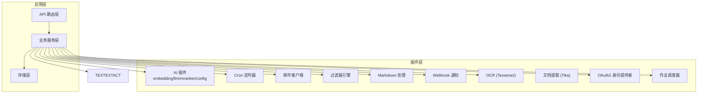

图示来源
- [plugin/ai/config.go](file://plugin/ai/config.go#L1-L129)
- [plugin/ai/embedding.go](file://plugin/ai/embedding.go#L1-L103)
- [plugin/ai/llm.go](file://plugin/ai/llm.go#L1-L326)
- [plugin/ai/reranker.go](file://plugin/ai/reranker.go#L1-L127)
- [plugin/cron/cron.go](file://plugin/cron/cron.go#L1-L354)
- [plugin/email/client.go](file://plugin/email/client.go#L1-L144)
- [plugin/filter/engine.go](file://plugin/filter/engine.go#L1-L192)
- [plugin/markdown/markdown.go](file://plugin/markdown/markdown.go#L1-L411)
- [plugin/webhook/webhook.go](file://plugin/webhook/webhook.go#L1-L91)
- [plugin/ocr/tesseract.go](file://plugin/ocr/tesseract.go#L1-L410)
- [plugin/textextract/tika.go](file://plugin/textextract/tika.go#L1-L452)
- [plugin/idp/oauth2/oauth2.go](file://plugin/idp/oauth2/oauth2.go#L1-L135)
- [plugin/scheduler/scheduler.go](file://plugin/scheduler/scheduler.go#L1-L203)

章节来源
- [plugin/ai/config.go](file://plugin/ai/config.go#L1-L129)
- [plugin/ai/embedding.go](file://plugin/ai/embedding.go#L1-L103)
- [plugin/ai/llm.go](file://plugin/ai/llm.go#L1-L326)
- [plugin/ai/reranker.go](file://plugin/ai/reranker.go#L1-L127)
- [plugin/cron/cron.go](file://plugin/cron/cron.go#L1-L354)
- [plugin/email/client.go](file://plugin/email/client.go#L1-L144)
- [plugin/filter/engine.go](file://plugin/filter/engine.go#L1-L192)
- [plugin/markdown/markdown.go](file://plugin/markdown/markdown.go#L1-L411)
- [plugin/webhook/webhook.go](file://plugin/webhook/webhook.go#L1-L91)
- [plugin/ocr/tesseract.go](file://plugin/ocr/tesseract.go#L1-L410)
- [plugin/textextract/tika.go](file://plugin/textextract/tika.go#L1-L452)
- [plugin/idp/oauth2/oauth2.go](file://plugin/idp/oauth2/oauth2.go#L1-L135)
- [plugin/scheduler/scheduler.go](file://plugin/scheduler/scheduler.go#L1-L203)

## 核心组件
- 接口抽象：各插件均定义清晰的接口（如 EmbeddingService、LLMService、RerankerService、Job、Message 等），便于替换与测试。
- 配置驱动：通过配置对象（如 Config、EmbeddingConfig、LLMConfig、RerankerConfig）集中管理外部服务参数与开关。
- 生命周期：定时器与作业调度器提供注册、启动、停止与优雅退出；邮件客户端提供发送与TLS/SSL支持；过滤器引擎提供编译与渲染能力。
- 资源管理：统一的超时、连接池、日志与错误包装，确保资源可控与可观测性。
- 扩展点：中间件链（Chain）用于包裹作业处理器，支持统一的错误恢复与日志记录。

章节来源
- [plugin/ai/config.go](file://plugin/ai/config.go#L1-L129)
- [plugin/ai/embedding.go](file://plugin/ai/embedding.go#L1-L103)
- [plugin/ai/llm.go](file://plugin/ai/llm.go#L1-L326)
- [plugin/ai/reranker.go](file://plugin/ai/reranker.go#L1-L127)
- [plugin/cron/cron.go](file://plugin/cron/cron.go#L1-L354)
- [plugin/scheduler/scheduler.go](file://plugin/scheduler/scheduler.go#L1-L203)

## 架构总览
下图展示插件架构的关键交互：上层服务通过统一接口调用插件能力，插件内部按需访问外部服务（如OpenAI、SiliconFlow、Tesseract、Tika、SMTP服务器等），并通过中间件与日志进行可观测性增强。

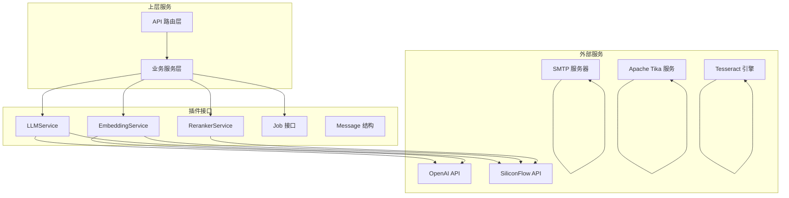

图示来源
- [plugin/ai/llm.go](file://plugin/ai/llm.go#L66-L104)
- [plugin/ai/embedding.go](file://plugin/ai/embedding.go#L30-L58)
- [plugin/ai/reranker.go](file://plugin/ai/reranker.go#L37-L53)
- [plugin/email/client.go](file://plugin/email/client.go#L47-L75)
- [plugin/textextract/tika.go](file://plugin/textextract/tika.go#L134-L195)
- [plugin/ocr/tesseract.go](file://plugin/ocr/tesseract.go#L61-L122)

## 详细组件分析

### AI 插件体系
- 配置与校验：集中于 Config、EmbeddingConfig、LLMConfig、RerankerConfig，支持多提供商（如 openai、siliconflow、ollama、deepseek），并提供 Validate 校验。
- 向量嵌入：EmbeddingService 提供单条与批量向量化，返回固定维度向量。
- 大模型对话：LLMService 支持同步对话、流式输出与函数调用工具（ChatWithTools），内置超时保护。
- 重排序：RerankerService 基于外部API对候选文档进行相关性重排，可禁用时返回原始顺序。

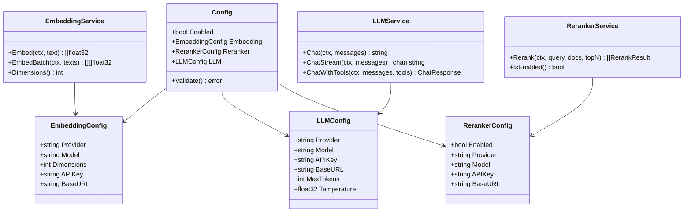

图示来源
- [plugin/ai/config.go](file://plugin/ai/config.go#L9-L44)
- [plugin/ai/embedding.go](file://plugin/ai/embedding.go#L11-L21)
- [plugin/ai/llm.go](file://plugin/ai/llm.go#L20-L30)
- [plugin/ai/reranker.go](file://plugin/ai/reranker.go#L20-L27)

章节来源
- [plugin/ai/config.go](file://plugin/ai/config.go#L46-L128)
- [plugin/ai/embedding.go](file://plugin/ai/embedding.go#L29-L98)
- [plugin/ai/llm.go](file://plugin/ai/llm.go#L65-L196)
- [plugin/ai/reranker.go](file://plugin/ai/reranker.go#L37-L126)

### 定时任务与作业调度
- cron：通用Cron调度器，支持任务添加、快照、删除、启动/停止与协程安全；通过 Chain 包裹任务以实现错误恢复与日志记录。
- scheduler：基于时间轮询的作业调度器，支持时区、中间件链、优雅停止与上下文取消。

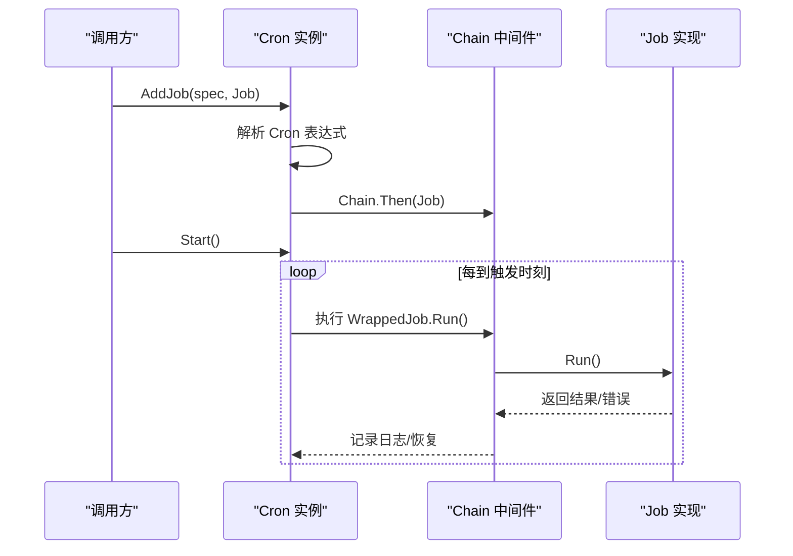

图示来源
- [plugin/cron/cron.go](file://plugin/cron/cron.go#L141-L174)
- [plugin/cron/cron.go](file://plugin/cron/cron.go#L214-L305)

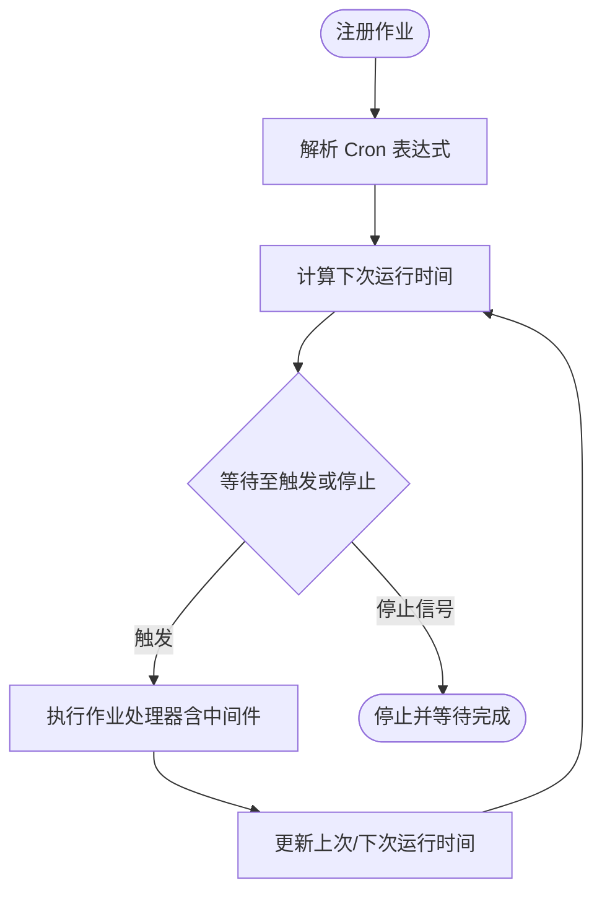

图示来源
- [plugin/scheduler/scheduler.go](file://plugin/scheduler/scheduler.go#L103-L118)
- [plugin/scheduler/scheduler.go](file://plugin/scheduler/scheduler.go#L120-L165)
- [plugin/scheduler/scheduler.go](file://plugin/scheduler/scheduler.go#L167-L202)

章节来源
- [plugin/cron/cron.go](file://plugin/cron/cron.go#L13-L354)
- [plugin/scheduler/scheduler.go](file://plugin/scheduler/scheduler.go#L11-L203)

### 邮件插件
- 功能：支持SMTP PlainAuth、STARTTLS与SSL/TLS两种加密方式，统一发送入口，失败时返回带上下文的错误信息。
- 安全：默认启用TLS最小版本，支持用户名密码认证，支持SSL端口465与TLS端口587。

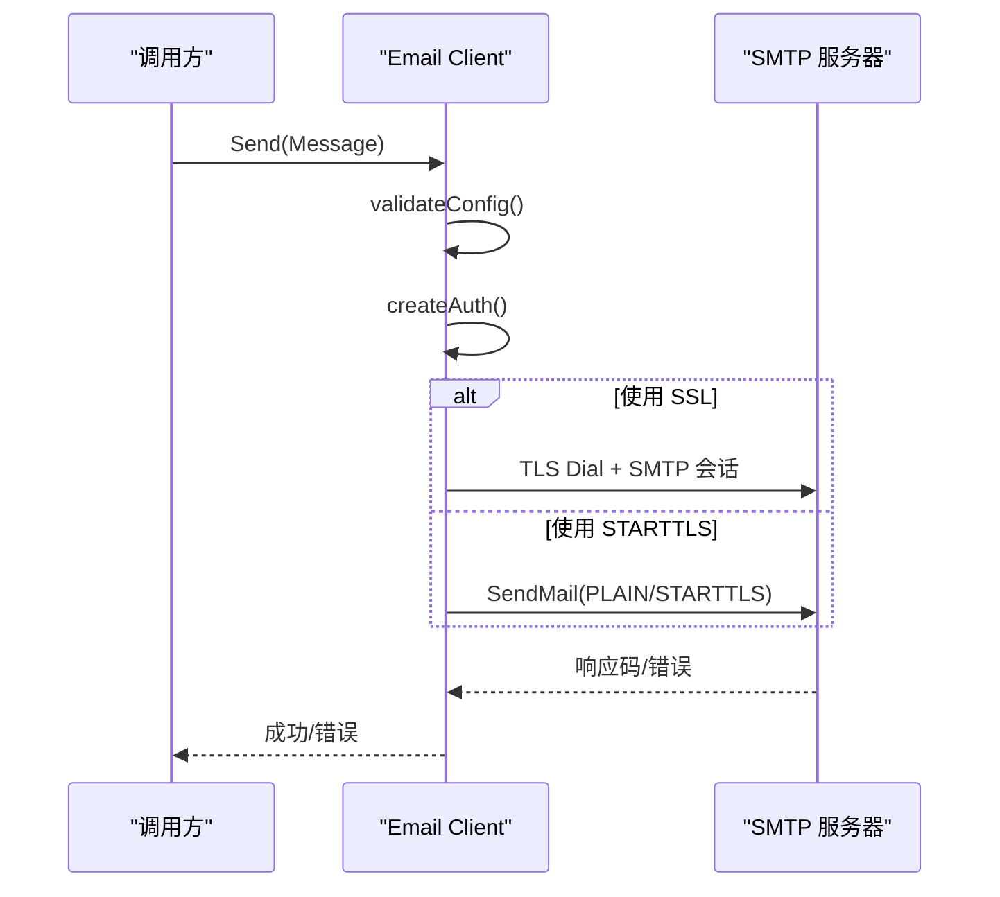

图示来源
- [plugin/email/client.go](file://plugin/email/client.go#L47-L75)
- [plugin/email/client.go](file://plugin/email/client.go#L77-L143)

章节来源
- [plugin/email/client.go](file://plugin/email/client.go#L10-L144)

### 过滤器引擎（CEL）
- 功能：将CEL表达式编译为条件树，再渲染为不同方言（如SQL）的片段与参数，支持默认实例与附件专用实例。
- 性能：提供一次性编译并渲染的便捷方法，减少重复开销。

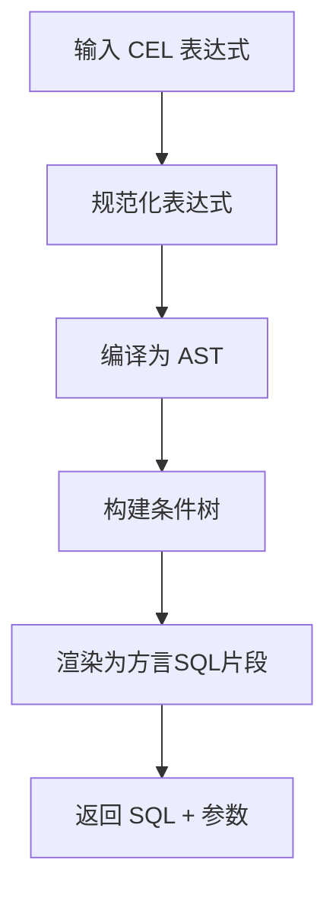

图示来源
- [plugin/filter/engine.go](file://plugin/filter/engine.go#L42-L68)
- [plugin/filter/engine.go](file://plugin/filter/engine.go#L92-L96)

章节来源
- [plugin/filter/engine.go](file://plugin/filter/engine.go#L13-L192)

### Markdown 处理
- 功能：提取标签、属性、生成摘要、验证内容、重命名标签、渲染HTML与Markdown回写。
- 扩展：通过选项启用标签扩展，使用Goldmark解析器与自定义AST节点。

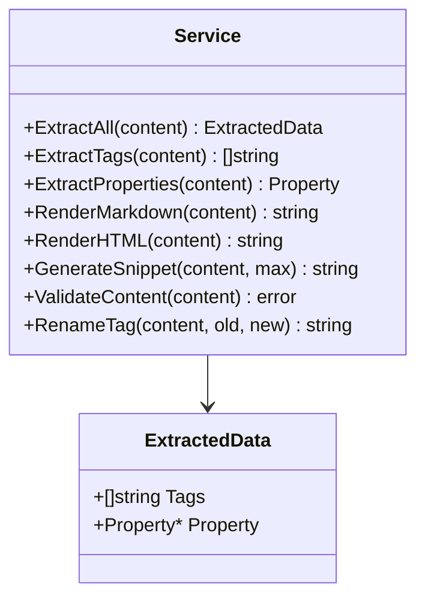

图示来源
- [plugin/markdown/markdown.go](file://plugin/markdown/markdown.go#L26-L54)
- [plugin/markdown/markdown.go](file://plugin/markdown/markdown.go#L20-L25)

章节来源
- [plugin/markdown/markdown.go](file://plugin/markdown/markdown.go#L26-L411)

### OCR 与 文档提取
- OCR（Tesseract）：支持多种图像格式，提供纯文本与布局信息提取，支持语言列表查询与可用性检测。
- 文档提取（Tika）：支持PDF/Office/RTF等，优先使用Tika服务，回退到嵌入式Java模式，支持元数据提取与统计。

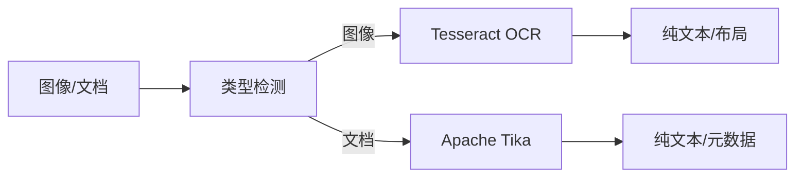

图示来源
- [plugin/ocr/tesseract.go](file://plugin/ocr/tesseract.go#L61-L122)
- [plugin/textextract/tika.go](file://plugin/textextract/tika.go#L121-L195)

章节来源
- [plugin/ocr/tesseract.go](file://plugin/ocr/tesseract.go#L29-L410)
- [plugin/textextract/tika.go](file://plugin/textextract/tika.go#L37-L452)

### Webhook 通知
- 功能：同步/异步POST请求，设置JSON负载与超时，校验响应码与业务返回码，异步模式仅记录警告日志。

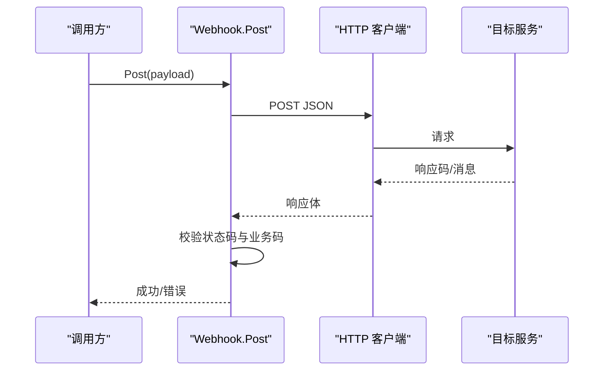

图示来源
- [plugin/webhook/webhook.go](file://plugin/webhook/webhook.go#L32-L76)

章节来源
- [plugin/webhook/webhook.go](file://plugin/webhook/webhook.go#L16-L91)

### 身份提供者（OAuth2）
- 功能：令牌交换（支持PKCE）、用户信息获取、字段映射（标识符、显示名、邮箱、头像）。
- 安全：严格校验必填字段，使用Bearer认证访问用户信息接口。

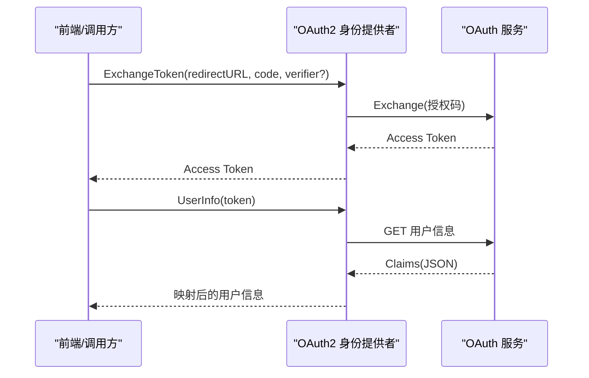

图示来源
- [plugin/idp/oauth2/oauth2.go](file://plugin/idp/oauth2/oauth2.go#L43-L78)
- [plugin/idp/oauth2/oauth2.go](file://plugin/idp/oauth2/oauth2.go#L80-L134)

章节来源
- [plugin/idp/oauth2/oauth2.go](file://plugin/idp/oauth2/oauth2.go#L19-L135)

## 依赖分析
- 组件内聚：各插件内部职责单一，接口清晰，便于单元测试与替换。
- 组件耦合：插件之间低耦合，通过接口与配置进行协作；上层服务聚合多个插件能力。
- 外部依赖：OpenAI/SiliconFlow API、SMTP、Tesseract、Tika、OAuth2服务等，均通过配置与超时控制进行隔离。
- 循环依赖：未见直接循环依赖；中间件链与作业调度器通过接口解耦。

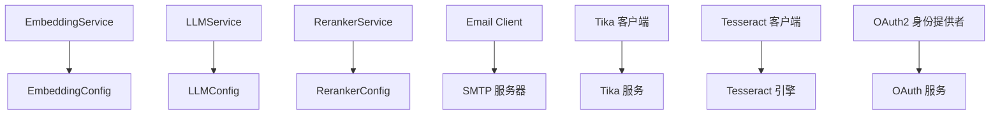

图示来源
- [plugin/ai/embedding.go](file://plugin/ai/embedding.go#L30-L58)
- [plugin/ai/llm.go](file://plugin/ai/llm.go#L66-L104)
- [plugin/ai/reranker.go](file://plugin/ai/reranker.go#L37-L53)
- [plugin/email/client.go](file://plugin/email/client.go#L47-L75)
- [plugin/textextract/tika.go](file://plugin/textextract/tika.go#L134-L195)
- [plugin/ocr/tesseract.go](file://plugin/ocr/tesseract.go#L61-L122)
- [plugin/idp/oauth2/oauth2.go](file://plugin/idp/oauth2/oauth2.go#L43-L78)

章节来源
- [plugin/ai/embedding.go](file://plugin/ai/embedding.go#L1-L103)
- [plugin/ai/llm.go](file://plugin/ai/llm.go#L1-L326)
- [plugin/ai/reranker.go](file://plugin/ai/reranker.go#L1-L127)
- [plugin/email/client.go](file://plugin/email/client.go#L1-L144)
- [plugin/textextract/tika.go](file://plugin/textextract/tika.go#L1-L452)
- [plugin/ocr/tesseract.go](file://plugin/ocr/tesseract.go#L1-L410)
- [plugin/idp/oauth2/oauth2.go](file://plugin/idp/oauth2/oauth2.go#L1-L135)

## 性能考虑
- 超时与背压：LLM与OCR/Tika均设置合理超时，避免阻塞；流式对话使用通道分块传输。
- 并发与资源：Cron与Scheduler内部使用互斥锁与WaitGroup保证并发安全与优雅停止；HTTP客户端配置连接池参数。
- 缓存与复用：过滤器引擎提供进程级默认实例，减少重复初始化成本；Markdown服务按需启用扩展。
- I/O优化：OCR/Tika通过临时文件与命令行工具交互，注意磁盘I/O与进程开销；建议在容器或有足够磁盘空间的环境中部署。

## 故障排查指南
- 配置校验失败：检查 AI 配置的提供商、API Key、BaseURL 是否正确；参考 Validate 逻辑逐项排查。
- 外部服务不可达：确认OpenAI/SiliconFlow/Tika/SMTP/Tesseract服务可达与网络策略；查看超时与错误日志。
- 作业未执行：核对 Cron 表达式解析、时区设置、中间件链是否包裹处理器；检查停止信号与上下文取消。
- Webhook 失败：检查URL、超时、响应码与业务返回码；异步模式仅记录警告，需关注日志。
- OAuth2 令牌交换失败：确认ClientId/ClientSecret/TokenUrl/UserInfoUrl/Identifier字段非空；必要时开启PKCE。

章节来源
- [plugin/ai/config.go](file://plugin/ai/config.go#L105-L128)
- [plugin/ai/llm.go](file://plugin/ai/llm.go#L106-L128)
- [plugin/ocr/tesseract.go](file://plugin/ocr/tesseract.go#L187-L205)
- [plugin/textextract/tika.go](file://plugin/textextract/tika.go#L300-L322)
- [plugin/cron/cron.go](file://plugin/cron/cron.go#L214-L305)
- [plugin/webhook/webhook.go](file://plugin/webhook/webhook.go#L32-L76)
- [plugin/idp/oauth2/oauth2.go](file://plugin/idp/oauth2/oauth2.go#L24-L41)

## 结论
该插件架构以“接口抽象 + 配置驱动 + 生命周期管理 + 可观测性”为核心设计原则，实现了高内聚、低耦合、可替换与可扩展的系统能力。通过统一的中间件链、超时与资源管理、清晰的错误传播与日志记录，插件在复杂外部依赖场景下仍保持稳定与可维护性。建议在生产环境遵循本文最佳实践，持续完善版本管理与兼容性策略。

## 附录

### 插件加载顺序与初始化流程（建议实践）
- 启动阶段：先加载全局配置，再初始化各插件实例（按需），最后注册到服务层。
- 依赖顺序：AI插件（Embedding/LLM/Reranker）通常在检索/对话服务前初始化；定时器与作业调度器在业务服务启动后开始运行。
- 资源释放：停止阶段按相反顺序关闭，确保作业优雅退出与外部连接释放。

### 插件间通信与事件系统（建议实践）
- 事件发布：通过Webhook或内部队列发布事件，订阅方按需消费。
- 状态共享：通过只读缓存或共享状态对象在插件间传递，避免直接耦合。
- 一致性：使用幂等操作与重试机制，结合唯一ID与去重策略。

### 安全模型、权限控制与隔离机制（建议实践）
- 最小权限：为各外部服务分配最小必要权限（API Key、作用域、访问路径）。
- 加密传输：强制TLS/SSL，限制最低版本；敏感信息通过环境变量或密钥管理服务注入。
- 隔离边界：容器化部署，限制CPU/内存/磁盘配额；网络策略限制出站访问。

### 版本管理、兼容性检查与升级策略（建议实践）
- 版本声明：在插件配置中显式声明外部服务版本或兼容范围。
- 兼容性检查：在启动时校验外部服务可用性与能力（如Tesseract版本、Tika服务状态）。
- 升级策略：灰度发布，逐步切换提供商或模型；保留回滚路径与降级方案（如禁用重排序）。

### 最佳实践与设计原则
- 接口优先：面向接口编程，便于替换与测试。
- 配置即代码：所有外部依赖通过配置对象集中管理。
- 可观测性：统一日志、指标与告警，明确错误上下文。
- 资源治理：超时、重试、熔断、限流与连接池配置。
- 安全优先：最小权限、加密传输、输入校验与权限控制。