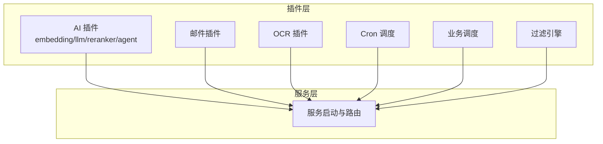
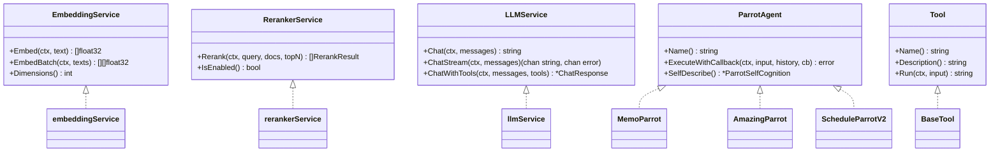
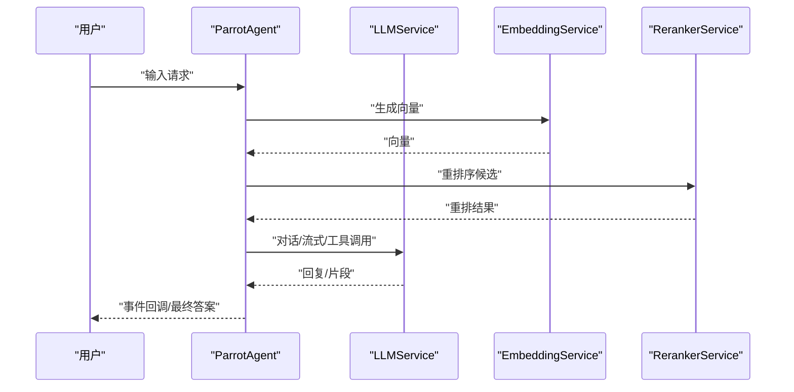
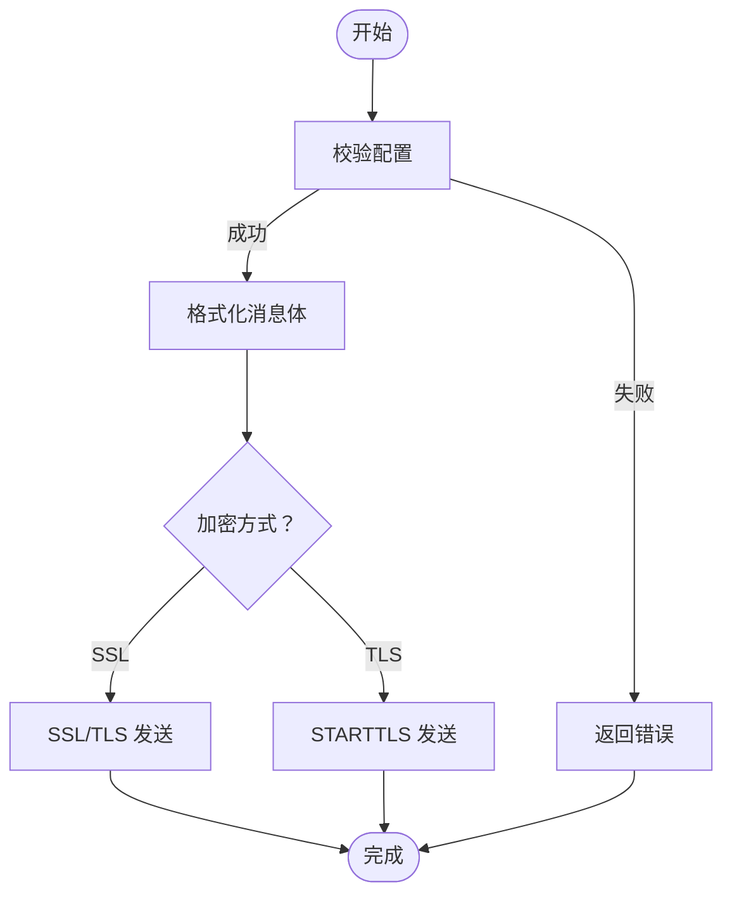
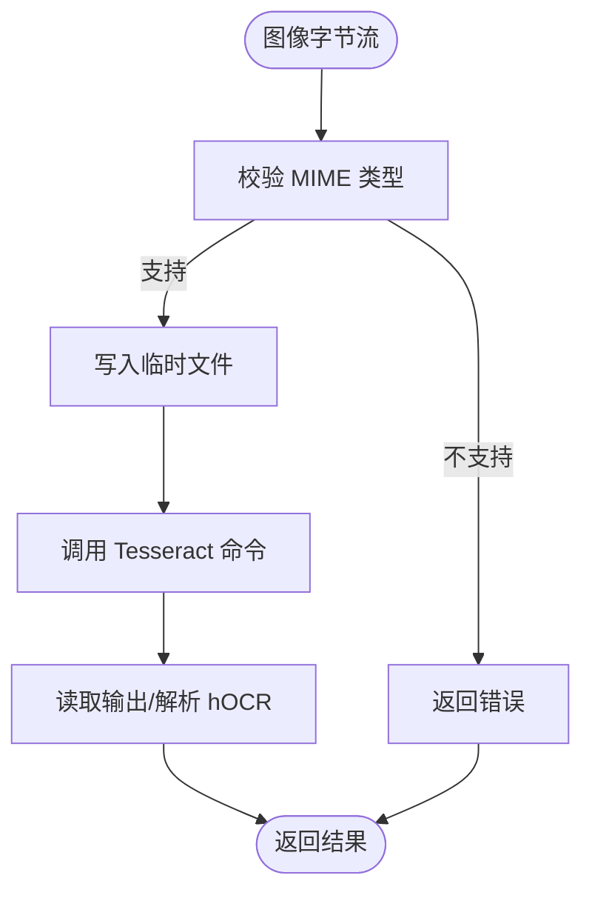
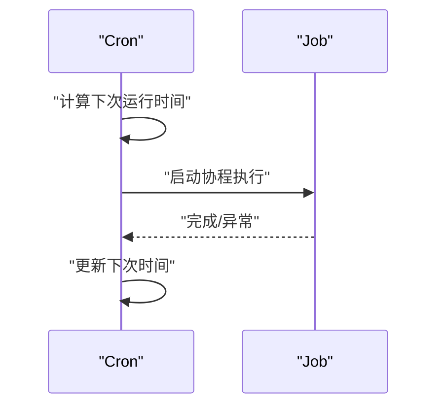
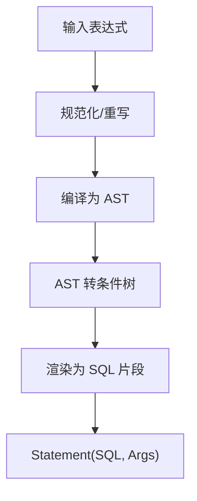
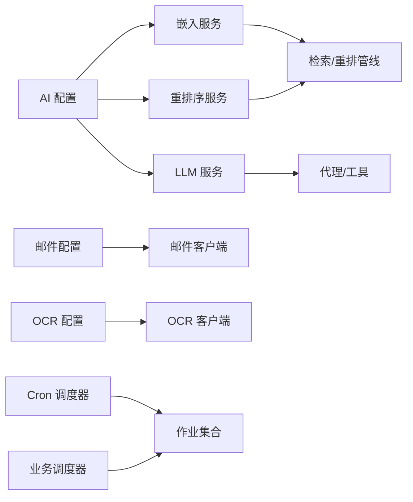

# 插件系统

<cite>
**本文引用的文件**
- [plugin/ai/config.go](file://plugin/ai/config.go)
- [plugin/ai/embedding.go](file://plugin/ai/embedding.go)
- [plugin/ai/llm.go](file://plugin/ai/llm.go)
- [plugin/ai/reranker.go](file://plugin/ai/reranker.go)
- [plugin/ai/timeout/timeout.go](file://plugin/ai/timeout/timeout.go)
- [plugin/ai/agent/types.go](file://plugin/ai/agent/types.go)
- [plugin/ai/agent/context.go](file://plugin/ai/agent/context.go)
- [plugin/ai/agent/base_tool.go](file://plugin/ai/agent/base_tool.go)
- [plugin/ai/agent/util.go](file://plugin/ai/agent/util.go)
- [plugin/email/config.go](file://plugin/email/config.go)
- [plugin/email/client.go](file://plugin/email/client.go)
- [plugin/ocr/tesseract.go](file://plugin/ocr/tesseract.go)
- [plugin/cron/cron.go](file://plugin/cron/cron.go)
- [plugin/scheduler/scheduler.go](file://plugin/scheduler/scheduler.go)
- [plugin/filter/engine.go](file://plugin/filter/engine.go)
</cite>

## 目录
1. [简介](#简介)
2. [项目结构](#项目结构)
3. [核心组件](#核心组件)
4. [架构总览](#架构总览)
5. [组件详解](#组件详解)
6. [依赖关系分析](#依赖关系分析)
7. [性能与可靠性](#性能与可靠性)
8. [故障排查指南](#故障排查指南)
9. [结论](#结论)
10. [附录：开发与集成指南](#附录开发与集成指南)

## 简介
本文件系统化梳理了本仓库的插件体系，涵盖插件架构设计理念、接口与生命周期、依赖注入模式、内置插件（AI、调度、邮件、OCR）的实现与扩展点，并给出第三方插件集成与最佳实践。文档同时覆盖加载机制、热重载能力、版本兼容策略以及调试技巧，帮助开发者快速上手并安全扩展系统功能。

## 项目结构
插件模块主要位于 plugin 目录下，按功能域划分：
- ai：AI 能力（嵌入、重排序、大模型、代理与工具）
- email：邮件发送
- ocr：光学字符识别
- cron：通用定时任务调度
- scheduler：业务级作业调度
- filter：过滤表达式引擎（CEL）
- 其他：markdown、textextract、webhook、idp 等

图示来源
- [plugin/ai/config.go](file://plugin/ai/config.go#L1-L129)
- [plugin/email/config.go](file://plugin/email/config.go#L1-L48)
- [plugin/ocr/tesseract.go](file://plugin/ocr/tesseract.go#L1-L410)
- [plugin/cron/cron.go](file://plugin/cron/cron.go#L1-L354)
- [plugin/scheduler/scheduler.go](file://plugin/scheduler/scheduler.go#L1-L203)
- [plugin/filter/engine.go](file://plugin/filter/engine.go#L1-L192)

章节来源
- [plugin/ai/config.go](file://plugin/ai/config.go#L1-L129)
- [plugin/email/config.go](file://plugin/email/config.go#L1-L48)
- [plugin/ocr/tesseract.go](file://plugin/ocr/tesseract.go#L1-L410)
- [plugin/cron/cron.go](file://plugin/cron/cron.go#L1-L354)
- [plugin/scheduler/scheduler.go](file://plugin/scheduler/scheduler.go#L1-L203)
- [plugin/filter/engine.go](file://plugin/filter/engine.go#L1-L192)

## 核心组件
- 插件接口与抽象
  - AI：嵌入服务、重排序服务、LLM 服务、代理接口、工具接口
  - 邮件：配置校验、客户端封装、发送流程
  - OCR：Tesseract 客户端、语言与版本探测、输出格式化
  - 调度：Cron 与业务调度器，支持中间件与优雅停机
  - 过滤：CEL 引擎、条件树、方言渲染
- 生命周期与依赖注入
  - 通过配置对象驱动初始化与校验
  - 通过接口注入服务依赖，降低耦合
  - 支持运行时注册与动态启停（调度器）

章节来源
- [plugin/ai/embedding.go](file://plugin/ai/embedding.go#L1-L103)
- [plugin/ai/llm.go](file://plugin/ai/llm.go#L1-L326)
- [plugin/ai/reranker.go](file://plugin/ai/reranker.go#L1-L127)
- [plugin/ai/agent/types.go](file://plugin/ai/agent/types.go#L1-L353)
- [plugin/email/client.go](file://plugin/email/client.go#L1-L144)
- [plugin/ocr/tesseract.go](file://plugin/ocr/tesseract.go#L1-L410)
- [plugin/cron/cron.go](file://plugin/cron/cron.go#L1-L354)
- [plugin/scheduler/scheduler.go](file://plugin/scheduler/scheduler.go#L1-L203)
- [plugin/filter/engine.go](file://plugin/filter/engine.go#L1-L192)

## 架构总览
插件系统采用“接口抽象 + 配置驱动 + 中间件链”的架构：
- 接口抽象：统一服务契约，便于替换实现
- 配置驱动：从 Profile 或环境变量构建配置，集中校验
- 中间件链：对任务执行进行统一包装（如超时、日志、重试）
- 生命周期：Start/Stop/Graceful Shutdown，支持并发安全

图示来源
- [plugin/ai/embedding.go](file://plugin/ai/embedding.go#L11-L21)
- [plugin/ai/reranker.go](file://plugin/ai/reranker.go#L20-L27)
- [plugin/ai/llm.go](file://plugin/ai/llm.go#L20-L30)
- [plugin/ai/agent/types.go](file://plugin/ai/agent/types.go#L10-L23)
- [plugin/ai/agent/base_tool.go](file://plugin/ai/agent/base_tool.go#L10-L22)

## 组件详解

### AI 插件
- 配置与校验
  - 支持多提供商（SiliconFlow/OpenAI/Ollama）与多模型
  - 维度、温度、最大令牌数等参数集中管理
  - 校验规则确保必要字段存在
- 嵌入服务
  - 统一接口，OpenAI 兼容客户端
  - 支持批量嵌入与维度提取
- 重排序服务
  - 可禁用时返回原序
  - 调用 SiliconFlow Rerank API，按分数降序
- 大模型服务
  - 同步对话、流式对话、函数调用（工具）
  - 内置超时保护与消息转换
- 代理与工具
  - 代理接口与事件回调
  - 工具注册与执行、超时与校验
  - 会话上下文管理（历史、工作态、精炼解析）

图示来源
- [plugin/ai/llm.go](file://plugin/ai/llm.go#L106-L196)
- [plugin/ai/embedding.go](file://plugin/ai/embedding.go#L60-L97)
- [plugin/ai/reranker.go](file://plugin/ai/reranker.go#L59-L126)
- [plugin/ai/agent/types.go](file://plugin/ai/agent/types.go#L10-L23)

章节来源
- [plugin/ai/config.go](file://plugin/ai/config.go#L1-L129)
- [plugin/ai/embedding.go](file://plugin/ai/embedding.go#L1-L103)
- [plugin/ai/llm.go](file://plugin/ai/llm.go#L1-L326)
- [plugin/ai/reranker.go](file://plugin/ai/reranker.go#L1-L127)
- [plugin/ai/timeout/timeout.go](file://plugin/ai/timeout/timeout.go#L1-L49)
- [plugin/ai/agent/types.go](file://plugin/ai/agent/types.go#L1-L353)
- [plugin/ai/agent/context.go](file://plugin/ai/agent/context.go#L1-L488)
- [plugin/ai/agent/base_tool.go](file://plugin/ai/agent/base_tool.go#L1-L251)
- [plugin/ai/agent/util.go](file://plugin/ai/agent/util.go#L1-L14)

### 邮件插件
- 配置校验：主机、端口、发件人必填，端口范围校验
- 发送流程：根据加密方式选择 TLS/SSL；支持认证与收件人列表
- 错误处理：分阶段校验与错误包装，便于定位问题

图示来源
- [plugin/email/config.go](file://plugin/email/config.go#L30-L47)
- [plugin/email/client.go](file://plugin/email/client.go#L46-L143)

章节来源
- [plugin/email/config.go](file://plugin/email/config.go#L1-L48)
- [plugin/email/client.go](file://plugin/email/client.go#L1-L144)

### OCR 插件
- 客户端能力：文本提取、布局信息提取（hOCR）、可用性与版本探测、语言列表
- 输出格式：纯文本、JSON、hOCR；结果合并与格式化
- 环境变量：路径、语言、数据目录

图示来源
- [plugin/ocr/tesseract.go](file://plugin/ocr/tesseract.go#L61-L184)

章节来源
- [plugin/ocr/tesseract.go](file://plugin/ocr/tesseract.go#L1-L410)

### 调度插件
- Cron 调度器
  - 支持新增、删除、快照、启动/停止
  - 通道与锁保证并发安全
  - 日志与时间区域设置
- 业务调度器
  - 注册作业、解析 Cron、应用中间件
  - 优雅停机与上下文取消

图示来源
- [plugin/cron/cron.go](file://plugin/cron/cron.go#L239-L304)
- [plugin/scheduler/scheduler.go](file://plugin/scheduler/scheduler.go#L120-L165)

章节来源
- [plugin/cron/cron.go](file://plugin/cron/cron.go#L1-L354)
- [plugin/scheduler/scheduler.go](file://plugin/scheduler/scheduler.go#L1-L203)

### 过滤引擎（CEL）
- 将表达式编译为条件树，再渲染为方言 SQL 片段
- 默认引擎与附件引擎，支持占位符偏移与空值控制

图示来源
- [plugin/filter/engine.go](file://plugin/filter/engine.go#L42-L96)

章节来源
- [plugin/filter/engine.go](file://plugin/filter/engine.go#L1-L192)

## 依赖关系分析
- 低耦合高内聚：各插件通过接口解耦，配置驱动初始化
- 依赖方向：服务层依赖插件接口；插件内部依赖第三方库（如 OpenAI 客户端、CEL）
- 并发与资源：调度器与代理均采用互斥锁与 WaitGroup 保证线程安全

图示来源
- [plugin/ai/config.go](file://plugin/ai/config.go#L46-L103)
- [plugin/ai/embedding.go](file://plugin/ai/embedding.go#L29-L57)
- [plugin/ai/llm.go](file://plugin/ai/llm.go#L65-L103)
- [plugin/ai/reranker.go](file://plugin/ai/reranker.go#L37-L52)
- [plugin/email/config.go](file://plugin/email/config.go#L9-L28)
- [plugin/ocr/tesseract.go](file://plugin/ocr/tesseract.go#L29-L46)
- [plugin/cron/cron.go](file://plugin/cron/cron.go#L13-L26)
- [plugin/scheduler/scheduler.go](file://plugin/scheduler/scheduler.go#L12-L21)

章节来源
- [plugin/ai/config.go](file://plugin/ai/config.go#L1-L129)
- [plugin/ai/embedding.go](file://plugin/ai/embedding.go#L1-L103)
- [plugin/ai/llm.go](file://plugin/ai/llm.go#L1-L326)
- [plugin/ai/reranker.go](file://plugin/ai/reranker.go#L1-L127)
- [plugin/email/config.go](file://plugin/email/config.go#L1-L48)
- [plugin/ocr/tesseract.go](file://plugin/ocr/tesseract.go#L1-L410)
- [plugin/cron/cron.go](file://plugin/cron/cron.go#L1-L354)
- [plugin/scheduler/scheduler.go](file://plugin/scheduler/scheduler.go#L1-L203)
- [plugin/filter/engine.go](file://plugin/filter/engine.go#L1-L192)

## 性能与可靠性
- 超时与重试
  - AI 操作统一超时常量，避免阻塞
  - LLM 流式与同步调用均设置超时
- 并发与资源
  - 调度器使用 WaitGroup 等待作业完成
  - 代理工具执行带超时与结果校验
- 可观测性
  - 调度器与 LLM 流式过程记录日志
  - 上下文存储限制历史轮次，防止内存膨胀

章节来源
- [plugin/ai/timeout/timeout.go](file://plugin/ai/timeout/timeout.go#L1-L49)
- [plugin/ai/llm.go](file://plugin/ai/llm.go#L106-L128)
- [plugin/cron/cron.go](file://plugin/cron/cron.go#L307-L312)
- [plugin/scheduler/scheduler.go](file://plugin/scheduler/scheduler.go#L167-L202)
- [plugin/ai/agent/context.go](file://plugin/ai/agent/context.go#L131-L134)

## 故障排查指南
- AI 配置
  - 缺少提供商或密钥导致校验失败
  - 嵌入/LLM 维度与模型不匹配
- 邮件发送
  - 端口范围、加密方式与服务器不一致
  - 认证失败或收件人列表为空
- OCR
  - 不支持的 MIME 类型
  - Tesseract 可执行文件不可用或语言数据缺失
- 调度
  - Cron 表达式解析失败
  - 作业重复注册或未在启动前注册
- 过滤
  - 表达式为空或编译失败
  - 渲染方言不支持的语法

章节来源
- [plugin/ai/config.go](file://plugin/ai/config.go#L105-L128)
- [plugin/email/config.go](file://plugin/email/config.go#L30-L42)
- [plugin/ocr/tesseract.go](file://plugin/ocr/tesseract.go#L61-L122)
- [plugin/cron/cron.go](file://plugin/cron/cron.go#L141-L154)
- [plugin/scheduler/scheduler.go](file://plugin/scheduler/scheduler.go#L68-L88)
- [plugin/filter/engine.go](file://plugin/filter/engine.go#L42-L68)

## 结论
该插件系统以接口抽象为核心，通过配置驱动与中间件链实现高内聚、低耦合的模块化架构。内置 AI、邮件、OCR、调度与过滤插件覆盖常见场景，具备良好的扩展性与可观测性。建议在生产环境中结合超时、日志与优雅停机策略，确保稳定性与可维护性。

## 附录：开发与集成指南

### 插件开发指导原则
- 接口规范
  - 明确定义服务接口与工具接口，保持方法职责单一
  - 使用统一的错误包装与日志记录
- 配置管理
  - 从环境变量或配置文件构建配置对象，集中校验
  - 提供默认值与最小可用配置
- 错误处理
  - 区分可恢复与不可恢复错误
  - 在关键路径添加超时与重试策略
- 生命周期
  - 明确 Start/Stop/Graceful Shutdown 的边界
  - 使用上下文传播取消信号

### 加载机制与热重载
- 配置驱动加载：通过配置对象初始化插件实例
- 运行时注册：调度器支持动态注册与移除作业
- 热重载建议：通过外部配置中心或文件监控触发重建，避免直接替换正在使用的实例

### 版本兼容性
- 接口稳定性：保持对外接口不变，新增能力以可选参数或新接口形式提供
- 配置兼容：新增字段时提供默认值，避免破坏既有部署
- 第三方依赖：固定版本或锁定策略，避免隐式升级导致的不兼容

### 第三方插件集成
- 实现统一接口：嵌入/重排序/LLM/代理/工具接口
- 配置与校验：提供 Validate 方法与默认配置
- 中间件接入：通过调度器中间件链统一处理日志、限流与重试
- 测试与验证：提供单元测试与集成测试样例

### 最佳实践与调试技巧
- 最小可用原则：先实现核心功能，再逐步增强
- 分层测试：接口层、服务层、集成层分别覆盖
- 观测性：为关键路径增加日志与指标
- 调试技巧：使用上下文超时、分步断点、最小化复现场景