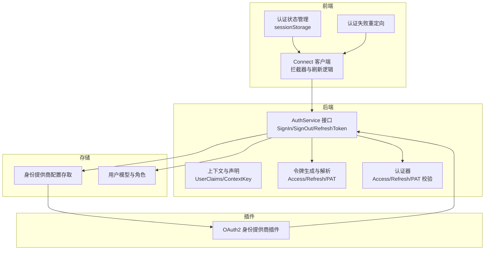
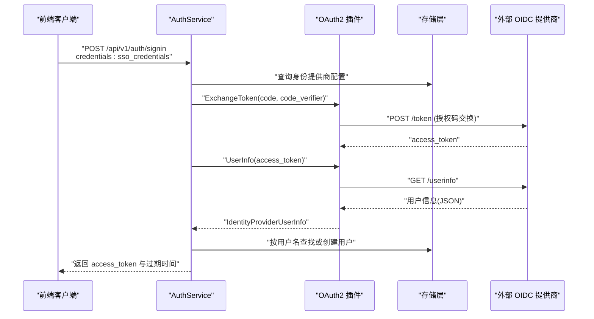
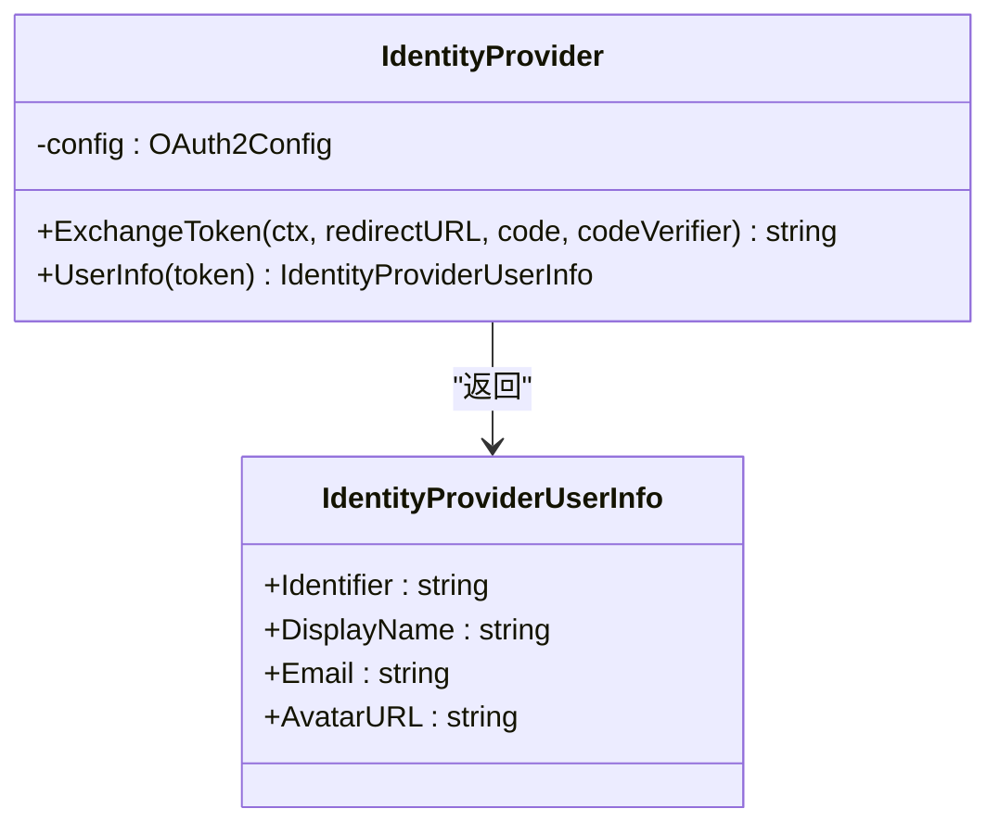
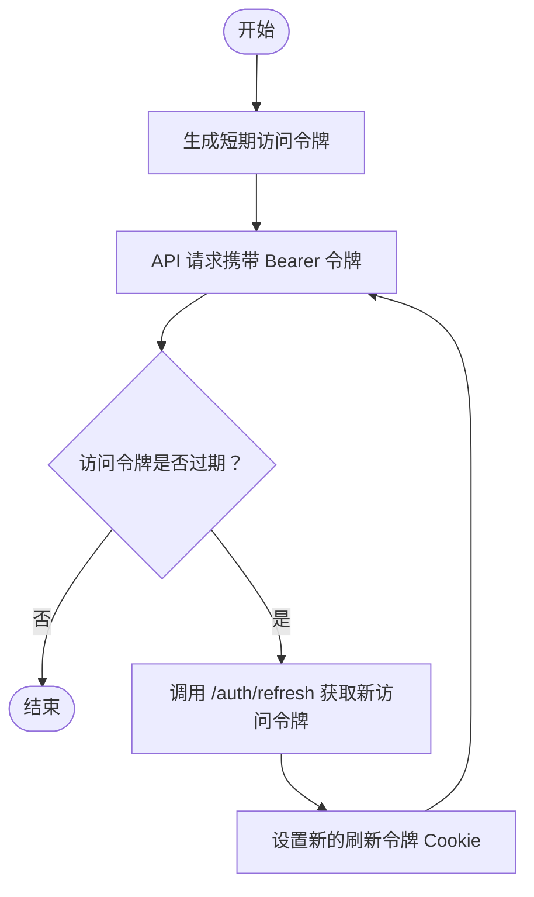
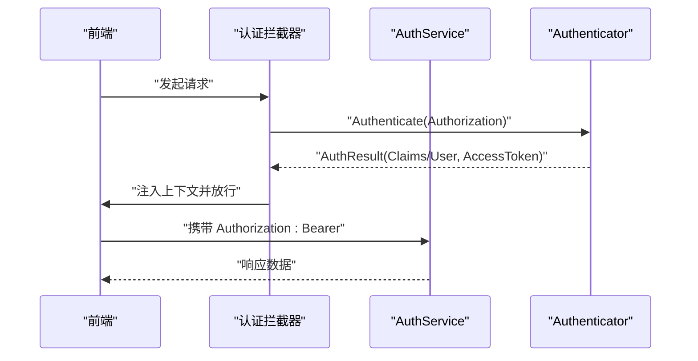
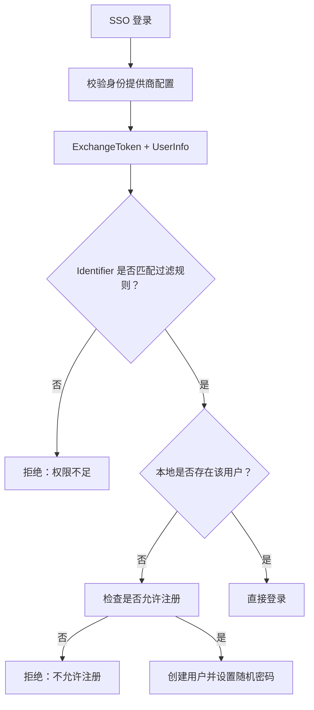
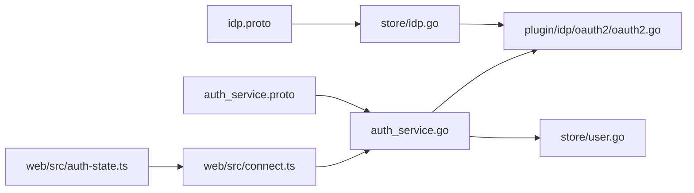

# 认证插件

<cite>
**本文引用的文件**
- [plugin/idp/oauth2/oauth2.go](file://plugin/idp/oauth2/oauth2.go)
- [plugin/idp/idp.go](file://plugin/idp/idp.go)
- [server/auth/authenticator.go](file://server/auth/authenticator.go)
- [server/auth/token.go](file://server/auth/token.go)
- [server/auth/context.go](file://server/auth/context.go)
- [server/auth/extract.go](file://server/auth/extract.go)
- [server/router/api/v1/auth_service.go](file://server/router/api/v1/auth_service.go)
- [proto/api/v1/auth_service.proto](file://proto/api/v1/auth_service.proto)
- [store/idp.go](file://store/idp.go)
- [proto/store/idp.proto](file://proto/store/idp.proto)
- [plugin/idp/oauth2/oauth2_test.go](file://plugin/idp/oauth2/oauth2_test.go)
- [store/user.go](file://store/user.go)
- [web/src/utils/auth-redirect.ts](file://web/src/utils/auth-redirect.ts)
- [web/src/connect.ts](file://web/src/connect.ts)
- [web/src/auth-state.ts](file://web/src/auth-state.ts)
</cite>

## 目录
1. [简介](#简介)
2. [项目结构](#项目结构)
3. [核心组件](#核心组件)
4. [架构总览](#架构总览)
5. [组件详解](#组件详解)
6. [依赖关系分析](#依赖关系分析)
7. [性能与安全考量](#性能与安全考量)
8. [故障排查指南](#故障排查指南)
9. [结论](#结论)
10. [附录：集成与扩展指南](#附录：集成与扩展指南)

## 简介
本文件系统性梳理认证插件体系，重点覆盖基于 OAuth2 的身份提供商（IDP）插件、令牌生命周期管理、SSO 登录流程、用户信息同步、会话与状态恢复、错误处理与安全策略，并给出集成示例、最佳实践与扩展开发指南。目标是帮助开发者在不深入底层的情况下快速理解并正确使用认证子系统。

## 项目结构
认证相关能力横跨后端服务层、存储层、协议定义以及前端客户端，形成“协议-实现-存储-前端”的完整闭环。

**图表来源**
- [server/router/api/v1/auth_service.go](file://server/router/api/v1/auth_service.go#L55-L190)
- [server/auth/authenticator.go](file://server/auth/authenticator.go#L17-L166)
- [server/auth/token.go](file://server/auth/token.go#L25-L250)
- [plugin/idp/oauth2/oauth2.go](file://plugin/idp/oauth2/oauth2.go#L19-L135)
- [store/idp.go](file://store/idp.go#L12-L183)
- [store/user.go](file://store/user.go#L10-L42)
- [web/src/connect.ts](file://web/src/connect.ts#L66-L183)
- [web/src/auth-state.ts](file://web/src/auth-state.ts#L37-L73)
- [web/src/utils/auth-redirect.ts](file://web/src/utils/auth-redirect.ts#L21-L36)

**章节来源**
- [server/router/api/v1/auth_service.go](file://server/router/api/v1/auth_service.go#L55-L190)
- [server/auth/token.go](file://server/auth/token.go#L25-L250)
- [plugin/idp/oauth2/oauth2.go](file://plugin/idp/oauth2/oauth2.go#L19-L135)
- [store/idp.go](file://store/idp.go#L12-L183)
- [store/user.go](file://store/user.go#L10-L42)
- [web/src/connect.ts](file://web/src/connect.ts#L66-L183)
- [web/src/auth-state.ts](file://web/src/auth-state.ts#L37-L73)
- [web/src/utils/auth-redirect.ts](file://web/src/utils/auth-redirect.ts#L21-L36)

## 核心组件
- OAuth2 身份提供商插件：负责授权码换取访问令牌、拉取用户信息并进行字段映射。
- 认证器与令牌：统一处理短期访问令牌、长期刷新令牌与个人访问令牌（PAT），并提供无状态/有状态校验路径。
- 服务端认证拦截器：在 gRPC/Connect 层统一提取与验证令牌，注入用户上下文。
- 前端认证拦截器与状态管理：自动携带 Bearer 令牌、在 401 时刷新访问令牌、持久化令牌与过期时间、失败时重定向。
- 存储层：维护身份提供商配置（含 OAuth2 配置与字段映射）、用户模型与角色。

**章节来源**
- [plugin/idp/oauth2/oauth2.go](file://plugin/idp/oauth2/oauth2.go#L19-L135)
- [server/auth/authenticator.go](file://server/auth/authenticator.go#L17-L166)
- [server/auth/token.go](file://server/auth/token.go#L25-L250)
- [server/router/api/v1/auth_service.go](file://server/router/api/v1/auth_service.go#L55-L190)
- [store/idp.go](file://store/idp.go#L12-L183)
- [store/user.go](file://store/user.go#L10-L42)
- [web/src/connect.ts](file://web/src/connect.ts#L66-L183)

## 架构总览
下图展示从浏览器到后端服务、再到身份提供商插件与存储的整体调用链路。

**图表来源**
- [server/router/api/v1/auth_service.go](file://server/router/api/v1/auth_service.go#L91-L171)
- [plugin/idp/oauth2/oauth2.go](file://plugin/idp/oauth2/oauth2.go#L45-L134)
- [proto/api/v1/auth_service.proto](file://proto/api/v1/auth_service.proto#L55-L102)

**章节来源**
- [server/router/api/v1/auth_service.go](file://server/router/api/v1/auth_service.go#L91-L171)
- [plugin/idp/oauth2/oauth2.go](file://plugin/idp/oauth2/oauth2.go#L45-L134)
- [proto/api/v1/auth_service.proto](file://proto/api/v1/auth_service.proto#L55-L102)

## 组件详解

### OAuth2 身份提供商插件
- 初始化校验：要求 clientId、clientSecret、tokenUrl、userInfoUrl、fieldMapping.identifier 非空。
- 授权码交换：支持 PKCE（code_verifier），兼容旧版无 PKCE 场景。
- 用户信息拉取：通过 Bearer Token 请求 /userinfo，按字段映射填充 Identifier、DisplayName、Email、AvatarURL。
- 错误处理：对缺失字段、HTTP 失败、JSON 解析失败等场景返回明确错误。

**图表来源**
- [plugin/idp/oauth2/oauth2.go](file://plugin/idp/oauth2/oauth2.go#L19-L135)
- [plugin/idp/idp.go](file://plugin/idp/idp.go#L3-L8)

**章节来源**
- [plugin/idp/oauth2/oauth2.go](file://plugin/idp/oauth2/oauth2.go#L24-L134)
- [plugin/idp/idp.go](file://plugin/idp/idp.go#L3-L8)

### 令牌管理与会话
- 访问令牌（Access Token V2）：短生命周期（默认约 15 分钟），无状态校验，包含用户角色与状态。
- 刷新令牌（Refresh Token）：长生命周期（默认约 30 天），有状态校验（数据库存在性与过期检查），支持轮换与滑动窗口。
- 个人访问令牌（PAT）：用于程序化访问，带过期时间与哈希存储。
- Cookie 策略：刷新令牌以 HttpOnly Cookie 形式下发，SameSite/Lax，HTTPS 下追加 Secure；前端刷新访问令牌通过独立 transport 调用后端刷新接口。

**图表来源**
- [server/auth/token.go](file://server/auth/token.go#L25-L187)
- [server/router/api/v1/auth_service.go](file://server/router/api/v1/auth_service.go#L288-L357)

**章节来源**
- [server/auth/token.go](file://server/auth/token.go#L25-L187)
- [server/router/api/v1/auth_service.go](file://server/router/api/v1/auth_service.go#L288-L357)

### 认证流程与上下文
- 认证优先级：Bearer 访问令牌（V2）优先于 PAT；若两者均未提供则视为未认证。
- 上下文注入：根据认证结果注入 UserClaims 或完整 User，并携带当前访问令牌字符串。
- 前端拦截器：自动在请求头添加 Authorization: Bearer；捕获 401 时触发令牌刷新；刷新成功后重试原请求。

**图表来源**
- [server/router/api/v1/auth_service.go](file://server/router/api/v1/auth_service.go#L32-L53)
- [server/auth/authenticator.go](file://server/auth/authenticator.go#L133-L165)
- [server/auth/context.go](file://server/auth/context.go#L30-L83)
- [web/src/connect.ts](file://web/src/connect.ts#L127-L164)

**章节来源**
- [server/auth/authenticator.go](file://server/auth/authenticator.go#L133-L165)
- [server/auth/context.go](file://server/auth/context.go#L30-L83)
- [web/src/connect.ts](file://web/src/connect.ts#L127-L164)

### 用户信息同步与注册
- 标识符过滤：可配置正则表达式限制允许登录的标识符。
- 新用户注册：当 SSO 用户首次登录且实例允许注册时，系统自动生成随机密码并创建用户，字段来自 IDP 返回信息。
- 密码登录限制：实例可禁用普通密码登录（对普通用户生效）。

**图表来源**
- [server/router/api/v1/auth_service.go](file://server/router/api/v1/auth_service.go#L91-L171)
- [store/idp.go](file://store/idp.go#L160-L182)

**章节来源**
- [server/router/api/v1/auth_service.go](file://server/router/api/v1/auth_service.go#L91-L171)
- [store/idp.go](file://store/idp.go#L160-L182)

### 多租户、用户映射与权限继承
- 多租户支持：当前仓库未提供多租户实体与路由隔离逻辑；认证与用户模型未体现租户维度。
- 用户映射：通过 OAuth2 字段映射将外部标识符、显示名、邮箱、头像映射到本地用户。
- 权限继承：用户角色由后端存储决定（HOST/ADMIN/USER），SSO 登录默认为普通用户，可通过管理端调整。

**章节来源**
- [proto/store/idp.proto](file://proto/store/idp.proto#L26-L41)
- [store/user.go](file://store/user.go#L10-L42)
- [server/router/api/v1/auth_service.go](file://server/router/api/v1/auth_service.go#L147-L169)

### 回调处理与安全策略
- PKCE 支持：前端在发起 OAuth2 授权时生成 state 与 code_challenge，并在回调时传回 code_verifier，增强安全性。
- Cookie 安全：刷新令牌 Cookie 使用 HttpOnly、Lax/SameSite、Secure（HTTPS）策略；前端刷新访问令牌使用独立 transport，避免递归拦截。
- 会话管理：刷新令牌轮换与滑动窗口，提升安全性并保持活跃用户会话连续性。

**章节来源**
- [plugin/idp/oauth2/oauth2.go](file://plugin/idp/oauth2/oauth2.go#L61-L64)
- [server/router/api/v1/auth_service.go](file://server/router/api/v1/auth_service.go#L369-L401)
- [web/src/connect.ts](file://web/src/connect.ts#L66-L85)

## 依赖关系分析
- 协议层：AuthService 定义 SignIn/SignOut/RefreshToken 等 RPC；OAuth2Config 与 FieldMapping 在 store 层以 Protobuf 存储。
- 实现层：OAuth2 插件对接外部 OIDC 提供商；服务端 SignIn 路径组合插件与存储完成登录与用户创建。
- 前端层：Connect 客户端拦截器自动处理 Authorization 与 401 刷新；状态持久化于 sessionStorage。

**图表来源**
- [proto/api/v1/auth_service.proto](file://proto/api/v1/auth_service.proto#L13-L115)
- [proto/store/idp.proto](file://proto/store/idp.proto#L7-L41)
- [server/router/api/v1/auth_service.go](file://server/router/api/v1/auth_service.go#L91-L171)
- [plugin/idp/oauth2/oauth2.go](file://plugin/idp/oauth2/oauth2.go#L45-L134)
- [store/idp.go](file://store/idp.go#L160-L182)
- [store/user.go](file://store/user.go#L10-L42)
- [web/src/connect.ts](file://web/src/connect.ts#L127-L164)
- [web/src/auth-state.ts](file://web/src/auth-state.ts#L37-L73)

**章节来源**
- [proto/api/v1/auth_service.proto](file://proto/api/v1/auth_service.proto#L13-L115)
- [proto/store/idp.proto](file://proto/store/idp.proto#L7-L41)
- [server/router/api/v1/auth_service.go](file://server/router/api/v1/auth_service.go#L91-L171)
- [plugin/idp/oauth2/oauth2.go](file://plugin/idp/oauth2/oauth2.go#L45-L134)
- [store/idp.go](file://store/idp.go#L160-L182)
- [store/user.go](file://store/user.go#L10-L42)
- [web/src/connect.ts](file://web/src/connect.ts#L127-L164)
- [web/src/auth-state.ts](file://web/src/auth-state.ts#L37-L73)

## 性能与安全考量
- 性能
  - 访问令牌无状态校验，减少数据库压力。
  - 刷新令牌轮换与滑动窗口避免频繁写入，同时降低泄露风险。
- 安全
  - 强制 PKCE，防止授权码拦截。
  - HttpOnly Cookie 保护刷新令牌；HTTPS 下启用 Secure。
  - PAT 仅用于程序化访问，建议设置合理过期时间与最小权限。
  - 前端 sessionStorage 存储访问令牌，注意隐私模式与第三方 Cookie 限制。

[本节为通用指导，无需特定文件来源]

## 故障排查指南
- 常见错误与定位
  - “缺少 access token”：确认外部 OIDC 提供商返回 access_token，检查 tokenUrl 与作用域。
  - “用户信息字段缺失”：核对 userInfoUrl 与 fieldMapping 映射键值。
  - “刷新令牌无效/已撤销”：检查 Cookie 是否正确下发与读取，确认数据库中 token 是否存在且未过期。
  - “401 未认证”：确认前端拦截器已注入 Authorization，且访问令牌未过期；必要时触发刷新。
- 建议步骤
  - 后端日志：关注 SignIn/RefreshToken 流程中的错误堆栈。
  - 前端日志：观察拦截器刷新流程与重定向行为。
  - 存储校验：确认身份提供商配置与用户记录状态正常。

**章节来源**
- [plugin/idp/oauth2/oauth2.go](file://plugin/idp/oauth2/oauth2.go#L66-L77)
- [server/router/api/v1/auth_service.go](file://server/router/api/v1/auth_service.go#L297-L306)
- [web/src/connect.ts](file://web/src/connect.ts#L133-L164)
- [web/src/utils/auth-redirect.ts](file://web/src/utils/auth-redirect.ts#L21-L36)

## 结论
该认证插件体系以 OAuth2 为核心，结合短期访问令牌、长期刷新令牌与 PAT，实现了安全、灵活且可扩展的认证方案。通过协议与存储解耦、前后端拦截器协同，既保证了用户体验，也强化了安全控制。当前仓库未内置多租户能力，但用户映射与权限模型清晰，便于后续扩展。

[本节为总结，无需特定文件来源]

## 附录：集成与扩展指南

### 集成示例（OAuth2）
- 后端
  - 在存储中创建/更新身份提供商配置，填写 client_id、client_secret、auth_url、token_url、user_info_url、scopes 与 field_mapping。
  - 前端点击“使用 OAuth2 登录”，生成 state 与 code_challenge 并跳转至授权页。
  - 回调页接收 code 与 state，校验后调用 /api/v1/auth/signin，携带 sso_credentials（含 idp_id、code、redirect_uri、可选 code_verifier）。
  - 成功后获得 access_token 与过期时间，前端持久化并发起后续请求。
- 前端
  - 使用拦截器自动附加 Authorization。
  - 捕获 401 自动刷新访问令牌，刷新成功后重试原请求。
  - 若刷新失败，根据实例配置重定向至登录页或公开探索页。

**章节来源**
- [server/router/api/v1/auth_service.go](file://server/router/api/v1/auth_service.go#L91-L190)
- [plugin/idp/oauth2/oauth2.go](file://plugin/idp/oauth2/oauth2.go#L45-L134)
- [web/src/connect.ts](file://web/src/connect.ts#L127-L164)
- [web/src/auth-state.ts](file://web/src/auth-state.ts#L37-L73)

### 安全最佳实践
- 强制启用 PKCE，确保 code_verifier 参与交换。
- 刷新令牌使用 HttpOnly Cookie，HTTPS 环境启用 Secure；严格 SameSite/Lax。
- 访问令牌尽量短周期，前端仅存于内存/SessionStorage，避免 LocalStorage。
- 对外暴露的回调地址需与配置一致，防止中间人攻击。
- 定期轮换刷新令牌，监控异常设备与 IP 登录。

[本节为通用指导，无需特定文件来源]

### 调试技巧
- 后端
  - 打开服务端日志，关注 SignIn/RefreshToken 的输入参数与错误信息。
  - 使用测试用例思路构造 mock OIDC 服务，验证 ExchangeToken 与 UserInfo 正常工作。
- 前端
  - 打开浏览器 Network 面板，观察 Authorization 头与 Cookie 设置。
  - 在 401 时检查拦截器刷新逻辑是否执行，以及 sessionStorage 中的令牌与过期时间。

**章节来源**
- [plugin/idp/oauth2/oauth2_test.go](file://plugin/idp/oauth2/oauth2_test.go#L77-L165)
- [web/src/connect.ts](file://web/src/connect.ts#L127-L164)

### 扩展开发指南
- 新增 IDP 类型
  - 在 store 层新增配置消息类型并在转换函数中处理序列化/反序列化。
  - 在服务端 SignIn 路径中增加对该类型的分支处理。
  - 在前端身份提供商列表与回调流程中补充对应逻辑。
- 自定义字段映射
  - 在 OAuth2Config 中扩展 field_mapping，确保 UserInfo 返回字段与映射键一致。
- 多租户支持（建议方向）
  - 在用户模型与会话上下文中引入租户维度，修改 SignIn/RefreshToken 逻辑以区分租户边界。
  - 在拦截器与存储层增加租户隔离策略。

**章节来源**
- [store/idp.go](file://store/idp.go#L160-L182)
- [proto/store/idp.proto](file://proto/store/idp.proto#L20-L41)
- [server/router/api/v1/auth_service.go](file://server/router/api/v1/auth_service.go#L91-L171)