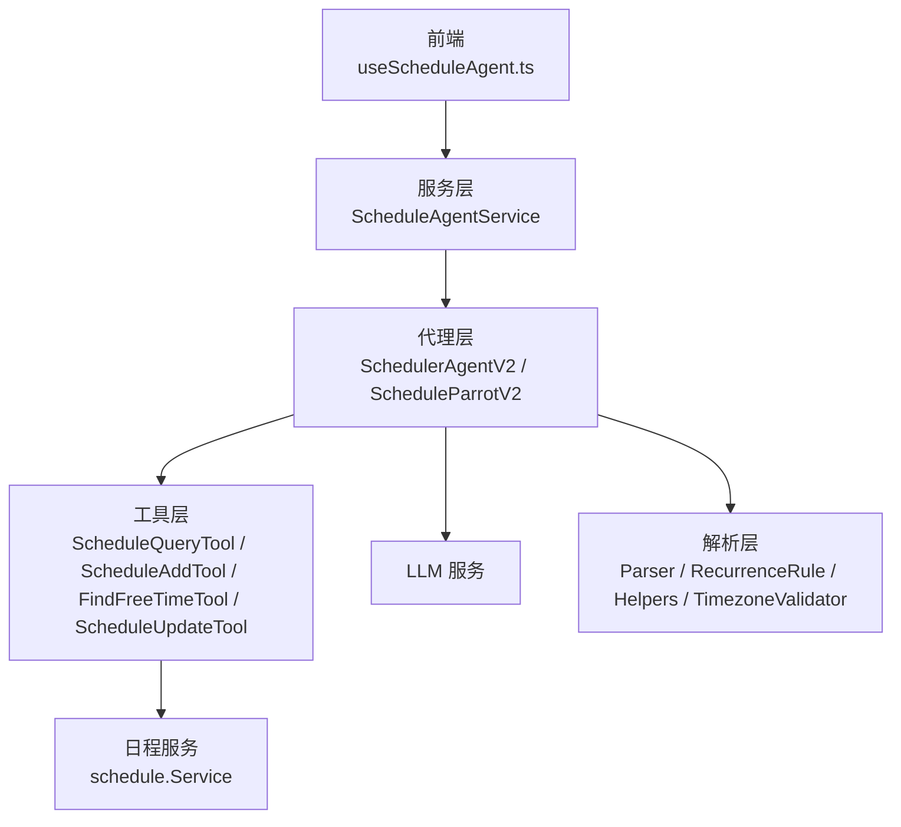
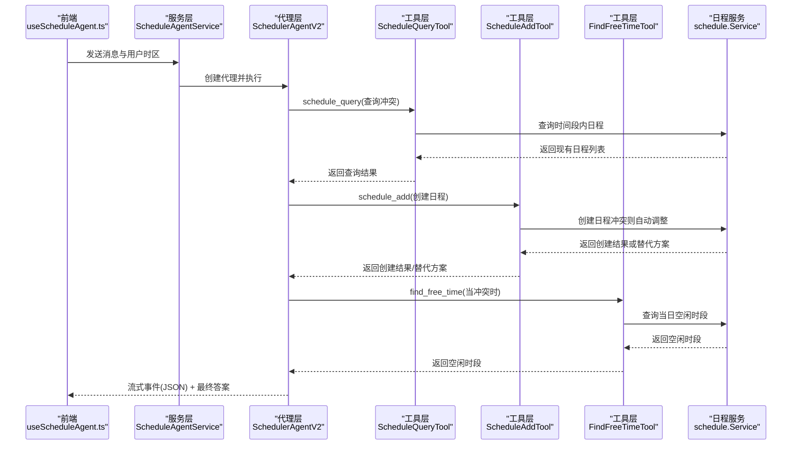
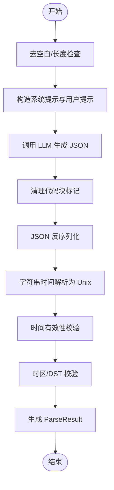
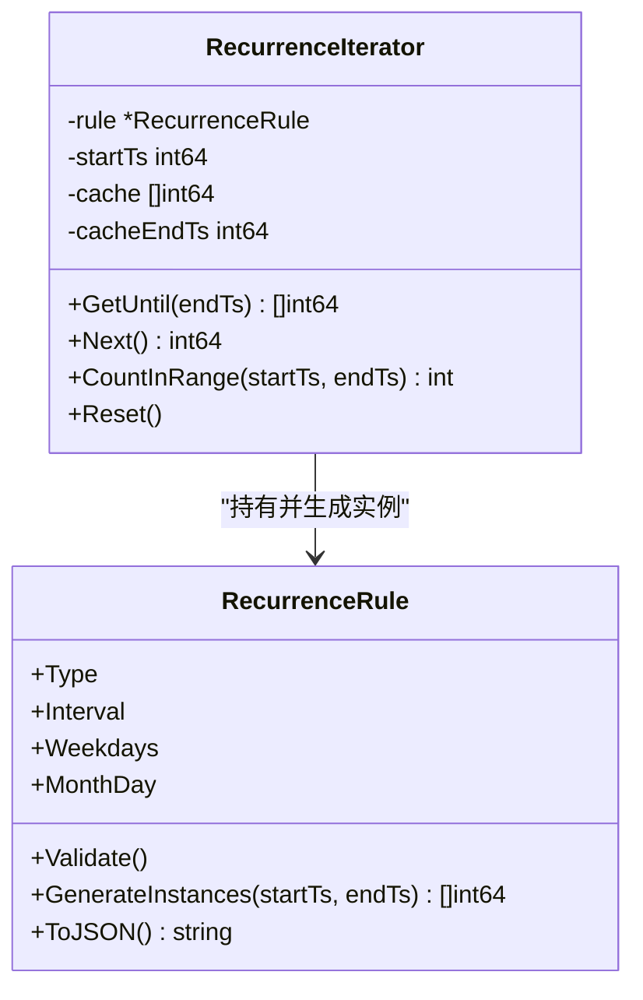
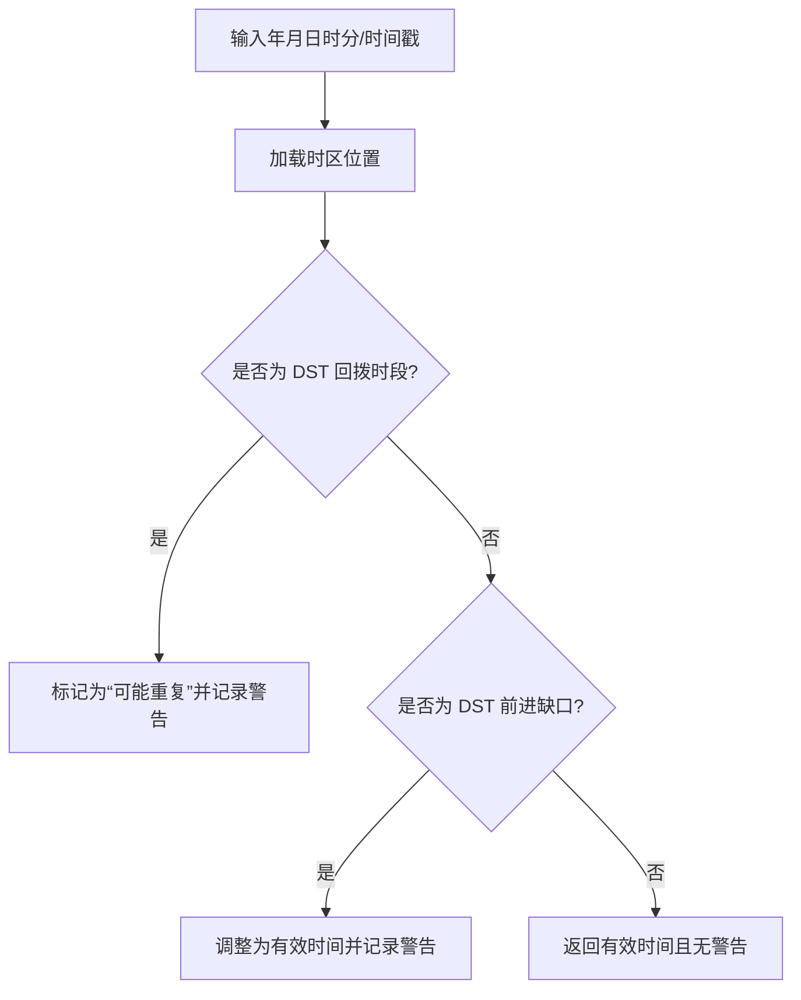
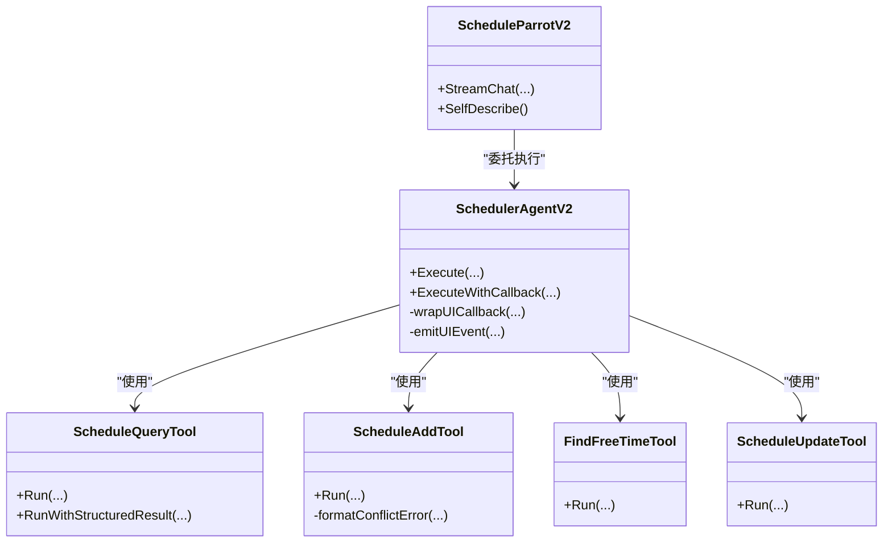
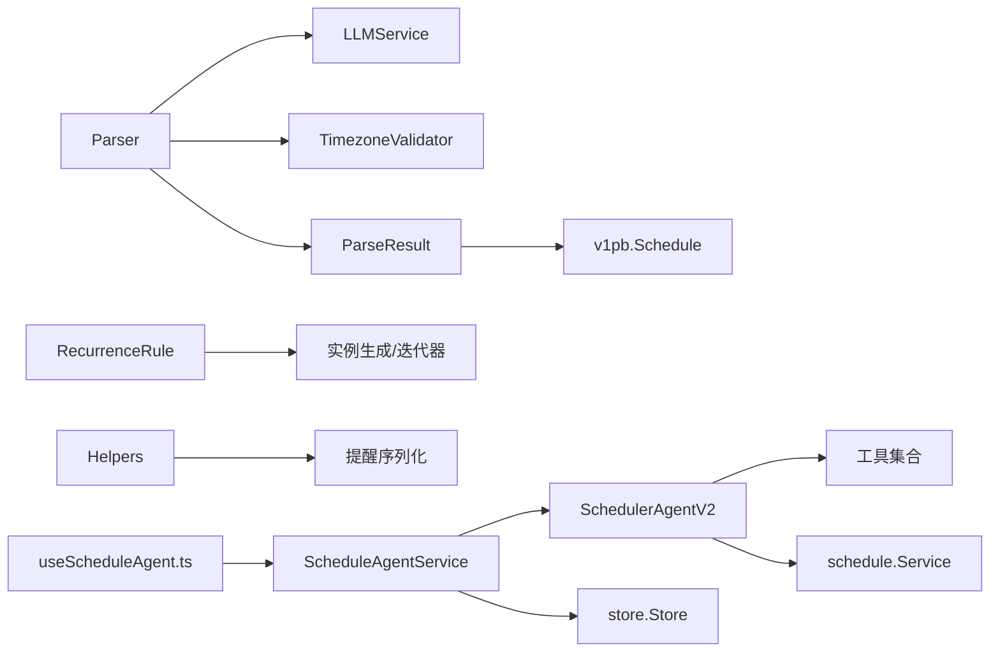

# AI 日程集成

<cite>
**本文引用的文件**
- [plugin/ai/schedule/parser.go](file://plugin/ai/schedule/parser.go)
- [plugin/ai/schedule/recurrence.go](file://plugin/ai/schedule/recurrence.go)
- [plugin/ai/schedule/helpers.go](file://plugin/ai/schedule/helpers.go)
- [plugin/ai/schedule/timezone_validator.go](file://plugin/ai/schedule/timezone_validator.go)
- [plugin/ai/agent/scheduler_v2.go](file://plugin/ai/agent/scheduler_v2.go)
- [plugin/ai/agent/schedule_parrot_v2.go](file://plugin/ai/agent/schedule_parrot_v2.go)
- [plugin/ai/agent/types.go](file://plugin/ai/agent/types.go)
- [plugin/ai/agent/tools/scheduler.go](file://plugin/ai/agent/tools/scheduler.go)
- [server/router/api/v1/schedule_agent_service.go](file://server/router/api/v1/schedule_agent_service.go)
- [web/src/hooks/useScheduleAgent.ts](file://web/src/hooks/useScheduleAgent.ts)
- [plugin/ai/schedule/recurrence_test.go](file://plugin/ai/schedule/recurrence_test.go)
- [plugin/ai/schedule/helpers_test.go](file://plugin/ai/schedule/helpers_test.go)
</cite>

## 目录
1. [简介](#简介)
2. [项目结构](#项目结构)
3. [核心组件](#核心组件)
4. [架构总览](#架构总览)
5. [详细组件分析](#详细组件分析)
6. [依赖关系分析](#依赖关系分析)
7. [性能考量](#性能考量)
8. [故障排查指南](#故障排查指南)
9. [结论](#结论)
10. [附录](#附录)

## 简介
本文件系统化梳理 AI 日程集成模块，围绕“自然语言日程解析”的算法与实现进行深入说明，覆盖以下关键主题：
- 自然语言时间表达的识别、解析与标准化流程
- 重复规则的识别、转换与实例生成机制
- 时区处理与 DST 边界情况校验
- 提醒项的序列化与反序列化
- AI 解析器的准确性优化策略、错误恢复与用户反馈机制
- 使用示例与前后端集成指南

## 项目结构
该模块采用分层设计：
- 前端层：通过钩子与服务客户端发起请求，接收流式事件并渲染 UI 工具事件
- 服务层：ScheduleAgentService 负责接入 LLM、上下文管理与事件流转发
- AI 代理层：SchedulerAgentV2 与 ScheduleParrotV2 组合，基于原生工具调用框架
- 工具层：ScheduleQueryTool、ScheduleAddTool、FindFreeTimeTool、ScheduleUpdateTool
- 日程解析层：Parser（基于 LLM 的自然语言解析）、RecurrenceRule（重复规则）、Helpers（提醒序列化）、TimezoneValidator（时区校验）

**图表来源**
- [server/router/api/v1/schedule_agent_service.go](file://server/router/api/v1/schedule_agent_service.go#L33-L53)
- [plugin/ai/agent/scheduler_v2.go](file://plugin/ai/agent/scheduler_v2.go#L16-L91)
- [plugin/ai/agent/schedule_parrot_v2.go](file://plugin/ai/agent/schedule_parrot_v2.go#L9-L24)
- [plugin/ai/agent/tools/scheduler.go](file://plugin/ai/agent/tools/scheduler.go#L132-L1076)
- [plugin/ai/schedule/parser.go](file://plugin/ai/schedule/parser.go#L21-L47)

**章节来源**
- [server/router/api/v1/schedule_agent_service.go](file://server/router/api/v1/schedule_agent_service.go#L33-L53)
- [plugin/ai/agent/scheduler_v2.go](file://plugin/ai/agent/scheduler_v2.go#L16-L91)
- [plugin/ai/agent/schedule_parrot_v2.go](file://plugin/ai/agent/schedule_parrot_v2.go#L9-L24)
- [plugin/ai/agent/tools/scheduler.go](file://plugin/ai/agent/tools/scheduler.go#L132-L1076)
- [plugin/ai/schedule/parser.go](file://plugin/ai/schedule/parser.go#L21-L47)

## 核心组件
- Parser：面向自然语言的日程解析器，负责将用户输入转化为结构化 Schedule，内置严格的时间格式要求与验证逻辑
- RecurrenceRule：重复规则模型与生成器，支持每日/每周/每月三种模式，提供迭代器与实例生成
- Helpers：提醒项的 JSON 序列化与反序列化工具
- TimezoneValidator：时区与 DST 边界校验器，确保时间有效性与一致性
- SchedulerAgentV2 / ScheduleParrotV2：基于原生工具调用的智能体，封装工具链与 UI 事件
- ScheduleAgentService：RPC/Stream 服务入口，负责上下文管理与事件流转发
- 前端 useScheduleAgent：提供非流式与流式聊天钩子，解析 UI 工具事件并驱动界面交互

**章节来源**
- [plugin/ai/schedule/parser.go](file://plugin/ai/schedule/parser.go#L21-L60)
- [plugin/ai/schedule/recurrence.go](file://plugin/ai/schedule/recurrence.go#L40-L75)
- [plugin/ai/schedule/helpers.go](file://plugin/ai/schedule/helpers.go#L10-L32)
- [plugin/ai/schedule/timezone_validator.go](file://plugin/ai/schedule/timezone_validator.go#L21-L39)
- [plugin/ai/agent/scheduler_v2.go](file://plugin/ai/agent/scheduler_v2.go#L16-L91)
- [plugin/ai/agent/schedule_parrot_v2.go](file://plugin/ai/agent/schedule_parrot_v2.go#L9-L24)
- [server/router/api/v1/schedule_agent_service.go](file://server/router/api/v1/schedule_agent_service.go#L33-L53)
- [web/src/hooks/useScheduleAgent.ts](file://web/src/hooks/useScheduleAgent.ts#L1-L235)

## 架构总览
AI 日程解析的整体流程如下：
- 前端通过非流式或流式接口提交用户输入
- 服务层构建上下文并创建 SchedulerAgentV2
- 代理层根据用户意图调用工具（查询/新增/找空闲/更新）
- 工具层与数据库交互，必要时触发冲突检测与自动调整
- 代理层将中间事件（思考、工具调用、结果）以 JSON 形式回传前端
- Parser 在需要时被工具调用以解析自然语言并生成结构化日程

**图表来源**
- [server/router/api/v1/schedule_agent_service.go](file://server/router/api/v1/schedule_agent_service.go#L96-L260)
- [plugin/ai/agent/scheduler_v2.go](file://plugin/ai/agent/scheduler_v2.go#L175-L196)
- [plugin/ai/agent/tools/scheduler.go](file://plugin/ai/agent/tools/scheduler.go#L132-L1076)

**章节来源**
- [server/router/api/v1/schedule_agent_service.go](file://server/router/api/v1/schedule_agent_service.go#L96-L260)
- [plugin/ai/agent/scheduler_v2.go](file://plugin/ai/agent/scheduler_v2.go#L175-L196)
- [plugin/ai/agent/tools/scheduler.go](file://plugin/ai/agent/tools/scheduler.go#L132-L1076)

## 详细组件分析

### 自然语言日程解析器（Parser）
- 输入预处理与长度限制：去除首尾空白，限制最大字符数
- LLM Prompt 设计：明确 UTC 时间输出、相对日期计算步骤、全天事件判定、时长计算规则、重复模式提取、标题清洗规则、提醒提取规则与校验清单
- JSON 输出解析：清理代码块标记，反序列化为中间结构，再转为 ParseResult
- 时间解析与验证：字符串时间解析为 Unix 秒；禁止过久远过去时间；结束时间不得早于开始时间；必要时回退默认值
- 时区校验：通过 TimezoneValidator 对起止时间范围进行 DST 边界校验，记录警告但继续执行

**图表来源**
- [plugin/ai/schedule/parser.go](file://plugin/ai/schedule/parser.go#L63-L348)

**章节来源**
- [plugin/ai/schedule/parser.go](file://plugin/ai/schedule/parser.go#L63-L348)

### 重复规则识别与生成（RecurrenceRule）
- 支持模式：每日（含间隔）、每周（可指定工作日集合或间隔）、每月（按月内某日）
- 规则校验：类型合法性、间隔正数、周规则需有效工作日集合、月规则需合法日期
- 实例生成：统一以 UTC 计算，防止无限循环设置上限；每周匹配目标工作日；每月按月末调整
- 迭代器：RecurrenceIterator 提供惰性生成与缓存，支持 GetUntil/Next/CountInRange，避免一次性生成大量实例

**图表来源**
- [plugin/ai/schedule/recurrence.go](file://plugin/ai/schedule/recurrence.go#L40-L75)
- [plugin/ai/schedule/recurrence.go](file://plugin/ai/schedule/recurrence.go#L341-L363)

**章节来源**
- [plugin/ai/schedule/recurrence.go](file://plugin/ai/schedule/recurrence.go#L77-L149)
- [plugin/ai/schedule/recurrence.go](file://plugin/ai/schedule/recurrence.go#L151-L282)
- [plugin/ai/schedule/recurrence.go](file://plugin/ai/schedule/recurrence.go#L341-L557)

### 时区处理与 DST 校验（TimezoneValidator）
- 校验单个时间：处理夏令时跳变导致的无效时间（春季前进缺口）与重复时间（秋季回拨），给出警告并返回有效时间
- 时间戳校验：将 Unix 时间转换为本地时间后复核
- 时间段校验：同时校验起止时间，汇总警告
- 过渡检测：扫描指定时间范围内的 DST 转换事件，便于进一步分析

**图表来源**
- [plugin/ai/schedule/timezone_validator.go](file://plugin/ai/schedule/timezone_validator.go#L41-L96)
- [plugin/ai/schedule/timezone_validator.go](file://plugin/ai/schedule/timezone_validator.go#L110-L129)

**章节来源**
- [plugin/ai/schedule/timezone_validator.go](file://plugin/ai/schedule/timezone_validator.go#L41-L96)
- [plugin/ai/schedule/timezone_validator.go](file://plugin/ai/schedule/timezone_validator.go#L110-L168)

### 提醒项序列化（Helpers）
- MarshalReminders：将 Protobuf 提醒数组序列化为 JSON 字符串
- UnmarshalReminders：将 JSON 字符串反序列化为 Protobuf 提醒数组
- 为空时返回空字符串，便于存储与传输

**章节来源**
- [plugin/ai/schedule/helpers.go](file://plugin/ai/schedule/helpers.go#L10-L32)

### AI 代理与工具链（SchedulerAgentV2 / ScheduleParrotV2 / Tools）
- SchedulerAgentV2：创建工具集合（查询/新增/找空闲/更新），构建系统提示，执行多轮对话，注入 UI 事件（日程建议、冲突解决、时间槽选择等）
- ScheduleParrotV2：对 V2 代理的轻量封装，提供流式聊天入口与自描述信息
- 工具层：
  - ScheduleQueryTool：按时间范围查询日程，返回人类可读列表
  - ScheduleAddTool：创建日程，若冲突则自动寻找替代时间并返回结构化替代方案
  - FindFreeTimeTool：在用户指定日期内查找 1 小时空闲时段
  - ScheduleUpdateTool：按 ID 或日期查找并更新日程，保持未提供字段不变
- 时区缓存：工具层对时区位置进行缓存，限制大小以防止资源滥用

**图表来源**
- [plugin/ai/agent/scheduler_v2.go](file://plugin/ai/agent/scheduler_v2.go#L16-L91)
- [plugin/ai/agent/schedule_parrot_v2.go](file://plugin/ai/agent/schedule_parrot_v2.go#L9-L24)
- [plugin/ai/agent/tools/scheduler.go](file://plugin/ai/agent/tools/scheduler.go#L132-L1076)

**章节来源**
- [plugin/ai/agent/scheduler_v2.go](file://plugin/ai/agent/scheduler_v2.go#L175-L371)
- [plugin/ai/agent/schedule_parrot_v2.go](file://plugin/ai/agent/schedule_parrot_v2.go#L31-L102)
- [plugin/ai/agent/tools/scheduler.go](file://plugin/ai/agent/tools/scheduler.go#L132-L1076)

### 服务端接入与事件流（ScheduleAgentService）
- 非流式 Chat：创建代理并执行，返回最终文本
- 流式 ChatStream：维护会话上下文，将代理事件（思考、工具调用、结果、答案、错误）以 JSON 形式发送；在创建成功时追加 schedule_updated 事件；对响应进行工具调用语法清理
- 成功关键字检测：识别工具结果中的成功提示，触发前端刷新

**章节来源**
- [server/router/api/v1/schedule_agent_service.go](file://server/router/api/v1/schedule_agent_service.go#L55-L94)
- [server/router/api/v1/schedule_agent_service.go](file://server/router/api/v1/schedule_agent_service.go#L96-L260)

### 前端集成与 UI 工具事件（useScheduleAgent.ts）
- 非流式：拼接历史与当前消息，调用服务端 Chat
- 流式：解析事件 JSON，区分普通事件与 UI 工具事件（日程建议、时间槽选择、冲突解决、快捷操作），并提供类型安全的数据结构
- 事件类型：EventTypeUIScheduleSuggestion / EventTypeUITimeSlotPicker / EventTypeUIConflictResolution / EventTypeUIQuickActions

**章节来源**
- [web/src/hooks/useScheduleAgent.ts](file://web/src/hooks/useScheduleAgent.ts#L1-L235)
- [plugin/ai/agent/types.go](file://plugin/ai/agent/types.go#L117-L139)

## 依赖关系分析
- Parser 依赖 LLMService 与 TimezoneValidator，输出 ParseResult 并可转为 v1pb.Schedule
- RecurrenceRule 与 Helpers 作为解析与序列化支撑
- SchedulerAgentV2 依赖工具集合与 schedule.Service
- ScheduleAgentService 依赖 LLM 与 store，桥接前端与代理层
- 前端 useScheduleAgent 依赖服务客户端，解析 UI 工具事件

**图表来源**
- [plugin/ai/schedule/parser.go](file://plugin/ai/schedule/parser.go#L22-L46)
- [plugin/ai/schedule/recurrence.go](file://plugin/ai/schedule/recurrence.go#L305-L323)
- [plugin/ai/agent/scheduler_v2.go](file://plugin/ai/agent/scheduler_v2.go#L58-L90)
- [server/router/api/v1/schedule_agent_service.go](file://server/router/api/v1/schedule_agent_service.go#L43-L52)
- [web/src/hooks/useScheduleAgent.ts](file://web/src/hooks/useScheduleAgent.ts#L1-L235)

**章节来源**
- [plugin/ai/schedule/parser.go](file://plugin/ai/schedule/parser.go#L22-L46)
- [plugin/ai/schedule/recurrence.go](file://plugin/ai/schedule/recurrence.go#L305-L323)
- [plugin/ai/agent/scheduler_v2.go](file://plugin/ai/agent/scheduler_v2.go#L58-L90)
- [server/router/api/v1/schedule_agent_service.go](file://server/router/api/v1/schedule_agent_service.go#L43-L52)
- [web/src/hooks/useScheduleAgent.ts](file://web/src/hooks/useScheduleAgent.ts#L1-L235)

## 性能考量
- 重复规则实例生成限制：每日最多 1000 个、每周最多 520 个、每月最多 120 个，防止内存与 CPU 泄漏
- RecurrenceIterator 惰性生成与缓存：按需扩展缓存，限制最大缓存条目，提升频繁查询场景下的响应速度
- 工具层时区缓存：限制缓存大小，避免恶意输入导致内存膨胀；默认保留常用时区
- 事件流清理：服务端对响应中的工具调用语法进行清理，减少前端解析负担

**章节来源**
- [plugin/ai/schedule/recurrence.go](file://plugin/ai/schedule/recurrence.go#L195-L215)
- [plugin/ai/schedule/recurrence.go](file://plugin/ai/schedule/recurrence.go#L341-L363)
- [plugin/ai/agent/tools/scheduler.go](file://plugin/ai/agent/tools/scheduler.go#L30-L94)
- [server/router/api/v1/schedule_agent_service.go](file://server/router/api/v1/schedule_agent_service.go#L216-L230)

## 故障排查指南
- LLM 输出异常
  - 现象：JSON 解析失败或字段缺失
  - 处理：检查 Prompt 中的输出格式约束与校验清单；确认 LLM 返回中不含代码块外层包裹
- 时间解析错误
  - 现象：起始时间早于允许的最早时间或结束时间早于开始时间
  - 处理：确认用户输入的相对时间与本地时区；检查 TimezoneValidator 的警告日志
- 冲突与替代方案
  - 现象：创建日程失败并返回替代时间
  - 处理：前端监听冲突事件，引导用户选择替代时间或取消
- 重复规则无效
  - 现象：解析“每小时”等不支持的模式
  - 处理：确认输入符合每日/每周/每月模式；参考单元测试用例

**章节来源**
- [plugin/ai/schedule/parser.go](file://plugin/ai/schedule/parser.go#L272-L323)
- [plugin/ai/agent/tools/scheduler.go](file://plugin/ai/agent/tools/scheduler.go#L527-L648)
- [plugin/ai/schedule/recurrence.go](file://plugin/ai/schedule/recurrence.go#L77-L149)

## 结论
本模块通过“LLM + 工具链 + 时区校验 + 重复规则生成”的组合，实现了高鲁棒性的自然语言日程解析与管理。其关键优势包括：
- 明确的输出规范与严格的校验，降低解析歧义
- 完整的重复规则与实例生成，满足常见周期性场景
- 时区与 DST 的边界处理，保障跨时区一致性
- 事件驱动的 UI 工具事件，增强用户体验与可解释性

## 附录

### 使用示例与集成指南
- 前端非流式调用
  - 使用 useScheduleAgentChat，传入 message 与 userTimezone，成功后刷新日程列表
- 前端流式调用
  - 使用 scheduleAgentChatStream，逐条解析事件；识别 UI 工具事件并渲染相应 UI
- 服务端接入
  - 通过 ScheduleAgentService.Chat 或 ChatStream 接收请求，内部创建代理并执行
- 工具链调用
  - 查询冲突：schedule_query
  - 新增日程：schedule_add（冲突时自动寻找替代）
  - 查找空闲：find_free_time
  - 更新日程：schedule_update

**章节来源**
- [web/src/hooks/useScheduleAgent.ts](file://web/src/hooks/useScheduleAgent.ts#L101-L133)
- [web/src/hooks/useScheduleAgent.ts](file://web/src/hooks/useScheduleAgent.ts#L200-L234)
- [server/router/api/v1/schedule_agent_service.go](file://server/router/api/v1/schedule_agent_service.go#L55-L94)
- [plugin/ai/agent/tools/scheduler.go](file://plugin/ai/agent/tools/scheduler.go#L132-L1076)

### 单元测试要点
- 重复规则解析：覆盖每日/每周/每月与无效输入
- 实例生成：每日/每周/每月边界与间隔
- 提醒序列化：空/单个/多个提醒的往返一致性
- 匹配工作日：默认工作日集合与不变性保证

**章节来源**
- [plugin/ai/schedule/recurrence_test.go](file://plugin/ai/schedule/recurrence_test.go#L11-L121)
- [plugin/ai/schedule/recurrence_test.go](file://plugin/ai/schedule/recurrence_test.go#L123-L194)
- [plugin/ai/schedule/recurrence_test.go](file://plugin/ai/schedule/recurrence_test.go#L160-L184)
- [plugin/ai/schedule/helpers_test.go](file://plugin/ai/schedule/helpers_test.go#L11-L77)
- [plugin/ai/schedule/helpers_test.go](file://plugin/ai/schedule/helpers_test.go#L157-L180)