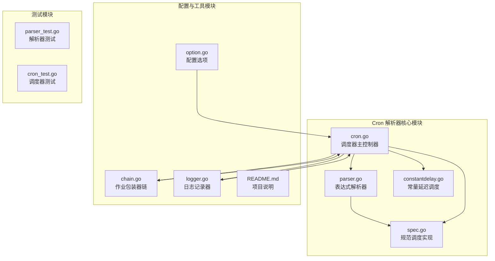
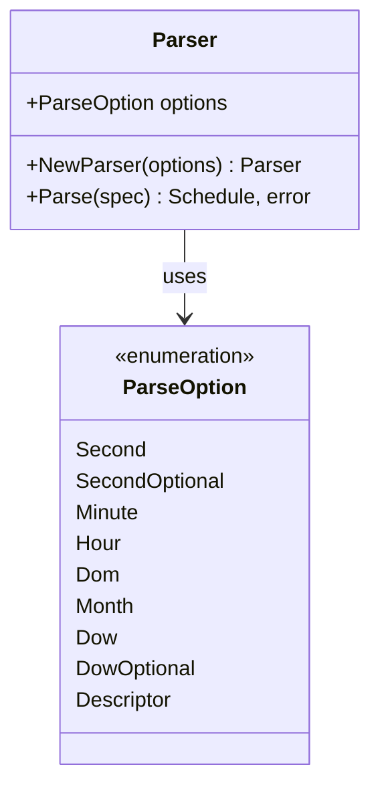
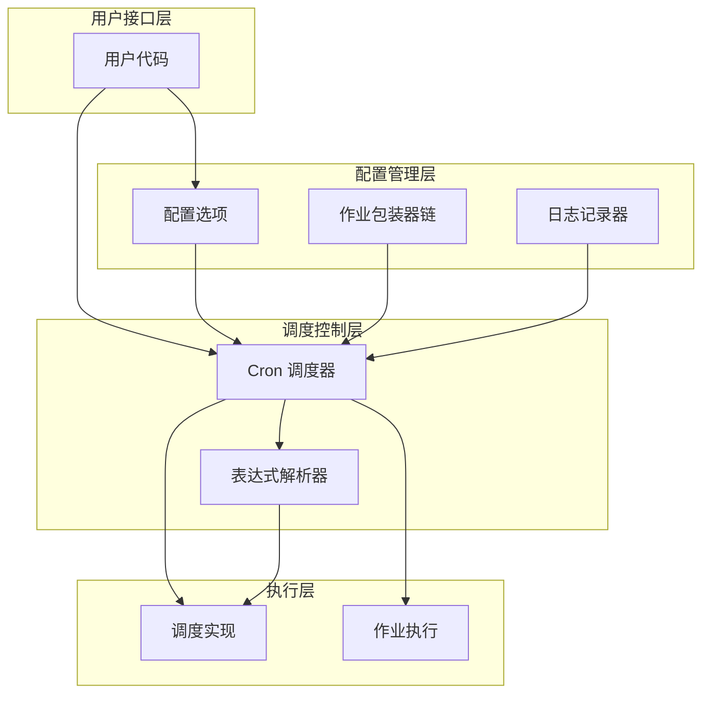
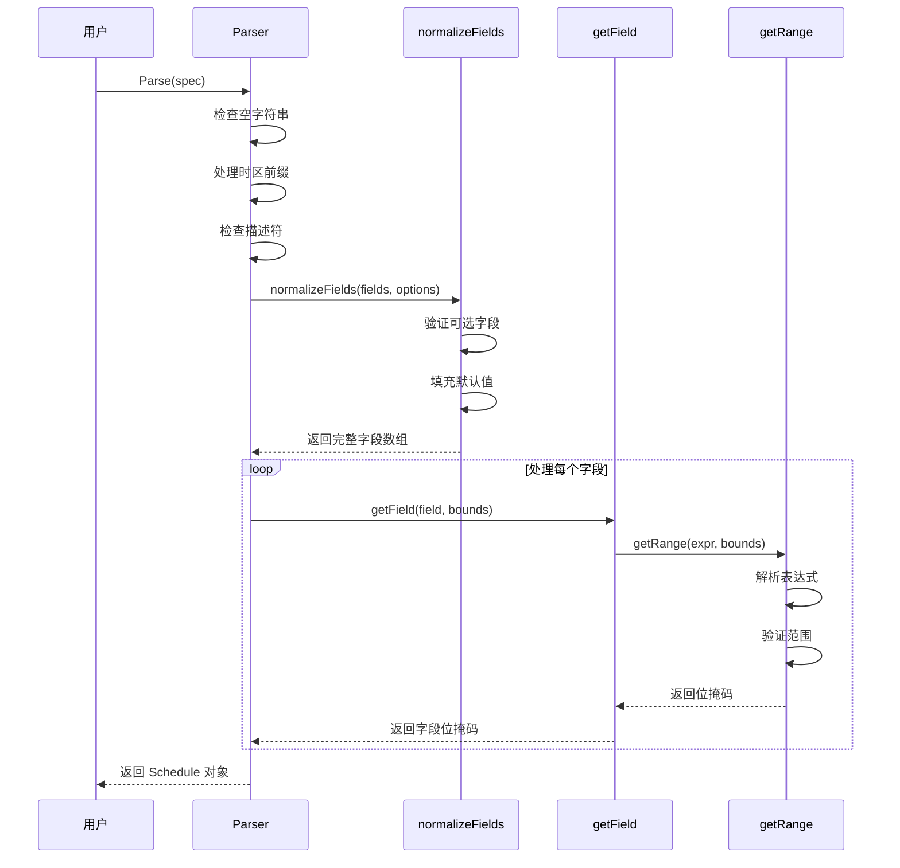
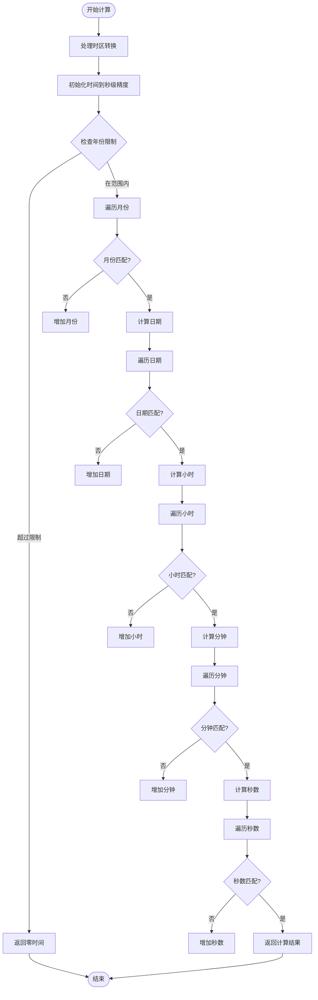
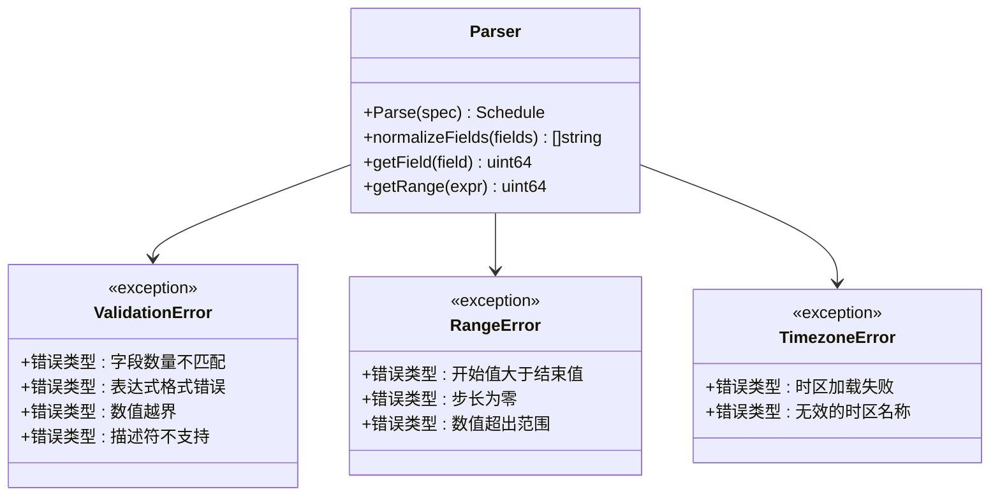
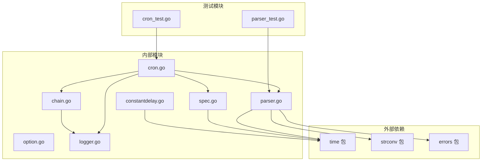

# Cron 表达式解析器

<cite>
**本文档引用的文件**
- [parser.go](file://plugin/cron/parser.go)
- [cron.go](file://plugin/cron/cron.go)
- [spec.go](file://plugin/cron/spec.go)
- [option.go](file://plugin/cron/option.go)
- [chain.go](file://plugin/cron/chain.go)
- [constantdelay.go](file://plugin/cron/constantdelay.go)
- [logger.go](file://plugin/cron/logger.go)
- [README.md](file://plugin/cron/README.md)
- [parser_test.go](file://plugin/cron/parser_test.go)
- [cron_test.go](file://plugin/cron/cron_test.go)
</cite>

## 目录
1. [简介](#简介)
2. [项目结构](#项目结构)
3. [核心组件](#核心组件)
4. [架构概览](#架构概览)
5. [详细组件分析](#详细组件分析)
6. [依赖关系分析](#依赖关系分析)
7. [性能考虑](#性能考虑)
8. [故障排除指南](#故障排除指南)
9. [结论](#结论)

## 简介

Cron 表达式解析器是一个基于 Go 语言实现的高性能任务调度系统，支持标准的 Cron 表达式语法以及扩展的时间描述符。该解析器提供了灵活的配置选项，可以处理秒级精度的任务调度，并支持时区转换、错误处理和日志记录等高级功能。

本解析器从 robfig/cron 项目派生而来，经过优化和增强，提供了更丰富的功能集和更好的性能表现。

## 项目结构

Cron 解析器位于 `plugin/cron` 目录中，采用模块化设计，主要包含以下核心文件：



**图表来源**
- [parser.go](file://plugin/cron/parser.go#L1-L438)
- [cron.go](file://plugin/cron/cron.go#L1-L354)
- [spec.go](file://plugin/cron/spec.go#L1-L189)

**章节来源**
- [parser.go](file://plugin/cron/parser.go#L1-L50)
- [cron.go](file://plugin/cron/cron.go#L1-L131)
- [README.md](file://plugin/cron/README.md#L1-L2)

## 核心组件

### 解析器 (Parser)

解析器是 Cron 表达式的核心处理组件，负责将字符串形式的 Cron 表达式转换为可执行的调度对象。

#### 主要特性
- 支持标准 Cron 表达式格式
- 可配置的字段选择（秒、分钟、小时、日期、月份、星期）
- 描述符支持（@yearly、@monthly、@weekly 等）
- 时区处理和验证
- 错误处理和验证

#### 配置选项


**图表来源**
- [parser.go](file://plugin/cron/parser.go#L16-L28)
- [parser.go](file://plugin/cron/parser.go#L49-L51)

### 规范调度 (SpecSchedule)

规范调度实现了标准 Cron 调度逻辑，使用位掩码来高效表示时间范围。

#### 数据结构
- `Second`: 秒字段位掩码（0-59）
- `Minute`: 分钟字段位掩码（0-59）  
- `Hour`: 小时字段位掩码（0-23）
- `Dom`: 月内日期位掩码（1-31）
- `Month`: 月份位掩码（1-12）
- `Dow`: 星期位掩码（0-6）

**章节来源**
- [spec.go](file://plugin/cron/spec.go#L7-L12)
- [spec.go](file://plugin/cron/spec.go#L21-L49)

## 架构概览

Cron 解析器采用分层架构设计，各组件职责明确，耦合度低：



**图表来源**
- [cron.go](file://plugin/cron/cron.go#L13-L27)
- [option.go](file://plugin/cron/option.go#L7-L46)
- [chain.go](file://plugin/cron/chain.go#L11-L39)

## 详细组件分析

### 表达式解析流程

解析器采用分阶段处理策略，确保表达式的正确性和完整性：



**图表来源**
- [parser.go](file://plugin/cron/parser.go#L88-L153)
- [parser.go](file://plugin/cron/parser.go#L160-L215)
- [parser.go](file://plugin/cron/parser.go#L236-L320)

### 时间计算逻辑

规范调度器实现了精确的时间计算算法，支持复杂的日期和时间匹配：



**图表来源**
- [spec.go](file://plugin/cron/spec.go#L58-L175)

### 错误处理机制

解析器提供了全面的错误处理和验证机制：



**图表来源**
- [parser.go](file://plugin/cron/parser.go#L89-L121)
- [parser.go](file://plugin/cron/parser.go#L264-L317)

**章节来源**
- [parser.go](file://plugin/cron/parser.go#L88-L153)
- [spec.go](file://plugin/cron/spec.go#L58-L175)

### 配置选项详解

#### 位置配置
```go
// 设置时区
WithLocation(loc *time.Location) Option

// 默认时区为本地时间
Default: time.Local
```

#### 秒字段配置
```go
// 启用秒字段支持
WithSeconds() Option

// 使用自定义解析器
WithParser(p ScheduleParser) Option
```

#### 作业包装器配置
```go
// 恢复作业中的恐慌
Recover(logger Logger) JobWrapper

// 序列化作业执行（延迟直到前一个完成）
DelayIfStillRunning(logger Logger) JobWrapper

// 跳过仍在运行的作业
SkipIfStillRunning(logger Logger) JobWrapper
```

**章节来源**
- [option.go](file://plugin/cron/option.go#L10-L46)
- [chain.go](file://plugin/cron/chain.go#L42-L96)

## 依赖关系分析

Cron 解析器的依赖关系清晰且模块化：



**图表来源**
- [parser.go](file://plugin/cron/parser.go#L3-L10)
- [cron.go](file://plugin/cron/cron.go#L3-L8)

**章节来源**
- [parser.go](file://plugin/cron/parser.go#L1-L10)
- [cron.go](file://plugin/cron/cron.go#L1-L8)

## 性能考虑

### 位掩码优化
解析器使用位掩码来表示时间范围，提供 O(1) 的匹配性能：

- **内存效率**: 每个字段使用 64 位无符号整数
- **计算效率**: 位操作比传统循环更快
- **空间复杂度**: O(1) - 固定大小的数据结构

### 时间复杂度分析
- **解析阶段**: O(n) - n 为表达式长度
- **匹配阶段**: O(1) - 固定时间复杂度
- **内存使用**: O(1) - 固定大小的调度对象

### 并发安全
- 使用互斥锁保护共享状态
- 支持多线程安全的作业添加和移除
- 无阻塞的日志记录机制

## 故障排除指南

### 常见错误及解决方案

#### 表达式解析错误
| 错误类型 | 可能原因 | 解决方案 |
|---------|---------|---------|
| 空表达式 | 传入空字符串 | 提供有效的 Cron 表达式 |
| 字段数量错误 | 字段过多或过少 | 检查标准格式：`* * * * *` |
| 数值越界 | 数值超出允许范围 | 调整到有效范围（秒0-59，分钟0-59等） |
| 描述符不支持 | 启用了描述符但未配置 | 使用 `Descriptor` 选项 |

#### 时区相关问题
```go
// 正确设置时区的方法
parser := NewParser(Second | Minute | Hour | Dom | Month | Dow | Descriptor)
parser = NewParser(Second | Minute | Hour | Dom | Month | DowOptional | Descriptor)
```

#### 性能问题诊断
- **内存泄漏**: 检查是否正确停止 Cron 实例
- **CPU 占用过高**: 验证表达式复杂度，避免过于频繁的调度
- **并发冲突**: 确保作业包装器的正确使用

**章节来源**
- [parser_test.go](file://plugin/cron/parser_test.go#L122-L139)
- [cron_test.go](file://plugin/cron/cron_test.go#L42-L84)

## 结论

Cron 表达式解析器是一个功能完整、性能优异的任务调度系统。其设计特点包括：

### 主要优势
- **灵活性**: 支持多种配置选项和扩展功能
- **性能**: 基于位掩码的高效匹配算法
- **可靠性**: 全面的错误处理和验证机制
- **可扩展性**: 模块化的架构设计，易于扩展

### 技术特色
- **秒级精度**: 支持完整的 Cron 表达式格式
- **时区支持**: 完善的时区处理和转换机制
- **并发安全**: 多线程环境下的稳定运行
- **日志记录**: 可配置的日志记录和调试功能

### 应用场景
- 定时任务调度
- 数据备份和清理
- 报表生成和发送
- 系统维护和监控
- 业务逻辑定时执行

该解析器为 Go 语言生态系统提供了强大而可靠的 Cron 功能，适合各种规模的应用程序使用。