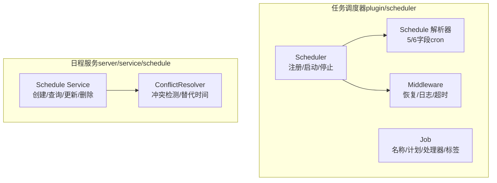
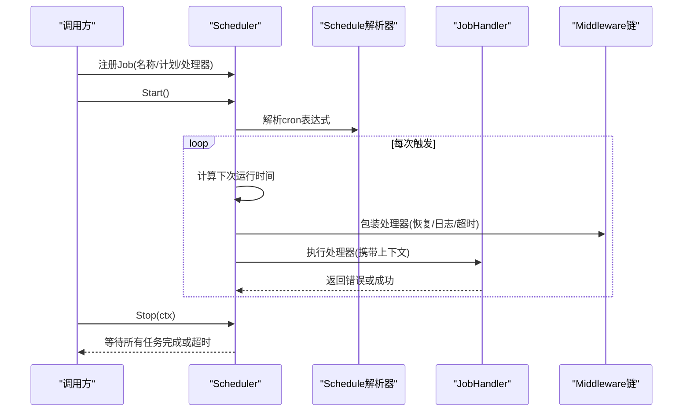
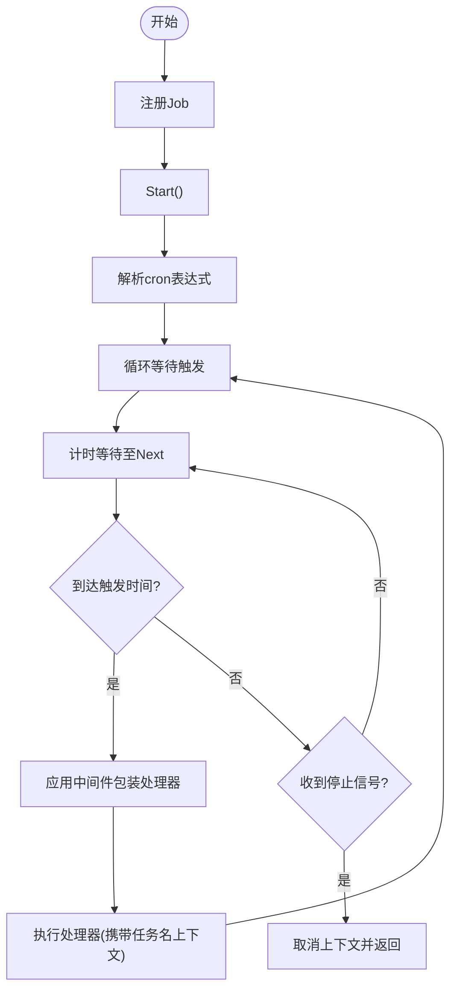
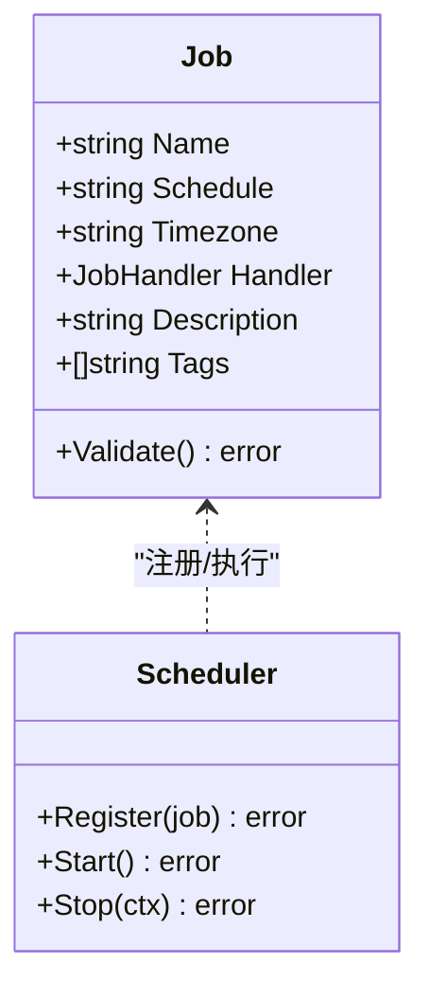
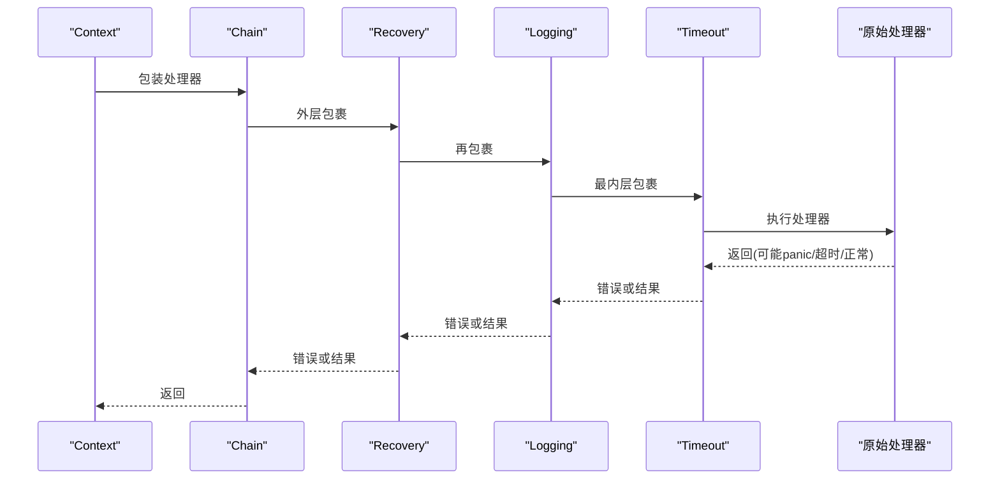
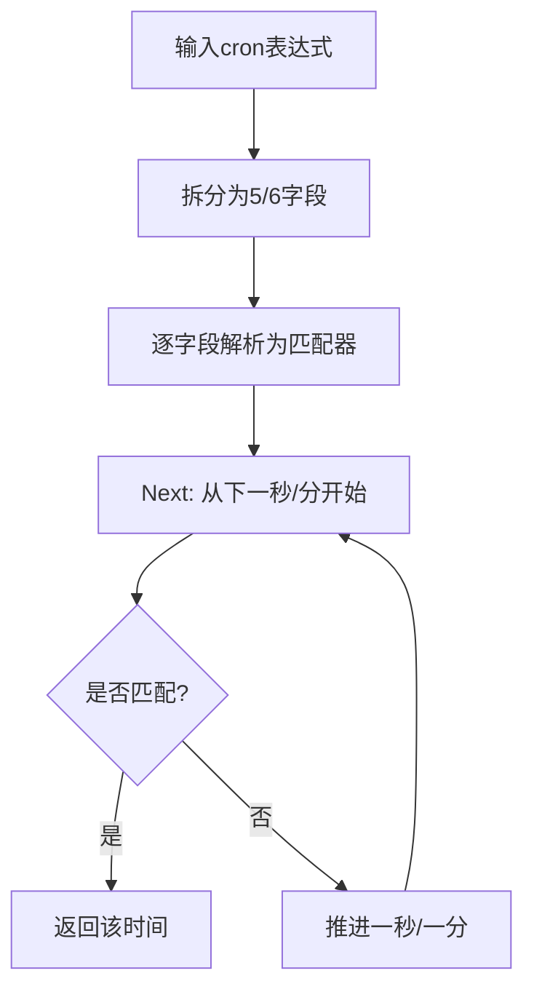
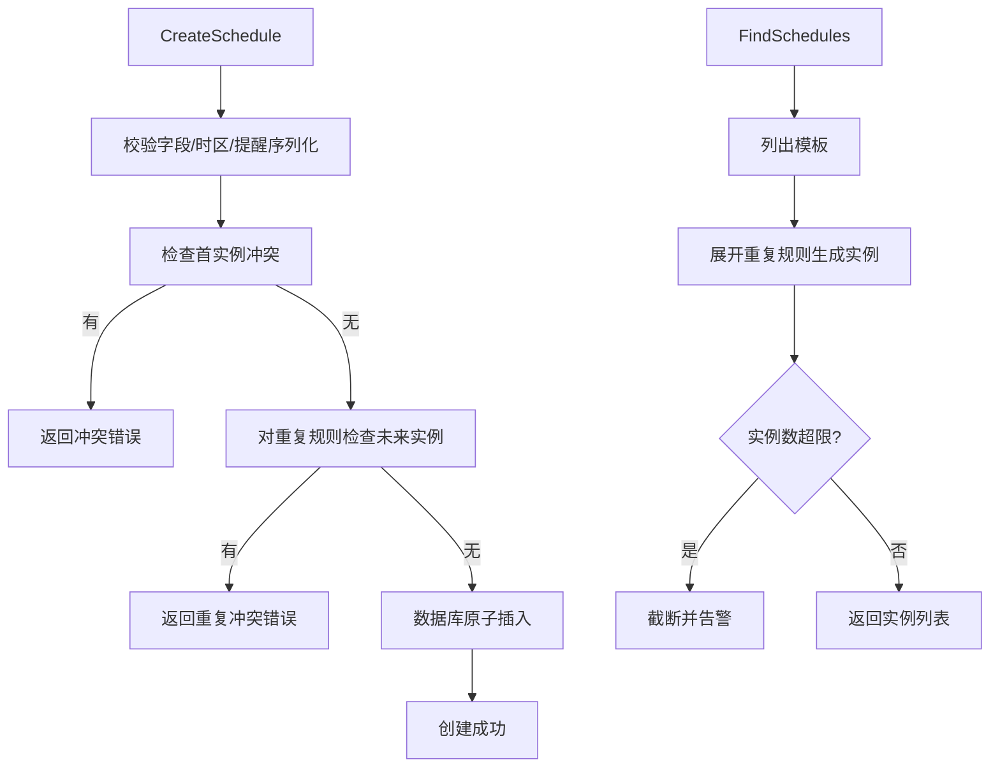
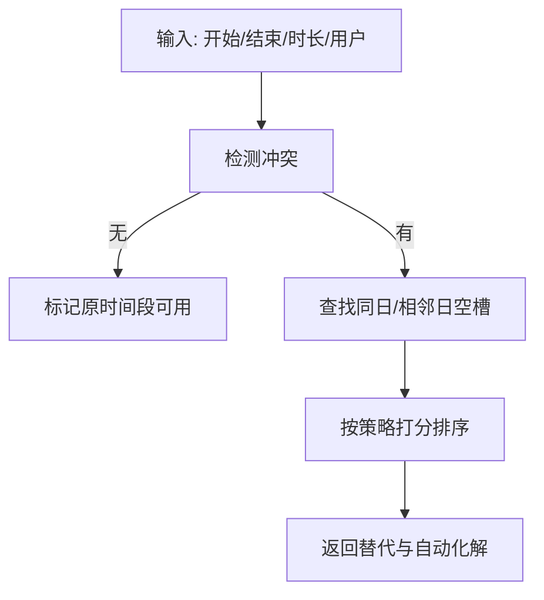
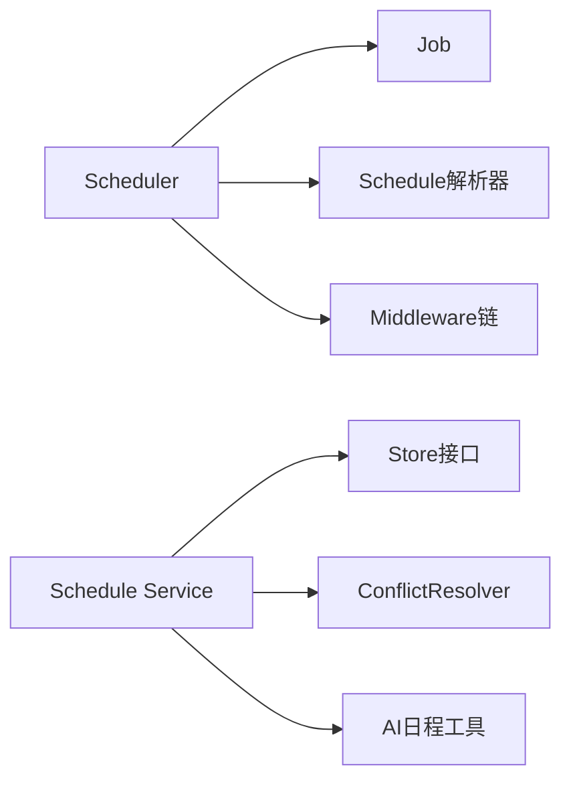

# 任务管理

<cite>
**本文引用的文件**
- [plugin/scheduler/scheduler.go](file://plugin/scheduler/scheduler.go)
- [plugin/scheduler/job.go](file://plugin/scheduler/job.go)
- [plugin/scheduler/middleware.go](file://plugin/scheduler/middleware.go)
- [plugin/scheduler/parser.go](file://plugin/scheduler/parser.go)
- [plugin/scheduler/example_test.go](file://plugin/scheduler/example_test.go)
- [plugin/scheduler/middleware_test.go](file://plugin/scheduler/middleware_test.go)
- [plugin/cron/cron.go](file://plugin/cron/cron.go)
- [plugin/cron/chain.go](file://plugin/cron/chain.go)
- [plugin/cron/logger.go](file://plugin/cron/logger.go)
- [server/service/schedule/service.go](file://server/service/schedule/service.go)
- [server/service/schedule/conflict_resolver.go](file://server/service/schedule/conflict_resolver.go)
- [server/internal/observability/logger.go](file://server/internal/observability/logger.go)
</cite>

## 目录
1. [简介](#简介)
2. [项目结构](#项目结构)
3. [核心组件](#核心组件)
4. [架构总览](#架构总览)
5. [详细组件分析](#详细组件分析)
6. [依赖关系分析](#依赖关系分析)
7. [性能考量](#性能考量)
8. [故障排除指南](#故障排除指南)
9. [结论](#结论)
10. [附录](#附录)

## 简介
本文件系统性地梳理了任务管理系统，涵盖任务的定义、配置与生命周期管理；任务注册流程、验证机制与冲突检测；任务执行的上下文传递、参数传递与返回值处理；任务链式中间件的设计模式与执行顺序；以及日志记录、监控指标与性能统计。文档同时提供最佳实践与故障排除建议，帮助开发者在不同场景下正确使用与扩展任务管理能力。

## 项目结构
任务管理由两套子系统协同实现：
- 任务调度器（plugin/scheduler）：负责基于 cron 表达式的定时任务注册、解析、执行与优雅停机。
- 日程服务（server/service/schedule）：负责日程模板的创建、查询、更新、删除与冲突检测，支持重复规则与时间窗口检查。

**图表来源**
- [plugin/scheduler/scheduler.go](file://plugin/scheduler/scheduler.go#L11-L21)
- [plugin/scheduler/job.go](file://plugin/scheduler/job.go#L13-L36)
- [plugin/scheduler/parser.go](file://plugin/scheduler/parser.go#L27-L88)
- [plugin/scheduler/middleware.go](file://plugin/scheduler/middleware.go#L10-L23)
- [server/service/schedule/service.go](file://server/service/schedule/service.go#L88-L302)
- [server/service/schedule/conflict_resolver.go](file://server/service/schedule/conflict_resolver.go#L45-L97)

**章节来源**
- [plugin/scheduler/scheduler.go](file://plugin/scheduler/scheduler.go#L11-L21)
- [plugin/scheduler/job.go](file://plugin/scheduler/job.go#L13-L36)
- [plugin/scheduler/parser.go](file://plugin/scheduler/parser.go#L27-L88)
- [server/service/schedule/service.go](file://server/service/schedule/service.go#L88-L302)

## 核心组件
- 调度器（Scheduler）
  - 负责任务注册、启动、按 cron 计划触发执行、优雅停机与上下文取消。
  - 支持全局时区与每任务时区覆盖。
- 任务（Job）
  - 定义任务名称、cron 计划、可选时区、处理器函数、描述与标签。
  - 提供 Validate 校验（名称、计划、处理器、cron 语法）。
- 中间件（Middleware）
  - 恢复（panic 恢复为错误）、日志（开始/完成/失败与耗时）、超时（带取消）。
  - 通过 Chain 组合，按从外到内的顺序包裹处理器。
- 计划解析（Schedule）
  - 支持 5 字段（分钟 小时 日 月 周）与 6 字段（秒 分 小时 日 月 周）。
  - Next 计算下次运行时间，匹配算法覆盖通配、范围、列表、步进等。
- 日程服务（Schedule Service）
  - 创建/查询/更新/删除日程，支持重复规则展开与冲突检测。
  - 冲突检测采用数据库级 EXCLUDE 约束与应用层索引扫描相结合。
- 冲突解析器（ConflictResolver）
  - 在请求时间段内寻找空闲槽位，计算评分并推荐替代时间，支持自动化解。

**章节来源**
- [plugin/scheduler/scheduler.go](file://plugin/scheduler/scheduler.go#L68-L118)
- [plugin/scheduler/job.go](file://plugin/scheduler/job.go#L38-L58)
- [plugin/scheduler/middleware.go](file://plugin/scheduler/middleware.go#L13-L23)
- [plugin/scheduler/parser.go](file://plugin/scheduler/parser.go#L27-L117)
- [server/service/schedule/service.go](file://server/service/schedule/service.go#L194-L302)
- [server/service/schedule/conflict_resolver.go](file://server/service/schedule/conflict_resolver.go#L45-L97)

## 架构总览
任务管理由“调度器”和“日程服务”两条主线构成：
- 调度器：面向周期性后台任务，提供注册、解析、执行、中间件与优雅停机。
- 日程服务：面向用户日程模板与实例，提供创建、查询、更新、删除与冲突检测。

**图表来源**
- [plugin/scheduler/scheduler.go](file://plugin/scheduler/scheduler.go#L90-L165)
- [plugin/scheduler/parser.go](file://plugin/scheduler/parser.go#L89-L117)
- [plugin/scheduler/middleware.go](file://plugin/scheduler/middleware.go#L13-L23)

**章节来源**
- [plugin/scheduler/scheduler.go](file://plugin/scheduler/scheduler.go#L90-L165)
- [plugin/scheduler/parser.go](file://plugin/scheduler/parser.go#L89-L117)
- [plugin/scheduler/middleware.go](file://plugin/scheduler/middleware.go#L13-L23)

## 详细组件分析

### 调度器（Scheduler）
- 注册流程
  - Register 校验 Job 非空、Validate 通过、名称唯一，然后登记到内部映射。
- 启动流程
  - Start 并行解析每个 Job 的 cron 表达式，为每个 Job 启动一个协程循环等待触发。
- 触发与执行
  - Next 计算下次运行时间，NewTimer 等待；到达后将任务名注入上下文，执行包装后的处理器。
- 优雅停机
  - Stop 关闭 stopCh，取消所有 Job 上下文，等待 WaitGroup 结束，支持超时退出。

**图表来源**
- [plugin/scheduler/scheduler.go](file://plugin/scheduler/scheduler.go#L68-L118)
- [plugin/scheduler/scheduler.go](file://plugin/scheduler/scheduler.go#L120-L165)

**章节来源**
- [plugin/scheduler/scheduler.go](file://plugin/scheduler/scheduler.go#L68-L118)
- [plugin/scheduler/scheduler.go](file://plugin/scheduler/scheduler.go#L120-L165)

### 任务（Job）与验证
- 字段与职责
  - 名称：唯一标识，用于日志与指标。
  - 计划：cron 表达式，支持 5/6 字段。
  - 可选时区：覆盖全局时区。
  - 处理器：执行函数，接收上下文并在停机时可被取消。
  - 描述与标签：便于分类与监控。
- 验证逻辑
  - 名称非空、计划非空且可解析、处理器非空。

**图表来源**
- [plugin/scheduler/job.go](file://plugin/scheduler/job.go#L13-L36)
- [plugin/scheduler/job.go](file://plugin/scheduler/job.go#L38-L58)
- [plugin/scheduler/scheduler.go](file://plugin/scheduler/scheduler.go#L68-L88)

**章节来源**
- [plugin/scheduler/job.go](file://plugin/scheduler/job.go#L13-L36)
- [plugin/scheduler/job.go](file://plugin/scheduler/job.go#L38-L58)
- [plugin/scheduler/scheduler.go](file://plugin/scheduler/scheduler.go#L68-L88)

### 中间件（Middleware）与链式组合
- 设计模式
  - Middleware 函数签名包裹 JobHandler，Chain 以从外到内的顺序组合。
- 内置中间件
  - Recovery：捕获 panic 并转换为错误，回调 onPanic。
  - Logging：记录开始、完成（含耗时）与失败。
  - Timeout：为处理器设置超时，超时返回错误。
- 上下文传递
  - withJobName/getJobName 通过 context.Value 传递任务名。

**图表来源**
- [plugin/scheduler/middleware.go](file://plugin/scheduler/middleware.go#L13-L23)
- [plugin/scheduler/middleware.go](file://plugin/scheduler/middleware.go#L25-L41)
- [plugin/scheduler/middleware.go](file://plugin/scheduler/middleware.go#L49-L70)
- [plugin/scheduler/middleware.go](file://plugin/scheduler/middleware.go#L72-L92)

**章节来源**
- [plugin/scheduler/middleware.go](file://plugin/scheduler/middleware.go#L13-L23)
- [plugin/scheduler/middleware.go](file://plugin/scheduler/middleware.go#L25-L41)
- [plugin/scheduler/middleware.go](file://plugin/scheduler/middleware.go#L49-L70)
- [plugin/scheduler/middleware.go](file://plugin/scheduler/middleware.go#L72-L92)

### 计划解析（Schedule）
- cron 语法支持
  - 5/6 字段格式；秒字段可选；支持 *、范围、列表、步进等。
- Next 算法
  - 从下一秒/分开始递增，最多搜索 4 年，避免无限循环。
- 匹配策略
  - 秒/分/时/月/日与周任一满足即可；日与周满足其一即命中。

**图表来源**
- [plugin/scheduler/parser.go](file://plugin/scheduler/parser.go#L27-L88)
- [plugin/scheduler/parser.go](file://plugin/scheduler/parser.go#L89-L117)
- [plugin/scheduler/parser.go](file://plugin/scheduler/parser.go#L128-L178)

**章节来源**
- [plugin/scheduler/parser.go](file://plugin/scheduler/parser.go#L27-L88)
- [plugin/scheduler/parser.go](file://plugin/scheduler/parser.go#L89-L117)
- [plugin/scheduler/parser.go](file://plugin/scheduler/parser.go#L128-L178)

### 日程服务（Schedule Service）
- 功能要点
  - 创建：校验标题、起止时间、提醒序列化、默认时区、冲突检查、数据库原子插入。
  - 查询：列出用户日程，展开重复规则为实例，限制最大实例数。
  - 更新：变更时间需再次冲突检查（排除自身）。
  - 删除：按 ID 删除。
- 冲突检测
  - 应用层：批量查询潜在冲突，构建小时索引，按区间重叠判断。
  - 数据库层：EXCLUDE 约束提供最终原子保证。

**图表来源**
- [server/service/schedule/service.go](file://server/service/schedule/service.go#L194-L302)
- [server/service/schedule/service.go](file://server/service/schedule/service.go#L88-L192)

**章节来源**
- [server/service/schedule/service.go](file://server/service/schedule/service.go#L194-L302)
- [server/service/schedule/service.go](file://server/service/schedule/service.go#L88-L192)

### 冲突解析器（ConflictResolver）
- 输入：请求开始/结束时间、持续时长、用户ID。
- 输出：原始时间段、冲突列表、替代时间槽、自动化解方案。
- 策略
  - 同日优先；相邻日期备选；按时段偏好与邻近度打分；自动选择最高分。

**图表来源**
- [server/service/schedule/conflict_resolver.go](file://server/service/schedule/conflict_resolver.go#L45-L97)
- [server/service/schedule/conflict_resolver.go](file://server/service/schedule/conflict_resolver.go#L114-L165)
- [server/service/schedule/conflict_resolver.go](file://server/service/schedule/conflict_resolver.go#L264-L277)

**章节来源**
- [server/service/schedule/conflict_resolver.go](file://server/service/schedule/conflict_resolver.go#L45-L97)
- [server/service/schedule/conflict_resolver.go](file://server/service/schedule/conflict_resolver.go#L114-L165)
- [server/service/schedule/conflict_resolver.go](file://server/service/schedule/conflict_resolver.go#L264-L277)

### 日志与可观测性
- 调度器日志
  - Logging 中间件记录开始/完成/失败与耗时；Recovery 将 panic 转换为错误并回调 onPanic。
- 通用请求上下文
  - RequestContext 提供统一的结构化日志字段（请求ID、用户ID、代理类型、耗时），便于跨模块追踪。
- Cron 日志接口
  - Logger 接口与默认实现，支持 Info/Error 输出。

**章节来源**
- [plugin/scheduler/middleware.go](file://plugin/scheduler/middleware.go#L49-L70)
- [plugin/scheduler/middleware.go](file://plugin/scheduler/middleware.go#L25-L41)
- [server/internal/observability/logger.go](file://server/internal/observability/logger.go#L30-L97)
- [plugin/cron/logger.go](file://plugin/cron/logger.go#L17-L24)

## 依赖关系分析
- 调度器依赖
  - 任务定义与验证（Job/Validate）
  - 计划解析（ParseCronExpression/Schedule.Next）
  - 中间件链（Chain/Recovery/Logging/Timeout）
- 日程服务依赖
  - 存储层接口（Store）
  - AI 日程工具（RRule/提醒序列化）
  - 冲突解析器（ConflictResolver）

**图表来源**
- [plugin/scheduler/scheduler.go](file://plugin/scheduler/scheduler.go#L103-L114)
- [plugin/scheduler/parser.go](file://plugin/scheduler/parser.go#L27-L88)
- [plugin/scheduler/middleware.go](file://plugin/scheduler/middleware.go#L13-L23)
- [server/service/schedule/service.go](file://server/service/schedule/service.go#L70-L86)
- [server/service/schedule/conflict_resolver.go](file://server/service/schedule/conflict_resolver.go#L15-L24)

**章节来源**
- [plugin/scheduler/scheduler.go](file://plugin/scheduler/scheduler.go#L103-L114)
- [plugin/scheduler/parser.go](file://plugin/scheduler/parser.go#L27-L88)
- [plugin/scheduler/middleware.go](file://plugin/scheduler/middleware.go#L13-L23)
- [server/service/schedule/service.go](file://server/service/schedule/service.go#L70-L86)
- [server/service/schedule/conflict_resolver.go](file://server/service/schedule/conflict_resolver.go#L15-L24)

## 性能考量
- 调度器
  - 每个 Job 单独协程循环等待，Next 采用线性推进，最多搜索 4 年，避免无限循环。
  - 中间件链包裹处理器，建议仅保留必要中间件，减少额外开销。
- 日程服务
  - 冲突检测使用小时粒度索引，按区间重叠快速过滤，限制最大实例数与检查次数，防止高复杂度。
  - 数据库层 EXCLUDE 约束提供原子保障，避免竞态。
- Cron（参考实现）
  - 使用定时器与排序队列维护多个 Entry，支持延迟/跳过同一 Job 并发运行，适合批处理场景。

**章节来源**
- [plugin/scheduler/parser.go](file://plugin/scheduler/parser.go#L89-L117)
- [server/service/schedule/service.go](file://server/service/schedule/service.go#L264-L286)
- [server/service/schedule/service.go](file://server/service/schedule/service.go#L641-L662)
- [plugin/cron/cron.go](file://plugin/cron/cron.go#L239-L304)
- [plugin/cron/chain.go](file://plugin/cron/chain.go#L62-L96)

## 故障排除指南
- 任务无法注册
  - 检查 Job 是否为空、名称是否唯一、计划是否可解析、处理器是否非空。
- 任务未触发或触发异常
  - 核对全局/任务时区设置；确认 cron 表达式格式与字段范围；查看中间件日志与超时设置。
- 优雅停机无效
  - 确认 Stop(ctx) 调用与上下文超时设置；处理器应响应 ctx.Done()。
- 日程创建失败
  - 检查标题、起止时间、提醒序列化；查看冲突检测返回的替代时间；关注数据库约束错误。
- 冲突过多导致截断
  - 查看服务端日志中的截断警告；调整查询窗口或实例上限。
- 中间件顺序问题
  - Chain 从外到内包裹，确保 Recovery 放在外层，Logging/Timeout 在内层；参考测试用例验证顺序。

**章节来源**
- [plugin/scheduler/job.go](file://plugin/scheduler/job.go#L38-L58)
- [plugin/scheduler/scheduler.go](file://plugin/scheduler/scheduler.go#L90-L118)
- [plugin/scheduler/scheduler.go](file://plugin/scheduler/scheduler.go#L167-L202)
- [server/service/schedule/service.go](file://server/service/schedule/service.go#L194-L302)
- [server/service/schedule/service.go](file://server/service/schedule/service.go#L183-L191)
- [plugin/scheduler/middleware_test.go](file://plugin/scheduler/middleware_test.go#L10-L53)

## 结论
本任务管理系统通过“调度器 + 日程服务”的双轨设计，既满足后台周期性任务的稳定执行，又提供日程模板与冲突检测的业务能力。借助中间件链、结构化日志与优雅停机机制，系统具备良好的可扩展性与可观测性。遵循本文的最佳实践与故障排除建议，可在生产环境中安全高效地使用与演进任务管理功能。

## 附录
- 示例与测试
  - 基础用法、时区、中间件、多任务、优雅停机示例参见示例测试文件。
  - 中间件链顺序、恢复与日志行为参见单元测试文件。
- 参考实现
  - Cron 定时器提供了并发控制（延迟/跳过）与日志接口，可作为理解调度器并发模型的参考。

**章节来源**
- [plugin/scheduler/example_test.go](file://plugin/scheduler/example_test.go#L13-L166)
- [plugin/scheduler/middleware_test.go](file://plugin/scheduler/middleware_test.go#L10-L147)
- [plugin/cron/cron.go](file://plugin/cron/cron.go#L214-L334)
- [plugin/cron/chain.go](file://plugin/cron/chain.go#L62-L96)
- [plugin/cron/logger.go](file://plugin/cron/logger.go#L17-L24)