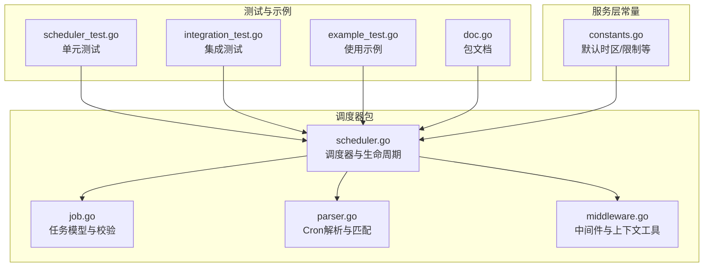
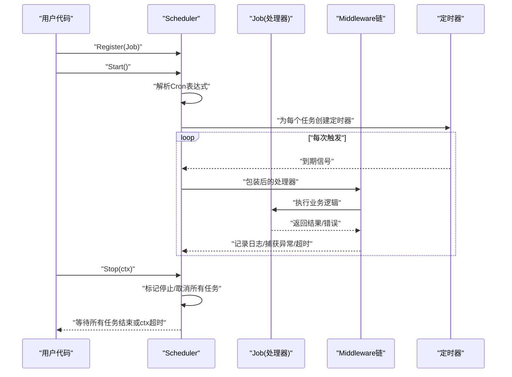
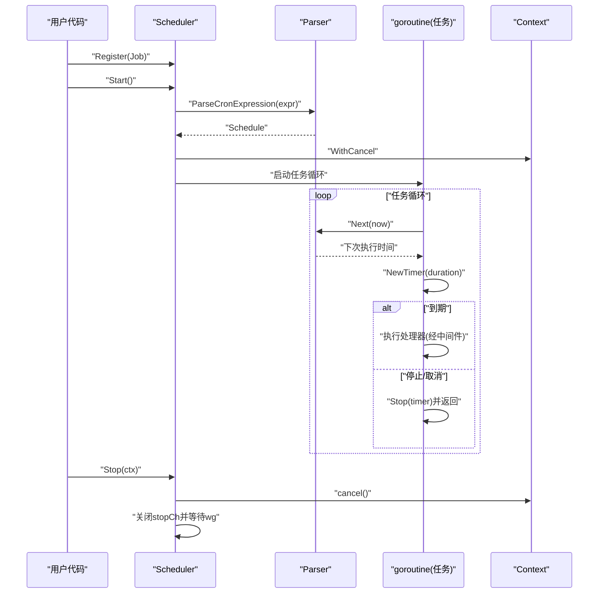
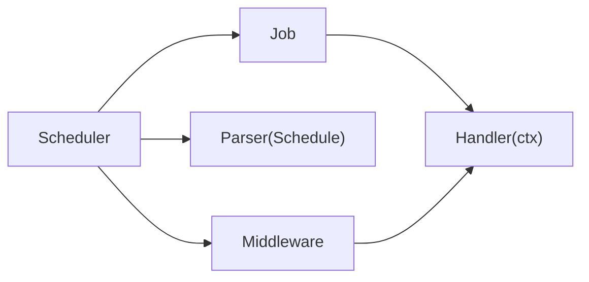

# 调度器核心

<cite>
**本文引用的文件**
- [plugin/scheduler/scheduler.go](file://plugin/scheduler/scheduler.go)
- [plugin/scheduler/job.go](file://plugin/scheduler/job.go)
- [plugin/scheduler/parser.go](file://plugin/scheduler/parser.go)
- [plugin/scheduler/middleware.go](file://plugin/scheduler/middleware.go)
- [plugin/scheduler/scheduler_test.go](file://plugin/scheduler/scheduler_test.go)
- [plugin/scheduler/integration_test.go](file://plugin/scheduler/integration_test.go)
- [plugin/scheduler/example_test.go](file://plugin/scheduler/example_test.go)
- [plugin/scheduler/doc.go](file://plugin/scheduler/doc.go)
- [server/service/schedule/constants.go](file://server/service/schedule/constants.go)
</cite>

## 目录
1. [简介](#简介)
2. [项目结构](#项目结构)
3. [核心组件](#核心组件)
4. [架构总览](#架构总览)
5. [详细组件分析](#详细组件分析)
6. [依赖关系分析](#依赖关系分析)
7. [性能考量](#性能考量)
8. [故障排查指南](#故障排查指南)
9. [结论](#结论)
10. [附录](#附录)

## 简介
本文件聚焦于调度器核心组件，系统性阐述其架构设计与实现细节，包括任务注册、执行循环、生命周期管理、初始化与配置、运行状态管理、唯一性检查与错误处理、启动与优雅关闭流程、并发安全与线程同步、资源管理，并提供使用示例与最佳实践。该调度器以“类 GitHub Actions 的 Cron 任务”为核心，支持标准 5/6 字段 Cron 表达式、时区感知、中间件模式、上下文取消与超时、以及零外部依赖。

## 项目结构
调度器位于插件模块中，核心源码分布如下：
- 核心调度器与生命周期：plugin/scheduler/scheduler.go
- 任务模型与校验：plugin/scheduler/job.go
- Cron 解析与下一次执行时间计算：plugin/scheduler/parser.go
- 中间件与上下文工具：plugin/scheduler/middleware.go
- 单元测试与集成测试：plugin/scheduler/scheduler_test.go、plugin/scheduler/integration_test.go
- 使用示例：plugin/scheduler/example_test.go
- 包文档：plugin/scheduler/doc.go
- 服务层常量（默认时区等）：server/service/schedule/constants.go



图表来源
- [plugin/scheduler/scheduler.go](file://plugin/scheduler/scheduler.go#L1-L203)
- [plugin/scheduler/job.go](file://plugin/scheduler/job.go#L1-L59)
- [plugin/scheduler/parser.go](file://plugin/scheduler/parser.go#L1-L230)
- [plugin/scheduler/middleware.go](file://plugin/scheduler/middleware.go#L1-L121)
- [plugin/scheduler/scheduler_test.go](file://plugin/scheduler/scheduler_test.go#L1-L166)
- [plugin/scheduler/integration_test.go](file://plugin/scheduler/integration_test.go#L71-L372)
- [plugin/scheduler/example_test.go](file://plugin/scheduler/example_test.go#L1-L166)
- [plugin/scheduler/doc.go](file://plugin/scheduler/doc.go#L1-L36)
- [server/service/schedule/constants.go](file://server/service/schedule/constants.go#L1-L17)

章节来源
- [plugin/scheduler/scheduler.go](file://plugin/scheduler/scheduler.go#L1-L203)
- [plugin/scheduler/job.go](file://plugin/scheduler/job.go#L1-L59)
- [plugin/scheduler/parser.go](file://plugin/scheduler/parser.go#L1-L230)
- [plugin/scheduler/middleware.go](file://plugin/scheduler/middleware.go#L1-L121)
- [plugin/scheduler/scheduler_test.go](file://plugin/scheduler/scheduler_test.go#L1-L166)
- [plugin/scheduler/integration_test.go](file://plugin/scheduler/integration_test.go#L71-L372)
- [plugin/scheduler/example_test.go](file://plugin/scheduler/example_test.go#L1-L166)
- [plugin/scheduler/doc.go](file://plugin/scheduler/doc.go#L1-L36)
- [server/service/schedule/constants.go](file://server/service/schedule/constants.go#L1-L17)

## 核心组件
- 调度器（Scheduler）：负责任务注册、启动、执行循环、停止与优雅关闭；内部维护任务映射、运行状态、停止通道与等待组。
- 任务（Job）：描述一个计划任务的名称、Cron 表达式、时区、处理器、描述与标签；提供 Validate 校验。
- Cron 解析（Schedule/fieldMatcher）：解析 5/6 字段 Cron 表达式，生成匹配器；提供 Next 计算下一次执行时间。
- 中间件（Middleware）：提供 Recovery、Logging、Timeout 等横切能力，支持链式组合。
- 上下文工具：在执行上下文中携带任务名，便于日志与错误定位。

章节来源
- [plugin/scheduler/scheduler.go](file://plugin/scheduler/scheduler.go#L11-L21)
- [plugin/scheduler/job.go](file://plugin/scheduler/job.go#L13-L36)
- [plugin/scheduler/parser.go](file://plugin/scheduler/parser.go#L11-L20)
- [plugin/scheduler/middleware.go](file://plugin/scheduler/middleware.go#L10-L23)

## 架构总览
调度器采用“单调度器多任务”的结构，每个任务独立 goroutine 执行，基于 Cron 表达式驱动的定时器进行触发。调度器通过中间件对处理器进行包装，统一处理日志、异常与超时。停止时通过上下文取消与通道通知，配合等待组确保优雅退出。



图表来源
- [plugin/scheduler/scheduler.go](file://plugin/scheduler/scheduler.go#L90-L165)
- [plugin/scheduler/middleware.go](file://plugin/scheduler/middleware.go#L13-L92)
- [plugin/scheduler/parser.go](file://plugin/scheduler/parser.go#L90-L117)

## 详细组件分析

### 调度器（Scheduler）
- 初始化与配置
  - New 支持 WithTimezone 与 WithMiddleware 选项，默认时区为 UTC，中间件为空。
- 任务注册（Register）
  - 校验 Job 必填字段与 Cron 表达式合法性；检查名称唯一性；登记到内部映射。
- 启动（Start）
  - 校验运行状态；解析每个任务的 Cron 表达式；为每个任务创建带取消的上下文；启动独立 goroutine 执行 runJobWithSchedule。
- 执行循环（runJobWithSchedule）
  - 根据任务或调度器时区计算下一次执行时间；创建定时器；在到期、调度器停止或上下文取消时退出。
- 停止（Stop）
  - 标记停止；逐个取消任务上下文；关闭停止通道；等待所有 goroutine 结束；若 ctx 超时则返回错误。

```mermaid
classDiagram
class Scheduler {
-jobs : map[string]*registeredJob
-jobsMu : RWMutex
-timezone : Location
-middleware : Middleware
-running : bool
-runningMu : RWMutex
-stopCh : chan struct{}
-wg : WaitGroup
+Register(job) error
+Start() error
+Stop(ctx) error
-runJobWithSchedule(ctx, rj, schedule)
}
class registeredJob {
+job : *Job
+cancelFn : CancelFunc
}
class Job {
+Name : string
+Schedule : string
+Timezone : string
+Handler(ctx) error
+Description : string
+Tags : []string
+Validate() error
}
class Schedule {
-seconds : fieldMatcher
-minutes : fieldMatcher
-hours : fieldMatcher
-days : fieldMatcher
-months : fieldMatcher
-weekdays : fieldMatcher
-hasSecs : bool
+Next(from) time
}
Scheduler --> registeredJob : "管理"
Scheduler --> Schedule : "解析Cron"
Scheduler --> Job : "注册/执行"
```

图表来源
- [plugin/scheduler/scheduler.go](file://plugin/scheduler/scheduler.go#L11-L21)
- [plugin/scheduler/scheduler.go](file://plugin/scheduler/scheduler.go#L68-L88)
- [plugin/scheduler/scheduler.go](file://plugin/scheduler/scheduler.go#L90-L118)
- [plugin/scheduler/scheduler.go](file://plugin/scheduler/scheduler.go#L120-L165)
- [plugin/scheduler/scheduler.go](file://plugin/scheduler/scheduler.go#L167-L202)
- [plugin/scheduler/job.go](file://plugin/scheduler/job.go#L13-L36)
- [plugin/scheduler/parser.go](file://plugin/scheduler/parser.go#L11-L20)

章节来源
- [plugin/scheduler/scheduler.go](file://plugin/scheduler/scheduler.go#L53-L66)
- [plugin/scheduler/scheduler.go](file://plugin/scheduler/scheduler.go#L68-L88)
- [plugin/scheduler/scheduler.go](file://plugin/scheduler/scheduler.go#L90-L118)
- [plugin/scheduler/scheduler.go](file://plugin/scheduler/scheduler.go#L120-L165)
- [plugin/scheduler/scheduler.go](file://plugin/scheduler/scheduler.go#L167-L202)

### 任务模型（Job）
- 关键字段：Name、Schedule、Timezone、Handler、Description、Tags。
- 校验规则：名称与 Cron 表达式必填；Cron 表达式必须可解析；处理器必填。
- 唯一性：调度器在注册阶段按名称去重，重复名称将返回错误。

章节来源
- [plugin/scheduler/job.go](file://plugin/scheduler/job.go#L13-L36)
- [plugin/scheduler/job.go](file://plugin/scheduler/job.go#L38-L58)
- [plugin/scheduler/scheduler.go](file://plugin/scheduler/scheduler.go#L79-L87)

### Cron 解析（Schedule/fieldMatcher）
- 支持 5/6 字段 Cron 表达式；6 字段时秒字段生效，否则默认秒为 0。
- 字段匹配器：
  - wildcardMatcher：通配符 *
  - exactMatcher：精确值
  - rangeMatcher：范围 a-b
  - listMatcher：列表 a,b,c
  - stepMatcher：步长 */N
- Next 算法：从下一秒/分开始推进，最多向前扩展 4 年，避免无限循环。

章节来源
- [plugin/scheduler/parser.go](file://plugin/scheduler/parser.go#L27-L88)
- [plugin/scheduler/parser.go](file://plugin/scheduler/parser.go#L90-L117)
- [plugin/scheduler/parser.go](file://plugin/scheduler/parser.go#L128-L178)
- [plugin/scheduler/parser.go](file://plugin/scheduler/parser.go#L180-L230)

### 中间件（Middleware）
- 链式组合：Chain 将多个中间件按顺序包裹，外层先应用。
- 内置中间件：
  - Recovery：捕获 panic 并转换为错误，便于统一处理。
  - Logging：记录任务开始/完成与耗时，失败时输出错误。
  - Timeout：为任务设置超时，超时后返回错误。
- 上下文工具：withJobName/getJobName 提供任务名注入与读取。

章节来源
- [plugin/scheduler/middleware.go](file://plugin/scheduler/middleware.go#L13-L23)
- [plugin/scheduler/middleware.go](file://plugin/scheduler/middleware.go#L25-L41)
- [plugin/scheduler/middleware.go](file://plugin/scheduler/middleware.go#L49-L70)
- [plugin/scheduler/middleware.go](file://plugin/scheduler/middleware.go#L72-L92)
- [plugin/scheduler/middleware.go](file://plugin/scheduler/middleware.go#L101-L121)

### 生命周期与并发安全
- 运行状态：running/runningMu 控制启动与停止状态机，防止重复启动与竞态。
- 任务并发：每个任务独立 goroutine，互不阻塞；通过 WaitGroup 等待全部结束。
- 停止机制：stopCh 用于广播停止信号；cancelFn 用于取消任务上下文；二者共同保证优雅关闭。
- 时区策略：任务级时区优先，其次调度器默认时区；解析时仅在必要时加载 Location。

章节来源
- [plugin/scheduler/scheduler.go](file://plugin/scheduler/scheduler.go#L12-L21)
- [plugin/scheduler/scheduler.go](file://plugin/scheduler/scheduler.go#L91-L118)
- [plugin/scheduler/scheduler.go](file://plugin/scheduler/scheduler.go#L167-L202)
- [plugin/scheduler/scheduler.go](file://plugin/scheduler/scheduler.go#L130-L165)

### 启动流程与停止机制（序列图）


图表来源
- [plugin/scheduler/scheduler.go](file://plugin/scheduler/scheduler.go#L90-L165)
- [plugin/scheduler/parser.go](file://plugin/scheduler/parser.go#L90-L117)

## 依赖关系分析
- 调度器依赖 Cron 解析模块生成 Schedule，并在执行循环中调用 Next 计算下一次触发时间。
- 调度器通过中间件对处理器进行包装，形成洋葱模型，增强日志、异常与超时处理。
- 任务注册与启动之间存在严格的时序约束：必须先 Register 再 Start。
- 停止流程依赖 WaitGroup 与上下文取消，确保所有任务 goroutine 正确退出。



图表来源
- [plugin/scheduler/scheduler.go](file://plugin/scheduler/scheduler.go#L11-L21)
- [plugin/scheduler/job.go](file://plugin/scheduler/job.go#L13-L36)
- [plugin/scheduler/parser.go](file://plugin/scheduler/parser.go#L11-L20)
- [plugin/scheduler/middleware.go](file://plugin/scheduler/middleware.go#L10-L23)

章节来源
- [plugin/scheduler/scheduler.go](file://plugin/scheduler/scheduler.go#L1-L203)
- [plugin/scheduler/job.go](file://plugin/scheduler/job.go#L1-L59)
- [plugin/scheduler/parser.go](file://plugin/scheduler/parser.go#L1-L230)
- [plugin/scheduler/middleware.go](file://plugin/scheduler/middleware.go#L1-L121)

## 性能考量
- Cron 计算复杂度：Next 以秒/分为粒度推进，最多扩展 4 年，避免无限循环；复杂度与表达式复杂度相关，通常为 O(N)。
- 内存与分配：解析阶段一次性构造匹配器；执行阶段仅创建定时器与少量局部变量；未发现额外分配路径。
- 并发模型：每个任务独立 goroutine，无共享可变状态；WaitGroup 保证优雅退出。
- 时区处理：任务级时区优先，解析时按需加载 Location；服务层常量提供默认时区，避免全局硬编码。

章节来源
- [plugin/scheduler/parser.go](file://plugin/scheduler/parser.go#L90-L117)
- [plugin/scheduler/scheduler.go](file://plugin/scheduler/scheduler.go#L130-L165)
- [server/service/schedule/constants.go](file://server/service/schedule/constants.go#L5-L8)

## 故障排查指南
- 注册阶段
  - 名称冲突：重复注册相同名称的任务会失败，检查任务名称唯一性。
  - Cron 表达式无效：Validate 会在 Register 时返回错误，确认表达式格式与取值范围。
- 启动阶段
  - 重复启动：已运行的调度器再次 Start 会失败，确保只启动一次。
  - Cron 解析失败：Start 时解析失败会返回错误，检查表达式语法。
- 执行阶段
  - 任务 panic：Recovery 中间件会捕获并转为错误，结合 Logging 查看日志定位。
  - 任务超时：Timeout 中间件会在超时后返回错误，适当调整超时阈值。
- 停止阶段
  - 停止超时：Stop(ctx) 在 ctx 超时后返回错误，延长超时或优化任务收尾逻辑。
  - 任务未退出：确认任务内部正确处理 ctx.Done() 并尽快返回。

章节来源
- [plugin/scheduler/scheduler.go](file://plugin/scheduler/scheduler.go#L68-L88)
- [plugin/scheduler/scheduler.go](file://plugin/scheduler/scheduler.go#L90-L118)
- [plugin/scheduler/middleware.go](file://plugin/scheduler/middleware.go#L25-L41)
- [plugin/scheduler/middleware.go](file://plugin/scheduler/middleware.go#L72-L92)
- [plugin/scheduler/scheduler.go](file://plugin/scheduler/scheduler.go#L167-L202)

## 结论
该调度器以简洁清晰的架构实现了“Cron 任务调度”的核心需求：支持 5/6 字段 Cron、时区感知、中间件扩展、优雅关闭与上下文取消。通过严格的注册校验、并发安全设计与明确的生命周期管理，满足生产环境的可靠性要求。建议在实际使用中结合中间件完善可观测性与稳定性，并遵循“先注册再启动、先停止再释放”的时序约束。

## 附录

### 使用示例与最佳实践
- 基本使用：创建调度器、注册任务、启动并在合适时机停止。
- 时区使用：通过 WithTimezone 或任务级 Timezone 实现本地化调度。
- 中间件组合：建议按 Recovery -> Logging -> Timeout 的顺序组合，确保异常可控、可观测且不阻塞。
- 优雅关闭：在收到系统信号或退出流程时，使用 Stop(ctx) 并设置合理超时。
- 任务设计：处理器应短小、幂等、快速返回；在关键点检查 ctx.Done() 以便及时退出。

章节来源
- [plugin/scheduler/example_test.go](file://plugin/scheduler/example_test.go#L13-L32)
- [plugin/scheduler/example_test.go](file://plugin/scheduler/example_test.go#L34-L51)
- [plugin/scheduler/example_test.go](file://plugin/scheduler/example_test.go#L53-L78)
- [plugin/scheduler/example_test.go](file://plugin/scheduler/example_test.go#L93-L132)
- [plugin/scheduler/example_test.go](file://plugin/scheduler/example_test.go#L134-L165)