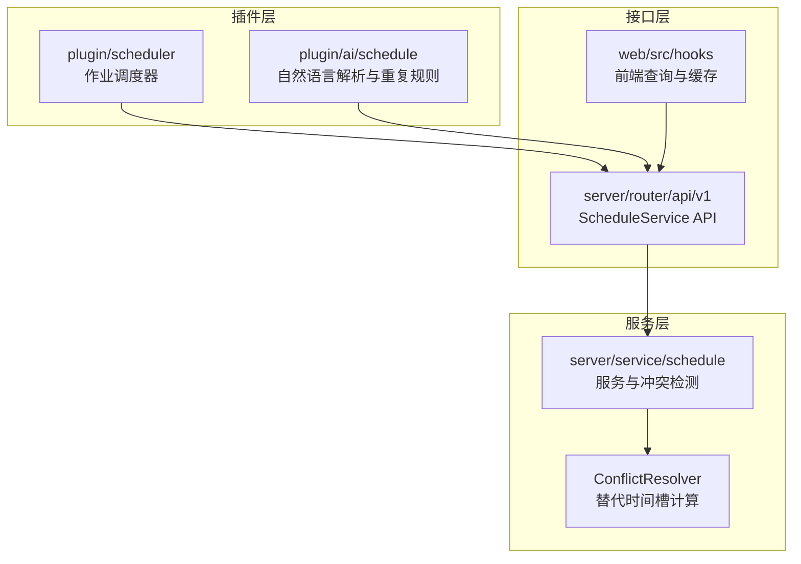
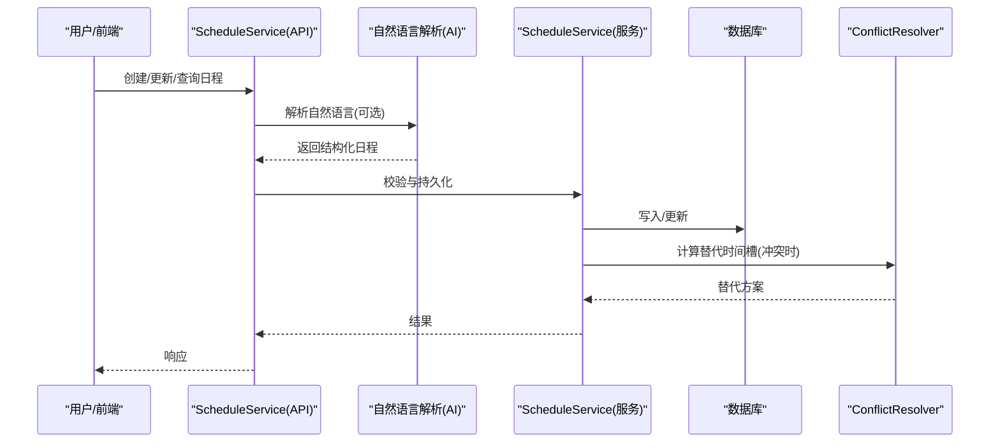
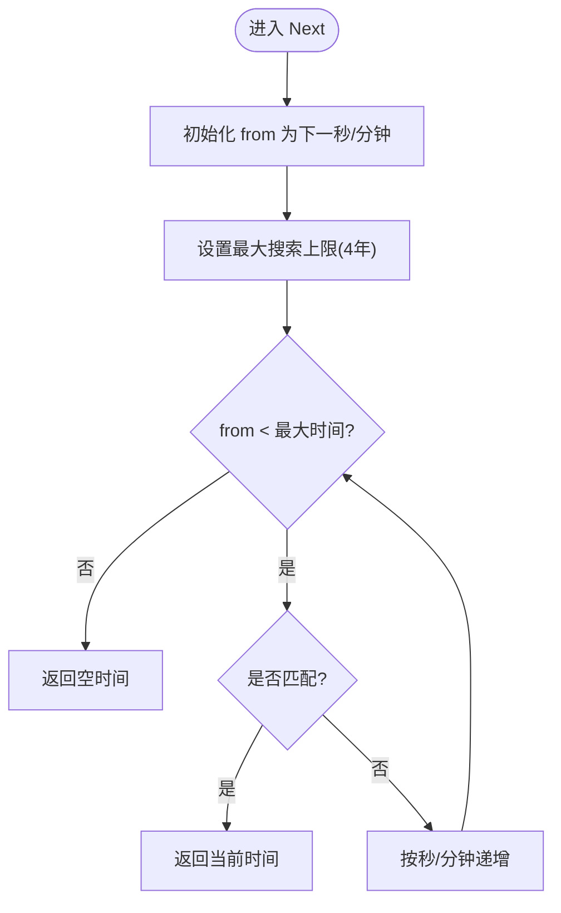
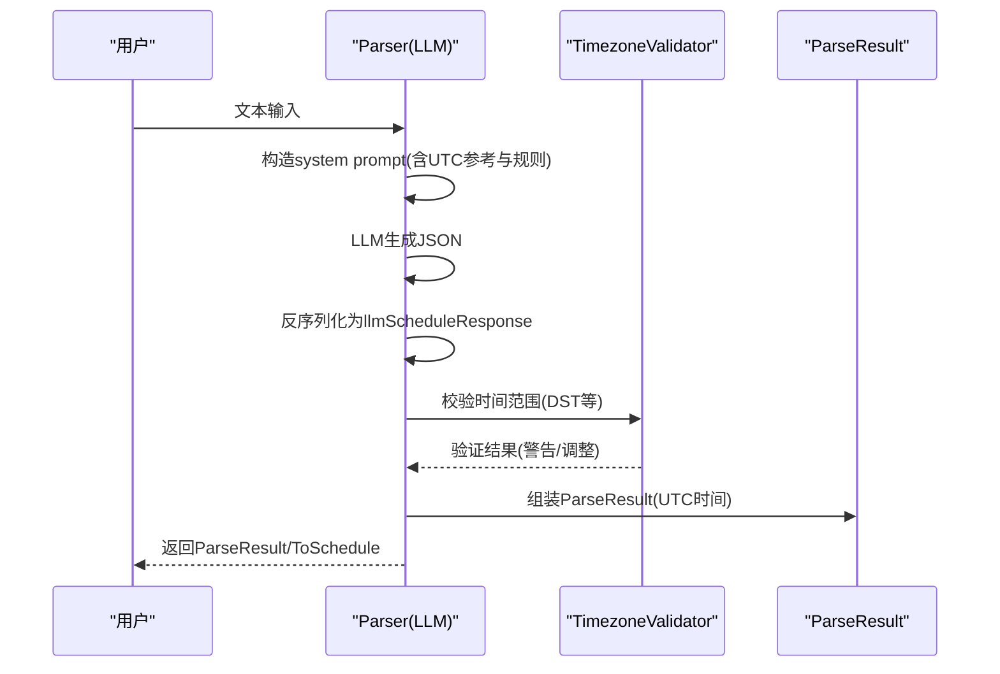
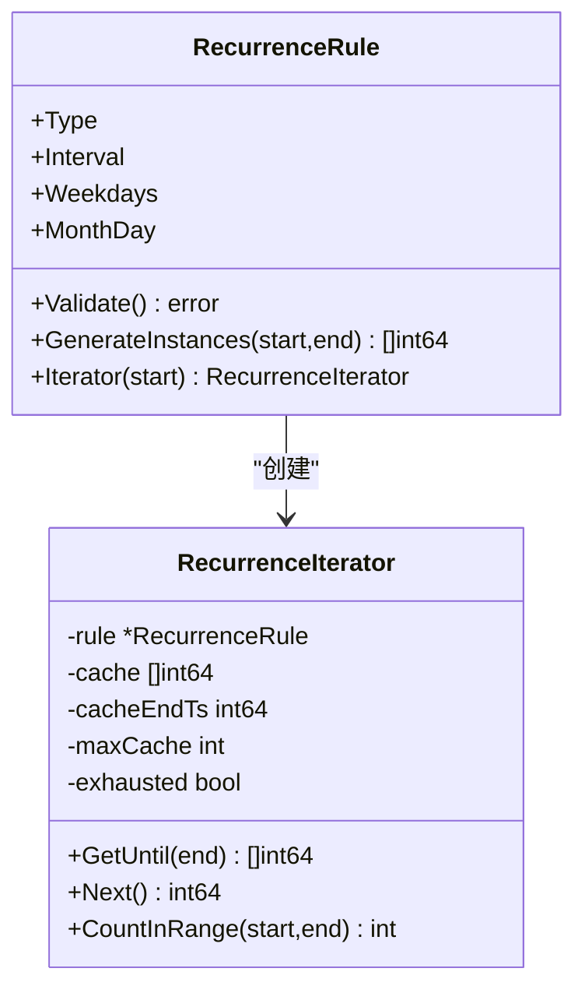
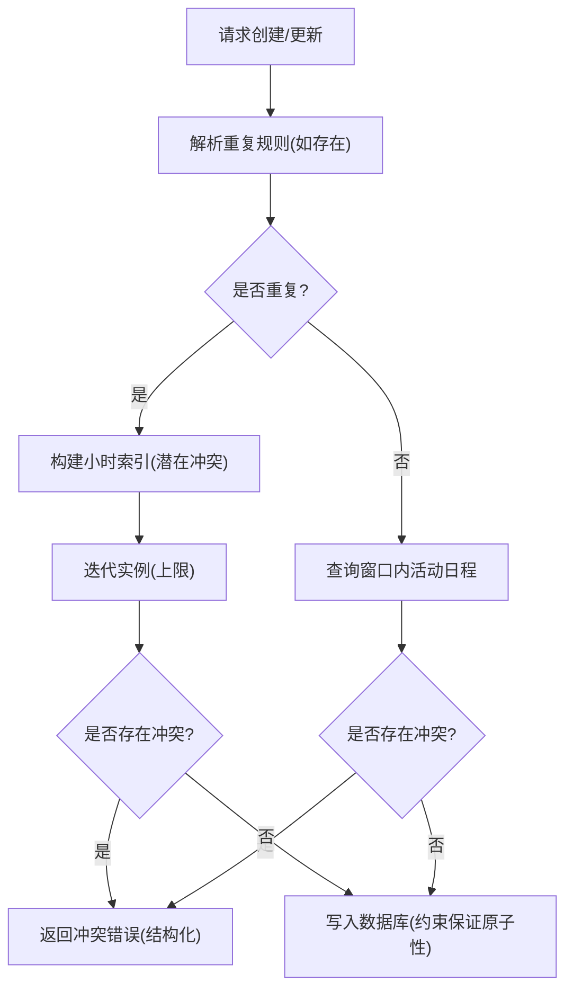
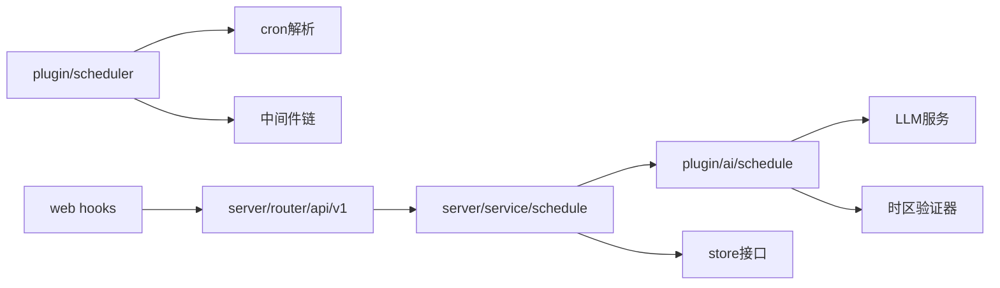

# 调度插件

<cite>
**本文引用的文件**
- [plugin/scheduler/scheduler.go](file://plugin/scheduler/scheduler.go)
- [plugin/scheduler/job.go](file://plugin/scheduler/job.go)
- [plugin/scheduler/parser.go](file://plugin/scheduler/parser.go)
- [plugin/scheduler/middleware.go](file://plugin/scheduler/middleware.go)
- [plugin/scheduler/example_test.go](file://plugin/scheduler/example_test.go)
- [plugin/scheduler/integration_test.go](file://plugin/scheduler/integration_test.go)
- [plugin/ai/schedule/parser.go](file://plugin/ai/schedule/parser.go)
- [plugin/ai/schedule/recurrence.go](file://plugin/ai/schedule/recurrence.go)
- [plugin/ai/schedule/timezone_validator.go](file://plugin/ai/schedule/timezone_validator.go)
- [plugin/ai/schedule/helpers.go](file://plugin/ai/schedule/helpers.go)
- [server/service/schedule/service.go](file://server/service/schedule/service.go)
- [server/service/schedule/conflict_resolver.go](file://server/service/schedule/conflict_resolver.go)
- [server/router/api/v1/schedule_service.go](file://server/router/api/v1/schedule_service.go)
- [server/service/schedule/constants.go](file://server/service/schedule/constants.go)
- [web/src/hooks/useScheduleQueries.ts](file://web/src/hooks/useScheduleQueries.ts)
</cite>

## 目录
1. [简介](#简介)
2. [项目结构](#项目结构)
3. [核心组件](#核心组件)
4. [架构总览](#架构总览)
5. [详细组件分析](#详细组件分析)
6. [依赖关系分析](#依赖关系分析)
7. [性能考量](#性能考量)
8. [故障排查指南](#故障排查指南)
9. [结论](#结论)
10. [附录](#附录)

## 简介
本文件系统性阐述调度插件体系的设计与实现，覆盖以下关键主题：
- 日程解析：自然语言到结构化时间与规则的转换
- 冲突检测：基于时间窗口与索引的高效冲突判定与智能替代方案
- 重复规则处理：迭代器与实例生成，兼顾时区与DST
- 时间解析算法与本地化：cron表达式解析、时区处理与本地化支持
- 并发与异步：作业调度器的并发模型、优雅停机与上下文取消
- 配置与扩展：中间件链、超时、恢复与日志
- 使用示例与最佳实践：从基础到生产级用法

## 项目结构
调度插件由三层组成：
- 插件层（plugin）：负责作业调度与自然语言日程解析
- 服务层（server/service/schedule）：业务逻辑与冲突检测
- 接口层（server/router/api/v1）：对外API与前端集成



图表来源
- [plugin/scheduler/scheduler.go](file://plugin/scheduler/scheduler.go#L1-L203)
- [plugin/ai/schedule/parser.go](file://plugin/ai/schedule/parser.go#L1-L378)
- [server/service/schedule/service.go](file://server/service/schedule/service.go#L1-L737)
- [server/router/api/v1/schedule_service.go](file://server/router/api/v1/schedule_service.go#L1-L826)
- [web/src/hooks/useScheduleQueries.ts](file://web/src/hooks/useScheduleQueries.ts#L1-L331)

章节来源
- [plugin/scheduler/scheduler.go](file://plugin/scheduler/scheduler.go#L1-L203)
- [plugin/ai/schedule/parser.go](file://plugin/ai/schedule/parser.go#L1-L378)
- [server/service/schedule/service.go](file://server/service/schedule/service.go#L1-L737)
- [server/router/api/v1/schedule_service.go](file://server/router/api/v1/schedule_service.go#L1-L826)
- [web/src/hooks/useScheduleQueries.ts](file://web/src/hooks/useScheduleQueries.ts#L1-L331)

## 核心组件
- 作业调度器（plugin/scheduler）：基于cron表达式的任务调度，支持中间件、时区与优雅停机
- 自然语言解析（plugin/ai/schedule）：LLM驱动的日程解析，输出结构化时间、重复规则与提醒
- 重复规则引擎（plugin/ai/schedule/recurrence.go）：实例生成与迭代器，支持日/周/月重复
- 冲突检测与替代（server/service/schedule）：基于索引的冲突检测与替代时间槽建议
- API与前端（server/router/api/v1, web）：对外API与前端查询钩子

章节来源
- [plugin/scheduler/scheduler.go](file://plugin/scheduler/scheduler.go#L1-L203)
- [plugin/ai/schedule/parser.go](file://plugin/ai/schedule/parser.go#L1-L378)
- [plugin/ai/schedule/recurrence.go](file://plugin/ai/schedule/recurrence.go#L1-L557)
- [server/service/schedule/service.go](file://server/service/schedule/service.go#L1-L737)
- [server/router/api/v1/schedule_service.go](file://server/router/api/v1/schedule_service.go#L1-L826)
- [web/src/hooks/useScheduleQueries.ts](file://web/src/hooks/useScheduleQueries.ts#L1-L331)

## 架构总览
调度插件采用“解析-存储-查询-冲突检测-替代建议”的闭环架构。



图表来源
- [server/router/api/v1/schedule_service.go](file://server/router/api/v1/schedule_service.go#L654-L723)
- [plugin/ai/schedule/parser.go](file://plugin/ai/schedule/parser.go#L63-L348)
- [server/service/schedule/service.go](file://server/service/schedule/service.go#L194-L302)
- [server/service/schedule/conflict_resolver.go](file://server/service/schedule/conflict_resolver.go#L45-L97)

## 详细组件分析

### 1) 作业调度器（plugin/scheduler）
- 设计要点
  - 通过注册Job并解析cron表达式，按需应用中间件（超时、日志、异常恢复）
  - 支持全局与单任务时区；每个任务在运行前根据自身或全局时区计算“当前时刻”
  - 使用time.Timer与select实现非阻塞等待与优雅停机
- 关键流程
  - Start：解析所有任务的cron表达式，为每个任务启动独立协程
  - runJobWithSchedule：计算下次运行时间，等待定时器触发或停止信号
  - Stop：取消所有任务上下文，等待所有协程退出

```mermaid
classDiagram
class Scheduler {
-jobs map[string]*registeredJob
-jobsMu Mutex
-timezone *Location
-middleware Middleware
-running bool
-runningMu Mutex
-stopCh chan struct{}
-wg sync.WaitGroup
+Register(job) error
+Start() error
+Stop(ctx) error
-runJobWithSchedule(ctx, rj, schedule)
}
class Job {
+string Name
+string Schedule
+string Timezone
+JobHandler Handler
+string Description
+[]string Tags
+Validate() error
}
class Middleware {
<<interface>>
+func(JobHandler) JobHandler
}
Scheduler --> Job : "注册/执行"
Scheduler --> Middleware : "包装处理器"
```

图表来源
- [plugin/scheduler/scheduler.go](file://plugin/scheduler/scheduler.go#L11-L203)
- [plugin/scheduler/job.go](file://plugin/scheduler/job.go#L13-L59)
- [plugin/scheduler/middleware.go](file://plugin/scheduler/middleware.go#L10-L121)

章节来源
- [plugin/scheduler/scheduler.go](file://plugin/scheduler/scheduler.go#L68-L165)
- [plugin/scheduler/job.go](file://plugin/scheduler/job.go#L38-L59)
- [plugin/scheduler/middleware.go](file://plugin/scheduler/middleware.go#L13-L92)

### 2) cron表达式解析与时间推进（plugin/scheduler/parser.go）
- 支持5/6字段cron格式（秒可选），解析各字段的通配符、范围、列表与步长
- Next算法：从给定时间起，按秒或分钟粒度推进，最多向未来4年搜索匹配项
- 匹配策略：同时满足秒/分/时/日/月/周几（周日为0或7）



图表来源
- [plugin/scheduler/parser.go](file://plugin/scheduler/parser.go#L90-L117)
- [plugin/scheduler/parser.go](file://plugin/scheduler/parser.go#L119-L126)

章节来源
- [plugin/scheduler/parser.go](file://plugin/scheduler/parser.go#L27-L88)
- [plugin/scheduler/parser.go](file://plugin/scheduler/parser.go#L90-L126)

### 3) 自然语言日程解析（plugin/ai/schedule/parser.go）
- 输入：用户自然语言描述
- 输出：标题、描述、地点、开始/结束时间（UTC）、全天标记、时区、提醒、重复规则
- 关键特性
  - 使用LLM生成结构化JSON，再反序列化为ParseResult
  - 严格的时间格式要求与验证（UTC字符串、时长校验、过去时间限制）
  - 时区验证器对DST边缘情况进行调整与告警
  - 将ParseResult转换为v1pb.Schedule



图表来源
- [plugin/ai/schedule/parser.go](file://plugin/ai/schedule/parser.go#L63-L348)
- [plugin/ai/schedule/timezone_validator.go](file://plugin/ai/schedule/timezone_validator.go#L110-L129)

章节来源
- [plugin/ai/schedule/parser.go](file://plugin/ai/schedule/parser.go#L63-L348)
- [plugin/ai/schedule/timezone_validator.go](file://plugin/ai/schedule/timezone_validator.go#L41-L96)

### 4) 重复规则与实例生成（plugin/ai/schedule/recurrence.go）
- 规则类型：日、周、月
- 实例生成：支持一次性生成或惰性迭代器，带缓存与上限保护
- 迭代器策略：按需生成，避免一次性占用大量内存
- 时区注意事项：实例以UTC时间戳存储，生成时使用UTC算术，确保跨时区一致性



图表来源
- [plugin/ai/schedule/recurrence.go](file://plugin/ai/schedule/recurrence.go#L40-L75)
- [plugin/ai/schedule/recurrence.go](file://plugin/ai/schedule/recurrence.go#L341-L363)

章节来源
- [plugin/ai/schedule/recurrence.go](file://plugin/ai/schedule/recurrence.go#L151-L193)
- [plugin/ai/schedule/recurrence.go](file://plugin/ai/schedule/recurrence.go#L341-L487)

### 5) 冲突检测与替代时间槽（server/service/schedule）
- 冲突检测
  - 单次事件：直接比较时间区间重叠
  - 重复事件：构建小时级索引，按需迭代实例，限制检查数量
- 替代时间槽
  - 在请求时间前后3天内，按工作时间段查找空闲槽
  - 多维评分：同日优先、邻近时段、上午/下午偏好、相邻日期惩罚
- 错误建模
  - 冲突错误结构化，便于前端i18n展示



图表来源
- [server/service/schedule/service.go](file://server/service/schedule/service.go#L548-L639)
- [server/service/schedule/service.go](file://server/service/schedule/service.go#L641-L684)

章节来源
- [server/service/schedule/service.go](file://server/service/schedule/service.go#L426-L480)
- [server/service/schedule/service.go](file://server/service/schedule/service.go#L548-L639)
- [server/service/schedule/conflict_resolver.go](file://server/service/schedule/conflict_resolver.go#L45-L97)

### 6) API与前端集成（server/router/api/v1, web）
- API职责
  - 校验输入、转换提醒JSON、调用服务层进行冲突检测与持久化
  - 列表查询时对重复事件进行实例展开，并限制总数防止性能问题
- 前端查询
  - 提供useSchedules/useSchedulesOptimized等钩子，统一时间范围与缓存策略
  - 对字符串时间戳进行BigInt转换，避免序列化问题

章节来源
- [server/router/api/v1/schedule_service.go](file://server/router/api/v1/schedule_service.go#L178-L212)
- [server/router/api/v1/schedule_service.go](file://server/router/api/v1/schedule_service.go#L214-L370)
- [web/src/hooks/useScheduleQueries.ts](file://web/src/hooks/useScheduleQueries.ts#L78-L125)

## 依赖关系分析
- 插件层依赖
  - plugin/scheduler 依赖 cron解析与中间件
  - plugin/ai/schedule 依赖LLM服务与时间验证器
- 服务层依赖
  - server/service/schedule 依赖store与插件层的重复规则工具
- 接口层依赖
  - server/router/api/v1 依赖服务层与前端类型定义



图表来源
- [plugin/scheduler/scheduler.go](file://plugin/scheduler/scheduler.go#L1-L203)
- [plugin/ai/schedule/parser.go](file://plugin/ai/schedule/parser.go#L1-L378)
- [server/service/schedule/service.go](file://server/service/schedule/service.go#L1-L737)
- [server/router/api/v1/schedule_service.go](file://server/router/api/v1/schedule_service.go#L1-L826)
- [web/src/hooks/useScheduleQueries.ts](file://web/src/hooks/useScheduleQueries.ts#L1-L331)

章节来源
- [plugin/scheduler/scheduler.go](file://plugin/scheduler/scheduler.go#L1-L203)
- [plugin/ai/schedule/parser.go](file://plugin/ai/schedule/parser.go#L1-L378)
- [server/service/schedule/service.go](file://server/service/schedule/service.go#L1-L737)
- [server/router/api/v1/schedule_service.go](file://server/router/api/v1/schedule_service.go#L1-L826)
- [web/src/hooks/useScheduleQueries.ts](file://web/src/hooks/useScheduleQueries.ts#L1-L331)

## 性能考量
- 实例展开限制
  - 默认最大实例数：500；前端查询默认页大小×2作为上限，硬上限500
- 冲突检测优化
  - 小时级索引桶，减少重叠判断次数
  - 重复事件检查上限提升至500，避免无限循环
- 重复规则迭代
  - 惰性迭代器+缓存，限制最大缓存与生成数量
- 前端缓存
  - 查询钩子设置合理的staleTime与gcTime，降低后端压力

章节来源
- [server/service/schedule/constants.go](file://server/service/schedule/constants.go#L5-L17)
- [server/service/schedule/service.go](file://server/service/schedule/service.go#L88-L192)
- [server/service/schedule/service.go](file://server/service/schedule/service.go#L594-L639)
- [web/src/hooks/useScheduleQueries.ts](file://web/src/hooks/useScheduleQueries.ts#L98-L125)

## 故障排查指南
- 作业未按时执行
  - 检查cron表达式是否正确，确认时区设置
  - 查看日志中间件输出，确认任务是否被恢复中间件捕获panic
- 优雅停机无效
  - 确保任务Handler中响应context取消；使用WithTimeout中间件避免阻塞
- 冲突检测失败
  - 检查重复规则是否有效；确认数据库约束是否触发
  - 使用ConflictResolver获取替代时间槽，指导用户选择
- 自然语言解析异常
  - 检查LLM输出是否符合JSON Schema；查看时区验证器告警

章节来源
- [plugin/scheduler/middleware.go](file://plugin/scheduler/middleware.go#L25-L92)
- [plugin/scheduler/integration_test.go](file://plugin/scheduler/integration_test.go#L125-L178)
- [server/service/schedule/service.go](file://server/service/schedule/service.go#L264-L286)
- [server/service/schedule/conflict_resolver.go](file://server/service/schedule/conflict_resolver.go#L45-L97)
- [plugin/ai/schedule/timezone_validator.go](file://plugin/ai/schedule/timezone_validator.go#L110-L129)

## 结论
调度插件通过清晰的分层设计实现了从自然语言解析到重复规则生成、从冲突检测到替代建议的完整闭环。其并发模型简洁可靠，中间件体系完善，性能优化策略覆盖了常见瓶颈。结合前端查询钩子与API层的严格校验，能够稳定支撑多场景的日程管理需求。

## 附录

### A. 使用示例与最佳实践
- 基础用法
  - 注册作业、设置cron表达式、添加描述与标签
- 时区处理
  - 全局时区与单任务时区均可设置；建议明确指定用户时区
- 中间件组合
  - 生产环境必须包含Recovery与Logging；必要时加入Timeout
- 优雅停机
  - 使用Stop(ctx)并设置合理超时；任务内部需监听ctx.Done()

章节来源
- [plugin/scheduler/example_test.go](file://plugin/scheduler/example_test.go#L13-L32)
- [plugin/scheduler/example_test.go](file://plugin/scheduler/example_test.go#L34-L51)
- [plugin/scheduler/example_test.go](file://plugin/scheduler/example_test.go#L53-L78)
- [plugin/scheduler/example_test.go](file://plugin/scheduler/example_test.go#L93-L132)
- [plugin/scheduler/example_test.go](file://plugin/scheduler/example_test.go#L134-L166)

### B. API与数据模型要点
- 创建/更新/查询日程
  - 输入参数校验、提醒JSON序列化、默认时区处理
- 列表查询
  - 重复事件展开、实例总数限制、截断告警
- 冲突检查
  - 时间窗口与排除列表，重叠区间判断

章节来源
- [server/router/api/v1/schedule_service.go](file://server/router/api/v1/schedule_service.go#L178-L212)
- [server/router/api/v1/schedule_service.go](file://server/router/api/v1/schedule_service.go#L214-L370)
- [server/router/api/v1/schedule_service.go](file://server/router/api/v1/schedule_service.go#L595-L652)