# 故障排除与调试

<cite>
**本文引用的文件**
- [server/internal/observability/logger.go](file://server/internal/observability/logger.go)
- [server/internal/errors/codes.go](file://server/internal/errors/codes.go)
- [scripts/diagnose_schedule_query.sh](file://scripts/diagnose_schedule_query.sh)
- [scripts/test_schedule_agent.sh](file://scripts/test_schedule_agent.sh)
- [store/db/postgres/postgres.go](file://store/db/postgres/postgres.go)
- [server/router/api/v1/connect_interceptors.go](file://server/router/api/v1/connect_interceptors.go)
- [server/router/api/v1/common.go](file://server/router/api/v1/common.go)
- [store/cache/cache.go](file://store/cache/cache.go)
- [plugin/cron/cron.go](file://plugin/cron/cron.go)
- [server/middleware/rate_limit.go](file://server/middleware/rate_limit.go)
- [server/server.go](file://server/server.go)
- [README.md](file://README.md)
- [SECURITY.md](file://SECURITY.md)
- [docs/dev-guides/ARCHITECTURE.md](file://docs/dev-guides/ARCHITECTURE.md)
</cite>

## 目录
1. [简介](#简介)
2. [项目结构](#项目结构)
3. [核心组件](#核心组件)
4. [架构总览](#架构总览)
5. [详细组件分析](#详细组件分析)
6. [依赖关系分析](#依赖关系分析)
7. [性能考量](#性能考量)
8. [故障排除指南](#故障排除指南)
9. [结论](#结论)
10. [附录](#附录)

## 简介
本指南面向运维与开发者，聚焦于启动失败、连接问题、性能瓶颈与功能异常的诊断与解决。内容覆盖日志分析、网络抓包、数据库查询与性能分析等调试技术；解释错误码与处理策略（API 错误、数据库错误、系统错误）；提供慢查询分析、内存使用监控与并发问题排查方法；并给出问题上报与社区支持流程。

## 项目结构
- 后端采用 Go + Echo + Connect RPC，提供 gRPC/HTTP 透明传输。
- 前端为 React/Vite 应用，静态资源由后端路由提供。
- 存储层支持 PostgreSQL（生产全量 AI 能力）与 SQLite（仅开发）。
- AI 能力通过插件体系实现，包含多代理（Parrot）与检索增强（RAG）流水线。

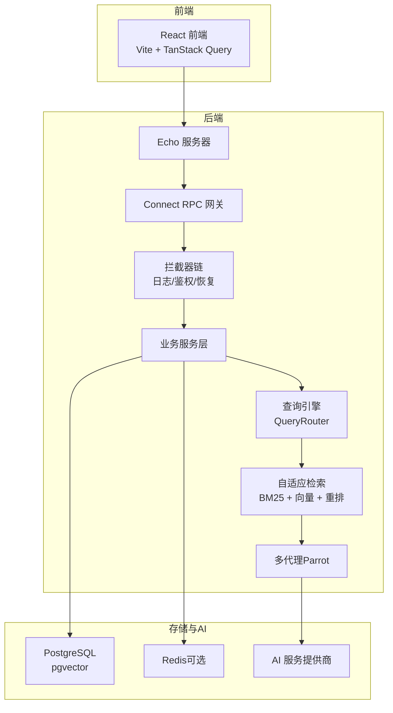

图表来源
- [docs/dev-guides/ARCHITECTURE.md](file://docs/dev-guides/ARCHITECTURE.md#L1-L138)
- [README.md](file://README.md#L157-L198)

章节来源
- [README.md](file://README.md#L157-L198)
- [docs/dev-guides/ARCHITECTURE.md](file://docs/dev-guides/ARCHITECTURE.md#L1-L138)

## 核心组件
- 结构化日志与请求上下文：统一记录请求 ID、用户 ID、代理类型、耗时与事件字段，便于跨模块关联定位。
- 统一错误码与包装：标准化 AI 相关错误类型与上下文，便于前端与日志识别与处理。
- Connect 拦截器：日志分级（客户端错误以信息级别记录，服务端错误以错误级别记录）、恢复 panic、鉴权拦截。
- 数据库连接池：针对个人助理场景优化连接数与生命周期，确保低资源占用与响应性。
- 内存缓存：带 TTL、清理与淘汰回调，支持最大项数与清理间隔配置。
- 定时任务调度：基于 Cron 的计划任务，支持链式中间件恢复与日志。
- 速率限制：基于令牌桶的限流器，支持按键维度动态创建限流器。
- 后台运行器：根据配置自动启动嵌入生成与 OCR 等后台任务。

章节来源
- [server/internal/observability/logger.go](file://server/internal/observability/logger.go#L1-L152)
- [server/internal/errors/codes.go](file://server/internal/errors/codes.go#L1-L148)
- [server/router/api/v1/connect_interceptors.go](file://server/router/api/v1/connect_interceptors.go#L1-L275)
- [store/db/postgres/postgres.go](file://store/db/postgres/postgres.go#L1-L89)
- [store/cache/cache.go](file://store/cache/cache.go#L1-L328)
- [plugin/cron/cron.go](file://plugin/cron/cron.go#L1-L354)
- [server/middleware/rate_limit.go](file://server/middleware/rate_limit.go#L1-L49)
- [server/server.go](file://server/server.go#L141-L179)

## 架构总览
下图展示从请求进入后端到数据库与 AI 服务的调用路径，以及关键可观测性与容错点：

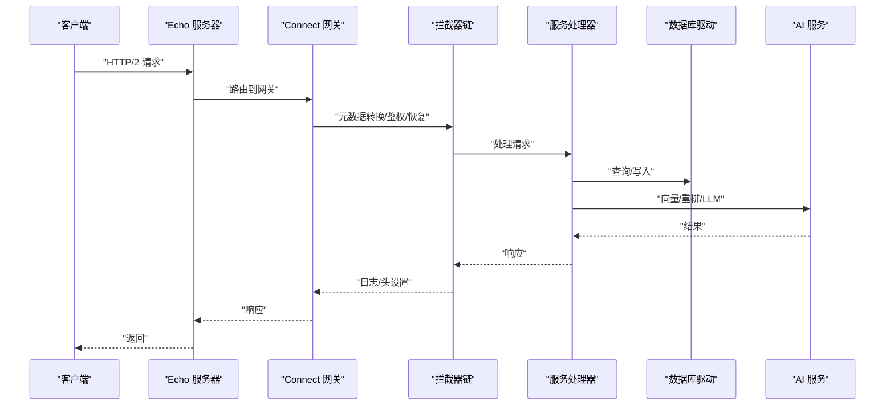

图表来源
- [server/router/api/v1/connect_interceptors.go](file://server/router/api/v1/connect_interceptors.go#L19-L275)
- [server/server.go](file://server/server.go#L89-L113)

章节来源
- [server/server.go](file://server/server.go#L89-L113)
- [server/router/api/v1/connect_interceptors.go](file://server/router/api/v1/connect_interceptors.go#L19-L275)

## 详细组件分析

### 日志与请求上下文
- 关键字段：请求 ID、用户 ID、代理类型、耗时（毫秒）、消息长度、错误码、事件类型、迭代次数。
- 上下文注入与提取：通过 WithRequestContext/FromContext/MustFromContext 实现跨模块传递。
- 使用建议：在关键入口（鉴权、路由、服务处理）打点，结合请求 ID 进行串联分析。

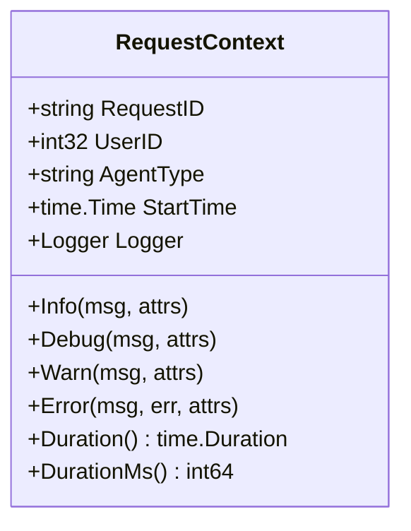

图表来源
- [server/internal/observability/logger.go](file://server/internal/observability/logger.go#L30-L127)

章节来源
- [server/internal/observability/logger.go](file://server/internal/observability/logger.go#L1-L152)

### 统一错误码与包装
- 错误码枚举：包含未授权、限流、参数非法、服务不可用、代理执行失败、代理不存在、LLM 不可用、取消、超时等。
- 结构化错误：携带 Code、Message、Cause 与 Context，支持 WithContext/WithContextMap。
- 辅助函数：IsCode、GetCodeFromError、Wrap，便于条件判断与错误透传。

```mermaid
classDiagram
class AIError {
+ErrorCode Code
+string Message
+error Cause
+map~string,interface{}~ Context
+GetCode() ErrorCode
+WithContext(key, value) *AIError
+WithContextMap(ctx) *AIError
}
class ErrorCode {
<<enumeration>>
UNAUTHORIZED
RATE_LIMIT_EXCEEDED
INVALID_ARGUMENT
SERVICE_UNAVAILABLE
AGENT_EXECUTION_FAILED
AGENT_NOT_FOUND
LLM_UNAVAILABLE
CONTEXT_CANCELED
TIMEOUT
}
AIError --> ErrorCode : "使用"
```

图表来源
- [server/internal/errors/codes.go](file://server/internal/errors/codes.go#L7-L147)

章节来源
- [server/internal/errors/codes.go](file://server/internal/errors/codes.go#L1-L148)

### Connect 拦截器与错误分类
- 元数据拦截器：将 HTTP 头转换为 gRPC 元数据，设置防缓存头。
- 日志拦截器：按错误码分类日志级别（客户端错误以信息级别，服务端错误以错误级别），可选输出堆栈。
- 恢复拦截器：捕获 panic 并返回内部错误，记录堆栈。
- 鉴权拦截器：对非公开接口进行鉴权，将用户信息注入上下文。

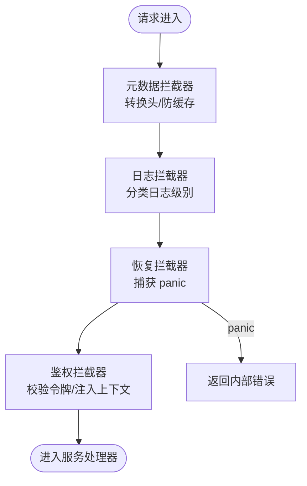

图表来源
- [server/router/api/v1/connect_interceptors.go](file://server/router/api/v1/connect_interceptors.go#L19-L275)

章节来源
- [server/router/api/v1/connect_interceptors.go](file://server/router/api/v1/connect_interceptors.go#L1-L275)

### 数据库连接池与初始化
- 连接池参数：最大打开连接数、空闲连接数、连接最大生命周期、空闲最大存活时间。
- 初始化检查：Ping 成功后才视为可用，避免启动阶段即报错。
- 生产推荐：使用 PostgreSQL（完整 AI 能力），SQLite 仅用于开发且不支持 AI 特性。

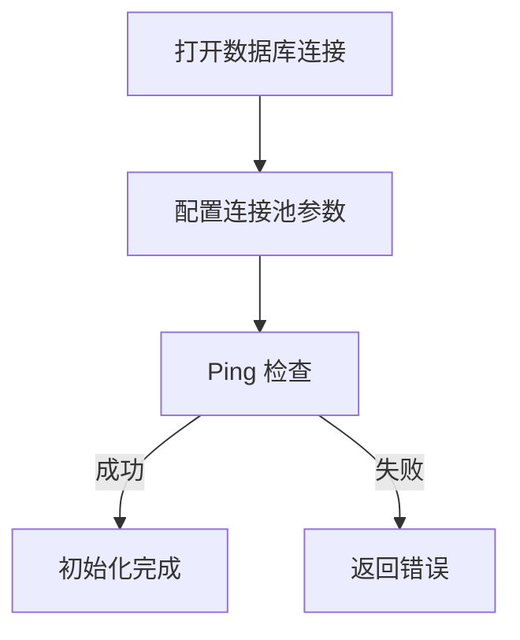

图表来源
- [store/db/postgres/postgres.go](file://store/db/postgres/postgres.go#L44-L62)

章节来源
- [store/db/postgres/postgres.go](file://store/db/postgres/postgres.go#L1-L89)

### 内存缓存与淘汰策略
- 支持 TTL、清理间隔、最大项数与淘汰回调。
- 清理策略：周期性清理过期项；超过阈值时按“最旧优先”批量淘汰。
- 估算大小：对字符串、字节切片与 map 进行粗略估算，控制内存占用。

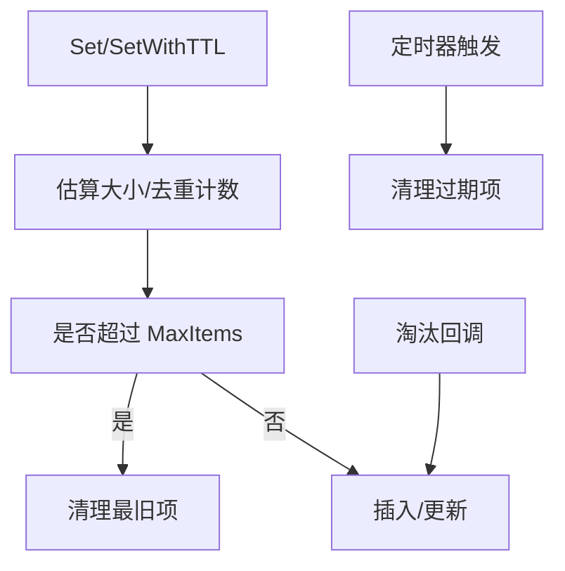

图表来源
- [store/cache/cache.go](file://store/cache/cache.go#L92-L120)
- [store/cache/cache.go](file://store/cache/cache.go#L199-L250)
- [store/cache/cache.go](file://store/cache/cache.go#L252-L313)

章节来源
- [store/cache/cache.go](file://store/cache/cache.go#L1-L328)

### 定时任务调度
- Cron 实现：支持按计划执行、快照、动态增删、停止等待运行中任务结束。
- 日志：记录启动、唤醒、调度、运行、移除等事件。
- 链式中间件：默认恢复 panic 并记录日志。

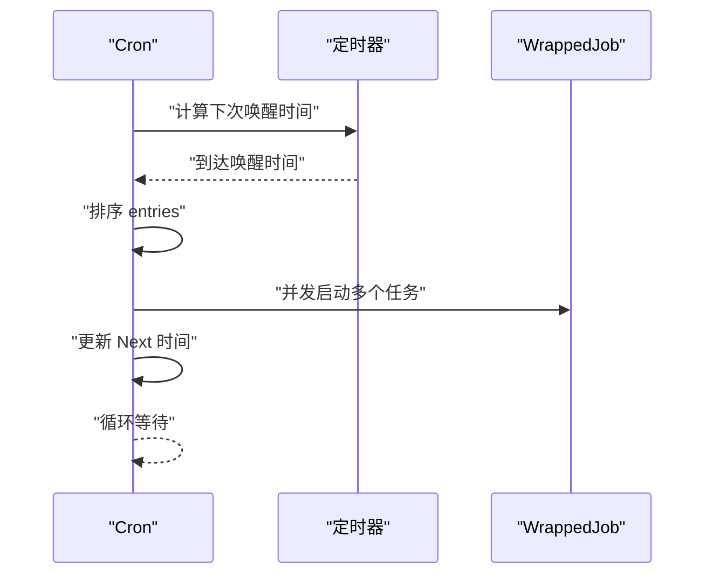

图表来源
- [plugin/cron/cron.go](file://plugin/cron/cron.go#L239-L304)

章节来源
- [plugin/cron/cron.go](file://plugin/cron/cron.go#L1-L354)

### 速率限制
- 基于令牌桶算法，每秒 10 次，突发 20。
- 动态按键创建限流器，支持 Allow/Wait。

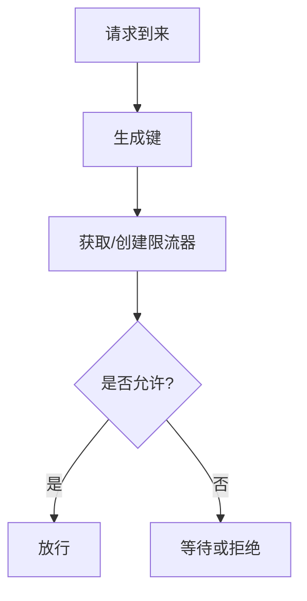

图表来源
- [server/middleware/rate_limit.go](file://server/middleware/rate_limit.go#L24-L48)

章节来源
- [server/middleware/rate_limit.go](file://server/middleware/rate_limit.go#L1-L49)

### 后台运行器与健康检查
- 后台运行器：根据配置启动嵌入生成与 OCR 任务，并在关闭时优雅停止。
- 健康检查：/healthz 返回就绪状态。
- 服务器启动：监听 TCP 或 UNIX Socket，启动 Echo 服务器并注册路由。

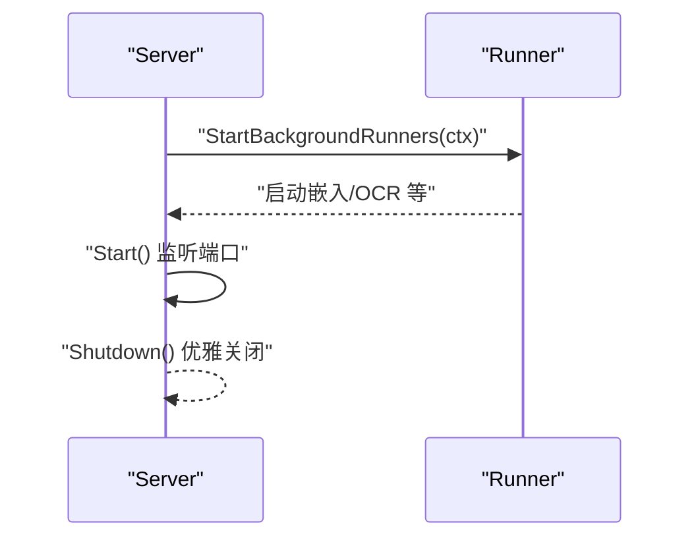

图表来源
- [server/server.go](file://server/server.go#L89-L113)
- [server/server.go](file://server/server.go#L141-L179)

章节来源
- [server/server.go](file://server/server.go#L1-L203)

## 依赖关系分析
- 日志与错误：服务层通过 RequestContext 记录请求上下文；拦截器负责日志分级与恢复。
- 数据访问：服务层依赖 Store/Driver 抽象，具体实现为 PostgreSQL/SQLite。
- 缓存：查询引擎与检索层可利用内存缓存降低压力。
- 定时任务：Cron 作为通用调度器，配合链式中间件保证健壮性。
- 限流：中间件层提供统一限流能力，适用于高并发场景。

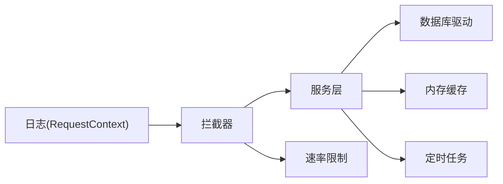

图表来源
- [server/internal/observability/logger.go](file://server/internal/observability/logger.go#L30-L127)
- [server/router/api/v1/connect_interceptors.go](file://server/router/api/v1/connect_interceptors.go#L89-L158)
- [store/cache/cache.go](file://store/cache/cache.go#L66-L90)
- [plugin/cron/cron.go](file://plugin/cron/cron.go#L113-L131)
- [server/middleware/rate_limit.go](file://server/middleware/rate_limit.go#L17-L22)

章节来源
- [server/internal/observability/logger.go](file://server/internal/observability/logger.go#L1-L152)
- [server/router/api/v1/connect_interceptors.go](file://server/router/api/v1/connect_interceptors.go#L1-L275)
- [store/cache/cache.go](file://store/cache/cache.go#L1-L328)
- [plugin/cron/cron.go](file://plugin/cron/cron.go#L1-L354)
- [server/middleware/rate_limit.go](file://server/middleware/rate_limit.go#L1-L49)

## 性能考量
- 连接池参数：生产环境建议根据并发与资源情况调整最大连接数、空闲连接数与生命周期。
- 缓存策略：合理设置 TTL 与最大项数，关注淘汰回调与内存估算，避免频繁 GC 抖动。
- 查询路由与检索：利用 QueryRouter 与 AdaptiveRetriever，减少不必要的重排与向量搜索。
- 并发与限流：对热点接口启用限流，避免突发流量导致级联失败。
- 后台任务：控制任务并发度与队列深度，避免与前台请求争抢资源。

[本节为通用指导，无需列出章节来源]

## 故障排除指南

### 启动失败
- 检查健康端点：确认 /healthz 返回正常。
- 查看启动日志：关注数据库连接、Ping 失败、网关注册失败等错误。
- 环境变量与配置：确认数据库 DSN、AI 配置、端口与 UNIX Socket 设置正确。
- 依赖服务：确保 PostgreSQL 容器运行、端口可达。

章节来源
- [server/server.go](file://server/server.go#L62-L65)
- [store/db/postgres/postgres.go](file://store/db/postgres/postgres.go#L44-L62)

### 连接问题
- 网络连通性：使用 curl 或浏览器访问 /healthz 与 API 端点，确认 28081 端口开放。
- 防缓存头：拦截器会设置 no-cache、no-store、must-revalidate，避免浏览器缓存导致的陈旧响应。
- 鉴权失败：检查 Authorization 头是否正确，非公开接口需有效令牌。

章节来源
- [server/router/api/v1/connect_interceptors.go](file://server/router/api/v1/connect_interceptors.go#L58-L64)
- [server/router/api/v1/connect_interceptors.go](file://server/router/api/v1/connect_interceptors.go#L216-L242)

### 性能瓶颈
- 慢查询分析
  - 使用数据库 EXPLAIN/ANALYZE 对热点查询进行剖析，关注索引使用与扫描成本。
  - 关注 pgvector 向量相似度查询与 BM25 关键词检索的组合使用。
- 内存使用监控
  - 观察内存缓存命中率与淘汰频率，调整 TTL 与最大项数。
  - 监控 goroutine 数量与阻塞情况，定位是否存在泄漏或死锁。
- 并发问题排查
  - 检查速率限制是否触发，必要时提升阈值或分流。
  - 关注定时任务调度是否堆积，适当增加并发或拆分任务。

章节来源
- [store/cache/cache.go](file://store/cache/cache.go#L199-L250)
- [server/middleware/rate_limit.go](file://server/middleware/rate_limit.go#L24-L48)
- [plugin/cron/cron.go](file://plugin/cron/cron.go#L239-L304)

### 功能异常（以日程查询为例）
- 诊断脚本：使用日程查询诊断脚本检查服务状态、数据库连接、代码版本与日志中的日期解析。
- 常见原因
  - 二进制过期：源码修改时间晚于编译时间，需重新构建并重启。
  - 数据库无数据：确认目标日期范围内存在日程记录。
  - 日期解析未生效：查看日志中 QueryRouting/时间范围解析是否正确。
- 快速验证：使用日程智能体测试脚本发起查询、创建与周视图测试，观察响应内容与错误码。

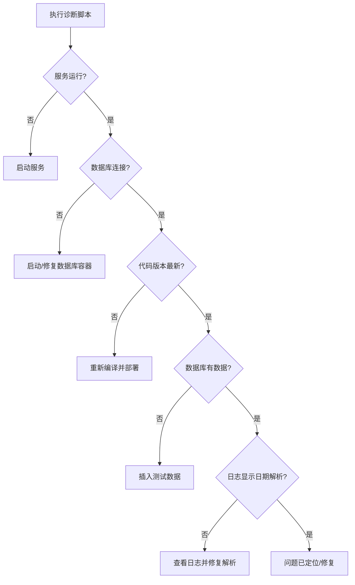

图表来源
- [scripts/diagnose_schedule_query.sh](file://scripts/diagnose_schedule_query.sh#L18-L131)
- [scripts/test_schedule_agent.sh](file://scripts/test_schedule_agent.sh#L44-L187)

章节来源
- [scripts/diagnose_schedule_query.sh](file://scripts/diagnose_schedule_query.sh#L1-L133)
- [scripts/test_schedule_agent.sh](file://scripts/test_schedule_agent.sh#L1-L188)

### 错误码与处理策略
- API 错误
  - 客户端错误（如参数非法、未找到、权限不足、未认证、配额耗尽等）以信息级别记录，便于前端友好提示。
  - 服务端错误（如内部错误、不可用等）以错误级别记录，并可选输出堆栈。
- 数据库错误
  - 连接失败：检查 DSN、网络与容器状态；确认 Ping 成功。
  - 查询失败：核对 SQL 与索引，关注 pgvector 与 BM25 的联合使用。
- 系统错误
  - 恢复拦截器捕获 panic 并返回内部错误，记录堆栈以便定位根因。

章节来源
- [server/router/api/v1/connect_interceptors.go](file://server/router/api/v1/connect_interceptors.go#L119-L158)
- [server/router/api/v1/connect_interceptors.go](file://server/router/api/v1/connect_interceptors.go#L170-L199)
- [store/db/postgres/postgres.go](file://store/db/postgres/postgres.go#L44-L62)

### 调试工具与技术
- 日志分析
  - 使用请求 ID 关联一次请求的全链路日志，结合错误码与堆栈定位问题。
  - 在拦截器开启堆栈输出，便于快速定位异常点。
- 网络抓包
  - 使用 tcpdump/Charles/DevTools 抓取 /healthz 与 API 请求，确认头部、缓存策略与响应状态。
- 数据库查询
  - 使用 EXPLAIN/ANALYZE 分析慢查询；核对索引与统计信息。
- 性能分析
  - 使用 pprof/Go 自带分析工具采集 CPU/内存/阻塞火焰图，定位热点函数与阻塞点。

[本节为通用指导，无需列出章节来源]

### 问题上报与社区支持
- 安全问题
  - 仅通过邮件报告，不要在公开 Issue 中披露漏洞。
  - 报告应包含问题描述、复现步骤、受影响版本与严重程度评估。
- 功能缺陷与一般问题
  - 使用 GitHub Issues 提交，遵循提交规范与分支策略。
  - 提供最小可复现步骤、日志片段与环境信息（Go/Node/Docker/数据库版本）。

章节来源
- [SECURITY.md](file://SECURITY.md#L7-L27)
- [CONTRIBUTING.md](file://CONTRIBUTING.md#L197-L206)

## 结论
通过结构化日志、统一错误码、拦截器链与可观测性组件，本项目提供了完善的故障定位与处理能力。结合诊断脚本、缓存与连接池优化、限流与定时任务治理，可有效应对启动失败、连接问题、性能瓶颈与功能异常。遇到安全问题请走私有渠道，一般问题欢迎在社区协作与改进。

[本节为总结性内容，无需列出章节来源]

## 附录

### 常用命令与路径
- 启动与停止
  - 启动：make start
  - 停止：make stop
  - 构建：make build
- 日志
  - 后端日志：make logs backend
- 数据库
  - 进入容器：docker exec -it memos-postgres psql -U memos -d memos
  - 查看表结构与索引：\dt+; \di+

章节来源
- [README.md](file://README.md#L202-L247)