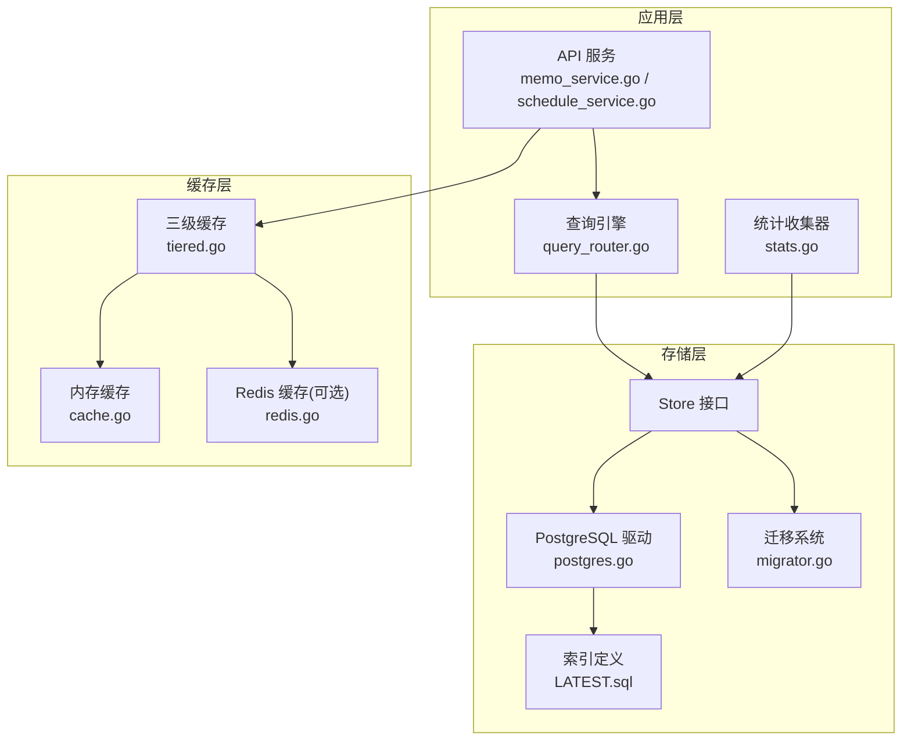
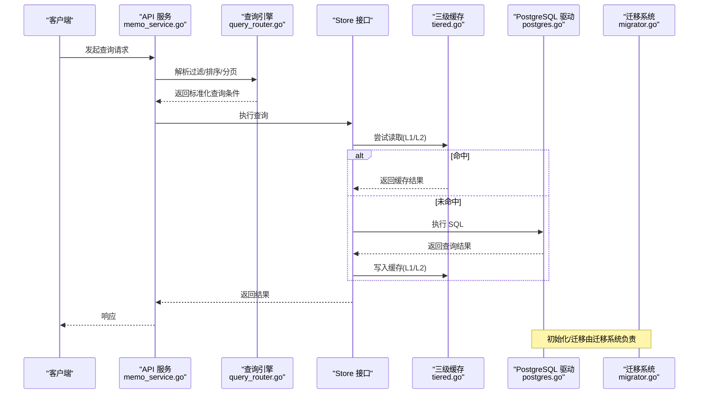
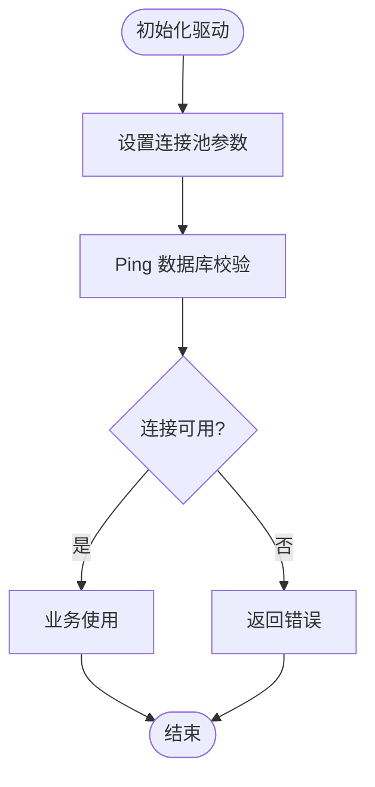
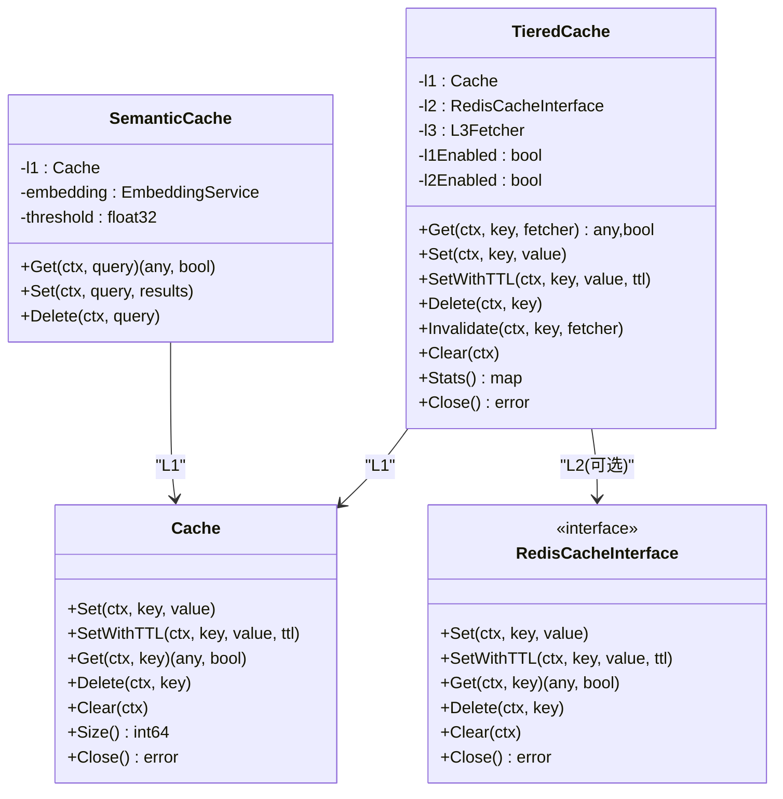
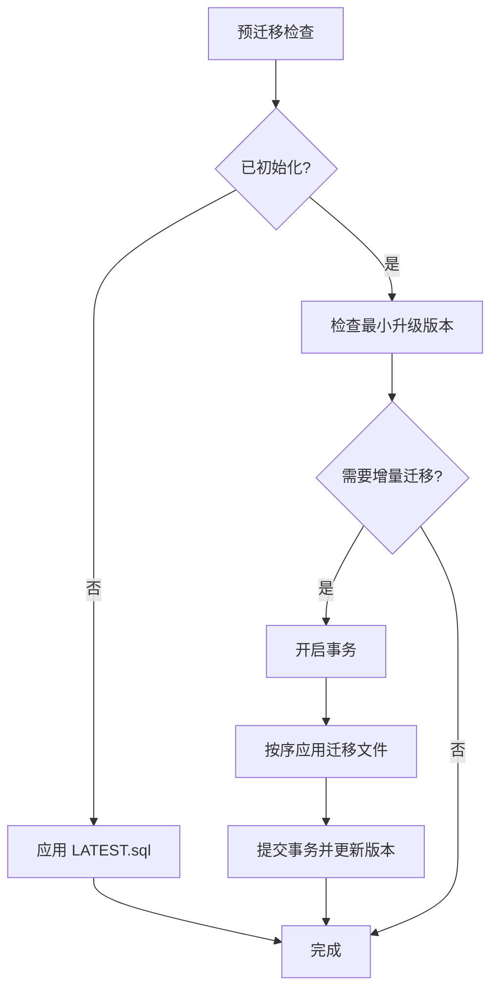
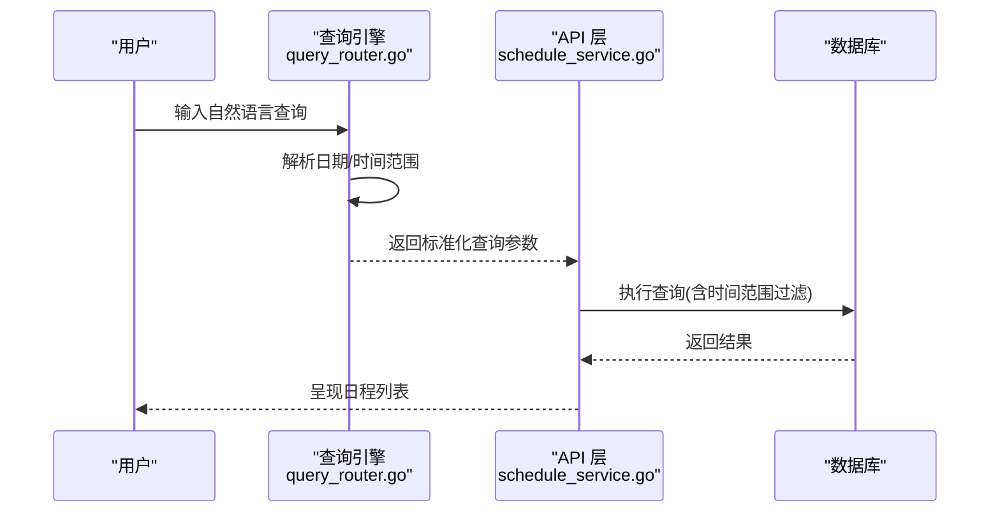
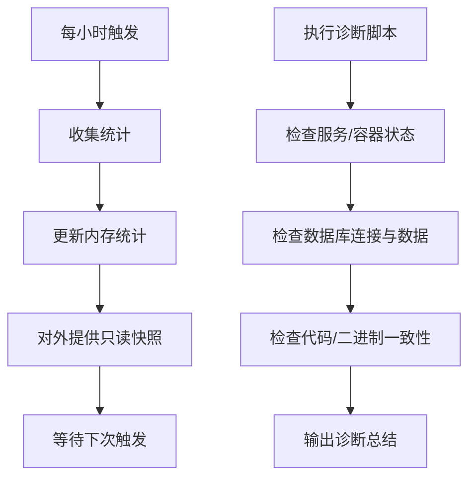
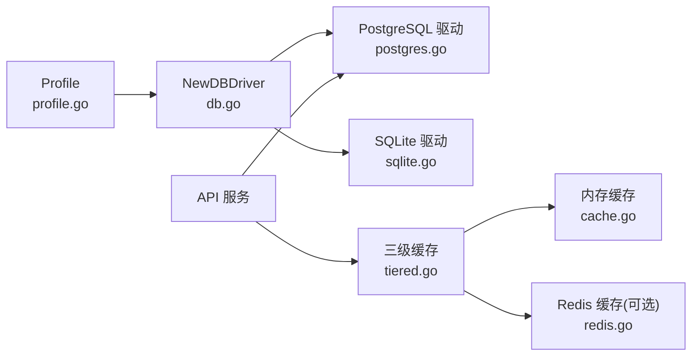

# 性能优化策略

<cite>
**本文引用的文件**
- [store/db/postgres/postgres.go](file://store/db/postgres/postgres.go)
- [store/db/db.go](file://store/db/db.go)
- [store/cache/cache.go](file://store/cache/cache.go)
- [store/cache/redis.go](file://store/cache/redis.go)
- [store/cache/tiered.go](file://store/cache/tiered.go)
- [store/migrator.go](file://store/migrator.go)
- [store/migration/postgres/LATEST.sql](file://store/migration/postgres/LATEST.sql)
- [internal/profile/profile.go](file://internal/profile/profile.go)
- [server/router/api/v1/memo_service.go](file://server/router/api/v1/memo_service.go)
- [server/router/api/v1/schedule_service.go](file://server/router/api/v1/schedule_service.go)
- [server/stats/stats.go](file://server/stats/stats.go)
- [scripts/diagnose_schedule_query.sh](file://scripts/diagnose_schedule_query.sh)
- [server/queryengine/query_router.go](file://server/queryengine/query_router.go)
</cite>

## 目录
1. [简介](#简介)
2. [项目结构](#项目结构)
3. [核心组件](#核心组件)
4. [架构总览](#架构总览)
5. [详细组件分析](#详细组件分析)
6. [依赖关系分析](#依赖关系分析)
7. [性能考量](#性能考量)
8. [故障排查指南](#故障排查指南)
9. [结论](#结论)
10. [附录](#附录)

## 简介
本文件面向数据库性能优化，结合仓库现有实现，系统性梳理查询优化、索引策略、缓存体系、连接池与并发控制、慢查询监控与诊断工具，并给出参数调优与硬件资源配置建议。内容以代码为依据，辅以可视化图示，帮助读者快速定位瓶颈并落地优化。

## 项目结构
围绕数据库性能优化的关键模块包括：
- 数据库驱动与连接池：PostgreSQL 驱动初始化与连接池参数
- 缓存体系：三层缓存（内存/L1、可选Redis/L2、数据库回调/L3），以及语义缓存
- 迁移与索引：PostgreSQL 初始化脚本与索引设计
- 查询接口与路由：API 层对查询条件与排序的处理
- 统计与诊断：本地统计收集器与日程查询诊断脚本

图表来源
- [server/router/api/v1/memo_service.go](file://server/router/api/v1/memo_service.go#L147-L200)
- [server/router/api/v1/schedule_service.go](file://server/router/api/v1/schedule_service.go#L1-L200)
- [server/queryengine/query_router.go](file://server/queryengine/query_router.go#L1-L200)
- [store/db/postgres/postgres.go](file://store/db/postgres/postgres.go#L39-L71)
- [store/migrator.go](file://store/migrator.go#L105-L146)
- [store/migration/postgres/LATEST.sql](file://store/migration/postgres/LATEST.sql#L46-L49)
- [store/cache/tiered.go](file://store/cache/tiered.go#L17-L58)
- [server/stats/stats.go](file://server/stats/stats.go#L66-L88)

章节来源
- [store/db/postgres/postgres.go](file://store/db/postgres/postgres.go#L39-L71)
- [store/db/db.go](file://store/db/db.go#L27-L44)
- [store/cache/tiered.go](file://store/cache/tiered.go#L17-L58)
- [store/migration/postgres/LATEST.sql](file://store/migration/postgres/LATEST.sql#L46-L49)
- [server/router/api/v1/memo_service.go](file://server/router/api/v1/memo_service.go#L147-L200)
- [server/router/api/v1/schedule_service.go](file://server/router/api/v1/schedule_service.go#L1-L200)
- [server/stats/stats.go](file://server/stats/stats.go#L66-L88)

## 核心组件
- PostgreSQL 驱动与连接池
  - 初始化时设置最大连接数、空闲连接数、连接最大生命周期与空闲超时，适配个人助理场景的低资源占用与响应需求。
- 三级缓存（L1/L2/L3）
  - L1：内存缓存，支持 TTL 与逐出策略；L2：Redis 可选，跨进程共享；L3：数据库回调。
  - 提供语义缓存（基于向量相似度）以复用相似查询结果。
- 迁移与索引
  - 通过迁移系统应用最新 schema；PostgreSQL 初始化脚本包含向量索引、时间范围索引等关键索引。
- 查询接口与路由
  - API 层负责解析过滤条件、排序字段与分页限制；查询引擎负责自然语言解析与时间范围推断。
- 统计与诊断
  - 统计收集器定期汇总使用数据；诊断脚本辅助定位日程查询问题。

章节来源
- [store/db/postgres/postgres.go](file://store/db/postgres/postgres.go#L51-L56)
- [store/cache/tiered.go](file://store/cache/tiered.go#L17-L58)
- [store/migrator.go](file://store/migrator.go#L105-L146)
- [store/migration/postgres/LATEST.sql](file://store/migration/postgres/LATEST.sql#L46-L49)
- [server/router/api/v1/memo_service.go](file://server/router/api/v1/memo_service.go#L147-L200)
- [server/router/api/v1/schedule_service.go](file://server/router/api/v1/schedule_service.go#L1-L200)
- [server/stats/stats.go](file://server/stats/stats.go#L66-L88)

## 架构总览
下图展示从 API 到数据库与缓存的整体路径，以及查询引擎对时间范围的处理流程。

图表来源
- [server/router/api/v1/memo_service.go](file://server/router/api/v1/memo_service.go#L147-L200)
- [server/queryengine/query_router.go](file://server/queryengine/query_router.go#L1-L200)
- [store/cache/tiered.go](file://store/cache/tiered.go#L93-L132)
- [store/db/postgres/postgres.go](file://store/db/postgres/postgres.go#L39-L71)
- [store/migrator.go](file://store/migrator.go#L105-L146)

## 详细组件分析

### 数据库驱动与连接池
- 连接池参数
  - 最大打开连接数：5
  - 最大空闲连接数：2
  - 连接最大生命周期：2 小时
  - 连接最大空闲时间：15 分钟
- 设计意图
  - 个人助理场景强调低资源占用与稳定响应，避免频繁连接/断开带来的抖动。

图表来源
- [store/db/postgres/postgres.go](file://store/db/postgres/postgres.go#L44-L62)

章节来源
- [store/db/postgres/postgres.go](file://store/db/postgres/postgres.go#L51-L56)

### 三级缓存与语义缓存
- 三层缓存
  - L1：内存缓存，支持 TTL 与逐出；L2：Redis 可选，通过环境变量启用；L3：数据库回调。
  - 读路径：L1 -> L2 -> L3；写路径：同时写入 L1/L2。
- 语义缓存
  - 基于查询向量的余弦相似度匹配，提升相似查询命中率。
- 关键配置
  - L1 默认容量与 TTL；L2 TTL；是否启用 L1/L2。

图表来源
- [store/cache/tiered.go](file://store/cache/tiered.go#L28-L132)
- [store/cache/cache.go](file://store/cache/cache.go#L66-L90)
- [store/cache/redis.go](file://store/cache/redis.go#L23-L30)
- [store/cache/tiered.go](file://store/cache/tiered.go#L233-L330)

章节来源
- [store/cache/tiered.go](file://store/cache/tiered.go#L17-L58)
- [store/cache/cache.go](file://store/cache/cache.go#L66-L90)
- [store/cache/redis.go](file://store/cache/redis.go#L78-L82)
- [store/cache/tiered.go](file://store/cache/tiered.go#L233-L330)

### 迁移与索引
- 迁移系统
  - 新安装：直接应用 LATEST.sql 完整 schema。
  - 升级：按版本顺序应用增量迁移，事务包裹保证原子性。
- 关键索引
  - 向量索引（HNSW）：加速向量相似检索。
  - 时间范围索引：GIST tsrange 用于日程冲突检测与范围查询。
  - 其他常用列索引：如附件文本检索 GIN、用户/状态组合索引等。

图表来源
- [store/migrator.go](file://store/migrator.go#L220-L264)
- [store/migrator.go](file://store/migrator.go#L148-L218)
- [store/migration/postgres/LATEST.sql](file://store/migration/postgres/LATEST.sql#L46-L49)
- [store/migration/postgres/LATEST.sql](file://store/migration/postgres/LATEST.sql#L145-L150)
- [store/migration/postgres/LATEST.sql](file://store/migration/postgres/LATEST.sql#L210-L219)

章节来源
- [store/migrator.go](file://store/migrator.go#L105-L146)
- [store/migration/postgres/LATEST.sql](file://store/migration/postgres/LATEST.sql#L46-L49)
- [store/migration/postgres/LATEST.sql](file://store/migration/postgres/LATEST.sql#L145-L150)
- [store/migration/postgres/LATEST.sql](file://store/migration/postgres/LATEST.sql#L210-L219)

### 查询接口与路由
- API 层
  - 解析排序字段、过滤表达式、可见性与分页限制；默认排除评论，支持自定义排序。
- 查询引擎
  - 对自然语言进行日期解析与时间范围推断，确保查询覆盖正确的时间区间。
- 示例流程（日程查询）
  - 用户输入“1月21日有哪些事？”
  - 查询引擎解析日期并生成时间范围
  - API 层构造查询条件并执行

图表来源
- [server/queryengine/query_router.go](file://server/queryengine/query_router.go#L1-L200)
- [server/router/api/v1/schedule_service.go](file://server/router/api/v1/schedule_service.go#L1-L200)

章节来源
- [server/router/api/v1/memo_service.go](file://server/router/api/v1/memo_service.go#L147-L200)
- [server/router/api/v1/schedule_service.go](file://server/router/api/v1/schedule_service.go#L1-L200)
- [server/queryengine/query_router.go](file://server/queryengine/query_router.go#L1-L200)

### 统计与监控
- 统计收集器
  - 每小时更新一次，统计笔记/日程/搜索/AI 查询等指标，计算活跃天数与连续活跃天数。
- 诊断脚本
  - 检查服务状态、数据库连接、查询某日程是否存在、代码版本与二进制编译时间一致性等。

图表来源
- [server/stats/stats.go](file://server/stats/stats.go#L66-L88)
- [server/stats/stats.go](file://server/stats/stats.go#L125-L230)
- [scripts/diagnose_schedule_query.sh](file://scripts/diagnose_schedule_query.sh#L18-L99)

章节来源
- [server/stats/stats.go](file://server/stats/stats.go#L66-L88)
- [server/stats/stats.go](file://server/stats/stats.go#L125-L230)
- [scripts/diagnose_schedule_query.sh](file://scripts/diagnose_schedule_query.sh#L18-L99)

## 依赖关系分析
- 驱动选择
  - 仅支持 PostgreSQL 与 SQLite；生产环境推荐 PostgreSQL，SQLite 仅限开发/测试。
- 配置来源
  - Profile 从环境变量加载数据库 DSN、驱动类型、模式等，驱动工厂根据配置创建对应驱动实例。
- 缓存启用
  - 通过环境变量判断是否启用 Redis；默认仅启用内存缓存。

图表来源
- [internal/profile/profile.go](file://internal/profile/profile.go#L15-L57)
- [store/db/db.go](file://store/db/db.go#L27-L44)
- [store/db/postgres/postgres.go](file://store/db/postgres/postgres.go#L39-L71)
- [store/cache/tiered.go](file://store/cache/tiered.go#L50-L91)
- [store/cache/redis.go](file://store/cache/redis.go#L78-L82)

章节来源
- [store/db/db.go](file://store/db/db.go#L27-L44)
- [internal/profile/profile.go](file://internal/profile/profile.go#L15-L57)
- [store/cache/tiered.go](file://store/cache/tiered.go#L50-L91)
- [store/cache/redis.go](file://store/cache/redis.go#L78-L82)

## 性能考量
- 查询优化
  - 使用过滤表达式与排序字段时，确保相关列具备合适索引（如时间戳、状态、用户 ID）。
  - 控制分页上限，避免一次性返回过多数据。
- 索引优化
  - 向量检索：HNSW 索引适合大规模向量相似检索。
  - 时间范围：GIST tsrange 用于重叠检测与范围查询。
  - 文本检索：全文索引或 GIN 索引提升模糊/关键词检索效率。
- 缓存策略
  - L1：小而快，适合高频热点；合理设置 TTL 与容量阈值。
  - L2：跨进程共享，降低重复计算；需关注网络延迟与持久化成本。
  - L3：作为最终一致性来源，确保缓存失效与回源逻辑健壮。
  - 语义缓存：对相似查询显著提升命中率，注意阈值与嵌入模型质量。
- 连接池与并发
  - 个人助理场景建议保持较低并发（最大 5），避免数据库压力过大。
  - 合理设置连接生命周期，减少长连接带来的资源占用。
- 参数调优与硬件
  - PostgreSQL 参数：共享缓冲区、工作内存、维护工作内存、检查点间隔等需结合数据规模与 CPU/内存资源调整。
  - 硬件建议：SSD 存储、充足的内存（满足共享缓冲区与 OS 缓冲）、多核 CPU 以提升并发处理能力。
- 监控与诊断
  - 使用统计收集器观察趋势；利用诊断脚本快速定位服务/容器/数据问题。
  - 结合数据库慢查询日志与执行计划分析工具，持续优化关键路径。

[本节为通用指导，不直接分析具体文件]

## 故障排查指南
- 服务/容器不可用
  - 使用诊断脚本检查服务状态与数据库容器运行情况。
- 查询结果异常
  - 确认代码与二进制一致性；检查日志中日期解析与时间范围推断是否符合预期。
- 数据缺失
  - 直接查询数据库确认目标日期是否存在数据；核对时间戳转换与时区设置。
- 缓存命中率低
  - 检查 L1/L2 配置与 TTL；评估语义缓存阈值是否合理；关注热点键分布。

章节来源
- [scripts/diagnose_schedule_query.sh](file://scripts/diagnose_schedule_query.sh#L18-L99)
- [server/queryengine/query_router.go](file://server/queryengine/query_router.go#L1-L200)

## 结论
本项目在数据库性能方面提供了清晰的实现路径：合理的连接池参数、完善的三级缓存体系、关键索引与迁移机制，以及配套的统计与诊断工具。结合本文的优化建议与最佳实践，可在个人助理场景下获得稳定且可扩展的性能表现。

[本节为总结性内容，不直接分析具体文件]

## 附录
- 环境变量与配置要点
  - 数据库驱动与 DSN：通过 Profile 加载；生产环境推荐 PostgreSQL。
  - Redis 缓存：通过环境变量启用；默认关闭。
- 关键 SQL 索引参考
  - 向量索引：HNSW
  - 时间范围索引：GIST tsrange
  - 文本检索：GIN/to_tsvector

章节来源
- [internal/profile/profile.go](file://internal/profile/profile.go#L15-L57)
- [store/cache/redis.go](file://store/cache/redis.go#L78-L82)
- [store/migration/postgres/LATEST.sql](file://store/migration/postgres/LATEST.sql#L46-L49)
- [store/migration/postgres/LATEST.sql](file://store/migration/postgres/LATEST.sql#L145-L150)
- [store/migration/postgres/LATEST.sql](file://store/migration/postgres/LATEST.sql#L210-L219)