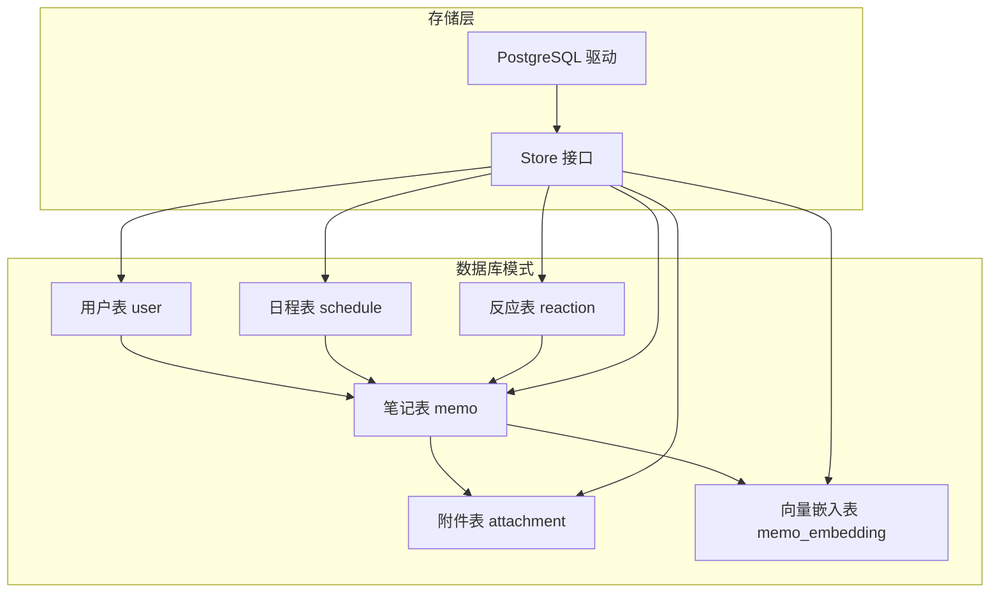
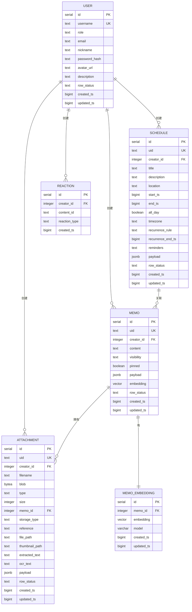
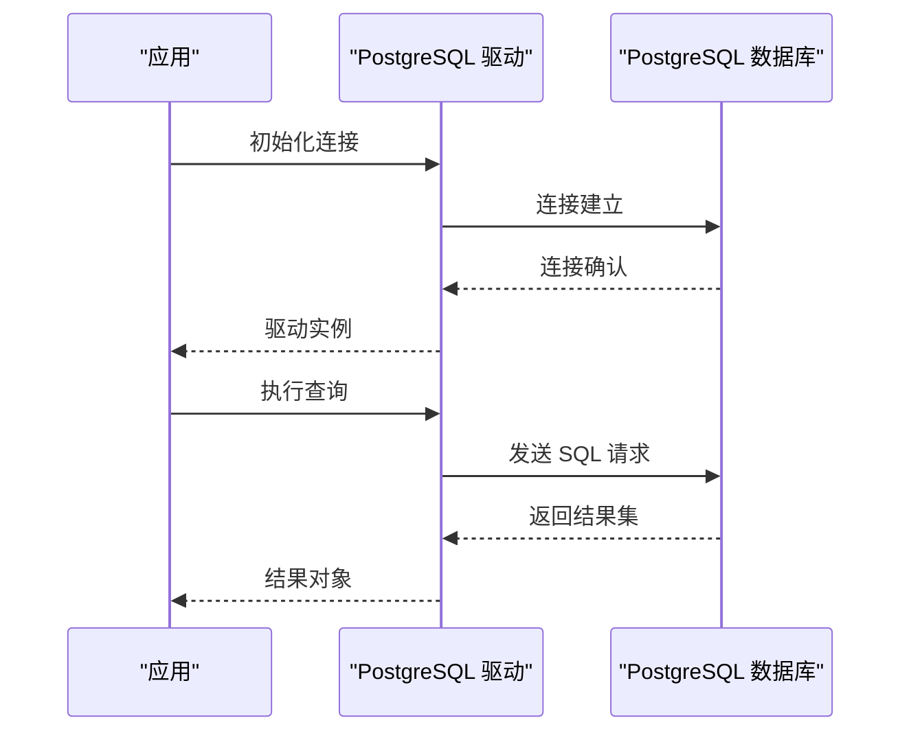
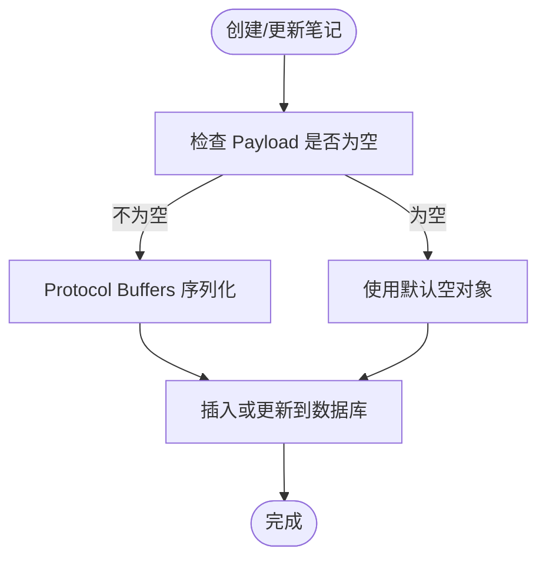
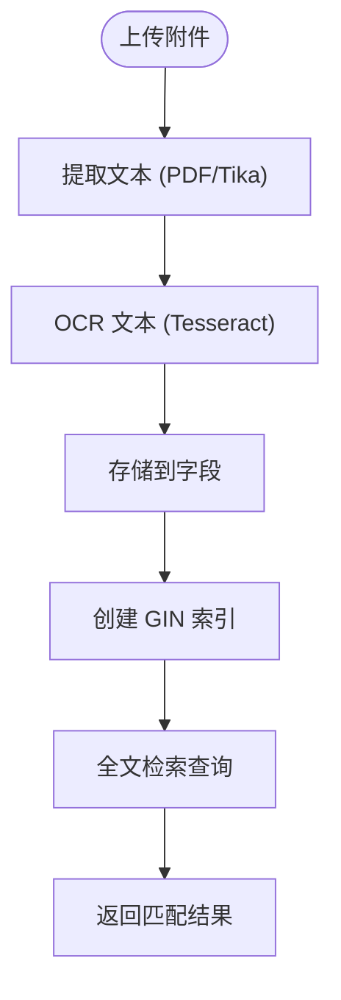
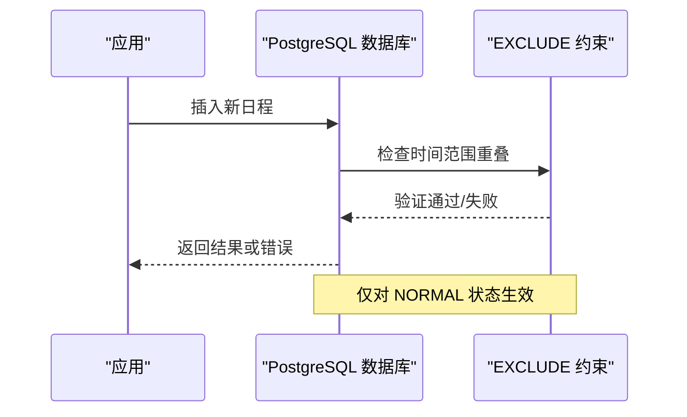
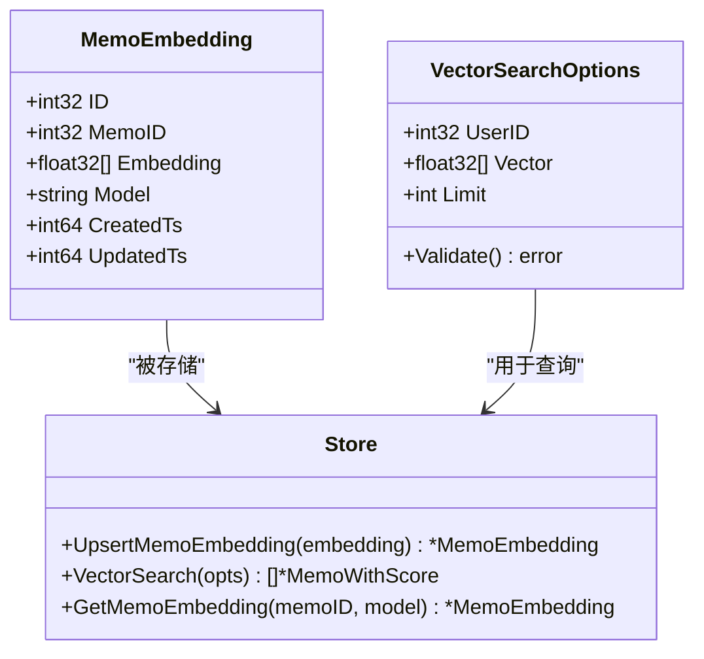
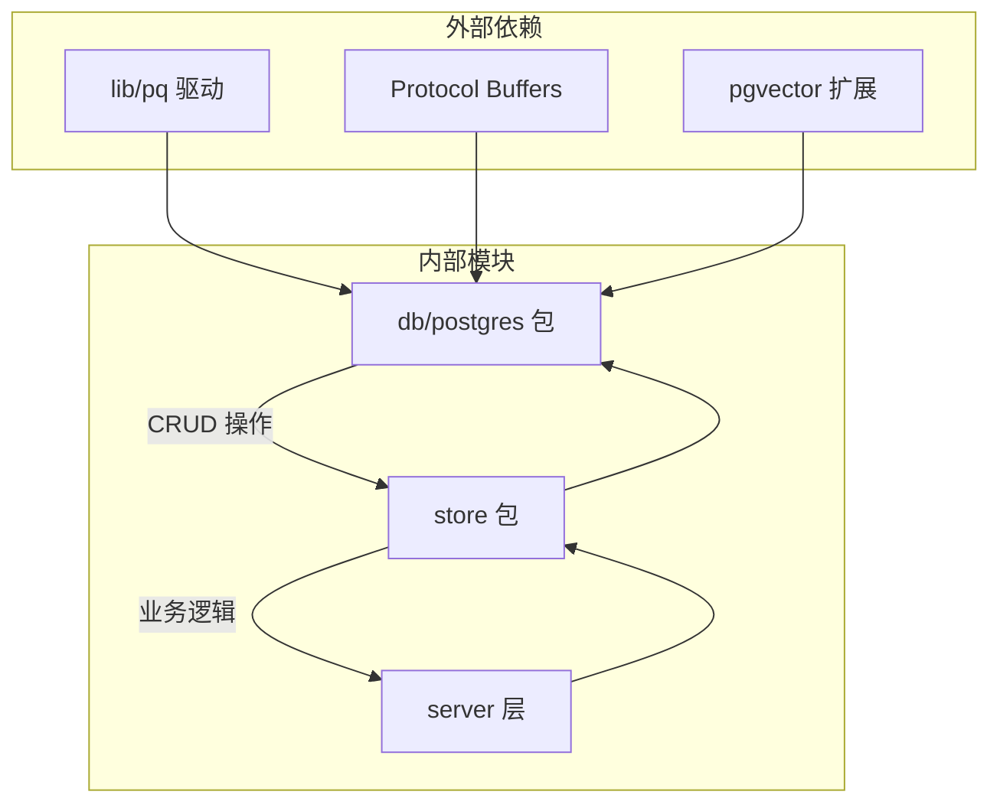

# 数据库模式设计

<cite>
**本文档引用的文件**
- [LATEST.sql](file://store/migration/postgres/LATEST.sql)
- [postgres.go](file://store/db/postgres/postgres.go)
- [memo.go](file://store/memo.go)
- [attachment.go](file://store/attachment.go)
- [schedule.go](file://store/schedule.go)
- [reaction.go](file://store/reaction.go)
- [memo_embedding.go](file://store/memo_embedding.go)
- [postgres.go](file://store/db/postgres/memo.go)
- [postgres.go](file://store/db/postgres/attachment.go)
- [postgres.go](file://store/db/postgres/schedule.go)
- [postgres.go](file://store/db/postgres/reaction.go)
</cite>

## 目录
1. [简介](#简介)
2. [项目结构](#项目结构)
3. [核心组件](#核心组件)
4. [架构概览](#架构概览)
5. [详细组件分析](#详细组件分析)
6. [依赖关系分析](#依赖关系分析)
7. [性能考虑](#性能考虑)
8. [故障排除指南](#故障排除指南)
9. [结论](#结论)

## 简介

本文档详细描述了 Memos 项目的数据库模式设计，重点涵盖核心数据表的结构、字段定义、主键外键关系以及约束条件。文档特别关注以下主要实体：

- 用户表 (user)
- 笔记表 (memo)
- 附件表 (attachment)
- 日程表 (schedule)
- 反应表 (reaction)
- 向量嵌入表 (memo_embedding)

此外，文档还解释了 JSONB 字段的使用模式、数据结构，以及向量嵌入表的设计原理和向量索引策略。

## 项目结构

数据库模式由 PostgreSQL 迁移脚本定义，并通过 Go 语言的存储层进行访问。核心结构如下：

**图表来源**
- [LATEST.sql](file://store/migration/postgres/LATEST.sql#L8-L301)
- [postgres.go](file://store/db/postgres/postgres.go#L34-L79)

**章节来源**
- [LATEST.sql](file://store/migration/postgres/LATEST.sql#L1-L301)
- [postgres.go](file://store/db/postgres/postgres.go#L1-L89)

## 核心组件

### 用户表 (user)

- 主键: `id` (SERIAL)
- 关键字段:
  - `username`: 文本，唯一
  - `role`: 文本，默认 'USER'
  - `email`: 文本，默认空字符串
  - `nickname`: 文本，默认空字符串
  - `password_hash`: 文本
  - `avatar_url`: 文本
  - `description`: 文本，默认空字符串
  - `row_status`: 文本，默认 'NORMAL'
  - 时间戳: `created_ts`, `updated_ts`

- 约束:
  - `username` 唯一
  - `row_status` 默认值为 'NORMAL'

**章节来源**
- [LATEST.sql](file://store/migration/postgres/LATEST.sql#L8-L21)
- [user.go](file://store/user.go#L44-L60)

### 笔记表 (memo)

- 主键: `id` (SERIAL)
- 关键字段:
  - `uid`: 文本，唯一
  - `creator_id`: 整数，外键引用 `user(id)`，级联删除
  - `content`: 文本
  - `visibility`: 文本，默认 'PRIVATE'
  - `pinned`: 布尔，默认 FALSE
  - `payload`: JSONB，默认 '{}'
  - `embedding`: 向量，维度 1024
  - 时间戳: `created_ts`, `updated_ts`
  - `row_status`: 文本，默认 'NORMAL'

- 约束:
  - 外键: `creator_id` 引用 `user(id)`，ON DELETE CASCADE
  - `uid` 唯一
  - `visibility` 默认值为 'PRIVATE'
  - `row_status` 默认值为 'NORMAL'

- 索引:
  - HNSW 向量索引用于快速向量相似度搜索

**章节来源**
- [LATEST.sql](file://store/migration/postgres/LATEST.sql#L31-L49)
- [memo.go](file://store/memo.go#L35-L55)

### 附件表 (attachment)

- 主键: `id` (SERIAL)
- 关键字段:
  - `uid`: 文本，唯一
  - `creator_id`: 整数，外键引用 `user(id)`
  - `filename`: 文本
  - `blob`: 字节数组
  - `type`: 文本，默认空字符串
  - `size`: 整数，默认 0
  - `memo_id`: 整数，外键引用 `memo(id)` (可为空)
  - `storage_type`: 文本，默认空字符串
  - `reference`: 文本，默认空字符串
  - `file_path`: 文本
  - `thumbnail_path`: 文本
  - `extracted_text`: 文本 (PDF/Office 提取)
  - `ocr_text`: 文本 (图像 OCR 提取)
  - `payload`: JSONB，默认 '{}'
  - 时间戳: `created_ts`, `updated_ts`
  - `row_status`: 文本，默认 'NORMAL'

- 约束:
  - 外键: `creator_id` 引用 `user(id)`，ON DELETE CASCADE
  - 外键: `memo_id` 引用 `memo(id)`，ON DELETE SET NULL
  - `row_status` 检查约束: 仅允许 'NORMAL', 'ARCHIVED', 'DELETED'

- 索引:
  - `(creator_id, row_status)`
  - `type`
  - `memo_id` (当非空时)
  - GIN 全文检索索引 (基于 `extracted_text` 和 `ocr_text`)

**章节来源**
- [LATEST.sql](file://store/migration/postgres/LATEST.sql#L59-L86)
- [attachment.go](file://store/attachment.go#L15-L49)

### 日程表 (schedule)

- 主键: `id` (SERIAL)
- 关键字段:
  - `uid`: 文本，唯一
  - `creator_id`: 整数，外键引用 `user(id)`
  - `title`: 文本
  - `description`: 文本，默认空字符串
  - `location`: 文本，默认空字符串
  - `start_ts`: 整数
  - `end_ts`: 整数 (可为空)
  - `all_day`: 布尔，默认 FALSE
  - `timezone`: 文本，默认 'Asia/Shanghai'
  - `recurrence_rule`: 文本 (可为空)
  - `recurrence_end_ts`: 整数 (可为空)
  - `reminders`: 文本，默认 '[]'
  - `payload`: JSONB，默认 '{}'
  - 时间戳: `created_ts`, `updated_ts`
  - `row_status`: 文本，默认 'NORMAL'

- 约束:
  - 外键: `creator_id` 引用 `user(id)`，ON DELETE CASCADE
  - 时间范围检查: `end_ts` 为空或 `>= start_ts`
  - `reminders` JSON 格式检查
  - `row_status` 默认值为 'NORMAL'

- 索引:
  - `(creator_id, start_ts)`
  - `(creator_id, row_status)`
  - `start_ts`
  - `uid`

- 冲突检测:
  - 使用 EXCLUDE 约束防止同一用户的时间冲突
  - 仅对 `row_status = 'NORMAL'` 的记录生效

**章节来源**
- [LATEST.sql](file://store/migration/postgres/LATEST.sql#L165-L222)
- [schedule.go](file://store/schedule.go#L8-L27)

### 反应表 (reaction)

- 主键: `id` (SERIAL)
- 关键字段:
  - `creator_id`: 整数，外键引用 `user(id)`
  - `content_id`: 文本
  - `reaction_type`: 文本
  - 时间戳: `created_ts`

- 约束:
  - 外键: `creator_id` 引用 `user(id)`，ON DELETE CASCADE
  - 唯一约束: `(creator_id, content_id, reaction_type)`

**章节来源**
- [LATEST.sql](file://store/migration/postgres/LATEST.sql#L117-L125)
- [reaction.go](file://store/reaction.go#L7-L14)

### 向量嵌入表 (memo_embedding)

- 主键: `id` (SERIAL)
- 关键字段:
  - `memo_id`: 整数，外键引用 `memo(id)`，级联删除
  - `embedding`: 向量，维度 1024
  - `model`: 文本，默认 'BAAI/bge-m3'
  - 时间戳: `created_ts`, `updated_ts`

- 约束:
  - 外键: `memo_id` 引用 `memo(id)`，ON DELETE CASCADE
  - 唯一约束: `(memo_id, model)`

- 索引:
  - HNSW 向量索引 (余弦距离)
  - `memo_id` 普通索引

- 触发器:
  - 更新 `updated_ts` 时自动设置为当前时间戳

**章节来源**
- [LATEST.sql](file://store/migration/postgres/LATEST.sql#L127-L163)
- [memo_embedding.go](file://store/memo_embedding.go#L8-L16)

## 架构概览

**图表来源**
- [LATEST.sql](file://store/migration/postgres/LATEST.sql#L8-L301)

## 详细组件分析

### 数据库连接与驱动

PostgreSQL 驱动配置针对个人助理场景进行了优化，采用单用户环境下的连接池设置，平衡了响应速度与资源消耗。

**图表来源**
- [postgres.go](file://store/db/postgres/postgres.go#L39-L70)

**章节来源**
- [postgres.go](file://store/db/postgres/postgres.go#L1-L89)

### 笔记表 (memo) 的 JSONB 使用

笔记表中的 `payload` 字段使用 JSONB 存储结构化元数据，支持高效的查询和更新操作。存储层通过 Protocol Buffers 进行序列化和反序列化。

**图表来源**
- [postgres.go](file://store/db/postgres/memo.go#L16-L48)

**章节来源**
- [postgres.go](file://store/db/postgres/memo.go#L16-L48)
- [memo.go](file://store/memo.go#L35-L55)

### 附件表 (attachment) 的全文检索

附件表支持基于提取文本的全文检索，通过 GIN 索引实现高效的搜索性能。

**图表来源**
- [LATEST.sql](file://store/migration/postgres/LATEST.sql#L82-L86)

**章节来源**
- [LATEST.sql](file://store/migration/postgres/LATEST.sql#L59-L86)
- [attachment.go](file://store/attachment.go#L15-L49)

### 日程表 (schedule) 的冲突检测

日程表实现了基于 EXCLUDE 约束的原子性冲突检测，确保同一用户在同一时间段内不会出现重叠的日程安排。

**图表来源**
- [LATEST.sql](file://store/migration/postgres/LATEST.sql#L199-L222)
- [postgres.go](file://store/db/postgres/schedule.go#L14-L57)

**章节来源**
- [LATEST.sql](file://store/migration/postgres/LATEST.sql#L165-L222)
- [postgres.go](file://store/db/postgres/schedule.go#L286-L326)

### 向量嵌入表 (memo_embedding) 的设计

向量嵌入表为笔记提供了语义搜索能力，支持基于余弦相似度的快速检索。

**图表来源**
- [memo_embedding.go](file://store/memo_embedding.go#L8-L61)
- [postgres.go](file://store/db/postgres/memo.go#L267-L340)

**章节来源**
- [LATEST.sql](file://store/migration/postgres/LATEST.sql#L127-L163)
- [memo_embedding.go](file://store/memo_embedding.go#L1-L155)

## 依赖关系分析

**图表来源**
- [postgres.go](file://store/db/postgres/postgres.go#L9-L11)
- [postgres.go](file://store/db/postgres/memo.go#L8-L13)

**章节来源**
- [postgres.go](file://store/db/postgres/postgres.go#L1-L89)

## 性能考虑

### 索引策略

- **向量索引**: 使用 HNSW 算法，参数 m=16, ef_construction=64，平衡内存使用与查询性能
- **全文检索**: GIN 索引优化文本搜索
- **时间范围查询**: 为日程表的起始时间和状态建立复合索引
- **外键索引**: 为所有外键字段建立索引以优化 JOIN 性能

### 连接池配置

针对个人助理场景的连接池优化：
- 最大连接数: 5
- 空闲连接数: 2
- 连接最大生命周期: 2小时
- 空闲连接最大存活时间: 15分钟

### 查询限制

- 结果集限制: 默认 10000 条记录，防止内存溢出
- 向量搜索限制: 默认 10 条结果，最大 1000 条
- BM25 搜索限制: 默认 10 条结果，最大 1000 条

## 故障排除指南

### 常见问题

1. **pgvector 扩展未启用**
   - 症状: 创建向量索引时报错
   - 解决: 确保 PostgreSQL 已安装并启用 vector 扩展

2. **日程冲突错误**
   - 症状: 插入日程时返回 23P01 错误
   - 解决: 检查时间范围是否与其他日程重叠

3. **JSONB 序列化错误**
   - 症状: Protocol Buffers 序列化失败
   - 解决: 验证数据结构的正确性

**章节来源**
- [postgres.go](file://store/db/postgres/schedule.go#L304-L326)
- [postgres.go](file://store/db/postgres/memo.go#L16-L48)

## 结论

该数据库模式设计充分考虑了 Memos 的核心功能需求，通过合理的表结构设计、索引策略和约束机制，实现了高效的数据存储和查询能力。JSONB 字段的使用为扩展性提供了灵活性，而向量嵌入表则为语义搜索奠定了基础。整体设计在保证数据完整性的同时，兼顾了性能和可维护性。