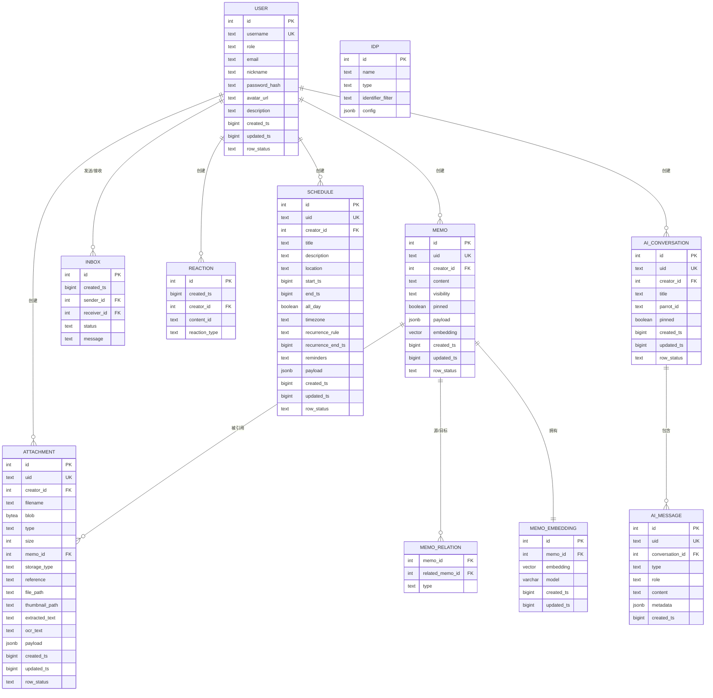

# 数据库设计

<cite>
**本文引用的文件**
- [store/db/db.go](file://store/db/db.go)
- [store/driver.go](file://store/driver.go)
- [store/store.go](file://store/store.go)
- [store/migrator.go](file://store/migrator.go)
- [store/cache/cache.go](file://store/cache/cache.go)
- [store/db/postgres/postgres.go](file://store/db/postgres/postgres.go)
- [store/db/sqlite/sqlite.go](file://store/db/sqlite/sqlite.go)
- [store/migration/postgres/LATEST.sql](file://store/migration/postgres/LATEST.sql)
- [store/user.go](file://store/user.go)
- [store/memo.go](file://store/memo.go)
- [store/schedule.go](file://store/schedule.go)
- [store/memo_embedding.go](file://store/memo_embedding.go)
- [store/instance_setting.go](file://store/instance_setting.go)
</cite>

## 目录
1. [简介](#简介)
2. [项目结构](#项目结构)
3. [核心组件](#核心组件)
4. [架构总览](#架构总览)
5. [详细组件分析](#详细组件分析)
6. [依赖分析](#依赖分析)
7. [性能考虑](#性能考虑)
8. [故障排查指南](#故障排查指南)
9. [结论](#结论)
10. [附录](#附录)

## 简介
本文件系统化梳理了数据库设计与实现，覆盖以下方面：
- 设计原则与实体关系模型（ER）
- 主要数据表结构与字段定义
- 索引策略与约束设计（主键、外键、唯一约束、检查约束、复合索引、扩展索引）
- 查询优化策略（查询计划分析、性能调优、缓存策略）
- 数据迁移管理（版本控制、迁移脚本、回滚策略）
- 备份、恢复与监控最佳实践
- 性能诊断与问题排查

## 项目结构
数据库层采用“接口抽象 + 多驱动实现”的分层设计：
- 抽象层：统一的 Driver 接口定义所有数据访问方法
- 实现层：PostgreSQL 与 SQLite 双驱动，分别面向生产与开发测试
- 存储层：Store 封装 Driver，并内置多类缓存
- 迁移层：基于嵌入式文件系统的版本化迁移与种子数据

图表来源
- [store/driver.go](file://store/driver.go#L10-L102)
- [store/store.go](file://store/store.go#L12-L44)
- [store/db/postgres/postgres.go](file://store/db/postgres/postgres.go#L34-L79)
- [store/db/sqlite/sqlite.go](file://store/db/sqlite/sqlite.go#L38-L99)

章节来源
- [store/db/db.go](file://store/db/db.go#L27-L44)
- [store/driver.go](file://store/driver.go#L10-L102)
- [store/store.go](file://store/store.go#L12-L44)

## 核心组件
- Driver 接口：定义所有模型的增删改查与向量检索等能力
- Store：持有 Driver 并提供缓存（实例设置、用户、用户设置）
- 迁移器：负责预迁移、增量迁移、版本更新、演示数据填充
- 缓存：内存缓存，支持 TTL、清理周期、淘汰回调

章节来源
- [store/driver.go](file://store/driver.go#L10-L102)
- [store/store.go](file://store/store.go#L12-L44)
- [store/migrator.go](file://store/migrator.go#L105-L146)
- [store/cache/cache.go](file://store/cache/cache.go#L66-L90)

## 架构总览
数据库层通过统一接口屏蔽底层差异，同时在 PostgreSQL 上启用高级特性（向量、全文检索、时间范围约束），在 SQLite 上提供受限但可用的功能。

图表来源
- [store/driver.go](file://store/driver.go#L10-L102)
- [store/store.go](file://store/store.go#L12-L44)
- [store/db/postgres/postgres.go](file://store/db/postgres/postgres.go#L34-L79)
- [store/db/sqlite/sqlite.go](file://store/db/sqlite/sqlite.go#L38-L99)

## 详细组件分析

### 数据库模式与实体关系模型（ER）
- 模式来源：PostgreSQL 最新完整模式文件
- 关键实体与关系概览：
  - 用户与备忘录：一对多（用户创建备忘录）
  - 备忘录与附件：一对多（附件可归属备忘录）
  - 备忘录与关系：多对多（通过 memo_relation 表）
  - 备忘录与嵌入：一对一（memo_embedding 记录向量）
  - 用户与身份提供商：一对多（用户可绑定多个 IDP）
  - 用户与收件箱：一对多（消息由用户发送/接收）
  - 用户与反应：多对多（通过 reaction 表）
  - 用户与日程：一对多（日程由用户创建）
  - AI 对话与消息：一对多（对话包含多条消息）

图表来源
- [store/migration/postgres/LATEST.sql](file://store/migration/postgres/LATEST.sql#L1-L301)

章节来源
- [store/migration/postgres/LATEST.sql](file://store/migration/postgres/LATEST.sql#L1-L301)

### 主要数据表结构与字段定义
- system_setting：系统级配置项，name 唯一
- user：用户信息，username 唯一，含角色、邮箱、昵称、密码哈希等
- user_setting：用户个性化设置，(user_id, key) 唯一
- memo：备忘录正文、可见性、是否置顶、JSON 负载、向量嵌入
- memo_relation：备忘录间关系，(memo_id, related_memo_id, type) 唯一
- attachment：附件元数据与内容，支持 OCR 文本检索索引
- activity：活动日志
- idp：身份提供商配置
- inbox：站内消息
- reaction：反应/表情
- memo_embedding：向量嵌入表，外键到 memo，(memo_id, model) 唯一
- schedule：日程，含重复规则、提醒、时区、时间范围约束
- ai_conversation：AI 对话
- ai_message：AI 消息

章节来源
- [store/migration/postgres/LATEST.sql](file://store/migration/postgres/LATEST.sql#L1-L301)

### 索引策略与约束设计
- 主键与唯一约束
  - 所有表主键为自增整型或 UID 字段唯一
  - 复合唯一：user_setting(user_id, key)、memo_relation(memo_id, related_memo_id, type)、memo_embedding(memo_id, model)
- 外键约束
  - memo.creator_id → user.id
  - attachment.memo_id → memo.id
  - memo_embedding.memo_id → memo.id
  - schedule.creator_id → user.id
  - reaction.creator_id → user.id
  - inbox.sender_id/receiver_id → user.id
  - ai_message.conversation_id → ai_conversation.id
- 检查约束
  - schedule.end_ts ≥ start_ts 或 end_ts 为空；reminders JSON 结构校验
  - 各表 row_status 限定枚举值
- 复合索引
  - attachment：(creator_id, row_status)、(type)、(memo_id)（非空时）、文本检索 GIN
  - schedule：(creator_id, start_ts)、(creator_id, row_status)、start_ts、uid
  - ai_conversation：(creator_id)、updated_ts 降序
  - ai_message：(conversation_id)、created_ts 升序
- 扩展索引与高级特性
  - pgvector HNSW：memo.embedding、memo_embedding.embedding
  - 时间范围索引：schedule 的 tsrange + GIST，原子冲突检测
  - 全文检索：attachment 文本列的 to_tsvector GIN

章节来源
- [store/migration/postgres/LATEST.sql](file://store/migration/postgres/LATEST.sql#L46-L49)
- [store/migration/postgres/LATEST.sql](file://store/migration/postgres/LATEST.sql#L145-L150)
- [store/migration/postgres/LATEST.sql](file://store/migration/postgres/LATEST.sql#L194-L197)
- [store/migration/postgres/LATEST.sql](file://store/migration/postgres/LATEST.sql#L200-L222)
- [store/migration/postgres/LATEST.sql](file://store/migration/postgres/LATEST.sql#L82-L86)

### 查询优化策略
- 索引使用建议
  - 高频过滤：按 creator_id + 时间排序的复合索引优先
  - 向量相似：HNSW 索引配合 cosine 距离
  - 全文检索：对提取文本与 OCR 文本进行 GIN 索引
  - 冲突检测：GIST tsrange 约束用于原子性冲突检测
- 查询计划分析
  - 使用 EXPLAIN/EXPLAIN ANALYZE 分析关键路径（如 schedule 列表、memo 向量检索、attachment 文本搜索）
  - 关注索引选择、排序成本、子查询展开
- 性能调优
  - 连接池参数：PostgreSQL 设置最大连接数、空闲连接、生命周期
  - 统计信息：定期更新以提升估算准确性
  - 分页与限制：避免全表扫描，合理设置 LIMIT
- 缓存策略
  - Store 层内置三类缓存：实例设置、用户、用户设置
  - 缓存 TTL、清理周期、淘汰回调可配置
  - 读多写少场景显著降低数据库压力

章节来源
- [store/db/postgres/postgres.go](file://store/db/postgres/postgres.go#L51-L56)
- [store/cache/cache.go](file://store/cache/cache.go#L42-L64)
- [store/cache/cache.go](file://store/cache/cache.go#L92-L120)
- [store/cache/cache.go](file://store/cache/cache.go#L200-L215)

### 数据迁移管理
- 版本控制
  - 迁移文件命名：NN__description.sql，NN 为零填充序号
  - 版本解析：从文件名推导版本，末尾文件为 LATEST.sql
  - 当前版本：根据当前运行版本计算目标版本
- 迁移流程
  - 预迁移：若未初始化则一次性执行 LATEST.sql
  - 增量迁移：在当前版本与目标版本之间按序应用
  - 版本更新：成功后写回 system_setting 中的 schema_version
  - 演示模式：仅支持 SQLite，执行种子数据
- 回滚策略
  - 不提供自动回滚；禁止降级（比较数据库版本与当前版本）
  - 如需回退，建议备份后手动处理

图表来源
- [store/migrator.go](file://store/migrator.go#L105-L146)
- [store/migrator.go](file://store/migrator.go#L148-L218)
- [store/migrator.go](file://store/migrator.go#L220-L264)
- [store/migrator.go](file://store/migrator.go#L374-L414)

章节来源
- [store/migrator.go](file://store/migrator.go#L21-L42)
- [store/migrator.go](file://store/migrator.go#L105-L146)
- [store/migrator.go](file://store/migrator.go#L148-L218)
- [store/migrator.go](file://store/migrator.go#L220-L264)
- [store/migrator.go](file://store/migrator.go#L374-L414)

### 备份、恢复与监控最佳实践
- 备份
  - 生产环境使用逻辑备份（pg_dump）或物理备份（文件系统快照）
  - 定期验证备份完整性与可恢复性
- 恢复
  - 恢复到指定时间点（ PITR ）需开启归档日志
  - 恢复前先在隔离环境验证 schema 与数据一致性
- 监控
  - 连接数、慢查询、索引使用率、统计信息更新状态
  - 触发器与约束导致的写入延迟监控

（本节为通用实践说明，不直接分析具体文件）

### 性能诊断与问题排查
- 常见问题定位
  - 写入阻塞：检查 schedule 冲突约束与锁竞争
  - 查询慢：确认复合索引是否命中，必要时调整查询条件
  - 向量检索慢：确认 HNSW 参数与向量维度
- 工具与方法
  - EXPLAIN/EXPLAIN ANALYZE
  - 慢查询日志与 AWR 报告
  - 连接池与并发度评估

（本节为通用实践说明，不直接分析具体文件）

## 依赖分析
- 组件耦合
  - Store 依赖 Driver 接口，解耦具体数据库实现
  - Driver 在 PostgreSQL 上依赖 pgvector、全文检索与 GIST 扩展
- 外部依赖
  - PostgreSQL 驱动：lib/pq
  - SQLite 驱动：modernc.org/sqlite
- 潜在循环依赖
  - 无直接循环；各层职责清晰

图表来源
- [store/store.go](file://store/store.go#L12-L44)
- [store/driver.go](file://store/driver.go#L10-L102)
- [store/cache/cache.go](file://store/cache/cache.go#L66-L90)
- [store/db/postgres/postgres.go](file://store/db/postgres/postgres.go#L34-L79)
- [store/db/sqlite/sqlite.go](file://store/db/sqlite/sqlite.go#L38-L99)
- [store/migration/postgres/LATEST.sql](file://store/migration/postgres/LATEST.sql#L1-L301)

章节来源
- [store/store.go](file://store/store.go#L12-L44)
- [store/driver.go](file://store/driver.go#L10-L102)
- [store/db/postgres/postgres.go](file://store/db/postgres/postgres.go#L34-L79)
- [store/db/sqlite/sqlite.go](file://store/db/sqlite/sqlite.go#L38-L99)

## 性能考虑
- 连接池与并发
  - PostgreSQL：低资源占用场景下限制最大连接数，保持少量空闲连接
  - SQLite：单连接 WAL 模式，避免并发写入
- 索引与查询
  - 针对高频过滤字段建立复合索引
  - 向量检索使用 HNSW，结合维度与距离函数
  - 全文检索使用 GIN + to_tsvector
- 缓存
  - Store 层缓存热点配置与用户数据，降低数据库压力
  - TTL 与清理周期可调，避免内存膨胀

章节来源
- [store/db/postgres/postgres.go](file://store/db/postgres/postgres.go#L51-L56)
- [store/db/sqlite/sqlite.go](file://store/db/sqlite/sqlite.go#L71-L77)
- [store/cache/cache.go](file://store/cache/cache.go#L42-L64)

## 故障排查指南
- 迁移失败
  - 检查迁移文件命名与顺序
  - 确认目标版本与当前版本比较逻辑
  - 查看事务回滚日志
- 写入冲突
  - schedule 冲突：检查原子冲突约束与时间范围
- 查询异常
  - 使用 EXPLAIN 分析执行计划，确认索引使用情况
- 缓存问题
  - 检查 TTL、清理周期与淘汰回调是否触发

章节来源
- [store/migrator.go](file://store/migrator.go#L171-L204)
- [store/migrator.go](file://store/migrator.go#L123-L136)
- [store/migration/postgres/LATEST.sql](file://store/migration/postgres/LATEST.sql#L200-L222)

## 结论
该数据库设计以 PostgreSQL 为核心，充分利用向量、全文检索与时间范围索引等能力，满足个人助理场景下的高并发读取与智能检索需求；同时通过统一接口与迁移机制，确保演进过程的可控与安全。SQLite 驱动提供开发测试支持，但不承载生产 AI 能力。配合合理的索引、查询优化与缓存策略，可在小规模部署中获得良好性能表现。

## 附录
- 模型与字段映射参考
  - 用户：用户名、角色、邮箱、昵称、密码哈希、头像、描述
  - 备忘录：UID、内容、可见性、置顶、负载、嵌入向量
  - 日程：标题、描述、地点、起止时间、全天、时区、重复规则、提醒
  - 附件：文件名、类型、大小、内容、OCR 文本、存储类型
  - AI 对话/消息：会话与消息的层级关系与元数据

章节来源
- [store/user.go](file://store/user.go#L44-L60)
- [store/memo.go](file://store/memo.go#L35-L55)
- [store/schedule.go](file://store/schedule.go#L9-L27)
- [store/migration/postgres/LATEST.sql](file://store/migration/postgres/LATEST.sql#L59-L80)
- [store/migration/postgres/LATEST.sql](file://store/migration/postgres/LATEST.sql#L165-L192)
- [store/migration/postgres/LATEST.sql](file://store/migration/postgres/LATEST.sql#L237-L281)