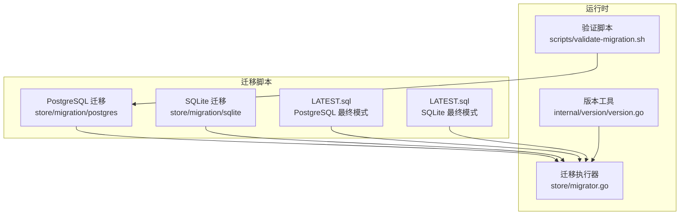
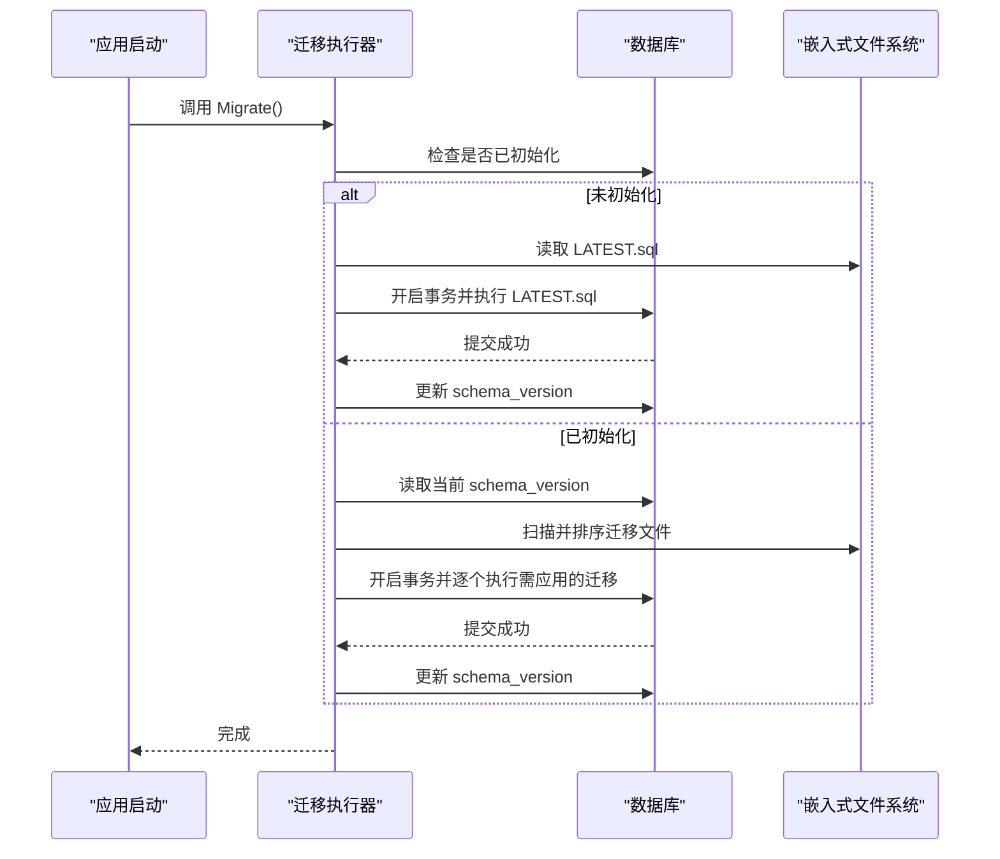
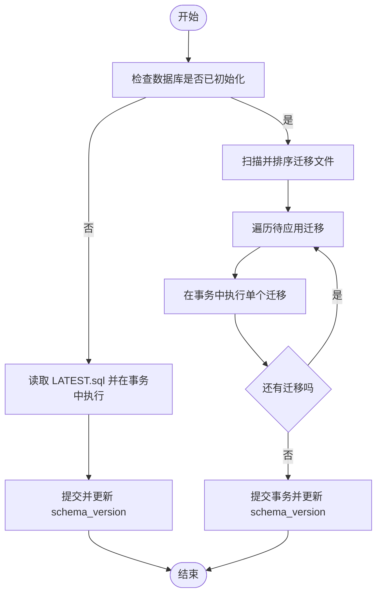
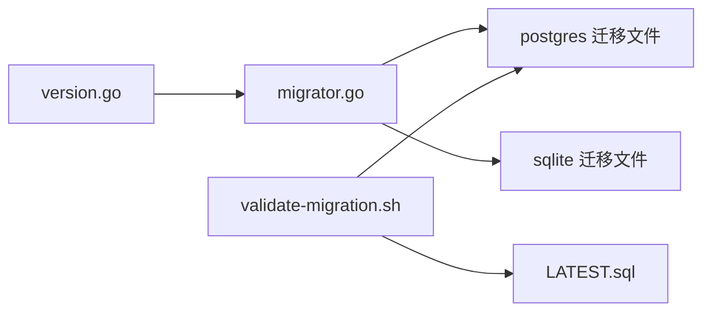

# 数据库迁移管理

<cite>
**本文引用的文件**
- [store/migrator.go](file://store/migrator.go)
- [internal/version/version.go](file://internal/version/version.go)
- [store/migration/postgres/LATEST.sql](file://store/migration/postgres/LATEST.sql)
- [store/migration/postgres/VERSION](file://store/migration/postgres/VERSION)
- [store/migration/postgres/V0.51.0__baseline.sql](file://store/migration/postgres/V0.51.0__baseline.sql)
- [store/migration/postgres/V0.52.0__add_summary_message_type.sql](file://store/migration/postgres/V0.52.0__add_summary_message_type.sql)
- [store/migration/postgres/V0.52__schedule_conflict_constraint.sql](file://store/migration/postgres/V0.52__schedule_conflict_constraint.sql)
- [store/migration/sqlite/LATEST.sql](file://store/migration/sqlite/LATEST.sql)
- [store/migration/sqlite/0.26/00__rename_resource_to_attachment.sql](file://store/migration/sqlite/0.26/00__rename_resource_to_attachment.sql)
- [store/migration/sqlite/0.26/01__drop_memo_organizer.sql](file://store/migration/sqlite/0.26/01__drop_memo_organizer.sql)
- [store/migration/sqlite/0.26/02__drop_indexes.sql](file://store/migration/sqlite/0.26/02__drop_indexes.sql)
- [store/migration/sqlite/0.26/1__add_schedule.sql](file://store/migration/sqlite/0.26/1__add_schedule.sql)
- [store/migration/sqlite/0.26/2__add_ai_chat_persistence.sql](file://store/migration/sqlite/0.26/2__add_ai_chat_persistence.sql)
- [scripts/validate-migration.sh](file://scripts/validate-migration.sh)
- [store/seed/sqlite/01__dump.sql](file://store/seed/sqlite/01__dump.sql)
</cite>

## 目录
1. [简介](#简介)
2. [项目结构](#项目结构)
3. [核心组件](#核心组件)
4. [架构总览](#架构总览)
5. [详细组件分析](#详细组件分析)
6. [依赖关系分析](#依赖关系分析)
7. [性能考量](#性能考量)
8. [故障排查指南](#故障排查指南)
9. [结论](#结论)
10. [附录](#附录)

## 简介
本文件系统化梳理本仓库的数据库迁移管理策略与实现，覆盖版本控制、迁移脚本组织、命名规范与版本号管理、向前迁移与向后回滚机制、迁移验证与测试流程、生产环境最佳实践与风险控制、迁移失败应急处理与数据恢复策略，并给出具体迁移示例与常见场景处理方法。目标是帮助开发者与运维人员在不直接阅读源码的情况下，也能高效理解并正确执行数据库迁移。

## 项目结构
迁移相关的核心位置如下：
- 迁移脚本根目录：store/migration
  - PostgreSQL 迁移：store/migration/postgres
  - SQLite 迁移：store/migration/sqlite
- 迁移执行器：store/migrator.go
- 版本工具：internal/version/version.go
- 验证脚本：scripts/validate-migration.sh
- 种子数据（仅 SQLite 演示）：store/seed/sqlite

图表来源
- [store/migrator.go](file://store/migrator.go#L1-L415)
- [internal/version/version.go](file://internal/version/version.go#L1-L61)
- [store/migration/postgres/LATEST.sql](file://store/migration/postgres/LATEST.sql#L1-L301)
- [store/migration/sqlite/LATEST.sql](file://store/migration/sqlite/LATEST.sql#L1-L135)
- [scripts/validate-migration.sh](file://scripts/validate-migration.sh#L1-L90)

章节来源
- [store/migrator.go](file://store/migrator.go#L1-L415)
- [internal/version/version.go](file://internal/version/version.go#L1-L61)
- [store/migration/postgres/LATEST.sql](file://store/migration/postgres/LATEST.sql#L1-L301)
- [store/migration/sqlite/LATEST.sql](file://store/migration/sqlite/LATEST.sql#L1-L135)
- [scripts/validate-migration.sh](file://scripts/validate-migration.sh#L1-L90)

## 核心组件
- 迁移执行器（store/migrator.go）
  - 负责预迁移（首次安装）、增量迁移应用、版本更新、降级检测、种子数据注入（仅 SQLite 演示）。
  - 使用嵌入式文件系统读取迁移脚本，按路径排序顺序执行，并在单事务中保证原子性。
- 版本工具（internal/version/version.go）
  - 提供当前版本、小版本提取、语义化版本比较等能力，支撑迁移版本判断。
- PostgreSQL 迁移脚本
  - LATEST.sql：新安装时一次性应用的完整模式；包含版本记录。
  - VERSION 文件：声明当前 PostgreSQL 迁移主版本。
  - 增量迁移：以“主版本/补丁编号__描述.sql”组织，如 V0.52__schedule_conflict_constraint.sql。
- SQLite 迁移脚本
  - 采用“小版本/补丁编号__描述.sql”的组织方式，如 0.26/1__add_schedule.sql。
- 验证脚本（scripts/validate-migration.sh）
  - 校验 VERSION 与 LATEST.sql 中 schema_version 一致性、检查特定迁移文件存在性、可选语法校验。

章节来源
- [store/migrator.go](file://store/migrator.go#L1-L415)
- [internal/version/version.go](file://internal/version/version.go#L1-L61)
- [store/migration/postgres/LATEST.sql](file://store/migration/postgres/LATEST.sql#L1-L301)
- [store/migration/postgres/VERSION](file://store/migration/postgres/VERSION#L1-L2)
- [store/migration/postgres/V0.52__schedule_conflict_constraint.sql](file://store/migration/postgres/V0.52__schedule_conflict_constraint.sql#L1-L35)
- [store/migration/sqlite/0.26/1__add_schedule.sql](file://store/migration/sqlite/0.26/1__add_schedule.sql#L1-L58)
- [scripts/validate-migration.sh](file://scripts/validate-migration.sh#L1-L90)

## 架构总览
迁移系统由“版本识别—脚本发现—排序执行—版本更新—异常处理”构成闭环，确保幂等、可追踪、可回滚（部分场景）。

图表来源
- [store/migrator.go](file://store/migrator.go#L105-L146)
- [store/migrator.go](file://store/migrator.go#L220-L264)
- [store/migrator.go](file://store/migrator.go#L148-L218)
- [store/migrator.go](file://store/migrator.go#L357-L372)

## 详细组件分析

### 迁移执行器（store/migrator.go）
- 预迁移（preMigrate）
  - 若数据库未初始化，则一次性应用 LATEST.sql 并更新 schema_version。
- 增量迁移（applyMigrations）
  - 扫描驱动对应的迁移目录，按文件名排序执行。
  - 在单事务中执行，失败自动回滚，成功后更新目标版本。
- 版本判定与比较
  - 使用版本工具进行语义化比较，支持空版本（默认）与降级检测。
- 种子数据（seed）
  - 仅对 SQLite 支持，按文件名排序执行种子 SQL，用于演示环境。

图表来源
- [store/migrator.go](file://store/migrator.go#L148-L218)
- [store/migrator.go](file://store/migrator.go#L220-L264)
- [store/migrator.go](file://store/migrator.go#L357-L372)

章节来源
- [store/migrator.go](file://store/migrator.go#L105-L146)
- [store/migrator.go](file://store/migrator.go#L148-L218)
- [store/migrator.go](file://store/migrator.go#L220-L264)
- [store/migrator.go](file://store/migrator.go#L274-L308)
- [store/migrator.go](file://store/migrator.go#L357-L372)

### 版本工具（internal/version/version.go）
- 当前版本与开发版本常量，区分 prod/dev/demo 模式。
- 小版本提取（如 0.25.1 -> 0.25），用于定位迁移目录。
- 语义化版本比较（>=、>），用于迁移范围判断。

章节来源
- [internal/version/version.go](file://internal/version/version.go#L1-L61)

### PostgreSQL 迁移策略与脚本组织
- LATEST.sql
  - 新安装时一次性应用的完整模式，包含扩展、表、索引、约束、触发器与版本记录。
  - 版本记录通过 system_setting 表维护。
- VERSION
  - 声明当前 PostgreSQL 主版本（如 0.52）。
- 增量迁移
  - 文件命名：V主版本__描述.sql（如 V0.52__schedule_conflict_constraint.sql）。
  - 内容应具备幂等性，可重复执行。
- 典型迁移示例
  - V0.51.0__baseline.sql：从旧版本到 0.51.0 的基线迁移，包含 IF NOT EXISTS 等幂等保障。
  - V0.52.0__add_summary_message_type.sql：为 AI 消息类型新增 SUMMARY 类型。
  - V0.52__schedule_conflict_constraint.sql：添加时间冲突排除约束与索引。

章节来源
- [store/migration/postgres/LATEST.sql](file://store/migration/postgres/LATEST.sql#L1-L301)
- [store/migration/postgres/VERSION](file://store/migration/postgres/VERSION#L1-L2)
- [store/migration/postgres/V0.51.0__baseline.sql](file://store/migration/postgres/V0.51.0__baseline.sql#L1-L127)
- [store/migration/postgres/V0.52.0__add_summary_message_type.sql](file://store/migration/postgres/V0.52.0__add_summary_message_type.sql#L1-L12)
- [store/migration/postgres/V0.52__schedule_conflict_constraint.sql](file://store/migration/postgres/V0.52__schedule_conflict_constraint.sql#L1-L35)

### SQLite 迁移策略与脚本组织
- 组织方式：按小版本分层（如 0.26），每个小版本内以补丁编号递增。
- 示例
  - 0.26/00__rename_resource_to_attachment.sql：重命名资源表并重建索引。
  - 0.26/01__drop_memo_organizer.sql：删除旧表。
  - 0.26/02__drop_indexes.sql：清理冗余索引。
  - 0.26/1__add_schedule.sql：新增日程表及索引与触发器。
  - 0.26/2__add_ai_chat_persistence.sql：新增 AI 对话与消息表。
- LATEST.sql：SQLite 最终模式定义。

章节来源
- [store/migration/sqlite/LATEST.sql](file://store/migration/sqlite/LATEST.sql#L1-L135)
- [store/migration/sqlite/0.26/00__rename_resource_to_attachment.sql](file://store/migration/sqlite/0.26/00__rename_resource_to_attachment.sql#L1-L6)
- [store/migration/sqlite/0.26/01__drop_memo_organizer.sql](file://store/migration/sqlite/0.26/01__drop_memo_organizer.sql#L1-L2)
- [store/migration/sqlite/0.26/02__drop_indexes.sql](file://store/migration/sqlite/0.26/02__drop_indexes.sql#L1-L5)
- [store/migration/sqlite/0.26/1__add_schedule.sql](file://store/migration/sqlite/0.26/1__add_schedule.sql#L1-L58)
- [store/migration/sqlite/0.26/2__add_ai_chat_persistence.sql](file://store/migration/sqlite/0.26/2__add_ai_chat_persistence.sql#L1-L26)

### 迁移验证与测试流程（scripts/validate-migration.sh）
- 校验内容
  - VERSION 文件与 LATEST.sql 中 schema_version 是否一致。
  - 指定版本的迁移文件是否存在。
  - 可选：若存在 psql，执行 parse-only 语法校验。
- 输出
  - 成功/失败提示与警告信息，便于 CI/本地校验。

章节来源
- [scripts/validate-migration.sh](file://scripts/validate-migration.sh#L1-L90)

### 向前迁移与向后回滚机制
- 向前迁移（升级）
  - 通过扫描并排序迁移文件，按需在单事务中执行，成功后更新 schema_version。
- 向后回滚（降级）
  - 迁移执行器会检测目标版本是否低于当前版本，若发生降级则拒绝执行，避免数据丢失。
- 幂等性与安全性
  - 迁移脚本普遍采用 IF NOT EXISTS、IF NOT EXISTS 约束/索引/扩展等，确保重复执行安全。
  - 单事务执行，失败自动回滚。

章节来源
- [store/migrator.go](file://store/migrator.go#L105-L146)
- [store/migrator.go](file://store/migrator.go#L123-L130)
- [store/migration/postgres/V0.51.0__baseline.sql](file://store/migration/postgres/V0.51.0__baseline.sql#L8-L9)
- [store/migration/postgres/V0.52__schedule_conflict_constraint.sql](file://store/migration/postgres/V0.52__schedule_conflict_constraint.sql#L5-L6)

### 生产环境迁移最佳实践与风险控制
- 迁移前
  - 备份数据库（逻辑备份或物理快照）。
  - 在预生产环境复现迁移，验证业务功能。
  - 使用验证脚本进行一致性与语法检查。
- 迁移中
  - 选择低峰时段执行。
  - 严格遵循“单事务执行、失败即回滚”的原则。
  - 监控数据库连接与锁等待情况。
- 迁移后
  - 校验 schema_version 与关键表结构。
  - 运行端到端测试，确保核心接口可用。
  - 观察慢查询与索引使用情况。

章节来源
- [scripts/validate-migration.sh](file://scripts/validate-migration.sh#L1-L90)
- [store/migrator.go](file://store/migrator.go#L148-L218)

### 迁移失败的应急处理与数据恢复
- 应急处理
  - 立即回滚：若迁移处于事务中，回滚即可恢复；若已提交，需准备回滚脚本或依赖备份恢复。
  - 降级保护：禁止降级，防止破坏性变更。
- 数据恢复
  - 优先使用备份恢复；若无备份，评估回滚脚本与手工修复。
- 风险隔离
  - 将大变更拆分为多个小迁移，降低单次风险。
  - 对关键表的变更先在测试环境验证。

章节来源
- [store/migrator.go](file://store/migrator.go#L123-L130)
- [store/migrator.go](file://store/migrator.go#L148-L218)

### 具体迁移示例与常见场景
- 从旧版本升级到 0.51.0 基线
  - 使用 V0.51.0__baseline.sql，该脚本具备幂等性，可重复执行。
- 为 AI 消息新增 SUMMARY 类型
  - 使用 V0.52.0__add_summary_message_type.sql，修改约束并保持兼容。
- 添加日程冲突检测
  - 使用 V0.52__schedule_conflict_constraint.sql，引入排除约束与索引，提升并发一致性。
- SQLite 从早期版本迁移到 0.26
  - 依次执行 rename、drop 表与索引、新增 schedule 与 AI 表等迁移。
- 演示环境初始化
  - 通过种子数据（store/seed/sqlite/01__dump.sql）快速生成演示数据。

章节来源
- [store/migration/postgres/V0.51.0__baseline.sql](file://store/migration/postgres/V0.51.0__baseline.sql#L1-L127)
- [store/migration/postgres/V0.52.0__add_summary_message_type.sql](file://store/migration/postgres/V0.52.0__add_summary_message_type.sql#L1-L12)
- [store/migration/postgres/V0.52__schedule_conflict_constraint.sql](file://store/migration/postgres/V0.52__schedule_conflict_constraint.sql#L1-L35)
- [store/migration/sqlite/0.26/00__rename_resource_to_attachment.sql](file://store/migration/sqlite/0.26/00__rename_resource_to_attachment.sql#L1-L6)
- [store/migration/sqlite/0.26/01__drop_memo_organizer.sql](file://store/migration/sqlite/0.26/01__drop_memo_organizer.sql#L1-L2)
- [store/migration/sqlite/0.26/02__drop_indexes.sql](file://store/migration/sqlite/0.26/02__drop_indexes.sql#L1-L5)
- [store/migration/sqlite/0.26/1__add_schedule.sql](file://store/migration/sqlite/0.26/1__add_schedule.sql#L1-L58)
- [store/migration/sqlite/0.26/2__add_ai_chat_persistence.sql](file://store/migration/sqlite/0.26/2__add_ai_chat_persistence.sql#L1-L26)
- [store/seed/sqlite/01__dump.sql](file://store/seed/sqlite/01__dump.sql#L1-L40)

## 依赖关系分析
- 迁移执行器依赖版本工具进行版本比较与小版本提取。
- 迁移脚本依赖嵌入式文件系统加载，PostgreSQL 与 SQLite 分离。
- 验证脚本依赖 VERSION 与 LATEST.sql 的一致性，以及可选的 psql 语法校验。

图表来源
- [internal/version/version.go](file://internal/version/version.go#L1-L61)
- [store/migrator.go](file://store/migrator.go#L1-L415)
- [scripts/validate-migration.sh](file://scripts/validate-migration.sh#L1-L90)
- [store/migration/postgres/LATEST.sql](file://store/migration/postgres/LATEST.sql#L1-L301)

章节来源
- [internal/version/version.go](file://internal/version/version.go#L1-L61)
- [store/migrator.go](file://store/migrator.go#L1-L415)
- [scripts/validate-migration.sh](file://scripts/validate-migration.sh#L1-L90)

## 性能考量
- 索引与约束
  - PostgreSQL 在新增向量索引、时间范围索引与排除约束时，需关注建表与索引构建的性能影响，建议在低峰期执行。
- 事务粒度
  - 单事务执行迁移，避免中间状态暴露；对于超长迁移，建议拆分步骤。
- 幂等性
  - 使用 IF NOT EXISTS 等保障重复执行的安全性，减少运维成本。

章节来源
- [store/migration/postgres/LATEST.sql](file://store/migration/postgres/LATEST.sql#L46-L49)
- [store/migration/postgres/LATEST.sql](file://store/migration/postgres/LATEST.sql#L145-L150)
- [store/migration/postgres/V0.52__schedule_conflict_constraint.sql](file://store/migration/postgres/V0.52__schedule_conflict_constraint.sql#L19-L30)

## 故障排查指南
- 常见问题
  - 版本不一致：VERSION 与 LATEST.sql 中 schema_version 不匹配。
  - 迁移文件缺失：指定版本的迁移文件不存在。
  - 语法错误：SQL 语法不符合目标数据库方言。
- 排查步骤
  - 使用验证脚本进行一致性与语法检查。
  - 查看迁移执行器日志，确认事务回滚原因。
  - 检查数据库连接与权限，确保可写。

章节来源
- [scripts/validate-migration.sh](file://scripts/validate-migration.sh#L25-L84)
- [store/migrator.go](file://store/migrator.go#L157-L208)

## 结论
本仓库的迁移体系以“版本识别—脚本发现—排序执行—版本更新—异常处理”为核心，结合幂等性设计与单事务保障，实现了 PostgreSQL 与 SQLite 的双栈迁移管理。通过严格的命名规范、版本号管理与验证流程，配合生产环境最佳实践与应急方案，能够有效降低迁移风险，确保系统稳定演进。

## 附录
- 迁移脚本命名规范
  - PostgreSQL：V主版本__描述.sql（如 V0.52__schedule_conflict_constraint.sql）。
  - SQLite：小版本/NN__描述.sql（如 0.26/1__add_schedule.sql）。
- 版本号管理
  - PostgreSQL：VERSION 文件声明主版本；LATEST.sql 记录 schema_version。
  - SQLite：通过小版本目录与补丁编号组织。
- 验证清单
  - 版本一致性检查、迁移文件存在性检查、可选语法检查。

章节来源
- [store/migration/postgres/V0.52__schedule_conflict_constraint.sql](file://store/migration/postgres/V0.52__schedule_conflict_constraint.sql#L1-L35)
- [store/migration/sqlite/0.26/1__add_schedule.sql](file://store/migration/sqlite/0.26/1__add_schedule.sql#L1-L58)
- [store/migration/postgres/VERSION](file://store/migration/postgres/VERSION#L1-L2)
- [store/migration/postgres/LATEST.sql](file://store/migration/postgres/LATEST.sql#L298-L301)
- [scripts/validate-migration.sh](file://scripts/validate-migration.sh#L43-L66)