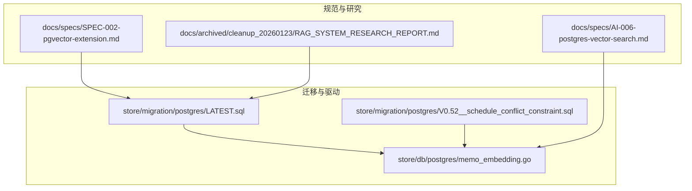
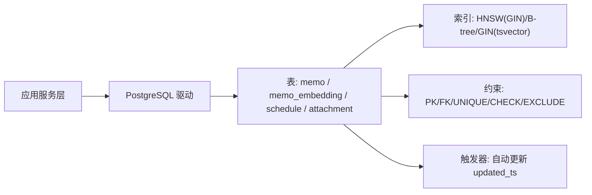
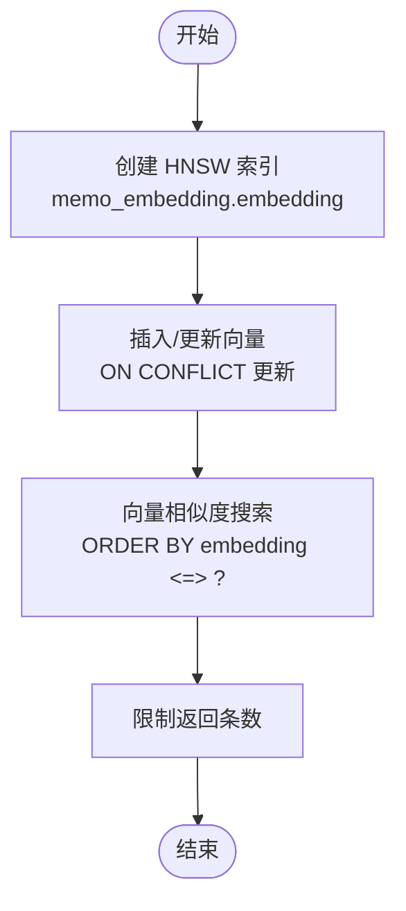
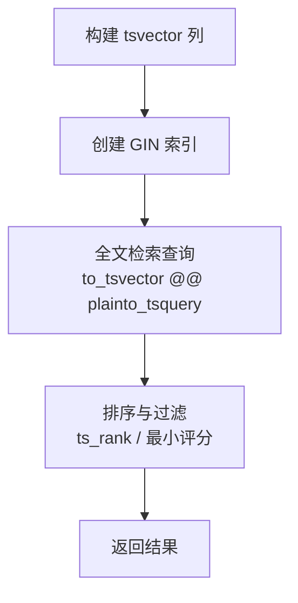
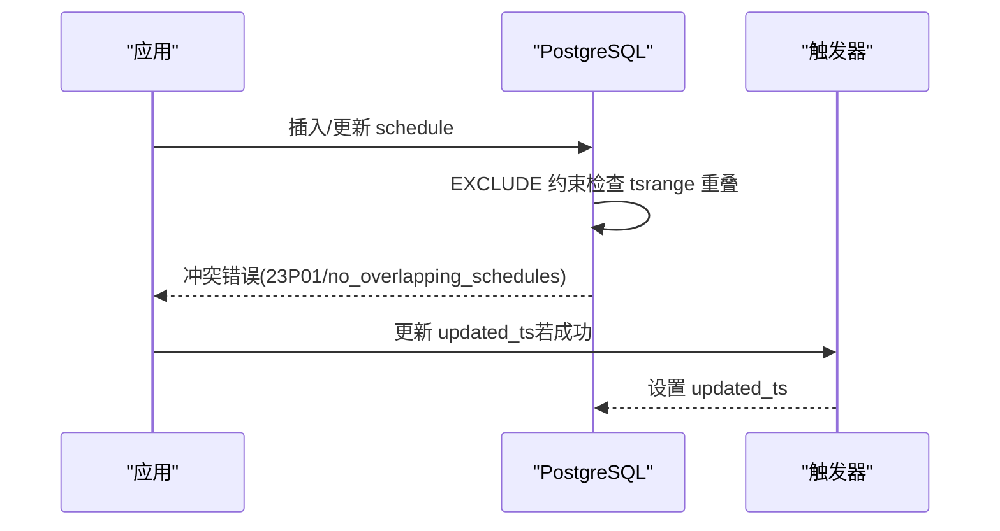
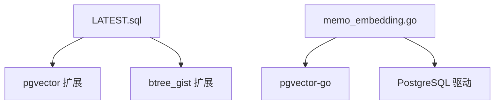
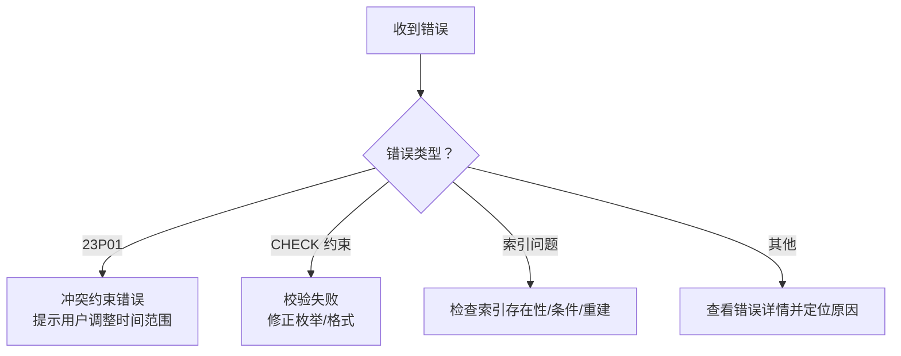

# 索引与约束策略

<cite>
**本文引用的文件**
- [store/migration/postgres/LATEST.sql](file://store/migration/postgres/LATEST.sql)
- [store/migration/postgres/V0.52__schedule_conflict_constraint.sql](file://store/migration/postgres/V0.52__schedule_conflict_constraint.sql)
- [store/db/postgres/memo_embedding.go](file://store/db/postgres/memo_embedding.go)
- [docs/specs/AI-006-postgres-vector-search.md](file://docs/specs/AI-006-postgres-vector-search.md)
- [docs/specs/SPEC-002-pgvector-extension.md](file://docs/specs/SPEC-002-pgvector-extension.md)
- [docs/archived/cleanup_20260123/RAG_SYSTEM_RESEARCH_REPORT.md](file://docs/archived/cleanup_20260123/RAG_SYSTEM_RESEARCH_REPORT.md)
- [store/db/postgres/schedule.go](file://store/db/postgres/schedule.go)
- [scripts/validate-migration.sh](file://scripts/validate-migration.sh)
</cite>

## 目录
1. [简介](#简介)
2. [项目结构](#项目结构)
3. [核心组件](#核心组件)
4. [架构总览](#架构总览)
5. [详细组件分析](#详细组件分析)
6. [依赖关系分析](#依赖关系分析)
7. [性能考量](#性能考量)
8. [故障排查指南](#故障排查指南)
9. [结论](#结论)
10. [附录](#附录)

## 简介
本文件系统性梳理本仓库中的索引与约束策略，覆盖以下主题：
- 索引类型与设计：B-tree、HNSW 向量索引、GIN 全文索引、复合索引与部分索引
- 约束策略：主键、外键、唯一、检查、排除（EXCLUDE）约束
- 触发器：自动更新时间戳等自动化行为
- 查询优化与索引维护：索引参数、部分索引、回滚与验证
- 实践建议：索引性能分析、查询计划优化技巧、索引维护与重建最佳实践

## 项目结构
本项目的数据库层采用 PostgreSQL，迁移脚本集中于 store/migration/postgres，驱动实现位于 store/db/postgres，相关规范与研究文档位于 docs/specs 与 docs/archived。

图表来源
- [store/migration/postgres/LATEST.sql](file://store/migration/postgres/LATEST.sql#L1-L301)
- [store/migration/postgres/V0.52__schedule_conflict_constraint.sql](file://store/migration/postgres/V0.52__schedule_conflict_constraint.sql#L1-L35)
- [store/db/postgres/memo_embedding.go](file://store/db/postgres/memo_embedding.go#L1-L333)
- [docs/specs/SPEC-002-pgvector-extension.md](file://docs/specs/SPEC-002-pgvector-extension.md#L1-L140)
- [docs/specs/AI-006-postgres-vector-search.md](file://docs/specs/AI-006-postgres-vector-search.md#L1-L170)
- [docs/archived/cleanup_20260123/RAG_SYSTEM_RESEARCH_REPORT.md](file://docs/archived/cleanup_20260123/RAG_SYSTEM_RESEARCH_REPORT.md#L745-L1431)

章节来源
- [store/migration/postgres/LATEST.sql](file://store/migration/postgres/LATEST.sql#L1-L301)
- [store/migration/postgres/V0.52__schedule_conflict_constraint.sql](file://store/migration/postgres/V0.52__schedule_conflict_constraint.sql#L1-L35)
- [store/db/postgres/memo_embedding.go](file://store/db/postgres/memo_embedding.go#L1-L333)
- [docs/specs/SPEC-002-pgvector-extension.md](file://docs/specs/SPEC-002-pgvector-extension.md#L1-L140)
- [docs/specs/AI-006-postgres-vector-search.md](file://docs/specs/AI-006-postgres-vector-search.md#L1-L170)
- [docs/archived/cleanup_20260123/RAG_SYSTEM_RESEARCH_REPORT.md](file://docs/archived/cleanup_20260123/RAG_SYSTEM_RESEARCH_REPORT.md#L745-L1431)

## 核心组件
- 表与索引
  - memo 表：包含 embedding 向量字段，创建 HNSW 索引以支持向量相似度搜索
  - memo_embedding 表：独立存储向量，建立 HNSW 索引与多维索引
  - schedule 表：使用 EXCLUDE 约束配合 GIST 索引防止重叠冲突；同时具备多组 B-tree 复合索引
  - attachment 表：包含 GIN 全文检索索引，用于提取文本与 OCR 文本的检索
- 约束
  - 主键：各表的 id 使用自增主键
  - 外键：memo_embedding.memo_id 引用 memo.id，CASCADE 删除
  - 唯一：username、memo_relation(memo_id, related_memo_id, type)、memo_embedding(memo_id, model)
  - 检查：attachment.row_status、schedule 的时间范围与提醒字段格式校验
  - 排除：schedule 的 no_overlapping_schedules 使用 GIST tsrange 排除重叠
- 触发器
  - schedule、memo_embedding、ai_conversation 等表在更新时自动更新 updated_ts

章节来源
- [store/migration/postgres/LATEST.sql](file://store/migration/postgres/LATEST.sql#L31-L192)
- [store/migration/postgres/LATEST.sql](file://store/migration/postgres/LATEST.sql#L127-L163)
- [store/migration/postgres/LATEST.sql](file://store/migration/postgres/LATEST.sql#L165-L235)
- [store/migration/postgres/LATEST.sql](file://store/migration/postgres/LATEST.sql#L79-L86)
- [store/migration/postgres/V0.52__schedule_conflict_constraint.sql](file://store/migration/postgres/V0.52__schedule_conflict_constraint.sql#L8-L30)

## 架构总览
数据库层通过迁移脚本定义表结构与索引，驱动层提供向量检索、全文检索与业务查询接口；约束与触发器保障数据一致性与自动化。

图表来源
- [store/migration/postgres/LATEST.sql](file://store/migration/postgres/LATEST.sql#L31-L192)
- [store/db/postgres/memo_embedding.go](file://store/db/postgres/memo_embedding.go#L111-L192)

## 详细组件分析

### B-tree 索引
- 设计要点
  - 复合索引：(creator_id, start_ts)、(creator_id, row_status)、(uid)、(updated_ts DESC)
  - 部分索引：仅对 NORMAL 状态或特定时间范围内的记录建立索引，减少维护成本
- 应用场景
  - 按用户与时间范围查询日程
  - 按唯一标识查询
  - 按更新时间倒序查询
- 性能建议
  - 保持索引列顺序与查询谓词一致
  - 对高频过滤列优先建复合索引
  - 使用部分索引限定热点数据

章节来源
- [store/migration/postgres/LATEST.sql](file://store/migration/postgres/LATEST.sql#L194-L197)
- [store/migration/postgres/LATEST.sql](file://store/migration/postgres/LATEST.sql#L194-L197)
- [store/migration/postgres/LATEST.sql](file://store/migration/postgres/LATEST.sql#L256-L257)
- [store/migration/postgres/LATEST.sql](file://store/migration/postgres/LATEST.sql#L83-L85)

### HNSW 向量索引
- 设计要点
  - 使用 pgvector 扩展，向量维度与模型匹配
  - HNSW 索引参数：m、ef_construction 针对内存与吞吐权衡
  - 索引类型：向量余弦距离（cosine_ops），支持快速近似最近邻搜索
- 应用场景
  - 语义检索：基于向量相似度排序
  - 多模型向量：memo_embedding 表按 (memo_id, model) 唯一
- 性能建议
  - 选择合适的 m/ef_construction 参数
  - 使用向量压缩（PQ）降低内存占用（如适用）
  - 控制查询返回条数，避免全表扫描

图表来源
- [store/migration/postgres/LATEST.sql](file://store/migration/postgres/LATEST.sql#L145-L147)
- [store/db/postgres/memo_embedding.go](file://store/db/postgres/memo_embedding.go#L15-L42)
- [store/db/postgres/memo_embedding.go](file://store/db/postgres/memo_embedding.go#L111-L192)
- [docs/specs/SPEC-002-pgvector-extension.md](file://docs/specs/SPEC-002-pgvector-extension.md#L137-L140)

章节来源
- [store/migration/postgres/LATEST.sql](file://store/migration/postgres/LATEST.sql#L127-L163)
- [store/db/postgres/memo_embedding.go](file://store/db/postgres/memo_embedding.go#L111-L192)
- [docs/specs/SPEC-002-pgvector-extension.md](file://docs/specs/SPEC-002-pgvector-extension.md#L1-L140)
- [docs/specs/AI-006-postgres-vector-search.md](file://docs/specs/AI-006-postgres-vector-search.md#L1-L170)

### GIN 全文索引
- 设计要点
  - 使用 to_tsvector('simple', ...) 构建 tsvector，支持中英混排
  - GIN 索引加速 @@ 搜索与 ts_rank 排序
  - 可选：fastupdate 优化更新性能
- 应用场景
  - memo.content 的全文检索与 BM25 排序
  - attachment.extracted_text 与 ocr_text 的检索
- 性能建议
  - 针对 NORMAL 状态或近期数据建立部分索引
  - 使用 'simple' 配置提升多语言支持
  - 控制最小评分阈值，减少无关结果

图表来源
- [store/migration/postgres/LATEST.sql](file://store/migration/postgres/LATEST.sql#L82-L86)
- [store/db/postgres/memo_embedding.go](file://store/db/postgres/memo_embedding.go#L259-L332)
- [docs/archived/cleanup_20260123/RAG_SYSTEM_RESEARCH_REPORT.md](file://docs/archived/cleanup_20260123/RAG_SYSTEM_RESEARCH_REPORT.md#L745-L793)

章节来源
- [store/migration/postgres/LATEST.sql](file://store/migration/postgres/LATEST.sql#L82-L86)
- [store/db/postgres/memo_embedding.go](file://store/db/postgres/memo_embedding.go#L259-L332)
- [docs/archived/cleanup_20260123/RAG_SYSTEM_RESEARCH_REPORT.md](file://docs/archived/cleanup_20260123/RAG_SYSTEM_RESEARCH_REPORT.md#L745-L793)

### 复合索引设计原则与查询优化效果
- 设计原则
  - 将选择性高的列放在前面
  - 与 WHERE/ORDER BY/JOIN 的列顺序一致
  - 针对热点查询建立复合索引
- 查询优化效果
  - 减少索引扫描与回表次数
  - 提升排序与过滤效率
  - 降低全表扫描概率

章节来源
- [store/migration/postgres/LATEST.sql](file://store/migration/postgres/LATEST.sql#L194-L197)
- [store/migration/postgres/LATEST.sql](file://store/migration/postgres/LATEST.sql#L256-L257)

### 排除约束（EXCLUDE）与冲突检测
- 设计要点
  - 使用 btree_gist 扩展，结合 GIST tsrange 排除重叠时间区间
  - 仅对 NORMAL 状态生效，避免归档/删除记录参与冲突检测
- 应用场景
  - 防止同一用户在同一时间段内存在重叠日程
- 错误处理
  - 识别 SQLSTATE 23P01（exclusion_violation）与约束名，区分业务异常与系统错误

图表来源
- [store/migration/postgres/LATEST.sql](file://store/migration/postgres/LATEST.sql#L199-L222)
- [store/db/postgres/schedule.go](file://store/db/postgres/schedule.go#L300-L326)

章节来源
- [store/migration/postgres/LATEST.sql](file://store/migration/postgres/LATEST.sql#L199-L222)
- [store/db/postgres/schedule.go](file://store/db/postgres/schedule.go#L300-L326)

### 约束策略
- 主键约束
  - 各表 id 使用自增主键，确保行唯一性
- 外键约束
  - memo_embedding.memo_id -> memo.id，ON DELETE CASCADE
- 唯一约束
  - 用户名唯一、memo_relation(memo_id, related_memo_id, type) 唯一、memo_embedding(memo_id, model) 唯一
- 检查约束
  - attachment.row_status 限定枚举值
  - schedule.end_ts >= start_ts；提醒字段格式校验
- 排除约束
  - schedule.no_overlapping_schedules 防止重叠

章节来源
- [store/migration/postgres/LATEST.sql](file://store/migration/postgres/LATEST.sql#L8-L21)
- [store/migration/postgres/LATEST.sql](file://store/migration/postgres/LATEST.sql#L137-L142)
- [store/migration/postgres/LATEST.sql](file://store/migration/postgres/LATEST.sql#L184-L191)
- [store/migration/postgres/LATEST.sql](file://store/migration/postgres/LATEST.sql#L202-L208)

### 触发器机制
- 自动更新 updated_ts
  - schedule、memo_embedding、ai_conversation 在 UPDATE 前设置 updated_ts
- 作用
  - 无需业务层重复维护时间戳
  - 保证审计与排序一致性

章节来源
- [store/migration/postgres/LATEST.sql](file://store/migration/postgres/LATEST.sql#L224-L235)
- [store/migration/postgres/LATEST.sql](file://store/migration/postgres/LATEST.sql#L152-L163)
- [store/migration/postgres/LATEST.sql](file://store/migration/postgres/LATEST.sql#L282-L294)

## 依赖关系分析
- 迁移脚本依赖
  - pgvector 扩展：向量索引与相似度运算
  - btree_gist 扩展：EXCLUDE 约束与 GIST tsrange
- 驱动层依赖
  - pgvector-go：向量序列化与反序列化
  - PostgreSQL 驱动：查询执行与错误码解析

图表来源
- [store/migration/postgres/LATEST.sql](file://store/migration/postgres/LATEST.sql#L128-L129)
- [store/migration/postgres/LATEST.sql](file://store/migration/postgres/LATEST.sql#L200)
- [store/db/postgres/memo_embedding.go](file://store/db/postgres/memo_embedding.go#L8-L13)

章节来源
- [store/migration/postgres/LATEST.sql](file://store/migration/postgres/LATEST.sql#L128-L129)
- [store/migration/postgres/LATEST.sql](file://store/migration/postgres/LATEST.sql#L200)
- [store/db/postgres/memo_embedding.go](file://store/db/postgres/memo_embedding.go#L8-L13)

## 性能考量
- 索引参数与代价
  - HNSW：m、ef_construction 影响构建速度与查询精度；内存与吞吐需平衡
  - GIN：fastupdate 优化更新成本；tsvector 构建成本与查询收益权衡
- 部分索引与分区
  - 仅索引 NORMAL 状态或近期数据，显著降低索引大小与维护开销
- 查询计划优化技巧
  - 保持 WHERE/ORDER BY 与索引列顺序一致
  - 使用 LIMIT 控制返回规模
  - 对高频过滤列建立复合索引
- 索引维护与重建最佳实践
  - 定期评估索引选择性与使用率，淘汰低效索引
  - 使用并发索引创建（CREATE INDEX CONCURRENTLY）降低锁竞争
  - 对大表重建索引时规划维护窗口，避免高峰时段
  - 回滚脚本应包含索引与扩展的清理步骤

章节来源
- [docs/specs/SPEC-002-pgvector-extension.md](file://docs/specs/SPEC-002-pgvector-extension.md#L137-L140)
- [docs/archived/cleanup_20260123/RAG_SYSTEM_RESEARCH_REPORT.md](file://docs/archived/cleanup_20260123/RAG_SYSTEM_RESEARCH_REPORT.md#L745-L793)
- [store/migration/postgres/LATEST.sql](file://store/migration/postgres/LATEST.sql#L194-L197)

## 故障排查指南
- 冲突约束错误
  - 现象：插入/更新 schedule 报错，SQLSTATE 为 23P01 或错误消息包含 no_overlapping_schedules
  - 处理：捕获该错误并提示用户调整时间范围或取消重叠日程
- 约束校验失败
  - 现象：插入 attachment 或 schedule 时违反 CHECK 约束
  - 处理：检查枚举值与字段格式是否符合约束定义
- 索引缺失或失效
  - 现象：查询变慢或无法命中索引
  - 处理：确认索引是否存在、是否被部分索引条件过滤、是否需要重建
- 迁移一致性
  - 验证：使用 validate-migration.sh 检查版本与迁移文件一致性

图表来源
- [store/db/postgres/schedule.go](file://store/db/postgres/schedule.go#L300-L326)
- [scripts/validate-migration.sh](file://scripts/validate-migration.sh#L49-L89)

章节来源
- [store/db/postgres/schedule.go](file://store/db/postgres/schedule.go#L300-L326)
- [scripts/validate-migration.sh](file://scripts/validate-migration.sh#L49-L89)

## 结论
本项目在 PostgreSQL 上实现了完善的索引与约束体系：HNSW 向量索引支撑语义检索，B-tree 与 GIN 索引覆盖时间与全文检索场景，EXCLUDE 约束与触发器保障数据一致性与自动化。通过部分索引与参数优化，兼顾性能与维护成本。建议持续关注索引使用情况，结合查询计划与业务负载进行迭代优化。

## 附录
- 相关规范与研究
  - pgvector 扩展启用与向量索引参数
  - 全文检索 GIN 索引优化与 fastupdate
  - 向量压缩（PQ）与查询成本优化
- 回滚与验证
  - 回滚脚本包含索引、扩展与表结构清理
  - 迁移验证脚本确保版本一致性与语法正确性

章节来源
- [docs/specs/SPEC-002-pgvector-extension.md](file://docs/specs/SPEC-002-pgvector-extension.md#L128-L135)
- [docs/archived/cleanup_20260123/RAG_SYSTEM_RESEARCH_REPORT.md](file://docs/archived/cleanup_20260123/RAG_SYSTEM_RESEARCH_REPORT.md#L745-L793)
- [scripts/validate-migration.sh](file://scripts/validate-migration.sh#L49-L89)