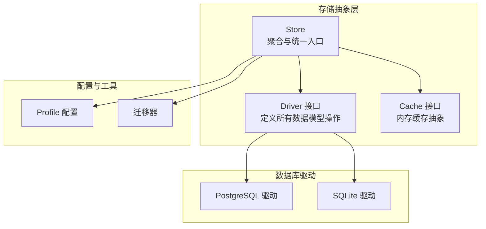
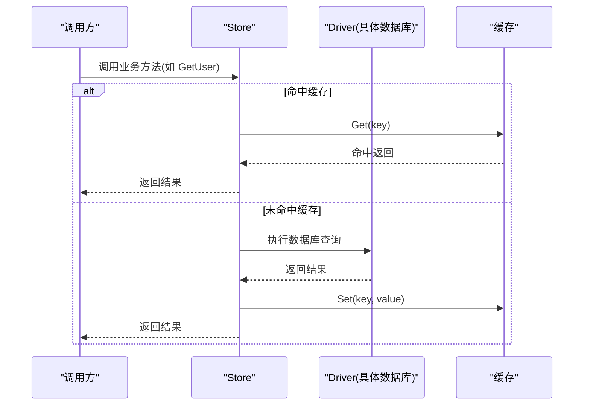
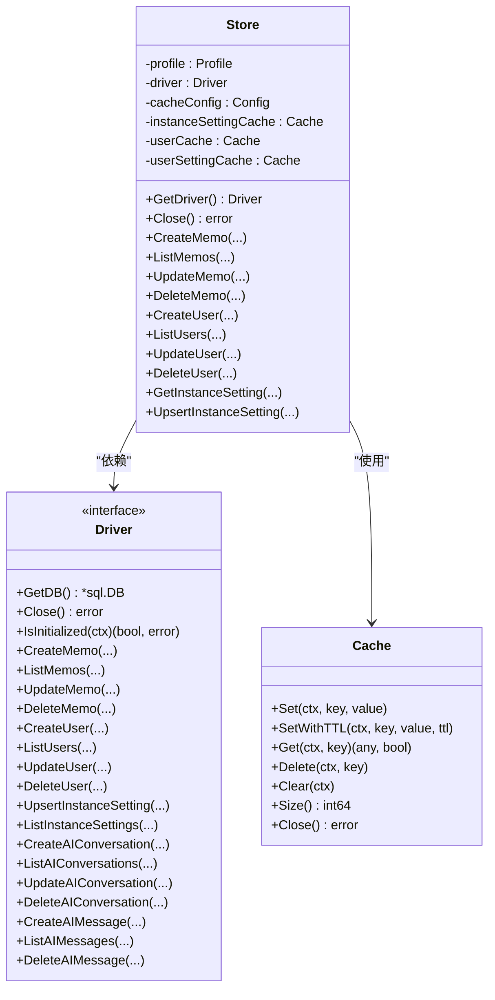
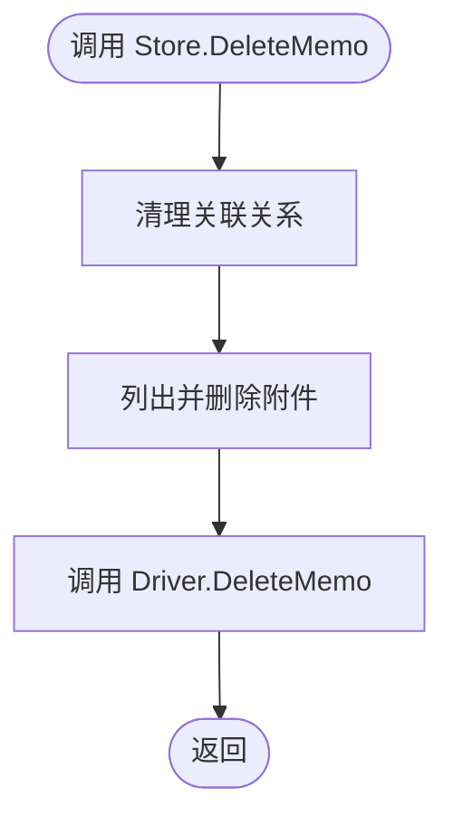
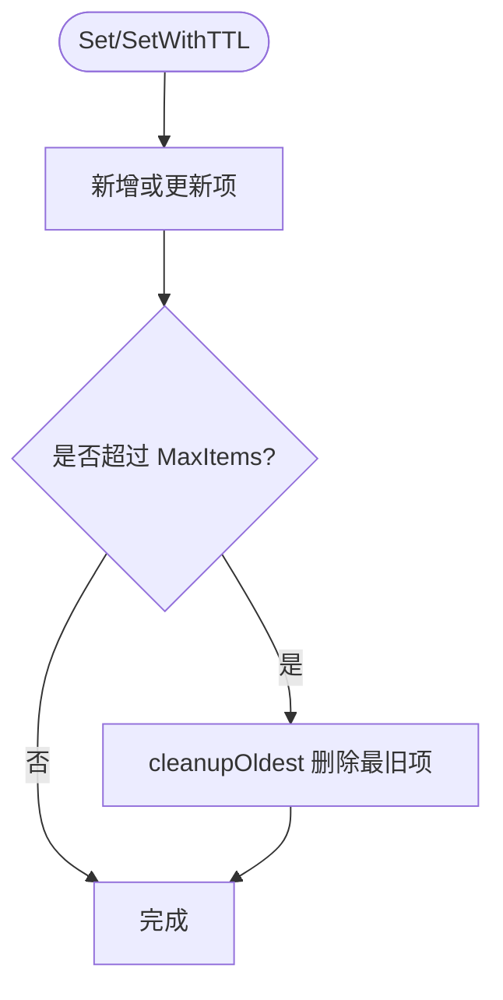
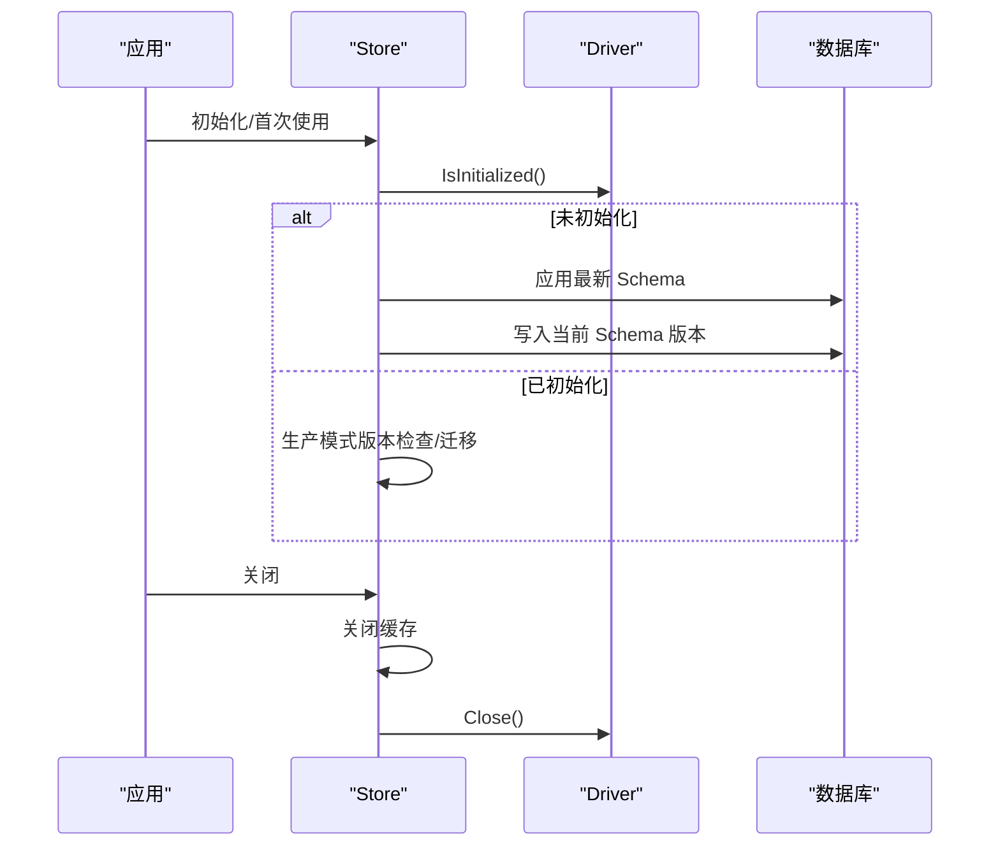
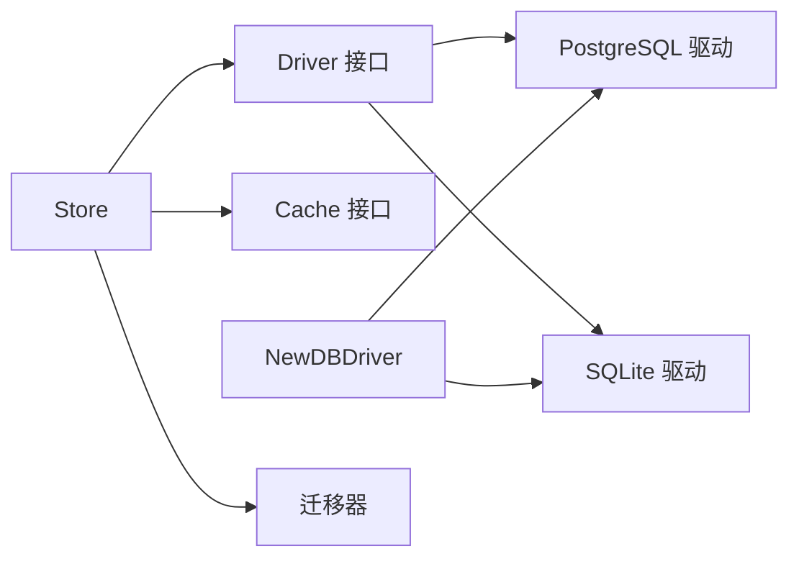

# 存储抽象层

<cite>
**本文引用的文件**
- [store/store.go](file://store/store.go)
- [store/driver.go](file://store/driver.go)
- [store/cache.go](file://store/cache.go)
- [store/db/db.go](file://store/db/db.go)
- [store/cache/cache.go](file://store/cache/cache.go)
- [store/memo.go](file://store/memo.go)
- [store/user.go](file://store/user.go)
- [store/instance_setting.go](file://store/instance_setting.go)
- [store/migrator.go](file://store/migrator.go)
- [store/db/postgres/postgres.go](file://store/db/postgres/postgres.go)
- [store/db/sqlite/sqlite.go](file://store/db/sqlite/sqlite.go)
- [internal/profile/profile.go](file://internal/profile/profile.go)
</cite>

## 目录
1. [简介](#简介)
2. [项目结构](#项目结构)
3. [核心组件](#核心组件)
4. [架构总览](#架构总览)
5. [详细组件分析](#详细组件分析)
6. [依赖关系分析](#依赖关系分析)
7. [性能考量](#性能考量)
8. [故障排查指南](#故障排查指南)
9. [结论](#结论)
10. [附录](#附录)

## 简介
本文件系统性梳理存储抽象层的设计与实现，重点围绕 Store 结构体的设计理念、通过 Driver 接口实现的数据库无关访问、统一的 CRUD 接口模式、缓存配置与管理机制（默认 TTL、清理间隔、最大项数），以及存储层初始化与生命周期管理（连接池与资源清理）进行深入解析。目标是帮助开发者在不关心底层数据库实现的情况下，稳定地扩展与维护数据访问层。

## 项目结构
存储抽象层位于 store 包中，采用“接口隔离 + 多驱动实现”的分层设计：
- 抽象层：Driver 接口定义所有数据模型的 CRUD 与高级能力（如向量检索、混合搜索等）
- 实现层：PostgreSQL 与 SQLite 驱动分别实现 Driver 接口
- 聚合层：Store 将 Driver 与缓存组合，提供统一的业务访问入口，并负责迁移与初始化流程
- 缓存层：独立的内存缓存模块，支持 TTL、定期清理、逐出回调与并发安全

图表来源
- [store/store.go](file://store/store.go#L11-L23)
- [store/driver.go](file://store/driver.go#L10-L102)
- [store/db/db.go](file://store/db/db.go#L27-L44)
- [store/cache/cache.go](file://store/cache/cache.go#L10-L32)
- [store/migrator.go](file://store/migrator.go#L220-L264)
- [internal/profile/profile.go](file://internal/profile/profile.go#L14-L57)

章节来源
- [store/store.go](file://store/store.go#L11-L23)
- [store/driver.go](file://store/driver.go#L10-L102)
- [store/db/db.go](file://store/db/db.go#L27-L44)
- [store/cache/cache.go](file://store/cache/cache.go#L10-L32)
- [store/migrator.go](file://store/migrator.go#L220-L264)
- [internal/profile/profile.go](file://internal/profile/profile.go#L14-L57)

## 核心组件
- Store：聚合层核心，持有 Driver 与缓存实例，封装统一的 CRUD 方法，并负责初始化、迁移与关闭
- Driver：数据库无关的抽象接口，覆盖多模型的增删改查与高级检索能力
- Cache：线程安全的内存缓存，支持 TTL、定期清理、逐出回调与容量控制
- 驱动工厂：根据 Profile 配置选择 PostgreSQL 或 SQLite 驱动
- 迁移器：负责数据库初始化、版本检查与迁移执行

章节来源
- [store/store.go](file://store/store.go#L11-L23)
- [store/driver.go](file://store/driver.go#L10-L102)
- [store/cache/cache.go](file://store/cache/cache.go#L66-L73)
- [store/db/db.go](file://store/db/db.go#L27-L44)
- [store/migrator.go](file://store/migrator.go#L220-L264)

## 架构总览
存储抽象层通过 Driver 接口屏蔽数据库差异，Store 作为门面统一对外暴露 CRUD 与业务方法；缓存层对热点数据进行透明加速；迁移器确保数据库 Schema 的一致性与可升级性。

图表来源
- [store/user.go](file://store/user.go#L128-L152)
- [store/cache/cache.go](file://store/cache/cache.go#L122-L147)
- [store/store.go](file://store/store.go#L11-L23)

## 详细组件分析

### Store 设计理念与职责
- 统一入口：将 Driver 与缓存组合，提供一致的业务方法签名
- 生命周期管理：负责缓存 goroutine 的启动与关闭、Driver 的关闭
- 初始化与迁移：在首次使用前检查数据库初始化状态并执行迁移
- 数据无关：通过 Driver 接口屏蔽 PostgreSQL 与 SQLite 的差异

图表来源
- [store/store.go](file://store/store.go#L11-L23)
- [store/driver.go](file://store/driver.go#L10-L102)
- [store/cache/cache.go](file://store/cache/cache.go#L66-L73)

章节来源
- [store/store.go](file://store/store.go#L11-L23)
- [store/driver.go](file://store/driver.go#L10-L102)
- [store/cache/cache.go](file://store/cache/cache.go#L66-L73)

### Driver 接口与数据库无关访问
- Driver 定义了所有数据模型的 CRUD 与高级能力，包括用户、备忘录、实例设置、AI 对话与消息等
- Store 通过委派到 Driver 实现数据库无关访问，业务层无需感知底层实现
- 支持初始化检测与连接池配置，确保不同数据库的一致行为

章节来源
- [store/driver.go](file://store/driver.go#L10-L102)
- [store/store.go](file://store/store.go#L60-L86)

### 统一 CRUD 接口模式
- Store 在各模型上提供 Create/List/Get/Update/Delete 等方法，内部直接委派给 Driver
- 以用户模型为例，GetUser 先尝试从缓存命中，未命中则查询 Driver 并回填缓存
- 以备忘录模型为例，DeleteMemo 在删除主记录前清理关联关系与附件，体现跨表一致性

图表来源
- [store/memo.go](file://store/memo.go#L140-L159)

章节来源
- [store/memo.go](file://store/memo.go#L109-L159)
- [store/user.go](file://store/user.go#L128-L152)

### 缓存配置与管理机制
- 默认配置：默认 TTL 10 分钟、清理间隔 5 分钟、最大项数 1000
- 清理策略：定时器周期清理过期项；当超过最大项数时，按“最旧优先”逐出 20% 的项
- 并发安全：基于 sync.Map 与原子计数，保证高并发下的正确性
- 生命周期：Close 会停止清理 goroutine 并等待退出，确保资源释放

图表来源
- [store/cache/cache.go](file://store/cache/cache.go#L97-L120)
- [store/cache/cache.go](file://store/cache/cache.go#L252-L313)

章节来源
- [store/cache/cache.go](file://store/cache/cache.go#L41-L64)
- [store/cache/cache.go](file://store/cache/cache.go#L97-L120)
- [store/cache/cache.go](file://store/cache/cache.go#L252-L313)

### 存储层初始化与生命周期管理
- 初始化检查：preMigrate 在首次使用前检查数据库是否已初始化，未初始化则应用最新 Schema 并写入当前版本
- 版本迁移：生产模式下检查最小升级版本，防止降级；演示模式下执行种子数据导入
- 连接池管理：PostgreSQL 使用较小连接池（单用户场景优化），SQLite 使用 WAL 模式与单连接配置
- 资源清理：Store.Close 关闭所有缓存与 Driver，确保 goroutine 与数据库连接被正确释放

图表来源
- [store/migrator.go](file://store/migrator.go#L220-L264)
- [store/store.go](file://store/store.go#L51-L58)
- [store/db/postgres/postgres.go](file://store/db/postgres/postgres.go#L51-L57)
- [store/db/sqlite/sqlite.go](file://store/db/sqlite/sqlite.go#L71-L77)

章节来源
- [store/migrator.go](file://store/migrator.go#L113-L145)
- [store/migrator.go](file://store/migrator.go#L220-L264)
- [store/store.go](file://store/store.go#L51-L58)
- [store/db/postgres/postgres.go](file://store/db/postgres/postgres.go#L51-L57)
- [store/db/sqlite/sqlite.go](file://store/db/sqlite/sqlite.go#L71-L77)

### 实例设置缓存与默认值策略
- 缓存键：实例设置按名称键缓存，避免重复读取
- 默认值填充：若数据库未配置某些字段，则在返回前填充默认值（如存储类型、上传大小限制、文件路径模板等）
- 原子化更新：UpsertInstanceSetting 成功后回填缓存，保证后续读取命中

章节来源
- [store/instance_setting.go](file://store/instance_setting.go#L26-L58)
- [store/instance_setting.go](file://store/instance_setting.go#L81-L100)
- [store/instance_setting.go](file://store/instance_setting.go#L181-L207)

## 依赖关系分析
- Store 依赖 Driver 接口，从而与具体数据库实现解耦
- Store 依赖缓存模块，对热点数据进行透明加速
- 驱动工厂根据 Profile 驱动类型创建 PostgreSQL 或 SQLite 驱动
- 迁移器依赖 Driver 的 GetDB 与 IsInitialized 能力

图表来源
- [store/store.go](file://store/store.go#L11-L23)
- [store/driver.go](file://store/driver.go#L10-L102)
- [store/db/db.go](file://store/db/db.go#L27-L44)
- [store/migrator.go](file://store/migrator.go#L220-L264)

章节来源
- [store/store.go](file://store/store.go#L11-L23)
- [store/driver.go](file://store/driver.go#L10-L102)
- [store/db/db.go](file://store/db/db.go#L27-L44)
- [store/migrator.go](file://store/migrator.go#L220-L264)

## 性能考量
- 缓存命中率：对高频读取（如用户、实例设置）建议结合业务场景评估缓存命中率，必要时调整 TTL 与最大项数
- 清理频率：默认 5 分钟一次的清理频率适合低并发场景；高并发下可考虑缩短清理间隔以降低过期项滞留
- 内存占用估算：缓存对每条记录估算近似大小，超限逐出策略有助于控制内存峰值
- 连接池：PostgreSQL 单用户场景使用较小连接池，SQLite 使用 WAL 模式与单连接，减少锁竞争与资源消耗

## 故障排查指南
- 初始化失败：检查数据库连接字符串与权限，确认 IsInitialized 能正常探测
- 迁移异常：查看迁移日志与版本比较逻辑，避免降级；生产环境需满足最低升级版本要求
- 缓存异常：确认清理 goroutine 是否正常运行，Close 是否被调用导致提前退出
- 驱动选择错误：确认 Profile.Driver 设置为 "sqlite" 或 "postgres"，否则会报未知驱动错误

章节来源
- [store/db/db.go](file://store/db/db.go#L37-L43)
- [store/migrator.go](file://store/migrator.go#L113-L145)
- [store/store.go](file://store/store.go#L51-L58)
- [store/cache/cache.go](file://store/cache/cache.go#L186-L197)

## 结论
存储抽象层通过 Driver 接口实现了数据库无关的数据访问，Store 作为聚合层提供了统一的 CRUD 与业务方法，并内置缓存与迁移能力。合理的缓存配置与生命周期管理，配合严格的初始化与迁移策略，使得该层在单用户场景下具备良好的稳定性与可维护性。建议在扩展新功能时遵循现有接口模式，保持对缓存与迁移的兼容性。

## 附录
- 配置项参考：Profile 中包含运行模式、绑定地址、数据目录、DSN、驱动类型等关键配置
- 缓存配置参考：默认 TTL、清理间隔、最大项数与逐出回调均可按需调整

章节来源
- [internal/profile/profile.go](file://internal/profile/profile.go#L14-L57)
- [store/cache/cache.go](file://store/cache/cache.go#L41-L64)